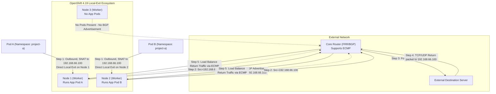

# 基于 BGP、OVN 与 Egress Service 的分布式 Egress IP 方案 (OpenShift 4.19)

## 1. 背景与痛点
在大型容需部署的集群环境中，当存在大量外部通信（Egress）需求时，传统的 Egress IP 架构存在明显的设计瓶颈：
- **单节点流量瓶颈**：传统的方案使用 `EgressIP` CRD，会将某个 Egress IP 绑定到特定的一个或多个托管节点（Hosted Node）。这意味着，即使一个业务的 Pod 广泛分布在集群所有节点，其出站流量也必须统一“绕道”发送至该托管节点才能向外网发包。当存在数百个 Egress IP 和大流量跨节点路由时，被选作出口的节点在网卡带宽和 CPU 解析上会很快达到上限。
- **网络跳数增加（Tromboning 效应）**：因为流量必须先发到集群边缘托管节点再经由该节点 SNAT 发出，造成无谓的内网网络开销。
- **业务需求不可妥协**：不能放弃使用独立的 Egress IP，因为外部的传统防火墙仍依赖特定的、固定的静态 IP 对来源流量的各个命名空间进行身份标识和安全检查隔离。
- **核心诉求**：客户的真正诉求并非要把 IP 和节点强绑定，而是：**让出站流量直接从 Pod 所在的当前节点流出（避免网络阻塞），但要在到达外部网络时呈现统一分配好的 Egress IP（用于统一的安全组审计）。**

## 2. 架构概述
在 OpenShift 4.19 中，建议摒弃传统的 `EgressIP` CRD，转而使用更加现代化的 **Egress Service** 结合 **OVN-Kubernetes** 与 **FRR-K8s (BGP)**，这能实现完美的“分布式 Egress IP”能力。本质上它结合了 Anycast IP 和出站 SNAT 分流。

核心特性如下：
- **本地流出 (Local Exit)**：OVN-Kubernetes 配合 EgressService，可在当前宿主机对 Pod 出方向的包建立一条逻辑路由器策略。将源 IP 直接被本地重写（SNAT）后由当前节点的出站网口发出，消除集群内部因为封装导致的跨节点跳数损耗。
- **动态 IP 分配**：使用标准的 `LoadBalancer` 类型的 `Service` 在地址池（如 MetalLB 配置池）中划出专用的“身份出口 IP”。
- **灵活的流量劫持**：定义同名的 `EgressService` 对象，配置 `sourceIPBy: "LoadBalancerIP"`，从而强制将选择到的 Pod 的出方向数据包源地址改为此 LoadBalancer IP。
- **分布式选路宣告 (BGP ECMP)**：通过集群内的 FRR-K8s（在 4.19 逐步取代基础版 MetalLB BGP 成为独立首选组件）模块，所有当前承载该目标 Pod 的 OCP 节点都会通过 BGP 议定向核心路由器宣告这个相同出口 IP 路由。上游路由器通过 ECMP (等价多路径) 技术同时将回包路由平均打回对应的健康 Worker 节点从而完成访问闭环。

## 3. 架构配图



## 5. 实验环境搭建与验证过程

为进一步论证上述技术的有效性可行性，设计下列基于 Linux 原生虚拟机环境组网进行验证。此实验构建在一台高性能宿主机 Baremetal CentOS 9 操作系统的 KVM(libvirt) 平台上。宿主机的 `br-ocp` 网桥网段为 `192.168.99.0/24`（宿主机 IP 为 192.168.99.1）。

### 5.1 环境说明
1. **OpenShift 4.19 虚拟集群**: 配置 3 个虚机节点（compact 融合节点作为 Worker及Master），网卡挂载在 `br-ocp`。启用了 OVN-Kubernetes 默认 CNI，并加装具备 MetalLB 的扩展。
   - 节点 IP 处于：`192.168.99.10 ~ 192.168.99.12`
   - **分配的池化 Egress IP 网段**: `192.168.66.0/24`
2. **KVM Router 节点 (CentOS 9)**: 作为模拟数据中心骨干交换机，其上运行软件态 FRR 处理 BGP。
   - 对 OCP 侧连接的桥接桥 `eth0` (处于 br-ocp): `192.168.99.2`
   - 对 Server 端外网模拟口 `eth1`: `192.168.55.1` 
3. **KVM Server 节点 (CentOS 9)**: 充当外域业务服务器供校验 SNAT。
   - 网卡 `eth0` (连接 Router 的 eth1 侧): `192.168.55.100`，默认网关指向 `192.168.55.1`

### 5.2 Router (FRR) 节点配置与就绪
登入作为 Router 的 CentOS 9 虚机节点，首先需开启服务器的数据包内核转发，再进行 FRR 的策略搭建使得 BGP 监听来自各方集群 OCP Worker 的通告。

```bash
# 1. 安装基础路由组件
sudo dnf install -y frr

# 在启动之前，必须在 daemons 文件中显式启用 bgpd 进程
sudo sed -i 's/^bgpd=no/bgpd=yes/' /etc/frr/daemons

sudo systemctl enable --now frr

# 2. 开启内核 IPv4 转发能力
echo "net.ipv4.ip_forward = 1" | sudo tee -a /etc/sysctl.d/99-ipforward.conf
sudo sysctl -p /etc/sysctl.d/99-ipforward.conf

# 3. 编排 FRR 核心配置文件
cat <<EOF | sudo tee /etc/frr/frr.conf
frr defaults traditional
log syslog informational
no ipv6 forwarding
!
router bgp 64512
 bgp router-id 192.168.99.12
 
 ! 配置分别对接 OCP 集群内各节点的 iBGP 邻居
 neighbor 192.168.99.23 remote-as 64512
 neighbor 192.168.99.24 remote-as 64512
 neighbor 192.168.99.25 remote-as 64512

 ! 确保 iBGP 等价多路径 (ECMP) 与网络宣发在 address-family 内配置
 address-family ipv4 unicast
  network 192.168.55.0/24
  maximum-paths ibgp 4
 exit-address-family
!
line vty
!
EOF

# 4. 重载使路由生效
sudo systemctl restart frr
```

### 5.3 Server 节点配置 (流量端点)
Server 是一台外网目标机器，它只需要能向 Router（192.168.55.1） 发包即可。用 Python 启动一个端口接收流量，再用 tcpdump 静候。

```bash
# 配置网关指向 Router
# sudo ip route add default via 192.168.55.12

sudo ip route add 192.168.66.100 via 192.168.55.12

ip r
# default via 192.168.99.1 dev enp1s0 proto static metric 100
# 192.168.55.0/24 dev enp1s0 proto kernel scope link src 192.168.55.13 metric 100
# 192.168.66.100 via 192.168.55.12 dev enp1s0
# 192.168.99.0/24 dev enp1s0 proto kernel scope link src 192.168.99.13 metric 100

# 后台启一个用于检验数据能否顺利联通抵达的静态 Http 侦听点
# (同时监听 80 和 8080 端口，证明 Egress IP 不受 Service 端口声明的限制)
nohup python3 -m http.server 80 &
nohup python3 -m http.server 8080 &

# 抓取针对此端点的访问报文并观测实际封装和剥离后的 IP (观测 Egress IP 192.168.66.100)
sudo tcpdump -i any 'tcp port 80 or tcp port 8080' -n
```

### 5.4 OpenShift 集群侧配置实操
以下在能够与 OpenShift 集群使用 `oc` 客户端通信的控制端开始执行操作：

enable bgp
```bash


# 安全地将辅助 IP 追加到 Node 的 br-ex 网关连接配置上
oc debug node/master-01-demo -- chroot /host /bin/bash -c "nmcli connection modify enp1s0 +ipv4.addresses 192.168.66.23/24 && reboot"
oc debug node/master-02-demo -- chroot /host /bin/bash -c "nmcli connection modify enp1s0 +ipv4.addresses 192.168.66.24/24 && reboot"
oc debug node/master-03-demo -- chroot /host /bin/bash -c "nmcli connection modify enp1s0 +ipv4.addresses 192.168.66.25/24 && reboot"


oc patch Network.operator.openshift.io cluster --type=merge -p \
'{
  "spec": {
    "additionalRoutingCapabilities": {
      "providers": ["FRR"]
    },
    "defaultNetwork": {
      "ovnKubernetesConfig": {
        "routeAdvertisements": "Enabled"
      }
    }
  }
}'
```


clean up 

```bash

# 1. 删除旧的资源
oc delete egressservice egress-identity -n demo-egress --ignore-not-found
oc delete svc egress-identity -n demo-egress --ignore-not-found
oc delete bgpadvertisement egress-identity-bgp-adv -n metallb-system --ignore-not-found
oc delete svc egress-identity -n demo-egress --ignore-not-found
oc delete bgpadvertisement egress-identity-bgp-adv -n metallb-system --ignore-not-found
egressservice.k8s.ovn.org "egress-identity" deleted
service "egress-identity" deleted

# 2. 为所有节点打上 egress-assignable 标识（OVN-K 通过此标签挑选谁有资格承载 EgressIP）
oc label node --all k8s.ovn.org/egress-assignable="" --overwrite
# node/master-01-demo labeled
# node/master-02-demo labeled
# node/master-03-demo labeled


oc get frrconfiguration bgp-core-router -n openshift-frr-k8s -o yaml
apiVersion: frrk8s.metallb.io/v1beta1
kind: FRRConfiguration
metadata:
  creationTimestamp: "2026-02-28T04:13:37Z"
  generation: 3
  labels:
    use-for-advertisements: "true"
  name: bgp-core-router
  namespace: openshift-frr-k8s
  resourceVersion: "226266"
  uid: 3bc0cd64-0e53-4366-996e-6034f25c8366
spec:
  bgp:
    bfdProfiles:
    - detectMultiplier: 3
      name: fast-bfd
    routers:
    - asn: 64512
      neighbors:
      - address: 192.168.99.12
        asn: 64512
        bfdProfile: fast-bfd
        disableMP: true
        dualStackAddressFamily: false
        toAdvertise:
          allowed:
            mode: all
        toReceive:
          allowed:
            mode: filtered
            prefixes:
            - prefix: 192.168.55.0/24
      # prefixes:
      # - 192.168.66.100/32


cat <<EOF | oc apply -f -
apiVersion: k8s.ovn.org/v1
kind: RouteAdvertisements
metadata:
  name: default
  # 这是一个 Cluster-scoped 的 CR，不需要写 namespace
spec:
  advertisements:
  - EgressIP
  nodeSelector: {}
  # 你甚至可以在这里加上 LoadBalancerIP 等，但我们这次只关心 Egress
  frrConfigurationSelector:
    matchLabels:
      use-for-advertisements: "true"
  networkSelectors:
  - networkSelectionType: DefaultNetwork
EOF

# 1. 部署官方 EgressIP CR
cat <<EOF | oc apply -f -
apiVersion: k8s.ovn.org/v1
kind: EgressIP
metadata:
  name: project-egressip
spec:
  egressIPs:
  - 192.168.66.100
  namespaceSelector:
    matchLabels:
      kubernetes.io/metadata.name: demo-egress
EOF


# 2. 探查 Egress IP 被集群 OVN-K 分配成了哪个节点作为托管 (Hosted Node)
# 这一步非常关键！它决定了等下我们要去哪台大动脉机器上解剖 OVS 流表
sleep 5
oc get egressips project-egressip -o yaml
# apiVersion: k8s.ovn.org/v1
# kind: EgressIP
# metadata:
#   annotations:
#     k8s.ovn.org/egressip-mark: "50000"
#   creationTimestamp: "2026-03-01T12:27:06Z"
#   generation: 2
#   name: project-egressip
#   resourceVersion: "154742"
#   uid: af6eec56-82cc-4efb-b2ae-ef120337f501
# spec:
#   egressIPs:
#   - 192.168.66.100
#   namespaceSelector:
#     matchLabels:
#       kubernetes.io/metadata.name: demo-egress
# status:
#   items:
#   - egressIP: 192.168.66.100
#     node: master-02-demo


# 3. 再去你的上游路由器 (FRR 虚拟机 192.168.99.12) 上确认 OVN 是否借助 FRR-K8s 发出了 BGP 公告
# 请登录到上游 Router VM 上执行：
vtysh -c "show ip route bgp"
# Codes: K - kernel route, C - connected, S - static, R - RIP,
#        O - OSPF, I - IS-IS, B - BGP, E - EIGRP, N - NHRP,
#        T - Table, v - VNC, V - VNC-Direct, F - PBR,
#        f - OpenFabric,
#        > - selected route, * - FIB route, q - queued, r - rejected, b - backup
#        t - trapped, o - offload failure

# B>* 192.168.66.100/32 [200/0] via 192.168.99.24, enp1s0, weight 1, 00:00:20

vtysh -c "show ip route"
# Codes: K - kernel route, C - connected, S - static, R - RIP,
#        O - OSPF, I - IS-IS, B - BGP, E - EIGRP, N - NHRP,
#        T - Table, v - VNC, V - VNC-Direct, F - PBR,
#        f - OpenFabric,
#        > - selected route, * - FIB route, q - queued, r - rejected, b - backup
#        t - trapped, o - offload failure

# K>* 0.0.0.0/0 [0/100] via 192.168.99.1, enp1s0, 04:28:41
# C>* 192.168.55.0/24 is directly connected, enp7s0, 04:28:41
# K * 192.168.55.0/24 [0/101] is directly connected, enp7s0, 04:28:41
# B>* 192.168.66.100/32 [200/0] via 192.168.99.24, enp1s0, weight 1, 00:21:07
# C>* 192.168.99.0/24 is directly connected, enp1s0, 04:28:41
# K * 192.168.99.0/24 [0/100] is directly connected, enp1s0, 04:28:41


# 1. 剔除 FRRConfiguration 中硬编码的 prefixes，把 BGP 发布权交还给 OVN-K 动态处理
oc patch frrconfiguration bgp-core-router -n openshift-frr-k8s --type=json -p='[{"op": "remove", "path": "/spec/bgp/routers/0/prefixes"}]'

# 2. 检查 OVN-K Cluster Manager 的日志，这是负责选举和分配 Egress IP 到宿主机的核心组件
oc logs -n openshift-ovn-kubernetes -l app=ovnkube-control-plane -c ovnkube-cluster-manager --tail=100 | grep -iE "egressip|project-egressip|192.168.66.100"

# I0301 12:09:37.165528       1 controller.go:133] Adding controller clustermanager routeadvertisements egressip controller event handlers
# I0301 12:09:37.165563       1 shared_informer.go:350] "Waiting for caches to sync" controller="clustermanager routeadvertisements egressip controller"
# I0301 12:09:37.165574       1 shared_informer.go:357] "Caches are synced" controller="clustermanager routeadvertisements egressip controller"
# I0301 12:09:37.165742       1 controller.go:157] Starting controller clustermanager routeadvertisements egressip controller with 1 workers
# I0301 12:09:41.081237       1 egressip_healthcheck.go:203] Closing connection with master-02-demo (10.132.0.2:9107)
# I0301 12:09:41.082425       1 egressip_healthcheck.go:203] Closing connection with master-03-demo (10.133.0.2:9107)
# W0301 12:17:12.256175       1 egressip_healthcheck.go:169] Health checking using insecure connection
# I0301 12:17:12.260365       1 egressip_healthcheck.go:194] Connected to master-01-demo (10.134.0.2:9107)
# I0301 12:17:12.260471       1 egressip_event_handler.go:130] Node: master-01-demo has been labeled, adding it for egress assignment
# W0301 12:17:12.283023       1 egressip_healthcheck.go:169] Health checking using insecure connection
# I0301 12:17:12.287013       1 egressip_healthcheck.go:194] Connected to master-02-demo (10.132.0.2:9107)
# I0301 12:17:12.287077       1 egressip_event_handler.go:130] Node: master-02-demo has been labeled, adding it for egress assignment
# W0301 12:17:12.311948       1 egressip_healthcheck.go:169] Health checking using insecure connection
# I0301 12:17:12.313097       1 egressip_healthcheck.go:194] Connected to master-03-demo (10.133.0.2:9107)
# I0301 12:17:12.313135       1 egressip_event_handler.go:130] Node: master-03-demo has been labeled, adding it for egress assignment
# I0301 12:18:39.396098       1 reflector.go:946] "Watch close" reflector="github.com/openshift/ovn-kubernetes/go-controller/pkg/crd/egressip/v1/apis/informers/externalversions/factory.go:140" type="*v1.EgressIP" totalItems=10
# I0301 12:25:03.400061       1 reflector.go:946] "Watch close" reflector="github.com/openshift/ovn-kubernetes/go-controller/pkg/crd/egressip/v1/apis/informers/externalversions/factory.go:140" type="*v1.EgressIP" totalItems=8
# I0301 12:27:06.891685       1 egressip_controller.go:1330] Successful assignment of egress IP: 192.168.66.100 to network 192.168.66.0/24 on node: &{egressIPConfig:0xc007934f00 mgmtIPs:[[10 132 0 2]] allocations:map[192.168.66.100:project-egressip] healthClient:0xc0068ea5d0 isReady:true isReachable:true isEgressAssignable:true name:master-02-demo}
# I0301 12:27:06.891928       1 egressip_controller.go:1733] Patching status on EgressIP project-egressip: [{add /metadata/annotations map[k8s.ovn.org/egressip-mark:50000]} {replace /status {[{master-02-demo 192.168.66.100}]}}]
# I0301 12:09:28.120797       1 config.go:2358] Parsed config: {Default:{MTU:1400 RoutableMTU:0 ConntrackZone:64000 HostMasqConntrackZone:0 OVNMasqConntrackZone:0 HostNodePortConntrackZone:0 ReassemblyConntrackZone:0 EncapType:geneve EncapIP: EffectiveEncapIP: EncapPort:6081 InactivityProbe:100000 OpenFlowProbe:0 OfctrlWaitBeforeClear:0 MonitorAll:true OVSDBTxnTimeout:1m40s LFlowCacheEnable:true LFlowCacheLimit:0 LFlowCacheLimitKb:1048576 RawClusterSubnets:10.132.0.0/14/23 ClusterSubnets:[] EnableUDPAggregation:true Zone:global RawUDNAllowedDefaultServices:default/kubernetes,openshift-dns/dns-default UDNAllowedDefaultServices:[]} Logging:{File: CNIFile: LibovsdbFile:/var/log/ovnkube/libovsdb.log Level:4 LogFileMaxSize:100 LogFileMaxBackups:5 LogFileMaxAge:0 ACLLoggingRateLimit:20} Monitoring:{RawNetFlowTargets: RawSFlowTargets: RawIPFIXTargets: NetFlowTargets:[] SFlowTargets:[] IPFIXTargets:[]} IPFIX:{Sampling:400 CacheActiveTimeout:60 CacheMaxFlows:0} CNI:{ConfDir:/etc/cni/net.d Plugin:ovn-k8s-cni-overlay} OVNKubernetesFeature:{EnableAdminNetworkPolicy:true EnableEgressIP:true EgressIPReachabiltyTotalTimeout:1 EnableEgressFirewall:true EnableEgressQoS:true EnableEgressService:true EgressIPNodeHealthCheckPort:9107 EnableMultiNetwork:true EnableNetworkSegmentation:true EnablePreconfiguredUDNAddresses:false EnableRouteAdvertisements:false EnableMultiNetworkPolicy:false EnableStatelessNetPol:false EnableInterconnect:false EnableMultiExternalGateway:true EnablePersistentIPs:false EnableDNSNameResolver:false EnableServiceTemplateSupport:false EnableObservability:false EnableNetworkQoS:false AdvertisedUDNIsolationMode:strict} Kubernetes:{BootstrapKubeconfig: CertDir: CertDuration:10m0s Kubeconfig: CACert: CAData:[] APIServer:https://api-int.demo-01-rhsys.wzhlab.top:6443 Token: TokenFile: CompatServiceCIDR: RawServiceCIDRs:172.22.0.0/16 ServiceCIDRs:[] OVNConfigNamespace:openshift-ovn-kubernetes OVNEmptyLbEvents:false PodIP: RawNoHostSubnetNodes: NoHostSubnetNodes:<nil> HostNetworkNamespace:openshift-host-network DisableRequestedChassis:false PlatformType:BareMetal HealthzBindAddress:0.0.0.0:10256 CompatMetricsBindAddress: CompatOVNMetricsBindAddress: CompatMetricsEnablePprof:false DNSServiceNamespace:openshift-dns DNSServiceName:dns-default} Metrics:{BindAddress: OVNMetricsBindAddress: ExportOVSMetrics:false EnablePprof:false NodeServerPrivKey: NodeServerCert: EnableConfigDuration:false EnableScaleMetrics:false} OvnNorth:{Address: PrivKey: Cert: CACert: CertCommonName: Scheme: ElectionTimer:0 northbound:false exec:<nil>} OvnSouth:{Address: PrivKey: Cert: CACert: CertCommonName: Scheme: ElectionTimer:0 northbound:false exec:<nil>} Gateway:{Mode:shared Interface: GatewayAcceleratedInterface: EgressGWInterface: NextHop: VLANID:0 NodeportEnable:true DisableSNATMultipleGWs:false V4JoinSubnet:100.64.0.0/16 V6JoinSubnet:fd98::/64 V4MasqueradeSubnet:169.254.169.0/29 V6MasqueradeSubnet:fd69::/125 MasqueradeIPs:{V4OVNMasqueradeIP:169.254.169.1 V6OVNMasqueradeIP:fd69::1 V4HostMasqueradeIP:169.254.169.2 V6HostMasqueradeIP:fd69::2 V4HostETPLocalMasqueradeIP:169.254.169.3 V6HostETPLocalMasqueradeIP:fd69::3 V4DummyNextHopMasqueradeIP:169.254.169.4 V6DummyNextHopMasqueradeIP:fd69::4 V4OVNServiceHairpinMasqueradeIP:169.254.169.5 V6OVNServiceHairpinMasqueradeIP:fd69::5} DisablePacketMTUCheck:false RouterSubnet: SingleNode:false DisableForwarding:false AllowNoUplink:false EphemeralPortRange:} MasterHA:{ElectionLeaseDuration:137 ElectionRenewDeadline:107 ElectionRetryPeriod:26} ClusterMgrHA:{ElectionLeaseDuration:137 ElectionRenewDeadline:107 ElectionRetryPeriod:26} HybridOverlay:{Enabled:false RawClusterSubnets: ClusterSubnets:[] VXLANPort:4789} OvnKubeNode:{Mode:full DPResourceDeviceIdsMap:map[] MgmtPortNetdev: MgmtPortDPResourceName:} ClusterManager:{V4TransitSwitchSubnet:100.88.0.0/16 V6TransitSwitchSubnet:fd97::/64}}


# 3. 检查 Node 的实际状态，确认 label 是否都成功附着在 node 的 Annotations 和 Labels 上
oc get nodes -o custom-columns=NAME:.metadata.name,NODEIPS:.status.addresses[?(@.type=="InternalIP")].address,ASSIGNABLE:.metadata.labels.'k8s\.ovn\.org/egress-assignable'

# NAME   NODEIPS   ASSIGNABLE
# error: unrecognized identifier InternalIP


oc get nodes -o custom-columns=NAME:.metadata.name,NODEIPS:.status.addresses
# NAME             NODEIPS
# master-01-demo   [map[address:192.168.99.23 type:InternalIP] map[address:master-01-demo type:Hostname]]
# master-02-demo   [map[address:192.168.99.24 type:InternalIP] map[address:master-02-demo type:Hostname]]
# master-03-demo   [map[address:192.168.99.25 type:InternalIP] map[address:master-03-demo type:Hostname]]


# 1. 检查基础 Network.config 里面有没有显式配置（例如 egressIPConfig 等，不一定有，但需要排查）
oc get network.config.openshift.io cluster -o yaml
# apiVersion: config.openshift.io/v1
# kind: Network
# metadata:
#   creationTimestamp: "2026-02-13T11:23:44Z"
#   generation: 9
#   name: cluster
#   resourceVersion: "148249"
#   uid: f1a80dec-b72f-4b0e-b8d9-48479d721820
# spec:
#   clusterNetwork:
#   - cidr: 10.132.0.0/14
#     hostPrefix: 23
#   externalIP:
#     policy: {}
#   networkDiagnostics:
#     mode: ""
#     sourcePlacement: {}
#     targetPlacement: {}
#   networkType: OVNKubernetes
#   serviceNetwork:
#   - 172.22.0.0/16
# status:
#   clusterNetwork:
#   - cidr: 10.132.0.0/14
#     hostPrefix: 23
#   clusterNetworkMTU: 1400
#   conditions:
#   - lastTransitionTime: "2026-03-01T12:05:07Z"
#     message: ""
#     observedGeneration: 0
#     reason: AsExpected
#     status: "True"
#     type: NetworkDiagnosticsAvailable
#   networkType: OVNKubernetes
#   serviceNetwork:
#   - 172.22.0.0/16

# 2. 检查 OVN-Kubernetes 配置中关于 Egress IP 的全局设定（这是决定非同网段 Egress IP 能否分配的关键）
oc get network.operator.openshift.io cluster -o yaml

# apiVersion: operator.openshift.io/v1
# kind: Network
# metadata:
#   creationTimestamp: "2026-02-13T11:27:22Z"
#   generation: 3
#   name: cluster
#   resourceVersion: "151420"
#   uid: 50de6779-ccba-466d-9835-c82123935fc2
# spec:
#   additionalRoutingCapabilities:
#     providers:
#     - FRR
#   clusterNetwork:
#   - cidr: 10.132.0.0/14
#     hostPrefix: 23
#   defaultNetwork:
#     ovnKubernetesConfig:
#       egressIPConfig: {}
#       gatewayConfig:
#         ipv4: {}
#         ipv6: {}
#         routingViaHost: false
#       genevePort: 6081
#       ipsecConfig:
#         mode: Disabled
#       mtu: 1400
#       policyAuditConfig:
#         destination: "null"
#         maxFileSize: 50
#         maxLogFiles: 5
#         rateLimit: 20
#         syslogFacility: local0
#       routeAdvertisements: Enabled
#     type: OVNKubernetes
#   deployKubeProxy: false
#   disableMultiNetwork: false
#   disableNetworkDiagnostics: false
#   logLevel: Normal
#   managementState: Managed
#   observedConfig: null
#   operatorLogLevel: Normal
#   serviceNetwork:
#   - 172.22.0.0/16
#   unsupportedConfigOverrides: null
#   useMultiNetworkPolicy: false
# status:
#   conditions:
#   - lastTransitionTime: "2026-03-01T09:11:55Z"
#     message: ""
#     reason: ""
#     status: "False"
#     type: ManagementStateDegraded
#   - lastTransitionTime: "2026-03-01T11:56:06Z"
#     message: ""
#     reason: ""
#     status: "False"
#     type: Degraded
#   - lastTransitionTime: "2026-02-13T11:27:22Z"
#     message: ""
#     reason: ""
#     status: "True"
#     type: Upgradeable
#   - lastTransitionTime: "2026-03-01T12:10:29Z"
#     message: ""
#     reason: ""
#     status: "False"
#     type: Progressing
#   - lastTransitionTime: "2026-02-13T11:28:41Z"
#     message: ""
#     reason: ""
#     status: "True"
#     type: Available
#   readyReplicas: 0
#   version: 4.19.24


# 3. 检查任意一个节点上，OVN 会记录它向哪些网口去挂接 EgressIP
oc get node master-01-demo -o jsonpath='{.metadata.annotations}' | grep -o -E '"k8s.ovn.org/node-egress-ifaddr":"[^"]+"'

oc get node master-01-demo -o jsonpath='{.metadata.annotations}' | grep -o -E '"k8s.ovn.org/node-egress-ifaddr":"[^"]+"'

oc get node master-01-demo -o jsonpath='{.metadata.annotations}' | jq .
# {
#   "k8s.ovn.org/host-cidrs": "[\"192.168.66.23/24\",\"192.168.77.23/24\",\"192.168.99.21/32\",\"192.168.99.23/24\"]",
#   "k8s.ovn.org/l3-gateway-config": "{\"default\":{\"mode\":\"shared\",\"bridge-id\":\"br-ex\",\"interface-id\":\"br-ex_master-01-demo\",\"mac-address\":\"00:50:56:8e:2a:31\",\"ip-addresses\":[\"192.168.99.23/24\"],\"ip-address\":\"192.168.99.23/24\",\"next-hops\":[\"192.168.99.1\"],\"next-hop\":\"192.168.99.1\",\"node-port-enable\":\"true\",\"vlan-id\":\"0\"}}",
#   "k8s.ovn.org/node-chassis-id": "5dd52df9-75e9-47e0-9cc4-2331ee9b26e3",
#   "k8s.ovn.org/node-encap-ips": "[\"192.168.99.23\"]",
#   "k8s.ovn.org/node-id": "4",
#   "k8s.ovn.org/node-masquerade-subnet": "{\"ipv4\":\"169.254.0.0/17\",\"ipv6\":\"fd69::/112\"}",
#   "k8s.ovn.org/node-primary-ifaddr": "{\"ipv4\":\"192.168.99.23/24\"}",
#   "k8s.ovn.org/node-subnets": "{\"default\":[\"10.134.0.0/23\"]}",
#   "k8s.ovn.org/node-transit-switch-port-ifaddr": "{\"ipv4\":\"100.88.0.4/16\"}",
#   "k8s.ovn.org/remote-zone-migrated": "master-01-demo",
#   "k8s.ovn.org/zone-name": "master-01-demo",
#   "machine.openshift.io/machine": "openshift-machine-api/demo-01-rhsys-hr8mp-master-0",
#   "machineconfiguration.openshift.io/controlPlaneTopology": "HighlyAvailable",
#   "machineconfiguration.openshift.io/currentConfig": "rendered-master-8ccbd48e5b86565d342e76ef31624253",
#   "machineconfiguration.openshift.io/desiredConfig": "rendered-master-8ccbd48e5b86565d342e76ef31624253",
#   "machineconfiguration.openshift.io/desiredDrain": "uncordon-rendered-master-8ccbd48e5b86565d342e76ef31624253",
#   "machineconfiguration.openshift.io/lastAppliedDrain": "uncordon-rendered-master-8ccbd48e5b86565d342e76ef31624253",
#   "machineconfiguration.openshift.io/lastObservedServerCAAnnotation": "false",
#   "machineconfiguration.openshift.io/lastSyncedControllerConfigResourceVersion": "114318",
#   "machineconfiguration.openshift.io/post-config-action": "",
#   "machineconfiguration.openshift.io/reason": "",
#   "machineconfiguration.openshift.io/state": "Done",
#   "volumes.kubernetes.io/controller-managed-attach-detach": "true"
# }

# 4. 看看这个 egress IP 网段（192.168.66.0/24）是否被加到了 OVN 的外部允许的网络中或者主机子网中：
oc describe network.config.openshift.io cluster

# Name:         cluster
# Namespace:
# Labels:       <none>
# Annotations:  <none>
# API Version:  config.openshift.io/v1
# Kind:         Network
# Metadata:
#   Creation Timestamp:  2026-02-13T11:23:44Z
#   Generation:          9
#   Resource Version:    148249
#   UID:                 f1a80dec-b72f-4b0e-b8d9-48479d721820
# Spec:
#   Cluster Network:
#     Cidr:         10.132.0.0/14
#     Host Prefix:  23
#   External IP:
#     Policy:
#   Network Diagnostics:
#     Mode:
#     Source Placement:
#     Target Placement:
#   Network Type:  OVNKubernetes
#   Service Network:
#     172.22.0.0/16
# Status:
#   Cluster Network:
#     Cidr:               10.132.0.0/14
#     Host Prefix:        23
#   Cluster Network MTU:  1400
#   Conditions:
#     Last Transition Time:  2026-03-01T12:05:07Z
#     Message:
#     Observed Generation:   0
#     Reason:                AsExpected
#     Status:                True
#     Type:                  NetworkDiagnosticsAvailable
#   Network Type:            OVNKubernetes
#   Service Network:
#     172.22.0.0/16
# Events:  <none>


# 1. 开启 Egress IP 的 Host 路由能力，允许不同网段的 Egress IP 分发给节点
# oc patch network.operator.openshift.io cluster --type=merge -p='{
#   "spec": {
#     "defaultNetwork": {
#       "ovnKubernetesConfig": {
#         "gatewayConfig": {
#           "routingViaHost": true
#         }
#       }
#     }
#   }
# }'


# 这就说明 OVN 把节点加入到了侯选池，连通性 HealthCheck (9107端口) 也是通的，但分配引擎依然拒绝了 192.168.66.100。

# 在 Baremetal（无 Cloud Provider）以及使用了 routingViaHost: true 的架构下，OVN 的 Egress IP 分配逻辑中最后也是最硬的一道坎是 Node 上的 annotations：cloud.network.openshift.io/egress-ipconfig 或者 k8s.ovn.org/node-egress-ifaddr。 既然 Network Operator 的全局 capacity 配置在 4.19 里对你的环境失效了，我们必须手动在 Node 级别宣告它的容量和承接网段，也就是强行给节点打标，告诉 OVN：这个节点不仅能做 Egress，而且它“承诺”自己上面有一张“虚拟”网卡能带起 66.x 网段的容量（或任意网段）。

# 请帮我执行这两条终极命令：

# 1. 强行给所有 master 节点声明 IPv4 Egress Capacity，让 OVN Scheduler 知道它们有"库存"可以接纳非直联网段的IP
# oc annotate node --all cloud.network.openshift.io/egress-ipconfig='[{"interface":"br-ex","capacity":{"ipv4":100}}]' --overwrite


# 在 4.19 启用了全新的原生 FRR provider 后，OVN-Kubernetes 引入了一个全新的 CRD：RouteAdvertisements (k8s.ovn.org/v1)。

# 仅仅在 Network.operator 里开启 routeAdvertisements: Enabled 是不够的，这只是打开了功能开关。必须创建一个全局的 RouteAdvertisements 实例，告诉 OVN：“我授权你把 Egress IP 的路由翻译成 BGP Prefix 塞给 FRR。”

# 终极补全方案：创建 RouteAdvertisements CR
# 请把你之前建的乱七八糟的 BGPAdvertisement 和 FRRConfiguration 的修改都忘掉，恢复 FRRConfiguration 到最初的状态（或者保留你原来最简洁的 FRR 邻居配置就行），然后直接执行下面这段代码创建 OVN 的原生路由广告：

cat <<EOF | oc apply -f -
apiVersion: k8s.ovn.org/v1
kind: RouteAdvertisements
metadata:
  name: default
  # 这是一个 Cluster-scoped 的 CR，不需要写 namespace
spec:
  advertisements:
  - EgressIP
  nodeSelector: {}
  # 你甚至可以在这里加上 LoadBalancerIP 等，但我们这次只关心 Egress
  frrConfigurationSelector:
    matchLabels:
      use-for-advertisements: "true"
  networkSelectors:
  - networkSelectionType: DefaultNetwork
EOF


NODE1_POD=$(oc get po -n demo-egress -o wide | grep "master-01-demo" | awk '{print $1}')
NODE2_POD=$(oc get po -n demo-egress -o wide | grep "master-02-demo" | awk '{print $1}')
NODE3_POD=$(oc get po -n demo-egress -o wide | grep "master-03-demo" | awk '{print $1}')


oc exec -it $NODE1_POD -n demo-egress -- curl -I http://192.168.55.13 --connect-timeout 2
oc exec -it $NODE2_POD -n demo-egress -- curl -I http://192.168.55.13 --connect-timeout 2
oc exec -it $NODE3_POD -n demo-egress -- curl -I http://192.168.55.13 --connect-timeout 2


oc exec -it $NODE2_POD -n demo-egress -- curl -I http://192.168.55.13 --connect-timeout 2
# HTTP/1.0 200 OK
# Server: SimpleHTTP/0.6 Python/3.9.25
# Date: Sun, 01 Mar 2026 12:45:20 GMT
# Content-type: text/html; charset=utf-8
# Content-Length: 749


oc exec -it $NODE3_POD -n demo-egress -- curl -I http://192.168.55.13 --connect-timeout 2
# HTTP/1.0 200 OK
# Server: SimpleHTTP/0.6 Python/3.9.25
# Date: Sun, 01 Mar 2026 12:45:34 GMT
# Content-type: text/html; charset=utf-8
# Content-Length: 749

```

第一部分：原理解读（OVN 是怎么做到的？）
在 OVN-Kubernetes 架构中，Egress IP 被分配给某个节点（比如你的 master-02）后，发生了两件核心的事：

路由劫持 (Logical Router Policy - LRP) OVN 控制面 (northd) 会在全局的 ovn_cluster_router (集群分布式路由器) 上下发一条高优先级的策略路由。这条路由的意思是：“凡是源自 demo-egress 命名空间的 IP 包，一律不准通过所在节点直接出网，必须统统发往 GR_master-02-demo（master-02 的网关路由器）！” 由于 master-03 到 master-02 是跨节点的，所以 OVN 会把这些包封装进 Geneve 隧道（UDP 端口 6081），从 03 直接飞给 02。

源地址转换 (SNAT) 当 Geneve 隧道包到达 master-02 后，外层隧道被解开。包进入 master-02 的网关路由器 (GR_master-02-demo)。在出网的最后一刻，命中 OVN 下发的 NAT 流表规则，将源 IP 篡改为 192.168.66.100，最后通过 master-02 的 br-ex 物理网卡发给上游交换机 192.168.99.1 -> 99.12 -> 外部。

第二部分：底层 OVN 规则揭秘
我们要进到 OVN 的“大脑”容器里去查看真实的 Northbound 数据库。请执行以下命令：
```bash

# 获取 OVN 控制面的 Pod 名称
OVN_NODE_01_POD=$(oc get po -n openshift-ovn-kubernetes -l app=ovnkube-node -o wide | grep "master-01-demo" | awk '{print $1}')
OVN_NODE_02_POD=$(oc get po -n openshift-ovn-kubernetes -l app=ovnkube-node -o wide | grep "master-02-demo" | awk '{print $1}')
OVN_NODE_03_POD=$(oc get po -n openshift-ovn-kubernetes -l app=ovnkube-node -o wide | grep "master-03-demo" | awk '{print $1}')

oc get pod/$OVN_NODE_01_POD -n openshift-ovn-kubernetes -o jsonpath='{.spec.containers[*].name}'
# ovn-controller ovn-acl-logging kube-rbac-proxy-node kube-rbac-proxy-ovn-metrics northd nbdb sbdb ovnkube-controller


# 看懂了吗？这就是 OVN 的核心秘密！ OVN 底层的流表是不认识哪怕一个英文字母的 Kubernetes Namespace 名字的。控制面发现你要对 demo-egress 做 EgressIP 劫持，它背地里偷偷建了一个名字叫 a11563627067456827758 的地址集合 (Address Set)，并且把属于这个 Namespace 下的 Pod IP（10.132.0.13 运行在 master-02，10.133.0.9 运行在 master-03）全部塞了进去！

oc exec -n openshift-ovn-kubernetes $OVN_NODE_01_POD -c ovn-controller -- ovn-nbctl list address_set | grep -A 2 -B 2 -i demo-egress
# _uuid               : d13fa80a-5e84-4eeb-bef7-d6d3cc51feb9
# addresses           : ["10.132.0.13", "10.133.0.9"]
# external_ids        : {ip-family=v4, "k8s.ovn.org/id"="default-network-controller:Namespace:demo-egress:v4", "k8s.ovn.org/name"=demo-egress, "k8s.ovn.org/owner-controller"=default-network-controller, "k8s.ovn.org/owner-type"=Namespace}
# name                : a11563627067456827758


oc exec -n openshift-ovn-kubernetes $OVN_NODE_02_POD -c ovn-controller -- ovn-nbctl lr-policy-list ovn_cluster_router | grep a11563627067456827758


oc debug node/master-02-demo -- chroot /host /bin/bash -c "ip a show br-ex"
# Temporary namespace openshift-debug-bcz69 is created for debugging node...
# Starting pod/master-02-demo-debug-z99hg ...
# To use host binaries, run `chroot /host`
# 8: br-ex: <BROADCAST,MULTICAST,UP,LOWER_UP> mtu 1500 qdisc noqueue state UNKNOWN group default qlen 1000
#     link/ether 00:50:56:8e:2a:32 brd ff:ff:ff:ff:ff:ff
#     inet 192.168.99.24/24 brd 192.168.99.255 scope global noprefixroute br-ex
#        valid_lft forever preferred_lft forever
#     inet 192.168.66.24/24 brd 192.168.66.255 scope global noprefixroute br-ex
#        valid_lft forever preferred_lft forever
#     inet 169.254.0.2/17 brd 169.254.127.255 scope global br-ex
#        valid_lft forever preferred_lft forever
#     inet 192.168.99.22/32 scope global vip
#        valid_lft forever preferred_lft forever
#     inet 192.168.66.100/32 scope global br-ex
#        valid_lft forever preferred_lft forever

# Removing debug pod ...
# Temporary namespace openshift-debug-bcz69 was removed.


```