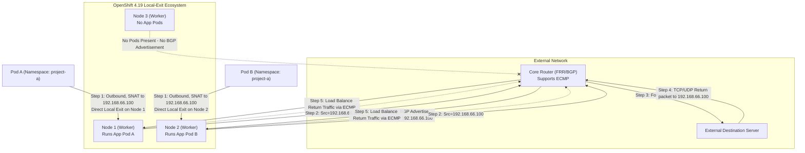

# 基于 BGP、OVN 与 Egress Service 的分布式 Egress IP 方案 (OpenShift 4.19)

## 1. 背景与痛点
在大型容需部署的集群环境中，当存在大量外部通信（Egress）需求时，传统的 Egress IP 架构存在明显的设计瓶颈：
- **单节点流量瓶颈**：传统的方案使用 `EgressIP` CRD，会将某个 Egress IP 绑定到特定的一个或多个托管节点（Hosted Node）。这意味着，即使一个业务的 Pod 广泛分布在集群所有节点，其出站流量也必须统一“绕道”发送至该托管节点才能向外网发包。当存在数百个 Egress IP 和大流量跨节点路由时，被选作出口的节点在网卡带宽和 CPU 解析上会很快达到上限。
- **网络跳数增加（Tromboning 效应）**：因为流量必须先发到集群边缘托管节点再经由该节点 SNAT 发出，造成无谓的内网网络开销。
- **业务需求不可妥协**：不能放弃使用独立的 Egress IP，因为外部的传统防火墙仍依赖特定的、固定的静态 IP 对来源流量的各个命名空间进行身份标识和安全检查隔离。
- **核心诉求**：客户的真正诉求并非要把 IP 和节点强绑定，而是：**让出站流量直接从 Pod 所在的当前节点流出（避免网络阻塞），但要在到达外部网络时呈现统一分配好的 Egress IP（用于统一的安全组审计）。**

## 2. 架构概述
在 OpenShift 4.19 中，建议摒弃传统的 `EgressIP` CRD，转而使用更加现代化的 **Egress Service** 结合 **OVN-Kubernetes** 与 **FRR-K8s (BGP)**，这能实现完美的“分布式 Egress IP”能力。本质上它结合了 Anycast IP 和出站 SNAT 分流。

核心特性如下：
- **本地流出 (Local Exit)**：OVN-Kubernetes 配合 EgressService，可在当前宿主机对 Pod 出方向的包建立一条逻辑路由器策略。将源 IP 直接被本地重写（SNAT）后由当前节点的出站网口发出，消除集群内部因为封装导致的跨节点跳数损耗。
- **动态 IP 分配**：使用标准的 `LoadBalancer` 类型的 `Service` 在地址池（如 MetalLB 配置池）中划出专用的“身份出口 IP”。
- **灵活的流量劫持**：定义同名的 `EgressService` 对象，配置 `sourceIPBy: "LoadBalancerIP"`，从而强制将选择到的 Pod 的出方向数据包源地址改为此 LoadBalancer IP。
- **分布式选路宣告 (BGP ECMP)**：通过集群内的 FRR-K8s（在 4.19 逐步取代基础版 MetalLB BGP 成为独立首选组件）模块，所有当前承载该目标 Pod 的 OCP 节点都会通过 BGP 议定向核心路由器宣告这个相同出口 IP 路由。上游路由器通过 ECMP (等价多路径) 技术同时将回包路由平均打回对应的健康 Worker 节点从而完成访问闭环。

## 3. 架构配图



## 5. 实验环境搭建与验证过程

为进一步论证上述技术的有效性可行性，设计下列基于 Linux 原生虚拟机环境组网进行验证。此实验构建在一台高性能宿主机 Baremetal CentOS 9 操作系统的 KVM(libvirt) 平台上。宿主机的 `br-ocp` 网桥网段为 `192.168.99.0/24`（宿主机 IP 为 192.168.99.1）。

### 5.1 环境说明
1. **OpenShift 4.19 虚拟集群**: 配置 3 个虚机节点（compact 融合节点作为 Worker及Master），网卡挂载在 `br-ocp`。启用了 OVN-Kubernetes 默认 CNI，并加装具备 MetalLB 的扩展。
   - 节点 IP 处于：`192.168.99.10 ~ 192.168.99.12`
   - **分配的池化 Egress IP 网段**: `192.168.66.0/24`
2. **KVM Router 节点 (CentOS 9)**: 作为模拟数据中心骨干交换机，其上运行软件态 FRR 处理 BGP。
   - 对 OCP 侧连接的桥接桥 `eth0` (处于 br-ocp): `192.168.99.2`
   - 对 Server 端外网模拟口 `eth1`: `192.168.55.1` 
3. **KVM Server 节点 (CentOS 9)**: 充当外域业务服务器供校验 SNAT。
   - 网卡 `eth0` (连接 Router 的 eth1 侧): `192.168.55.100`，默认网关指向 `192.168.55.1`

### 5.2 Router (FRR) 节点配置与就绪
登入作为 Router 的 CentOS 9 虚机节点，首先需开启服务器的数据包内核转发，再进行 FRR 的策略搭建使得 BGP 监听来自各方集群 OCP Worker 的通告。

```bash
# 1. 安装基础路由组件
sudo dnf install -y frr

# 在启动之前，必须在 daemons 文件中显式启用 bgpd 进程
sudo sed -i 's/^bgpd=no/bgpd=yes/' /etc/frr/daemons

sudo systemctl enable --now frr

# 2. 开启内核 IPv4 转发能力
echo "net.ipv4.ip_forward = 1" | sudo tee -a /etc/sysctl.d/99-ipforward.conf
sudo sysctl -p /etc/sysctl.d/99-ipforward.conf

# 3. 编排 FRR 核心配置文件
cat <<EOF | sudo tee /etc/frr/frr.conf
frr defaults traditional
log syslog informational
no ipv6 forwarding
!
router bgp 64512
 bgp router-id 192.168.99.12
 
 ! 配置分别对接 OCP 集群内各节点的 iBGP 邻居
 neighbor 192.168.99.23 remote-as 64512
 neighbor 192.168.99.24 remote-as 64512
 neighbor 192.168.99.25 remote-as 64512

 ! 确保 iBGP 等价多路径 (ECMP) 与网络宣发在 address-family 内配置
 address-family ipv4 unicast
  network 192.168.55.0/24
  maximum-paths ibgp 4
 exit-address-family
!
line vty
!
EOF

# 4. 重载使路由生效
sudo systemctl restart frr
```

### 5.3 Server 节点配置 (流量端点)
Server 是一台外网目标机器，它只需要能向 Router（192.168.55.1） 发包即可。用 Python 启动一个端口接收流量，再用 tcpdump 静候。

```bash
# 配置网关指向 Router
# sudo ip route add default via 192.168.55.12

sudo ip route add 192.168.66.100 via 192.168.55.12

ip r
default via 192.168.99.1 dev enp1s0 proto static metric 100
192.168.55.0/24 dev enp1s0 proto kernel scope link src 192.168.55.13 metric 100
192.168.66.100 via 192.168.55.12 dev enp1s0
192.168.99.0/24 dev enp1s0 proto kernel scope link src 192.168.99.13 metric 100

# 后台启一个用于检验数据能否顺利联通抵达的静态 Http 侦听点
# (同时监听 80 和 8080 端口，证明 Egress IP 不受 Service 端口声明的限制)
nohup python3 -m http.server 80 &
nohup python3 -m http.server 8080 &

# 抓取针对此端点的访问报文并观测实际封装和剥离后的 IP (观测 Egress IP 192.168.66.100)
sudo tcpdump -i any 'tcp port 80 or tcp port 8080' -n
```

### 5.4 OpenShift 集群侧配置实操
以下在能够与 OpenShift 集群使用 `oc` 客户端通信的控制端开始执行操作：

enable bgp
```bash
oc patch Network.operator.openshift.io cluster --type=merge -p \
'{
  "spec": {
    "additionalRoutingCapabilities": {
      "providers": ["FRR"]
    },
    "defaultNetwork": {
      "ovnKubernetesConfig": {
        "routeAdvertisements": "Enabled"
      }
    }
  }
}'

```


### 4.1. FRR-K8s (BGP) 基础配置
向外部核心交换机宣示 AS 以及邻居构建逻辑。
```yaml
apiVersion: frrk8s.metallb.io/v1beta1
kind: FRRConfiguration
metadata:
  name: bgp-core-router
  namespace: openshift-frr-k8s
  labels:
    use-for-advertisements: 'true'  # 供 OVN-K 路由发布使用
spec:
  bgp:
    bfdProfiles:
      - name: fast-bfd
        detectMultiplier: 3  # 检测倍数：连续 3 次未收到报文则判定链路故障
    routers:
    - asn: 64512 # OCP 集群私有 AS 号
      neighbors:
      - address: 192.168.99.12 # 物理路由器(FRR VM)邻居 IP
        asn: 64512
        disableMP: true  # 必须设为 true（IPv4/IPv6 单独建会话）
        bfdProfile: fast-bfd  # 使用上面定义的 BFD 配置文件
        toAdvertise:
          allowed:
            mode: all
        toReceive:
          allowed:
            mode: filtered # 开启过滤模式
            prefixes:
            - prefix: 192.168.55.0/24 # 【白名单】只收这一条
      # prefixes:
      # - 192.168.66.100/32  # 必须显式允许此前缀发往外部路由器
```

###  install and config metalLB operator

**1. 初始化相关网络池 (依赖 MetalLB Operator 提供 IPAM 地址分配能力)：**
由于之前已经在集群层面开启了 OVN-K 的原生 BGP 路由宣告（基于内置的 FRR-K8s），这里 **不再需要** 配置 MetalLB 的 `BGPPeer` 和 `BGPAdvertisement`。我们仅用 MetalLB 来为 LoadBalancer Service 分配 IP。

```yaml
apiVersion: metallb.io/v1beta1
kind: MetalLB
metadata:
  name: metallb
  namespace: metallb-system
# spec: 
  # # 【关键配置】：显式指定后端为 frr
  # bgpBackend: frr-k8s
```


```yaml
# metallb-ipam-config.yaml
apiVersion: metallb.io/v1beta1
kind: IPAddressPool
metadata:
  name: egress-pool
  namespace: metallb-system
spec:
  addresses:
  - 192.168.66.100-192.168.66.100 # 我们期望对外展示的独特 Egress IP (处于新的网段)
```
```bash
oc apply -f metallb-ipam-config.yaml
```


**3. 下发 Egress 截留与 SNAT 分配策略集：**

```bash
oc new-project demo-egress
```

```yaml
# egress-bundle.yaml
apiVersion: v1
kind: Service
metadata:
  name: egress-identity
  namespace: demo-egress
  annotations:
    metallb.universe.tf/address-pool: egress-pool
spec:
  type: LoadBalancer
  selector:
    app: requester
# 【灵魂配置】：
  # Cluster (默认): 全集群所有节点都宣告 BGP，回程包可能乱跳。
  # Local: 只有本节点存活了对应的 Pod，才向 BGP 宣告路由。
  # externalTrafficPolicy: Local
  ports:
  # 注意：这里的 port 只是满足 K8s Service 语法的硬性占位要求。
  # OVN 对 Egress 的 SNAT 劫持是基于 Pod 源 IP 级别的，
  # 并不限制目标端口。Pod 访问外网任何端口(如 8080, 443 等)都会走 Egress IP。
    - name: http
      protocol: TCP
      port: 8080
      targetPort: 8080

---
apiVersion: k8s.ovn.org/v1
kind: EgressService
metadata:
  name: egress-identity 
  namespace: demo-egress
spec:
  sourceIPBy: "LoadBalancerIP"
  
  # 3. 确定哪些节点可以承载这个出口任务
  # 如果不写 nodeSelector，默认全集群节点都行。
  nodeSelector:
    matchLabels:
      node-role.kubernetes.io/master: ""
```
```bash
oc apply -f egress-bundle.yaml
```

```yaml
# apiVersion: metallb.io/v1beta1
# kind: BGPAdvertisement
# metadata:
#   name: egress-identity-bgp-adv
#   namespace: metallb-system
# spec:
#   ipAddressPools:
#   - egress-pool
#   nodeSelectors:
#   - matchLabels:
#       egress-service.k8s.ovn.org/demo-egress-egress-identity: ""
```

**2. 部署用于实测的 Demo Pod 实例：**
创建测试 Namespace 以及具有广域分布的 DaemonSet，以便使不同 Worker 上都有能出网际流量的载体：
```bash


cat <<EOF | oc apply -f -
apiVersion: apps/v1
kind: Deployment
metadata:
  name: edge-request-deployment
  namespace: demo-egress
spec:
  replicas: 2
  selector:
    matchLabels:
      app: requester
  template:
    metadata:
      labels:
        app: requester
    spec:
      affinity:
        nodeAffinity:
          requiredDuringSchedulingIgnoredDuringExecution:
            nodeSelectorTerms:
            - matchExpressions:
              - key: kubernetes.io/hostname
                operator: In
                values:
                - master-02-demo
                - master-03-demo
      containers:
      - name: toolkit
        image: quay.io/wangzheng422/qimgs:centos9-test-2025.12.18.v01
        command: ["sleep", "infinity"]
EOF


```
