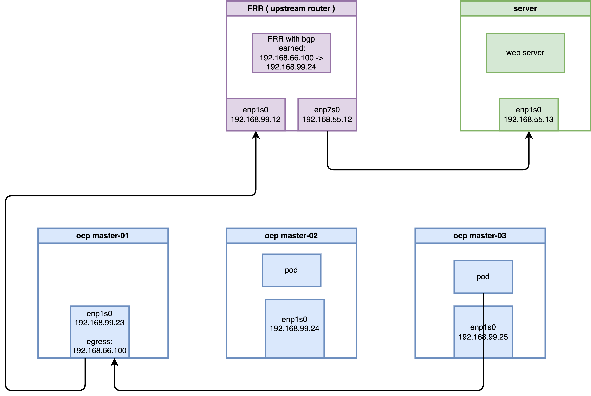

# Deep Dive: BGP-Based Egress Service in OpenShift 4.19 with OVN-Kubernetes

## Overview

In OpenShift 4.19, the **Egress Service** provides a sophisticated mechanism for managing outbound traffic from applications. Unlike traditional Egress IPs, which are manually assigned to namespaces, the Egress Service leverages `LoadBalancer` Service types to dynamically allocate Egress IPs and integrates seamlessly with BGP (via MetalLB and FRR-K8s) for route advertisement. This document explores the architectural implementation, environment setup, and a deep-dive verification of the traffic flow using OVS flows and `nftables`.

## 1. Laboratory Environment and Validation Topology

To demonstrate the validity and feasibility of this technology, a verification environment was constructed using native Linux virtual machines (KVM/libvirt) on a CentOS 9 bare-metal host. The host bridge `br-ocp` uses the subnet `192.168.99.0/24` (Host IP: `192.168.99.1`).

### 1.1 Environment Specifications

1.  **OpenShift 4.19 Virtual Cluster**:
    *   Consists of 3 nodes (Compact nodes acting as both Master and Worker).
    *   Network interfaces are attached to `br-ocp`.
    *   Uses OVN-Kubernetes as the default CNI with MetalLB Operator installed.
    *   **Node IPs**: `192.168.99.23` ~ `192.168.99.25`
    *   **Egress IP Range**: `192.168.66.100/24`
2.  **KVM Router Node (CentOS 9)**:
    *   Simulates a Data Center Core Switch running Software FRR for BGP routing.
    *   **eth0** (Connected to `br-ocp`): `192.168.99.12`
    *   **eth1** (External network simulator): `192.168.55.12`
3.  **KVM Server Node (CentOS 9)**:
    *   Acts as an external application server to verify SNAT.
    *   **eth0** (Connected to Router eth1): `192.168.55.13`, with default gateway pointing to `192.168.55.12`.



### 1.2 Router (FRR) Node Configuration

The Router node must have IP forwarding enabled and FRR configured to listen for BGP advertisements from the OpenShift cluster nodes.

```bash
# 1. Install base routing components
sudo dnf install -y frr

# Explicitly enable bgpd in the daemons file before starting
sudo sed -i 's/^bgpd=no/bgpd=yes/' /etc/frr/daemons

sudo systemctl enable --now frr

# 2. Enable IPv4 kernel forwarding
echo "net.ipv4.ip_forward = 1" | sudo tee -a /etc/sysctl.d/99-ipforward.conf
sudo sysctl -p /etc/sysctl.d/99-ipforward.conf

# 3. Configure the core FRR configuration file
cat <<EOF | sudo tee /etc/frr/frr.conf
frr defaults traditional
log syslog informational
no ipv6 forwarding
!
router bgp 64512
 bgp router-id 192.168.99.12
 
 ! Configure iBGP neighbors for each OCP cluster node
 neighbor 192.168.99.23 remote-as 64512
 neighbor 192.168.99.24 remote-as 64512
 neighbor 192.168.99.25 remote-as 64512

 ! Configure iBGP ECMP and network advertisement within the address-family
 address-family ipv4 unicast
  network 192.168.55.0/24
  maximum-paths ibgp 4
 exit-address-family
!
line vty
!
EOF

# 4. Reload FRR to apply changes
sudo systemctl restart frr
```

### 1.3 Server Node Configuration (Traffic Endpoint)

The Server node acts as the target for egress traffic. It requires a route back to the Egress IP range via the Router.

```bash
# Configure route to the Egress IP pool via the Router
sudo ip route add 192.168.66.100 via 192.168.55.12

# Verify routing table
ip r
# Output should look like:
# default via 192.168.99.1 dev enp1s0 proto static metric 100
# 192.168.55.0/24 dev enp1s0 proto kernel scope link src 192.168.55.13 metric 100
# 192.168.66.100 via 192.168.55.12 dev enp1s0
# 192.168.99.0/24 dev enp1s0 proto kernel scope link src 192.168.99.13 metric 100

# Start background listeners to verify connectivity
# (Listening on ports 80 and 8080 to prove Egress IP is not restricted by Service ports)
nohup python3 -m http.server 80 &
nohup python3 -m http.server 8080 &

# Monitor incoming traffic to observe the Egress IP (192.168.66.100)
sudo tcpdump -i any 'tcp port 80 or tcp port 8080' -n
```

## 2. OpenShift Cluster Configuration

The following steps were performed using the `oc` client on a control terminal.

### 2.1 Preparing Host Interfaces

Ensure the secondary IP range is reachable by adjusting the Node network configuration if necessary.

```bash
# Removing auxiliary IP addresses to the br-ex interface on nodes for testing/routing purposes
oc debug node/master-01-demo -- chroot /host /bin/bash -c "nmcli connection modify enp1s0 -ipv4.addresses 192.168.66.23/24"
oc debug node/master-02-demo -- chroot /host /bin/bash -c "nmcli connection modify enp1s0 -ipv4.addresses 192.168.66.24/24"
oc debug node/master-03-demo -- chroot /host /bin/bash -c "nmcli connection modify enp1s0 -ipv4.addresses 192.168.66.25/24"

# Enable additional routing capabilities and route advertisement in OVN-Kubernetes
oc patch Network.operator.openshift.io cluster --type=merge -p \
'{
  "spec": {
    "additionalRoutingCapabilities": {
      "providers": ["FRR"]
    },
    "defaultNetwork": {
      "ovnKubernetesConfig": {
        "routeAdvertisements": "Enabled"
      }
    }
  }
}'
```

### 2.2 BGP Configuration with FRR-K8s

Define the `FRRConfiguration` to establish BGP peering with the external Router.

```yaml
apiVersion: frrk8s.metallb.io/v1beta1
kind: FRRConfiguration
metadata:
  name: bgp-core-router
  namespace: openshift-frr-k8s
spec:
  bgp:
    bfdProfiles:
      - name: fast-bfd
        detectMultiplier: 3
    routers:
    - asn: 64512 
      neighbors:
      - address: 192.168.99.12 
        asn: 64512
        disableMP: true 
        bfdProfile: fast-bfd 
        toAdvertise:
          allowed:
            mode: all
        toReceive:
          allowed:
            mode: filtered 
            prefixes:
            - prefix: 192.168.55.0/24 
```

### 2.3 MetalLB and Egress Service Deployment

Configure MetalLB to provide the IP pool and deploy the `EgressService` resource.

```yaml
# 1. Initialize MetalLB IP Address Pool
apiVersion: metallb.io/v1beta1
kind: IPAddressPool
metadata:
  name: egress-pool
  namespace: metallb-system
spec:
  addresses:
  - 192.168.66.100-192.168.66.100 
---
# 2. Deploy Service and EgressService
apiVersion: v1
kind: Service
metadata:
  name: egress-identity
  namespace: demo-egress
  annotations:
    metallb.universe.tf/address-pool: egress-pool
spec:
  type: LoadBalancer
  selector:
    app: requester
  ports:
    - name: http
      protocol: TCP
      port: 8080
      targetPort: 8080
---
apiVersion: k8s.ovn.org/v1
kind: EgressService
metadata:
  name: egress-identity 
  namespace: demo-egress
spec:
  sourceIPBy: "LoadBalancerIP"
  nodeSelector:
    matchLabels:
      node-role.kubernetes.io/master: ""
```

### 2.4 BGP Advertisement for Egress IP

Configure the cluster to advertise the specific Egress IP prefix through BGP.

```yaml
apiVersion: frrk8s.metallb.io/v1beta1
kind: FRRConfiguration
metadata:
  name: bgp-advertise-egress-identity-bgp
  namespace: openshift-frr-k8s
spec:
  bgp:
    routers:
    - asn: 64512 
      neighbors:
      - address: 192.168.99.12 
        asn: 64512
        disableMP: true 
        toAdvertise:
          allowed:
            mode: all
      prefixes:
      - 192.168.66.100/32 
  nodeSelector:
    matchLabels:
      egress-service.k8s.ovn.org/demo-egress-egress-identity: ""
```

## 3. Results and Verification

### 3.1 Connectivity Test

Deploy test Pods and verify outbound traffic source IP.

```bash
# Deployment of test Pods
cat <<EOF | oc apply -f -
apiVersion: apps/v1
kind: Deployment
metadata:
  name: edge-request-deployment
  namespace: demo-egress
spec:
  replicas: 2
  selector:
    matchLabels:
      app: requester
  template:
    metadata:
      labels:
        app: requester
    spec:
      affinity:
        nodeAffinity:
          requiredDuringSchedulingIgnoredDuringExecution:
            nodeSelectorTerms:
            - matchExpressions:
              - key: kubernetes.io/hostname
                operator: In
                values:
                - master-02-demo
                - master-03-demo
      containers:
      - name: toolkit
        image: quay.io/wangzheng422/qimgs:centos9-test-2025.12.18.v01
        command: ["sleep", "infinity"]
EOF

# Execute curl from test Pods
# (Example using Node 3 Pod)
oc exec -it $NODE3_POD -n demo-egress -- curl -I http://192.168.55.13 --connect-timeout 2
```

### 3.2 Routing Verification (External Router)

On the external FRR router, verify the BGP route learned from the cluster.

```bash
oc get EgressService/egress-identity -n demo-egress -o yaml
# apiVersion: k8s.ovn.org/v1
# kind: EgressService
# metadata:
#   creationTimestamp: "2026-03-01T15:28:00Z"
#   generation: 1
#   name: egress-identity
#   namespace: demo-egress
#   resourceVersion: "185799"
#   uid: 27180cdd-5010-4eb5-b716-98682a4296c4
# spec:
#   nodeSelector:
#     matchLabels:
#       node-role.kubernetes.io/master: ""
#   sourceIPBy: LoadBalancerIP
# status:
#   host: master-01-demo

vtysh -c 'show ip route bgp'
# Codes: K - kernel route, C - connected, S - static, R - RIP,
#        O - OSPF, I - IS-IS, B - BGP, E - EIGRP, N - NHRP,
#        T - Table, v - VNC, V - VNC-Direct, F - PBR,
#        f - OpenFabric,
#        > - selected route, * - FIB route, q - queued, r - rejected, b - backup
#        t - trapped, o - offload failure

# B>* 192.168.66.100/32 [200/0] via 192.168.99.23, enp1s0, weight 1, 00:18:37
```
*Comment: The route 192.168.66.100/32 is correctly advertised by the node (192.168.99.23) currently hosting the egress gateway.*

## 4. Deep-Dive: Interception and SNAT Mechanism Analysis

In the OVN-Kubernetes architecture (OCP 4.14+), `EgressService` has moved away from traditional OVN Logical Router policies and `iptables MASQUERADE`. It now utilizes **OVS OpenFlow registers** for redirection and **native Linux nftables dynamic maps** for SNAT.

### 4.1 Stage 1: OVS Interception on Source Node (master-03)

When a packet from a Pod (`10.133.0.3`) enters `br-int`, it matches a high-priority OpenFlow rule.

```bash
# Query OVS flows on the source node (master-03)
oc exec -n openshift-ovn-kubernetes $OVN_NODE_03_POD -c ovn-controller -- ovs-ofctl dump-flows br-int | grep "10.133.0.3"
```

**Observation (Table 25):**
```text
 cookie=0x3e1ba399, duration=6354.264s, table=25, n_packets=0, n_bytes=0, idle_age=6354, priority=101,ip,metadata=0x5,nw_src=10.133.0.3 actions=load:0x64580004->NXM_NX_XXREG0[96..127],load:0x64580002->NXM_NX_XXREG1[64..95],mod_dl_src:0a:58:64:58:00:02,load:0x1->NXM_NX_REG15[],load:0x1->NXM_NX_REG10[0],load:0->OXM_OF_PKT_REG4[32..47],load:0x1->OXM_OF_PKT_REG4[9],resubmit(,26)
```
*Analysis: The OVS `load` instruction modifies the XXREG registers to redirect the packet into a Geneve tunnel (port 6081) towards the designated Egress node (master-01).*

**Deep-Dive: Register and MAC Address Decoding**

To understand the "magic" behind these values, we can decode the 16-bit hex values into their decimal IP equivalents:

*   **Logical Next Hop (XXREG0)**: `0x64580004` → `100.88.0.4`. This is the **Transit Switch IP** of `master-01-demo`. It marks the logical destination for the packet within the OVN backbone.
*   **Logical Source (XXREG1)**: `0x64580002` → `100.88.0.2`. This is the **Transit Switch IP** of `master-03-demo`.
*   **Source MAC Modification**: `mod_dl_src:0a:58:64:58:00:02`.
    *   `0a:58` is the standard OVN virtual MAC prefix.
    *   `64:58:00:02` matches the hex representation of the source transit IP.
    *   **Meaning**: This MAC identifies the virtual router port on the source node (`master-03`) as the packet enters the OVN transit network.

**Verification Command (Discovery of Transit IPs):**
```bash
# Verify the transit IP assignments across the cluster
oc get nodes -o custom-columns=NAME:.metadata.name,TRANSIT_IP:.metadata.annotations.'k8s\.ovn\.org/node-transit-switch-port-ifaddr'
# NAME             TRANSIT_IP
# master-01-demo   {"ipv4":"100.88.0.4/16"}
# master-02-demo   {"ipv4":"100.88.0.3/16"}
# master-03-demo   {"ipv4":"100.88.0.2/16"}
```

### 4.2 Stage 2: SNAT Transformation on Egress Node (master-01)

On the host node `master-01`, we can observe the packet "transformation" as it exits the Geneve tunnel and leaves the physical interface.

**Terminal 1 (Monitoring master-01):**
```bash
oc debug node/master-01-demo -- bash -c "tcpdump -i any -n 'host 192.168.55.13' 2>/dev/null"
```

**Terminal 2 (Sending Ping from master-03 Pod):**
```bash
oc exec -it $NODE3_POD -n demo-egress -- ping -c 1 192.168.55.13
```

**Trace Results on master-01:**
```text
# Packet emerges from Geneve tunnel with its original Pod IP (10.133.0.3)
13:28:40.907255 ovn-k8s-mp0 In  IP 10.133.0.3 > 192.168.55.13: ICMP echo request, id 4, seq 1, length 64

# Host kernel performs SNAT; when exiting br-ex, the source IP is now the Egress IP (192.168.66.100)
13:28:40.907295 br-ex Out IP 192.168.66.100 > 192.168.55.13: ICMP echo request, id 4, seq 1, length 64
```

### 4.3 Stage 3: The Engine - nftables Dynamic Maps

The SNAT rule is implemented using a high-performance `nftables` map managed by OVN-Kubernetes on the host.

```bash
# Inspect nftables ruleset on master-01
oc debug node/master-01-demo -- chroot /host /bin/bash -c "nft list ruleset | grep 'egress-service-snat-v4' -A 5 -B 5"
```

**The Final Truth:**
```json
        map egress-service-snat-v4 {
                type ipv4_addr : ipv4_addr
                # OVN automatically maps Pod IPs to the selected Egress IP
                elements = { 10.132.0.13 comment "demo-egress/egress-identity" : 192.168.66.100, 10.133.0.3 comment "demo-egress/egress-identity" : 192.168.66.100 }
        }

        chain egress-services {
                type nat hook postrouting priority srcnat; policy accept;
                # Perform SNAT if a match is found in the dynamic map
                snat ip to ip saddr map @egress-service-snat-v4
        }
```

## Conclusion

The `EgressService` in OpenShift 4.19 represents a shift towards cloud-native networking efficiency. By combining **OVS XXREG register redirection** to steer traffic across the cluster via tunnels and **nftables maps** for localized SNAT on the egress host, it achieves high throughput and predictability without the overhead of complex logical routing policies. Integration with BGP ensures that external firewalls and routers always see a consistent source IP, regardless of which node acts as the current egress gateway.
