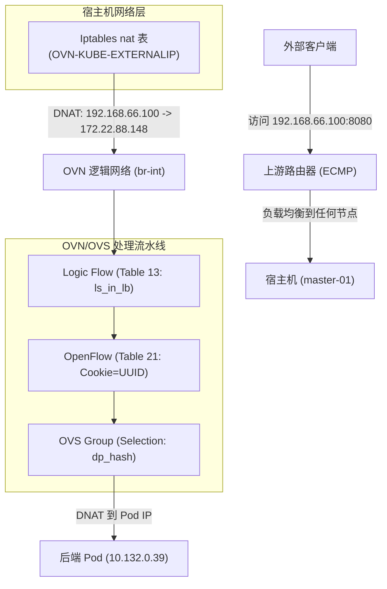

# 技术深度解读：OpenShift 4.19 中 MetalLB BGP 入站流量路径

## 1. 概述 (Overview)

在 **OpenShift 4.19** 中，使用 **MetalLB** 配合 **FRR-K8s** 驱动可以实现高性能、高可用性的基于 BGP 的服务发布（Ingress）。与侧重于出站路径的 Egress IP 不同，Ingress 流量关注的是如何通过动态路由宣告将外部流量引入集群，并跨节点均匀分配到后端的 Pod 上。

本文档通过实证分析，揭示了从 **BGP 路由宣告**、到**宿主机 Iptables 拦截**、再到 **OVN/OVS 逻辑流表转发** 的完整处理链条，涵盖了 `Cluster` 和 `Local` 两种流量策略。

---

## 2. 验证拓扑 (Validation Topology)

本次验证基于一个 3 节点的紧凑版 OpenShift 集群（SNO 风格但具有 3 节点）。

| 资源类型 | 标识/地址 | 角色/说明 |
| :--- | :--- | :--- |
| **节点 IP** | `192.168.99.23`, `24`, `25` | Master & Worker 混合角色 |
| **LoadBalancer VIP** | `192.168.66.100` | MetalLB 宣告的外部访问 IP |
| **ClusterIP** | `172.22.88.148` | K8s 内部的服务 IP |
| **后端 Pod 1** | `10.132.0.39` | 运行于 `master-02-demo` |
| **后端 Pod 2** | `10.133.0.4` | 运行于 `master-03-demo` |
| **上游路由器** | `192.168.99.12` | 模拟的数据中心核心路由器 (Running FRR) |

---

## 3. 基础配置 (Infrastructure Configuration)

### 3.1 测试工作负载准备

首先部署一个简单的 Python HTTP 服务作为后端，并通过 `nodeAffinity` 将其固定在特定节点上以便追踪。

```bash
# 1. 部署测试 Deployment
cat <<EOF | oc apply -f -
apiVersion: apps/v1
kind: Deployment
metadata:
  name: edge-request-deployment
  namespace: demo-egress
spec:
  replicas: 2
  selector:
    matchLabels:
      app: requester
  template:
    metadata:
      labels:
        app: requester
    spec:
      affinity:
        nodeAffinity:
          requiredDuringSchedulingIgnoredDuringExecution:
            nodeSelectorTerms:
            - matchExpressions:
              - key: kubernetes.io/hostname
                operator: In
                values:
                - master-02-demo
                - master-03-demo
      containers:
      - name: toolkit
        image: quay.io/wangzheng422/qimgs:centos9-test-2025.12.18.v01
        command: ["bash", "-c", "python3 -m http.server 8080"]
EOF

# 2. 创建 LoadBalancer Service
cat <<EOF | oc apply -f -
apiVersion: v1
kind: Service
metadata:
  name: egress-identity
  namespace: demo-egress
  annotations:
    metallb.universe.tf/address-pool: egress-pool
spec:
  type: LoadBalancer
  selector:
    app: requester
  ports:
    - name: http
      protocol: TCP
      port: 8080
      targetPort: 8080
EOF
```

### 3.2 MetalLB BGP 配置

在 OCP 4.19 中，MetalLB 使用 BGP 协议与上游设备通信。

```yaml
# BGPPeer: 定义邻居关系
apiVersion: metallb.io/v1beta2
kind: BGPPeer
metadata:
  name: peer-sample1
  namespace: metallb-system
spec:
  peerAddress: 192.168.99.12
  peerASN: 64512
  myASN: 64512
  peerPort: 179

---
# IPAddressPool: 定义地址池
apiVersion: metallb.io/v1beta1
kind: IPAddressPool
metadata:
  name: egress-pool
  namespace: metallb-system
spec:
  addresses:
  - 192.168.66.100-192.168.66.100

---
# BGPAdvertisement: 宣告策略
apiVersion: metallb.io/v1beta1
kind: BGPAdvertisement
metadata:
  name: egress-identity-bgp-adv
  namespace: metallb-system
spec:
  ipAddressPools:
  - egress-pool
  nodeSelectors:
  - matchLabels:
      node-role.kubernetes.io/master: ""
```

---

## 4. 路由验证 (Routing & BGP Verification)

### 4.1 确认 FRRConfiguration 生成

MetalLB 会将配置翻译为 `frrk8s.metallb.io` 的 `FRRConfiguration` 对象，由底层 `frr-k8s` 守护进程消耗。

```bash
oc get FRRConfiguration -n openshift-frr-k8s
```
**输出结果：**
```text
NAME                     AGE
metallb-master-01-demo   4h19m
metallb-master-02-demo   4h19m
metallb-master-03-demo   4h19m
```

查看其中一个配置，确认宣告的前缀：
```bash
oc get FRRConfiguration metallb-master-01-demo -n openshift-frr-k8s -o yaml
```
**关键片段：**
```yaml
spec:
  bgp:
    routers:
    - asn: 64512
      neighbors:
      - address: 192.168.99.12
        toAdvertise:
          allowed:
            mode: filtered
            prefixes:
            - 192.168.66.100/32
```

### 4.2 上游路由器视角

在上游核心路由器（`192.168.99.12`）上，可以看到到 VIP 的等价多路径（ECMP）路由。

```bash
vtysh -c 'show ip bgp'
```
**输出结果：**
```text
BGP table version is 5, local router ID is 192.168.99.12, vrf id 0
Default local pref 100, local AS 64512
Status codes:  s suppressed, d damped, h history, * valid, > best, = multipath,
               i internal, r RIB-failure, S Stale, R Removed
Nexthop codes: @NNN nexthop's vrf id, < announce-nh-self
Origin codes:  i - IGP, e - EGP, ? - incomplete
RPKI validation codes: V valid, I invalid, N Not found

    Network          Next Hop            Metric LocPrf Weight Path
*> 192.168.55.0/24  0.0.0.0                  0         32768 i
*=i192.168.66.100/32
                    192.168.99.25            0    100      0 i
*=i                 192.168.99.24            0    100      0 i
*>i                 192.168.99.23            0    100      0 i
```

---

## 5. 流量深度追踪：Cluster 策略 (Traffic Deep Dive: Cluster Policy)

默认情况下，`externalTrafficPolicy` 为 `Cluster`。此时流量可以进入任何节点，并跨节点路由到后端 Pod。

### 5.1 整体流量链条 (Workflow Diagram)



### 5.2 核心环节实证

#### 1. 宿主机 Iptables 拦截
在宿主机层面，OVN-Kube 预插了规则将 VIP 映射为 ClusterIP。
```bash
oc debug node/master-01-demo -- chroot /host bash -c 'iptables -t nat -S | grep 192.168.66.100'
```
**输出：**
```text
-A OVN-KUBE-EXTERNALIP -d 192.168.66.100/32 -p tcp -m tcp --dport 8080 -j DNAT --to-destination 172.22.88.148:8080
```

#### 2. OVN Gateway Router (GR) 的 SNAT —— 入站流量的源地址伪装

DNAT 之后，流量通过 `br-ex` 进入 **GR_master-01-demo**。此时，GR 承担了对 ClusterIP 进行二次 DNAT 以及对源 IP 进行 SNAT（伪装为 Join IP）的职责。

##### 2.1 GR 逻辑流表中的 DNAT + force_snat 标记

在 GR 的 `lr_in_dnat` (table=9) 流表中，针对 VIP `192.168.66.100` 的负载均衡规则如下：

```bash
oc exec -n openshift-ovn-kubernetes $OVN_POD -c ovn-controller -- ovn-sbctl lflow-list GR_master-01-demo | grep -i snat | grep "192.168.66.100"
# 输出：
# table=9 (lr_in_dnat         ), priority=120  , match=(ct.new && !ct.rel && ip4 && ip4.dst == 192.168.66.100 && tcp && tcp.dst == 8080), action=(flags.force_snat_for_lb = 1; ct_lb_mark(backends=10.132.0.39:8080,10.133.0.4:8080; force_snat);)
```

**关键动作解析**：
*   `flags.force_snat_for_lb = 1`：设置"强制 SNAT"标志位。
*   `ct_lb_mark(...; force_snat)`：执行负载均衡，转换目标 IP，并在 CT Mark 中标记 `force_snat`。

#### 3. OVN 逻辑流表 (Logical Flow)
进入 OVN 后，`ls_in_lb` 表负责处理。
```bash
# 在 master-01 节点寻找对应的逻辑流表
OVN_NODE_01_POD=$(oc get po -n openshift-ovn-kubernetes -l app=ovnkube-node -o wide | grep "master-01-demo" | awk '{print $1}')
oc exec -n openshift-ovn-kubernetes $OVN_NODE_01_POD -c sbdb -- ovn-sbctl --uuid lflow-list | grep -B 1 "172.22.88.148"
```
**证据：**
```text
uuid=0x93f7000bc19e7616196191...
table=13(ls_in_lb), priority=120, match=(ct.new && ip4.dst == 172.22.88.148 && tcp.dst == 8080), action=(reg4 = 172.22.88.148; reg2[0..15] = 8080; ct_lb_mark(backends=10.132.0.39:8080,10.133.0.4:8080);)
```

#### 4. OVS 流表转换 (The "Cookie" Secret)
`ovn-controller` 将 UUID 的前 8 位（0x93f7000b）写入 OVS 流表的 `cookie` 字段。
```bash
oc exec -n openshift-ovn-kubernetes $OVN_NODE_01_POD -c ovn-controller -- ovs-ofctl dump-flows br-int | grep "cookie=0x93f7000b"
```
**输出：**
```text
cookie=0x93f7000b, table=21, n_packets=12, n_bytes=840, priority=120,ct_state=+new+trk,tcp,metadata=0x2,nw_dst=172.22.88.148,tp_dst=8080 actions=load:0xac165894->NXM_NX_XXREG1[96..127],load:0x1f90->NXM_NX_XXREG0[32..47],group:133
```

进一步查看 `group:133`，确认后端分布：
```bash
oc exec -n openshift-ovn-kubernetes $OVN_NODE_01_POD -c ovn-controller -- ovs-ofctl dump-groups br-int | grep "group_id=133"
```
```text
group_id=133,type=select,selection_method=dp_hash,bucket=bucket_id:0,weight:100,actions=ct(commit,table=22,zone=NXM_NX_REG13[0..15],nat(dst=10.132.0.39:8080),exec(load:0x1->NXM_NX_CT_MARK[1])),bucket=bucket_id:1,weight:100,actions=ct(commit,table=22,zone=NXM_NX_REG13[0..15],nat(dst=10.133.0.4:8080),exec(load:0x1->NXM_NX_CT_MARK[1]))
```

---

## 6. 进阶场景：Local 策略与内部伪装 IP (External Traffic Policy: Local)

当 Service 配置 `externalTrafficPolicy: Local` 时，行为发生剧变：
1. **BGP 宣告**：只有运行后端 Pod 的节点才会宣告 VIP 路由。
2. **流量重定向**：流量进入节点后，必须发往本地 Pod。

### 6.1 BGP 路由视角：ECMP 到特定节点的缩减

当 `externalTrafficPolicy` 设置为 `Local` 时，上游 FRR 路由器上可以观察到路由条目发生了变化，从原本的 3 条（ECMP）减少到了 2 条（仅对应运行有后端 Pod 的 `master-02` 和 `master-03` 节点）：

```bash
vtysh -c 'show ip route'
# Codes: K - kernel route, C - connected, S - static, R - RIP,
#        O - OSPF, I - IS-IS, B - BGP, E - EIGRP, N - NHRP,
#        T - Table, v - VNC, V - VNC-Direct, F - PBR,
#        f - OpenFabric,
#        > - selected route, * - FIB route, q - queued, r - rejected, b - backup
#        t - trapped, o - offload failure

# K>* 0.0.0.0/0 [0/100] via 192.168.99.1, enp1s0, 00:45:03
# C>* 192.168.55.0/24 is directly connected, enp7s0, 00:45:03
# K * 192.168.55.0/24 [0/101] is directly connected, enp7s0, 00:45:03
# B>* 192.168.66.100/32 [200/0] via 192.168.99.24, enp1s0, weight 1, 00:00:08
#   *                           via 192.168.99.25, enp1s0, weight 1, 00:00:08
# C>* 192.168.99.0/24 [0/100] is directly connected, enp1s0, 00:45:03
```

### 6.2 169.254.0.3 的奥秘

在 `Local` 模式下，主机 Iptables 不再 DNAT 到 ClusterIP，而是 DNAT 到一个特殊的保留地址：`169.254.0.3`。

```bash
# 在 master-02 (运行有 Pod) 节点查看
oc debug node/master-02-demo -- chroot /host bash -c 'iptables -t nat -S | grep 192.168.66.100'
```
**核心输出：**
```text
-A OVN-KUBE-ETP -d 192.168.66.100/32 -p tcp -m tcp --dport 8080 -j DNAT --to-destination 169.254.0.3:32736
```

#### 为什么是 169.254.0.3？
这是 OVN-Kubernetes 的 **Internal Masquerade IP**。它的作用是作为一种“路标”，告诉 OVN 逻辑层：“请使用**仅包含本地 Endpoints** 的负载均衡器”。

#### 路由支撑
主机路由表确保发往 `169.254.0.3` 的流量通过 `ovn-k8s-mp0` 进入隧道。
```bash
oc debug node/master-02-demo -- chroot /host bash -c 'ip route show | grep 169.254.0.3'
```
```text
169.254.0.3 via 10.132.0.1 dev ovn-k8s-mp0
```

#### 6.2 OVN 视角下的差异化 LB

查看 OVN NBDB，可以发现每个节点都有针对该 Service 的定制化 Load Balancer。

**节点 master-01 (无 Pod) 的 LB 视图：**
```bash
OVN_NODE_01_POD=$(oc get po -n openshift-ovn-kubernetes -l app=ovnkube-node -o wide | grep "master-01-demo" | awk '{print $1}')
oc exec -it -n openshift-ovn-kubernetes $OVN_NODE_01_POD -- ovn-nbctl find load_balancer name="Service_demo-egress/egress-identity_TCP_node_switch_master-01-demo"
```
**关键 VVIP 内容：**
```text
vips: {
    "192.168.66.100:8080" : "10.132.0.39:8080,10.133.0.4:8080",
    "192.168.77.23:32736" : "10.132.0.39:8080,10.133.0.4:8080",
    "192.168.99.21:32736" : "10.132.0.39:8080,10.133.0.4:8080"
}
```
*注意：在 master-01 上，VIPS 列表里**完全没有 169.254.0.3:32736** 这一项，因为该节点没有关联的本地 Endpoints。*

**节点 master-02 (有 Pod) 的 LB 视图：**
```bash
OVN_NODE_02_POD=$(oc get po -n openshift-ovn-kubernetes -l app=ovnkube-node -o wide | grep "master-02-demo" | awk '{print $1}')
oc exec -it -n openshift-ovn-kubernetes $OVN_NODE_02_POD -- ovn-nbctl find load_balancer name="Service_demo-egress/egress-identity_TCP_node_switch_master-02-demo"
```
**关键 VVIP 内容：**
```text
vips: {
    "169.254.0.3:32736" : "10.132.0.39:8080", 
    "192.168.66.100:8080" : "10.132.0.39:8080,10.133.0.4:8080"
}
```
*   **192.168.66.100**: 虽然也包含所有后端，但由于 Iptables 已将流量 DNAT 为 `169.254.0.3`，因此在 Local 策略下，进入 OVN 的流量优先匹配 `169.254.0.3` 这一项，从而实现了 **强制本地分发**。

---

## 7. 负向验证：绕过 BGP 宣告节点

如果手动强行将流量路由到未宣告路由的 `master-01` 节点（该节点无本地 Pod），会发生什么？

```bash
# 在上游路由器手动添加静态路由，指向 master-01 (99.23)
vtysh -c 'conf t' -c 'ip route 192.168.66.100/32 192.168.99.23'

# 验证路由已生效
vtysh -c 'show ip route 192.168.66.100/32'
```
**输出结果：**
```text
Routing entry for 192.168.66.100/32
  Known via "static", distance 1, metric 0, best
  Last update 00:00:03 ago
  * 192.168.99.23, via enp1s0, weight 1

Routing entry for 192.168.66.100/32
  Known via "bgp", distance 200, metric 0
  Last update 00:31:23 ago
    192.168.99.24, via enp1s0, weight 1
    192.168.99.25, via enp1s0, weight 1
```

```bash
# 测试访问
curl -vvv http://192.168.66.100:8080
```
**结果：** `Connection refused`
**分析：** 即使 `master-01` 的 Iptables 也有转发规则，但由于其在 BGP 层面不接收此流量，且 Local 策略下 OVN 内部对该节点的伪装 IP 请求无本地后端对应，连接会被拒绝。这确保了 `Local` 策略的严格一致性。

---

## 8. 结论 (Conclusion)

OpenShift 4.19 中 MetalLB + OVN 的 Ingress 方案展示了极高水平的组件协同：
1.  **分层 DNAT**: 宿主机 Iptables 解决 VIP 的“入口认领”，OVN 解决复杂的逻辑选择和状态跟踪。
2.  **标识符传递**: 通过 UUID 到 Cookie 的映射，打通了逻辑网络与物理流表的调试链路。
3.  **Local 隔离性**: 利用 `169.254.0.3` 这一精妙的内部伪装地址，在不破坏统一逻辑架构的前提下，实现了节点级的流量治理。

---

