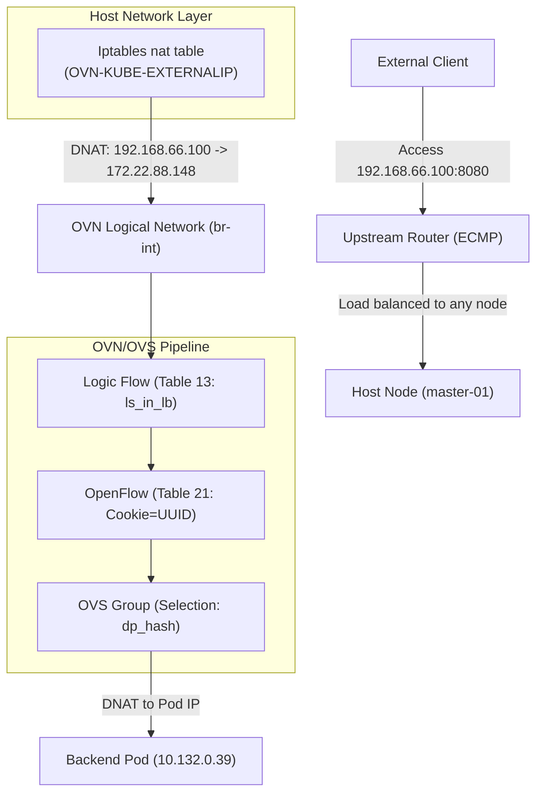

# Technical Deep Dive: MetalLB BGP Ingress Traffic Flow in OpenShift 4.19

## 1. Overview

In **OpenShift 4.19**, using **MetalLB** with the **FRR-K8s** driver enables high-performance, high-availability BGP-based service publication (Ingress). Unlike Egress IPs, which focus on the outbound path, Ingress traffic deals with how to bring external traffic into the cluster via dynamic route advertisements and distribute it evenly across backend Pods.

This document reveals the complete processing chain through empirical analysis, from **BGP route advertisement**, to **host-level Iptables interception**, and finally to **OVN/OVS logical flow forwarding**, covering both `Cluster` and `Local` traffic policies.

---

## 2. Validation Topology

This validation is based on a 3-node compact OpenShift cluster.

| Resource Type | Identifier/Address | Role/Description |
| :--- | :--- | :--- |
| **Node IPs** | `192.168.99.23`, `24`, `25` | Mixed Master & Worker roles |
| **LoadBalancer VIP** | `192.168.66.100` | External access IP advertised by MetalLB |
| **ClusterIP** | `172.22.88.148` | Internal K8s Service IP |
| **Backend Pod 1** | `10.132.0.39` | Running on `master-02-demo` |
| **Backend Pod 2** | `10.133.0.4` | Running on `master-03-demo` |
| **Upstream Router** | `192.168.99.12` | Simulated core DC router (Running FRR) |

---

## 3. Infrastructure Configuration

### 3.1 Test Workload Preparation

First, deploy a simple Python HTTP service as a backend, fixed to specific nodes via `nodeAffinity` for tracking purposes.

```bash
# 1. Deploy test Deployment
cat <<EOF | oc apply -f -
apiVersion: apps/v1
kind: Deployment
metadata:
  name: edge-request-deployment
  namespace: demo-egress
spec:
  replicas: 2
  selector:
    matchLabels:
      app: requester
  template:
    metadata:
      labels:
        app: requester
    spec:
      affinity:
        nodeAffinity:
          requiredDuringSchedulingIgnoredDuringExecution:
            nodeSelectorTerms:
            - matchExpressions:
              - key: kubernetes.io/hostname
                operator: In
                values:
                - master-02-demo
                - master-03-demo
      containers:
      - name: toolkit
        image: quay.io/wangzheng422/qimgs:centos9-test-2025.12.18.v01
        command: ["bash", "-c", "python3 -m http.server 8080"]
EOF

# 2. Create LoadBalancer Service
cat <<EOF | oc apply -f -
apiVersion: v1
kind: Service
metadata:
  name: egress-identity
  namespace: demo-egress
  annotations:
    metallb.universe.tf/address-pool: egress-pool
spec:
  type: LoadBalancer
  selector:
    app: requester
  ports:
    - name: http
      protocol: TCP
      port: 8080
      targetPort: 8080
EOF
```

### 3.2 MetalLB BGP Configuration

In OCP 4.19, MetalLB uses the BGP protocol to communicate with upstream devices.

```yaml
# BGPPeer: Defines neighbor relationships
apiVersion: metallb.io/v1beta2
kind: BGPPeer
metadata:
  name: peer-sample1
  namespace: metallb-system
spec:
  peerAddress: 192.168.99.12
  peerASN: 64512
  myASN: 64512
  peerPort: 179

---
# IPAddressPool: Defines the address pool
apiVersion: metallb.io/v1beta1
kind: IPAddressPool
metadata:
  name: egress-pool
  namespace: metallb-system
spec:
  addresses:
  - 192.168.66.100-192.168.66.100

---
# BGPAdvertisement: Advertisement strategy
apiVersion: metallb.io/v1beta1
kind: BGPAdvertisement
metadata:
  name: egress-identity-bgp-adv
  namespace: metallb-system
spec:
  ipAddressPools:
  - egress-pool
  nodeSelectors:
  - matchLabels:
      node-role.kubernetes.io/master: ""
```

---

## 4. Routing & BGP Verification

### 4.1 Confirm FRRConfiguration Generation

MetalLB translates configurations into `FRRConfiguration` objects, which are consumed by the underlying `frr-k8s` daemon.

```bash
oc get FRRConfiguration -n openshift-frr-k8s
```
**Output:**
```text
NAME                     AGE
metallb-master-01-demo   4h19m
metallb-master-02-demo   4h19m
metallb-master-03-demo   4h19m
```

Verify the advertised prefixes:
```bash
oc get FRRConfiguration metallb-master-01-demo -n openshift-frr-k8s -o yaml
```
**Key Fragment:**
```yaml
spec:
  bgp:
    routers:
    - asn: 64512
      neighbors:
      - address: 192.168.99.12
        toAdvertise:
          allowed:
            mode: filtered
            prefixes:
            - 192.168.66.100/32
```

### 4.2 Upstream Router Perspective

On the upstream router (`192.168.99.12`), you can see Equal-Cost Multi-Path (ECMP) routes to the VIP.

```bash
vtysh -c 'show ip bgp'
```
**Output:**
```text
BGP table version is 5, local router ID is 192.168.99.12, vrf id 0
Default local pref 100, local AS 64512
Status codes:  s suppressed, d damped, h history, * valid, > best, = multipath,
               i internal, r RIB-failure, S Stale, R Removed
Nexthop codes: @NNN nexthop's vrf id, < announce-nh-self
Origin codes:  i - IGP, e - EGP, ? - incomplete
RPKI validation codes: V valid, I invalid, N Not found

    Network          Next Hop            Metric LocPrf Weight Path
*> 192.168.55.0/24  0.0.0.0                  0         32768 i
*=i192.168.66.100/32
                    192.168.99.25            0    100      0 i
*=i                 192.168.99.24            0    100      0 i
*>i                 192.168.99.23            0    100      0 i
```

---

## 5. Traffic Deep Dive: Cluster Policy

By default, `externalTrafficPolicy` is set to `Cluster`. Traffic can enter any node and be routed across nodes to backend Pods.

### 5.1 Pipeline Visualization



### 5.2 Core Stages Evidence

#### 1. Host-level Iptables Interception
At the host level, OVN-Kube pre-installs rules to map the VIP to the ClusterIP.
```bash
oc debug node/master-01-demo -- chroot /host bash -c 'iptables -t nat -S | grep 192.168.66.100'
```
**Output:**
```text
-A OVN-KUBE-EXTERNALIP -d 192.168.66.100/32 -p tcp -m tcp --dport 8080 -j DNAT --to-destination 172.22.88.148:8080
```

#### 2. OVN Gateway Router (GR) SNAT —— Inbound Source Address Masquerading

After DNAT, traffic enters **GR_master-01-demo** via `br-ex`. The GR is responsible for performing a second DNAT on the ClusterIP and performing SNAT on the source IP (masquerading it as the Join IP).

##### 2.1 DNAT + force_snat Mark in GR Logical Flows

In the GR's `lr_in_dnat` (table=9) flow table, the load balancing rule for VIP `192.168.66.100` is as follows:

```bash
oc exec -n openshift-ovn-kubernetes $OVN_POD -c ovn-controller -- ovn-sbctl lflow-list GR_master-01-demo | grep -i snat | grep "192.168.66.100"
# Output:
# table=9 (lr_in_dnat         ), priority=120  , match=(ct.new && !ct.rel && ip4 && ip4.dst == 192.168.66.100 && tcp && tcp.dst == 8080), action=(flags.force_snat_for_lb = 1; ct_lb_mark(backends=10.132.0.39:8080,10.133.0.4:8080; force_snat);)
```

**Key Action Analysis**:
*   `flags.force_snat_for_lb = 1`: Sets the "Force SNAT" flag.
*   `ct_lb_mark(...; force_snat)`: Performs load balancing, translates the destination IP, and marks `force_snat` in CT Mark.

#### 3. OVN Logical Flow (ls_in_lb)
The `ls_in_lb` table handles the request once it enters OVN.
```bash
# Find the corresponding logical flow on master-01
OVN_NODE_01_POD=$(oc get po -n openshift-ovn-kubernetes -l app=ovnkube-node -o wide | grep "master-01-demo" | awk '{print $1}')
oc exec -n openshift-ovn-kubernetes $OVN_NODE_01_POD -c sbdb -- ovn-sbctl --uuid lflow-list | grep -B 1 "172.22.88.148"
```
**Evidence:**
```text
uuid=0x93f7000bc19e7616196191...
table=13(ls_in_lb), priority=120, match=(ct.new && ip4.dst == 172.22.88.148 && tcp.dst == 8080), action=(reg4 = 172.22.88.148; reg2[0..15] = 8080; ct_lb_mark(backends=10.132.0.39:8080,10.133.0.4:8080);)
```

#### 4. OVS Flow Translation (The "Cookie" Secret)
The `ovn-controller` writes the first 8 digits of the UUID (0x93f7000b) into the OVS flow table's `cookie` field.
```bash
oc exec -n openshift-ovn-kubernetes $OVN_NODE_01_POD -c ovn-controller -- ovs-ofctl dump-flows br-int | grep "cookie=0x93f7000b"
```
**Output:**
```text
cookie=0x93f7000b, table=21, n_packets=12, n_bytes=840, priority=120,ct_state=+new+trk,tcp,metadata=0x2,nw_dst=172.22.88.148,tp_dst=8080 actions=load:0xac165894->NXM_NX_XXREG1[96..127],load:0x1f90->NXM_NX_XXREG0[32..47],group:133
```

Check `group:133` to confirm backend distribution:
```bash
oc exec -n openshift-ovn-kubernetes $OVN_NODE_01_POD -c ovn-controller -- ovs-ofctl dump-groups br-int | grep "group_id=133"
```
```text
group_id=133,type=select,selection_method=dp_hash,bucket=bucket_id:0,weight:100,actions=ct(commit,table=22,zone=NXM_NX_REG13[0..15],nat(dst=10.132.0.39:8080),exec(load:0x1->NXM_NX_CT_MARK[1])),bucket=bucket_id:1,weight:100,actions=ct(commit,table=22,zone=NXM_NX_REG13[0..15],nat(dst=10.133.0.4:8080),exec(load:0x1->NXM_NX_CT_MARK[1]))
```

---

## 6. Advanced Scenario: Local Policy and Internal Masquerade IP

When a Service is configured with `externalTrafficPolicy: Local`, behavior changes significantly:
1.  **BGP Advertisement**: Only nodes running backend Pods advertise the VIP route.
2.  **Traffic Redirection**: Traffic must be directed to local Pods once it enters a node.

### 6.1 BGP Routing Perspective: Reduction of ECMP Routes

When `externalTrafficPolicy` is set to `Local`, on the upstream FRR router, you can observe that the routing entries have changed from 3 ECMP routes to only 2 (corresponding only to `master-02` and `master-03` which run the backend Pods):

```bash
vtysh -c 'show ip route'
# Codes: K - kernel route, C - connected, S - static, R - RIP,
#        O - OSPF, I - IS-IS, B - BGP, E - EIGRP, N - NHRP,
#        T - Table, v - VNC, V - VNC-Direct, F - PBR,
#        f - OpenFabric,
#        > - selected route, * - FIB route, q - queued, r - rejected, b - backup
#        t - trapped, o - offload failure

# K>* 0.0.0.0/0 [0/100] via 192.168.99.1, enp1s0, 00:45:03
# C>* 192.168.55.0/24 is directly connected, enp7s0, 00:45:03
# K * 192.168.55.0/24 [0/101] is directly connected, enp7s0, 00:45:03
# B>* 192.168.66.100/32 [200/0] via 192.168.99.24, enp1s0, weight 1, 00:00:08
#   *                           via 192.168.99.25, enp1s0, weight 1, 00:00:08
# C>* 192.168.99.0/24 [0/100] is directly connected, enp1s0, 00:45:03
```

### 6.2 The Mystery of 169.254.0.3

In `Local` mode, host Iptables DNATs to a special reserved address: `169.254.0.3`.

```bash
# Check on master-02 (the node running Pods)
oc debug node/master-02-demo -- chroot /host bash -c 'iptables -t nat -S | grep 192.168.66.100'
```
**Core Output:**
```text
-A OVN-KUBE-ETP -d 192.168.66.100/32 -p tcp -m tcp --dport 8080 -j DNAT --to-destination 169.254.0.3:32736
```

#### Why 169.254.0.3?
This is the OVN-Kubernetes **Internal Masquerade IP**. It acts as a "signpost" for OVN: "Use the load balancer **containing only local endpoints**."

#### Routing Support
```bash
oc debug node/master-02-demo -- chroot /host bash -c 'ip route show | grep 169.254.0.3'
```
```text
169.254.0.3 via 10.132.0.1 dev ovn-k8s-mp0
```

### 6.2 Differentiated LB in OVN

**LB View for Node master-01 (No Pod):**
```bash
OVN_NODE_01_POD=$(oc get po -n openshift-ovn-kubernetes -l app=ovnkube-node -o wide | grep "master-01-demo" | awk '{print $1}')
oc exec -it -n openshift-ovn-kubernetes $OVN_NODE_01_POD -- ovn-nbctl find load_balancer name="Service_demo-egress/egress-identity_TCP_node_switch_master-01-demo"
```
**VVIP Content:**
```text
vips: {
    "192.168.66.100:8080" : "10.132.0.39:8080,10.133.0.4:8080",
    "192.168.77.23:32736" : "10.132.0.39:8080,10.133.0.4:8080",
    "192.168.99.21:32736" : "10.132.0.39:8080,10.133.0.4:8080"
}
```
*Note: master-01's VIPS list **does not contain 169.254.0.3:32736**, as there are no local endpoints.*

**LB View for Node master-02 (With Pod):**
```bash
OVN_NODE_02_POD=$(oc get po -n openshift-ovn-kubernetes -l app=ovnkube-node -o wide | grep "master-02-demo" | awk '{print $1}')
oc exec -it -n openshift-ovn-kubernetes $OVN_NODE_02_POD -- ovn-nbctl find load_balancer name="Service_demo-egress/egress-identity_TCP_node_switch_master-02-demo"
```
```text
vips: {
    "169.254.0.3:32736" : "10.132.0.39:8080", 
    "192.168.66.100:8080" : "10.132.0.39:8080,10.133.0.4:8080"
}
```
*Entering traffic matches **169.254.0.3**, enforcing **local distribution**.*

---

## 7. Negative Validation: Bypassing Advertised Nodes

Force traffic to `master-01` (no local Pods) via static route:

```bash
# Add static route on router
vtysh -c 'conf t' -c 'ip route 192.168.66.100/32 192.168.99.23'

# Verify route
vtysh -c 'show ip route 192.168.66.100/32'
```
**Output:**
```text
Routing entry for 192.168.66.100/32
  Known via "static", distance 1, metric 0, best
  Last update 00:00:03 ago
  * 192.168.99.23, via enp1s0, weight 1
...
```

```bash
# Test access
curl -vvv http://192.168.66.100:8080
```
**Result:** `Connection refused`
**Analysis:** master-01 has no local backend mapping for the masquerade IP request, ensuring the integrity of the `Local` policy.

---

## 8. Conclusion

OpenShift 4.19's MetalLB + OVN solution demonstrates complex but efficient collaboration:
1.  **Layered DNAT**: Iptables handles VIP "claiming," while OVN manages logic and tracking.
2.  **Traceability**: UUID-to-Cookie mapping bridges logical and physical troubleshooting.
3.  **Local Isolation**: The `169.254.0.3` masquerade address enables node-level traffic governance.

---

