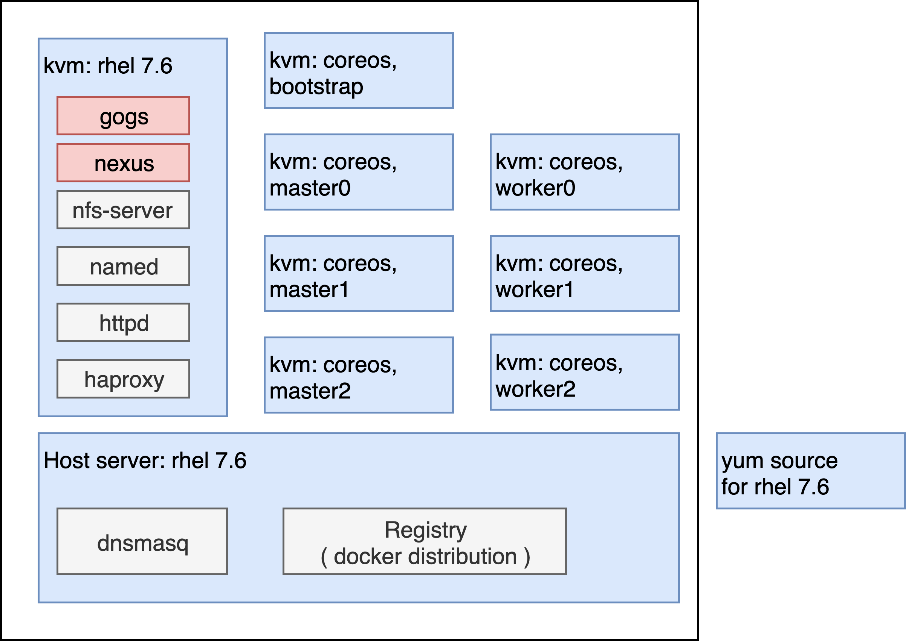

# containered cloud-native (ccn) roadshow 离线部署

CCN是一个不错的演示openshift之上，ci/cd, cloud-native, istio, serverless的演示教材。在目录files/ccn/pdf/下面，可以找到教材的pdf版本，大家可以看到，教学的内容非常丰富。但是upstream的CCN是基于rh demo system的，必须在线，这里就做了一个离线的版本，供给客户离线演示。

## 离线部署架构描述

CCN一共有4个module，当前做了m1, m2, m3，最后的m4是serverless的，由于对应的红帽产品还是TP阶段，以后有时间了再做。

做CCN的离线，主要有以下3部分工作
- github 离线
- maven, npm 离线
- 需要的镜像离线

在实验室的部署架构如下，供参考：


可以看到，与标准的部署架构没什么区别，就是在helper节点上面，加了gogs, nexus。

## 部署过程

首先，去这里下载需要的镜像打包，为了演示集群升级，制作了4.2.10, 4.2.12，4.2.13
- https://drive.google.com/drive/u/2/folders/1KYTMQnurBYwIz9Qh64_G2gILNiDP6C9e

其次，按照 https://github.com/wangzheng422/docker_env/blob/master/redhat/ocp4/4.2.disconnect.operator.md ，离线部署一个集群。

第三，运行 demo.env.deploy.sh，在helper上部署gogs, nexus。 脚本在 files/4.2/ccn下面。

第四，从 github 上下载 ccn infra 的项目，上传到helper节点上，进入setup目录，逐步的执行 preparelab_ccn.sh 脚本，未来目标，是这个脚本可以直接执行，但是目前，还是逐步的执行，比较靠谱。

## 教材修订

m3的教材，是修订过的，因为原始教材，用的service mesh TP版本，GA和TP版本差别较大。

m1, m2的教材，还是用在线的版本，有2个要注意的地方
- 密码都变成了openshift
- git仓库，都使用 http://gogs.redhat.ren:10080/root/*** ，不用每个用户去找自己的gogs了，因为教学内容没有git push的内容。

## 其他备忘

```bash
yum install -y wget jq

# Keycloak credentials: admin / 2kBdjDwcZK94
# STACK_ID: stacksq1xbet4os1uioep

```
manully patch image stream
- jenkins:2 to registry.redhat.ren/ocp4/openshift4@sha256:*****
- jenkins:latest to registry.redhat.ren/ocp4/openshift4@sha256:*****

tips
```bash
oc get istio-io -n opentlc-mgr-tutorial

oc new-build -i openshift/redhat-openjdk18-openshift:1.5 --binary --name=inventory-quarkus -l app=inventory-quarkus

```

todo
- PPT