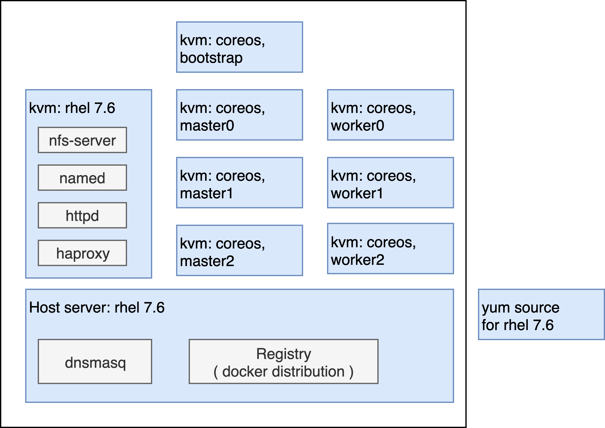
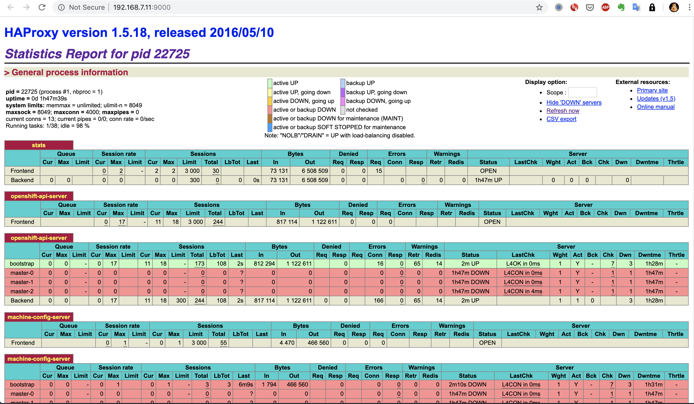
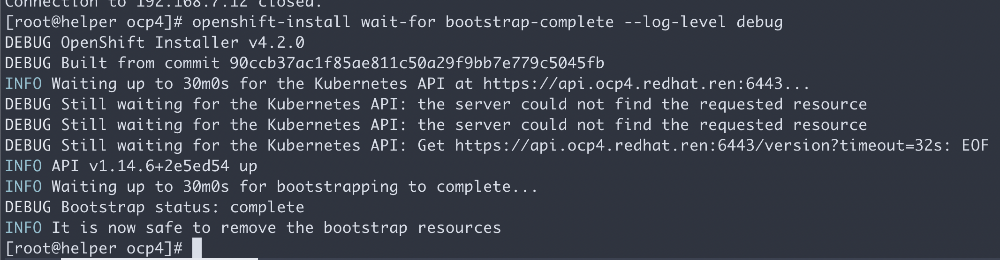
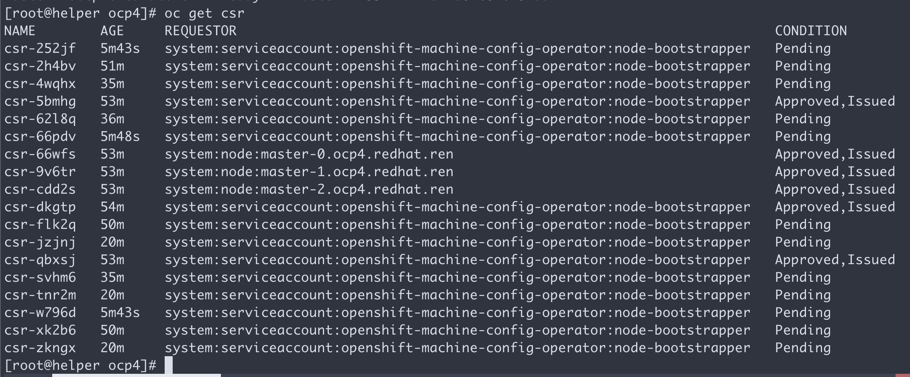
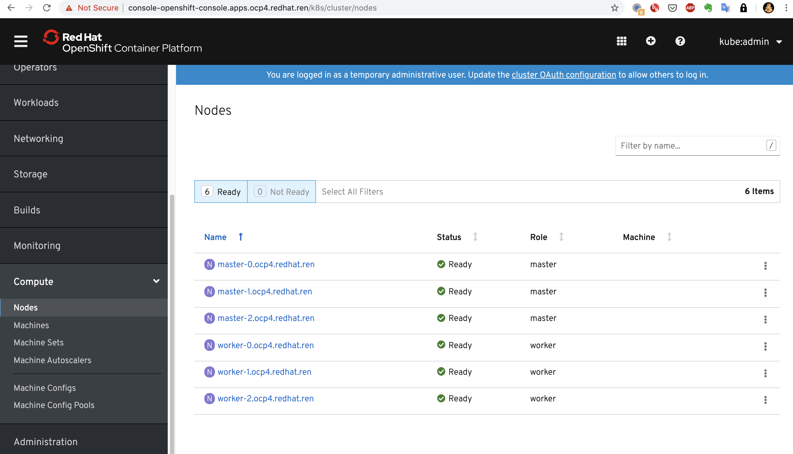
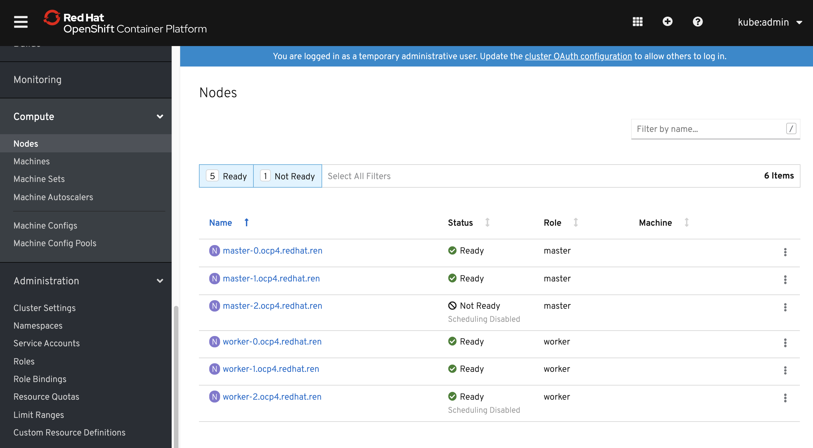
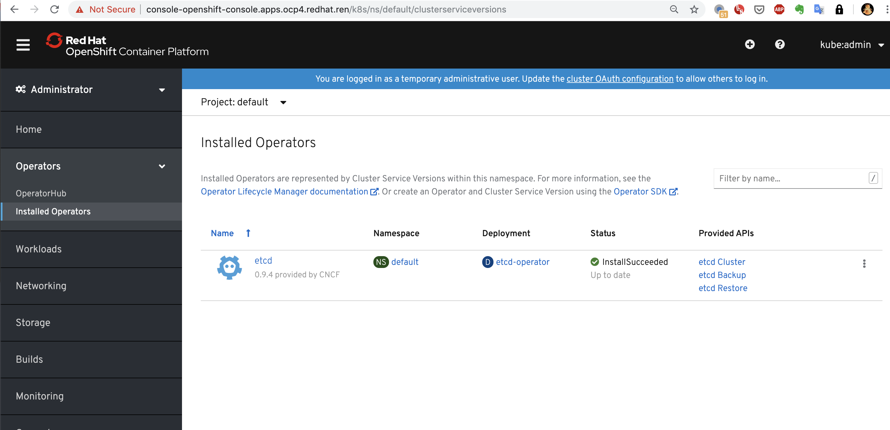

# openshift 4.2 静态IP离线 baremetal 安装，包含operator hub

本文描述ocp4.2在baremental(kvm模拟)上面，静态ip安装的方法。包括operator hub步骤。

以下是本次使用的虚拟机配置： 
https://docs.google.com/spreadsheets/d/1dwgh72r4ZfxEIFV82e_qe0T4w3CpENG_HqSejB3IUQs/edit#gid=0 

本次实验的简要说明： https://docs.google.com/presentation/d/1_iy_YWnr6YX1tkwhw46ttCMkEoyPcHXvZvGQBDqJMyI/edit



## 以下是参考材料
https://blog.openshift.com/openshift-4-2-disconnected-install/

https://blog.openshift.com/openshift-4-bare-metal-install-quickstart/

https://github.com/christianh814/ocp4-upi-helpernode#ocp4-upi-helper-node-playbook

https://github.com/openshift/cluster-samples-operator/blob/master/manifests/image-references

https://github.com/e-minguez/ocp4-upi-bm-pxeless-staticips/blob/master/docs/12-post-installation.md

## 离线安装包下载

ocp4.2的离线安装包下载和3.11不太一样，按照如下方式准备。另外，由于默认的baremental是需要dhcp, pxe环境的，那么需要准备一个工具机，上面有dhcp, tftp, haproxy等工具，另外为了方便项目现场工作，还准备了ignition文件的修改工具，所以离线安装包需要一些其他第三方的工具。

https://github.com/wangzheng422/ocp4-upi-helpernode 这个工具，是创建工具机用的。

https://github.com/wangzheng422/filetranspiler 这个工具，是修改ignition文件用的。

打包好的安装包，在这里下载，目前最新版本是ocp 4.2.8： https://drive.google.com/drive/u/2/folders/18d7qLYrN6qA3QnTFxMXkq9v5jHSiQ2qT

其中包括4个文件：
- ocp4.tgz  这个文件包含了iso等安装介质，以及各种安装脚本，里面还有operator hub catalog镜像文件，全部下载的镜像列表等。需要复制到宿主机，以及工具机上去。
- registry.with.operator.hub.tgz  这个文件也是docker image registry的仓库打包文件，由于只有ocp和operator hub catalog，以及少量的其他辅助镜像, (计划再加入kafka，etcd，maridb，servicemesh，集群日志operator所用的镜像)，所以比较小。但是要运行operator的话，需要先补充镜像。按照这里操作： https://github.com/wangzheng422/docker_env/blob/master/redhat/ocp4/4.2.add.image.md
- registry.with.operator.image.tgz  这个文件是docker registry的仓库打包文件，需要复制到docker registry的服务器主机上去。由于包含了sample-operator，以及operator hub里面的很多image，所以比较大。其中sample-operator用到的镜像大小大概占一半，大概40G。另外请注意，由于4.2版本operator描述文件并不包含所有operator用到的image，所以这个打包文件里面的镜像并不全，大概是所有需要的image的2/3。作者会不断想办法补充，大家也可以等到4.3，那个时候，operator描述文件会包含全部的image，将能够通过脚本自动的下载全部的镜像。如果下载者的网络不稳定，建议在外网主机上下载，然后rsync回本地。
- rhel-data.tgz 这个文件是 rhel 7 主机的yum更新源，这么大是因为里面有gpu, epel等其他的东西。这个包主要用于安装宿主机，工具机，以及作为计算节点的rhel。

## 在外网云主机上面准备离线安装源

```bash
# on vultr

mkdir -p /data/ocp4
cd /data/ocp4

wget -O build.dist.sh https://raw.githubusercontent.com/wangzheng422/docker_env/dev/redhat/ocp4/files/4.2/docker_images/build.dist.sh

yum -y install podman docker-distribution pigz skopeo docker buildah jq python3-pip 

# https://blog.csdn.net/ffzhihua/article/details/85237411
wget http://mirror.centos.org/centos/7/os/x86_64/Packages/python-rhsm-certificates-1.19.10-1.el7_4.x86_64.rpm
rpm2cpio python-rhsm-certificates-1.19.10-1.el7_4.x86_64.rpm | cpio -iv --to-stdout ./etc/rhsm/ca/redhat-uep.pem | tee /etc/rhsm/ca/redhat-uep.pem

systemctl start docker

docker login -u ****** -p ******** registry.redhat.io
docker login -u ****** -p ******** registry.access.redhat.com
docker login -u ****** -p ******** registry.connect.redhat.com

podman login -u ****** -p ******** registry.redhat.io
podman login -u ****** -p ******** registry.access.redhat.com
podman login -u ****** -p ******** registry.connect.redhat.com

# to download the pull-secret.json, open following link
# https://cloud.redhat.com/openshift/install/metal/user-provisioned
cat << 'EOF' >pull-secret.json
{"auths":{"cloud.openshift.com":*********************
EOF

bash build.dist.sh

rm -f /data/ocp4/pull-secret.json

```
output of mirror of images
```
Success
Update image:  registry.redhat.ren/ocp4/openshift4:4.2.8
Mirror prefix: registry.redhat.ren/ocp4/openshift4

To use the new mirrored repository to install, add the following section to the install-config.yaml:

imageContentSources:
- mirrors:
  - registry.redhat.ren/ocp4/openshift4
  source: quay.io/openshift-release-dev/ocp-release
- mirrors:
  - registry.redhat.ren/ocp4/openshift4
  source: quay.io/openshift-release-dev/ocp-v4.0-art-dev


To use the new mirrored repository for upgrades, use the following to create an ImageContentSourcePolicy:

apiVersion: operator.openshift.io/v1alpha1
kind: ImageContentSourcePolicy
metadata:
  name: example
spec:
  repositoryDigestMirrors:
  - mirrors:
    - registry.redhat.ren/ocp4/openshift4
    source: quay.io/openshift-release-dev/ocp-release
  - mirrors:
    - registry.redhat.ren/ocp4/openshift4
    source: quay.io/openshift-release-dev/ocp-v4.0-art-dev

```

## 宿主机准备

本次实验，是在一个32C， 256G 的主机上面，用很多个虚拟机安装测试。所以先准备这个宿主机。

```bash
hostnamectl set-hostname base.redhat.ren

cat << EOF >>  /etc/hosts
172.29.122.232 yum.redhat.ren
EOF

# 准备yum更新源
mkdir /etc/yum.repos.d.bak
mv /etc/yum.repos.d/* /etc/yum.repos.d.bak
cat << EOF > /etc/yum.repos.d/remote.repo
[remote]
name=RHEL FTP
baseurl=ftp://yum.redhat.ren/data
enabled=1
gpgcheck=0

EOF

yum clean all
yum repolist

yum -y install byobu htop 

# 配置dns服务
yum -y install dnsmasq

cat  > /etc/dnsmasq.d/openshift-cluster.conf << EOF
local=/redhat.ren/
address=/yum.redhat.ren/172.29.122.233
address=/registry.redhat.ren/192.168.7.1
EOF

systemctl restart dnsmasq.service && systemctl enable dnsmasq.service && systemctl status dnsmasq.service

firewall-cmd --permanent --add-service=dns
firewall-cmd --reload

systemctl restart dnsmasq

# on kvm host
# cat << EOF >>  /etc/hosts
# 127.0.0.1 vm.redhat.ren
# EOF

# 配置registry
mkdir /etc/crts/ && cd /etc/crts
openssl req \
   -newkey rsa:2048 -nodes -keyout redhat.ren.key \
   -x509 -days 3650 -out redhat.ren.crt -subj \
   "/C=CN/ST=GD/L=SZ/O=Global Security/OU=IT Department/CN=*.redhat.ren"

cp /etc/crts/redhat.ren.crt /etc/pki/ca-trust/source/anchors/
update-ca-trust extract

cd /data
# tar zxf registry.tgz
yum -y install podman docker-distribution pigz skopeo
pigz -dc registry.tgz | tar xf -
cat << EOF > /etc/docker-distribution/registry/config.yml
version: 0.1
log:
  fields:
    service: registry
storage:
    cache:
        layerinfo: inmemory
    filesystem:
        rootdirectory: /data/registry
    delete:
        enabled: true
http:
    addr: :443
    tls:
       certificate: /etc/crts/redhat.ren.crt
       key: /etc/crts/redhat.ren.key
EOF
# systemctl restart docker
systemctl enable docker-distribution
systemctl restart docker-distribution
# podman login registry.redhat.ren -u a -p a

firewall-cmd --permanent --add-service=https
firewall-cmd --reload

cat /etc/crts/redhat.ren.crt

# https://github.com/christianh814/ocp4-upi-helpernode/blob/master/docs/quickstart.md

# 准备vnc环境

yum -y install tigervnc-server tigervnc gnome-terminal gnome-session gnome-classic-session gnome-terminal nautilus-open-terminal control-center liberation-mono-fonts google-noto-sans-cjk-fonts google-noto-sans-fonts fonts-tweak-tool

yum install -y    qgnomeplatform   xdg-desktop-portal-gtk   NetworkManager-libreswan-gnome   PackageKit-command-not-found   PackageKit-gtk3-module   abrt-desktop   at-spi2-atk   at-spi2-core   avahi   baobab   caribou   caribou-gtk2-module   caribou-gtk3-module   cheese   compat-cheese314   control-center   dconf   empathy   eog   evince   evince-nautilus   file-roller   file-roller-nautilus   firewall-config   firstboot   fprintd-pam   gdm   gedit   glib-networking   gnome-bluetooth   gnome-boxes   gnome-calculator   gnome-classic-session   gnome-clocks   gnome-color-manager   gnome-contacts   gnome-dictionary   gnome-disk-utility   gnome-font-viewer   gnome-getting-started-docs   gnome-icon-theme   gnome-icon-theme-extras   gnome-icon-theme-symbolic   gnome-initial-setup   gnome-packagekit   gnome-packagekit-updater   gnome-screenshot   gnome-session   gnome-session-xsession   gnome-settings-daemon   gnome-shell   gnome-software   gnome-system-log   gnome-system-monitor   gnome-terminal   gnome-terminal-nautilus   gnome-themes-standard   gnome-tweak-tool   nm-connection-editor   orca   redhat-access-gui   sane-backends-drivers-scanners   seahorse   setroubleshoot   sushi   totem   totem-nautilus   vinagre   vino   xdg-user-dirs-gtk   yelp

yum install -y    cjkuni-uming-fonts   dejavu-sans-fonts   dejavu-sans-mono-fonts   dejavu-serif-fonts   gnu-free-mono-fonts   gnu-free-sans-fonts   gnu-free-serif-fonts   google-crosextra-caladea-fonts   google-crosextra-carlito-fonts   google-noto-emoji-fonts   jomolhari-fonts   khmeros-base-fonts   liberation-mono-fonts   liberation-sans-fonts   liberation-serif-fonts   lklug-fonts   lohit-assamese-fonts   lohit-bengali-fonts   lohit-devanagari-fonts   lohit-gujarati-fonts   lohit-kannada-fonts   lohit-malayalam-fonts   lohit-marathi-fonts   lohit-nepali-fonts   lohit-oriya-fonts   lohit-punjabi-fonts   lohit-tamil-fonts   lohit-telugu-fonts   madan-fonts   nhn-nanum-gothic-fonts   open-sans-fonts   overpass-fonts   paktype-naskh-basic-fonts   paratype-pt-sans-fonts   sil-abyssinica-fonts   sil-nuosu-fonts   sil-padauk-fonts   smc-meera-fonts   stix-fonts   thai-scalable-waree-fonts   ucs-miscfixed-fonts   vlgothic-fonts   wqy-microhei-fonts   wqy-zenhei-fonts

vncpasswd

cat << EOF > ~/.vnc/xstartup
#!/bin/sh
unset SESSION_MANAGER
unset DBUS_SESSION_BUS_ADDRESS
gnome-session &
EOF
chmod +x ~/.vnc/xstartup

vncserver :1 -geometry 1280x800
# 如果你想停掉vnc server，这么做
vncserver -kill :1

firewall-cmd --permanent --add-port=6001/tcp
firewall-cmd --permanent --add-port=5901/tcp
firewall-cmd --reload

# connect vnc at port 5901
# export DISPLAY=:1

# https://www.cyberciti.biz/faq/how-to-install-kvm-on-centos-7-rhel-7-headless-server/

# 配置kvm环境
yum -y install qemu-kvm libvirt libvirt-python libguestfs-tools virt-install virt-viewer virt-manager

systemctl enable libvirtd
systemctl start libvirtd

lsmod | grep -i kvm
brctl show
virsh net-list
virsh net-dumpxml default

# 创建实验用虚拟网络

cat << EOF >  /data/virt-net.xml
<network>
  <name>openshift4</name>
  <forward mode='nat'>
    <nat>
      <port start='1024' end='65535'/>
    </nat>
  </forward>
  <bridge name='openshift4' stp='on' delay='0'/>
  <domain name='openshift4'/>
  <ip address='192.168.7.1' netmask='255.255.255.0'>
  </ip>
</network>
EOF

virsh net-define --file virt-net.xml
virsh net-autostart openshift4
virsh net-start openshift4

# 创建工具机

mkdir -p /data/kvm

virt-install --name="ocp4-aHelper" --vcpus=2 --ram=4096 \
--disk path=/data/kvm/ocp4-aHelper.qcow2,bus=virtio,size=230 \
--os-variant centos7.0 --network network=openshift4,model=virtio \
--boot menu=on --location /data/rhel-server-7.6-x86_64-dvd.iso \
--initrd-inject helper-ks.cfg --extra-args "inst.ks=file:/helper-ks.cfg" 

virt-viewer --domain-name ocp4-aHelper
virsh start ocp4-aHelper
virsh list --all

```
## 工具机准备

以下是在工具机里面，进行的安装操作。

```bash

# in helper node
mkdir /etc/yum.repos.d.bak
mv /etc/yum.repos.d/* /etc/yum.repos.d.bak/
cat << EOF > /etc/yum.repos.d/remote.repo
[remote]
name=RHEL FTP
baseurl=ftp://yum.redhat.ren/data
enabled=1
gpgcheck=0

EOF

yum clean all
yum repolist

yum -y install ansible git unzip podman
# scp ocp4.tgz to /root
cd /root
tar zvxf ocp4.tgz
cd /root/ocp4
unzip ocp4-upi-helpernode-master.zip
podman load -i fedora.tgz
# 根据现场环境，修改 ocp4-upi-helpernode-master/vars-static.yaml
cd ocp4-upi-helpernode-master
ansible-playbook -e @vars-static.yaml -e staticips=true tasks/main.yml

# try this:
/usr/local/bin/helpernodecheck

# 定制ignition

# on helper node
cd /root/ocp4
export BUILDNUMBER=$(cat release.txt | grep 'Name:' | awk '{print $NF}')
echo ${BUILDNUMBER}
# export BUILDNUMBER=4.2.4
export OCP_RELEASE=${BUILDNUMBER}
export LOCAL_REG='registry.redhat.ren'
export LOCAL_REPO='ocp4/openshift4'
export UPSTREAM_REPO='openshift-release-dev'
export LOCAL_SECRET_JSON="pull-secret.json"
export OPENSHIFT_INSTALL_RELEASE_IMAGE_OVERRIDE=${LOCAL_REG}/${LOCAL_REPO}:${OCP_RELEASE}
export RELEASE_NAME="ocp-release"

cat << EOF > /root/.ssh/config
StrictHostKeyChecking no
UserKnownHostsFile=/dev/null
EOF

cd /root/ocp4
# scp ocp4.tgz to /root
# scp install-config.yaml to /root/ocp4
# 根据现场环境，修改 install-config.yaml
# 至少要修改ssh key， 还有 additionalTrustBundle，这个是镜像仓库的csr 
# example file at files/4.2/kvm/

/bin/rm -rf *.ign .openshift_install_state.json auth bootstrap master0 master1 master2 worker0 worker1 worker2

openshift-install create ignition-configs --dir=/root/ocp4

# 以下操作本来是想设置网卡地址，但是实践发现是不需要的。
# 保留在这里，是因为他可以在安装的时候注入文件，非常有用。
# mkdir -p bootstrap/etc/sysconfig/network-scripts/
# cat <<EOF > bootstrap/etc/sysconfig/network-scripts/ifcfg-ens3
# DEVICE=ens3
# BOOTPROTO=none
# ONBOOT=yes
# IPADDR=192.168.7.12
# NETMASK=255.255.255.0
# GATEWAY=192.168.7.1
# DNS=192.168.7.11
# DNS1=192.168.7.11
# DNS2=192.168.7.1
# DOMAIN=redhat.ren
# PREFIX=24
# DEFROUTE=yes
# IPV6INIT=no
# EOF
# filetranspiler -i bootstrap.ign -f bootstrap -o bootstrap-static.ign
# /bin/cp -f bootstrap-static.ign /var/www/html/ignition/

/bin/cp -f bootstrap.ign /var/www/html/ignition/bootstrap-static.ign
/bin/cp -f master.ign /var/www/html/ignition/master-0.ign
/bin/cp -f master.ign /var/www/html/ignition/master-1.ign
/bin/cp -f master.ign /var/www/html/ignition/master-2.ign
/bin/cp -f worker.ign /var/www/html/ignition/worker-0.ign
/bin/cp -f worker.ign /var/www/html/ignition/worker-1.ign
/bin/cp -f worker.ign /var/www/html/ignition/worker-2.ign

```
## 回到宿主机

本来，到了这一步，就可以开始安装了，但是我们知道coreos装的时候，要手动输入很长的命令行，实际操作的时候，那是不可能输入对的，输入错一个字符，安装就失败，要重启，重新输入。。。

为了避免这种繁琐的操作，参考网上的做法，我们就需要为每个主机定制iso了。

这里面有一个坑，我们是不知道主机的网卡名称的，只能先用coreos iso安装启动一次，进入单用户模式以后，ip a 来查看以下，才能知道，一般来说，是ens3。

```bash
# on kvm host

yum -y install genisoimage libguestfs-tools
systemctl start libvirtd

export NGINX_DIRECTORY=/data/ocp4
export RHCOSVERSION=4.2.0
export VOLID=$(isoinfo -d -i ${NGINX_DIRECTORY}/rhcos-${RHCOSVERSION}-x86_64-installer.iso | awk '/Volume id/ { print $3 }')
TEMPDIR=$(mktemp -d)
echo $VOLID
echo $TEMPDIR

cd ${TEMPDIR}
# Extract the ISO content using guestfish (to avoid sudo mount)
guestfish -a ${NGINX_DIRECTORY}/rhcos-${RHCOSVERSION}-x86_64-installer.iso \
  -m /dev/sda tar-out / - | tar xvf -

# Helper function to modify the config files
modify_cfg(){
  for file in "EFI/redhat/grub.cfg" "isolinux/isolinux.cfg"; do
    # Append the proper image and ignition urls
    sed -e '/coreos.inst=yes/s|$| coreos.inst.install_dev=vda coreos.inst.image_url='"${URL}"'\/install\/'"${BIOSMODE}"'.raw.gz coreos.inst.ignition_url='"${URL}"'\/ignition\/'"${NODE}"'.ign ip='"${IP}"'::'"${GATEWAY}"':'"${NETMASK}"':'"${FQDN}"':'"${NET_INTERFACE}"':none:'"${DNS}"' nameserver='"${DNS}"'|' ${file} > $(pwd)/${NODE}_${file##*/}
    # Boot directly in the installation
    sed -i -e 's/default vesamenu.c32/default linux/g' -e 's/timeout 600/timeout 10/g' $(pwd)/${NODE}_${file##*/}
  done
}

URL="http://192.168.7.11:8080/"
GATEWAY="192.168.7.1"
NETMASK="255.255.255.0"
DNS="192.168.7.11"

# BOOTSTRAP
# TYPE="bootstrap"
NODE="bootstrap-static"
IP="192.168.7.12"
FQDN="bootstrap"
BIOSMODE="bios"
NET_INTERFACE="ens3"
modify_cfg

# MASTERS
# TYPE="master"
# MASTER-0
NODE="master-0"
IP="192.168.7.13"
FQDN="master-0"
BIOSMODE="bios"
NET_INTERFACE="ens3"
modify_cfg

# MASTER-1
NODE="master-1"
IP="192.168.7.14"
FQDN="master-1"
BIOSMODE="bios"
NET_INTERFACE="ens3"
modify_cfg

# MASTER-2
NODE="master-2"
IP="192.168.7.15"
FQDN="master-2"
BIOSMODE="bios"
NET_INTERFACE="ens3"
modify_cfg

# WORKERS
NODE="worker-0"
IP="192.168.7.16"
FQDN="worker-0"
BIOSMODE="bios"
NET_INTERFACE="ens3"
modify_cfg

NODE="worker-1"
IP="192.168.7.17"
FQDN="worker-1"
BIOSMODE="bios"
NET_INTERFACE="ens3"
modify_cfg

NODE="worker-2"
IP="192.168.7.18"
FQDN="worker-2"
BIOSMODE="bios"
NET_INTERFACE="ens3"
modify_cfg

# Generate the images, one per node as the IP configuration is different...
# https://github.com/coreos/coreos-assembler/blob/master/src/cmd-buildextend-installer#L97-L103
for node in master-0 master-1 master-2 worker-0 worker-1 worker-2 bootstrap-static; do
  # Overwrite the grub.cfg and isolinux.cfg files for each node type
  for file in "EFI/redhat/grub.cfg" "isolinux/isolinux.cfg"; do
    /bin/cp -f $(pwd)/${node}_${file##*/} ${file}
  done
  # As regular user!
  genisoimage -verbose -rock -J -joliet-long -volset ${VOLID} \
    -eltorito-boot isolinux/isolinux.bin -eltorito-catalog isolinux/boot.cat \
    -no-emul-boot -boot-load-size 4 -boot-info-table \
    -eltorito-alt-boot -efi-boot images/efiboot.img -no-emul-boot \
    -o ${NGINX_DIRECTORY}/${node}.iso .
done

# Optionally, clean up
cd
rm -Rf ${TEMPDIR}

cd /data/ocp4

# finally, we can start install :)
# 你可以一口气把虚拟机都创建了，然后喝咖啡等着。
# 从这一步开始，到安装完毕，大概30分钟。
virt-install --name=ocp4-bootstrap --vcpus=4 --ram=8192 \
--disk path=/data/kvm/ocp4-bootstrap.qcow2,bus=virtio,size=120 \
--os-variant rhel8.0 --network network=openshift4,model=virtio \
--boot menu=on --cdrom /data/ocp4/bootstrap-static.iso   

# 想登录进coreos一探究竟？那么这么做
# ssh core@192.168.7.12 
# journalctl -b -f -u bootkube.service

virt-install --name=ocp4-master0 --vcpus=4 --ram=32768 \
--disk path=/data/kvm/ocp4-master0.qcow2,bus=virtio,size=120 \
--os-variant rhel8.0 --network network=openshift4,model=virtio \
--boot menu=on --cdrom /data/ocp4/master-0.iso 

# ssh core@192.168.7.13

virt-install --name=ocp4-master1 --vcpus=4 --ram=32768 \
--disk path=/data/kvm/ocp4-master1.qcow2,bus=virtio,size=120 \
--os-variant rhel8.0 --network network=openshift4,model=virtio \
--boot menu=on --cdrom /data/ocp4/master-1.iso 

virt-install --name=ocp4-master2 --vcpus=4 --ram=32768 \
--disk path=/data/kvm/ocp4-master2.qcow2,bus=virtio,size=120 \
--os-variant rhel8.0 --network network=openshift4,model=virtio \
--boot menu=on --cdrom /data/ocp4/master-2.iso 

virt-install --name=ocp4-worker0 --vcpus=4 --ram=32768 \
--disk path=/data/kvm/ocp4-worker0.qcow2,bus=virtio,size=120 \
--os-variant rhel8.0 --network network=openshift4,model=virtio \
--boot menu=on --cdrom /data/ocp4/worker-0.iso 

virt-install --name=ocp4-worker1 --vcpus=4 --ram=32768 \
--disk path=/data/kvm/ocp4-worker1.qcow2,bus=virtio,size=120 \
--os-variant rhel8.0 --network network=openshift4,model=virtio \
--boot menu=on --cdrom /data/ocp4/worker-1.iso 

virt-install --name=ocp4-worker2 --vcpus=4 --ram=32768 \
--disk path=/data/kvm/ocp4-worker2.qcow2,bus=virtio,size=120 \
--os-variant rhel8.0 --network network=openshift4,model=virtio \
--boot menu=on --cdrom /data/ocp4/worker-2.iso 

# on workstation
# open http://192.168.7.11:9000/
# to check
```
打开浏览器，能看到一个监控页面，我们就能大致了解安装的进度。


等了一段时间以后，监控上看大概是这样


## 在工具机上面

在bootstrap和装master阶段，用这个命令看进度。
```bash
openshift-install wait-for bootstrap-complete --log-level debug

```
一切正常的话，会看到这个。


有时候证书会过期，验证方法是登录 bootstrap, 看看过期时间。如果确定过期，要清除所有的openshift-install生成配置文件的缓存，重新来过。
```bash
echo | openssl s_client -connect localhost:6443 | openssl x509 -noout -text | grep Not
```
一般来说，如果在openshift-install这一步之前，按照文档，删除了缓存文件，就不会出现过期的现象。
```bash
cd ~/ocp4
export KUBECONFIG=/root/ocp4/auth/kubeconfig
echo "export KUBECONFIG=/root/ocp4/auth/kubeconfig" >> ~/.bashrc
oc get nodes
```
这个时候，只能看到master，是因为worker的csr没有批准。如果虚拟机是一口气创建的，那么多半不会遇到下面的问题。
```bash
oc get csr
```
会发现有很多没有被批准的


批准之
```bash
yum -y install jq
oc get csr -ojson | jq -r '.items[] | select(.status == {} ) | .metadata.name' | xargs oc adm certificate approve
```
然后worker 节点cpu飙高，之后就能看到worker了。


我们的工具机是带nfs的，那么就配置高档一些的nfs存储吧，不要用emptydir
```bash
bash ocp4-upi-helpernode-master/files/nfs-provisioner-setup.sh

oc edit configs.imageregistry.operator.openshift.io
# 修改 storage 部分
# storage:
#   pvc:
#     claim:
oc patch configs.imageregistry.operator.openshift.io cluster -p '{"spec":{"storage":{"pvc":{"claim":""}}}}' --type=merge

oc get clusteroperator image-registry
```
等一会，会看到这个，就对了。


上面的操作完成以后，就可以完成最后的安装了
```bash
openshift-install wait-for install-complete
# here is the output
INFO Waiting up to 30m0s for the cluster at https://api.ocp4.redhat.ren:6443 to initialize...
INFO Waiting up to 10m0s for the openshift-console route to be created...
INFO Install complete!
INFO To access the cluster as the system:admin user when using 'oc', run 'export KUBECONFIG=/root/ocp4/auth/kubeconfig'
INFO Access the OpenShift web-console here: https://console-openshift-console.apps.ocp4.redhat.ren
INFO Login to the console with user: kubeadmin, password: vo382-ajzAs-qaEXY-Tr2g2
```
配置一下本地的dns ( 把 *.apps.ocp4.redhat.ren 配置成 192.168.7.11 ) ，指向工具机的haproxy，打开浏览器就能访问管理界面了


## Operator Hub 离线安装

https://docs.openshift.com/container-platform/4.2/operators/olm-restricted-networks.html

https://github.com/operator-framework/operator-registry

https://www.cnblogs.com/ericnie/p/11777384.html?from=timeline&isappinstalled=0

https://access.redhat.com/documentation/en-us/openshift_container_platform/4.2/html-single/images/index

operator hub 准备分2个层次，一个是本文章描述的，制作operator hub的离线资源，并镜像operator 镜像。做到这一步，能够在离线部署的ocp4.2上，看到operator hub，并且能够部署operator。但是如果要用operator来部署要用的组件，那么operator会再去下载镜像，这个层次的镜像，也需要离线部署，但是由于每个operator需要的镜像都不一样，也没有统一的地方进行描述，所以需要各个项目现场，根据需要另外部署，本项目会尽量多的下载需要的镜像，但是目前无法避免遗漏。


```bash
# on helper node， 在工具机上
cd /root/ocp4

# scp /etc/crts/redhat.ren.crt 192.168.7.11:/root/ocp4/
oc project openshift-config
oc create configmap ca.for.registry \
    --from-file=registry.redhat.ren=/root/ocp4/redhat.ren.crt
# 如果你想删除这个config map，这么做
# oc delete configmap ca.for.registry
oc patch image.config.openshift.io/cluster -p '{"spec":{"additionalTrustedCA":{"name":"ca.for.registry"}}}'  --type=merge
# oc patch image.config.openshift.io/cluster -p '{"spec":{"registrySources":{"insecureRegistries":["registry.redhat.ren"]}}}'  --type=merge
oc get image.config.openshift.io/cluster -o yaml

# 以下这个步骤是官网文档要做的，实践中发现，disconnected环境不需要
# oc patch OperatorHub cluster --type json -p '[{"op": "add", "path": "/spec/disableAllDefaultSources", "value": true}]'
# 如果你不小心还是照着官网做了，用如下步骤删掉
oc patch OperatorHub cluster --type json  -p '[{"op": "remove", "path": "/spec/disableAllDefaultSources"}]'

yum -y install python36
# 根据项目现场情况，修改以下脚本参数后运行
bash image.registries.conf.sh yaml.image.ok.list.uniq

# 由于某些ocp 4.2的更新机制，以下操作会触发集群更新，
# 集群节点会逐个重启，集群组件也会逐个重启，请等待集群重启完毕。
oc apply -f ./99-worker-zzz-container-registries.yaml -n openshift-config
oc apply -f ./99-master-zzz-container-registries.yaml -n openshift-config

# ！！！正常情况，以下操作不需要！！！
# 以下操作，删除mirror镜像信息，也会触发集群更新操作，请等待集群重启完毕
oc delete -f ./99-worker-zzz-container-registries.yaml -n openshift-config
oc delete -f ./99-master-zzz-container-registries.yaml -n openshift-config

watch oc get machineconfigpools

watch oc get node
```
从监控界面，能看到节点在升级，重启。


```bash

# on helper node

# 如果想看到redhat的operator，这样做
# 镜像源在 docker.io/wangzheng422/custom-registry-redhat
cat <<EOF > redhat-operator-catalog.yaml
apiVersion: operators.coreos.com/v1alpha1
kind: CatalogSource
metadata:
  name: redhat-operator-catalog
  namespace: openshift-marketplace
spec:
  displayName: Redhat Operator Catalog
  sourceType: grpc
  image: registry.redhat.ren/docker.io/wangzheng422/custom-registry-redhat:2019-12-30
  publisher: Red Hat
EOF
oc create -f redhat-operator-catalog.yaml

# 如果想看到certified的operator，这样做
# 镜像源在 docker.io/wangzheng422/custom-registry-certified
cat <<EOF > certified-operator-catalog.yaml
apiVersion: operators.coreos.com/v1alpha1
kind: CatalogSource
metadata:
  name: certified-operator-catalog
  namespace: openshift-marketplace
spec:
  displayName: Certified Operator Catalog
  sourceType: grpc
  image: registry.redhat.ren/docker.io/wangzheng422/custom-registry-certified:2019-12-30
  publisher: Certified
EOF
oc create -f certified-operator-catalog.yaml


# 如果想看到community的operator，这样做
# 镜像源在 docker.io/wangzheng422/custom-registry-community
cat <<EOF > community-operator-catalog.yaml
apiVersion: operators.coreos.com/v1alpha1
kind: CatalogSource
metadata:
  name: community-operator-catalog
  namespace: openshift-marketplace
spec:
  displayName: Community Operator Catalog
  sourceType: grpc
  image: registry.redhat.ren/docker.io/wangzheng422/custom-registry-community:2019-12-30
  publisher: Community
EOF
oc create -f community-operator-catalog.yaml

# 想删除这些离线operator hub，就这样做。
# oc delete -f *-operator-catalog.yaml
# find . -name "*-operator-catalog.yaml" -exec oc delete -f {} \;

oc get pods -n openshift-marketplace
oc get catalogsource -n openshift-marketplace
oc get packagemanifest -n openshift-marketplace

```
能看到operator 列表


部署一个operator也能成功



## 尝试配置一下sample operator
```bash
## sample operator
# oc patch -n openshift-cluster-samples-operator  configs.samples.operator.openshift.io cluster -p '{"items[0]":{"spec":{"managementState":"Removed"}}}'  --type=merge
# oc patch -n openshift-cluster-samples-operator  configs.samples.operator.openshift.io cluster -p '{"spec":{"managementState":"Managed"}}'  --type=merge

oc patch -n openshift-cluster-samples-operator  configs.samples.operator.openshift.io cluster -p '{"spec":{"samplesRegistry":"registry.redhat.ren"}}'  --type=merge

bash is.patch.sh
```
要等一段很长的时间，这个配置才会生效。


## 其他链接

https://www.cnblogs.com/ericnie/p/11764124.html
