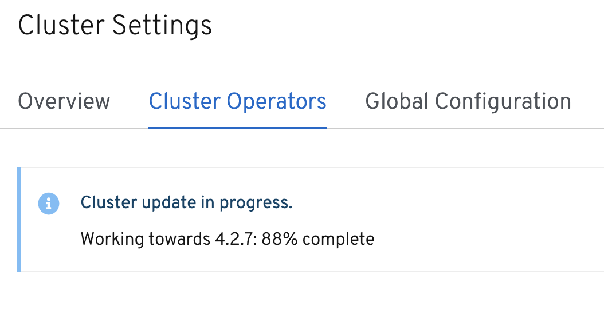

# openshift4 集群升级

4.2的集群升级很简单，更新一下镜像仓库，然后运行一个命令，等着就好了。

```bash
# on base host
cat << EOF > /etc/docker-distribution/registry/config.yml
version: 0.1
log:
  fields:
    service: registry
storage:
    cache:
        layerinfo: inmemory
    filesystem:
        rootdirectory: /data/4.2.7/registry
    delete:
        enabled: true
http:
    addr: :443
    tls:
       certificate: /etc/crts/redhat.ren.crt
       key: /etc/crts/redhat.ren.key
EOF

systemctl restart docker-distribution

# on helper node
# oc patch OperatorHub cluster --type json  -p '[{"op": "add", "path": "/spec/disableAllDefaultSources", "value": true}]'

oc patch OperatorHub cluster --type json  -p '[{"op": "remove", "path": "/spec/disableAllDefaultSources"}]'

oc patch -n openshift-cluster-samples-operator  configs.samples.operator.openshift.io cluster -p '{"items[0]":{"spec":{"managementState":"Removed"}}}'  --type=merge

oc adm upgrade --allow-explicit-upgrade --allow-upgrade-with-warnings=true --force=true --to-image=registry.redhat.ren/ocp4/openshift4:4.2.7 

```


