# quay proxy cache init

This doc describe how to setup quay proxy cache for openshift 4.20. For openshift, the ocp itself, and operator needs to pull images from different upstream registry. So we need to setup different organization for different upstream registry.

# create access token

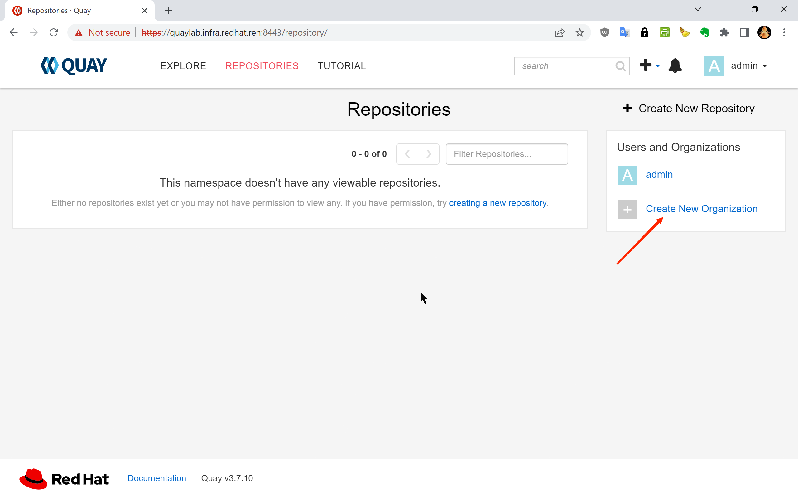

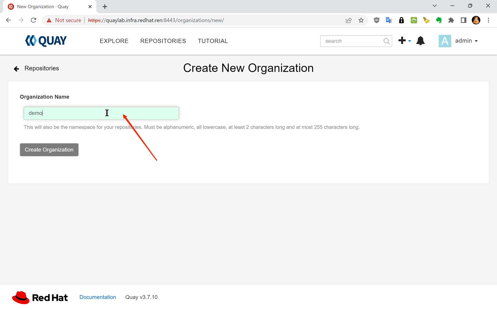

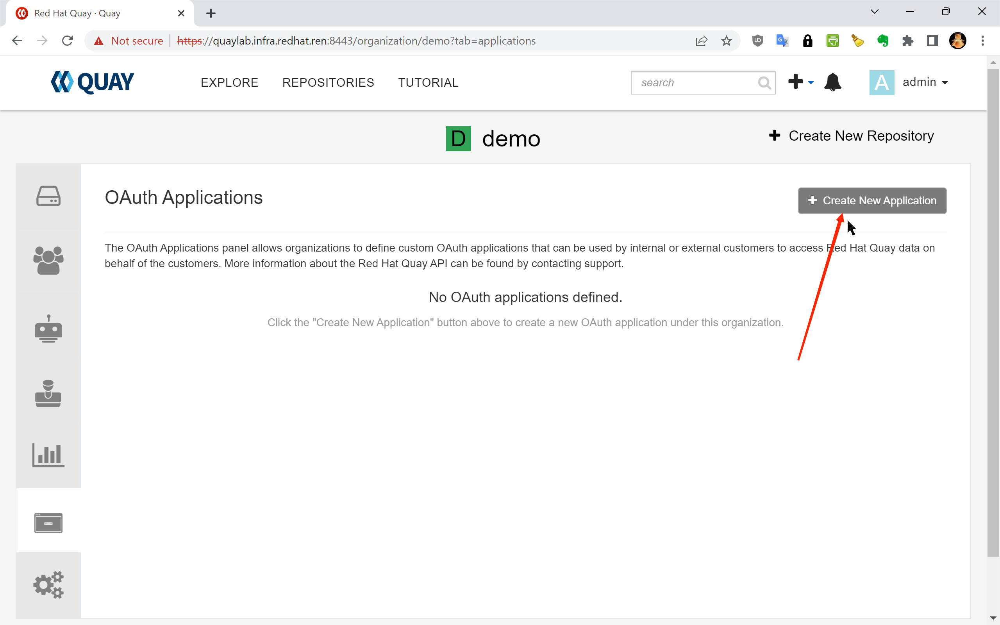

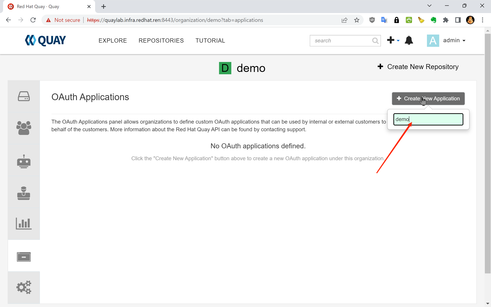

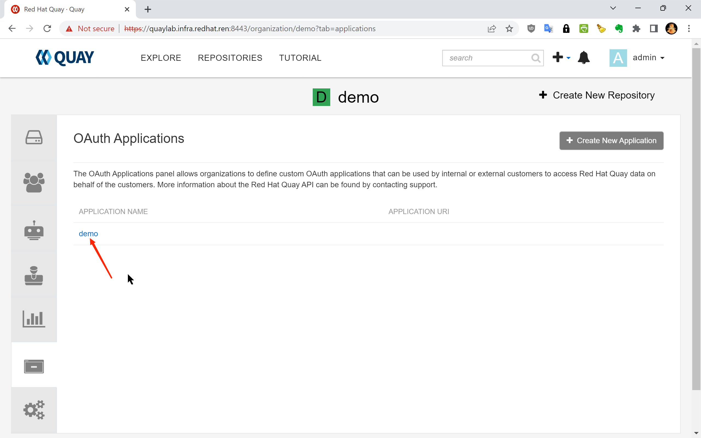

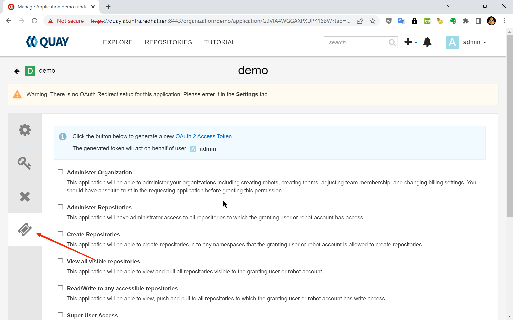

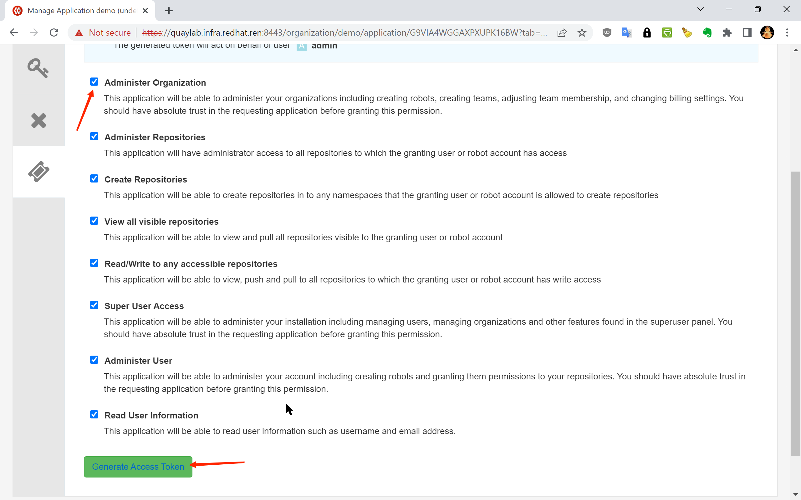

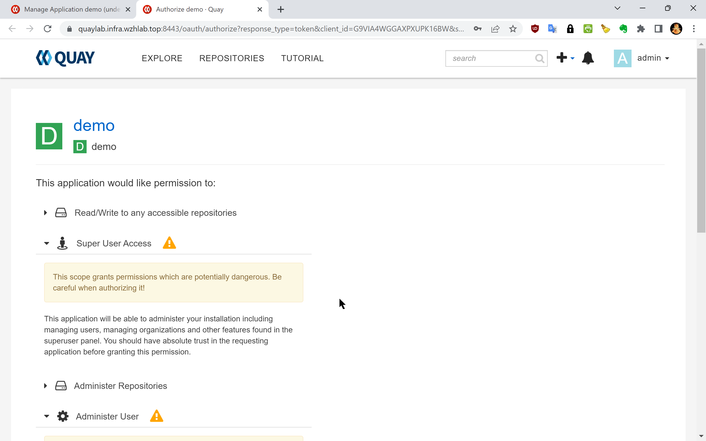

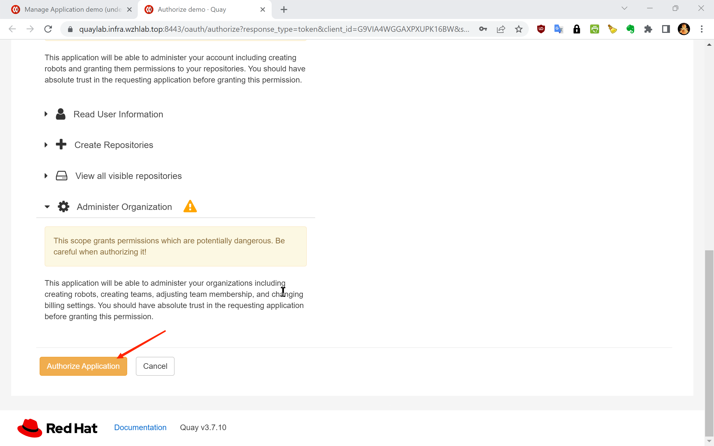

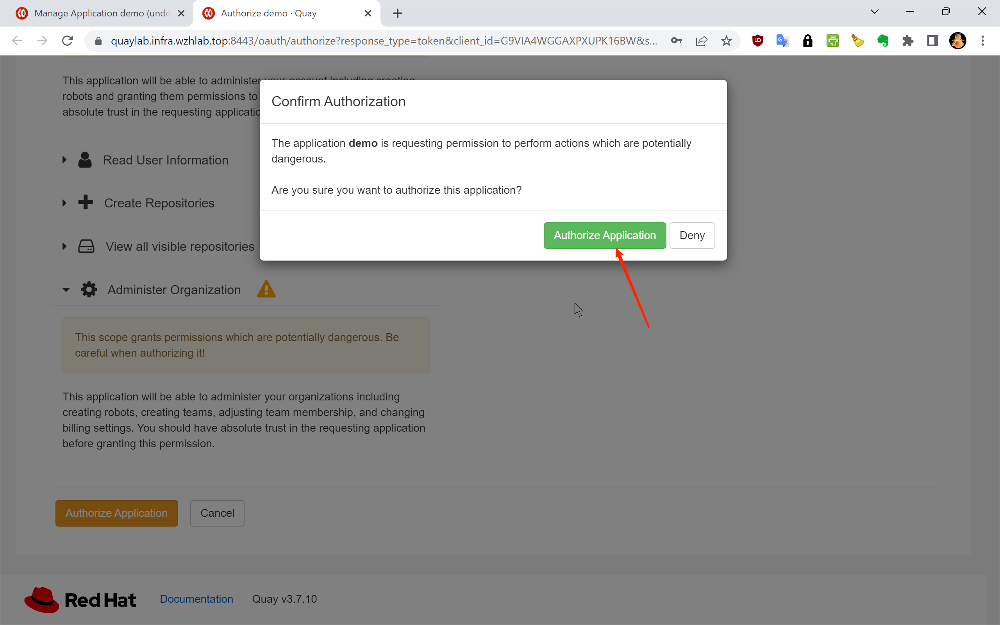

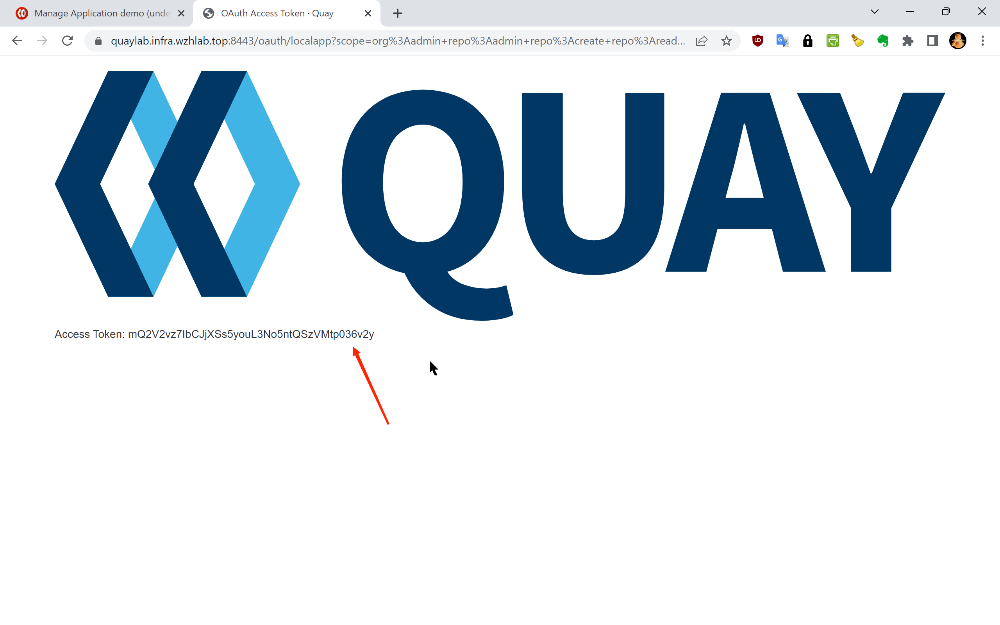

Access Token: mQ2V2vz7IbCJjXSs5youL3No5ntQSzVMtp036v2y

# create cache repo

```bash

mkdir -p /data/ocp4

cd /data/ocp4

wget https://raw.githubusercontent.com/wangzheng422/openshift4-shell/ocp-4.20/image-list/mirror.domain.list

wget https://raw.githubusercontent.com/wangzheng422/openshift4-shell/ocp-4.20/image-list/quay.cache.repo.sh


QUAY_LAB=mirror.infra.wzhlab.top:8443
TOKEN=UjhKNDL3sheHK1LwaN13qie30eS5L8VkOb6FEt6V

# create the cache repo
cd /data/ocp4/
bash quay.cache.repo.sh create $QUAY_LAB $TOKEN

# to delete the cache repo
cd /data/ocp4/
bash quay.cache.repo.sh delete $QUAY_LAB $TOKEN

# generate the quay cache registry config to openshift
# cd /data/ocp4/
# bash image.registries.conf.quay.sh $QUAY_LAB


```

# update cache repo password

redhat upstream registry need username and password for ocp installation image pull.

```bash

update_quay_cache_config() {

  local_quay=$1
  local_token=$2
  local_registry=$3
  local_username=$4
  local_password=$5

curl -X 'DELETE' \
  "https://$local_quay/api/v1/organization/cache_${local_registry//./_}/proxycache" \
  -H "Authorization: Bearer $local_token" \
  -H 'Content-Type: application/json' | jq

curl -X 'POST' \
  "https://$local_quay/api/v1/organization/cache_${local_registry//./_}/proxycache" \
  -H "Authorization: Bearer $local_token" \
  -H 'Content-Type: application/json' \
  -d "{
        \"org_name\": \"cache_${local_registry//./_}\",
        \"upstream_registry\": \"$local_registry\",
        \"upstream_registry_password\": \"$local_password\",
        \"upstream_registry_username\": \"$local_username\"
      }" | jq

}

registries=$(cat << EOF
registry.redhat.io
registry.access.redhat.com
registry.connect.redhat.com
EOF
)

# QUAY_LAB=mirror.infra.wzhlab.top:8443
# TOKEN=ZA0n4Sy7eqZDEOVl3Rnsv23ALguMs0l4E1ovGda0

var_username="<your redhat username>"
var_password="<your redhat password>"

while read -r line; do
    if [[ "$line" =~ [^[:space:]] ]]; then
        echo $line
        update_quay_cache_config $QUAY_LAB $TOKEN $line $var_username $var_password
    fi
done <<< "$registries"


```

# test

pull through quay proxy, and it will cache the image in quay proxy.

```bash

podman pull mirror.infra.wzhlab.top:8443/cache_quay_io/wangzheng422/debug-pod:alma-9.1

```
