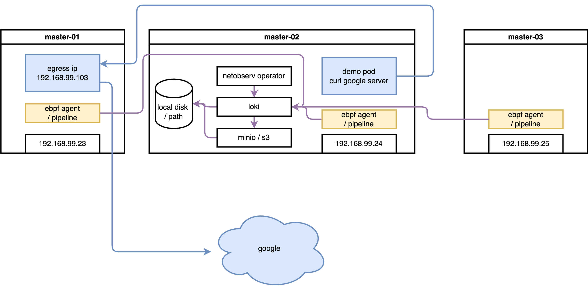
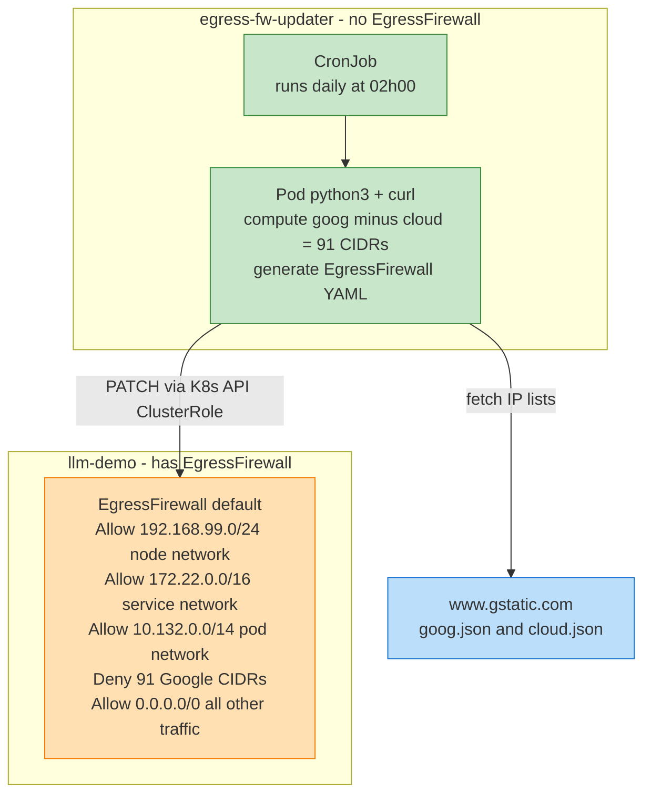

# openshift 4.20 Network Observability with ovn egress firewall

OpenShift 4.20 introduces eBPF as the agent for Network Observability (NetObserv). Unlike the previous IPFIX-based approach, eBPF runs as a DaemonSet directly on each node and captures packets at the kernel level — enabling RTT (Round-Trip Time) measurements with nanosecond precision, which was not possible before.

This document walks through the full setup: installing LokiStack as the log backend, deploying the Network Observability Operator, setting up an Egress IP scenario to observe external traffic paths, and finally implementing an automated EgressFirewall to block Google traffic based on dynamically updated IP ranges.

- https://docs.redhat.com/en/documentation/openshift_container_platform/4.20/html/network_observability/installing-network-observability-operators

The following diagram shows the overall architecture of this lab:



The lab uses a 3-master SNO-style cluster. Network flows are captured by eBPF agents on each node, enriched with Kubernetes metadata by `flowlogs-pipeline`, then stored in LokiStack (backed by S3 object storage). The OCP web console plugin (`netobserv-plugin`) queries Loki to visualize flows in real time. Separately, aggregated metrics are exported to the built-in OCP Prometheus for dashboard display.

# try with loki

## install loki

Network Observability stores raw flow logs (each individual TCP/UDP flow as a JSON record) in LokiStack. Loki is a log aggregation system optimized for large volumes of structured data — it compresses and stores logs in object storage (S3), making it far cheaper than storing in Prometheus time-series format. Without Loki, you can still get aggregated metrics via Prometheus, but you lose the ability to browse individual flow records and filter by pod, namespace, port, or protocol in the traffic flows table.

RTT measurement data is stored as a field (`TimeFlowRttNs`) in each flow log record in Loki. This is why Loki is a prerequisite for RTT visibility.

- [Installing the Loki Operator](https://docs.redhat.com/en/documentation/openshift_container_platform/4.20/html/network_observability/installing-network-observability-operators#network-observability-loki-installation_network_observability)

### create S3 bucket

Loki uses object storage (S3 or S3-compatible) as its primary data store. All flow log data — compressed chunks and index files — are written to S3. Without a working S3 backend, LokiStack pods will fail to start. In this lab we use **rustfs** (a lightweight, self-hosted S3-compatible server running on the helper node at `192.168.99.1:9000`) as a stand-in for a cloud S3 bucket.

The screenshot below shows the rustfs web UI after creating the `demo` bucket that Loki will use for storage. The bucket must exist before deploying LokiStack.


### install loki operator

With the S3 bucket ready, we install the **Loki Operator** from OperatorHub and then create a `LokiStack` custom resource. The key configuration decisions are:

- `size: 1x.demo` — the smallest deployment profile, suitable for lab/testing (production would use `1x.small` or `1x.medium`)
- `replication.factor: 1` — single replica to save resources; production should use 3
- `storage.secret` — references the Kubernetes Secret containing S3 credentials
- `storageClassName: nfs-csi` — local PVC storage for Loki component pods (ingester WAL, index cache); this is separate from S3 and holds hot/in-flight data
- `tenants.mode: openshift-network` — the special mode required by Network Observability (as opposed to `openshift-logging` mode for log aggregation)

The screenshot below shows the Loki Operator successfully installed from OperatorHub, ready for `LokiStack` CR creation.


```bash

oc new-project netobserv

# netobserv is a resource-hungry application, it has high requirements for the underlying loki, we configure the maximum gear, and the number of replicas, etc., to adapt to our test environment.

cat << EOF > ${BASE_DIR}/data/install/loki-netobserv.yaml
---
apiVersion: v1
kind: Secret
metadata:
  name: loki-s3 
stringData:
  access_key_id: rustfsadmin
  access_key_secret: rustfsadmin
  bucketnames: demo
  endpoint: http://192.168.99.1:9000
  # region: eu-central-1

---
apiVersion: loki.grafana.com/v1
kind: LokiStack
metadata:
  name: loki
spec:
  size: 1x.demo # 1x.medium , 1x.demo
  replication:
    factor: 1
  storage:
    schemas:
    - version: v13
      effectiveDate: '2022-06-01'
    secret:
      name: loki-s3
      type: s3
  storageClassName: nfs-csi
  tenants:
    mode: openshift-network
    openshift:
        adminGroups: 
        - cluster-admin
  template:
    gateway:
      replicas: 1
    ingester:
      replicas: 1
    indexGateway:
      replicas: 1

EOF

oc create --save-config -n netobserv -f ${BASE_DIR}/data/install/loki-netobserv.yaml

# to delete

# oc delete -n netobserv -f ${BASE_DIR}/data/install/loki-netobserv.yaml

# oc get pvc -n netobserv | grep loki- | awk '{print $1}' | xargs oc delete -n netobserv pvc

# run below, if reinstall
oc adm groups new cluster-admin

oc adm groups add-users cluster-admin admin

oc adm policy add-cluster-role-to-group cluster-admin cluster-admin

```

## install net observ

The **Network Observability Operator** is the core component that orchestrates the entire pipeline. Once installed, it manages three sub-components through a single `FlowCollector` custom resource:

- **eBPF Agent** (DaemonSet on every node) — captures raw packet flows at the kernel level
- **flowlogs-pipeline** — receives flow data from eBPF agents, enriches it with Kubernetes metadata (pod names, namespaces, labels), and forwards to Loki
- **netobserv-plugin** — a dynamic OCP console plugin that queries Loki and renders the Network Traffic UI

Installation is straightforward via OperatorHub. However, there is a known issue with the eBPF agent: after initial deployment, some agents may not fully activate. **Restarting the cluster nodes** after installation resolves this — do not skip this step if the eBPF agents appear stuck.

The screenshots below walk through the installation steps in the OCP web console:

**Step 1 — Search for "Network Observability" in OperatorHub:**


**Step 2 — Select the operator and click Install:**


**Step 3 — Create the `FlowCollector` CR. This is the main configuration object. Key fields include the Loki URL (pointing to our LokiStack), the agent type (eBPF), and the sampling rate:**


**Step 4 — Configure the Loki connection in the FlowCollector. The `lokiStack` section references the LokiStack resource we created earlier in the `netobserv` namespace:**


**Step 5 — eBPF agent settings: sampling rate, interfaces to monitor, and privilege settings. The eBPF agent needs elevated privileges to access the kernel network stack:**


**Step 6 — After applying the FlowCollector CR, all operator pods come up in the `netobserv` namespace. The eBPF agent pods run on every node. Once ready, the "Network Traffic" menu item appears in the OCP console:**


## try it out

### deploy egress IP

The goal of this test is to observe how the Egress IP feature interacts with Network Observability. An **Egress IP** assigns a stable, predictable source IP address to all outbound traffic from a given namespace. This is important in scenarios where:

- A backend service outside the cluster filters connections by source IP (allowlisting)
- You need consistent source identity for audit/compliance logging
- You want to observe the exact network path (node → egress IP → internet) using NetObserv RTT data

In this lab, we assign `192.168.99.103` as the egress IP for the `llm-demo` namespace. All pods in that namespace will appear to originate from `192.168.99.103` when reaching external destinations — regardless of which node the pod is actually running on.

Without Egress IP, outbound traffic uses the node's primary IP as the source address, which changes if the pod is rescheduled to a different node. With Egress IP, the source is always stable.

```bash

# label a node to host egress ip
oc label node --all k8s.ovn.org/egress-assignable="" --overwrite

# label a namespace with env
oc new-project llm-demo
oc label ns llm-demo env=egress-demo


# create a egress ip
cat << EOF > ${BASE_DIR}/data/install/egressip.yaml
apiVersion: k8s.ovn.org/v1
kind: EgressIP
metadata:
  name: egressips-prod
spec:
  egressIPs:
  - 192.168.99.103
  namespaceSelector:
    matchLabels:
      env: egress-demo
EOF

oc apply -f ${BASE_DIR}/data/install/egressip.yaml

# oc delete -f ${BASE_DIR}/data/install/egressip.yaml

oc get egressip -o json | jq -r '.items[] | [.status.items[].egressIP, .status.items[].node] | @tsv'
# 192.168.99.103  master-01-demo

```

### make traffic and see result

With the Egress IP in place, we deploy a test pod in the `llm-demo` namespace on `master-02-demo` — a different node than where the egress IP is assigned. This is intentional: OVN-Kubernetes will route outbound traffic from `master-02-demo` through the egress node (`master-01-demo`) so it exits via the `192.168.99.103` IP. This cross-node egress path creates interesting RTT values because the traffic traverses an extra network hop inside the cluster before leaving.

The pod continuously curls `https://www.google.com` to generate external traffic. The eBPF agent on each node captures these flows, and `flowlogs-pipeline` enriches them with Kubernetes metadata before writing to Loki.

```bash

# go back to helper
# create a dummy pod
cat << EOF > ${BASE_DIR}/data/install/demo1.yaml
---
kind: Pod
apiVersion: v1
metadata:
  name: wzh-demo-pod
spec:
  nodeSelector:
    kubernetes.io/hostname: 'master-02-demo'
  restartPolicy: Always
  containers:
    - name: demo1
      image: >- 
        quay.io/wangzheng422/qimgs:centos9-test-2025.12.18.v01
      env:
        - name: key
          value: value
      command: [ "/bin/bash", "-c", "--" ]
      args: [ "tail -f /dev/null" ]
      # imagePullPolicy: Always
EOF

oc apply -n llm-demo -f ${BASE_DIR}/data/install/demo1.yaml

# oc delete -n llm-demo -f ${BASE_DIR}/data/install/demo1.yaml

oc exec -n llm-demo wzh-demo-pod -it -- bash
# in the container terminal
while true; do curl https://www.google.com && sleep 1; done;

# while true; do curl http://192.168.77.8:13000/cache.db > /dev/null; done;

```

After the pod starts generating traffic, we can observe it in the OCP web console under **Observe → Network Traffic** or **Pod → Network Traffic**. The screenshots below walk through what you see in the UI:

**You can see flows from `wzh-demo-pod` in `llm-demo` reaching external Google IP addresses (e.g., `142.251.x.x`):**


Each flow record stored in Loki contains a full JSON document. The following example shows a captured flow from `wzh-demo-pod` receiving a response from a Google server (`142.251.152.119:443`). Key fields to note:

- `SrcAddr: 142.251.152.119` — the Google server IP (source of this ingress packet)
- `DstAddr: 10.133.0.21` — the pod's internal IP on `master-02-demo`
- `DstK8S_Name: wzh-demo-pod` / `DstK8S_Namespace: llm-demo` — Kubernetes metadata added by flowlogs-pipeline
- `TimeFlowRttNs: 8421000` — RTT of **8.421 milliseconds** to Google, measured by eBPF at the TCP layer
- `Interfaces: ["genev_sys_6081", "eth0"]` — the GENEVE tunnel interface (OVN overlay) and the pod's eth0, showing the packet path through the OVN network stack
- `Sampling: 50` — only 1 in 50 packets is reported (to reduce Loki write volume); actual traffic is much heavier

```json
{
  "AgentIP": "192.168.99.24",
  "Bytes": 6938,
  "Dscp": 0,
  "DstAddr": "10.133.0.21",
  "DstK8S_HostIP": "192.168.99.24",
  "DstK8S_HostName": "master-02-demo",
  "DstK8S_Name": "wzh-demo-pod",
  "DstK8S_Namespace": "llm-demo",
  "DstK8S_NetworkName": "primary",
  "DstK8S_OwnerName": "wzh-demo-pod",
  "DstK8S_OwnerType": "Pod",
  "DstK8S_Type": "Pod",
  "DstMac": "0a:58:64:58:00:02",
  "DstPort": 52960,
  "DstSubnetLabel": "Pods",
  "Etype": 2048,
  "Flags": [
    "ACK"
  ],
  "FlowDirection": "0",
  "IfDirections": [
    0,
    0
  ],
  "Interfaces": [
    "genev_sys_6081",
    "eth0"
  ],
  "K8S_FlowLayer": "app",
  "Packets": 3,
  "Proto": 6,
  "Sampling": 50,
  "SrcAddr": "142.251.152.119",
  "SrcMac": "0a:58:64:58:00:04",
  "SrcPort": 443,
  "TimeFlowEndMs": 1776231454328,
  "TimeFlowRttNs": 8421000,
  "TimeFlowStartMs": 1776231454316,
  "TimeReceived": 1776231455,
  "Udns": [
    ""
  ],
  "app": "netobserv-flowcollector"
}
```

The remaining screenshots show additional views and dashboards available in the NetObserv UI:


# block google with egress firewall

## background

OVN EgressFirewall supports blocking traffic by CIDR range. However, it does **not** support domain name blocking in a reliable way for Google, because:

- Google serves its services from hundreds of constantly-changing IP addresses
- DNS-based rules (dnsName) in EgressFirewall use cached resolutions that cannot keep up with Google's IP rotation

The solution is to use Google's own published IP range lists to compute the exact CIDRs, then automatically update the EgressFirewall daily.

## ip range strategy

Google publishes two IP range lists:
- `https://www.gstatic.com/ipranges/goog.json` — **All** Google-owned IPs (including GCP customer IPs)
- `https://www.gstatic.com/ipranges/cloud.json` — GCP **customer** IPs (VMs, Cloud Functions, etc.)

The formula: `goog.json` **minus** `cloud.json` = Google's **own service IPs** (Search, Gmail, YouTube, Maps, etc.)

This avoids over-blocking legitimate GCP-hosted services while targeting Google's consumer/search services.

## architecture



> **Key Design Point:** The CronJob must run in a **separate namespace** with no EgressFirewall.
>
> If the CronJob is in the same namespace as the EgressFirewall it manages, it will be blocked
>
> from reaching `www.gstatic.com` (a Google IP) and fail to download the IP lists.

## deploy the automation

```bash

# apply all resources at once:
# - Namespace: egress-fw-updater (no EgressFirewall)
# - ServiceAccount + ClusterRole + ClusterRoleBinding
# - ConfigMap (Python script)
# - CronJob (runs daily at 02:00)

cat << 'EOF' > ${BASE_DIR}/data/install/egress-firewall-google-updater.yaml
---
# Dedicated namespace for the updater - NO EgressFirewall here
apiVersion: v1
kind: Namespace
metadata:
  name: egress-fw-updater

---
apiVersion: v1
kind: ServiceAccount
metadata:
  name: egress-firewall-updater
  namespace: egress-fw-updater

---
# ClusterRole: can manage EgressFirewall in any namespace
apiVersion: rbac.authorization.k8s.io/v1
kind: ClusterRole
metadata:
  name: egress-firewall-updater
rules:
- apiGroups: ["k8s.ovn.org"]
  resources: ["egressfirewalls"]
  verbs: ["get", "create", "update", "patch", "delete"]

---
apiVersion: rbac.authorization.k8s.io/v1
kind: ClusterRoleBinding
metadata:
  name: egress-firewall-updater
subjects:
- kind: ServiceAccount
  name: egress-firewall-updater
  namespace: egress-fw-updater
roleRef:
  kind: ClusterRole
  name: egress-firewall-updater
  apiGroup: rbac.authorization.k8s.io

---
apiVersion: v1
kind: ConfigMap
metadata:
  name: egress-firewall-updater-script
  namespace: egress-fw-updater
data:
  update.py: |
    import json, urllib.request, ipaddress, sys, os

    def fetch_json(url):
        with urllib.request.urlopen(url, timeout=30) as r:
            return json.loads(r.read())

    # TARGET_NAMESPACE: the namespace to apply EgressFirewall to
    NS              = os.environ.get("TARGET_NAMESPACE", "llm-demo")
    MACHINE_NETWORK = os.environ.get("MACHINE_NETWORK", "192.168.99.0/24")
    SERVICE_NETWORK = os.environ.get("SERVICE_NETWORK", "172.22.0.0/16")
    CLUSTER_NETWORK = os.environ.get("CLUSTER_NETWORK", "10.132.0.0/14")

    print("Fetching goog.json from www.gstatic.com ...")
    goog  = fetch_json("https://www.gstatic.com/ipranges/goog.json")
    print("Fetching cloud.json from www.gstatic.com ...")
    cloud = fetch_json("https://www.gstatic.com/ipranges/cloud.json")

    def get_v4(data):
        return {ipaddress.ip_network(p["ipv4Prefix"])
                for p in data["prefixes"] if "ipv4Prefix" in p}

    goog_v4  = get_v4(goog)
    cloud_v4 = get_v4(cloud)

    # goog - cloud = Google own service IPs (not GCP customer IPs)
    google_only = sorted(
        [net for net in goog_v4
         if not any(net.subnet_of(c) for c in cloud_v4)],
        key=lambda n: (n.network_address, n.prefixlen)
    )
    print(f"goog IPv4: {len(goog_v4)}, cloud IPv4: {len(cloud_v4)}, google-only: {len(google_only)}")

    lines = []
    lines.append("apiVersion: k8s.ovn.org/v1")
    lines.append("kind: EgressFirewall")
    lines.append("metadata:")
    lines.append(f"  name: default")
    lines.append(f"  namespace: {NS}")
    lines.append("spec:")
    lines.append("  egress:")
    # Allow internal cluster networks first (must be before deny rules)
    for cidr, comment in [
        (MACHINE_NETWORK, "node/machine network (API server access)"),
        (SERVICE_NETWORK,  "service network"),
        (CLUSTER_NETWORK,  "pod/cluster network"),
    ]:
        lines.append(f"  - type: Allow")
        lines.append(f"    to:")
        lines.append(f"      cidrSelector: {cidr}")
    # Deny Google-only CIDRs
    for net in google_only:
        lines.append(f"  - type: Deny")
        lines.append(f"    to:")
        lines.append(f"      cidrSelector: {net}")
    # Allow everything else
    lines.append(f"  - type: Allow")
    lines.append(f"    to:")
    lines.append(f"      cidrSelector: 0.0.0.0/0")

    with open("/tmp/egress-firewall.yaml", "w") as f:
        f.write("\n".join(lines))
    print(f"YAML written ({len(google_only) + 4} rules total)")

---
apiVersion: batch/v1
kind: CronJob
metadata:
  name: egress-firewall-google-updater
  namespace: egress-fw-updater
spec:
  schedule: "0 2 * * *"
  successfulJobsHistoryLimit: 3
  failedJobsHistoryLimit: 3
  jobTemplate:
    spec:
      template:
        spec:
          serviceAccountName: egress-firewall-updater
          restartPolicy: OnFailure
          containers:
          - name: updater
            image: quay.io/wangzheng422/qimgs:centos9-test-2025.12.18.v01
            env:
            # Target namespace where EgressFirewall will be applied
            - name: TARGET_NAMESPACE
              value: "llm-demo"
            # Cluster network CIDRs to allow (customize for your cluster)
            - name: MACHINE_NETWORK
              value: "192.168.99.0/24"
            - name: SERVICE_NETWORK
              value: "172.22.0.0/16"
            - name: CLUSTER_NETWORK
              value: "10.132.0.0/14"
            command:
            - /bin/bash
            - -c
            - |
              set -e
              echo "=== Step 1: Generate EgressFirewall YAML ==="
              python3 /scripts/update.py

              echo "=== Step 2: Apply via Kubernetes Server-Side Apply API ==="
              TOKEN=$(cat /var/run/secrets/kubernetes.io/serviceaccount/token)

              HTTP_RESULT=$(curl -k -s -w "\nHTTP_STATUS:%{http_code}" \
                -X PATCH \
                -H "Authorization: Bearer ${TOKEN}" \
                -H "Content-Type: application/apply-patch+yaml" \
                "https://kubernetes.default.svc/apis/k8s.ovn.org/v1/namespaces/${TARGET_NAMESPACE}/egressfirewalls/default?fieldManager=egress-firewall-updater&force=true" \
                --data-binary @/tmp/egress-firewall.yaml)

              HTTP_STATUS=$(echo "${HTTP_RESULT}" | grep HTTP_STATUS | cut -d: -f2)
              echo "Apply HTTP status: ${HTTP_STATUS}"
              if [[ "${HTTP_STATUS}" == "200" || "${HTTP_STATUS}" == "201" ]]; then
                echo "=== EgressFirewall in ${TARGET_NAMESPACE} updated successfully ==="
              else
                echo "=== ERROR: HTTP ${HTTP_STATUS} ==="
                echo "${HTTP_RESULT}"
                exit 1
              fi
            volumeMounts:
            - name: scripts
              mountPath: /scripts
          volumes:
          - name: scripts
            configMap:
              name: egress-firewall-updater-script
EOF

oc apply -f ${BASE_DIR}/data/install/egress-firewall-google-updater.yaml

# to delete
# oc delete -f ${BASE_DIR}/data/install/egress-firewall-google-updater.yaml
# oc delete egressfirewall default -n llm-demo

```

## manually trigger and verify

```bash

# manually trigger one run (for testing, without waiting for cron schedule)
oc create job -n egress-fw-updater egress-fw-test-run \
  --from=cronjob/egress-firewall-google-updater

# watch job status
oc get job -n egress-fw-updater egress-fw-test-run -w

# check job logs
oc logs -n egress-fw-updater -l job-name=egress-fw-test-run

# expected log output:
# === Step 1: Generate EgressFirewall YAML ===
# Fetching goog.json from www.gstatic.com ...
# Fetching cloud.json from www.gstatic.com ...
# goog IPv4: 96, cloud IPv4: 862, google-only: 91
# YAML written (95 rules total)
# === Step 2: Apply via Kubernetes Server-Side Apply API ===
# Apply HTTP status: 200
# === EgressFirewall in llm-demo updated successfully ===

# verify EgressFirewall status
oc get egressfirewall -n llm-demo
# NAME      EGRESSFIREWALL STATUS
# default   EgressFirewall Rules applied

# check rule count
oc get egressfirewall -n llm-demo default -o json | jq '.spec.egress | length'
# 95

```

## verify google is blocked

```bash

# Before applying EgressFirewall - Google is accessible
oc exec -n llm-demo wzh-demo-pod -- curl -s --max-time 8 \
  -o /dev/null -w "%{http_code}" https://www.google.com
# 200

# After applying EgressFirewall - Google is blocked (connection timeout)
oc exec -n llm-demo wzh-demo-pod -- curl -s --max-time 8 \
  -o /dev/null -w "%{http_code}" https://www.google.com
# 000  (exit code 28 = timeout, blocked by EgressFirewall)

# Other sites remain accessible
oc exec -n llm-demo wzh-demo-pod -- curl -s --max-time 8 \
  -o /dev/null -w "%{http_code}" https://www.baidu.com
# 200

```

## notes

- OVN EgressFirewall max rules per namespace: **8,000** (current usage: ~95, well within limit)
- Google IP list changes infrequently; daily updates are sufficient
- The CronJob uses **Kubernetes Server-Side Apply** (`application/apply-patch+yaml`) via `curl` directly, requiring no `oc` or `kubectl` binary in the container image
- Adjust `MACHINE_NETWORK`, `SERVICE_NETWORK`, `CLUSTER_NETWORK` env vars to match your cluster's actual CIDRs before deploying

# end
