# openshift 4.20 Network Observability

openshift 4.20 introduce eBPF as agent for netoberv, we try it out, and see how it works. We focus on egress IP senario, and want to see RTT value from backend service outside of cluster.

- https://docs.redhat.com/en/documentation/openshift_container_platform/4.20/html/network_observability/installing-network-observability-operators

here is the architecture of this lab:

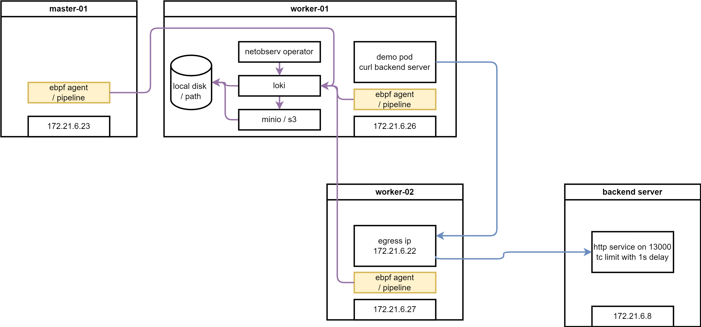

# try with loki

## install loki

RTT value need loki as backend, we install loki first.

- [Installing the Loki Operator](https://docs.redhat.com/en/documentation/openshift_container_platform/4.20/html/network_observability/installing-network-observability-operators#network-observability-loki-installation_network_observability)

### create S3 bucket

We need a S3 bucket for loki storage, we use rustfs as S3 storage.

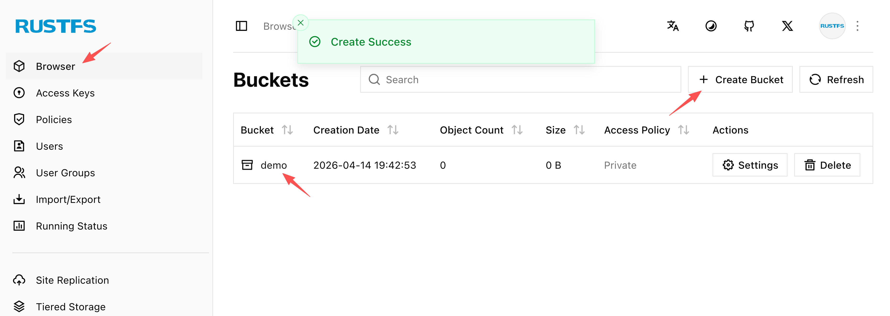

### install loki operator

we have a s3 storage, and we will install loki operator.

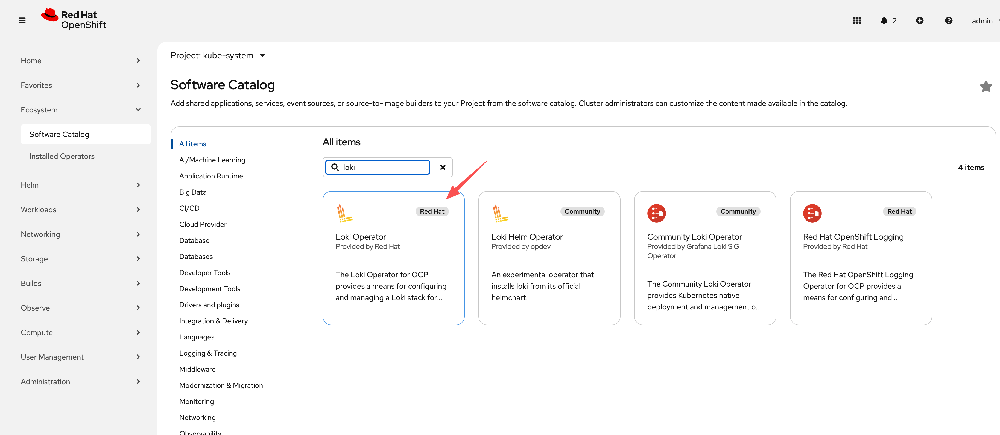

```bash

oc new-project netobserv

# netobserv is a resource-hungry application, it has high requirements for the underlying loki, we configure the maximum gear, and the number of replicas, etc., to adapt to our test environment.

cat << EOF > ${BASE_DIR}/data/install/loki-netobserv.yaml
---
apiVersion: v1
kind: Secret
metadata:
  name: loki-s3 
stringData:
  access_key_id: rustfsadmin
  access_key_secret: rustfsadmin
  bucketnames: demo
  endpoint: http://192.168.99.1:9000
  # region: eu-central-1

---
apiVersion: loki.grafana.com/v1
kind: LokiStack
metadata:
  name: loki
spec:
  size: 1x.demo # 1x.medium , 1x.demo
  replication:
    factor: 1
  storage:
    schemas:
    - version: v13
      effectiveDate: '2022-06-01'
    secret:
      name: loki-s3
      type: s3
  storageClassName: nfs-csi
  tenants:
    mode: openshift-network
    openshift:
        adminGroups: 
        - cluster-admin
  template:
    gateway:
      replicas: 1
    ingester:
      replicas: 1
    indexGateway:
      replicas: 1

EOF

oc create --save-config -n netobserv -f ${BASE_DIR}/data/install/loki-netobserv.yaml

# to delete

# oc delete -n netobserv -f ${BASE_DIR}/data/install/loki-netobserv.yaml

# oc get pvc -n netobserv | grep loki- | awk '{print $1}' | xargs oc delete -n netobserv pvc

# run below, if reinstall
oc adm groups new cluster-admin

oc adm groups add-users cluster-admin admin

oc adm policy add-cluster-role-to-group cluster-admin cluster-admin

```

## install net observ

we will install net observ operator, the installation is simple, just follow the official document. If you use eBPF agent, there seems have bugs with the installation steps, it is better to restart nodes to make the ebpf agent function well.

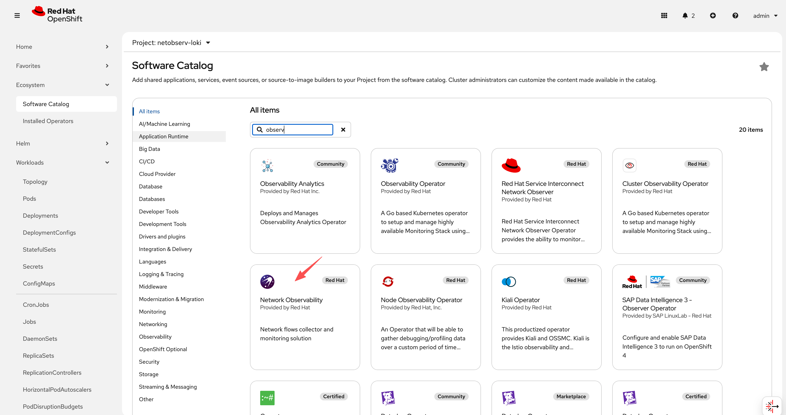

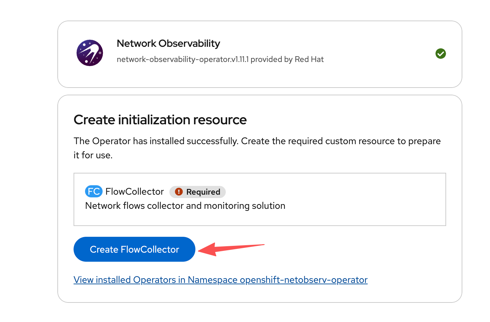

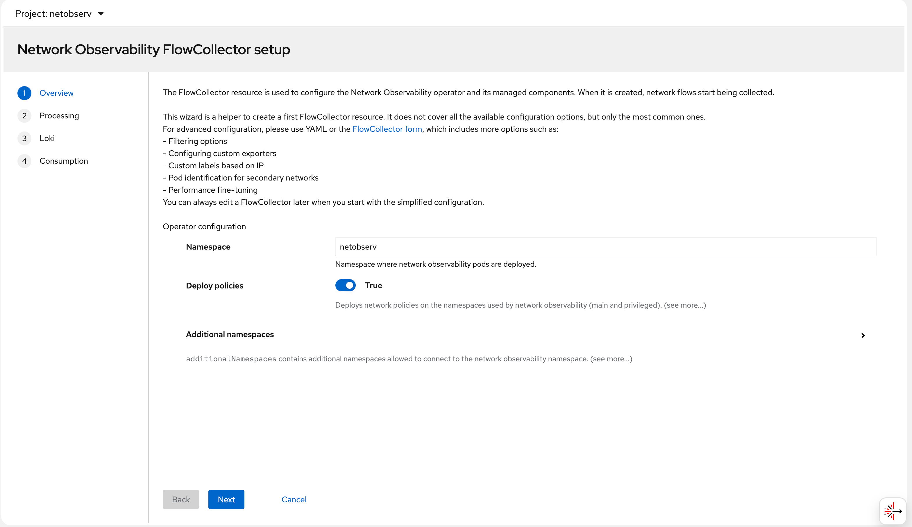

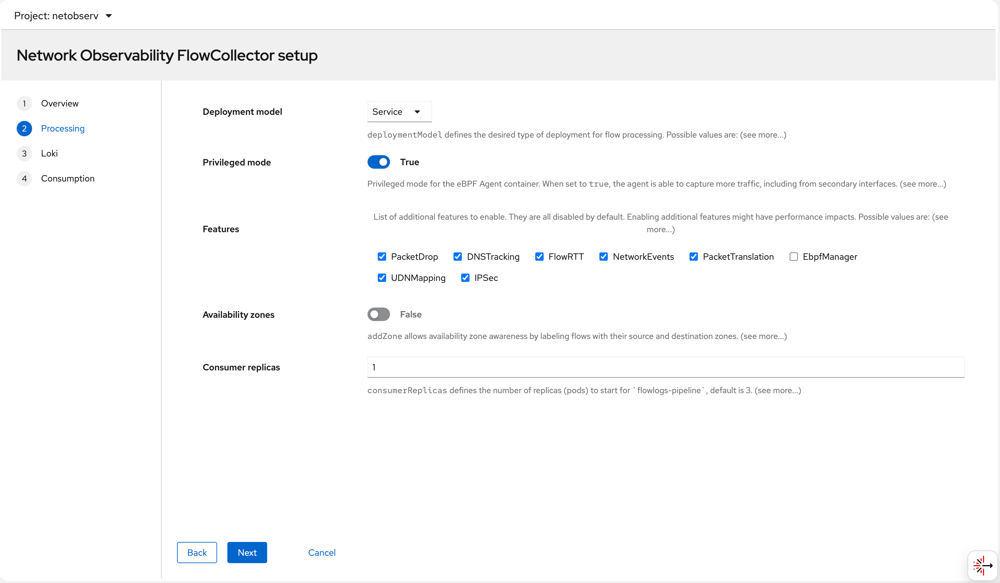

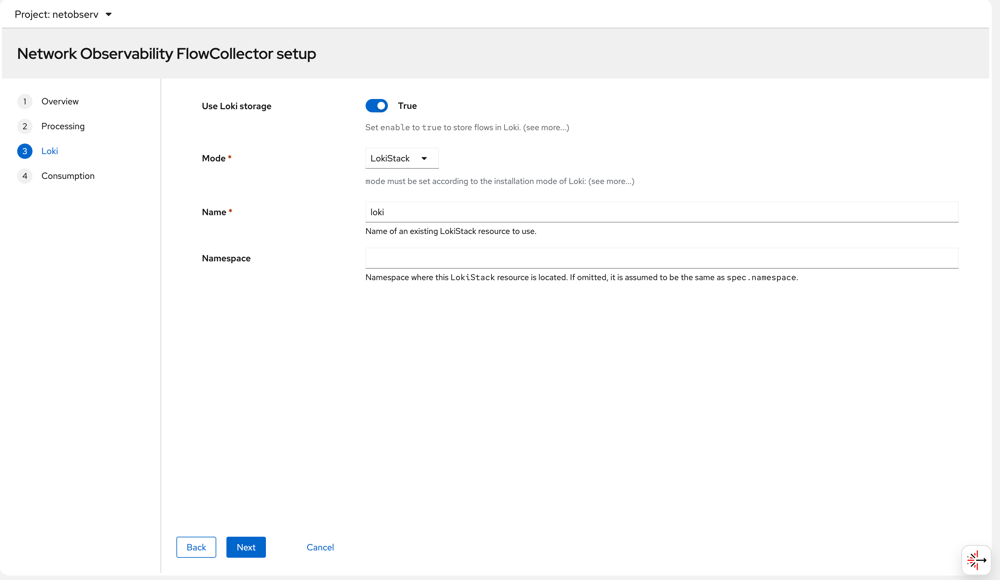

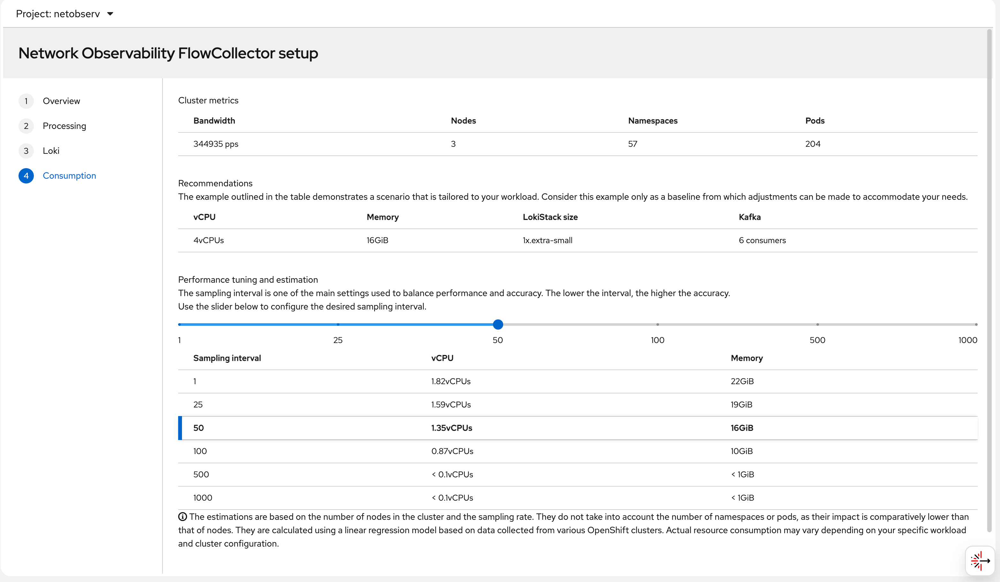

## try it out

### deploy egress IP

next, we will deploy egress IP on worker-02, and make traffic from worker-01 to worker-02, and then backend-service, and see the RTT value.

```bash

# label a node to host egress ip
oc label node --all k8s.ovn.org/egress-assignable="" --overwrite

# label a namespace with env
oc new-project llm-demo
oc label ns llm-demo env=egress-demo


# create a egress ip
cat << EOF > ${BASE_DIR}/data/install/egressip.yaml
apiVersion: k8s.ovn.org/v1
kind: EgressIP
metadata:
  name: egressips-prod
spec:
  egressIPs:
  - 192.168.99.103
  namespaceSelector:
    matchLabels:
      env: egress-demo
EOF

oc apply -f ${BASE_DIR}/data/install/egressip.yaml

# oc delete -f ${BASE_DIR}/data/install/egressip.yaml

oc get egressip -o json | jq -r '.items[] | [.status.items[].egressIP, .status.items[].node] | @tsv'
# 192.168.99.103  master-01-demo

```

### make traffic and see result

we create testing pod, and curl from the pod to backend service

```bash

# go back to helper
# create a dummy pod
cat << EOF > ${BASE_DIR}/data/install/demo1.yaml
---
kind: Pod
apiVersion: v1
metadata:
  name: wzh-demo-pod
spec:
  nodeSelector:
    kubernetes.io/hostname: 'master-02-demo'
  restartPolicy: Always
  containers:
    - name: demo1
      image: >- 
        quay.io/wangzheng422/qimgs:centos9-test-2025.12.18.v01
      env:
        - name: key
          value: value
      command: [ "/bin/bash", "-c", "--" ]
      args: [ "tail -f /dev/null" ]
      # imagePullPolicy: Always
EOF

oc apply -n llm-demo -f ${BASE_DIR}/data/install/demo1.yaml

# oc delete -n llm-demo -f ${BASE_DIR}/data/install/demo1.yaml

oc exec -n llm-demo wzh-demo-pod -it -- bash
# in the container terminal
while true; do curl https://www.google.com && sleep 1; done;

# while true; do curl http://192.168.77.8:13000/cache.db > /dev/null; done;

```

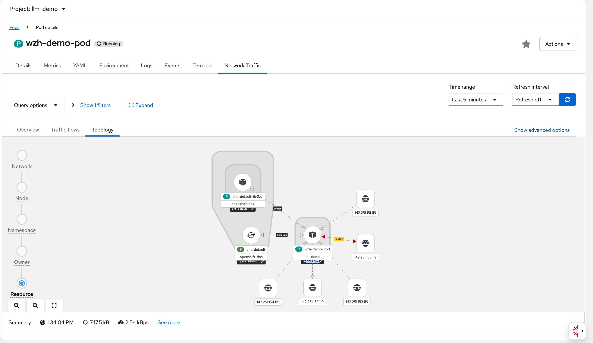

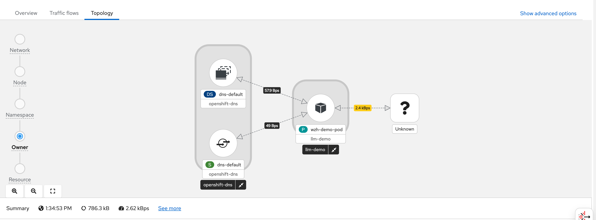

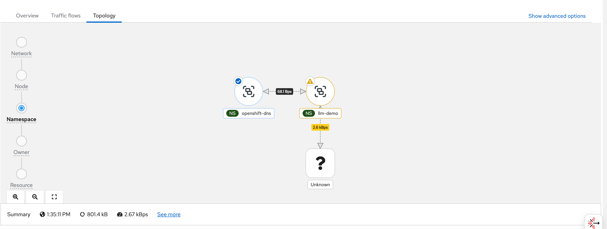

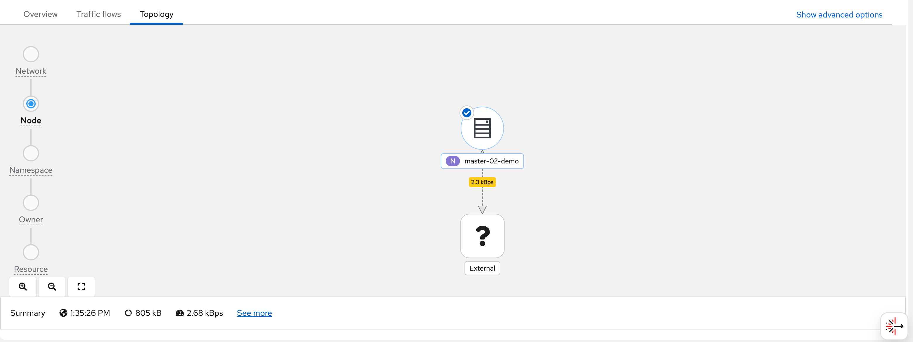

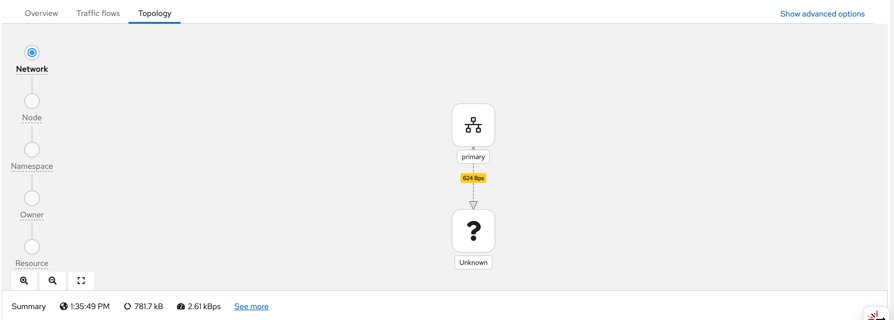

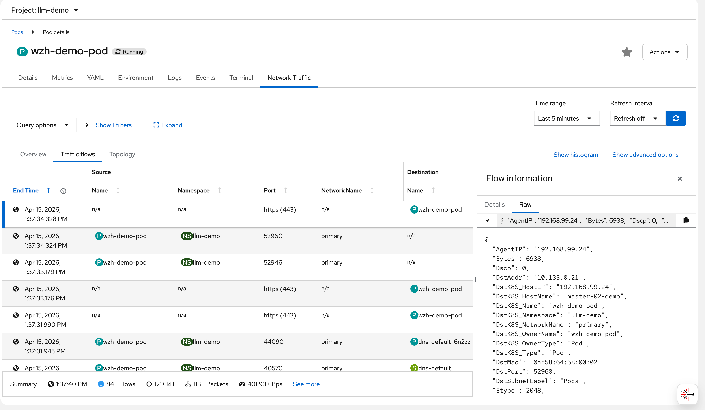

```json
{
  "AgentIP": "192.168.99.24",
  "Bytes": 6938,
  "Dscp": 0,
  "DstAddr": "10.133.0.21",
  "DstK8S_HostIP": "192.168.99.24",
  "DstK8S_HostName": "master-02-demo",
  "DstK8S_Name": "wzh-demo-pod",
  "DstK8S_Namespace": "llm-demo",
  "DstK8S_NetworkName": "primary",
  "DstK8S_OwnerName": "wzh-demo-pod",
  "DstK8S_OwnerType": "Pod",
  "DstK8S_Type": "Pod",
  "DstMac": "0a:58:64:58:00:02",
  "DstPort": 52960,
  "DstSubnetLabel": "Pods",
  "Etype": 2048,
  "Flags": [
    "ACK"
  ],
  "FlowDirection": "0",
  "IfDirections": [
    0,
    0
  ],
  "Interfaces": [
    "genev_sys_6081",
    "eth0"
  ],
  "K8S_FlowLayer": "app",
  "Packets": 3,
  "Proto": 6,
  "Sampling": 50,
  "SrcAddr": "142.251.152.119",
  "SrcMac": "0a:58:64:58:00:04",
  "SrcPort": 443,
  "TimeFlowEndMs": 1776231454328,
  "TimeFlowRttNs": 8421000,
  "TimeFlowStartMs": 1776231454316,
  "TimeReceived": 1776231455,
  "Udns": [
    ""
  ],
  "app": "netobserv-flowcollector"
}
```

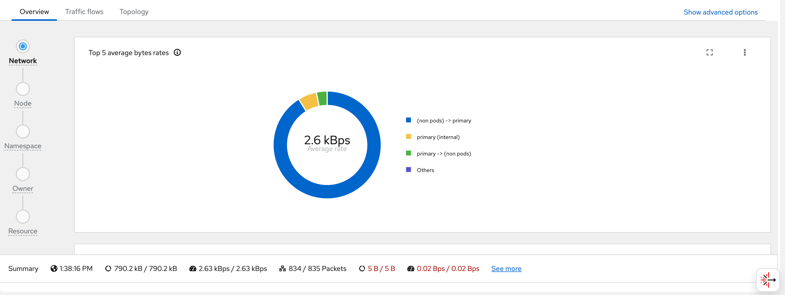

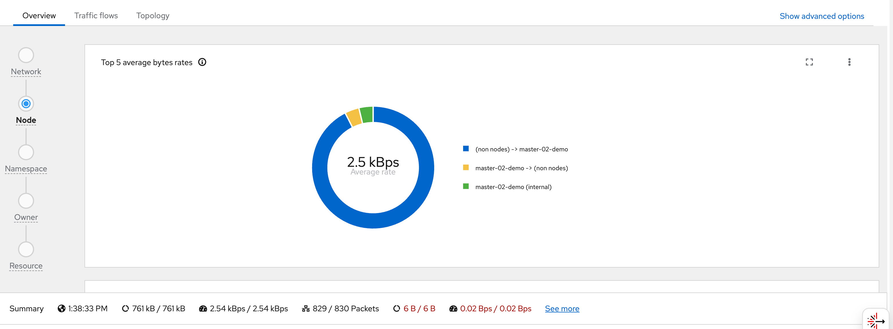

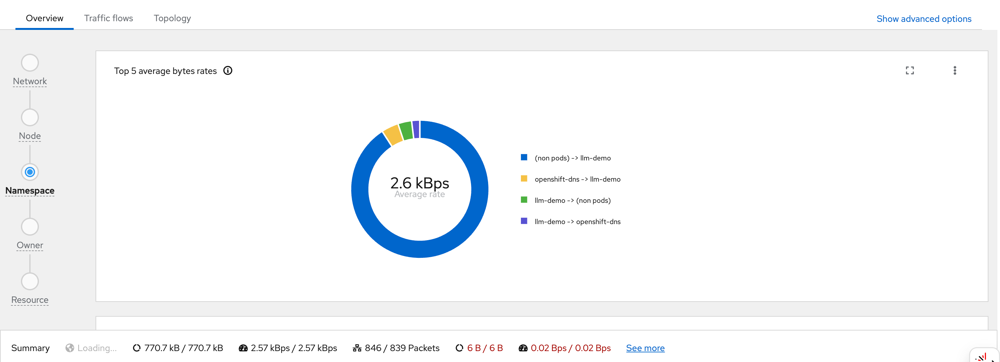

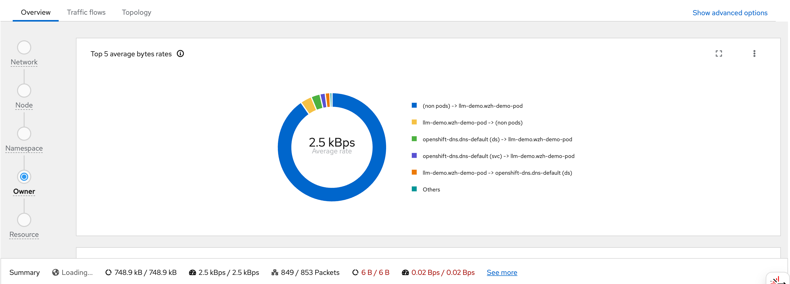

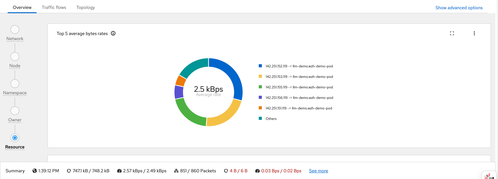


# tips

1. sometimes, the netobserv-epf- OOM, and console do not work. restart node to fix.

## ovn short word

- https://github.com/openshift/ovn-kubernetes/blob/master/go-controller/pkg/types/const.go

```go
  JoinSwitchPrefix             = "join_"
  ExternalSwitchPrefix         = "ext_"
  GWRouterPrefix               = "GR_"
  GWRouterLocalLBPostfix       = "_local"
  RouterToSwitchPrefix         = "rtos-"
  InterPrefix                  = "inter-"
  HybridSubnetPrefix           = "hybrid-subnet-"
  SwitchToRouterPrefix         = "stor-"
  JoinSwitchToGWRouterPrefix   = "jtor-"
  GWRouterToJoinSwitchPrefix   = "rtoj-"
  DistRouterToJoinSwitchPrefix = "dtoj-"
  JoinSwitchToDistRouterPrefix = "jtod-"
  EXTSwitchToGWRouterPrefix    = "etor-"
  GWRouterToExtSwitchPrefix    = "rtoe-"
  EgressGWSwitchPrefix         = "exgw-"

  TransitSwitchToRouterPrefix = "tstor-"
  RouterToTransitSwitchPrefix = "rtots-"
```

## search container on interface name

```bash

ip a | grep ace0354dc9ca1cb -A 5
# 67: ace0354dc9ca1cb@if2: <BROADCAST,MULTICAST,UP,LOWER_UP> mtu 1400 qdisc noqueue master ovs-system state UP group default qlen 1000
#     link/ether 3e:3a:b4:70:28:c0 brd ff:ff:ff:ff:ff:ff link-netns 301bf28d-f04c-46a6-b34c-800b34ce4c76
#     inet6 fe80::3c3a:b4ff:fe70:28c0/64 scope link
#        valid_lft forever preferred_lft forever

# The namespace ID we're looking for
namespace_id="562f3b52-881a-4057-b8fd-f17ceaf9096b"

# Get all pod IDs
pod_ids=$(crictl pods -q)

# Loop through each pod ID
for pod_id in $pod_ids; do
    # Inspect the pod and get the network namespace
    network_ns=$(crictl inspectp $pod_id | jq -r '.info.runtimeSpec.linux.namespaces[] | select(.type=="network") | .path')

    # Check if the network namespace contains the namespace ID
    if [[ $network_ns == *"$namespace_id"* ]]; then
        echo "Pod $pod_id is in the namespace $namespace_id"
        crictl pods --id $pod_id
    fi
done


```

## oc debug node

```bash

# node debug with bpftop
oc debug node/worker-01-demo --image=quay.io/wangzheng422/qimgs:rocky9-test-2024.04.28

```


# end