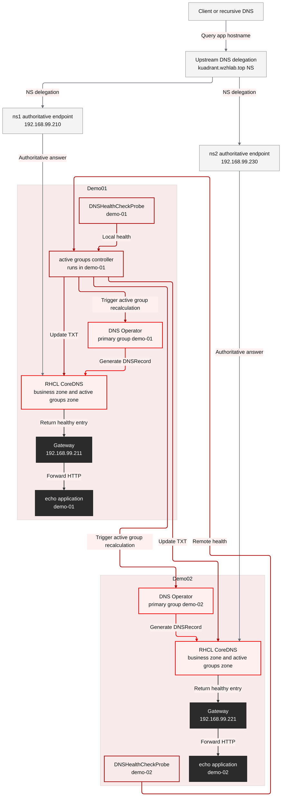
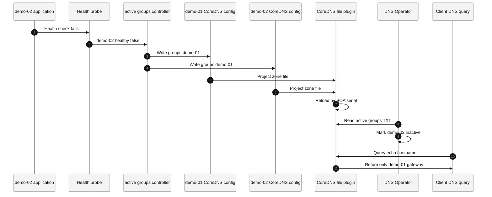
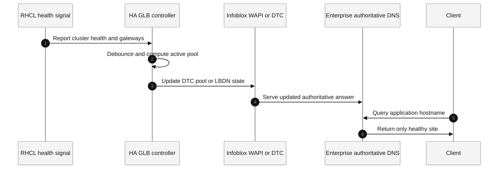

# Connectivity Link Multi-Cluster DNS GLB PoC Complete Solution

| Field | Value |
|---|---|
| Document version | solution-2026.05.25.14.09-en |
| Round | round 17 |
| Execution date | 2026-05-25 |
| Environment | AWS EC2 helper + demo-01 OCP + demo-02 OCP + Aliyun DNS simulating Infoblox delegation |
| Conclusion | Under the constraint that the upstream DNS delegates a subdomain to OCP clusters, the recommended phase-1 design is not to put ACM in the DNS data path. Instead, use the CoreDNS instances in the two managed OCP clusters as NS targets, and run an active-groups controller in demo-01 to maintain RHCL DNS Groups automatically. |

## 1. Conclusion

This round redeployed and validated the Connectivity Link delegated CoreDNS design from scratch on two newly installed OCP clusters.

The final design is:

- The upstream DNS, simulated by Aliyun in this PoC and equivalent to Infoblox in the target scenario, delegates `kuadrant.wzhlab.top` to CoreDNS running in the two OCP clusters.
- `ns1.kuadrant.wzhlab.top` points to the demo-01 CoreDNS LoadBalancer IP `192.168.99.210`.
- `ns2.kuadrant.wzhlab.top` points to the demo-02 CoreDNS LoadBalancer IP `192.168.99.230`.
- Both RHCL DNS Operators are configured as `primary`.
- demo-01 uses `GROUP=demo-01`; demo-02 uses `GROUP=demo-02`.
- Both clusters use delegated `DNSPolicy` and the CoreDNS provider.
- demo-01 runs a PoC active-groups controller. The controller reads `DNSHealthCheckProbe.status.healthy` from both clusters and updates the active-groups TXT zone in both CoreDNS instances.
- When the demo-02 application fails, both delegated CoreDNS authorities eventually return only the demo-01 gateway IP.
- When demo-02 recovers, both CoreDNS authorities return to the dual-cluster active state.

This round does not recommend pointing the delegated NS records to ACM Hub. ACM Hub is a control plane, not an authoritative DNS data-plane endpoint. Under the current constraint, where Infoblox only delegates a subdomain and the controller is not allowed to change upstream DNS, NS records should point to the managed-cluster CoreDNS instances that actually answer application DNS records.

## 2. Upstream Design Understanding

The relevant upstream Kuadrant and RHCL DNS behavior is:

- DNSPolicy delegation means that delegated DNSPolicy reconciliation is handled by a primary cluster. The primary cluster creates the authoritative DNSRecord.
- When there are multiple primary clusters, every primary cluster needs connection secrets for the other primary clusters, and they must generate equivalent or aggregatable authoritative DNSRecords.
- DNS Groups express the active set through a TXT record such as `"version=1;groups=demo-01&&demo-02"`.
- DNS Operator does not watch the active-groups TXT record continuously. It reads that TXT record during reconciliation. Therefore failover is not instantaneous and is bounded by the controller polling interval, `MAX_REQUEUE_TIME`, CoreDNS file reload, and DNS TTL/cache behavior.

References:

- [Kuadrant Cluster Aware DNSRecord Delegation](https://docs.kuadrant.io/dev/kuadrant-operator/doc/user-guides/dns/understanding_dns_delegation/)
- [Kuadrant DNS Fail-over via Groups](https://docs.kuadrant.io/dev/dns-operator/docs/exercising_dns_failover_via_groups/)
- [Kuadrant CoreDNS Support](https://docs.kuadrant.io/dev/kuadrant-operator/doc/user-guides/dns/core-dns/)

## 3. Final Architecture



## 4. Key Configuration Relationships

| Configuration | demo-01 | demo-02 | Purpose |
|---|---|---|---|
| CoreDNS LB IP | `192.168.99.210` | `192.168.99.230` | Authoritative DNS IP used by upstream NS glue |
| Gateway LB IP | `192.168.99.211` | `192.168.99.221` | Application ingress IP |
| DNS Operator role | `primary` | `primary` | Both NS targets can independently answer the delegated zone |
| DNS group | `demo-01` | `demo-02` | Input for DNS Groups active or inactive decisions |
| Provider secret | `ZONES` + `NAMESERVERS` | `ZONES` + `NAMESERVERS` | CoreDNS provider configuration |
| Active-groups TXT | `demo-01&&demo-02` normally, `demo-01` during demo-02 failure | Same | Controls whether a group appears in DNS answers |
| OCP DNS forward | active-groups zone -> local CoreDNS ClusterIP | Same | Allows DNS Operator to resolve the active-groups TXT record |
| Controller | Runs in demo-01 | Not running | Reads health state and updates both CoreDNS instances |

## 5. Evidence From This Round

Initial environment:

```text
demo-01 nodes:
192.168.99.23, 192.168.99.24, 192.168.99.25 Ready

demo-02 nodes:
192.168.99.33, 192.168.99.34, 192.168.99.35 Ready

RHCL CSVs:
authorino-operator.v1.3.0 Succeeded
dns-operator.v1.3.0 Succeeded
rhcl-operator.v1.3.3 Succeeded
```

DNS delegation:

```text
ns1.kuadrant.wzhlab.top A 192.168.99.210
ns2.kuadrant.wzhlab.top A 192.168.99.230
kuadrant.wzhlab.top NS ns1.kuadrant.wzhlab.top
kuadrant.wzhlab.top NS ns2.kuadrant.wzhlab.top
```

Normal controller log:

```text
health local_group=demo-01 local_healthy=True remote_group=demo-02 remote_healthy=True active_groups=demo-01&&demo-02
cluster=local patch_rc=0 output=configmap/kuadrant-coredns patched
cluster=remote patch_rc=0 output=configmap/kuadrant-coredns patched
```

Normal state:

```text
@192.168.99.210 TXT "version=1;groups=demo-01&&demo-02"
@192.168.99.230 TXT "version=1;groups=demo-01&&demo-02"
```

After demo-02 failure:

```text
DNSHealthCheckProbe healthy=false
controller active_groups=demo-01
@192.168.99.210 echo.kuadrant.wzhlab.top -> 192.168.99.211
@192.168.99.230 echo.kuadrant.wzhlab.top -> 192.168.99.211
```

After demo-02 recovery:

```text
DNSHealthCheckProbe healthy=true
controller active_groups=demo-01&&demo-02
demo-02 DNSRecord activeGroups=demo-01,demo-02 Ready=True Healthy=True Active=True
```

## 6. Complete Configuration, Commands, and Outputs

This section embeds the configurations, commands, and key outputs needed for a single-document review. Tokens, pull secrets, kubeconfig contents, and private keys are redacted.

### 6.1 Environment Validation

```bash
aliyun alidns DescribeDomainRecords --DomainName wzhlab.top --SearchMode EXACT --KeyWord aws-helper
```

```text
RR: aws-helper
Type: A
Value: 54.188.166.181
TTL: 600
Status: ENABLE
```

```bash
ssh root@54.188.166.181 'hostname; date; uname -a; id sno; id sno2; command -v oc || true'
```

```text
ip-172-31-44-120.us-west-2.compute.internal
Mon May 25 06:10:13 AM UTC 2026
Linux ip-172-31-44-120.us-west-2.compute.internal 5.14.0-700.el9.x86_64
uid=1001(sno) gid=1001(sno) groups=1001(sno)
uid=1002(sno2) gid=1002(sno2) groups=1002(sno2)
oc not found in root environment
```

```bash
ssh root@54.188.166.181 "su - sno -c 'oc version --client; oc whoami; oc get nodes -o wide'"
ssh root@54.188.166.181 "su - sno2 -c 'oc version --client; oc whoami; oc get nodes -o wide'"
```

```text
demo-01:
Client Version: 4.20.21
system:admin
master-01-demo Ready 192.168.99.23
master-02-demo Ready 192.168.99.24
master-03-demo Ready 192.168.99.25

demo-02:
Client Version: 4.20.21
admin
master-01-demo Ready 192.168.99.33
master-02-demo Ready 192.168.99.34
master-03-demo Ready 192.168.99.35
```

```bash
ssh root@54.188.166.181 "su - sno -c 'oc get co; oc get svc -A --field-selector spec.type=LoadBalancer || true'"
ssh root@54.188.166.181 "su - sno2 -c 'oc get co; oc get svc -A --field-selector spec.type=LoadBalancer || true'"
```

```text
demo-01 ClusterOperators: all Available=True, Progressing=False, Degraded=False
demo-02 ClusterOperators: all Available=True, Progressing=False, Degraded=False
No LoadBalancer services found before this deployment.
```

### 6.2 RHCL, GatewayClass, and Kuadrant

Operator installation YAML:

```yaml
apiVersion: v1
kind: Namespace
metadata:
  name: cert-manager-operator
---
apiVersion: operators.coreos.com/v1
kind: OperatorGroup
metadata:
  name: cert-manager-operator
  namespace: cert-manager-operator
spec:
  targetNamespaces:
    - cert-manager-operator
---
apiVersion: operators.coreos.com/v1alpha1
kind: Subscription
metadata:
  name: openshift-cert-manager-operator
  namespace: cert-manager-operator
spec:
  channel: stable-v1.18
  installPlanApproval: Automatic
  name: openshift-cert-manager-operator
  source: redhat-operators
  sourceNamespace: openshift-marketplace
---
apiVersion: v1
kind: Namespace
metadata:
  name: kuadrant-system
---
apiVersion: operators.coreos.com/v1
kind: OperatorGroup
metadata:
  name: kuadrant-system
  namespace: kuadrant-system
spec:
  targetNamespaces:
    - kuadrant-system
---
apiVersion: operators.coreos.com/v1alpha1
kind: Subscription
metadata:
  name: rhcl-operator
  namespace: kuadrant-system
spec:
  channel: stable
  installPlanApproval: Automatic
  name: rhcl-operator
  source: redhat-operators
  sourceNamespace: openshift-marketplace
---
apiVersion: v1
kind: Namespace
metadata:
  name: metallb-system
---
apiVersion: operators.coreos.com/v1
kind: OperatorGroup
metadata:
  name: metallb-system
  namespace: metallb-system
spec:
  targetNamespaces:
    - metallb-system
---
apiVersion: operators.coreos.com/v1alpha1
kind: Subscription
metadata:
  name: metallb-operator
  namespace: metallb-system
spec:
  channel: stable
  installPlanApproval: Automatic
  name: metallb-operator
  source: redhat-operators
  sourceNamespace: openshift-marketplace
```

Core YAML:

```yaml
apiVersion: gateway.networking.k8s.io/v1
kind: GatewayClass
metadata:
  name: openshift-default
spec:
  controllerName: openshift.io/gateway-controller/v1
---
apiVersion: kuadrant.io/v1beta1
kind: Kuadrant
metadata:
  name: kuadrant
  namespace: kuadrant-system
```

Key commands:

```bash
oc apply -f cert-manager-and-rhcl-subscriptions.yaml
oc apply -f gatewayclass-and-kuadrant.yaml
oc wait kuadrant/kuadrant -n kuadrant-system --for=condition=Ready=true --timeout=300s
```

Key output:

```text
authorino-operator.v1.3.0        Succeeded
cert-manager-operator.v1.18.1    Succeeded
dns-operator.v1.3.0              Succeeded
limitador-operator.v1.3.0        Succeeded
rhcl-operator.v1.3.3             Succeeded
Kuadrant Ready=True, message="Kuadrant is ready"
```

### 6.3 MetalLB Configuration

demo-01:

```yaml
apiVersion: metallb.io/v1beta1
kind: IPAddressPool
metadata:
  name: demo-01-pool
  namespace: metallb-system
spec:
  addresses:
    - 192.168.99.210-192.168.99.219
---
apiVersion: metallb.io/v1beta1
kind: L2Advertisement
metadata:
  name: demo-01-l2
  namespace: metallb-system
spec:
  ipAddressPools:
    - demo-01-pool
```

Final demo-02 configuration:

```yaml
apiVersion: metallb.io/v1beta1
kind: IPAddressPool
metadata:
  name: demo-02-pool
  namespace: metallb-system
spec:
  addresses:
    - 192.168.99.220-192.168.99.239
---
apiVersion: metallb.io/v1beta1
kind: L2Advertisement
metadata:
  name: demo-02-l2
  namespace: metallb-system
spec:
  interfaces:
    - br-ex
  ipAddressPools:
    - demo-02-pool
  nodeSelectors:
    - matchLabels:
        kubernetes.io/hostname: master-01-demo
```

Commands and output:

```bash
oc patch ipaddresspool demo-02-pool -n metallb-system --type merge \
  -p '{"spec":{"addresses":["192.168.99.220-192.168.99.239"]}}'
oc patch svc kuadrant-coredns -n kuadrant-coredns \
  -p '{"spec":{"loadBalancerIP":"192.168.99.230"}}'
oc patch l2advertisement demo-02-l2 -n metallb-system --type merge \
  -p '{"spec":{"ipAddressPools":["demo-02-pool"],"interfaces":["br-ex"],"nodeSelectors":[{"matchLabels":{"kubernetes.io/hostname":"master-01-demo"}}]}}'
```

```text
ipaddresspool.metallb.io/demo-02-pool patched
service/kuadrant-coredns patched
l2advertisement.metallb.io/demo-02-l2 patched
ServiceL2Status:
kuadrant-coredns                    master-01-demo
ingress-gateway-openshift-default   master-01-demo
```

Final services:

```bash
oc get svc -A --field-selector spec.type=LoadBalancer -o wide
```

```text
demo-01:
api-gateway        ingress-gateway-openshift-default   192.168.99.211   80/TCP
kuadrant-coredns   kuadrant-coredns                    192.168.99.210   53/UDP,53/TCP

demo-02:
api-gateway        ingress-gateway-openshift-default   192.168.99.221   80/TCP
kuadrant-coredns   kuadrant-coredns                    192.168.99.230   53/UDP,53/TCP
```

### 6.4 CoreDNS Configuration

CoreDNS ConfigMap:

```yaml
apiVersion: v1
kind: ConfigMap
metadata:
  name: kuadrant-coredns
  namespace: kuadrant-coredns
data:
  Corefile: |
    kuadrant-active-groups.echo.kuadrant.wzhlab.top:53 {
        errors
        log
        file /etc/coredns/active-groups.db {
            reload 2s
        }
    }
    kuadrant.wzhlab.top:53 {
        errors
        health {
            lameduck 5s
        }
        ready
        log
        metadata
        kuadrant
    }
  active-groups.db: |
    kuadrant-active-groups.echo.kuadrant.wzhlab.top. 10 IN SOA ns1. hostmaster. <epoch-serial> 7200 3600 1209600 10
    kuadrant-active-groups.echo.kuadrant.wzhlab.top. 10 IN NS ns1.
    kuadrant-active-groups.echo.kuadrant.wzhlab.top. 10 IN TXT "version=1;groups=demo-01&&demo-02"
```

Deployment patch:

```bash
oc patch deploy kuadrant-coredns -n kuadrant-coredns --type=json \
  -p '[{"op":"replace","path":"/spec/template/spec/volumes/0/configMap/items","value":[{"key":"Corefile","path":"Corefile"},{"key":"active-groups.db","path":"active-groups.db"}]}]'
oc rollout restart deploy/kuadrant-coredns -n kuadrant-coredns
oc rollout status deploy/kuadrant-coredns -n kuadrant-coredns --timeout=180s
```

Output:

```text
deployment.apps/kuadrant-coredns patched
deployment.apps/kuadrant-coredns restarted
deployment "kuadrant-coredns" successfully rolled out
CoreDNS log:
plugin/file: Successfully reloaded zone "kuadrant-active-groups.echo.kuadrant.wzhlab.top." in "/etc/coredns/active-groups.db"
```

### 6.5 Aliyun DNS Delegation Simulating Infoblox

Commands:

```bash
aliyun alidns UpdateDomainRecord --RecordId 2057356041083766784 --RR ns1.kuadrant --Type A --Value 192.168.99.210 --TTL 600
aliyun alidns UpdateDomainRecord --RecordId 2057356041062769664 --RR ns2.kuadrant --Type A --Value 192.168.99.230 --TTL 600
```

Output:

```text
RecordId 2057356041083766784 updated
RecordId 2057356041062769664 updated
```

Validation:

```bash
dig @dns21.hichina.com ns1.kuadrant.wzhlab.top A +noall +answer
dig @dns21.hichina.com ns2.kuadrant.wzhlab.top A +noall +answer
dig +trace echo.kuadrant.wzhlab.top A
```

```text
ns1.kuadrant.wzhlab.top. 600 IN A 192.168.99.210
ns2.kuadrant.wzhlab.top. 600 IN A 192.168.99.230
kuadrant.wzhlab.top.     600 IN NS ns2.kuadrant.wzhlab.top.
kuadrant.wzhlab.top.     600 IN NS ns1.kuadrant.wzhlab.top.
```

### 6.6 Gateway, HTTPRoute, Demo Application, and DNSPolicy

demo-01 and demo-02 use the same structure. The only functional content difference is the `echo-content` text.

```yaml
apiVersion: v1
kind: Namespace
metadata:
  name: api-gateway
---
apiVersion: v1
kind: Namespace
metadata:
  name: connectlink-demo
---
apiVersion: v1
kind: Secret
metadata:
  name: coredns-credentials
  namespace: api-gateway
  labels:
    kuadrant.io/default-provider: "true"
type: kuadrant.io/coredns
stringData:
  ZONES: kuadrant.wzhlab.top
  NAMESERVERS: <local-coredns-cluster-ip>
---
apiVersion: gateway.networking.k8s.io/v1
kind: Gateway
metadata:
  name: ingress-gateway
  namespace: api-gateway
spec:
  gatewayClassName: openshift-default
  listeners:
    - name: http
      hostname: echo.kuadrant.wzhlab.top
      port: 80
      protocol: HTTP
      allowedRoutes:
        namespaces:
          from: All
---
apiVersion: v1
kind: ConfigMap
metadata:
  name: echo-content
  namespace: connectlink-demo
data:
  index.html: |
    demo-01 via Connectivity Link
  health: |
    ok
---
apiVersion: apps/v1
kind: Deployment
metadata:
  name: echo
  namespace: connectlink-demo
spec:
  replicas: 1
  selector:
    matchLabels:
      app: echo
  template:
    metadata:
      labels:
        app: echo
    spec:
      containers:
        - name: echo
          image: registry.access.redhat.com/ubi9/python-311:latest
          command:
            - /bin/bash
            - -c
          args:
            - cd /opt/app-root/src && python -m http.server 8080
          ports:
            - containerPort: 8080
          volumeMounts:
            - name: content
              mountPath: /opt/app-root/src
      volumes:
        - name: content
          configMap:
            name: echo-content
---
apiVersion: v1
kind: Service
metadata:
  name: echo
  namespace: connectlink-demo
spec:
  selector:
    app: echo
  ports:
    - name: http
      port: 8080
      targetPort: 8080
---
apiVersion: gateway.networking.k8s.io/v1
kind: HTTPRoute
metadata:
  name: echo
  namespace: connectlink-demo
spec:
  hostnames:
    - echo.kuadrant.wzhlab.top
  parentRefs:
    - name: ingress-gateway
      namespace: api-gateway
  rules:
    - matches:
        - path:
            type: PathPrefix
            value: /
      backendRefs:
        - name: echo
          port: 8080
```

Delegated DNSPolicy:

```yaml
apiVersion: kuadrant.io/v1
kind: DNSPolicy
metadata:
  name: ingress-gateway-dns
  namespace: api-gateway
spec:
  targetRef:
    group: gateway.networking.k8s.io
    kind: Gateway
    name: ingress-gateway
  delegate: true
  loadBalancing:
    defaultGeo: true
    geo: GEO-NA
    weight: 100
  healthCheck:
    protocol: HTTP
    port: 80
    path: /health
    interval: 30s
    failureThreshold: 2
```

Commands and output:

```bash
oc delete dnspolicy ingress-gateway-dns -n api-gateway --ignore-not-found=true
oc apply -f manifests/dnspolicy-delegated.yaml
oc get dnsrecords.kuadrant.io -n api-gateway -o wide
oc get dnshealthcheckprobes.kuadrant.io -n api-gateway -o wide
```

```text
dnspolicy.kuadrant.io/ingress-gateway-dns created
authoritative-record-zzy9f4tx   Ready=True
ingress-gateway-http            Ready=True Healthy=True
ingress-gateway-http-192.168.99.211   healthy=true
ingress-gateway-http-192.168.99.221   healthy=true
```

### 6.7 DNS Operator Environment and OCP DNS Forwarding

DNS Operator environment:

```yaml
apiVersion: v1
kind: ConfigMap
metadata:
  name: dns-operator-controller-env
  namespace: kuadrant-system
data:
  DELEGATION_ROLE: primary
  GROUP: demo-01
  MAX_REQUEUE_TIME: 30s
```

demo-02 difference:

```yaml
data:
  DELEGATION_ROLE: primary
  GROUP: demo-02
  MAX_REQUEUE_TIME: 30s
```

Validation output:

```text
demo-01 printenv:
DELEGATION_ROLE=primary
GROUP=demo-01
MAX_REQUEUE_TIME=30s

demo-02 printenv:
DELEGATION_ROLE=primary
GROUP=demo-02
MAX_REQUEUE_TIME=30s
```

OCP DNS forward:

```yaml
apiVersion: operator.openshift.io/v1
kind: DNS
metadata:
  name: default
spec:
  servers:
    - name: kuadrantactive
      zones:
        - kuadrant-active-groups.echo.kuadrant.wzhlab.top
      forwardPlugin:
        policy: Random
        upstreams:
          - <local-coredns-cluster-ip>
```

Output:

```text
daemonset/dns-default successfully rolled out
DNS Operator logs changed from server misbehaving to active-groups TXT NOERROR lookups.
```

### 6.8 Multi-Cluster Secrets and RBAC

Key commands:

```bash
kubectl-kuadrant_dns add-cluster-secret --context demo-02 --namespace kuadrant-system --name demo-02 --service-account dns-operator-remote-cluster
kubectl-kuadrant_dns add-cluster-secret --context demo-01 --namespace kuadrant-system --name demo-01 --service-account dns-operator-remote-cluster
oc adm policy add-cluster-role-to-user dns-operator-remote-cluster-role -z dns-operator-remote-cluster -n kuadrant-system
```

Output:

```text
demo-01:
secret/demo-02 Opaque label kuadrant.io/multicluster-kubeconfig=true

demo-02:
secret/demo-01 Opaque label kuadrant.io/multicluster-kubeconfig=true

clusterrole.rbac.authorization.k8s.io/dns-operator-remote-cluster-role added: "dns-operator-remote-cluster"
```

Note: one diagnostic command printed base64 values from secret `.data`. That output is not included in this document and is treated as sensitive.

### 6.9 Active-Groups Controller

Namespace and RBAC:

```yaml
apiVersion: v1
kind: Namespace
metadata:
  name: rhcl-active-groups-controller
---
apiVersion: v1
kind: ServiceAccount
metadata:
  name: rhcl-active-groups-controller
  namespace: rhcl-active-groups-controller
---
apiVersion: rbac.authorization.k8s.io/v1
kind: Role
metadata:
  name: rhcl-active-groups-read-health
  namespace: api-gateway
rules:
  - apiGroups:
      - kuadrant.io
    resources:
      - dnsrecords
      - dnshealthcheckprobes
    verbs:
      - get
      - list
      - watch
---
apiVersion: rbac.authorization.k8s.io/v1
kind: Role
metadata:
  name: rhcl-active-groups-write-coredns
  namespace: kuadrant-coredns
rules:
  - apiGroups:
      - ""
    resources:
      - configmaps
    resourceNames:
      - kuadrant-coredns
    verbs:
      - get
      - patch
      - update
```

Deployment:

```yaml
apiVersion: apps/v1
kind: Deployment
metadata:
  name: rhcl-active-groups-controller
  namespace: rhcl-active-groups-controller
spec:
  replicas: 1
  selector:
    matchLabels:
      app: rhcl-active-groups-controller
  template:
    metadata:
      labels:
        app: rhcl-active-groups-controller
    spec:
      serviceAccountName: rhcl-active-groups-controller
      containers:
        - name: controller
          image: quay.io/openshift/origin-cli:4.20
          command:
            - /bin/bash
            - /opt/controller/controller.sh
          env:
            - name: LOCAL_GROUP
              value: demo-01
            - name: REMOTE_GROUP
              value: demo-02
            - name: ACTIVE_GROUPS_TTL
              value: "10"
            - name: RECONCILE_INTERVAL
              value: "10"
            - name: DNS_RECORD_NAMESPACE
              value: api-gateway
            - name: DNS_RECORD_NAME
              value: ingress-gateway-http
          volumeMounts:
            - name: controller-script
              mountPath: /opt/controller
              readOnly: true
            - name: remote-kubeconfig
              mountPath: /etc/remote
              readOnly: true
      volumes:
        - name: controller-script
          configMap:
            name: rhcl-active-groups-controller
            defaultMode: 0555
        - name: remote-kubeconfig
          secret:
            secretName: demo-02-kubeconfig
```

Controller ConfigMap:

```yaml
apiVersion: v1
kind: ConfigMap
metadata:
  name: rhcl-active-groups-controller
  namespace: rhcl-active-groups-controller
data:
  controller.sh: |
    #!/usr/bin/env bash
    set -u

    LOCAL_GROUP="${LOCAL_GROUP:-demo-01}"
    REMOTE_GROUP="${REMOTE_GROUP:-demo-02}"
    TTL="${ACTIVE_GROUPS_TTL:-10}"
    INTERVAL="${RECONCILE_INTERVAL:-10}"
    DNS_RECORD_NAMESPACE="${DNS_RECORD_NAMESPACE:-api-gateway}"
    DNS_RECORD_NAME="${DNS_RECORD_NAME:-ingress-gateway-http}"
    COREDNS_NAMESPACE="${COREDNS_NAMESPACE:-kuadrant-coredns}"
    COREDNS_CONFIGMAP="${COREDNS_CONFIGMAP:-kuadrant-coredns}"
    ACTIVE_GROUPS_FQDN="${ACTIVE_GROUPS_FQDN:-kuadrant-active-groups.echo.kuadrant.wzhlab.top.}"
    REMOTE_KUBECONFIG="${REMOTE_KUBECONFIG:-/etc/remote/demo-02.kubeconfig}"

    LOCAL_API="https://kubernetes.default.svc"
    LOCAL_CA="/var/run/secrets/kubernetes.io/serviceaccount/ca.crt"
    LOCAL_TOKEN_FILE="/var/run/secrets/kubernetes.io/serviceaccount/token"
    JSONPATH_PROBES='{range .items[*]}{.status.healthy}{"\n"}{end}'

    log() {
      printf '%s %s\n' "$(date -u +%Y-%m-%dT%H:%M:%SZ)" "$*"
    }

    run_oc() {
      cluster="$1"
      shift
      if [ "$cluster" = "local" ]; then
        oc --server="$LOCAL_API" --certificate-authority="$LOCAL_CA" --token="$(cat "$LOCAL_TOKEN_FILE")" "$@"
      else
        oc --kubeconfig="$REMOTE_KUBECONFIG" "$@"
      fi
    }

    healthy_status() {
      cluster="$1"
      output="$(run_oc "$cluster" get dnshealthcheckprobes -n "$DNS_RECORD_NAMESPACE" -l "kuadrant.io/health-probes-owner=${DNS_RECORD_NAME}" -o "jsonpath=${JSONPATH_PROBES}" 2>&1)"
      rc="$?"
      if [ "$rc" -ne 0 ]; then
        log "cluster=$cluster dnshealthcheckprobe_read_error rc=$rc output=$output"
        printf 'False'
        return
      fi
      if printf '%s\n' "$output" | grep -qi '^false$'; then
        printf 'False'
      elif printf '%s\n' "$output" | grep -qi '^true$'; then
        printf 'True'
      else
        printf 'False'
      fi
    }

    zonefile() {
      groups="$1"
      serial="$(date -u +%s)"
      printf '%s %s IN SOA ns1. hostmaster. %s 7200 3600 1209600 %s\n' "$ACTIVE_GROUPS_FQDN" "$TTL" "$serial" "$TTL"
      printf '%s %s IN NS ns1.\n' "$ACTIVE_GROUPS_FQDN" "$TTL"
      printf '%s %s IN TXT "version=1;groups=%s"\n' "$ACTIVE_GROUPS_FQDN" "$TTL" "$groups"
    }

    json_escape() {
      sed ':a;N;$!ba;s/\\/\\\\/g;s/"/\\"/g;s/\n/\\n/g'
    }

    patch_zone() {
      cluster="$1"
      groups="$2"
      tmp_zone="/tmp/active-groups-${cluster}.db"
      tmp_patch="/tmp/active-groups-${cluster}.json"
      zonefile "$groups" > "$tmp_zone"
      escaped="$(json_escape < "$tmp_zone")"
      printf '{"data":{"active-groups.db":"%s"}}' "$escaped" > "$tmp_patch"
      output="$(run_oc "$cluster" patch configmap "$COREDNS_CONFIGMAP" -n "$COREDNS_NAMESPACE" --type merge --patch "$(cat "$tmp_patch")" 2>&1)"
      rc="$?"
      log "cluster=$cluster patch_rc=$rc output=$output"
      return "$rc"
    }

    reconcile_once() {
      local_healthy="$(healthy_status local)"
      remote_healthy="$(healthy_status remote)"
      groups=""
      if [ "$local_healthy" = "True" ]; then
        groups="$LOCAL_GROUP"
      fi
      if [ "$remote_healthy" = "True" ]; then
        if [ -n "$groups" ]; then
          groups="${groups}&&${REMOTE_GROUP}"
        else
          groups="$REMOTE_GROUP"
        fi
      fi
      log "health local_group=$LOCAL_GROUP local_healthy=$local_healthy remote_group=$REMOTE_GROUP remote_healthy=$remote_healthy active_groups=${groups:-EMPTY}"
      if [ -z "$groups" ]; then
        log "refuse_empty_active_groups keep_previous_zone=true"
        return 0
      fi
      if [ "${LAST_GROUPS:-}" = "$groups" ]; then
        log "active_groups_unchanged groups=$groups"
        return 0
      fi
      patch_zone local "$groups" || return 1
      patch_zone remote "$groups" || return 1
      LAST_GROUPS="$groups"
      export LAST_GROUPS
    }

    log "starting rhcl active-groups controller local_group=$LOCAL_GROUP remote_group=$REMOTE_GROUP ttl=$TTL interval=$INTERVAL"
    while true; do
      reconcile_once
      sleep "$INTERVAL"
    done
```

Controller behavior summary:

```bash
run_oc local get dnshealthcheckprobes -n api-gateway -l kuadrant.io/health-probes-owner=ingress-gateway-http
run_oc remote get dnshealthcheckprobes -n api-gateway -l kuadrant.io/health-probes-owner=ingress-gateway-http
patch configmap kuadrant-coredns -n kuadrant-coredns --type merge --patch '{"data":{"active-groups.db":"..."}}'
```

Remote kubeconfig creation command with sensitive values redacted:

```bash
oc create token rhcl-active-groups-controller -n rhcl-active-groups-controller --duration=8760h > /tmp/rhcl-demo02-token
KUBECONFIG=/home/sno2/data/install/auth/kubeconfig oc whoami --show-server > /tmp/rhcl-demo02-server
oc create secret generic demo-02-kubeconfig -n rhcl-active-groups-controller --from-file=demo-02.kubeconfig=<redacted> --dry-run=client -o yaml | oc apply -f -
```

Output:

```text
secret/demo-02-kubeconfig configured
deployment.apps/rhcl-active-groups-controller restarted
deployment "rhcl-active-groups-controller" successfully rolled out
```

Normal log:

```text
2026-05-25T07:02:46Z starting rhcl active-groups controller local_group=demo-01 remote_group=demo-02 ttl=10 interval=10
2026-05-25T07:02:47Z health local_group=demo-01 local_healthy=True remote_group=demo-02 remote_healthy=True active_groups=demo-01&&demo-02
2026-05-25T07:02:47Z cluster=local patch_rc=0 output=configmap/kuadrant-coredns patched
2026-05-25T07:02:47Z cluster=remote patch_rc=0 output=configmap/kuadrant-coredns patched
```

PoC note: to work around the lab-specific demo-02 API certificate chain issue, the remote kubeconfig used `insecure-skip-tls-verify: true`. Production must replace this with a correct CA bundle, short-lived token, and least-privilege ServiceAccount.

### 6.10 Baseline, Failure, and Recovery Outputs

Baseline:

```bash
dig +tcp @192.168.99.210 kuadrant-active-groups.echo.kuadrant.wzhlab.top TXT +short
dig +tcp @192.168.99.230 kuadrant-active-groups.echo.kuadrant.wzhlab.top TXT +short
curl -H "Host: echo.kuadrant.wzhlab.top" http://192.168.99.211/
curl -H "Host: echo.kuadrant.wzhlab.top" http://192.168.99.221/
```

```text
"version=1;groups=demo-01&&demo-02"
"version=1;groups=demo-01&&demo-02"
demo-01 via Connectivity Link
demo-02 via Connectivity Link
```

Failure injection:

```bash
oc scale deploy/echo -n connectlink-demo --replicas=0
```

```text
deployment.apps/echo scaled
echo 0/0
```

Failover output:

```text
07:08:36 DNSHealthCheckProbe healthy=false
07:08:15 controller remote_healthy=False active_groups=demo-01
07:08:15 cluster=local patch_rc=0
07:08:15 cluster=remote patch_rc=0
07:09:33 @192.168.99.210 TXT "version=1;groups=demo-01"
07:09:33 @192.168.99.230 TXT "version=1;groups=demo-01"
@192.168.99.210 echo.kuadrant.wzhlab.top -> CNAME chain -> 192.168.99.211
@192.168.99.230 echo.kuadrant.wzhlab.top -> CNAME chain -> 192.168.99.211
demo-02 DNSRecord activeGroups=demo-01 Ready=False Healthy=False Active=False
```

Recovery:

```bash
oc scale deploy/echo -n connectlink-demo --replicas=1
oc rollout status deploy/echo -n connectlink-demo --timeout=180s
```

```text
deployment.apps/echo scaled
deployment "echo" successfully rolled out
```

Recovery output:

```text
07:10:27 DNSHealthCheckProbe healthy=true
07:10:10 controller remote_healthy=True active_groups=demo-01&&demo-02
07:10:11 cluster=local patch_rc=0
07:10:11 cluster=remote patch_rc=0
07:11:30 @192.168.99.210 TXT "version=1;groups=demo-01&&demo-02"
07:11:30 @192.168.99.230 TXT "version=1;groups=demo-01&&demo-02"
demo-02 DNSRecord activeGroups=demo-01,demo-02 Ready=True Healthy=True Active=True
```

## 7. Failover Flow



Key points:

- NS records do not switch.
- The upstream Infoblox or Aliyun delegation does not need to change.
- The switch happens inside the OCP-managed CoreDNS authoritative answer.
- The controller updates the active-groups TXT record, not the application A record directly.
- DNS Operator reads the active-groups TXT record and recalculates DNSRecord Active and Ready status.

## 8. Corrections Compared With the Previous Successful Run

| Issue | Symptom | Fix |
|---|---|---|
| Patching an existing DNSPolicy directly into delegated mode | Webhook rejected the `delegate=true` transition | Delete the old DNSPolicy first, then apply the delegated version |
| CoreDNS Deployment did not mount `active-groups.db` | `no such file or directory` | Add `active-groups.db` to Deployment ConfigMap volume items |
| SOA serial too large | CoreDNS reported no valid SOA record | Use Unix epoch serial |
| demo-02 MetalLB selected the wrong interface automatically | VIP ARP resolved to `8e:3b:*` and timed out | Set `interfaces: ["br-ex"]` in L2Advertisement |
| Initial demo-02 CoreDNS IP conflict | `.220` collided with an old MAC or historical VM | Move demo-02 CoreDNS to `192.168.99.230` |
| Remote kubeconfig CA verification failed | Controller access to demo-02 failed with x509 error | Temporary PoC workaround with `insecure-skip-tls-verify`; production must fix CA |

## 9. ACM Assessment

ACM should not be put into the DNS data path for this phase.

Advantages of not using ACM in phase 1:

- It matches the current constraint: Infoblox only delegates the subdomain, and NS records point to actual OCP CoreDNS authorities.
- The failover path is short: probe -> controller -> CoreDNS active-groups -> DNS answer.
- The system has fewer variables and has been validated in the live environment.

ACM is useful as a phase-2 control-plane enhancement:

- Distribute controller, DNSPolicy, Gateway, RBAC, and CoreDNS configuration consistently.
- Manage multiple clusters through Placement and ManifestWork.
- Provide global health views, audit, alerting, and policy governance from the Hub.

Even if ACM is introduced later, NS records should still point to managed-cluster CoreDNS instances or to a production DNS layer, not to ACM Hub.

## 10. Production Risks

| Risk | Current state | Production recommendation |
|---|---|---|
| Controller is single replica | One replica in demo-01 | Build a Go controller with leader election and HA |
| Remote kubeconfig | PoC token + insecure TLS | Short-lived token, correct CA, least-privilege SA, automatic rotation |
| ConfigMap projection delay | Observed tens of seconds | Use a sidecar-managed shared zone file or write to a production DNS provider |
| CoreDNS VIPs | Lab private IPs | Use reachable LB IPs or enterprise DNS forwarding paths |
| Flapping and false positives | Simple health decision | Add failure thresholds, recovery hysteresis, and minimum healthy cluster policy |
| Audit | Controller stdout | Add Kubernetes Events, metrics, Prometheus, and audit logs |

## 11. Future Flow If the Controller Can Modify Infoblox

If the controller is allowed to modify upstream Infoblox in the future, the preferred approach is not to update ordinary A records directly as the first option. The better production pattern is to integrate with Infoblox DTC or an equivalent GLB object model.

Target flow:



Required changes:

- Add an Infoblox WAPI client to the controller.
- Add an Infoblox credential Secret using a least-privilege account.
- Add ownership markers to avoid modifying manually managed records.
- Add dry-run, diff, rollback, and audit behavior.
- Prefer DTC pool and LBDN updates, enabling or disabling pool members by site, instead of frequently changing ordinary A records.
- Keep RHCL probes, Gateway, and DNSPolicy as the source of application health and entrypoint data.
- Add debounce, rate limiting, minimum healthy endpoints, and optional approval controls for DNS writes.

With this enhancement, DNS failover changes from updating the OCP CoreDNS active-groups TXT record to updating Infoblox DTC or authoritative DNS state. This is closer to a production GSLB model, but it requires the customer to authorize the controller to enter the enterprise DNS change path.

## 12. Final Recommendation

Short-term PoC and customer demonstration:

- Use the validated delegated CoreDNS + dual primary + active-groups controller design.
- Keep Infoblox or Aliyun as the delegating parent DNS only.
- Point NS records to the two managed OCP CoreDNS instances.
- Do not put ACM into the failover chain in this phase.

Production phase 1:

- Productize the PoC shell controller.
- Fix remote kubeconfig CA and token lifecycle.
- Add controller HA, leader election, metrics, events, audit, and GitOps management.

Production phase 2:

- If the customer requires enterprise-grade GSLB and centralized DNS changes, evolve the controller to write Infoblox DTC or WAPI.
- ACM can be used for centralized distribution and governance, but it should not be the NS data-plane endpoint.
