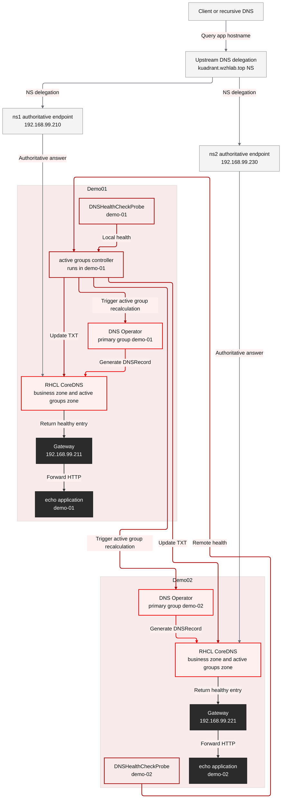
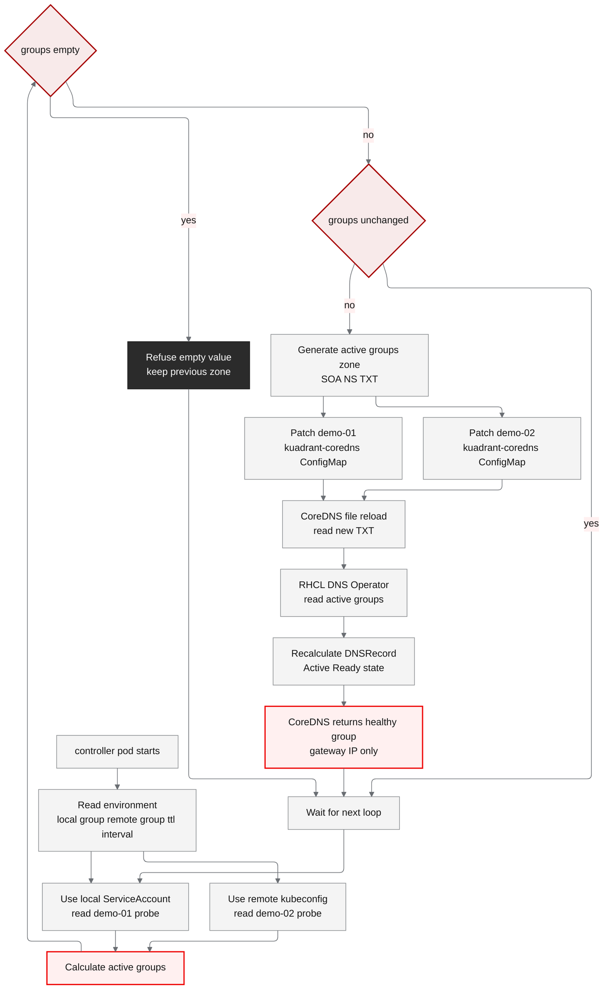
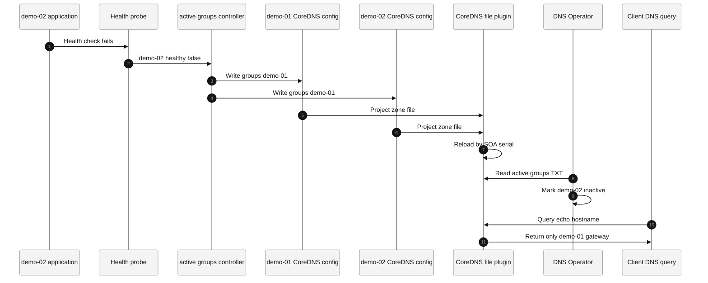
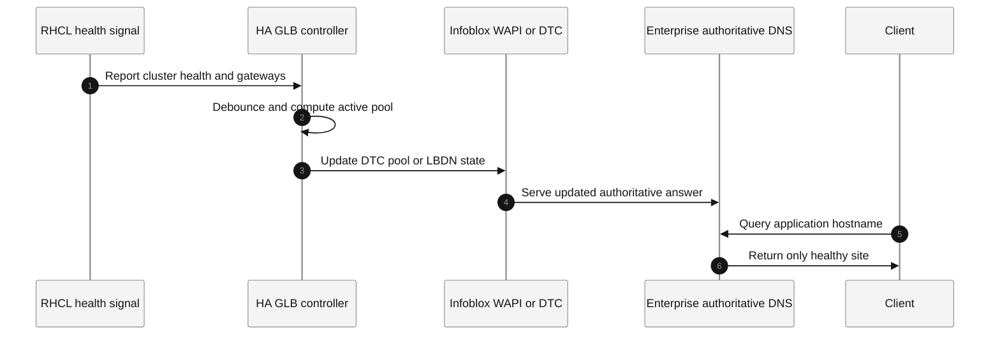

# Connectivity Link Multi-Cluster DNS GLB PoC Complete Solution

| Field | Value |
|---|---|
| Document version | solution-2026.05.25.14.09 |
| Round | round 17 |
| Execution date | 2026-05-25 |
| Environment | AWS EC2 helper + demo-01 OCP + demo-02 OCP + Aliyun DNS simulating Infoblox delegation |
| Conclusion | Under the constraint that the upstream DNS delegates a subdomain to OCP clusters, the recommended phase-1 design is not to put ACM in the DNS data path. Instead, use the CoreDNS instances in the two managed OCP clusters as NS targets, and run an active-groups controller in demo-01 to maintain RHCL DNS Groups automatically. |

## 1. Conclusion

This round redeployed and validated the Connectivity Link delegated CoreDNS design from scratch on two newly installed OCP clusters.

The final design is:

- The upstream DNS, simulated by Aliyun in this PoC and equivalent to Infoblox in the target scenario, delegates `kuadrant.wzhlab.top` to CoreDNS running in the two OCP clusters.
- `ns1.kuadrant.wzhlab.top` points to the demo-01 CoreDNS LoadBalancer IP `192.168.99.210`.
- `ns2.kuadrant.wzhlab.top` points to the demo-02 CoreDNS LoadBalancer IP `192.168.99.230`.
- Both RHCL DNS Operators are configured as `primary`.
- demo-01 uses `GROUP=demo-01`; demo-02 uses `GROUP=demo-02`.
- Both clusters use delegated `DNSPolicy` and the CoreDNS provider.
- demo-01 runs a PoC active-groups controller. The controller reads `DNSHealthCheckProbe.status.healthy` from both clusters and updates the active-groups TXT zone in both CoreDNS instances.
- When the demo-02 application fails, both delegated CoreDNS authorities eventually return only the demo-01 gateway IP.
- When demo-02 recovers, both CoreDNS authorities return to the dual-cluster active state.

This round does not recommend pointing the delegated NS records to ACM Hub. ACM Hub is a control plane, not an authoritative DNS data-plane endpoint. Under the current constraint, where Infoblox only delegates a subdomain and the controller is not allowed to change upstream DNS, NS records should point to the managed-cluster CoreDNS instances that actually answer application DNS records.

## 2. Upstream Design Understanding

The relevant upstream Kuadrant and RHCL DNS behavior is:

- DNSPolicy delegation means that delegated DNSPolicy reconciliation is handled by a primary cluster. The primary cluster creates the authoritative DNSRecord.
- When there are multiple primary clusters, every primary cluster needs connection secrets for the other primary clusters, and they must generate equivalent or aggregatable authoritative DNSRecords.
- DNS Groups express the active set through a TXT record such as `"version=1;groups=demo-01&&demo-02"`.
- DNS Operator does not watch the active-groups TXT record continuously. It reads that TXT record during reconciliation. Therefore failover is not instantaneous and is bounded by the controller polling interval, `MAX_REQUEUE_TIME`, CoreDNS file reload, and DNS TTL/cache behavior.

References:

- [Kuadrant Cluster Aware DNSRecord Delegation](https://docs.kuadrant.io/dev/kuadrant-operator/doc/user-guides/dns/understanding_dns_delegation/)
- [Kuadrant DNS Fail-over via Groups](https://docs.kuadrant.io/dev/dns-operator/docs/exercising_dns_failover_via_groups/)
- [Kuadrant CoreDNS Support](https://docs.kuadrant.io/dev/kuadrant-operator/doc/user-guides/dns/core-dns/)

## 3. Final Architecture



## 4. Key Configuration Relationships

| Configuration | demo-01 | demo-02 | Purpose |
|---|---|---|---|
| CoreDNS LB IP | `192.168.99.210` | `192.168.99.230` | Authoritative DNS IP used by upstream NS glue |
| Gateway LB IP | `192.168.99.211` | `192.168.99.221` | Application ingress IP |
| DNS Operator role | `primary` | `primary` | Both NS targets can independently answer the delegated zone |
| DNS group | `demo-01` | `demo-02` | Input for DNS Groups active or inactive decisions |
| Provider secret | `ZONES` + `NAMESERVERS` | `ZONES` + `NAMESERVERS` | CoreDNS provider configuration |
| Active-groups TXT | `demo-01&&demo-02` normally, `demo-01` during demo-02 failure | Same | Controls whether a group appears in DNS answers |
| OCP DNS forward | active-groups zone -> local CoreDNS ClusterIP | Same | Allows DNS Operator to resolve the active-groups TXT record |
| Controller | Runs in demo-01 | Not running | Reads health state and updates both CoreDNS instances |

## 5. Evidence From This Round

Initial environment:

```text
demo-01 nodes:
192.168.99.23, 192.168.99.24, 192.168.99.25 Ready

demo-02 nodes:
192.168.99.33, 192.168.99.34, 192.168.99.35 Ready

RHCL CSVs:
authorino-operator.v1.3.0 Succeeded
dns-operator.v1.3.0 Succeeded
rhcl-operator.v1.3.3 Succeeded
```

DNS delegation:

```text
ns1.kuadrant.wzhlab.top A 192.168.99.210
ns2.kuadrant.wzhlab.top A 192.168.99.230
kuadrant.wzhlab.top NS ns1.kuadrant.wzhlab.top
kuadrant.wzhlab.top NS ns2.kuadrant.wzhlab.top
```

Normal controller log:

```text
health local_group=demo-01 local_healthy=True remote_group=demo-02 remote_healthy=True active_groups=demo-01&&demo-02
cluster=local patch_rc=0 output=configmap/kuadrant-coredns patched
cluster=remote patch_rc=0 output=configmap/kuadrant-coredns patched
```

Normal state:

```text
@192.168.99.210 TXT "version=1;groups=demo-01&&demo-02"
@192.168.99.230 TXT "version=1;groups=demo-01&&demo-02"
```

After demo-02 failure:

```text
DNSHealthCheckProbe healthy=false
controller active_groups=demo-01
@192.168.99.210 echo.kuadrant.wzhlab.top -> 192.168.99.211
@192.168.99.230 echo.kuadrant.wzhlab.top -> 192.168.99.211
```

After demo-02 recovery:

```text
DNSHealthCheckProbe healthy=true
controller active_groups=demo-01&&demo-02
demo-02 DNSRecord activeGroups=demo-01,demo-02 Ready=True Healthy=True Active=True
```

## 6. Complete Configuration, Commands, and Outputs

This section embeds the configurations, commands, and key outputs needed for a single-document review. Tokens, pull secrets, kubeconfig contents, and private keys are redacted.

### 6.1 Environment Validation

```bash
aliyun alidns DescribeDomainRecords --DomainName wzhlab.top --SearchMode EXACT --KeyWord aws-helper
```

```text
RR: aws-helper
Type: A
Value: 54.188.166.181
TTL: 600
Status: ENABLE
```

```bash
ssh root@54.188.166.181 'hostname; date; uname -a; id sno; id sno2; command -v oc || true'
```

```text
ip-172-31-44-120.us-west-2.compute.internal
Mon May 25 06:10:13 AM UTC 2026
Linux ip-172-31-44-120.us-west-2.compute.internal 5.14.0-700.el9.x86_64
uid=1001(sno) gid=1001(sno) groups=1001(sno)
uid=1002(sno2) gid=1002(sno2) groups=1002(sno2)
oc not found in root environment
```

```bash
ssh root@54.188.166.181 "su - sno -c 'oc version --client; oc whoami; oc get nodes -o wide'"
ssh root@54.188.166.181 "su - sno2 -c 'oc version --client; oc whoami; oc get nodes -o wide'"
```

```text
demo-01:
Client Version: 4.20.21
system:admin
master-01-demo Ready 192.168.99.23
master-02-demo Ready 192.168.99.24
master-03-demo Ready 192.168.99.25

demo-02:
Client Version: 4.20.21
admin
master-01-demo Ready 192.168.99.33
master-02-demo Ready 192.168.99.34
master-03-demo Ready 192.168.99.35
```

```bash
ssh root@54.188.166.181 "su - sno -c 'oc get co; oc get svc -A --field-selector spec.type=LoadBalancer || true'"
ssh root@54.188.166.181 "su - sno2 -c 'oc get co; oc get svc -A --field-selector spec.type=LoadBalancer || true'"
```

```text
demo-01 ClusterOperators: all Available=True, Progressing=False, Degraded=False
demo-02 ClusterOperators: all Available=True, Progressing=False, Degraded=False
No LoadBalancer services found before this deployment.
```

### 6.2 RHCL, GatewayClass, and Kuadrant

Operator installation YAML:

```yaml
apiVersion: v1
kind: Namespace
metadata:
  name: cert-manager-operator
---
apiVersion: operators.coreos.com/v1
kind: OperatorGroup
metadata:
  name: cert-manager-operator
  namespace: cert-manager-operator
spec:
  targetNamespaces:
    - cert-manager-operator
---
apiVersion: operators.coreos.com/v1alpha1
kind: Subscription
metadata:
  name: openshift-cert-manager-operator
  namespace: cert-manager-operator
spec:
  channel: stable-v1.18
  installPlanApproval: Automatic
  name: openshift-cert-manager-operator
  source: redhat-operators
  sourceNamespace: openshift-marketplace
---
apiVersion: v1
kind: Namespace
metadata:
  name: kuadrant-system
---
apiVersion: operators.coreos.com/v1
kind: OperatorGroup
metadata:
  name: kuadrant-system
  namespace: kuadrant-system
spec:
  targetNamespaces:
    - kuadrant-system
---
apiVersion: operators.coreos.com/v1alpha1
kind: Subscription
metadata:
  name: rhcl-operator
  namespace: kuadrant-system
spec:
  channel: stable
  installPlanApproval: Automatic
  name: rhcl-operator
  source: redhat-operators
  sourceNamespace: openshift-marketplace
---
apiVersion: v1
kind: Namespace
metadata:
  name: metallb-system
---
apiVersion: operators.coreos.com/v1
kind: OperatorGroup
metadata:
  name: metallb-system
  namespace: metallb-system
spec:
  targetNamespaces:
    - metallb-system
---
apiVersion: operators.coreos.com/v1alpha1
kind: Subscription
metadata:
  name: metallb-operator
  namespace: metallb-system
spec:
  channel: stable
  installPlanApproval: Automatic
  name: metallb-operator
  source: redhat-operators
  sourceNamespace: openshift-marketplace
```

Core YAML:

```yaml
apiVersion: gateway.networking.k8s.io/v1
kind: GatewayClass
metadata:
  name: openshift-default
spec:
  controllerName: openshift.io/gateway-controller/v1
---
apiVersion: kuadrant.io/v1beta1
kind: Kuadrant
metadata:
  name: kuadrant
  namespace: kuadrant-system
```

Key commands:

```bash
oc apply -f cert-manager-and-rhcl-subscriptions.yaml
oc apply -f gatewayclass-and-kuadrant.yaml
oc wait kuadrant/kuadrant -n kuadrant-system --for=condition=Ready=true --timeout=300s
```

Key output:

```text
authorino-operator.v1.3.0        Succeeded
cert-manager-operator.v1.18.1    Succeeded
dns-operator.v1.3.0              Succeeded
limitador-operator.v1.3.0        Succeeded
rhcl-operator.v1.3.3             Succeeded
Kuadrant Ready=True, message="Kuadrant is ready"
```

### 6.3 MetalLB Configuration

demo-01:

```yaml
apiVersion: metallb.io/v1beta1
kind: IPAddressPool
metadata:
  name: demo-01-pool
  namespace: metallb-system
spec:
  addresses:
    - 192.168.99.210-192.168.99.219
---
apiVersion: metallb.io/v1beta1
kind: L2Advertisement
metadata:
  name: demo-01-l2
  namespace: metallb-system
spec:
  interfaces:
    - br-ex
  ipAddressPools:
    - demo-01-pool
```

demo-02:

```yaml
apiVersion: metallb.io/v1beta1
kind: IPAddressPool
metadata:
  name: demo-02-pool
  namespace: metallb-system
spec:
  addresses:
    - 192.168.99.220-192.168.99.239
---
apiVersion: metallb.io/v1beta1
kind: L2Advertisement
metadata:
  name: demo-02-l2
  namespace: metallb-system
spec:
  interfaces:
    - br-ex
  ipAddressPools:
    - demo-02-pool
  # nodeSelectors:
  #   - matchLabels:
  #       kubernetes.io/hostname: master-01-demo
```

Commands and output:

```bash
oc patch ipaddresspool demo-02-pool -n metallb-system --type merge \
  -p '{"spec":{"addresses":["192.168.99.220-192.168.99.239"]}}'
oc patch svc kuadrant-coredns -n kuadrant-coredns \
  -p '{"spec":{"loadBalancerIP":"192.168.99.230"}}'
oc patch l2advertisement demo-02-l2 -n metallb-system --type merge \
  -p '{"spec":{"ipAddressPools":["demo-02-pool"],"interfaces":["br-ex"],"nodeSelectors":null}}'
```

```text
ipaddresspool.metallb.io/demo-02-pool patched
service/kuadrant-coredns patched
l2advertisement.metallb.io/demo-02-l2 patched
ServiceL2Status:
kuadrant-coredns                    master-01-demo
ingress-gateway-openshift-default   master-01-demo
```

Final services:

```bash
oc get svc -A --field-selector spec.type=LoadBalancer -o wide
```

```text
demo-01:
api-gateway        ingress-gateway-openshift-default   192.168.99.211   80/TCP
kuadrant-coredns   kuadrant-coredns                    192.168.99.210   53/UDP,53/TCP

demo-02:
api-gateway        ingress-gateway-openshift-default   192.168.99.221   80/TCP
kuadrant-coredns   kuadrant-coredns                    192.168.99.230   53/UDP,53/TCP
```

### 6.4 CoreDNS Configuration

CoreDNS ConfigMap:

```yaml
apiVersion: v1
kind: ConfigMap
metadata:
  name: kuadrant-coredns
  namespace: kuadrant-coredns
data:
  Corefile: |
    kuadrant-active-groups.echo.kuadrant.wzhlab.top:53 {
        errors
        log
        file /etc/coredns/active-groups.db {
            reload 2s
        }
    }
    kuadrant.wzhlab.top:53 {
        errors
        health {
            lameduck 5s
        }
        ready
        log
        metadata
        kuadrant
    }
  active-groups.db: |
    kuadrant-active-groups.echo.kuadrant.wzhlab.top. 10 IN SOA ns1. hostmaster. <epoch-serial> 7200 3600 1209600 10
    kuadrant-active-groups.echo.kuadrant.wzhlab.top. 10 IN NS ns1.
    kuadrant-active-groups.echo.kuadrant.wzhlab.top. 10 IN TXT "version=1;groups=demo-01&&demo-02"
```

This CoreDNS configuration contains two zones with different responsibilities:

| Zone | Plugin | Purpose |
|---|---|---|
| `kuadrant-active-groups.echo.kuadrant.wzhlab.top:53` | `file` | Serves the active-groups TXT record used by RHCL DNS Operator to decide which DNS groups are currently active |
| `kuadrant.wzhlab.top:53` | `kuadrant` | Serves the business authoritative DNS zone, including `echo.kuadrant.wzhlab.top` and its CNAME, A, and TXT ownership records |

The first zone is the control signal added by this PoC for DNS Groups failover:

```text
kuadrant-active-groups.echo.kuadrant.wzhlab.top TXT
"version=1;groups=demo-01&&demo-02"
```

DNS Operator reads this TXT record. If the value is `demo-01&&demo-02`, both groups are active. If the value changes to `demo-01`, the demo-02 DNSRecord is treated as inactive, and the final DNS answer no longer returns the demo-02 gateway IP.

The second zone, `kuadrant.wzhlab.top`, is the business zone that receives the upstream NS delegation. After Aliyun or Infoblox delegates `kuadrant.wzhlab.top` to the `kuadrant-coredns` instances in the two OCP clusters, client queries for `echo.kuadrant.wzhlab.top` enter this zone. The `kuadrant` plugin then generates and returns CNAME, A, and TXT records from `DNSRecord` objects.

The Corefile entries mean:

| Entry | Meaning | Role in this design |
|---|---|---|
| `errors` | Logs DNS processing errors | Helps troubleshoot zone file, plugin, or query failures |
| `log` | Logs DNS queries | Confirms that queries enter the expected zone |
| `file /etc/coredns/active-groups.db` | Serves DNS records from a local zone file | Serves the active-groups TXT control signal |
| `reload 2s` | Checks the zone file every 2 seconds and reloads it without restarting CoreDNS | Allows the controller to patch the ConfigMap and have CoreDNS load the new TXT record without a rollout |
| `health { lameduck 5s }` | Exposes CoreDNS health and keeps a 5-second lameduck period on shutdown | Makes CoreDNS rolling updates and exits smoother |
| `ready` | Exposes readiness state | Lets Kubernetes determine whether the CoreDNS pod is ready |
| `metadata` | Provides request metadata to later plugins | Supports the `kuadrant` plugin while processing records |
| `kuadrant` | RHCL CoreDNS provider plugin | Generates authoritative DNS answers for the `kuadrant.wzhlab.top` zone from `DNSRecord` objects |

`active-groups.db` is a standard DNS zone file:

| Record | Purpose |
|---|---|
| `SOA` | Start-of-authority record. The CoreDNS `file` plugin requires a valid SOA for the zone |
| `NS` | Declares the nameserver for the active-groups zone |
| `TXT` | The active group list actually read by RHCL DNS Operator |

The TTL is set to `10` seconds so the active-groups control signal can reflect failover quickly. `<epoch-serial>` must stay within the 32-bit SOA serial range. If the serial is out of range, the CoreDNS `file` plugin may reject the zone as having no valid SOA. This document uses a Unix epoch serial as a safe value.

Deployment patch:

```bash
oc patch deploy kuadrant-coredns -n kuadrant-coredns --type=json \
  -p '[{"op":"replace","path":"/spec/template/spec/volumes/0/configMap/items","value":[{"key":"Corefile","path":"Corefile"},{"key":"active-groups.db","path":"active-groups.db"}]}]'
oc rollout restart deploy/kuadrant-coredns -n kuadrant-coredns
oc rollout status deploy/kuadrant-coredns -n kuadrant-coredns --timeout=180s
```

Output:

```text
deployment.apps/kuadrant-coredns patched
deployment.apps/kuadrant-coredns restarted
deployment "kuadrant-coredns" successfully rolled out
CoreDNS log:
plugin/file: Successfully reloaded zone "kuadrant-active-groups.echo.kuadrant.wzhlab.top." in "/etc/coredns/active-groups.db"
```

### 6.5 Aliyun DNS Delegation Simulating Infoblox

Commands:

```bash
aliyun alidns UpdateDomainRecord --RecordId 2057356041083766784 --RR ns1.kuadrant --Type A --Value 192.168.99.210 --TTL 600
aliyun alidns UpdateDomainRecord --RecordId 2057356041062769664 --RR ns2.kuadrant --Type A --Value 192.168.99.230 --TTL 600
```

Output:

```text
RecordId 2057356041083766784 updated
RecordId 2057356041062769664 updated
```

Validation:

```bash
dig @dns21.hichina.com ns1.kuadrant.wzhlab.top A +noall +answer
dig @dns21.hichina.com ns2.kuadrant.wzhlab.top A +noall +answer
dig +trace echo.kuadrant.wzhlab.top A
```

```text
ns1.kuadrant.wzhlab.top. 600 IN A 192.168.99.210
ns2.kuadrant.wzhlab.top. 600 IN A 192.168.99.230
kuadrant.wzhlab.top.     600 IN NS ns2.kuadrant.wzhlab.top.
kuadrant.wzhlab.top.     600 IN NS ns1.kuadrant.wzhlab.top.
```


```text
ns1.kuadrant.wzhlab.top. 600    IN      A       192.168.99.210

ns2.kuadrant.wzhlab.top. 600    IN      A       192.168.99.230

; <<>> DiG 9.16.23-RH <<>> +trace echo.kuadrant.wzhlab.top A
;; global options: +cmd
.                       4       IN      NS      j.root-servers.net.
.                       4       IN      NS      k.root-servers.net.
.                       4       IN      NS      l.root-servers.net.
.                       4       IN      NS      m.root-servers.net.
.                       4       IN      NS      a.root-servers.net.
.                       4       IN      NS      b.root-servers.net.
.                       4       IN      NS      c.root-servers.net.
.                       4       IN      NS      d.root-servers.net.
.                       4       IN      NS      e.root-servers.net.
.                       4       IN      NS      f.root-servers.net.
.                       4       IN      NS      g.root-servers.net.
.                       4       IN      NS      h.root-servers.net.
.                       4       IN      NS      i.root-servers.net.
;; Received 239 bytes from 172.31.0.2#53(172.31.0.2) in 1 ms

top.                    172800  IN      NS      a.zdnscloud.cn.
top.                    172800  IN      NS      b.zdnscloud.cn.
top.                    172800  IN      NS      c.zdnscloud.com.
top.                    172800  IN      NS      d.zdnscloud.com.
top.                    172800  IN      NS      e.zdnscloud.cn.
top.                    172800  IN      NS      f.zdnscloud.cn.
top.                    172800  IN      NS      i.zdnscloud.cn.
top.                    172800  IN      NS      j.zdnscloud.com.
top.                    86400   IN      DS      26780 8 2 5D6E7869EE8E3B536A617DE89482DDD1DCB9DB9DBB1AC33D6ED351E2 CA095B1B
top.                    86400   IN      RRSIG   DS 8 1 86400 20260607170000 20260525160000 54393 . g7ZmD4sixrCkwLmZGbMIj8SqxpMrYNCd+cMP1engbiAVMT04698WOreU WWPznnrCTKzh41PtkKzP1o6I/hf64KZ+0pvMFzd9lY58Q1Mnro0hWphd yPQeYIGPM0BV+XvY7VZKHybM/8MaWDSsOk5o6GG7UDoTX4AuUUtwzqLV eIggfIy37dhLQVp3H+yFQLjObccv52pWwbWhPWxFuu5Krhrobb0dSYbC WZSr8w9yaIcn8EM/5Rz4nM0tzgIaSROV2OYFuugjteUWLgzHVtp2RMOk gwlWVNqj/0SWelPQpl+26xURPpWWEro41h+kfO3iMIiKlQXHS312Ivs8 p7r7Ww==
;; Received 721 bytes from 192.5.5.241#53(f.root-servers.net) in 4 ms

wzhlab.top.             3600    IN      NS      dns21.hichina.com.
wzhlab.top.             3600    IN      NS      dns22.hichina.com.
9opav7qq6nidbfpe7gjq6uvlq27tfvu7.top. 3600 IN NSEC3 1 0 0 - 9OPAVPH9T9OIH6ARTF6I7M2QI7PAFBJ7 NS
9opav7qq6nidbfpe7gjq6uvlq27tfvu7.top. 3600 IN RRSIG NSEC3 8 2 3600 20260604001447 20260520224447 60925 top. ng+EJk7r6EEXiYvbK9PfCczXNz+TG8lfTz1L0ImFVdmOcHRLvqqitugf y6Uy7H3/jaB7pyK6YCHDOqQuLm8fwmNC4yFHNL5CkPle5o0QD1X5UhUQ SJEN9RWbBtZth5tcJiTMo0RdsZ/M0M5pi1dH3rc2QoXmdXbV/PvwZ+2i S3c=
;; Received 341 bytes from 203.119.82.1#53(e.zdnscloud.cn) in 27 ms

kuadrant.wzhlab.top.    600     IN      NS      ns1.kuadrant.wzhlab.top.
kuadrant.wzhlab.top.    600     IN      NS      ns2.kuadrant.wzhlab.top.
;; Received 159 bytes from 120.76.107.60#53(dns21.hichina.com) in 183 ms

echo.kuadrant.wzhlab.top. 300   IN      CNAME   klb.echo.kuadrant.wzhlab.top.
klb.echo.kuadrant.wzhlab.top. 300 IN    CNAME   geo-na.klb.echo.kuadrant.wzhlab.top.
geo-na.klb.echo.kuadrant.wzhlab.top. 60 IN CNAME 2ad421-1twd8u.klb.echo.kuadrant.wzhlab.top.
2ad421-1twd8u.klb.echo.kuadrant.wzhlab.top. 60 IN A 192.168.99.211
kuadrant.wzhlab.top.    60      IN      NS      ns1.kuadrant.wzhlab.top.
;; Received 413 bytes from 192.168.99.210#53(ns1.kuadrant.wzhlab.top) in 5 ms
```

### 6.6 Gateway, HTTPRoute, Demo Application, and DNSPolicy

demo-01 and demo-02 use the same structure. The only functional content difference is the `echo-content` text.

This configuration contains two related but distinct paths: the HTTP application traffic path and the DNS publication and health path.

The HTTP traffic path is:

```text
Client
  -> echo.kuadrant.wzhlab.top
  -> ingress-gateway-openshift-default Service
  -> Gateway ingress-gateway
  -> HTTPRoute echo
  -> Service connectlink-demo/echo
  -> Pod echo
```

The DNS publication and health path is:

```text
Gateway ingress-gateway
  -> DNSPolicy ingress-gateway-dns
  -> DNSRecord ingress-gateway-http
  -> DNSHealthCheckProbe ingress-gateway-http-<gateway-ip>
  -> authoritative-record-zzy9f4tx
  -> kuadrant-coredns
  -> echo.kuadrant.wzhlab.top DNS answer
```

The objects relate to each other as follows:

| Object | Key fields | Purpose | Downstream object or effect |
|---|---|---|---|
| `GatewayClass openshift-default` | `controllerName: openshift.io/gateway-controller/v1` | Selects the Gateway API implementation | In this environment, OpenShift Gateway, Service Mesh 3, Istio, and Envoy provide the data plane |
| `Gateway ingress-gateway` | `gatewayClassName: openshift-default`, `listeners[].hostname: echo.kuadrant.wzhlab.top` | Creates the concrete HTTP ingress instance | Creates the gateway Service and becomes the DNSPolicy target |
| `HTTPRoute echo` | `parentRefs: ingress-gateway`, `hostnames: echo.kuadrant.wzhlab.top`, `backendRefs: Service echo` | Routes HTTP requests received by the Gateway to the demo application | Determines which Service receives application traffic |
| `DNSPolicy ingress-gateway-dns` | `targetRef: Gateway ingress-gateway`, `delegate: true`, `healthCheck` | Tells RHCL to manage DNS and health checks for the Gateway listener hostname | Creates `DNSRecord ingress-gateway-http` and `DNSHealthCheckProbe` |
| `DNSRecord ingress-gateway-http` | `rootHost: echo.kuadrant.wzhlab.top`, `spec.endpoints`, `status.activeGroups` | Represents the CNAME and A records, health state, and active group for the application hostname | Aggregated into the authoritative DNSRecord |
| `authoritative-record-zzy9f4tx` | `kuadrant.io/authoritative-record=true` | Final publication object for the delegated CoreDNS provider | Written into the CoreDNS authoritative zone |

Therefore, `HTTPRoute` does not reference `DNSPolicy` directly, and `DNSPolicy` does not point directly to `HTTPRoute`. They both work around the same `Gateway`:

```text
HTTPRoute -- parentRefs --> Gateway <-- targetRef -- DNSPolicy
```

`HTTPRoute` answers the question “where should traffic go after it reaches the Gateway.” `DNSPolicy` answers the question “how should this Gateway hostname be published to DNS, health-checked, and filtered during failure.” `DNSRecord` is generated by DNSPolicy reconciliation; readers do not need to create `DNSRecord` objects manually.

```yaml
apiVersion: v1
kind: Namespace
metadata:
  name: api-gateway
---
apiVersion: v1
kind: Namespace
metadata:
  name: connectlink-demo
---
apiVersion: v1
kind: Secret
metadata:
  name: coredns-credentials
  namespace: api-gateway
  labels:
    kuadrant.io/default-provider: "true"
type: kuadrant.io/coredns
stringData:
  ZONES: kuadrant.wzhlab.top
  NAMESERVERS: 172.22.167.74 #<local-coredns-cluster-ip>
---
apiVersion: gateway.networking.k8s.io/v1
kind: Gateway
metadata:
  name: ingress-gateway
  namespace: api-gateway
spec:
  gatewayClassName: openshift-default
  listeners:
    - name: http
      hostname: echo.kuadrant.wzhlab.top
      port: 80
      protocol: HTTP
      allowedRoutes:
        namespaces:
          from: All
---
apiVersion: v1
kind: ConfigMap
metadata:
  name: echo-content
  namespace: connectlink-demo
data:
  index.html: |
    demo-01 via Connectivity Link
  health: |
    ok
---
apiVersion: apps/v1
kind: Deployment
metadata:
  name: echo
  namespace: connectlink-demo
spec:
  replicas: 1
  selector:
    matchLabels:
      app: echo
  template:
    metadata:
      labels:
        app: echo
    spec:
      containers:
        - name: echo
          image: registry.access.redhat.com/ubi9/python-311:latest
          command:
            - /bin/bash
            - -c
          args:
            - cd /opt/app-root/src && python -m http.server 8080
          ports:
            - containerPort: 8080
          volumeMounts:
            - name: content
              mountPath: /opt/app-root/src
      volumes:
        - name: content
          configMap:
            name: echo-content
---
apiVersion: v1
kind: Service
metadata:
  name: echo
  namespace: connectlink-demo
spec:
  selector:
    app: echo
  ports:
    - name: http
      port: 8080
      targetPort: 8080
---
apiVersion: gateway.networking.k8s.io/v1
kind: HTTPRoute
metadata:
  name: echo
  namespace: connectlink-demo
spec:
  hostnames:
    - echo.kuadrant.wzhlab.top
  parentRefs:
    - name: ingress-gateway
      namespace: api-gateway
  rules:
    - matches:
        - path:
            type: PathPrefix
            value: /
      backendRefs:
        - name: echo
          port: 8080
```

Delegated DNSPolicy:

```yaml
apiVersion: kuadrant.io/v1
kind: DNSPolicy
metadata:
  name: ingress-gateway-dns
  namespace: api-gateway
spec:
  targetRef:
    group: gateway.networking.k8s.io
    kind: Gateway
    name: ingress-gateway
  delegate: true
  loadBalancing:
    defaultGeo: true
    geo: GEO-NA
    weight: 100
  healthCheck:
    protocol: HTTP
    port: 80
    path: /health
    interval: 30s
    failureThreshold: 2
```

Commands and output:

```bash
oc delete dnspolicy ingress-gateway-dns -n api-gateway --ignore-not-found=true
oc apply -f manifests/dnspolicy-delegated.yaml
oc get dnsrecords.kuadrant.io -n api-gateway -o wide
oc get dnshealthcheckprobes.kuadrant.io -n api-gateway -o wide
```

```text
dnspolicy.kuadrant.io/ingress-gateway-dns created
authoritative-record-zzy9f4tx   Ready=True
ingress-gateway-http            Ready=True Healthy=True
ingress-gateway-http-192.168.99.211   healthy=true
ingress-gateway-http-192.168.99.221   healthy=true
```

#### 6.6.1 Why the Console Shows Two DNSRecords

In the OpenShift Console, under the `api-gateway` namespace, two `DNSRecord` objects are visible:

```text
authoritative-record-zzy9f4tx
ingress-gateway-http
```

These are not duplicate configurations. They are the two layers used by RHCL delegated DNS.

`ingress-gateway-http` is the business DNSRecord. It is created by `DNSPolicy ingress-gateway-dns`, and its ownerReference points to that DNSPolicy:

```yaml
apiVersion: kuadrant.io/v1alpha1
kind: DNSRecord
metadata:
  name: ingress-gateway-http
  namespace: api-gateway
  ownerReferences:
    - apiVersion: kuadrant.io/v1
      kind: DNSPolicy
      name: ingress-gateway-dns
spec:
  delegate: true
  endpoints:
    - dnsName: 2ad421-1twd8u.klb.echo.kuadrant.wzhlab.top
      recordTTL: 60
      recordType: A
      targets:
        - 192.168.99.211
    - dnsName: echo.kuadrant.wzhlab.top
      recordTTL: 300
      recordType: CNAME
      targets:
        - klb.echo.kuadrant.wzhlab.top
    - dnsName: geo-na.klb.echo.kuadrant.wzhlab.top
      providerSpecific:
        - name: weight
          value: "100"
      recordTTL: 60
      recordType: CNAME
      setIdentifier: 2ad421-1twd8u.klb.echo.kuadrant.wzhlab.top
      targets:
        - 2ad421-1twd8u.klb.echo.kuadrant.wzhlab.top
    - dnsName: klb.echo.kuadrant.wzhlab.top
      providerSpecific:
        - name: geo-code
          value: GEO-NA
      recordTTL: 300
      recordType: CNAME
      setIdentifier: GEO-NA
      targets:
        - geo-na.klb.echo.kuadrant.wzhlab.top
    - dnsName: klb.echo.kuadrant.wzhlab.top
      providerSpecific:
        - name: geo-code
          value: '*'
      recordTTL: 300
      recordType: CNAME
      setIdentifier: default
      targets:
        - geo-na.klb.echo.kuadrant.wzhlab.top
  rootHost: echo.kuadrant.wzhlab.top
  healthCheck:
    failureThreshold: 2
    interval: 30s
    path: /health
    port: 80
    protocol: HTTP
status:
  activeGroups: demo-01,demo-02
  domainOwners:
    - 12urzgc7
    - 2omrld2x
  group: demo-01
  ownerID: 2omrld2x
```

It represents the health state, active group, endpoints, and cross-cluster domain owners for the application hostname `echo.kuadrant.wzhlab.top`. For day-to-day troubleshooting of application DNS health, start with `Ready`, `Healthy`, `Active`, `activeGroups`, and `DNSHealthCheckProbe` on this object.

`authoritative-record-zzy9f4tx` is the authoritative publication DNSRecord. It is generated by the delegated CoreDNS provider to aggregate business DNSRecords, cluster groups, CNAME chains, A records, and TXT ownership records into the final record set written to the CoreDNS provider:

```yaml
apiVersion: kuadrant.io/v1alpha1
kind: DNSRecord
metadata:
  name: authoritative-record-zzy9f4tx
  namespace: api-gateway
  labels:
    kuadrant.io/authoritative-record: "true"
    kuadrant.io/authoritative-record-hash: zzy9f4tx
    kuadrant.io/coredns-zone-name: kuadrant.wzhlab.top
    kuadrant.io/dns-provider-name: coredns
spec:
  endpoints:
    - dnsName: 2ad421-1twd8u.klb.echo.kuadrant.wzhlab.top
      labels:
        group: demo-01
        owner: 2omrld2x
        targets: 192.168.99.211
      recordType: A
      targets:
        - 192.168.99.211
    - dnsName: echo.kuadrant.wzhlab.top
      labels:
        group: demo-02
        owner: 12urzgc7&&2omrld2x
        targets: klb.echo.kuadrant.wzhlab.top
      recordType: CNAME
      targets:
        - klb.echo.kuadrant.wzhlab.top
    - dnsName: 378rg4-1twd8u.klb.echo.kuadrant.wzhlab.top
      labels:
        group: demo-02
        owner: 12urzgc7
        targets: 192.168.99.221
      recordType: A
      targets:
        - 192.168.99.221
```

Therefore, it is normal for the Console to show `Healthy` as `-` for `authoritative-record-zzy9f4tx`. It is not the business health object; it is the publication object. Business health is represented by `ingress-gateway-http` and `DNSHealthCheckProbe`.

Live verification output for demo-01 using the `sno` user:

```bash
ssh root@44.244.114.159 \
  "su - sno -c 'bash -lc \"oc get dnsrecords.kuadrant.io -n api-gateway -o wide\"'"
```

```text
NAME                            READY   HEALTHY   ROOT HOST                  OWNER ID   ZONE DOMAIN                ZONE ID
authoritative-record-zzy9f4tx   True              echo.kuadrant.wzhlab.top   223wl79x   kuadrant.wzhlab.top        kuadrant.wzhlab.top
ingress-gateway-http            True    True      echo.kuadrant.wzhlab.top   2omrld2x   echo.kuadrant.wzhlab.top   authoritative-record-zzy9f4tx
```

Live verification output for demo-02 using the `sno2` user:

```bash
ssh root@44.244.114.159 \
  "su - sno2 -c 'bash -lc \"oc get dnsrecords.kuadrant.io -n api-gateway -o wide\"'"
```

```text
NAME                            READY   HEALTHY   ROOT HOST                  OWNER ID   ZONE DOMAIN                ZONE ID
authoritative-record-zzy9f4tx   True              echo.kuadrant.wzhlab.top   20j8wj37   kuadrant.wzhlab.top        kuadrant.wzhlab.top
ingress-gateway-http            True    True      echo.kuadrant.wzhlab.top   12urzgc7   echo.kuadrant.wzhlab.top   authoritative-record-zzy9f4tx
```

From a DNS answer perspective, the configuration looks complex because RHCL does not simply create one `echo.kuadrant.wzhlab.top A 192.168.99.x` record. It creates a chain that can express multi-cluster behavior, Geo or weighted routing, DNS Groups, and ownership:

```text
echo.kuadrant.wzhlab.top
  -> klb.echo.kuadrant.wzhlab.top
  -> geo-na.klb.echo.kuadrant.wzhlab.top
  -> <hash>.klb.echo.kuadrant.wzhlab.top
  -> 192.168.99.211 or 192.168.99.221
```

It also creates multiple TXT ownership records, for example:

```text
kuadrant-<hash>-cname-echo.kuadrant.wzhlab.top
heritage=external-dns,external-dns/group=demo-01,external-dns/owner=2omrld2x,external-dns/version=1
```

```bash
dig @192.168.99.230 TXT kuadrant-228crxc1-cname-echo.kuadrant.wzhlab.top
```

```txt
; <<>> DiG 9.16.23-RH <<>> @192.168.99.230 TXT kuadrant-228crxc1-cname-echo.kuadrant.wzhlab.top
; (1 server found)
;; global options: +cmd
;; Got answer:
;; ->>HEADER<<- opcode: QUERY, status: NOERROR, id: 14516
;; flags: qr aa rd; QUERY: 1, ANSWER: 1, AUTHORITY: 1, ADDITIONAL: 1
;; WARNING: recursion requested but not available

;; OPT PSEUDOSECTION:
; EDNS: version: 0, flags:; udp: 4096
; COOKIE: 80acabd52c11246e (echoed)
;; QUESTION SECTION:
;kuadrant-228crxc1-cname-echo.kuadrant.wzhlab.top. IN TXT

;; ANSWER SECTION:
kuadrant-228crxc1-cname-echo.kuadrant.wzhlab.top. 0 IN TXT "\"heritage=external-dns,external-dns/group=demo-02,external-dns/owner=12urzgc7,external-dns/targets=klb.echo.kuadrant.wzhlab.top,external-dns/version=1\""

;; AUTHORITY SECTION:
kuadrant.wzhlab.top.    60      IN      NS      ns1.kuadrant.wzhlab.top.

;; Query time: 11 msec
;; SERVER: 192.168.99.230#53(192.168.99.230)
;; WHEN: Thu May 28 15:08:34 UTC 2026
;; MSG SIZE  rcvd: 357
```

##### Purpose of TXT Ownership Records

These TXT records are not for application clients. They are ownership markers used by the provider to prevent different controllers or clusters from overwriting each other.

##### What DNSHealthCheckProbe Checks

`DNSHealthCheckProbe` is created automatically by RHCL from `DNSPolicy.healthCheck` and the `DNSRecord` endpoint. Users do not create it manually. It checks HTTP application health behind the Gateway endpoint; it does not check CoreDNS, parent NS delegation, or recursive DNS resolution.

Its configuration comes from `DNSPolicy`:

```yaml
healthCheck:
  protocol: HTTP
  port: 80
  path: /health
  interval: 30s
  failureThreshold: 2
```

Live probe from demo-01:

```yaml
apiVersion: kuadrant.io/v1alpha1
kind: DNSHealthCheckProbe
metadata:
  name: ingress-gateway-http-192.168.99.211
  namespace: api-gateway
  labels:
    kuadrant.io/health-probes-owner: ingress-gateway-http
  ownerReferences:
    - apiVersion: kuadrant.io/v1alpha1
      kind: DNSRecord
      name: ingress-gateway-http
spec:
  address: 192.168.99.211
  allowInsecureCertificate: true
  failureThreshold: 2
  hostname: echo.kuadrant.wzhlab.top
  interval: 30s
  path: /health
  port: 80
  protocol: HTTP
status:
  healthy: true
  status: 200
```

Live probe from demo-02:

```yaml
apiVersion: kuadrant.io/v1alpha1
kind: DNSHealthCheckProbe
metadata:
  name: ingress-gateway-http-192.168.99.221
  namespace: api-gateway
  labels:
    kuadrant.io/health-probes-owner: ingress-gateway-http
  ownerReferences:
    - apiVersion: kuadrant.io/v1alpha1
      kind: DNSRecord
      name: ingress-gateway-http
spec:
  address: 192.168.99.221
  allowInsecureCertificate: true
  failureThreshold: 2
  hostname: echo.kuadrant.wzhlab.top
  interval: 30s
  path: /health
  port: 80
  protocol: HTTP
status:
  healthy: true
  status: 200
```

Behaviorally, this is equivalent to HTTP checks against each Gateway IP with the application Host header:

```text
GET http://192.168.99.211:80/health
Host: echo.kuadrant.wzhlab.top

GET http://192.168.99.221:80/health
Host: echo.kuadrant.wzhlab.top
```

It covers Gateway IP reachability, the Gateway listener, HTTPRoute, and the backend application `/health` endpoint. It does not cover whether CoreDNS answers correctly, whether upstream Aliyun or Infoblox NS delegation is correct, or whether recursive DNS can resolve the hostname. DNS service health must be verified separately with `dig @<coredns-ip>`, `DNSRecord` status, and `kuadrant-coredns` logs.

##### How to Choose the Right Troubleshooting Object

| Object | Role | Key fields | Troubleshooting use |
|---|---|---|---|
| `ingress-gateway-http` | Business DNSRecord | `Healthy`, `Active`, `activeGroups`, `status.endpoints`, `remoteRecordStatuses` | Check whether the business hostname is healthy and whether the current group is active |
| `authoritative-record-zzy9f4tx` | Authoritative publication DNSRecord | `kuadrant.io/authoritative-record=true`, `spec.endpoints`, `zoneDomain`, `zoneID` | Check the full CNAME, A, and TXT record set that will be published to CoreDNS |
| `DNSHealthCheckProbe` | Low-level health probe | `status.healthy` | Input used by the controller to decide active-groups switching |

In summary, seeing two `DNSRecord` objects is expected in the delegated CoreDNS design. Business health and active group decisions are read from `ingress-gateway-http` and `DNSHealthCheckProbe`; the final aggregated authoritative DNS output is read from `authoritative-record-zzy9f4tx`.

### 6.7 DNS Operator Environment and OCP DNS Forwarding

DNS Operator environment:

```yaml
apiVersion: v1
kind: ConfigMap
metadata:
  name: dns-operator-controller-env
  namespace: kuadrant-system
data:
  DELEGATION_ROLE: primary
  GROUP: demo-01
  MAX_REQUEUE_TIME: 30s
```

demo-02 difference:

```yaml
data:
  DELEGATION_ROLE: primary
  GROUP: demo-02
  MAX_REQUEUE_TIME: 30s
```

Validation output:

```text
demo-01 printenv:
DELEGATION_ROLE=primary
GROUP=demo-01
MAX_REQUEUE_TIME=30s

demo-02 printenv:
DELEGATION_ROLE=primary
GROUP=demo-02
MAX_REQUEUE_TIME=30s
```

OCP DNS forward:

```yaml
apiVersion: operator.openshift.io/v1
kind: DNS
metadata:
  name: default
spec:
  servers:
    - name: kuadrantactive
      zones:
        - kuadrant-active-groups.echo.kuadrant.wzhlab.top
      forwardPlugin:
        policy: Random
        upstreams:
          - <local-coredns-cluster-ip>
```

This configuration adds a conditional forward rule to the OpenShift cluster DNS:

```text
kuadrant-active-groups.echo.kuadrant.wzhlab.top
  -> local kuadrant-coredns ClusterIP
```

It is not a public DNS record for `echo.kuadrant.wzhlab.top`, and it is not an Aliyun or Infoblox upstream DNS configuration. It only affects the internal OCP DNS resolution path for the `kuadrant-active-groups.echo.kuadrant.wzhlab.top` zone.

Why modify `DNS/default`? RHCL DNS Operator runs inside cluster pods. To decide which DNS Groups are active, it must query the active-groups TXT record:

```text
kuadrant-active-groups.echo.kuadrant.wzhlab.top TXT
"version=1;groups=demo-01&&demo-02"
```

By default, the DNS Operator pod uses OCP cluster DNS and does not automatically query the `kuadrant-coredns` LoadBalancer IP directly. Without this conditional forward rule, active-groups TXT lookups may go to the default recursive path. In this PoC, that caused `server misbehaving` behavior and prevented DNS Groups from working reliably.

After this configuration is applied, the path becomes:

```text
DNS Operator pod
  -> OCP cluster DNS
  -> DNS/default conditional forward
  -> local kuadrant-coredns ClusterIP
  -> active-groups TXT
  -> DNS Operator computes active group
  -> DNSRecord status and final DNS answer
```

Therefore, “modifying OCP global DNS” should be understood precisely as adding a narrow conditional forward in the cluster-level DNS Operator. It only applies to the active-groups zone. It does not change the public resolution path for `echo.kuadrant.wzhlab.top`, and it does not change the parent delegation to `ns1/ns2.kuadrant.wzhlab.top`.

In production, this cluster-level DNS change should be approved by the platform team. If the customer does not want to modify OCP `DNS/default`, alternatives are to make the controller or operator explicitly query a chosen nameserver, or to place the active-groups TXT record in enterprise DNS or Infoblox so that the standard enterprise DNS path can resolve it.

Output:

```text
daemonset/dns-default successfully rolled out
DNS Operator logs changed from server misbehaving to active-groups TXT NOERROR lookups.
```

### 6.8 Multi-Cluster Secrets and RBAC

Key commands:

```bash
kubectl-kuadrant_dns add-cluster-secret --context demo-02 --namespace kuadrant-system --name demo-02 --service-account dns-operator-remote-cluster
kubectl-kuadrant_dns add-cluster-secret --context demo-01 --namespace kuadrant-system --name demo-01 --service-account dns-operator-remote-cluster
oc adm policy add-cluster-role-to-user dns-operator-remote-cluster-role -z dns-operator-remote-cluster -n kuadrant-system
```

These commands establish the cross-cluster access relationship used by RHCL DNS Operator. They do not ask the user to type a password. Instead, the `kubectl-kuadrant_dns` plugin creates Kubernetes Secrets that contain kubeconfigs for accessing the other cluster.

This cross-cluster access is used by RHCL/Kuadrant DNS Operator’s own multi-cluster DNS delegation mechanism, not by the PoC `active-groups controller` below. DNS Operator uses these remote cluster Secrets to read delegated `DNSRecord` status, endpoints, group, ownerID, and remoteRecordStatuses from the peer cluster. It then aggregates DNS endpoints from the two primary clusters into a consistent authoritative DNSRecord. Without these Secrets, each cluster can only see its own DNSRecord and cannot perform dual-primary cross-cluster aggregation.

The `active-groups controller` below uses a different Secret: `demo-02-kubeconfig` in the `rhcl-active-groups-controller` namespace. That Secret is only used by the PoC controller running in demo-01 to read `DNSHealthCheckProbe.status.healthy` from demo-02 and update the active-groups TXT record in both CoreDNS instances. The two Secret types have different purposes:

| Secret or command | User | Purpose |
|---|---|---|
| `kuadrant-system/demo-01` and `kuadrant-system/demo-02`, created by `kubectl-kuadrant_dns add-cluster-secret ...` | RHCL DNS Operator | Connectivity Link internal multi-cluster DNS delegation and DNSRecord aggregation |
| `rhcl-active-groups-controller/demo-02-kubeconfig` | Custom PoC active-groups controller | Reads remote `DNSHealthCheckProbe.status.healthy` and decides the active-groups TXT value |

Important detail: `--context demo-02` means “the remote cluster being added is demo-02.” The cluster where the Secret is created depends on the current kubectl or oc context. Operationally, it should be read as:

```bash
# When the current context is demo-01, add demo-02 access kubeconfig to demo-01
kubectl-kuadrant_dns add-cluster-secret \
  --context demo-02 \
  --namespace kuadrant-system \
  --name demo-02 \
  --service-account dns-operator-remote-cluster

# When the current context is demo-02, add demo-01 access kubeconfig to demo-02
kubectl-kuadrant_dns add-cluster-secret \
  --context demo-01 \
  --namespace kuadrant-system \
  --name demo-01 \
  --service-account dns-operator-remote-cluster
```

The resulting objects are:

| Current cluster | Created Secret | Secret namespace | Secret content | Purpose |
|---|---|---|---|---|
| demo-01 | `demo-02` | `kuadrant-system` | kubeconfig for accessing demo-02 | Lets demo-01 DNS Operator read demo-02 DNSRecord state |
| demo-02 | `demo-01` | `kuadrant-system` | kubeconfig for accessing demo-01 | Lets demo-02 DNS Operator read demo-01 DNSRecord state |

The kubeconfig contains the remote API server address, CA data, and the bearer token for the `dns-operator-remote-cluster` ServiceAccount. It is a sensitive credential and is stored in a Kubernetes Secret. Do not include the base64 content from `.data` in solution documents or logs.

The `oc adm policy add-cluster-role-to-user ...` command does not create a password. It binds `dns-operator-remote-cluster-role` to the `dns-operator-remote-cluster` ServiceAccount in the `kuadrant-system` namespace. Without that RBAC binding, the peer cluster may have a kubeconfig but not enough permissions to read the DNS resources needed by DNS Operator.

Output:

```text
demo-01:
secret/demo-02 Opaque label kuadrant.io/multicluster-kubeconfig=true

demo-02:
secret/demo-01 Opaque label kuadrant.io/multicluster-kubeconfig=true

clusterrole.rbac.authorization.k8s.io/dns-operator-remote-cluster-role added: "dns-operator-remote-cluster"
```

Note: one diagnostic command printed base64 values from secret `.data`. That output is not included in this document and is treated as sensitive.

### 6.9 Active-Groups Controller

Namespace and RBAC:

```yaml
apiVersion: v1
kind: Namespace
metadata:
  name: rhcl-active-groups-controller
---
apiVersion: v1
kind: ServiceAccount
metadata:
  name: rhcl-active-groups-controller
  namespace: rhcl-active-groups-controller
---
apiVersion: rbac.authorization.k8s.io/v1
kind: Role
metadata:
  name: rhcl-active-groups-read-health
  namespace: api-gateway
rules:
  - apiGroups:
      - kuadrant.io
    resources:
      - dnsrecords
      - dnshealthcheckprobes
    verbs:
      - get
      - list
      - watch
---
apiVersion: rbac.authorization.k8s.io/v1
kind: Role
metadata:
  name: rhcl-active-groups-write-coredns
  namespace: kuadrant-coredns
rules:
  - apiGroups:
      - ""
    resources:
      - configmaps
    resourceNames:
      - kuadrant-coredns
    verbs:
      - get
      - patch
      - update
```

Deployment:

```yaml
apiVersion: apps/v1
kind: Deployment
metadata:
  name: rhcl-active-groups-controller
  namespace: rhcl-active-groups-controller
spec:
  replicas: 1
  selector:
    matchLabels:
      app: rhcl-active-groups-controller
  template:
    metadata:
      labels:
        app: rhcl-active-groups-controller
    spec:
      serviceAccountName: rhcl-active-groups-controller
      containers:
        - name: controller
          image: quay.io/openshift/origin-cli:4.20
          command:
            - /bin/bash
            - /opt/controller/controller.sh
          env:
            - name: LOCAL_GROUP
              value: demo-01
            - name: REMOTE_GROUP
              value: demo-02
            - name: ACTIVE_GROUPS_TTL
              value: "10"
            - name: RECONCILE_INTERVAL
              value: "10"
            - name: DNS_RECORD_NAMESPACE
              value: api-gateway
            - name: DNS_RECORD_NAME
              value: ingress-gateway-http
          volumeMounts:
            - name: controller-script
              mountPath: /opt/controller
              readOnly: true
            - name: remote-kubeconfig
              mountPath: /etc/remote
              readOnly: true
      volumes:
        - name: controller-script
          configMap:
            name: rhcl-active-groups-controller
            defaultMode: 0555
        - name: remote-kubeconfig
          secret:
            secretName: demo-02-kubeconfig
```

The controller script flow is shown below. It does not modify the business `DNSRecord` directly. It reads `DNSHealthCheckProbe.status.healthy` from both clusters, calculates the current active groups, and writes the active-groups TXT zone into the `kuadrant-coredns` ConfigMap in both clusters. RHCL DNS Operator then reads that TXT record and recalculates DNSRecord Active and Ready state.



Controller ConfigMap:

```yaml
apiVersion: v1
kind: ConfigMap
metadata:
  name: rhcl-active-groups-controller
  namespace: rhcl-active-groups-controller
data:
  controller.sh: |
    #!/usr/bin/env bash
    set -u

    LOCAL_GROUP="${LOCAL_GROUP:-demo-01}"
    REMOTE_GROUP="${REMOTE_GROUP:-demo-02}"
    TTL="${ACTIVE_GROUPS_TTL:-10}"
    INTERVAL="${RECONCILE_INTERVAL:-10}"
    DNS_RECORD_NAMESPACE="${DNS_RECORD_NAMESPACE:-api-gateway}"
    DNS_RECORD_NAME="${DNS_RECORD_NAME:-ingress-gateway-http}"
    COREDNS_NAMESPACE="${COREDNS_NAMESPACE:-kuadrant-coredns}"
    COREDNS_CONFIGMAP="${COREDNS_CONFIGMAP:-kuadrant-coredns}"
    ACTIVE_GROUPS_FQDN="${ACTIVE_GROUPS_FQDN:-kuadrant-active-groups.echo.kuadrant.wzhlab.top.}"
    REMOTE_KUBECONFIG="${REMOTE_KUBECONFIG:-/etc/remote/demo-02.kubeconfig}"

    LOCAL_API="https://kubernetes.default.svc"
    LOCAL_CA="/var/run/secrets/kubernetes.io/serviceaccount/ca.crt"
    LOCAL_TOKEN_FILE="/var/run/secrets/kubernetes.io/serviceaccount/token"
    JSONPATH_PROBES='{range .items[*]}{.status.healthy}{"\n"}{end}'

    log() {
      printf '%s %s\n' "$(date -u +%Y-%m-%dT%H:%M:%SZ)" "$*"
    }

    run_oc() {
      cluster="$1"
      shift
      if [ "$cluster" = "local" ]; then
        oc --server="$LOCAL_API" --certificate-authority="$LOCAL_CA" --token="$(cat "$LOCAL_TOKEN_FILE")" "$@"
      else
        oc --kubeconfig="$REMOTE_KUBECONFIG" "$@"
      fi
    }

    healthy_status() {
      cluster="$1"
      output="$(run_oc "$cluster" get dnshealthcheckprobes -n "$DNS_RECORD_NAMESPACE" -l "kuadrant.io/health-probes-owner=${DNS_RECORD_NAME}" -o "jsonpath=${JSONPATH_PROBES}" 2>&1)"
      rc="$?"
      if [ "$rc" -ne 0 ]; then
        log "cluster=$cluster dnshealthcheckprobe_read_error rc=$rc output=$output"
        printf 'False'
        return
      fi
      if printf '%s\n' "$output" | grep -qi '^false$'; then
        printf 'False'
      elif printf '%s\n' "$output" | grep -qi '^true$'; then
        printf 'True'
      else
        printf 'False'
      fi
    }

    zonefile() {
      groups="$1"
      serial="$(date -u +%s)"
      printf '%s %s IN SOA ns1. hostmaster. %s 7200 3600 1209600 %s\n' "$ACTIVE_GROUPS_FQDN" "$TTL" "$serial" "$TTL"
      printf '%s %s IN NS ns1.\n' "$ACTIVE_GROUPS_FQDN" "$TTL"
      printf '%s %s IN TXT "version=1;groups=%s"\n' "$ACTIVE_GROUPS_FQDN" "$TTL" "$groups"
    }

    json_escape() {
      sed ':a;N;$!ba;s/\\/\\\\/g;s/"/\\"/g;s/\n/\\n/g'
    }

    patch_zone() {
      cluster="$1"
      groups="$2"
      tmp_zone="/tmp/active-groups-${cluster}.db"
      tmp_patch="/tmp/active-groups-${cluster}.json"
      zonefile "$groups" > "$tmp_zone"
      escaped="$(json_escape < "$tmp_zone")"
      printf '{"data":{"active-groups.db":"%s"}}' "$escaped" > "$tmp_patch"
      output="$(run_oc "$cluster" patch configmap "$COREDNS_CONFIGMAP" -n "$COREDNS_NAMESPACE" --type merge --patch "$(cat "$tmp_patch")" 2>&1)"
      rc="$?"
      log "cluster=$cluster patch_rc=$rc output=$output"
      return "$rc"
    }

    reconcile_once() {
      local_healthy="$(healthy_status local)"
      remote_healthy="$(healthy_status remote)"
      groups=""
      if [ "$local_healthy" = "True" ]; then
        groups="$LOCAL_GROUP"
      fi
      if [ "$remote_healthy" = "True" ]; then
        if [ -n "$groups" ]; then
          groups="${groups}&&${REMOTE_GROUP}"
        else
          groups="$REMOTE_GROUP"
        fi
      fi
      log "health local_group=$LOCAL_GROUP local_healthy=$local_healthy remote_group=$REMOTE_GROUP remote_healthy=$remote_healthy active_groups=${groups:-EMPTY}"
      if [ -z "$groups" ]; then
        log "refuse_empty_active_groups keep_previous_zone=true"
        return 0
      fi
      if [ "${LAST_GROUPS:-}" = "$groups" ]; then
        log "active_groups_unchanged groups=$groups"
        return 0
      fi
      patch_zone local "$groups" || return 1
      patch_zone remote "$groups" || return 1
      LAST_GROUPS="$groups"
      export LAST_GROUPS
    }

    log "starting rhcl active-groups controller local_group=$LOCAL_GROUP remote_group=$REMOTE_GROUP ttl=$TTL interval=$INTERVAL"
    while true; do
      reconcile_once
      sleep "$INTERVAL"
    done
```

Controller behavior summary:

```bash
run_oc local get dnshealthcheckprobes -n api-gateway -l kuadrant.io/health-probes-owner=ingress-gateway-http
run_oc remote get dnshealthcheckprobes -n api-gateway -l kuadrant.io/health-probes-owner=ingress-gateway-http
patch configmap kuadrant-coredns -n kuadrant-coredns --type merge --patch '{"data":{"active-groups.db":"..."}}'
```

Remote kubeconfig creation command with sensitive values redacted:

```bash
oc create token rhcl-active-groups-controller -n rhcl-active-groups-controller --duration=8760h > /tmp/rhcl-demo02-token
KUBECONFIG=/home/sno2/data/install/auth/kubeconfig oc whoami --show-server > /tmp/rhcl-demo02-server
oc create secret generic demo-02-kubeconfig -n rhcl-active-groups-controller --from-file=demo-02.kubeconfig=<redacted> --dry-run=client -o yaml | oc apply -f -
```

Output:

```text
secret/demo-02-kubeconfig configured
deployment.apps/rhcl-active-groups-controller restarted
deployment "rhcl-active-groups-controller" successfully rolled out
```

Normal log:

```text
2026-05-25T07:02:46Z starting rhcl active-groups controller local_group=demo-01 remote_group=demo-02 ttl=10 interval=10
2026-05-25T07:02:47Z health local_group=demo-01 local_healthy=True remote_group=demo-02 remote_healthy=True active_groups=demo-01&&demo-02
2026-05-25T07:02:47Z cluster=local patch_rc=0 output=configmap/kuadrant-coredns patched
2026-05-25T07:02:47Z cluster=remote patch_rc=0 output=configmap/kuadrant-coredns patched
```

PoC note: in the current test environment, the demo-02 API certificate chain was not included in the controller trust chain. The remote kubeconfig therefore temporarily used `insecure-skip-tls-verify: true`. Production must replace this with a correct CA bundle, short-lived token, and least-privilege ServiceAccount.

### 6.10 Baseline, Failure, and Recovery Outputs

Baseline:

```bash
dig +tcp @192.168.99.210 kuadrant-active-groups.echo.kuadrant.wzhlab.top TXT +short
dig +tcp @192.168.99.230 kuadrant-active-groups.echo.kuadrant.wzhlab.top TXT +short
curl -H "Host: echo.kuadrant.wzhlab.top" http://192.168.99.211/
curl -H "Host: echo.kuadrant.wzhlab.top" http://192.168.99.221/
```

```text
"version=1;groups=demo-01&&demo-02"
"version=1;groups=demo-01&&demo-02"
demo-01 via Connectivity Link
demo-02 via Connectivity Link
```

Failure injection:

```bash
oc scale deploy/echo -n connectlink-demo --replicas=0
```

```text
deployment.apps/echo scaled
echo 0/0
```

Failover output:

```text
07:08:36 DNSHealthCheckProbe healthy=false
07:08:15 controller remote_healthy=False active_groups=demo-01
07:08:15 cluster=local patch_rc=0
07:08:15 cluster=remote patch_rc=0
07:09:33 @192.168.99.210 TXT "version=1;groups=demo-01"
07:09:33 @192.168.99.230 TXT "version=1;groups=demo-01"
@192.168.99.210 echo.kuadrant.wzhlab.top -> CNAME chain -> 192.168.99.211
@192.168.99.230 echo.kuadrant.wzhlab.top -> CNAME chain -> 192.168.99.211
demo-02 DNSRecord activeGroups=demo-01 Ready=False Healthy=False Active=False
```

Recovery:

```bash
oc scale deploy/echo -n connectlink-demo --replicas=1
oc rollout status deploy/echo -n connectlink-demo --timeout=180s
```

```text
deployment.apps/echo scaled
deployment "echo" successfully rolled out
```

Recovery output:

```text
07:10:27 DNSHealthCheckProbe healthy=true
07:10:10 controller remote_healthy=True active_groups=demo-01&&demo-02
07:10:11 cluster=local patch_rc=0
07:10:11 cluster=remote patch_rc=0
07:11:30 @192.168.99.210 TXT "version=1;groups=demo-01&&demo-02"
07:11:30 @192.168.99.230 TXT "version=1;groups=demo-01&&demo-02"
demo-02 DNSRecord activeGroups=demo-01,demo-02 Ready=True Healthy=True Active=True
```

## 7. Failover Flow



Key points:

- NS records do not switch.
- The upstream Infoblox or Aliyun delegation does not need to change.
- The switch happens inside the OCP-managed CoreDNS authoritative answer.
- The controller updates the active-groups TXT record, not the application A record directly.
- DNS Operator reads the active-groups TXT record and recalculates DNSRecord Active and Ready status.

## 8. ACM Assessment

ACM should not be put into the DNS data path for this phase.

Advantages of not using ACM in phase 1:

- It matches the current constraint: Infoblox only delegates the subdomain, and NS records point to actual OCP CoreDNS authorities.
- The failover path is short: probe -> controller -> CoreDNS active-groups -> DNS answer.
- The system has fewer variables and has been validated in the live environment.

ACM is useful as a phase-2 control-plane enhancement:

- Distribute controller, DNSPolicy, Gateway, RBAC, and CoreDNS configuration consistently.
- Manage multiple clusters through Placement and ManifestWork.
- Provide global health views, audit, alerting, and policy governance from the Hub.

Even if ACM is introduced later, NS records should still point to managed-cluster CoreDNS instances or to a production DNS layer, not to ACM Hub.

## 9. Production Risks

| Risk | Current state | Production recommendation |
|---|---|---|
| Controller is single replica | One replica in demo-01 | Build a Go controller with leader election and HA |
| Remote kubeconfig | PoC token + insecure TLS | Short-lived token, correct CA, least-privilege SA, automatic rotation |
| ConfigMap projection delay | Observed tens of seconds | Use a sidecar-managed shared zone file or write to a production DNS provider |
| CoreDNS VIPs | Lab private IPs | Use reachable LB IPs or enterprise DNS forwarding paths |
| Flapping and false positives | Simple health decision | Add failure thresholds, recovery hysteresis, and minimum healthy cluster policy |
| Audit | Controller stdout | Add Kubernetes Events, metrics, Prometheus, and audit logs |

## 10. Future Flow If the Controller Can Modify Infoblox

If the controller is allowed to modify upstream Infoblox in the future, the preferred approach is not to update ordinary A records directly as the first option. The better production pattern is to integrate with Infoblox DTC or an equivalent GLB object model.

Target flow:



Required changes:

- Add an Infoblox WAPI client to the controller.
- Add an Infoblox credential Secret using a least-privilege account.
- Add ownership markers to avoid modifying manually managed records.
- Add dry-run, diff, rollback, and audit behavior.
- Prefer DTC pool and LBDN updates, enabling or disabling pool members by site, instead of frequently changing ordinary A records.
- Keep RHCL probes, Gateway, and DNSPolicy as the source of application health and entrypoint data.
- Add debounce, rate limiting, minimum healthy endpoints, and optional approval controls for DNS writes.

With this enhancement, DNS failover changes from updating the OCP CoreDNS active-groups TXT record to updating Infoblox DTC or authoritative DNS state. This is closer to a production GSLB model, but it requires the customer to authorize the controller to enter the enterprise DNS change path.

## 11. Final Recommendation

Short-term PoC and customer demonstration:

- Use the validated delegated CoreDNS + dual primary + active-groups controller design.
- Keep Infoblox or Aliyun as the delegating parent DNS only.
- Point NS records to the two managed OCP CoreDNS instances.
- Do not put ACM into the failover chain in this phase.

Production phase 1:

- Productize the PoC shell controller.
- Fix remote kubeconfig CA and token lifecycle.
- Add controller HA, leader election, metrics, events, audit, and GitOps management.

Production phase 2:

- If the customer requires enterprise-grade GSLB and centralized DNS changes, evolve the controller to write Infoblox DTC or WAPI.
- ACM can be used for centralized distribution and governance, but it should not be the NS data-plane endpoint.
