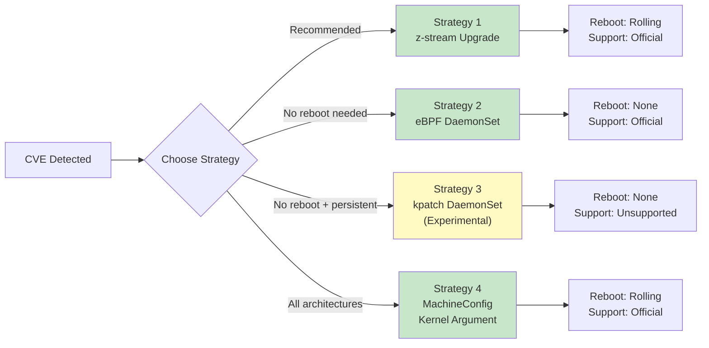
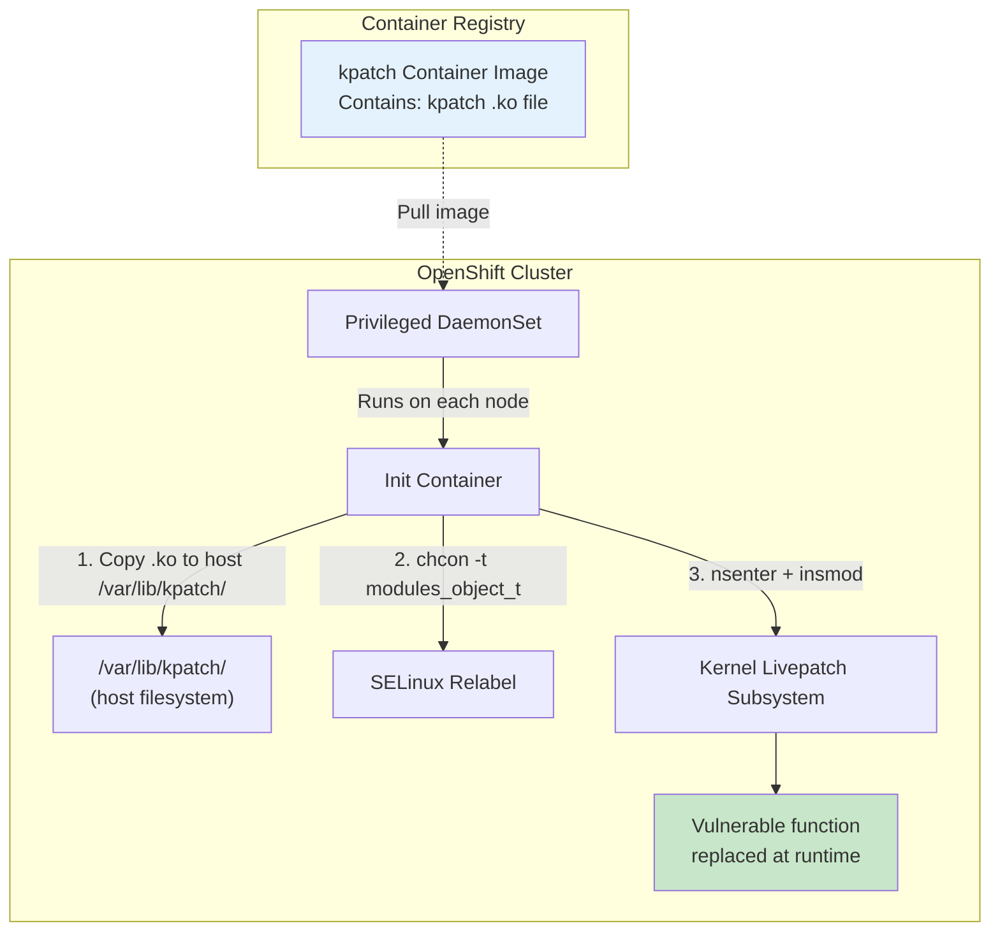
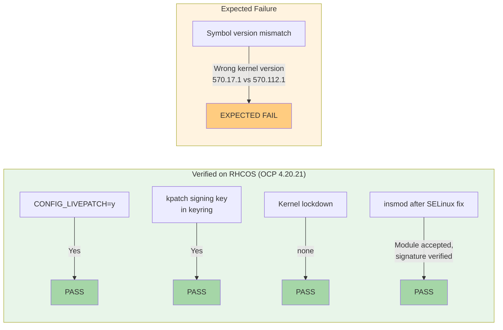
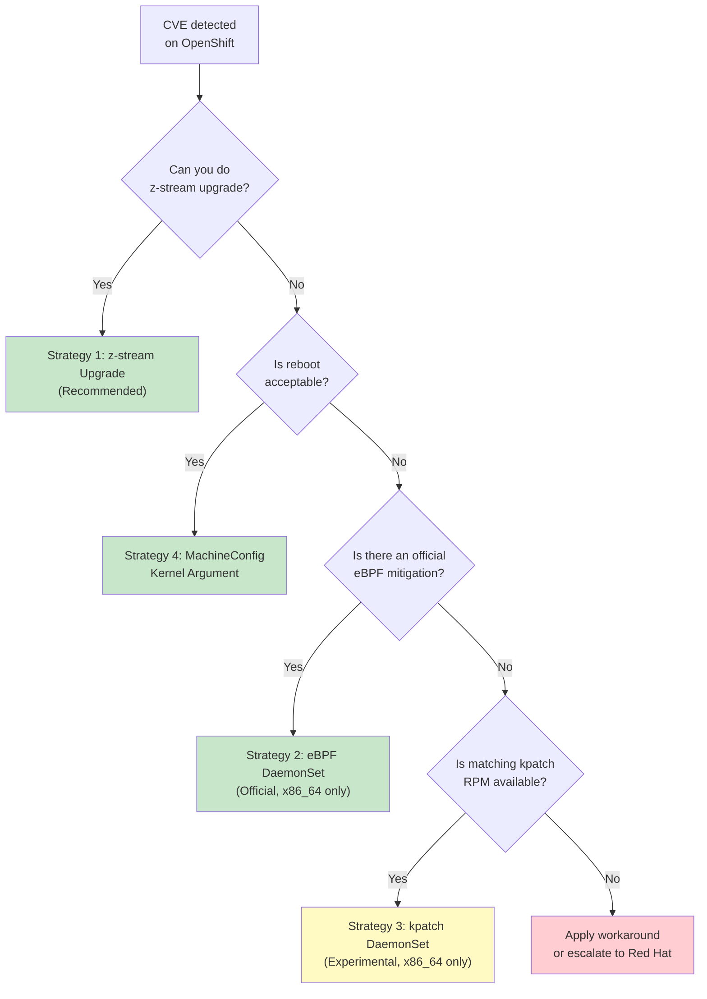

# Solution: OpenShift CoreOS (RHCOS) CVE Patching Strategy

> Date: 2026-05-20<br>
> Target CVE: CVE-2026-31431 ("Copy Fail")<br>
> Platform: OpenShift Container Platform 4.x

---

## 1. Executive Summary

RHCOS has the kernel infrastructure to support kpatch (live kernel patching) — `CONFIG_LIVEPATCH=y`, kpatch signing key in keyring, no kernel lockdown. However, kpatch is not officially supported on RHCOS by Red Hat.

We verified through lab testing that **insmod of a signed kpatch .ko module on RHCOS is technically feasible** after resolving SELinux context requirements. The key constraint is that the kpatch module must match the running kernel version exactly.

This document presents **four patching strategies** for CVE remediation on OpenShift, ranked by recommendation level.

---

## 2. Architecture: How kpatch Works on RHCOS

```mermaid
flowchart TD
    subgraph RHEL["RHEL (Traditional)"]
        A1[dnf install kpatch-patch-*] --> A2[kpatch utility loads .ko]
        A2 --> A3[Kernel livepatch subsystem]
        A3 --> A4[Function hotswap — no reboot]
    end

    subgraph RHCOS["RHCOS (CoreOS)"]
        B1[Extract .ko from RPM] --> B2[Copy to /var/tmp/ on node]
        B2 --> B3["chcon -t modules_object_t"]
        B3 --> B4[insmod kpatch.ko]
        B4 --> B5[Kernel livepatch subsystem]
        B5 --> B6[Function hotswap — no reboot]
    end

    style RHEL fill:#e8f5e9
    style RHCOS fill:#fff3e0
```



### RHCOS Kernel Livepatch Prerequisites (Verified)

| Prerequisite | Status | Verification Command |
|---|---|---|
| `CONFIG_LIVEPATCH=y` | Enabled | `grep LIVEPATCH /lib/modules/$(uname -r)/config` |
| `/sys/kernel/livepatch/` directory | Exists | `ls /sys/kernel/livepatch/` |
| kpatch signing key in keyring | Present | `keyctl list %:.builtin_trusted_keys \| grep kpatch` |
| Kernel lockdown | none (disabled) | `cat /sys/kernel/security/lockdown` |
| SELinux context for .ko | Must be `modules_object_t` | `chcon -t modules_object_t <file>.ko` |
| Kernel version match | **Must be exact** | `uname -r` vs `modinfo -F vermagic <file>.ko` |

---

## 3. Four Patching Strategies Comparison



| Feature | Strategy 1<br>z-stream Upgrade | Strategy 2<br>eBPF DaemonSet | Strategy 3<br>kpatch DaemonSet | Strategy 4<br>MachineConfig Arg |
|---|---|---|---|---|
| **Reboot Required** | Yes (rolling) | **No** | **No** | Yes (rolling) |
| **Official Support** | Yes | Yes | **No** | Yes |
| **CVE Specificity** | Fixes all CVEs in release | CVE-specific | CVE-specific | CVE-specific |
| **Architecture** | All | x86_64 only | x86_64 only | All |
| **Persistence** | Permanent | Until DaemonSet removed | Until DaemonSet removed | Until MC removed |
| **Rollback** | OCP downgrade | `oc delete project` | `oc delete project` | Delete MC |
| **Kernel Version Change** | Yes | No | No | No |
| **Complexity** | Low | Low | Medium | Low |
| **Risk Level** | Low | Low | **Medium** | Low |

---

## 4. Strategy Details

### Strategy 1: z-stream Upgrade (Recommended)

Standard OCP upgrade path. The patched kernel is included in the z-stream release.

```bash
# Check current version
oc get clusterversion

# Check available updates
oc adm upgrade

# Upgrade to fixed version
oc adm upgrade --to=<fixed-version>
```

Fixed versions for CVE-2026-31431:

| OCP Version | Fixed Version | Errata |
|---|---|---|
| 4.16 | 4.16.61 | [RHSA-2026:13729](https://access.redhat.com/errata/RHSA-2026:13729) |
| 4.17 | 4.17.53 | [RHSA-2026:13885](https://access.redhat.com/errata/RHSA-2026:13885) |
| 4.18 | 4.18.40 | [RHSA-2026:13727](https://access.redhat.com/errata/RHSA-2026:13727) |
| 4.19 | 4.19.30 | [RHSA-2026:13690](https://access.redhat.com/errata/RHSA-2026:13690) |
| 4.20 | 4.20.21 | [RHSA-2026:13862](https://access.redhat.com/errata/RHSA-2026:13862) |
| 4.21 | 4.21.14 | [RHSA-2026:13811](https://access.redhat.com/errata/RHSA-2026:13811) |

### Strategy 2: eBPF DaemonSet (Official Rebootless)

Red Hat's official rebootless mitigation for CVE-2026-31431.

```bash
git clone https://github.com/openshift/block-copyfail
cd block-copyfail
git checkout 6d4ade65b1f0d7eb7d885e76f5732b9532c35999
oc apply -f daemonset.yaml

# Verify
oc get -n cve-2026-31431-mitigation-ebpf daemonset
oc logs -n cve-2026-31431-mitigation-ebpf -l app=block-copyfail
```

### Strategy 3: kpatch DaemonSet (Experimental — Unsupported)

This is a **proof-of-concept** approach verified in our lab. It leverages the kpatch livepatch mechanism on RHCOS by deploying a privileged DaemonSet.

> **WARNING: This approach is NOT supported by Red Hat. Use only when official methods are not available and with full understanding of the risks.**

#### 3.1 Architecture



#### 3.2 Step-by-Step: Build kpatch Container Image

```bash
# 1. On a RHEL build host, download the kpatch RPM
KVER="5_14_0-570_17_1"   # <-- replace with target kernel version
dnf download kpatch-patch-${KVER} --destdir=/tmp/kpatch-build/

# 2. Extract
cd /tmp/kpatch-build
rpm2cpio kpatch-patch-${KVER}*.rpm | cpio -idmv
# Produces: ./usr/lib/kpatch/<kernel-version>/kpatch-*.ko

# 3. Create Containerfile
cat > Containerfile << 'EOF'
FROM registry.access.redhat.com/ubi9/ubi-minimal:latest
COPY usr/lib/kpatch/ /usr/lib/kpatch/
EOF

# 4. Build and push
podman build -t quay.io/<org>/kpatch-coreos:${KVER} .
podman push quay.io/<org>/kpatch-coreos:${KVER}
```

#### 3.3 DaemonSet Manifest

```yaml
apiVersion: v1
kind: Namespace
metadata:
  name: kpatch-loader
---
apiVersion: apps/v1
kind: DaemonSet
metadata:
  name: kpatch-loader
  namespace: kpatch-loader
spec:
  selector:
    matchLabels:
      app: kpatch-loader
  template:
    metadata:
      labels:
        app: kpatch-loader
    spec:
      hostPID: true
      hostNetwork: true
      nodeSelector:
        node-role.kubernetes.io/worker: ""
      tolerations:
        - operator: Exists
      initContainers:
        - name: load-kpatch
          # Replace with your kpatch container image
          image: quay.io/<org>/kpatch-coreos:<version>
          securityContext:
            privileged: true
            runAsUser: 0
          command:
            - /bin/sh
            - -c
            - |
              set -ex
              KVER=$(nsenter -t 1 -m -u -i -n -p -- uname -r)
              KO_DIR="/usr/lib/kpatch/${KVER}"
              if [ ! -d "${KO_DIR}" ]; then
                echo "ERROR: No kpatch for kernel ${KVER}"
                exit 1
              fi
              KO_FILE=$(ls ${KO_DIR}/*.ko | head -1)

              # Copy to host
              cp ${KO_FILE} /host-var/kpatch.ko

              # SELinux relabel
              nsenter -t 1 -m -u -i -n -p -- \
                chcon -t modules_object_t /var/lib/kpatch/kpatch.ko

              # Load kpatch
              nsenter -t 1 -m -u -i -n -p -- \
                insmod /var/lib/kpatch/kpatch.ko

              echo "kpatch loaded successfully for kernel ${KVER}"
          volumeMounts:
            - name: host-var
              mountPath: /host-var
              subPath: kpatch
      containers:
        - name: pause
          image: registry.access.redhat.com/ubi9/ubi-minimal:latest
          command: ["/bin/sh", "-c", "echo 'kpatch loaded' && sleep infinity"]
      volumes:
        - name: host-var
          hostPath:
            path: /var/lib
            type: DirectoryOrCreate
```

#### 3.4 MachineConfig + systemd for Boot Persistence

If persistence across reboots is needed (without relying on the DaemonSet starting before vulnerable workloads):

```yaml
apiVersion: machineconfiguration.openshift.io/v1
kind: MachineConfig
metadata:
  labels:
    machineconfiguration.openshift.io/role: worker
  name: 99-kpatch-loader
spec:
  config:
    ignition:
      version: 3.2.0
    storage:
      files:
        - path: /usr/local/bin/load-kpatch.sh
          mode: 0755
          overwrite: true
          contents:
            source: data:text/plain;charset=utf-8;base64,IyEvYmluL2Jhc2gKc2V0IC1leAoKS1ZFUj0kKHVuYW1lIC1yKQpLT19ESVI9Ii92YXIvbGliL2twYXRjaC8ke0tWRVJ9IgoKaWYgWyAhIC1kICIke0tPX0RJUn0iIF07IHRoZW4KICBlY2hvICJObyBrcGF0Y2ggZm91bmQgZm9yIGtlcm5lbCAke0tWRVJ9IgogIGV4aXQgMApmaSAKCktPX0ZJTEU9JChscyAke0tPX0RJUn0vKi5rbyAyPi9kZXYvbnVsbCB8IGhlYWQgLTEpCmlmIFsgLXogIiR7S09fRklMRX0iIF07IHRoZW4KICBlY2hvICJObyAua28gZmlsZSBmb3VuZCBpbiAke0tPX0RJUn0iCiAgZXhpdCAwCmZpCgojIFNFTGludXggcmVsYWJlbApjaGNvbiAtdCBtb2R1bGVzX29iamVjdF90ICIke0tPX0ZJTEV9IgoKIyBDaGVjayBpZiBhbHJlYWR5IGxvYWRlZApLT19OQU1FPSQoYmFzZW5hbWUgIiR7S09fRklMRX0iIC5rbykKaWYgbHNtb2QgfCBncmVwIC1xICIke0tPX05BTUV9IjsgdGhlbgogIGVjaG8gImtwYXRjaCAke0tPX05BTUV9IGFscmVhZHkgbG9hZGVkIgogIGV4aXQgMApmaQoKIyBMb2FkIGtwYXRjaAppbnNtb2QgIiR7S09fRklMRX0iCmVjaG8gImtwYXRjaCAke0tPX05BTUV9IGxvYWRlZCBzdWNjZXNzZnVsbHkiCg==
    systemd:
      units:
        - name: kpatch-loader.service
          enabled: true
          contents: |
            [Unit]
            Description=Load kpatch kernel live patch
            After=network-online.target
            ConditionPathIsDirectory=/var/lib/kpatch

            [Service]
            Type=oneshot
            ExecStart=/usr/local/bin/load-kpatch.sh
            RemainAfterExit=yes

            [Install]
            WantedBy=multi-user.target
```

> **Note:** The base64-encoded script content decodes to a bash script that checks for a matching kpatch .ko in `/var/lib/kpatch/<kernel-version>/`, sets SELinux context, and loads it via insmod.

### Strategy 4: MachineConfig Kernel Argument

```yaml
apiVersion: machineconfiguration.openshift.io/v1
kind: MachineConfig
metadata:
  labels:
    machineconfiguration.openshift.io/role: worker
  name: 99-disable-algif-builtin
spec:
  kernelArguments:
    - initcall_blacklist=algif_aead_init
```

Verification after rolling reboot:

```bash
$ oc debug node/master-01-demo -- chroot /host \
    cat /proc/cmdline | grep initcall_blacklist

... initcall_blacklist=algif_aead_init

$ oc debug node/master-01-demo -- chroot /host \
    dmesg | grep blacklisted

[1.755072] initcall algif_aead_init blacklisted
```

---

## 5. Lab Verification Results

### What We Proved



### Key dmesg Evidence

```
[ 4781.997222] kpatch_5_14_0_570_17_1_1_10: loading out-of-tree module taints kernel.
[ 4781.997243] kpatch_5_14_0_570_17_1_1_10: tainting kernel with TAINT_LIVEPATCH
[ 4781.997599] kpatch_5_14_0_570_17_1_1_10: disagrees about version of symbol __dev_get_by_index
```

The kernel **accepted the module signature**, tainted itself with `TAINT_LIVEPATCH`, and began loading. It failed only because the symbol versions don't match between kernel `570.17.1` and `570.112.1`.

**Conclusion: With a matching kernel version, insmod of kpatch .ko on RHCOS would succeed.**

### Critical Prerequisite: SELinux Context

```bash
# WRONG — will be denied by SELinux
-rw-r--r--. root root system_u:object_r:tmp_t:s0     kpatch.ko
# insmod: ERROR: Permission denied

# CORRECT — module_load allowed
-rw-r--r--. root root system_u:object_r:modules_object_t:s0  kpatch.ko
# Module loads successfully (if kernel version matches)
```

---

## 6. Decision Flowchart



---

## 7. RHEL vs CoreOS Patching: Side-by-Side

| Scenario | RHEL | CoreOS (RHCOS) |
|---|---|---|
| Install kpatch RPM | `dnf install kpatch-patch-*` | Not supported via dnf/rpm-ostree |
| Manually load kpatch .ko | `insmod kpatch.ko` | `insmod kpatch.ko` (after `chcon -t modules_object_t`) |
| kpatch persistence | systemd service (auto) | Manual: MachineConfig + systemd unit |
| Kernel upgrade | `dnf update kernel` | OCP z-stream upgrade only |
| Boot parameter change | `grubby --args=...` | MachineConfig `kernelArguments` |
| Rebootless CVE mitigation | kpatch (official) | eBPF DaemonSet (official, CVE-specific) |

---

## 8. References

| # | Resource | Link |
|---|---|---|
| 1 | CVE-2026-31431 OCP Mitigation | [KCS 7141979](https://access.redhat.com/solutions/7141979) |
| 2 | CVE-2026-31431 RHEL Mitigation | [KCS 7141931](https://access.redhat.com/solutions/7141931) |
| 3 | Zero-Reboot eBPF Mitigation | [KCS 7142136](https://access.redhat.com/solutions/7142136) |
| 4 | kpatch Support on RHEL | [KCS 2206511](https://access.redhat.com/solutions/2206511) |
| 5 | RHCOS Package Upgrade Restrictions | [KCS 6224181](https://access.redhat.com/solutions/6224181) |
| 6 | RHCOS Kernel Version Restrictions | [KCS 6278161](https://access.redhat.com/solutions/6278161) |
| 7 | Security Bulletin RHSB-2026-02 | [RHSB-2026-02](https://access.redhat.com/security/vulnerabilities/RHSB-2026-02) |
| 8 | block-copyfail eBPF Tool | [GitHub](https://github.com/openshift/block-copyfail) |
| 9 | rpm-ostree kpatch Support Issue | [GitHub #118](https://github.com/coreos/rpm-ostree/issues/118) |
