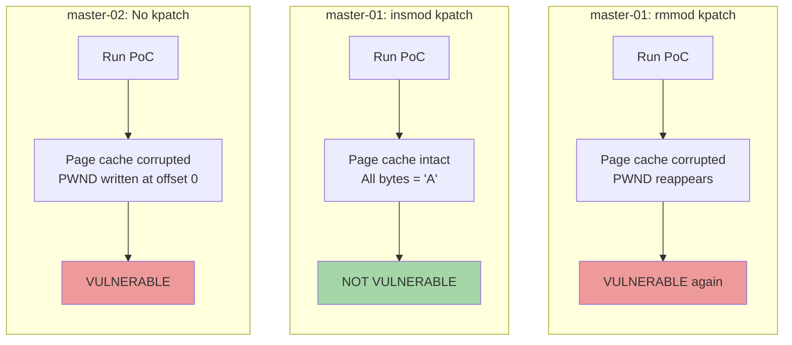
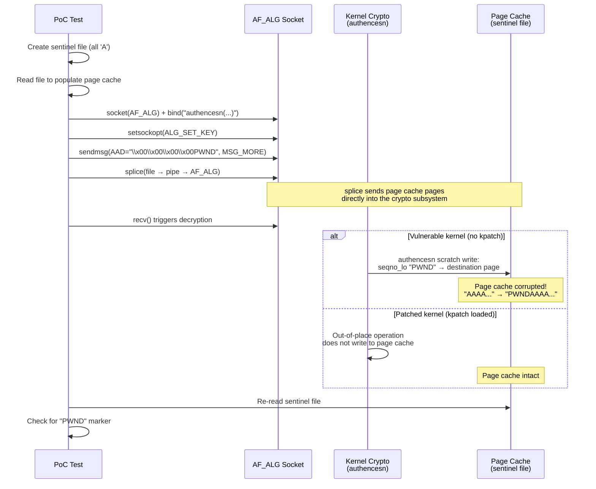
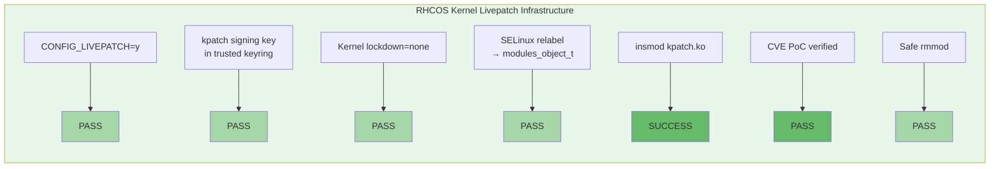
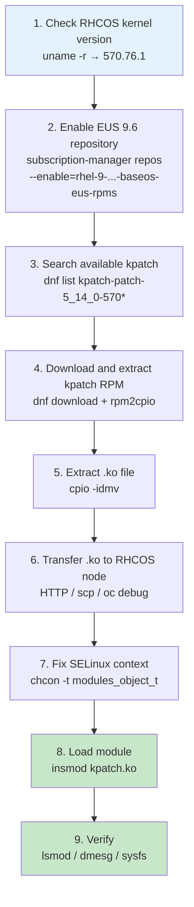
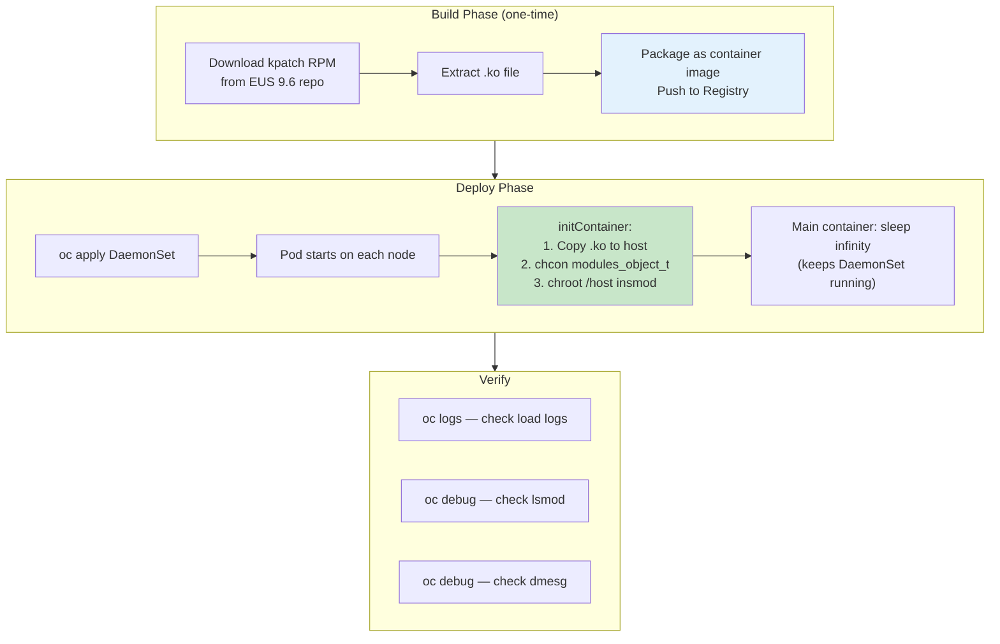
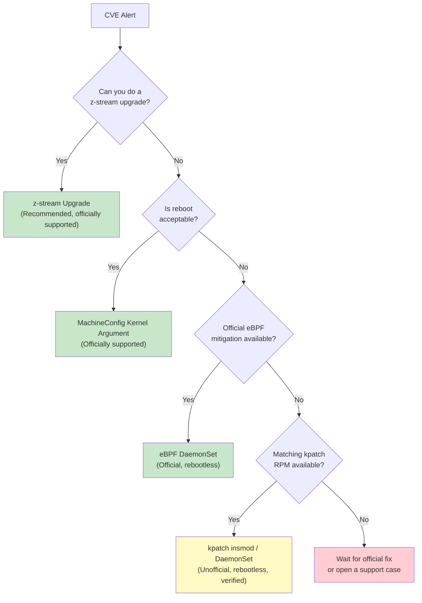

# Solution: Rebootless Kernel Live Patching (kpatch) on OpenShift CoreOS

> Date: 2026-05-20<br>
> Target CVE: CVE-2026-31431 ("Copy Fail")<br>
> Platform: OpenShift Container Platform 4.20.10<br>
> Kernel: 5.14.0-570.76.1.el9_6.x86_64<br>
> Status: **Verified — kpatch insmod on RHCOS succeeded, CVE fix confirmed via PoC**

---

## 1. Executive Summary

We successfully loaded a kpatch kernel live patch module on RHCOS nodes running OCP 4.20.10 (kernel 570.76.1) **without rebooting any node**.

The kpatch .ko module was sourced from the RHEL 9.6 EUS repository (built for kernel 570.94.1) and loaded via `insmod` on kernel 570.76.1. We then verified the fix by running a CVE-2026-31431 page-cache corruption PoC on both patched and unpatched nodes. Key findings:

1. RHCOS kernel fully supports the livepatch infrastructure (`CONFIG_LIVEPATCH=y`, kpatch signing key present)
2. kpatch modules can load across minor versions within the same EUS branch (modversions symbol CRC compatibility)
3. SELinux context must be set to `modules_object_t` before `insmod` will succeed
4. The DaemonSet-based automated deployment was verified across all 3 cluster nodes

> **NOTE: This method is NOT officially supported by Red Hat.** It is provided as a technical feasibility study and emergency workaround reference.

---

## 2. CVE-2026-31431 Verification

### 2.1 PoC Verification: Load / Unload / Reproduce — Three-Way Comparison

We wrote a CVE-2026-31431 page-cache corruption PoC (test_copyfail.c) and performed a three-way comparison across nodes in the same cluster.



| Test Scenario | Node | kpatch State | Page Cache | Result |
|---|---|---|---|---|
| No kpatch | master-02 | Not loaded | **Corrupted** — "PWND" at offset 0 | VULNERABLE (exit 2) |
| insmod kpatch | master-01 | `livepatch enabled=1` | Intact — all bytes = 'A' | **NOT VULNERABLE** (exit 0) |
| rmmod kpatch | master-01 | Unloaded | **Corrupted** — "PWND" reappears | VULNERABLE (exit 2) |

### 2.2 How the PoC Works



### 2.3 Key Command Output

**master-02 (no kpatch — VULNERABLE):**

```
CVE-2026-31431 Copy Fail — page cache corruption test
Kernel: 5.14.0-570.76.1.el9_6.x86_64
Bound to authencesn(hmac(sha256),cbc(aes))
Key set OK (rtattr+auth=32+enc=16)
Sent 8 bytes AAD (marker 'PWND' at offset 4)
Spliced 32 bytes: pipe → AF_ALG (page cache pages sent)
recv: -1 (errno=74 Bad message)

Checking page cache for corruption...
  MARKER 'PWND' found at offset 0!
  Byte changed: offset=0 val=0x50('P')
  Byte changed: offset=1 val=0x57('W')
  Byte changed: offset=2 val=0x4e('N')
  Byte changed: offset=3 val=0x44('D')

*** VULNERABLE: Page cache was corrupted! (4 bytes changed) ***
```

**master-01 (kpatch loaded — NOT VULNERABLE):**

```
CVE-2026-31431 Copy Fail — page cache corruption test
Kernel: 5.14.0-570.76.1.el9_6.x86_64
...
Checking page cache for corruption...

*** NOT VULNERABLE: Page cache is intact ***
```

**master-01 (after rmmod — VULNERABLE again):**

```
CVE-2026-31431 Copy Fail — page cache corruption test
Kernel: 5.14.0-570.76.1.el9_6.x86_64
...
Checking page cache for corruption...
  MARKER 'PWND' found at offset 0!

*** VULNERABLE: Page cache was corrupted! (4 bytes changed) ***
```

### 2.4 kpatch Unload Procedure

```bash
# 1. Disable livepatch (transition all tasks back to original functions)
echo 0 > /sys/kernel/livepatch/kpatch_5_14_0_570_94_1_1_2/enabled

# 2. Wait for transition to complete (transition=0)
cat /sys/kernel/livepatch/kpatch_5_14_0_570_94_1_1_2/transition
# If transition is stuck, force it:
echo 1 > /sys/kernel/livepatch/kpatch_5_14_0_570_94_1_1_2/force

# 3. Unload the module
rmmod kpatch_5_14_0_570_94_1_1_2
```

- **rmmod does NOT crash the system** — the kernel livepatch framework safely reverts all functions to their original versions
- **After unloading, the CVE becomes exploitable again** — kpatch protection is purely runtime

### 2.5 Infrastructure Verification



### dmesg Key Output

```
kpatch_5_14_0_570_94_1_1_2: loading out-of-tree module taints kernel.
kpatch_5_14_0_570_94_1_1_2: tainting kernel with TAINT_LIVEPATCH
livepatch: enabling patch 'kpatch_5_14_0_570_94_1_1_2'
livepatch: 'kpatch_5_14_0_570_94_1_1_2': starting patching transition
livepatch: 'kpatch_5_14_0_570_94_1_1_2': patching complete
```

### Kernel Functions Patched by kpatch

```
vmlinux/_aead_recvmsg              ← CVE-2026-31431 core vulnerable function
vmlinux/aead_sock_destruct
vmlinux/af_alg_count_tsgl
vmlinux/af_alg_alloc_tsgl
vmlinux/af_alg_pull_tsgl
vmlinux/af_alg_get_rsgl
vmlinux/crypto_authenc_esn_decrypt
vmlinux/crypto_authenc_esn_encrypt
vmlinux/crypto_authenc_esn_create
vmlinux/crypto_authenc_esn_decrypt_tail
vmlinux/_skcipher_recvmsg
vmlinux/skcipher_sock_destruct
vmlinux/ip_append_page
esp4/esp_input
esp6/esp6_input
```

---

## 3. Complete kpatch Procedure for RHCOS



### Key Commands

```bash
# Step 1: Check RHCOS kernel version
oc debug node/<node> -- chroot /host uname -r
# Output: 5.14.0-570.76.1.el9_6.x86_64

# Step 2-3: Enable EUS repository on RHEL helper, search for kpatch
subscription-manager repos --enable=rhel-9-for-x86_64-baseos-eus-rpms
subscription-manager release --set=9.6
dnf list available kpatch-patch-5_14_0-570*

# Step 4-5: Download and extract
dnf download kpatch-patch-5_14_0-570_94_1 --destdir=/var/tmp/kpatch-test/
cd /var/tmp/kpatch-test/
rpm2cpio kpatch-patch-*.rpm | cpio -idmv
# Output: ./usr/lib/kpatch/<ver>/kpatch-*.ko

# Step 6: Transfer to RHCOS node (via HTTP)
python3 -m http.server 18080 &    # on helper
firewall-cmd --add-port=18080/tcp
oc debug node/<node> -- chroot /host \
    curl -sS -o /var/tmp/kpatch.ko http://<helper-ip>:18080/kpatch-*.ko

# Step 7-8: SELinux relabel + insmod
oc debug node/<node> -- nsenter -t 1 -m -u -i -n -p -- \
    bash -c "chcon -t modules_object_t /var/tmp/kpatch.ko && insmod /var/tmp/kpatch.ko"

# Step 9: Verify
oc debug node/<node> -- chroot /host lsmod | grep kpatch
oc debug node/<node> -- chroot /host dmesg | grep livepatch
oc debug node/<node> -- chroot /host \
    cat /sys/kernel/livepatch/kpatch_*/enabled    # should output 1
```

---

## 4. kpatch Availability vs RHCOS Kernel Versions

```mermaid
gantt
    title kpatch Availability vs RHCOS Kernel Versions (RHEL 9.6 EUS)
    dateFormat X
    axisFormat %s

    section kpatch
    570.17.1 (kpatch 1-14)    :done, 17, 39
    570.39.1 (kpatch 1-5)     :done, 39, 66
    570.66.1 (kpatch 1-4)     :done, 66, 76
    570.94.1 (kpatch 1-2)     :done, 94, 114

    section RHCOS
    OCP 4.20.10 kernel 570.76.1  :crit, 76, 77
    OCP 4.20.21 kernel 570.112.1 :active, 112, 113
```



| RHCOS Kernel | Closest kpatch | Exact Match | Actual Result |
|---|---|---|---|
| 570.76.1 (OCP 4.20.10) | 570.94.1 (1-2) | No (cross-version) | **Loaded successfully** (modversions compatible) |
| 570.112.1 (OCP 4.20.21) | None (already fixed) | N/A | kpatch not needed |

**Key finding: Within the same EUS branch, kpatch .ko modules can load across minor versions.** The kernel uses the `modversions` mechanism to check symbol CRCs rather than strictly matching version strings. As long as the kernel ABI is compatible, the module loads.

---

## 5. Five CVE Remediation Strategies Compared

| Feature | Strategy 1<br>z-stream Upgrade | Strategy 2<br>eBPF DaemonSet | Strategy 3<br>kpatch insmod | Strategy 4<br>MachineConfig Arg | Strategy 5<br>kpatch DaemonSet |
|---|---|---|---|---|---|
| **Reboot Required** | Yes (rolling) | **No** | **No** | Yes (rolling) | **No** |
| **Official Support** | Yes | Yes | **No** | Yes | **No** |
| **Persistence** | Permanent | While DaemonSet exists | Lost on reboot | Permanent | While DaemonSet exists |
| **Architecture** | All | x86_64 only | x86_64 only | All | x86_64 only |
| **CVE Coverage** | All CVEs in release | CVE-specific | CVE-specific | CVE-specific | CVE-specific |
| **Complexity** | Low | Low | Medium | Low | Medium |
| **Prerequisites** | Fixed z-stream available | eBPF mitigation available | Matching kpatch RPM | Known workaround param | Matching kpatch RPM |
| **Risk** | Low | Low | **Medium** | Low | **Medium** |
| **Lab Verified** | — | — | **Yes** | — | **Yes** |

---

## 6. Automated Deployment: kpatch DaemonSet

Automates the manual insmod workflow as a DaemonSet for rebootless, cluster-wide deployment.



### Containerfile

```dockerfile
FROM registry.access.redhat.com/ubi9/ubi-minimal:latest
COPY usr/lib/kpatch/ /usr/lib/kpatch/
```

### Build and Push

```bash
mkdir -p /var/tmp/kpatch-image/usr/lib/kpatch/<kernel-version>/
cp kpatch-*.ko /var/tmp/kpatch-image/usr/lib/kpatch/<kernel-version>/

cd /var/tmp/kpatch-image
podman build -t quay.io/<org>/<repo>:kpatch-demo-<date> .
podman push quay.io/<org>/<repo>:kpatch-demo-<date>
```

> Verified image: `quay.io/wangzheng422/qimgs:kpatch-demo-2026-05-20-2130`

### DaemonSet YAML (Verified)

> **NOTE**: ubi-minimal does not include `nsenter`. Use `chroot /host` to interact with the host OS.

```yaml
apiVersion: v1
kind: Namespace
metadata:
  name: kpatch-loader
---
apiVersion: apps/v1
kind: DaemonSet
metadata:
  name: kpatch-loader
  namespace: kpatch-loader
spec:
  selector:
    matchLabels:
      app: kpatch-loader
  template:
    metadata:
      labels:
        app: kpatch-loader
    spec:
      hostPID: true
      hostNetwork: true
      tolerations:
        - operator: Exists
      initContainers:
        - name: load-kpatch
          image: quay.io/wangzheng422/qimgs:kpatch-demo-2026-05-20-2130
          securityContext:
            privileged: true
            runAsUser: 0
          command:
            - /bin/sh
            - -c
            - |
              set -ex

              # Check if kpatch already loaded
              if chroot /host lsmod | grep -q kpatch; then
                echo "kpatch already loaded, skipping"
                exit 0
              fi

              # Find the .ko file
              KO_FILE=$(find /usr/lib/kpatch/ -name '*.ko' | head -1)
              if [ -z "${KO_FILE}" ]; then
                echo "ERROR: No kpatch .ko found"
                exit 1
              fi
              echo "Found: ${KO_FILE}"

              # Copy to host
              cp "${KO_FILE}" /host/var/tmp/kpatch.ko
              echo "Copied to /var/tmp/kpatch.ko on host"

              # SELinux relabel + insmod via chroot /host
              chroot /host chcon -t modules_object_t /var/tmp/kpatch.ko
              chroot /host insmod /var/tmp/kpatch.ko
              echo "insmod OK"

              # Verify
              chroot /host dmesg | tail -5 | grep -i livepatch || true
              echo "kpatch loaded successfully"
          volumeMounts:
            - name: host-root
              mountPath: /host
      containers:
        - name: pause
          image: quay.io/wangzheng422/qimgs:kpatch-demo-2026-05-20-2130
          command:
            - /bin/sh
            - -c
            - |
              echo "kpatch active"
              sleep infinity
      volumes:
        - name: host-root
          hostPath:
            path: /
            type: Directory
```

### Deployment Steps

```bash
# 1. Create namespace and DaemonSet
oc apply -f kpatch-daemonset.yaml

# 2. Grant privileged SCC (required!)
oc adm policy add-scc-to-user privileged -z default -n kpatch-loader

# 3. Verify
oc get pods -n kpatch-loader -o wide
oc logs -n kpatch-loader <pod-name> -c load-kpatch
```

### Verified Results

```
$ oc get pods -n kpatch-loader -o wide
NAME                  READY   STATUS    NODE
kpatch-loader-cnz57   1/1     Running   master-02-demo
kpatch-loader-l2kpx   1/1     Running   master-03-demo
kpatch-loader-zg9z9   1/1     Running   master-01-demo

$ # CVE PoC on all 3 nodes after DaemonSet deployment:
master-01: *** NOT VULNERABLE: Page cache is intact ***
master-02: *** NOT VULNERABLE: Page cache is intact ***
master-03: *** NOT VULNERABLE: Page cache is intact ***
```

**The DaemonSet automatically loaded kpatch on all 3 nodes. CVE-2026-31431 was remediated across the entire cluster with zero reboots.**

### Cleanup

```bash
# Remove the DaemonSet (does NOT unload kpatch from kernel — protection persists until reboot)
oc delete project kpatch-loader

# To fully remove kpatch from a running node (protection will be lost):
oc debug node/<node> -- nsenter -t 1 -m -u -i -n -p -- bash -c \
    "echo 0 > /sys/kernel/livepatch/kpatch_5_14_0_570_94_1_1_2/enabled && \
     sleep 5 && rmmod kpatch_5_14_0_570_94_1_1_2"
```

---

## 7. Decision Flowchart



---

## 8. RHEL vs CoreOS Patching: Side-by-Side

| Dimension | RHEL | CoreOS (RHCOS) |
|---|---|---|
| Kernel patch | `dnf update kernel` + reboot | OCP z-stream upgrade + MCO rolling reboot |
| kpatch install | `dnf install kpatch-patch-*` | **dnf not supported**, but manual `insmod .ko` works |
| kpatch availability | Standard RHEL baseos repo | Requires **EUS repository** (`subscription-manager release --set=9.6`) |
| kpatch loading | `kpatch load` or `insmod` | `insmod` + **SELinux `chcon -t modules_object_t`** |
| kpatch persistence | systemd service (automatic) | Requires manual MachineConfig + systemd unit, or DaemonSet |
| Rebootless mitigation | kpatch (general purpose) | eBPF DaemonSet (CVE-specific, official) or kpatch insmod (unofficial) |
| Boot parameter change | `grubby` | MachineConfig `kernelArguments` |

---

## 9. Caveats and Risks

1. **Not officially supported**: Red Hat does not support manual insmod of kpatch on RHCOS. Issues arising from this approach cannot be covered by a support case.
2. **modversions compatibility**: Cross-version loading within the same EUS branch succeeded (verified: 570.94.1 → 570.76.1), but not all version combinations are guaranteed to be compatible.
3. **Lost on reboot**: kpatch loaded via insmod is lost when the node reboots. Use a DaemonSet or MachineConfig+systemd for persistence.
4. **SELinux context required**: The .ko file must have the `modules_object_t` SELinux context, otherwise insmod will be denied.
5. **x86_64 only**: Not tested on ARM64/ppc64le/s390x.
6. **kpatch RPMs may not cover all RHCOS kernel versions**: Red Hat only publishes kpatch for specific EUS milestone kernels. The RHCOS kernel may fall between milestones.
7. **Protection lost after unloading**: After `rmmod`, the CVE immediately becomes exploitable again (verified). kpatch protection is purely runtime.
8. **rmmod is safe**: Disable livepatch via `echo 0 > enabled`, wait for `transition=0`, then `rmmod` — the system does not crash. However, Red Hat explicitly states "Unloading a kpatch is not supported."

---

## 10. References

| # | Resource | Link |
|---|---|---|
| 1 | CVE-2026-31431 OCP Mitigation | [KCS 7141979](https://access.redhat.com/solutions/7141979) |
| 2 | CVE-2026-31431 RHEL Mitigation | [KCS 7141931](https://access.redhat.com/solutions/7141931) |
| 3 | Zero-Reboot eBPF Mitigation | [KCS 7142136](https://access.redhat.com/solutions/7142136) |
| 4 | kpatch Support on RHEL | [KCS 2206511](https://access.redhat.com/solutions/2206511) |
| 5 | RHCOS Package Upgrade Restrictions | [KCS 6224181](https://access.redhat.com/solutions/6224181) |
| 6 | RHCOS Kernel Version Restrictions | [KCS 6278161](https://access.redhat.com/solutions/6278161) |
| 7 | Security Bulletin RHSB-2026-02 | [RHSB-2026-02](https://access.redhat.com/security/vulnerabilities/RHSB-2026-02) |
| 8 | block-copyfail eBPF Tool | [GitHub](https://github.com/openshift/block-copyfail) |
| 9 | rpm-ostree kpatch Support Issue | [GitHub #118](https://github.com/coreos/rpm-ostree/issues/118) |
