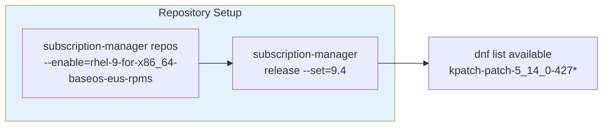
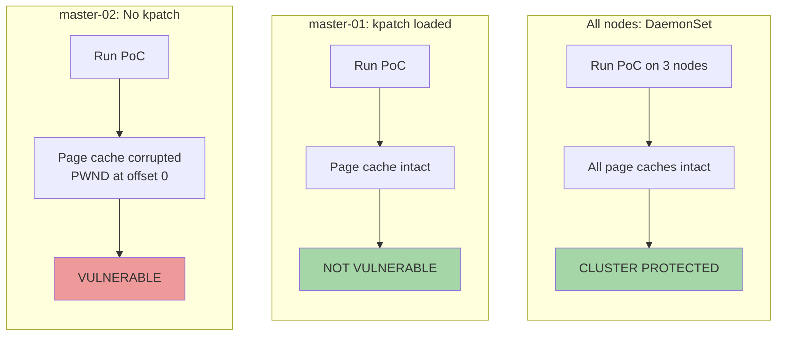
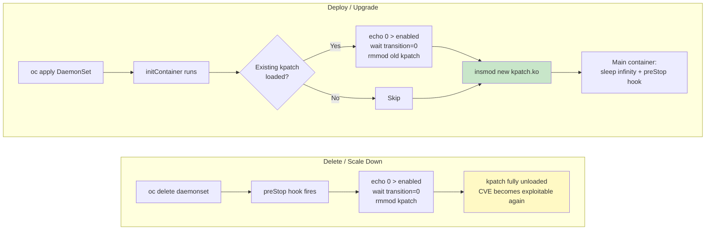
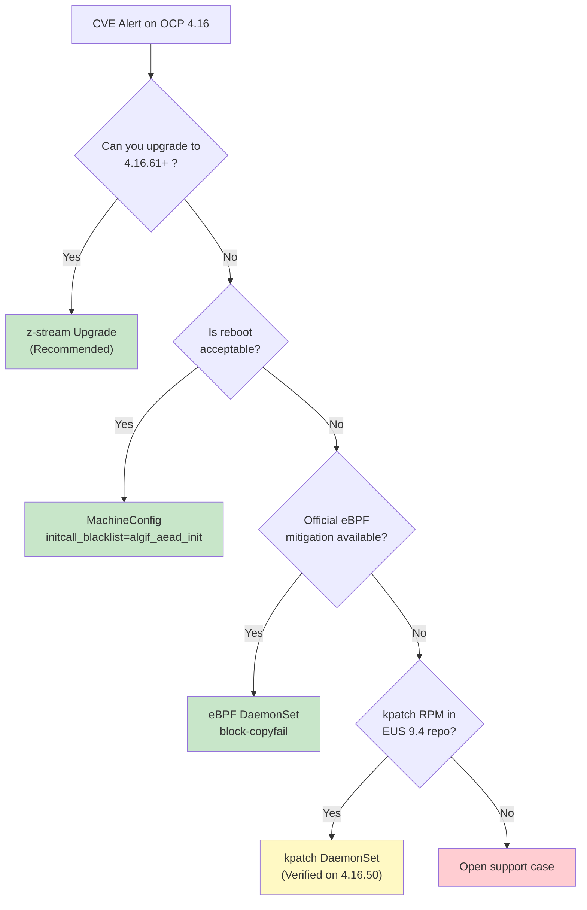

# Solution: Rebootless Kernel Live Patching (kpatch) on OpenShift 4.16 CoreOS

> Date: 2026-05-21<br>
> Target CVE: CVE-2026-31431 ("Copy Fail")<br>
> Platform: OpenShift Container Platform 4.16.50<br>
> RHCOS: 416.94.202510081640-0 (based on RHEL 9.4 EUS)<br>
> Kernel: 5.14.0-427.93.1.el9_4.x86_64<br>
> Status: **Verified — kpatch loaded, CVE fix confirmed via PoC, DaemonSet deployed**

---

## 1. Executive Summary

We successfully loaded a kpatch kernel live patch on RHCOS nodes running OCP 4.16.50 (kernel `427.93.1`) **without rebooting any node**, and verified the fix with a CVE-2026-31431 page-cache corruption PoC.

The kpatch .ko module was sourced from the RHEL 9.4 EUS repository (built for kernel `427.100.1`) and loaded via `insmod` on kernel `427.93.1`. A DaemonSet was deployed to automate the process across all 3 cluster nodes.

| Verification Step | Result |
|---|---|
| `CONFIG_LIVEPATCH=y` in RHCOS kernel | PASS |
| kpatch signing key in trusted keyring | PASS |
| Kernel lockdown = none | PASS |
| insmod after SELinux relabel | **SUCCESS** |
| CVE PoC on unpatched node | **VULNERABLE** (page cache corrupted) |
| CVE PoC on patched node | **NOT VULNERABLE** (page cache intact) |
| DaemonSet auto-deploy to 3 nodes | **SUCCESS** — all 3 nodes protected |

> **NOTE: This method is NOT officially supported by Red Hat.** It is provided as a technical feasibility study and emergency workaround reference.

---

## 2. OCP 4.16 Specifics

### RHCOS Kernel and kpatch Availability

OCP 4.16 uses RHCOS based on **RHEL 9.4 EUS**. The kpatch RPMs must be sourced from the `rhel-9-for-x86_64-baseos-eus-rpms` repository with release pinned to `9.4`.



Available kpatch RPMs for the RHEL 9.4 EUS kernel family:

| kpatch Target Kernel | Latest Version | Matches RHCOS 427.93.1? |
|---|---|---|
| 427.13.1 | 1-12.el9_4 | No (older) |
| 427.31.1 | 1-14.el9_4 | No (older) |
| 427.44.1 | 1-14.el9_4 | No (older) |
| 427.55.1 | 1-14.el9_4 | No (older) |
| 427.68.2 | 1-11.el9_4 | No (older) |
| 427.84.1 | 1-6.el9_4 | No (older) |
| **427.100.1** | **1-4.el9_4** | **No (but closest above — WORKS via modversions)** |
| 427.113.1 | 1-2.el9_4 | No (newer) |

**Key finding confirmed on OCP 4.16**: kpatch `.ko` built for kernel `427.100.1` loads successfully on kernel `427.93.1` via modversions symbol CRC compatibility within the same RHEL 9.4 EUS branch.

### OCP 4.16 Fixed Versions for CVE-2026-31431

| OCP Version | Fixed Version | Errata |
|---|---|---|
| 4.16 | **4.16.61** | [RHSA-2026:13729](https://access.redhat.com/errata/RHSA-2026:13729) |

Current cluster version `4.16.50` is below the fix threshold — **vulnerable**.

---

## 3. CVE-2026-31431 PoC Verification on OCP 4.16

### Three-Way Comparison



| Test | Node | kpatch | Page Cache | Result |
|---|---|---|---|---|
| No kpatch | master-02 | Not loaded | **Corrupted** — "PWND" at offset 0 | VULNERABLE (exit 2) |
| Manual insmod | master-01 | `kpatch_5_14_0_427_100_1_1_4` | Intact | **NOT VULNERABLE** (exit 0) |
| DaemonSet | all 3 nodes | Auto-loaded | All intact | **CLUSTER PROTECTED** |

### Command Output — Unpatched Node

```
CVE-2026-31431 Copy Fail — page cache corruption test
Kernel: 5.14.0-427.93.1.el9_4.x86_64
Bound to authencesn(hmac(sha256),cbc(aes))
Key set OK (rtattr+auth=32+enc=16)
Sent 8 bytes AAD (marker 'PWND' at offset 4)
Spliced 32 bytes: pipe → AF_ALG (page cache pages sent)
recv: -1 (errno=74 Bad message)

Checking page cache for corruption...
  MARKER 'PWND' found at offset 0!
  Byte changed: offset=0 val=0x50('P')
  Byte changed: offset=1 val=0x57('W')
  Byte changed: offset=2 val=0x4e('N')
  Byte changed: offset=3 val=0x44('D')

*** VULNERABLE: Page cache was corrupted! (4 bytes changed) ***
```

### Command Output — Patched Node

```
CVE-2026-31431 Copy Fail — page cache corruption test
Kernel: 5.14.0-427.93.1.el9_4.x86_64
...
Checking page cache for corruption...

*** NOT VULNERABLE: Page cache is intact ***
```

### dmesg on Patched Node

```
kpatch_5_14_0_427_100_1_1_4: loading out-of-tree module taints kernel.
kpatch_5_14_0_427_100_1_1_4: tainting kernel with TAINT_LIVEPATCH
livepatch: enabling patch 'kpatch_5_14_0_427_100_1_1_4'
livepatch: 'kpatch_5_14_0_427_100_1_1_4': starting patching transition
```

---

## 4. Complete Procedure for OCP 4.16

### 4.1 Manual kpatch Loading

```bash
# 1. Check RHCOS kernel version
oc debug node/<node> -- chroot /host uname -r
# Output: 5.14.0-427.93.1.el9_4.x86_64

# 2. On a RHEL 9.4 helper, enable EUS repos and download kpatch
subscription-manager repos --enable=rhel-9-for-x86_64-baseos-eus-rpms
subscription-manager release --set=9.4
dnf download kpatch-patch-5_14_0-427_100_1 --destdir=/var/tmp/kpatch/

# 3. Extract the .ko
cd /var/tmp/kpatch/
rpm2cpio kpatch-patch-*.rpm | cpio -idmv
# Output: ./usr/lib/kpatch/5.14.0-427.100.1.el9_4.x86_64/kpatch-*.ko

# 4. Serve via HTTP
cd usr/lib/kpatch/5.14.0-427.100.1.el9_4.x86_64/
python3 -m http.server 18080 &
firewall-cmd --add-port=18080/tcp

# 5. Download to RHCOS node and load
oc debug node/<node> -- nsenter -t 1 -m -u -i -n -p -- bash -c \
    "curl -sS -o /var/tmp/kpatch.ko http://<helper-ip>:18080/kpatch-*.ko && \
     chcon -t modules_object_t /var/tmp/kpatch.ko && \
     insmod /var/tmp/kpatch.ko"

# 6. Verify
oc debug node/<node> -- chroot /host lsmod | grep kpatch
oc debug node/<node> -- chroot /host dmesg | grep livepatch
```

### 4.2 Automated DaemonSet Deployment

#### Build and Push Container Image

```bash
# On a build host with podman
mkdir -p kpatch-image/usr/lib/kpatch/5.14.0-427.100.1.el9_4.x86_64/
cp kpatch-5_14_0-427_100_1-1-4.ko kpatch-image/usr/lib/kpatch/5.14.0-427.100.1.el9_4.x86_64/

cat > kpatch-image/Containerfile << 'EOF'
FROM registry.access.redhat.com/ubi9/ubi-minimal:latest
COPY usr/lib/kpatch/ /usr/lib/kpatch/
EOF

cd kpatch-image
podman build -t quay.io/wangzheng422/qimgs:kpatch-ocp416-2026-05-21 .
podman push quay.io/wangzheng422/qimgs:kpatch-ocp416-2026-05-21
```

> Verified image: `quay.io/wangzheng422/qimgs:kpatch-ocp416-2026-05-21`

#### DaemonSet YAML (Verified on OCP 4.16.50)

```yaml
apiVersion: v1
kind: Namespace
metadata:
  name: kpatch-loader
---
apiVersion: apps/v1
kind: DaemonSet
metadata:
  name: kpatch-loader
  namespace: kpatch-loader
spec:
  selector:
    matchLabels:
      app: kpatch-loader
  template:
    metadata:
      labels:
        app: kpatch-loader
    spec:
      hostPID: true
      hostNetwork: true
      tolerations:
        - operator: Exists
      initContainers:
        - name: load-kpatch
          image: quay.io/wangzheng422/qimgs:kpatch-ocp416-2026-05-21
          securityContext:
            privileged: true
            runAsUser: 0
          command:
            - /bin/sh
            - -c
            - |
              set -ex
              if chroot /host lsmod | grep -q kpatch; then
                echo "kpatch already loaded, skipping"
                exit 0
              fi
              KO_FILE=$(find /usr/lib/kpatch/ -name '*.ko' | head -1)
              if [ -z "${KO_FILE}" ]; then
                echo "ERROR: No kpatch .ko found"
                exit 1
              fi
              echo "Found: ${KO_FILE}"
              cp "${KO_FILE}" /host/var/tmp/kpatch.ko
              chroot /host chcon -t modules_object_t /var/tmp/kpatch.ko
              chroot /host insmod /var/tmp/kpatch.ko
              echo "insmod OK"
              chroot /host dmesg | tail -5 | grep -i livepatch || true
              echo "kpatch loaded successfully"
          volumeMounts:
            - name: host-root
              mountPath: /host
      containers:
        - name: pause
          image: quay.io/wangzheng422/qimgs:kpatch-ocp416-2026-05-21
          command: ["/bin/sh", "-c", "echo kpatch active && sleep infinity"]
      volumes:
        - name: host-root
          hostPath:
            path: /
            type: Directory
```

#### Deploy

```bash
# 1. Apply
oc apply -f kpatch-daemonset.yaml

# 2. Grant privileged SCC (required)
oc adm policy add-scc-to-user privileged -z default -n kpatch-loader

# 3. Verify
oc get pods -n kpatch-loader -o wide
oc logs -n kpatch-loader <pod-name> -c load-kpatch
```

#### Verified Results on OCP 4.16.50

```
$ oc get pods -n kpatch-loader -o wide
NAME                  READY   STATUS    NODE
kpatch-loader-bkr77   1/1     Running   master-03-demo
kpatch-loader-vztkb   1/1     Running   master-01-demo
kpatch-loader-zd4cz   1/1     Running   master-02-demo

$ # CVE PoC after DaemonSet:
master-01: *** NOT VULNERABLE: Page cache is intact ***
master-02: *** NOT VULNERABLE: Page cache is intact ***
master-03: *** NOT VULNERABLE: Page cache is intact ***
```

#### DaemonSet v2: Auto-Unload on Delete + Upgrade Support (Verified)

The v2 DaemonSet adds two key features:

1. **preStop hook** — automatically unloads kpatch when the pod is terminated (DaemonSet deleted or updated)
2. **initContainer unload-before-load** — removes any existing kpatch before loading the new one (supports in-place upgrades)



##### Verified Lifecycle Test Results

| Step | kpatch State | CVE PoC Result |
|---|---|---|
| 1. Deploy DaemonSet v2 | Loaded (`livepatch enabled=1`) | NOT VULNERABLE |
| 2. Delete DaemonSet (preStop fires) | **Auto-unloaded** (rmmod by preStop hook) | VULNERABLE |
| 3. Redeploy DaemonSet v2 | Loaded again | NOT VULNERABLE |

##### Upgrade Procedure

To upgrade to a newer kpatch version:

```bash
# 1. Build new image with updated .ko
podman build -t quay.io/<org>/<repo>:kpatch-v2 .
podman push quay.io/<org>/<repo>:kpatch-v2

# 2. Update the DaemonSet image — rolling update handles the rest:
#    preStop unloads old kpatch → initContainer loads new kpatch
oc set image daemonset/kpatch-loader \
    load-kpatch=quay.io/<org>/<repo>:kpatch-v2 \
    keeper=quay.io/<org>/<repo>:kpatch-v2 \
    -n kpatch-loader
```

The rolling update process per node:
1. Old pod receives SIGTERM → preStop hook fires → old kpatch unloaded via `rmmod`
2. New pod starts → initContainer detects no kpatch loaded → loads new .ko via `insmod`

##### DaemonSet v2 YAML (Verified)

```yaml
apiVersion: v1
kind: Namespace
metadata:
  name: kpatch-loader
---
apiVersion: apps/v1
kind: DaemonSet
metadata:
  name: kpatch-loader
  namespace: kpatch-loader
spec:
  selector:
    matchLabels:
      app: kpatch-loader
  updateStrategy:
    type: RollingUpdate
    rollingUpdate:
      maxUnavailable: 1
  template:
    metadata:
      labels:
        app: kpatch-loader
    spec:
      hostPID: true
      hostNetwork: true
      terminationGracePeriodSeconds: 60
      tolerations:
        - operator: Exists
      initContainers:
        - name: load-kpatch
          image: quay.io/wangzheng422/qimgs:kpatch-ocp416-2026-05-21
          securityContext:
            privileged: true
            runAsUser: 0
          command:
            - /bin/sh
            - -c
            - |
              set -ex

              # Unload any existing kpatch first (upgrade scenario)
              EXISTING=$(chroot /host lsmod | grep kpatch | awk '{print $1}' || true)
              if [ -n "${EXISTING}" ]; then
                echo "Unloading existing kpatch: ${EXISTING}"
                chroot /host bash -c "echo 0 > /sys/kernel/livepatch/${EXISTING}/enabled" 2>/dev/null || true
                for i in 1 2 3 4 5 6 7 8 9 10; do
                  T=$(chroot /host cat /sys/kernel/livepatch/${EXISTING}/transition 2>/dev/null || echo 0)
                  [ "$T" = "0" ] && break
                  echo "Waiting for transition... (round $i)"
                  sleep 3
                done
                chroot /host rmmod ${EXISTING} 2>/dev/null || true
                echo "Old kpatch unloaded"
              fi

              # Find and load new kpatch
              KO_FILE=$(find /usr/lib/kpatch/ -name '*.ko' | head -1)
              if [ -z "${KO_FILE}" ]; then
                echo "ERROR: No kpatch .ko found"
                exit 1
              fi
              echo "Found: ${KO_FILE}"
              cp "${KO_FILE}" /host/var/tmp/kpatch.ko
              chroot /host chcon -t modules_object_t /var/tmp/kpatch.ko
              chroot /host insmod /var/tmp/kpatch.ko
              echo "insmod OK"
              chroot /host dmesg | tail -5 | grep -i livepatch || true

              # Record loaded module name for preStop
              KO_NAME=$(chroot /host lsmod | grep kpatch | awk '{print $1}')
              echo "${KO_NAME}" > /host/var/tmp/kpatch-loaded-module
              echo "kpatch loaded: ${KO_NAME}"
          volumeMounts:
            - name: host-root
              mountPath: /host
      containers:
        - name: keeper
          image: quay.io/wangzheng422/qimgs:kpatch-ocp416-2026-05-21
          securityContext:
            privileged: true
            runAsUser: 0
          command:
            - /bin/sh
            - -c
            - |
              echo "kpatch active"
              trap 'echo SIGTERM received' TERM
              while true; do sleep 3600 & wait; done
          lifecycle:
            preStop:
              exec:
                command:
                  - /bin/sh
                  - -c
                  - |
                    echo "preStop: unloading kpatch..."
                    MOD=$(cat /host/var/tmp/kpatch-loaded-module 2>/dev/null || chroot /host lsmod | grep kpatch | awk '{print $1}')
                    if [ -z "${MOD}" ]; then
                      echo "No kpatch module found"
                      exit 0
                    fi
                    echo "Disabling livepatch: ${MOD}"
                    chroot /host bash -c "echo 0 > /sys/kernel/livepatch/${MOD}/enabled" 2>/dev/null || true
                    for i in 1 2 3 4 5 6 7 8 9 10; do
                      T=$(chroot /host cat /sys/kernel/livepatch/${MOD}/transition 2>/dev/null || echo 0)
                      [ "$T" = "0" ] && break
                      echo "Waiting for transition... (round $i)"
                      sleep 3
                    done
                    chroot /host rmmod ${MOD} 2>/dev/null
                    echo "kpatch ${MOD} unloaded"
                    rm -f /host/var/tmp/kpatch-loaded-module /host/var/tmp/kpatch.ko
          volumeMounts:
            - name: host-root
              mountPath: /host
      volumes:
        - name: host-root
          hostPath:
            path: /
            type: Directory
```

##### Deploy

```bash
oc apply -f kpatch-daemonset-v2.yaml
oc adm policy add-scc-to-user privileged -z default -n kpatch-loader
```

##### Cleanup (kpatch auto-unloaded)

```bash
# preStop hook automatically unloads kpatch from every node
oc delete daemonset kpatch-loader -n kpatch-loader
# or
oc delete project kpatch-loader
```

---

## 5. OCP 4.16 vs OCP 4.20 Comparison

This solution has now been verified on two different OCP versions:

| Dimension | OCP 4.16.50 | OCP 4.20.10 |
|---|---|---|
| RHCOS base | RHEL 9.4 EUS | RHEL 9.6 EUS |
| RHCOS kernel | 5.14.0-427.93.1.el9_4 | 5.14.0-570.76.1.el9_6 |
| kpatch used | 427.100.1 (1-4) | 570.94.1 (1-2) |
| Cross-version load | YES (427.100→427.93) | YES (570.94→570.76) |
| EUS repo needed | `release --set=9.4` | `release --set=9.6` |
| CVE PoC result | Confirmed | Confirmed |
| DaemonSet deploy | 3/3 nodes OK | 3/3 nodes OK |
| Container image | `kpatch-ocp416-2026-05-21` | `kpatch-demo-2026-05-20-2130` |

**Conclusion**: The kpatch-on-RHCOS approach is reproducible across OCP 4.16 and 4.20. The same pattern applies: enable the matching EUS repo, find the closest kpatch, extract the .ko, and deploy via DaemonSet.

---

## 6. Decision Flowchart



---

## 7. Caveats and Risks

1. **Not officially supported** — Red Hat does not support manual insmod of kpatch on RHCOS.
2. **modversions compatibility** — Cross-version loading within the same EUS branch works (verified on 9.4 and 9.6), but not all combinations are guaranteed.
3. **Lost on reboot** — kpatch loaded via insmod is lost on node reboot. The DaemonSet will re-load it when the pod restarts.
4. **SELinux context required** — `.ko` must have `modules_object_t` context before insmod.
5. **x86_64 only** — Not tested on ARM64/ppc64le/s390x.
6. **Privileged SCC required** — DaemonSet needs `oc adm policy add-scc-to-user privileged` on the namespace's default service account.
7. **Protection lost after rmmod** — Unloading kpatch restores the vulnerability. Verified on OCP 4.20.
8. **kpatch RPMs only for EUS milestone kernels** — Not every RHCOS kernel version has a matching kpatch. Use the closest available version from the same EUS branch.

---

## 8. References

| # | Resource | Link |
|---|---|---|
| 1 | CVE-2026-31431 OCP Mitigation | [KCS 7141979](https://access.redhat.com/solutions/7141979) |
| 2 | CVE-2026-31431 RHEL Mitigation | [KCS 7141931](https://access.redhat.com/solutions/7141931) |
| 3 | Zero-Reboot eBPF Mitigation | [KCS 7142136](https://access.redhat.com/solutions/7142136) |
| 4 | kpatch Support on RHEL | [KCS 2206511](https://access.redhat.com/solutions/2206511) |
| 5 | RHCOS Package Upgrade Restrictions | [KCS 6224181](https://access.redhat.com/solutions/6224181) |
| 6 | Security Bulletin RHSB-2026-02 | [RHSB-2026-02](https://access.redhat.com/security/vulnerabilities/RHSB-2026-02) |
| 7 | OCP 4.16 Fixed Version | [RHSA-2026:13729](https://access.redhat.com/errata/RHSA-2026:13729) (4.16.61) |
| 8 | block-copyfail eBPF Tool | [GitHub](https://github.com/openshift/block-copyfail) |
