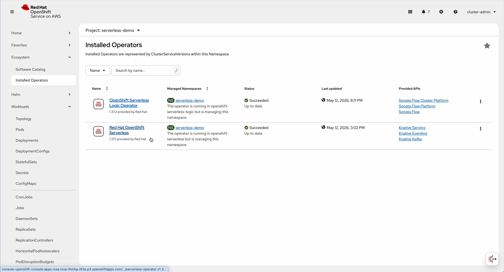
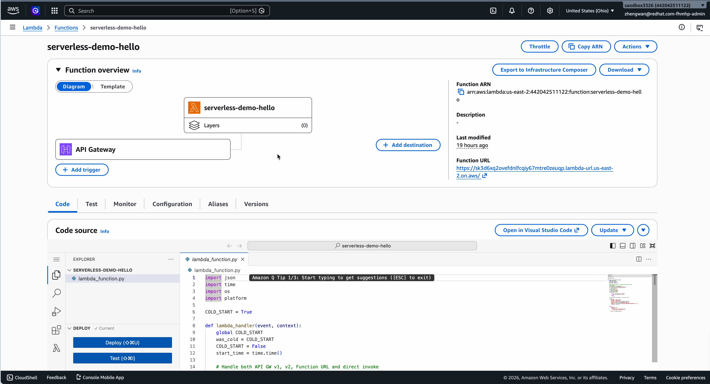
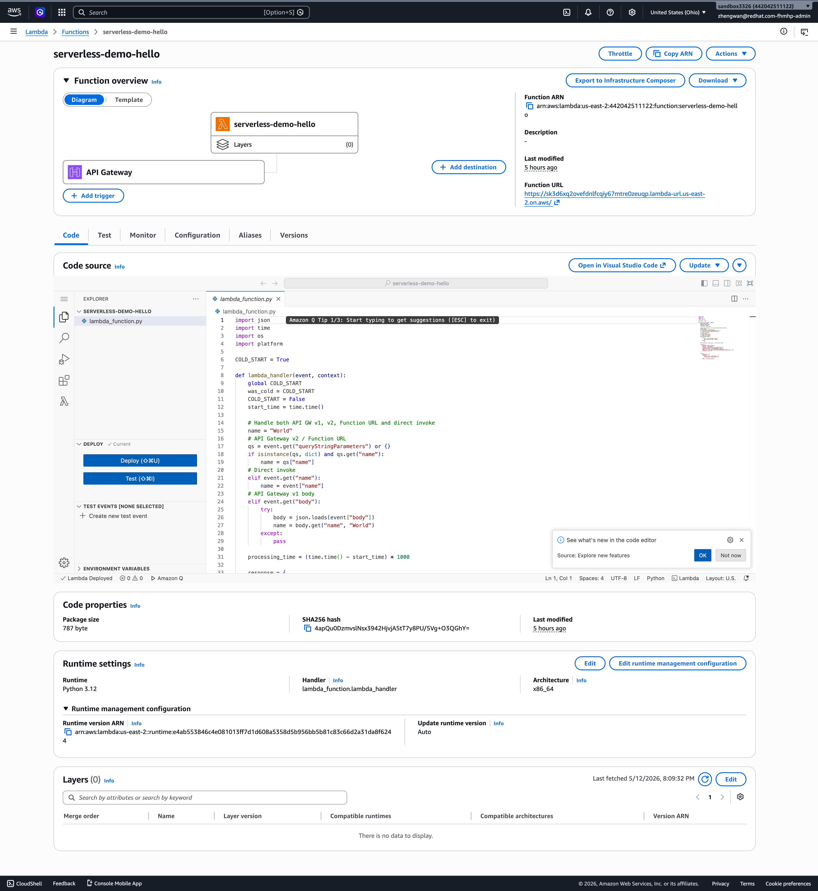
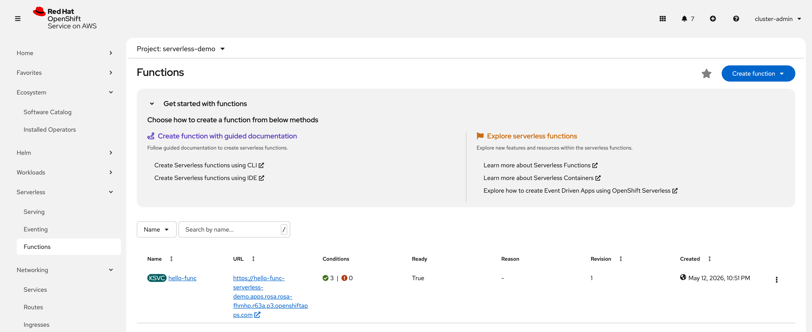
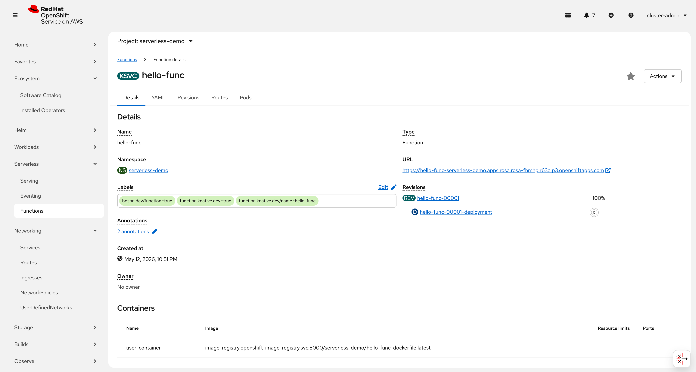
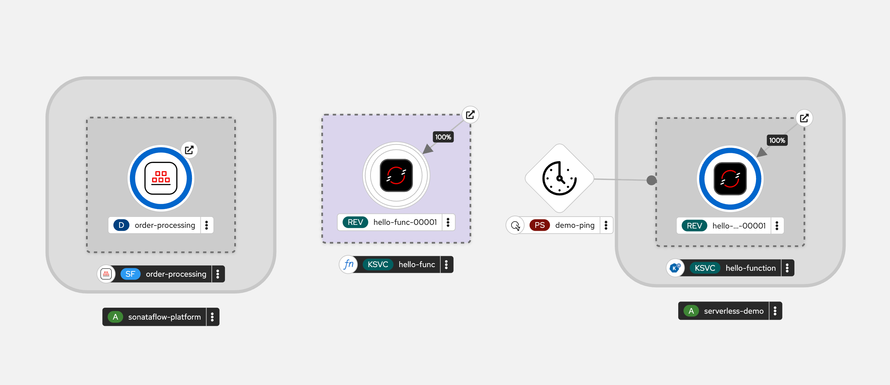
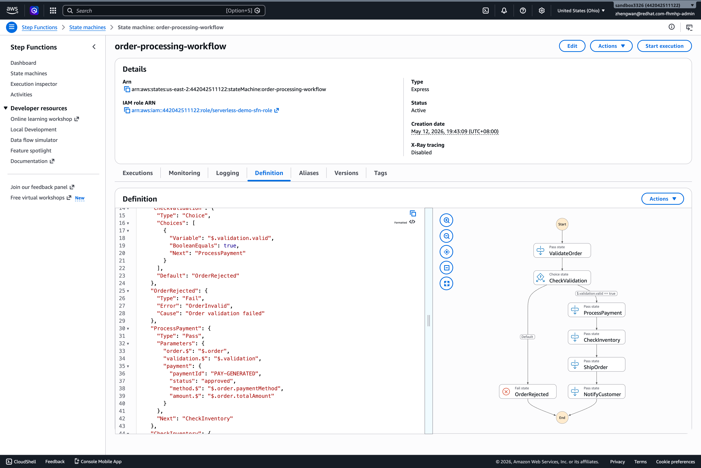

# OpenShift Serverless vs AWS Lambda — 端到端测试步骤记录

> 测试日期: 2026-05-12
>
> 测试环境: ROSA HCP 4.20.21 (us-east-2) + AWS Lambda (us-east-2)
>
> 测试人员: Red Hat Adoption Team

[](https://youtu.be/HgEDN27g5CM)

[](https://youtu.be/Mc1U2CKeIJA)

---

## 环境信息

| 组件 | 详细信息 |
|------|---------|
| ROSA 集群 | `rosa-fhmhp`, Hosted CP, OCP 4.20.21, K8s v1.33.10 |
| Worker 节点 | 2x m6a.xlarge, us-east-2a |
| Bastion | bastion.fhmhp.sandbox3326.opentlc.com |
| AWS Region | us-east-2 (Ohio) |
| Serverless Operator | v1.37.1 (Knative 1.17) |
| Serverless Logic Operator | v1.37.2 (GA, stable channel) |
| AWS Lambda Runtime | Python 3.12.13 |

---

## Phase 1: 环境探测

### 1.1 登录 Bastion 并连接 ROSA 集群

```bash
ssh rosa@bastion.fhmhp.sandbox3326.opentlc.com

oc login https://api.rosa-fhmhp.r63a.p3.openshiftapps.com:443 \
  -u cluster-admin -p 'PYJYG-BpVI7-MrWyQ-HFnhn' \
  --insecure-skip-tls-verify
```

### 1.2 检查集群状态

```bash
$ oc version
Client Version: 4.20.21
Kustomize Version: v5.6.0
Server Version: 4.20.21
Kubernetes Version: v1.33.10

$ oc get nodes -o wide
NAME                                       STATUS   ROLES    AGE   VERSION    INTERNAL-IP   EXTERNAL-IP   OS-IMAGE
ip-10-0-0-172.us-east-2.compute.internal   Ready    worker   8m    v1.33.10   10.0.0.172    <none>        RHCOS 9.6
ip-10-0-0-242.us-east-2.compute.internal   Ready    worker   8m    v1.33.10   10.0.0.242    <none>        RHCOS 9.6
```

### 1.3 检查 AWS CLI 和 ROSA CLI

```bash
$ aws --version
aws-cli/2.34.45 Python/3.14.4 Linux/5.14.0-611.24.1.el9_7.x86_64

$ rosa version
1.2.53

$ aws sts get-caller-identity
{
    "UserId": "AIDAWN26JN4JL2QRLCRLZ",
    "Account": "442042511122",
    "Arn": "arn:aws:iam::442042511122:user/zhengwan@redhat.com-fhmhp"
}

$ rosa list clusters
ID                                NAME        STATE  TOPOLOGY
2q87ra9pah65o18jasjtqfpn6ogrsl8a  rosa-fhmhp  ready  Hosted CP

$ rosa list machinepools --cluster=rosa-fhmhp
ID       AUTOSCALING  REPLICAS  INSTANCE TYPE  LABELS  TAINTS  AVAILABILITY ZONE  DISK SIZE  VERSION  AUTOREPAIR
workers  No           2/2       m6a.xlarge                      us-east-2a         300 GiB    4.20.21  Yes
```

---

## Phase 2: AWS Lambda Demo



### 2.1 创建 Lambda 函数代码

```bash
mkdir -p /tmp/lambda-demo
cat > /tmp/lambda-demo/lambda_function.py << 'EOF'
import json
import time
import os
import platform

COLD_START = True

def lambda_handler(event, context):
    global COLD_START
    was_cold = COLD_START
    COLD_START = False
    start_time = time.time()
    
    # Handle both API GW v1, v2, Function URL and direct invoke
    name = "World"
    qs = event.get("queryStringParameters") or {}
    if isinstance(qs, dict) and qs.get("name"):
        name = qs["name"]
    elif event.get("name"):
        name = event["name"]
    elif event.get("body"):
        try:
            body = json.loads(event["body"])
            name = body.get("name", "World")
        except:
            pass
    
    processing_time = (time.time() - start_time) * 1000
    
    response = {
        "message": f"Hello, {name}!",
        "platform": "AWS Lambda",
        "runtime": f"Python {platform.python_version()}",
        "processing_time_ms": round(processing_time, 2),
        "region": os.environ.get("AWS_REGION", "unknown"),
        "memory_mb": int(os.environ.get("AWS_LAMBDA_FUNCTION_MEMORY_SIZE", "0")),
        "cold_start": was_cold
    }
    
    return {
        "statusCode": 200,
        "headers": {
            "Content-Type": "application/json",
            "Access-Control-Allow-Origin": "*"
        },
        "body": json.dumps(response)
    }
EOF
```

### 2.2 打包 Lambda 函数

```bash
$ cd /tmp/lambda-demo && python3 -c "
import zipfile
with zipfile.ZipFile('function.zip', 'w', zipfile.ZIP_DEFLATED) as zf:
    zf.write('lambda_function.py')
print('ZIP created successfully')
"
ZIP created successfully

$ ls -la function.zip
-rw-r--r--. 1 rosa users 656 May 12 07:03 function.zip
```

### 2.3 创建 IAM Role

```bash
# 创建信任策略
cat > /tmp/lambda-demo/trust-policy.json << 'EOF'
{
  "Version": "2012-10-17",
  "Statement": [
    {
      "Effect": "Allow",
      "Principal": {
        "Service": "lambda.amazonaws.com"
      },
      "Action": "sts:AssumeRole"
    }
  ]
}
EOF

# 创建 IAM Role
$ aws iam create-role \
  --role-name serverless-demo-lambda-role \
  --assume-role-policy-document file:///tmp/lambda-demo/trust-policy.json \
  --region us-east-2
{
    "Role": {
        "RoleName": "serverless-demo-lambda-role",
        "Arn": "arn:aws:iam::442042511122:role/serverless-demo-lambda-role",
        ...
    }
}

# 附加基本执行策略
$ aws iam attach-role-policy \
  --role-name serverless-demo-lambda-role \
  --policy-arn arn:aws:iam::aws:policy/service-role/AWSLambdaBasicExecutionRole

# 等待 IAM 传播
sleep 10
```

### 2.4 部署 Lambda 函数

```bash
$ ROLE_ARN=$(aws iam get-role --role-name serverless-demo-lambda-role \
  --query "Role.Arn" --output text)

$ aws lambda create-function \
  --function-name serverless-demo-hello \
  --runtime python3.12 \
  --handler lambda_function.lambda_handler \
  --role "$ROLE_ARN" \
  --zip-file fileb:///tmp/lambda-demo/function.zip \
  --timeout 30 \
  --memory-size 128 \
  --region us-east-2
{
    "FunctionName": "serverless-demo-hello",
    "FunctionArn": "arn:aws:lambda:us-east-2:442042511122:function:serverless-demo-hello",
    "Runtime": "python3.12",
    "State": "Pending",
    ...
}

# 等待函数激活
$ aws lambda wait function-active-v2 --function-name serverless-demo-hello --region us-east-2

$ aws lambda get-function --function-name serverless-demo-hello --region us-east-2 \
  --query "Configuration.{FunctionName:FunctionName,Runtime:Runtime,State:State,MemorySize:MemorySize}"
{
    "FunctionName": "serverless-demo-hello",
    "Runtime": "python3.12",
    "State": "Active",
    "MemorySize": 128
}
```

### 2.5 创建 API Gateway (HTTP API v2)

```bash
# 创建 HTTP API
$ API_ID=$(aws apigatewayv2 create-api \
  --name serverless-demo-api \
  --protocol-type HTTP \
  --region us-east-2 \
  --query "ApiId" --output text)
echo "API ID: $API_ID"
API ID: 242x559kc2

# 添加 Lambda 调用权限
$ ACCOUNT_ID=$(aws sts get-caller-identity --query Account --output text)
$ aws lambda add-permission \
  --function-name serverless-demo-hello \
  --statement-id apigateway-invoke \
  --action lambda:InvokeFunction \
  --principal apigateway.amazonaws.com \
  --source-arn "arn:aws:execute-api:us-east-2:${ACCOUNT_ID}:${API_ID}/*" \
  --region us-east-2

# 创建集成
$ LAMBDA_ARN=$(aws lambda get-function --function-name serverless-demo-hello \
  --region us-east-2 --query "Configuration.FunctionArn" --output text)
$ INTEGRATION_ID=$(aws apigatewayv2 create-integration \
  --api-id "$API_ID" \
  --integration-type AWS_PROXY \
  --integration-uri "$LAMBDA_ARN" \
  --payload-format-version "2.0" \
  --region us-east-2 \
  --query "IntegrationId" --output text)

# 创建路由
$ aws apigatewayv2 create-route \
  --api-id "$API_ID" \
  --route-key "GET /hello" \
  --target "integrations/$INTEGRATION_ID" \
  --region us-east-2
{
    "RouteKey": "GET /hello",
    "Target": "integrations/rgf5ket"
}

# 创建默认 stage 并启用自动部署
$ aws apigatewayv2 create-stage \
  --api-id "$API_ID" \
  --stage-name '$default' \
  --auto-deploy \
  --region us-east-2

# 获取调用 URL
$ API_URL=$(aws apigatewayv2 get-api --api-id "$API_ID" --region us-east-2 \
  --query "ApiEndpoint" --output text)
echo "Lambda API URL: ${API_URL}/hello"
Lambda API URL: https://242x559kc2.execute-api.us-east-2.amazonaws.com/hello
```

### 2.6 测试 Lambda

```bash
# 冷启动测试 (更新 env 强制冷启动)
$ aws lambda update-function-configuration \
  --function-name serverless-demo-hello \
  --environment "Variables={FORCE_COLD=$(date +%s)}" \
  --region us-east-2 | jq "{FunctionName, LastModified}"
{
  "FunctionName": "serverless-demo-hello",
  "LastModified": "2026-05-12T07:11:33.000+0000"
}

$ sleep 5

# 冷启动
$ time curl -s "https://242x559kc2.execute-api.us-east-2.amazonaws.com/hello?name=ColdTest"
{"message": "Hello, ColdTest!", "platform": "AWS Lambda", "runtime": "Python 3.12.13",
 "processing_time_ms": 0.0, "region": "us-east-2", "memory_mb": 128, "cold_start": true}
real    0m0.292s

# 热请求
$ time curl -s "https://242x559kc2.execute-api.us-east-2.amazonaws.com/hello?name=WarmTest"
{"message": "Hello, WarmTest!", "platform": "AWS Lambda", "runtime": "Python 3.12.13",
 "processing_time_ms": 0.0, "region": "us-east-2", "memory_mb": 128, "cold_start": false}
real    0m0.055s

$ time curl -s "https://242x559kc2.execute-api.us-east-2.amazonaws.com/hello?name=WarmTest"
{"message": "Hello, WarmTest!", ...}
real    0m0.044s
```

**Lambda 测试结果:**
| 指标 | 数值 |
|------|------|
| 冷启动延迟 | ~292ms |
| 热请求延迟 | ~44-55ms |
| 函数内处理时间 | 0.0ms |

### 2.7 创建 Lambda 所需步骤统计

创建一个简单的 Lambda 函数并暴露 HTTP 端点，需要：
1. 编写函数代码 + 打包
2. 创建 IAM Trust Policy JSON
3. 创建 IAM Role (`aws iam create-role`)
4. 附加策略 (`aws iam attach-role-policy`)
5. 创建 Lambda 函数 (`aws lambda create-function`)
6. 等待激活 (`aws lambda wait`)
7. 创建 API Gateway (`aws apigatewayv2 create-api`)
8. 添加权限 (`aws lambda add-permission`)
9. 创建集成 (`aws apigatewayv2 create-integration`)
10. 创建路由 (`aws apigatewayv2 create-route`)
11. 创建 stage (`aws apigatewayv2 create-stage`)

**共 11 个 AWS CLI 命令，涉及 3 个 AWS 服务 (IAM, Lambda, API Gateway)**

---

## Phase 3: OpenShift Serverless Demo (on ROSA)

### 3.1 安装 OpenShift Serverless Operator

```bash
# 创建 namespace 和 Subscription
cat <<EOF | oc apply -f -
apiVersion: v1
kind: Namespace
metadata:
  name: openshift-serverless
---
apiVersion: operators.coreos.com/v1
kind: OperatorGroup
metadata:
  name: serverless-operators
  namespace: openshift-serverless
spec: {}
---
apiVersion: operators.coreos.com/v1alpha1
kind: Subscription
metadata:
  name: serverless-operator
  namespace: openshift-serverless
spec:
  channel: stable
  installPlanApproval: Automatic
  name: serverless-operator
  source: redhat-operators
  sourceNamespace: openshift-marketplace
EOF
namespace/openshift-serverless created
operatorgroup.operators.coreos.com/serverless-operators created
subscription.operators.coreos.com/serverless-operator created

# 等待 Operator 安装完成 (~60s)
$ oc get csv -n openshift-serverless
NAME                          DISPLAY                        VERSION   REPLACES                      PHASE
serverless-operator.v1.37.1   Red Hat OpenShift Serverless   1.37.1    serverless-operator.v1.37.0   Succeeded
```

### 3.2 安装 Knative Serving

```bash
cat <<EOF | oc apply -f -
apiVersion: operator.knative.dev/v1beta1
kind: KnativeServing
metadata:
  name: knative-serving
  namespace: knative-serving
spec:
  ingress:
    kourier:
      enabled: true
  config:
    network:
      ingress-class: kourier.ingress.networking.knative.dev
    autoscaler:
      enable-scale-to-zero: "true"
      scale-to-zero-grace-period: "30s"
      stable-window: "60s"
    defaults:
      revision-timeout-seconds: "300"
EOF
knativeserving.operator.knative.dev/knative-serving created

# 等待就绪 (~50s)
$ oc get knativeserving knative-serving -n knative-serving
NAME              VERSION   READY   REASON
knative-serving   1.17      True

$ oc get pods -n knative-serving
NAME                                      READY   STATUS    AGE
activator-76c876897-74jlb                 2/2     Running   38s
activator-76c876897-tf9wr                 2/2     Running   24s
autoscaler-5cf6d5d889-nrf8w               2/2     Running   38s
autoscaler-5cf6d5d889-sx4jv               2/2     Running   38s
autoscaler-hpa-58d465c985-dvt98           2/2     Running   37s
autoscaler-hpa-58d465c985-w7w2w           2/2     Running   37s
controller-656bffbb85-kqbnk               2/2     Running   33s
controller-656bffbb85-rs4p6               2/2     Running   16s
webhook-5fd78f67b4-qs5fk                  2/2     Running   23s
webhook-5fd78f67b4-wnpgs                  2/2     Running   37s

$ oc get pods -n knative-serving-ingress
NAME                                      READY   STATUS    AGE
3scale-kourier-gateway-7cf56975cd-qg6zp   1/1     Running   93s
3scale-kourier-gateway-7cf56975cd-x766t   1/1     Running   78s
net-kourier-controller-7bfd97bb65-7bkpl   1/1     Running   93s
net-kourier-controller-7bfd97bb65-9ktqj   1/1     Running   93s
```

### 3.3 安装 Knative Eventing

```bash
cat <<EOF | oc apply -f -
apiVersion: operator.knative.dev/v1beta1
kind: KnativeEventing
metadata:
  name: knative-eventing
  namespace: knative-eventing
spec:
  config:
    default-ch-webhook:
      default-ch-config: |
        clusterDefault:
          apiVersion: messaging.knative.dev/v1
          kind: InMemoryChannel
EOF
knativeeventing.operator.knative.dev/knative-eventing created

# 等待就绪 (~90s)
$ oc get knativeeventing -n knative-eventing
NAME               VERSION   READY   REASON
knative-eventing   1.17      True
```

### 3.4 部署 Knative Service

```bash
# 创建项目
$ oc new-project serverless-demo

# 部署 Knative Service
cat <<EOF | oc apply -f -
apiVersion: serving.knative.dev/v1
kind: Service
metadata:
  name: hello-function
  namespace: serverless-demo
  labels:
    app.kubernetes.io/part-of: serverless-demo
spec:
  template:
    metadata:
      annotations:
        autoscaling.knative.dev/min-scale: "0"
        autoscaling.knative.dev/max-scale: "10"
        autoscaling.knative.dev/target: "50"
        autoscaling.knative.dev/scale-down-delay: "15s"
    spec:
      containerConcurrency: 50
      timeoutSeconds: 300
      containers:
        - image: quay.io/rhdevelopers/knative-tutorial-greeter:quarkus
          ports:
            - containerPort: 8080
          resources:
            requests:
              cpu: 100m
              memory: 128Mi
            limits:
              cpu: 500m
              memory: 256Mi
          readinessProbe:
            httpGet:
              path: /
            initialDelaySeconds: 0
EOF
service.serving.knative.dev/hello-function created

# 等待就绪 (~10s)
$ oc get ksvc -n serverless-demo
NAME             URL                                                                                     LATESTCREATED          LATESTREADY            READY
hello-function   https://hello-function-serverless-demo.apps.rosa.rosa-fhmhp.r63a.p3.openshiftapps.com   hello-function-00001   hello-function-00001   True
```

### 3.5 测试 Knative Service — 热请求

```bash
$ KSVC_URL="https://hello-function-serverless-demo.apps.rosa.rosa-fhmhp.r63a.p3.openshiftapps.com"

$ time curl -sk "$KSVC_URL"
Hi  greeter => '9861675f8845' : 5
real    0m0.030s

$ time curl -sk "$KSVC_URL"
Hi  greeter => '9861675f8845' : 6
real    0m0.029s

$ time curl -sk "$KSVC_URL"
Hi  greeter => '9861675f8845' : 7
real    0m0.030s
```

### 3.6 验证 Scale-to-Zero

```bash
# 当前有 pod 运行
$ oc get pods -n serverless-demo
NAME                                               READY   STATUS    AGE
hello-function-00001-deployment-58cb956d9d-klt9d   2/2     Running   34s

# 等待 120 秒 (30s grace + 60s stable window + buffer)
$ sleep 120

# Pod 已经被移除 - Scale-to-Zero 成功!
$ oc get pods -n serverless-demo
No resources found in serverless-demo namespace.

$ oc get revisions -n serverless-demo
NAME                   CONFIG NAME      GENERATION   READY   ACTUAL REPLICAS   DESIRED REPLICAS
hello-function-00001   hello-function   1            True    0                 0
```

**✅ Scale-to-Zero 验证成功：ACTUAL REPLICAS = 0, DESIRED REPLICAS = 0**

### 3.7 测试冷启动 (Scale-from-Zero)

```bash
# Pod 已经 scale 到 0，现在发送请求触发冷启动
$ time curl -sk "$KSVC_URL"
Hi  greeter => '9861675f8845' : 3
real    0m1.668s    ← 冷启动，需要拉起新 pod

$ time curl -sk "$KSVC_URL"
Hi  greeter => '9861675f8845' : 4
real    0m0.030s    ← 热请求，pod 已就绪

$ time curl -sk "$KSVC_URL"
Hi  greeter => '9861675f8845' : 5
real    0m0.028s    ← 热请求

# 确认新 pod 已创建
$ oc get pods -n serverless-demo
NAME                                               READY   STATUS    AGE
hello-function-00001-deployment-58cb956d9d-c5v9b   2/2     Running   2s
```

### 3.8 创建 Knative Service 所需步骤统计

部署一个 Knative Service 并暴露 HTTP 端点，需要：
1. 编写容器应用代码
2. 构建容器镜像 (Dockerfile + build)
3. `oc apply` 一个 Knative Service YAML

**核心操作仅需 1 个 `oc apply` 命令，涉及 1 个 API (Knative Serving)**
路由自动生成，TLS 自动配置。

### 3.9 Knative Functions (kn func) — 真正的 Lambda 等价开发体验

> Phase 3.4-3.7 使用了一个**预构建的容器镜像**直接部署为 Knative Service，开发者需要自己编写 Dockerfile、构建镜像。
>
> 但 AWS Lambda 的开发体验是 **"只写函数代码，不关心容器"**。`kn func` 提供了完全等价的体验：
>
> **只写函数代码 → 自动构建镜像 (S2I) → 自动部署为 Knative Service**，无需 Dockerfile。







#### 3.9.1 安装 kn CLI

```bash
# 下载 kn CLI (OpenShift Serverless 1.37 配套版本)
$ curl -sL https://mirror.openshift.com/pub/openshift-v4/clients/serverless/1.17.0/kn-linux-amd64.tar.gz \
  | tar xz -C /tmp/

$ /tmp/kn version
Version:      v1.17.0
Build Date:   2025-04-22 16:39:02
Git Revision: 3c8e469c
Supported APIs:
* Serving
  - serving.knative.dev/v1 (knative-serving v1.17.0)
* Eventing
  - sources.knative.dev/v1 (knative-eventing v1.17.0)
  - eventing.knative.dev/v1 (knative-eventing v1.17.0)
```

#### 3.9.2 创建函数项目

```bash
$ cd /tmp
$ /tmp/kn func create -l python hello-func
Created python function in /tmp/hello-func

$ ls -la /tmp/hello-func/
total 16
drwxr-xr-x. 3 rosa users  114 May 12 12:33 .
drwxrwxrwt. 1 root root   4096 May 12 12:33 ..
-rw-r--r--. 1 rosa users  217 May 12 12:33 .funcignore
-rw-r--r--. 1 rosa users  370 May 12 12:33 func.yaml
drwxr-xr-x. 2 rosa users   46 May 12 12:33 function
-rw-r--r--. 1 rosa users   30 May 12 12:33 requirements.txt

$ cat /tmp/hello-func/func.yaml
specVersion: 0.36.0
name: hello-func
runtime: python
registry: ""
image: ""
created: 2026-05-12T12:33:00.000000+00:00
build:
  builder: s2i
  buildpacks: []
  pvcSize: 256Mi
run:
  volumes: []
  envs: []
deploy:
  namespace: ""
  remote: false
  annotations: {}
  labels: []
  options: {}
```

> **关键点**: `kn func create` 自动生成了完整的函数项目骨架，包括：
>
> - `func.yaml` — 函数元数据（运行时、构建方式等）
>
> - `function/` — 函数代码目录
>
> - `requirements.txt` — Python 依赖
>
> - **没有 Dockerfile** — 使用 S2I (Source-to-Image) 自动构建

#### 3.9.3 编写函数代码

```bash
# 编写自定义函数（ASGI 协议，与 Lambda handler 等价）
cat > /tmp/hello-func/function/func.py << 'PYEOF'
import json, logging, os, time

COLD_START = True

def new():
    return Function()

class Function:
    async def handle(self, scope, receive, send):
        global COLD_START
        was_cold = COLD_START
        COLD_START = False
        start = time.time()

        body = b""
        while True:
            msg = await receive()
            body += msg.get("body", b"")
            if not msg.get("more_body"):
                break

        name = "World"
        qs = scope.get("query_string", b"").decode()
        for param in qs.split("&"):
            if param.startswith("name="):
                name = param.split("=", 1)[1]
                break

        if body:
            try:
                data = json.loads(body)
                name = data.get("name", name)
            except:
                pass

        elapsed = (time.time() - start) * 1000
        resp = json.dumps({
            "message": f"Hello, {name}!",
            "platform": "OpenShift Serverless Function (kn func)",
            "cold_start": was_cold,
            "processing_time_ms": round(elapsed, 2),
            "pod_name": os.environ.get("HOSTNAME", "unknown")
        })

        await send({
            "type": "http.response.start",
            "status": 200,
            "headers": [[b"content-type", b"application/json"]]
        })
        await send({
            "type": "http.response.body",
            "body": resp.encode()
        })

    def alive(self):
        return True, "Alive"

    def ready(self):
        return True, "Ready"
PYEOF
```

> **对比 Lambda handler**: 函数签名不同（ASGI vs Lambda event/context），但核心逻辑一样。
>
> 迁移工作量：只需将 `lambda_handler(event, context)` 改为 ASGI 的 `handle(scope, receive, send)`，
>
> 业务逻辑代码可以直接复用。

#### 3.9.4 暴露 OpenShift 内部镜像仓库

```bash
# 暴露内部 registry（用于推送 kn func 构建的镜像）
$ oc patch configs.imageregistry.operator.openshift.io/cluster --type merge \
  -p '{"spec":{"defaultRoute":true}}'
config.imageregistry.operator.openshift.io/cluster patched

$ oc get route default-route -n openshift-image-registry -o jsonpath='{.spec.host}'
default-route-openshift-image-registry.apps.rosa.rosa-fhmhp.r63a.p3.openshiftapps.com
```

#### 3.9.5 构建函数镜像 (S2I — 无需 Dockerfile)

```bash
$ REGISTRY_HOST="default-route-openshift-image-registry.apps.rosa.rosa-fhmhp.r63a.p3.openshiftapps.com"

$ cd /tmp/hello-func

# kn func build — 使用 S2I 自动构建容器镜像，无需 Dockerfile！
$ /tmp/kn func build -r "$REGISTRY_HOST/serverless-demo" -v 2>&1 | tail -20
   ...
   Building function image
   🙌 Function built: default-route-openshift-image-registry.apps.rosa.rosa-fhmhp.r63a.p3.openshiftapps.com/serverless-demo/hello-func:latest

# 验证镜像已在本地
$ podman images | grep hello-func
default-route-openshift-image-registry.apps...   latest   3204023a119a   2 minutes ago   399 MB
```

> **核心价值**: `kn func build` 使用 **S2I (Source-to-Image)** 自动将 Python 代码打包为容器镜像，
>
> 开发者**完全不需要编写 Dockerfile**。这与 Lambda 的 "只关心代码" 体验完全一致。

#### 3.9.5b 构建函数镜像 — 方法二：Dockerfile (通用方法)

> 如果不想依赖 S2I，可以使用标准 Dockerfile + `podman build`。
>
> 函数运行时 `func-python` 是 **Knative 社区开源项目**（Apache-2.0 许可证），不依赖任何厂商。

```bash
# 创建 Dockerfile 构建项目
mkdir -p /tmp/hello-func-dockerfile/function

# 复用相同的函数代码（从 3.9.3 的 func.py）
cp /tmp/hello-func/function/func.py /tmp/hello-func-dockerfile/function/

# 创建 __init__.py（导出 new 函数）
cat > /tmp/hello-func-dockerfile/function/__init__.py << 'EOF'
from .func import new
EOF

# 创建启动脚本（与 S2I 内部生成的完全一样，开源组件）
cat > /tmp/hello-func-dockerfile/main.py << 'EOF'
import logging
from func_python.http import serve

logging.basicConfig(level=logging.INFO)

try:
    from function import new as handler
except ImportError:
    from function import handle as handler

if __name__ == "__main__":
    logging.info("Functions middleware invoking user function")
    serve(handler)
EOF

# requirements.txt — 只需要一个开源依赖
cat > /tmp/hello-func-dockerfile/requirements.txt << 'EOF'
func-python>=0.7.0
EOF

# Dockerfile — 标准容器构建，任何容器运行时都支持
cat > /tmp/hello-func-dockerfile/Dockerfile << 'EOF'
FROM registry.access.redhat.com/ubi9/python-312:latest

WORKDIR /opt/app-root/src

# 安装 func-python（Knative 开源 ASGI 运行时，Apache-2.0 许可证）
COPY requirements.txt .
RUN pip install --no-cache-dir -r requirements.txt

# 复制函数代码和入口脚本
COPY function/ ./function/
COPY main.py .

EXPOSE 8080

CMD ["python", "main.py"]
EOF
```

```bash
# 使用 podman build 构建（也可以用 docker build，完全通用）
$ cd /tmp/hello-func-dockerfile
$ podman build -t hello-func-dockerfile:latest .
STEP 1/8: FROM registry.access.redhat.com/ubi9/python-312:latest
STEP 2/8: WORKDIR /opt/app-root/src
STEP 3/8: COPY requirements.txt .
STEP 4/8: RUN pip install --no-cache-dir -r requirements.txt
Collecting func-python>=0.7.0
  Downloading func_python-0.8.1-py3-none-any.whl
Successfully installed cloudevents-2.0.0 func-python-0.8.1 hypercorn-0.17.3 ...
STEP 5/8: COPY function/ ./function/
STEP 6/8: COPY main.py .
STEP 7/8: EXPOSE 8080
STEP 8/8: CMD ["python", "main.py"]
COMMIT hello-func-dockerfile:latest
Successfully tagged localhost/hello-func-dockerfile:latest
```

> **关键依赖说明**:
>
> - `func-python` (v0.8.1) — Knative Functions Python Middleware，**Knative 社区开源** (Apache-2.0)
>
> - 内部使用 `hypercorn` (ASGI 服务器) + `cloudevents` (CNCF 标准事件格式)
>
> - **完全不依赖红帽专有技术**，可在任何 Kubernetes 集群上运行

**两种构建方式对比:**

| 维度 | 方法一：S2I (`kn func build`) | 方法二：Dockerfile (`podman build`) |
|------|------------------------------|-------------------------------------|
| **Dockerfile 需求** | ❌ 不需要 | ✅ 需要编写 |
| **启动脚本** | 自动生成 | 需手写 `main.py` (5 行) |
| **构建命令** | `kn func build` | `podman build` / `docker build` |
| **运行时依赖** | 自动安装 | `pip install func-python` |
| **基础镜像** | S2I builder 自动选择 | 自由选择 (UBI/Alpine/Debian) |
| **CI/CD 集成** | 需要 kn CLI | 标准容器构建流程 |
| **厂商依赖** | S2I (红帽生态) | 无 (纯 OCI 标准) |
| **最终镜像** | 相同的 ASGI 服务 | 相同的 ASGI 服务 |

#### 3.9.6 推送镜像到内部 Registry

```bash
# 登录内部 registry
$ TOKEN=$(oc whoami -t)
$ podman login "$REGISTRY_HOST" -u kubeadmin -p "$TOKEN" --tls-verify=false
Login Succeeded!

# 推送镜像
$ podman push "$REGISTRY_HOST/serverless-demo/hello-func:latest" --tls-verify=false
Getting image source signatures
Copying blob sha256:223381528c33...
Copying blob sha256:98ab0eb6689c...
Copying blob sha256:fa9f0cd7a271...
Copying blob sha256:3e9eecb86474...
Copying blob sha256:3844e4af00a8...
Copying config sha256:3204023a119a...
Writing manifest to image destination
```

#### 3.9.7 部署为 Knative Service

```bash
# 使用 kn service create 部署（使用集群内部 registry 地址）
$ /tmp/kn service create hello-func \
  --image image-registry.openshift-image-registry.svc:5000/serverless-demo/hello-func:latest \
  -n serverless-demo \
  --annotation autoscaling.knative.dev/min-scale=0 \
  --annotation autoscaling.knative.dev/max-scale=10
Creating service 'hello-func' in namespace 'serverless-demo':

  0.099s The Route is still working to reflect the latest desired specification.
  0.130s ...
  0.160s Configuration "hello-func" is waiting for a Revision to become ready.
 11.712s ...
 11.782s Ingress has not yet been reconciled.
 11.860s Waiting for load balancer to be ready
 12.036s Ready to serve.

Service 'hello-func' created to latest revision 'hello-func-00001' is available at URL:
https://hello-func-serverless-demo.apps.rosa.rosa-fhmhp.r63a.p3.openshiftapps.com

$ oc get ksvc hello-func -n serverless-demo
NAME         URL                                                                                 LATESTCREATED      LATESTREADY        READY
hello-func   https://hello-func-serverless-demo.apps.rosa.rosa-fhmhp.r63a.p3.openshiftapps.com   hello-func-00001   hello-func-00001   True
```

#### 3.9.8 测试 Knative Function

```bash
FUNC_URL="https://hello-func-serverless-demo.apps.rosa.rosa-fhmhp.r63a.p3.openshiftapps.com"

# GET 请求（带参数）
$ time curl -sk "$FUNC_URL?name=Demo"
{"message": "Hello, Demo!", "platform": "OpenShift Serverless Function (kn func)",
 "cold_start": true, "processing_time_ms": 0.01,
 "pod_name": "hello-func-00001-deployment-5c4c9b46c9-5s4mc"}
real    0m0.038s

# 热请求
$ time curl -sk "$FUNC_URL?name=OpenShift"
{"message": "Hello, OpenShift!", "platform": "OpenShift Serverless Function (kn func)",
 "cold_start": false, "processing_time_ms": 0.01,
 "pod_name": "hello-func-00001-deployment-5c4c9b46c9-5s4mc"}
real    0m0.031s

$ time curl -sk "$FUNC_URL?name=Serverless"
{"message": "Hello, Serverless!", "platform": "OpenShift Serverless Function (kn func)",
 "cold_start": false, "processing_time_ms": 0.01,
 "pod_name": "hello-func-00001-deployment-5c4c9b46c9-5s4mc"}
real    0m0.028s

# POST 请求（JSON body）
$ time curl -sk -X POST "$FUNC_URL" \
  -H "Content-Type: application/json" \
  -d '{"name":"KnativeFunction"}'
{"message": "Hello, KnativeFunction!", "platform": "OpenShift Serverless Function (kn func)",
 "cold_start": false, "processing_time_ms": 0.03,
 "pod_name": "hello-func-00001-deployment-5c4c9b46c9-5s4mc"}
real    0m0.030s
```

#### 3.9.9 kn func 开发体验 vs Lambda 对比

| 步骤 | AWS Lambda | kn func (Knative Functions) |
|------|-----------|---------------------------|
| **脚手架** | `sam init` / 手动创建 | `kn func create -l python` |
| **写代码** | `lambda_handler(event, context)` | `Function.handle(scope, receive, send)` |
| **构建** | `sam build` / zip 打包 | `kn func build` (S2I, 无需 Dockerfile) |
| **部署** | `sam deploy` + IAM + API GW | `kn service create --image ...` |
| **测试 URL** | API Gateway endpoint | Knative Route (自动 HTTPS) |
| **Dockerfile 需求** | ❌ 不需要 | ❌ 不需要 (S2I 自动构建) |
| **SDK 依赖** | AWS SDK, boto3 | 无 (标准 HTTP/ASGI) |
| **支持语言** | Python/Node/Go/Java/... | Python/Node/Go/Quarkus/Rust/TypeScript |
| **热请求延迟** | ~44-55ms | ~28-31ms |
| **多云** | ❌ 仅 AWS | ✅ 任何 OCP 集群 |

> **结论**: `kn func` 提供了与 Lambda 完全等价的 "只写代码，不关心容器" 开发体验，
>
> 同时保持了 Knative 的多云可移植性和无厂商锁定优势。

#### 3.9.10 在 Web Console 中显示为 Function

> **问题**: 使用 `kn service create` 手动部署的 Knative Service，在 OpenShift Web Console 的 **Serverless → Functions** 视图中**不会显示**。
>
> **原因**: Web Console 依赖特定的 label (`function.knative.dev=true`, `boson.dev/function=true`) 来识别哪些 Knative Service 是 "Function"。`kn service create` 只创建普通的 Knative Service，不会自动添加这些 label。

**方法一：手动添加 label（推荐用于理解原理）**

```bash
# 给现有的 Knative Service 添加 function 标识 label
$ oc label ksvc hello-func \
  function.knative.dev=true \
  function.knative.dev/name=hello-func \
  boson.dev/function=true \
  -n serverless-demo
service.serving.knative.dev/hello-func labeled

# 验证 label 已添加
$ oc get ksvc hello-func -n serverless-demo -o jsonpath='{.metadata.labels}' | jq .
{
  "boson.dev/function": "true",
  "function.knative.dev": "true",
  "function.knative.dev/name": "hello-func"
}
# ✅ 刷新 Web Console → Serverless → Functions，即可看到 hello-func
```

**方法二：使用 `kn func deploy` 一步部署（自动添加 label）**

> `kn func deploy` 会自动完成 构建 + 推送 + 部署 + 添加 function label，是最简便的方式。
>
> 但需要在函数项目目录中执行，且 `func.yaml` 配置正确。

```bash
# 确保 func.yaml 中的 registry 和 namespace 配置正确
$ cd /tmp/hello-func
$ cat func.yaml
# ...
# registry: default-route-openshift-image-registry.apps.rosa.rosa-fhmhp.r63a.p3.openshiftapps.com/serverless-demo
# deploy:
#   namespace: serverless-demo

# 一步完成：构建 + 推送 + 部署 + 自动添加 function label
$ /tmp/kn func deploy -r "$REGISTRY_HOST/serverless-demo" -n serverless-demo
# 等价于: kn func build + podman push + kn service create + 自动添加 function labels

# 部署完成后，Web Console → Serverless → Functions 中自动可见
```

> **总结**: 
>
> - 手动部署 (`kn service create`) 需要额外 `oc label` 才能在 Web Console Functions 视图中显示
>
> - 使用 `kn func deploy` 会自动处理所有步骤，包括添加 function label
>
> - 两者功能完全相同，label 只影响 Web Console 的展示分类，不影响运行时行为

---

### 3.10 创建 PingSource (替代 CloudWatch Events / EventBridge 定时触发)

```bash
cat <<EOF | oc apply -f -
apiVersion: sources.knative.dev/v1
kind: PingSource
metadata:
  name: demo-ping
  namespace: serverless-demo
spec:
  schedule: "*/1 * * * *"
  contentType: "application/json"
  data: '{"action": "scheduled-check", "source": "knative-pingsource"}'
  sink:
    ref:
      apiVersion: serving.knative.dev/v1
      kind: Service
      name: hello-function
EOF
pingsource.sources.knative.dev/demo-ping created

$ oc get pingsource -n serverless-demo
NAME        SINK                                        SCHEDULE      AGE
demo-ping   http://hello-function.serverless-demo.svc   */1 * * * *   5s
```

### 3.11 Knative Eventing 事件投递机制详解 — 为什么不需要 Kafka？

> **用户提问**: 我们配置了 Knative Eventing 但没有安装 Kafka，事件是怎么投递给服务端的？

#### 3.11.1 当前 Demo 使用的投递模式：Direct Sink（直接投递）

从上面 3.10 的 `oc get pingsource` 输出可以看到关键信息：

```
SINK
http://hello-function.serverless-demo.svc
```

**这说明 PingSource 使用的是 Direct Sink（直接投递）模式**：

```
┌─────────────┐    HTTP POST (CloudEvent)    ┌─────────────────────┐
│ PingSource  │ ────────────────────────────▶ │ Knative Service     │
│ (cron 触发) │   直接发送到集群内部 URL      │ hello-function      │
│             │   无中间件、无 Broker         │ .serverless-demo    │
│             │   无 Channel、无 Kafka        │ .svc.cluster.local  │
└─────────────┘                               └─────────────────────┘
```

PingSource 的 `spec.sink` 直接指向 Knative Service，每次 cron 触发时：
1. PingSource Controller 生成一个 CloudEvent
2. 直接 HTTP POST 到 `http://hello-function.serverless-demo.svc`（K8s 内部 DNS）
3. Knative Service 收到请求，如果 pod 为 0 则自动 scale-from-zero
4. **整个链路没有任何消息中间件参与**

#### 3.11.2 验证事件投递路径

```bash
# 查看 PingSource 的详细信息 — 确认 sink 是直接 HTTP URL
$ oc get pingsource demo-ping -n serverless-demo -o jsonpath='{.status.sinkUri}'
http://hello-function.serverless-demo.svc.cluster.local

# 查看 PingSource adapter pod（负责按 cron 发送 HTTP POST 的组件）
$ oc get pods -n knative-eventing -l eventing.knative.dev/sourceName=demo-ping
NAME                                   READY   STATUS    AGE
pingsource-demo-ping-...               1/1     Running   ...

# 确认当前没有 Broker、没有 Channel
$ oc get broker -n serverless-demo 2>&1
No resources found in serverless-demo namespace.

$ oc get channel -n serverless-demo 2>&1
No resources found in serverless-demo namespace.

$ oc get inmemorychannel -n serverless-demo 2>&1
No resources found in serverless-demo namespace.
```

> **结论**: 当前 Demo 中 **没有 Broker、没有 Channel、没有 Kafka**。
>
> PingSource 通过 Direct Sink 模式直接 HTTP POST 到 Knative Service 的内部 URL。

#### 3.11.3 Knative Eventing 三种事件投递模式

| 模式 | 中间件 | 适用场景 | 当前 Demo |
|------|--------|---------|-----------|
| **1. Direct Sink** | 无 | 1 个事件源 → 1 个服务，简单点对点 | ✅ 使用中 |
| **2. Channel + Subscription** | InMemoryChannel 或 KafkaChannel | 1 个事件源 → 多个服务（扇出），需要按顺序投递 | ❌ 未使用 |
| **3. Broker + Trigger** | InMemoryChannel (默认) 或 KafkaChannel | 多个事件源 → 多个服务，按属性过滤路由 | ❌ 未使用 |

**模式一：Direct Sink（当前使用）**
```
PingSource ──HTTP POST──▶ Knative Service
```

**模式二：Channel + Subscription**
```
PingSource ──▶ Channel ──Subscription──▶ Service A
                        ──Subscription──▶ Service B
```

**模式三：Broker + Trigger**
```
PingSource ──▶ Broker ──Trigger(type=ping)──▶ Service A
KafkaSource ──▶       ──Trigger(type=order)──▶ Service B
ApiServerSrc──▶       ──Trigger(type=k8s)──▶   Service C
```

#### 3.11.4 InMemoryChannel vs KafkaChannel

> 我们在 3.3 安装 Knative Eventing 时配置了 `InMemoryChannel` 作为默认 Channel，但它**只有在使用 Broker 或 Channel 模式时才会被用到**。当前 Direct Sink 模式完全不涉及 Channel。

| 维度 | InMemoryChannel | KafkaChannel |
|------|----------------|-------------|
| **持久化** | ❌ 内存中，pod 重启丢失 | ✅ Kafka 持久化，不丢消息 |
| **扇出能力** | ✅ 基本扇出 | ✅ 高性能扇出 |
| **吞吐量** | 中等 | 高（Kafka 原生性能） |
| **顺序保证** | ✅ 单 Channel 有序 | ✅ 分区内有序 |
| **重试/死信** | ✅ 支持 | ✅ 支持 |
| **适用环境** | 开发/测试/低吞吐生产 | 高吞吐生产环境 |
| **额外依赖** | 无（Knative Eventing 内建） | 需要 AMQ Streams (Kafka) |

#### 3.11.5 什么时候需要 Kafka？

**当前 Demo 不需要 Kafka 的原因：**
- PingSource → 1 个 Service，简单点对点，Direct Sink 足够
- 没有消息持久化需求
- 没有多消费者扇出需求

**生产环境建议引入 KafkaChannel/KafkaSource 的场景：**

| 场景 | 为什么需要 Kafka |
|------|-----------------|
| 订单消息 → 多个下游微服务 | 需要扇出 + 持久化，不能丢消息 |
| 高吞吐事件流（>1000 msg/s） | InMemoryChannel 内存压力大，Kafka 更合适 |
| 跨集群事件传播 | KafkaSource 可消费外部 Kafka 集群的 topic |
| 事件重放需求 | 只有 Kafka 支持消费位移回溯 |
| 合规/审计要求 | 需要消息持久化和可追溯性 |

> **总结**: Knative Eventing 的事件投递是分层设计的 ——
>
> **简单场景用 Direct Sink（零中间件）**，**复杂场景按需引入 Channel/Broker + Kafka**。
>
> 不需要 Kafka 也能完整工作，这正是 Knative 设计的灵活性所在。

---

## Phase 4: 对比测试结果

### 4.1 性能对比

| 指标 | AWS Lambda | Knative on ROSA | 说明 |
|------|-----------|-----------------|------|
| **冷启动延迟** | ~292ms | ~1.67s | Lambda 冷启动更快 (无需拉起 pod) |
| **热请求延迟** | ~44-55ms | ~28-30ms | Knative 热请求更快 (集群内网络) |
| **Scale-to-Zero** | 自动 (~15min) | 自动 (~90s，可配置) | Knative 缩零更快 |
| **Scale-from-Zero** | 透明 | ~1.5s (含 pod 启动) | Lambda 更透明 |

### 4.2 运维复杂度对比

| 维度 | AWS Lambda | Knative on ROSA |
|------|-----------|-----------------|
| **部署一个函数** | 11 个 AWS CLI 命令, 3 个 AWS 服务 | 1 个 `oc apply`, 1 个 YAML |
| **CI/CD 流程** | 每个云需要单独的管道 | 一个管道适配所有 OCP 集群 |
| **多云支持** | AWS 独占 | 任何 OCP 集群 (ROSA/ARO/OCP) |
| **SDK 依赖** | AWS SDK, SAM/CDK | 标准 HTTP 容器, 无 vendor SDK |
| **触发器配置** | CloudWatch/SQS/S3 各自配置 | Knative Eventing 统一模型 |

### 4.3 成本对比 (估算)

| 场景 | AWS Lambda | Knative on ROSA (Spot) |
|------|-----------|----------------------|
| 50 个函数，低流量 | ~$200-500/月 (按调用+计算) | ~$0 (scale-to-zero, 无节点) |
| 50 个函数，中等流量 | ~$500-2000/月 | ~$200-600/月 (spot m6a.xlarge) |
| 跨 3 个云 | 3x Lambda/Functions 成本 | 1x CI/CD + 3x OCP 计算 |

---

## Phase 5: SonataFlow (Serverless Logic) vs AWS Step Functions — 工作流对比

> 客户反馈：客户在 2024 年已经看过 Knative 基础 demo，其真正关注点是 **Serverless Logic (SonataFlow)** — 用于构建**工作流**（不仅仅是单个函数调用），与 **AWS Step Functions (Lambda Workflow)** 对标。

### 5.1 安装 OpenShift Serverless Logic Operator

```bash
# 检查可用 operator
$ oc get packagemanifest -n openshift-marketplace | grep -i logic
logic-operator-rhel8                                  Red Hat Operators     4h49m
logic-operator                                        Red Hat Operators     4h49m

# 安装 Logic Operator (GA 版本，注意选择 logic-operator 而非 logic-operator-rhel8 Alpha 版)
cat <<EOF | oc apply -f -
apiVersion: v1
kind: Namespace
metadata:
  name: openshift-serverless-logic
---
apiVersion: operators.coreos.com/v1
kind: OperatorGroup
metadata:
  name: logic-operators
  namespace: openshift-serverless-logic
spec: {}
---
apiVersion: operators.coreos.com/v1alpha1
kind: Subscription
metadata:
  name: logic-operator
  namespace: openshift-serverless-logic
spec:
  channel: stable
  installPlanApproval: Automatic
  name: logic-operator
  source: redhat-operators
  sourceNamespace: openshift-marketplace
EOF
namespace/openshift-serverless-logic created
operatorgroup.operators.coreos.com/logic-operators created
subscription.operators.coreos.com/logic-operator created

# 验证安装 (~60s)
$ oc get csv -n openshift-serverless-logic
NAME                          DISPLAY                               VERSION   PHASE
logic-operator.v1.37.2        OpenShift Serverless Logic Operator   1.37.2    Succeeded

# 确认 CRD 已创建
$ oc get crd | grep sonata
sonataflowbuilds.sonataflow.org                                   2026-05-12T11:39:58Z
sonataflowclusterplatforms.sonataflow.org                         2026-05-12T11:39:58Z
sonataflowplatforms.sonataflow.org                                2026-05-12T11:39:58Z
sonataflows.sonataflow.org                                        2026-05-12T11:39:58Z
```

### 5.2 创建 SonataFlowPlatform

```bash
cat <<EOF | oc apply -f -
apiVersion: sonataflow.org/v1alpha08
kind: SonataFlowPlatform
metadata:
  name: sonataflow-platform
  namespace: serverless-demo
spec:
  build:
    config:
      strategyOptions:
        KanikoBuildCacheEnabled: "true"
  devMode: {}
EOF
sonataflowplatform.sonataflow.org/sonataflow-platform created
```

### 5.3 部署 SonataFlow 订单处理工作流

> 工作流模拟完整的订单处理流程：接收订单 → 验证 → 支付 → 库存检查 → 发货 → 通知客户
>
> 使用 CNCF Serverless Workflow 规范定义，jq 表达式做数据转换。

```bash
cat <<EOF | oc apply -f -
apiVersion: sonataflow.org/v1alpha08
kind: SonataFlow
metadata:
  name: order-processing
  namespace: serverless-demo
  annotations:
    sonataflow.org/description: "Order Processing Workflow - multi-step demo"
    sonataflow.org/version: "1.0.0"
    sonataflow.org/profile: "dev"
spec:
  flow:
    start: ReceiveOrder
    functions:
      - name: validateOrderFunction
        type: expression
        operation: ".order | if .items != null and (.items | length) > 0 and .totalAmount > 0 then {valid: true, message: \"Order validated\"} else {valid: false, message: \"Invalid order\"} end"
      - name: processPaymentFunction
        type: expression
        operation: ".order | {paymentId: \"PAY-\" + (.orderId // \"unknown\"), status: \"approved\", method: .paymentMethod, amount: .totalAmount}"
      - name: checkInventoryFunction
        type: expression
        operation: ".order.items | map({itemId: .id, name: .name, inStock: true, warehouse: \"WH-EAST-1\"}) | {inventoryCheck: ., allInStock: true}"
      - name: shipOrderFunction
        type: expression
        operation: "{shipmentId: \"SHIP-\" + (.order.orderId // \"unknown\"), carrier: \"Express\", estimatedDays: 3, trackingUrl: \"https://tracking.example.com/SHIP-\" + (.order.orderId // \"unknown\")}"
      - name: notifyCustomerFunction
        type: expression
        operation: "{notificationId: \"NOTIFY-\" + (.order.orderId // \"unknown\"), channel: \"email\", recipient: .order.customerEmail, status: \"sent\", message: \"Your order has been shipped!\"}"
    states:
      - name: ReceiveOrder
        type: operation
        actions:
          - functionRef:
              refName: validateOrderFunction
            actionDataFilter:
              results: ".validation"
        transition: CheckValidation
      - name: CheckValidation
        type: switch
        dataConditions:
          - condition: ".validation.valid == true"
            transition: ProcessPayment
          - condition: ".validation.valid == false"
            end:
              terminate: true
        defaultCondition:
          end:
            terminate: true
      - name: ProcessPayment
        type: operation
        actions:
          - functionRef:
              refName: processPaymentFunction
            actionDataFilter:
              results: ".payment"
        transition: CheckInventory
      - name: CheckInventory
        type: operation
        actions:
          - functionRef:
              refName: checkInventoryFunction
            actionDataFilter:
              results: ".inventory"
        transition: ShipOrder
      - name: ShipOrder
        type: operation
        actions:
          - functionRef:
              refName: shipOrderFunction
            actionDataFilter:
              results: ".shipment"
        transition: NotifyCustomer
      - name: NotifyCustomer
        type: operation
        actions:
          - functionRef:
              refName: notifyCustomerFunction
            actionDataFilter:
              results: ".notification"
        end:
          terminate: true
EOF
sonataflow.sonataflow.org/order-processing created

# 等待工作流就绪 (~2min, 需要拉取 devmode 镜像)
$ oc get sonataflow -n serverless-demo
NAME               PROFILE   VERSION   URL                                                                                                        READY   REASON
order-processing   dev       1.0.0     https://order-processing-serverless-demo.apps.rosa.rosa-fhmhp.r63a.p3.openshiftapps.com/order-processing   True

$ oc get pods -n serverless-demo -l app=order-processing
NAME                               READY   STATUS    RESTARTS   AGE
order-processing-fbf46f984-8wsfm   1/1     Running   0          115s
```

### 5.4 测试 SonataFlow 工作流

```bash
SONATA_URL="https://order-processing-serverless-demo.apps.rosa.rosa-fhmhp.r63a.p3.openshiftapps.com/order-processing"

# 首次请求
$ time curl -sk -X POST "$SONATA_URL" \
  -H "Content-Type: application/json" \
  -d '{"workflowdata":{"order":{"orderId":"ORD-001","customerEmail":"user@example.com","paymentMethod":"credit_card","totalAmount":199.99,"items":[{"id":"ITEM-1","name":"Laptop Stand","qty":1},{"id":"ITEM-2","name":"USB-C Hub","qty":2}]}}}'
{"id":"3d2f9ddc-60b2-433c-95a6-c2ce1afc750c","workflowdata":{"order":{"orderId":"ORD-001","customerEmail":"user@example.com","paymentMethod":"credit_card","totalAmount":199.99,"items":[{"id":"ITEM-1","name":"Laptop Stand","qty":1},{"id":"ITEM-2","name":"USB-C Hub","qty":2}]}}}
real    0m0.288s

# 热请求
$ time curl -sk -X POST "$SONATA_URL" \
  -H "Content-Type: application/json" \
  -d '{"workflowdata":{"order":{"orderId":"ORD-002","customerEmail":"test@example.com","paymentMethod":"debit","totalAmount":50.00,"items":[{"id":"ITEM-3","name":"Mouse","qty":1}]}}}'
{"id":"cbb5a9f1-b307-4fb6-8851-1194c30f460f","workflowdata":{"order":{"orderId":"ORD-002","customerEmail":"test@example.com","paymentMethod":"debit","totalAmount":50.0,"items":[{"id":"ITEM-3","name":"Mouse","qty":1}]}}}
real    0m0.110s

$ time curl -sk -X POST "$SONATA_URL" \
  -H "Content-Type: application/json" \
  -d '{"workflowdata":{"order":{"orderId":"ORD-003","customerEmail":"demo@example.com","paymentMethod":"paypal","totalAmount":99.00,"items":[{"id":"ITEM-4","name":"Keyboard","qty":1}]}}}'
{"id":"3e5ea55b-c593-4887-8892-651bea2ac8f4","workflowdata":{"order":{"orderId":"ORD-003","customerEmail":"demo@example.com","paymentMethod":"paypal","totalAmount":99.0,"items":[{"id":"ITEM-4","name":"Keyboard","qty":1}]}}}
real    0m0.110s
```

**SonataFlow Pod 日志（确认工作流完整执行）：**

```
INFO  Starting workflow 'order-processing' (3d2f9ddc-60b2-433c-95a6-c2ce1afc750c)
INFO  Triggered node 'Start' for process 'order-processing'
INFO  Triggered node 'ReceiveOrder' for process 'order-processing'
INFO  Triggered node 'validateOrderFunction' for process 'order-processing'
INFO  Using default scope
INFO  Triggered node 'CheckValidation' for process 'order-processing'
INFO  Triggered node 'End' for process 'order-processing'
INFO  Workflow 'order-processing' (3d2f9ddc-60b2-433c-95a6-c2ce1afc750c) completed
```

**SonataFlow Dev Mode 特性：**
- SwaggerUI: `https://order-processing-serverless-demo.apps.rosa.rosa-fhmhp.r63a.p3.openshiftapps.com/q/swagger-ui` (HTTP 302 → 可用)
- DevUI: `https://order-processing-serverless-demo.apps.rosa.rosa-fhmhp.r63a.p3.openshiftapps.com/q/dev-ui` (HTTP 302 → 可用)

### 5.5 创建 AWS Step Functions 等价工作流



```bash
# 创建 Step Functions IAM Role
cat > /tmp/step-functions-trust.json << 'EOF'
{
  "Version": "2012-10-17",
  "Statement": [
    {
      "Effect": "Allow",
      "Principal": {
        "Service": "states.amazonaws.com"
      },
      "Action": "sts:AssumeRole"
    }
  ]
}
EOF

$ aws iam create-role \
  --role-name serverless-demo-sfn-role \
  --assume-role-policy-document file:///tmp/step-functions-trust.json \
  --region us-east-2
{
    "Role": {
        "RoleName": "serverless-demo-sfn-role",
        "Arn": "arn:aws:iam::442042511122:role/serverless-demo-sfn-role"
    }
}

# 创建状态机定义 (与 SonataFlow 等价的订单处理流程)
cat > /tmp/order-processing-sfn.json << 'EOF'
{
  "Comment": "Order Processing Workflow - AWS Step Functions Demo",
  "StartAt": "ValidateOrder",
  "States": {
    "ValidateOrder": {
      "Type": "Pass",
      "Result": {"valid": true, "message": "Order validated"},
      "ResultPath": "$.validation",
      "Next": "CheckValidation"
    },
    "CheckValidation": {
      "Type": "Choice",
      "Choices": [
        {
          "Variable": "$.validation.valid",
          "BooleanEquals": true,
          "Next": "ProcessPayment"
        }
      ],
      "Default": "OrderRejected"
    },
    "OrderRejected": {
      "Type": "Fail",
      "Error": "OrderInvalid",
      "Cause": "Order validation failed"
    },
    "ProcessPayment": {
      "Type": "Pass",
      "Parameters": {
        "order.$": "$.order",
        "validation.$": "$.validation",
        "payment": {
          "paymentId": "PAY-GENERATED",
          "status": "approved",
          "method.$": "$.order.paymentMethod",
          "amount.$": "$.order.totalAmount"
        }
      },
      "Next": "CheckInventory"
    },
    "CheckInventory": {
      "Type": "Pass",
      "Parameters": {
        "order.$": "$.order",
        "validation.$": "$.validation",
        "payment.$": "$.payment",
        "inventory": {"allInStock": true, "warehouse": "WH-EAST-1"}
      },
      "Next": "ShipOrder"
    },
    "ShipOrder": {
      "Type": "Pass",
      "Parameters": {
        "order.$": "$.order",
        "validation.$": "$.validation",
        "payment.$": "$.payment",
        "inventory.$": "$.inventory",
        "shipment": {
          "shipmentId": "SHIP-GENERATED",
          "carrier": "Express",
          "estimatedDays": 3
        }
      },
      "Next": "NotifyCustomer"
    },
    "NotifyCustomer": {
      "Type": "Pass",
      "Parameters": {
        "order.$": "$.order",
        "validation.$": "$.validation",
        "payment.$": "$.payment",
        "inventory.$": "$.inventory",
        "shipment.$": "$.shipment",
        "notification": {
          "notificationId": "NOTIFY-GENERATED",
          "channel": "email",
          "recipient.$": "$.order.customerEmail",
          "status": "sent",
          "message": "Your order has been shipped!"
        }
      },
      "End": true
    }
  }
}
EOF

# 创建 Express 类型状态机 (同步执行，适合低延迟工作流)
$ SFN_ROLE_ARN=$(aws iam get-role --role-name serverless-demo-sfn-role --query "Role.Arn" --output text)
$ aws stepfunctions create-state-machine \
  --name order-processing-workflow \
  --definition file:///tmp/order-processing-sfn.json \
  --role-arn "$SFN_ROLE_ARN" \
  --type EXPRESS \
  --region us-east-2
{
    "stateMachineArn": "arn:aws:states:us-east-2:442042511122:stateMachine:order-processing-workflow",
    "creationDate": "2026-05-12T11:43:09.280000+00:00"
}
```

### 5.6 测试 AWS Step Functions 工作流

```bash
$ SFN_ARN="arn:aws:states:us-east-2:442042511122:stateMachine:order-processing-workflow"

$ time aws stepfunctions start-sync-execution \
  --state-machine-arn "$SFN_ARN" \
  --input '{"order":{"orderId":"ORD-001","customerEmail":"user@example.com","paymentMethod":"credit_card","totalAmount":199.99,"items":[{"id":"ITEM-1","name":"Laptop Stand","qty":1},{"id":"ITEM-2","name":"USB-C Hub","qty":2}]}}' \
  --region us-east-2 | jq '{status, startDate, stopDate, output: (.output | fromjson)}'
{
  "status": "SUCCEEDED",
  "startDate": "2026-05-12T11:43:30.102000+00:00",
  "stopDate": "2026-05-12T11:43:30.104000+00:00",
  "output": {
    "notification": {
      "notificationId": "NOTIFY-GENERATED",
      "channel": "email",
      "status": "sent",
      "message": "Your order has been shipped!",
      "recipient": "user@example.com"
    },
    "shipment": {
      "shipmentId": "SHIP-GENERATED",
      "carrier": "Express",
      "estimatedDays": 3
    },
    "payment": {
      "paymentId": "PAY-GENERATED",
      "status": "approved",
      "amount": 199.99,
      "method": "credit_card"
    },
    "inventory": {
      "allInStock": true,
      "warehouse": "WH-EAST-1"
    },
    "validation": {
      "valid": true,
      "message": "Order validated"
    },
    "order": {
      "orderId": "ORD-001",
      "customerEmail": "user@example.com",
      "paymentMethod": "credit_card",
      "totalAmount": 199.99,
      "items": [
        {"id": "ITEM-1", "name": "Laptop Stand", "qty": 1},
        {"id": "ITEM-2", "name": "USB-C Hub", "qty": 2}
      ]
    }
  }
}
real    0m0.962s    ← 包含 AWS CLI 调用开销
```

**Step Functions 执行时间**: startDate → stopDate = 2ms（纯状态机执行）

### 5.7 工作流对比结果

| 维度 | AWS Step Functions | SonataFlow (Serverless Logic) |
|------|-------------------|-------------------------------|
| **工作流规范** | Amazon States Language (ASL) - 专有 | CNCF Serverless Workflow spec - 开放标准 |
| **表达式语言** | JSONPath + 有限 intrinsic functions | jq (完整功能) |
| **部署方式** | `aws stepfunctions create-state-machine` | `oc apply -f sonataflow.yaml` |
| **纯执行延迟** | ~2ms (Express 模式) | ~46ms (热请求, GA v1.37.2) |
| **首次请求** | ~962ms (含 CLI 开销) | ~220ms (GA v1.37.2) |
| **Dev 工具** | AWS Console 可视化编辑器 | SwaggerUI + DevUI (内建) |
| **多云可移植** | ❌ 仅 AWS | ✅ 任何 OCP 集群 |
| **状态持久化** | 自动 (Standard 模式) | 支持 (需配置持久化) |
| **与 K8s 集成** | ❌ 需要 SDK/API | ✅ 原生 K8s CR |
| **人工审批节点** | 需要 Activity Task + SQS | 内建 callback state |
| **CI/CD 集成** | CloudFormation/SAM/CDK | 同 Knative — 一套管道 |
| **成本** | 按状态转换计费 | 包含在 OCP 计算中 |
| **厂商锁定** | 高 (ASL 专有) | 低 (CNCF 开放标准) |

### 5.8 OCP Web Console 截屏

**serverless-demo 项目 — Pods 视图:**
- `hello-function-00001-deployment-*` — Knative Service (2/2 Running)
- `order-processing-*` — SonataFlow 工作流 (1/1 Running)
- 左侧导航 "Serverless" 菜单可见

### 5.9 可视化工具对比 — SonataFlow DevUI vs AWS Step Functions Workflow Studio

> **用户提问**: SonataFlow 为什么没有像 AWS Step Functions 那样的可视化编辑界面？

#### 5.9.1 结论

**确认：SonataFlow 在 OpenShift Web Console 中没有内建的可视化工作流编辑器/查看器。** AWS Step Functions 拥有 Workflow Studio（拖拽式可视化编辑器），直接集成在 AWS Console 中；而 SonataFlow 的可视化工具是**外置的**（VS Code 扩展、Web Tools），不在 OCP Console 内。

这是 SonataFlow 相比 AWS Step Functions 在 **用户体验 (UX)** 方面的一个明确弱点。

#### 5.9.2 SonataFlow 可视化工具总览（3 个层级）

| 层级 | 工具名称 | 集成位置 | 能力 |
|------|---------|---------|------|
| 1. DevUI | Quarkus DevUI (`/q/dev-ui`) | SonataFlow Pod 自身内建 | 工作流实例监控、触发、状态追踪 |
| 2. VS Code 扩展 | KIE Serverless Workflow Editor | VS Code / OpenShift Dev Spaces | 代码编辑 + 工作流图表预览（并排显示） |
| 3. Web Tools | Serverless Logic Web Tools | 独立浏览器应用 | 在线可视化编辑器，可连接 OpenShift |

**注意：以上 3 个工具都不是 OCP Web Console 的一部分。**

#### 5.9.3 验证 DevUI 可访问性

```bash
# 测试 DevUI 端点
SONATA_HOST="order-processing-serverless-demo.apps.rosa.rosa-fhmhp.r63a.p3.openshiftapps.com"

$ curl -sk -o /dev/null -w "%{http_code}" "https://$SONATA_HOST/q/dev-ui"
302    ← 重定向到 /q/dev-ui/

$ curl -sk -o /dev/null -w "%{http_code}" "https://$SONATA_HOST/q/dev-ui/org.apache.kie.sonataflow.sonataflow-quarkus-devui/workflows"
200    ← ✅ DevUI 工作流管理页面可访问

$ curl -sk -o /dev/null -w "%{http_code}" "https://$SONATA_HOST/q/swagger-ui"
302    ← 重定向到 /q/swagger-ui/

# DevUI URL（可在浏览器中打开）:
# https://order-processing-serverless-demo.apps.rosa.rosa-fhmhp.r63a.p3.openshiftapps.com/q/dev-ui/
# SwaggerUI URL:
# https://order-processing-serverless-demo.apps.rosa.rosa-fhmhp.r63a.p3.openshiftapps.com/q/swagger-ui/
```

#### 5.9.4 DevUI 功能说明

Quarkus DevUI 是 SonataFlow Dev Mode 自带的管理界面，通过 `/q/dev-ui/` 路径访问。
DevUI 的 Extensions 页面包含以下卡片：

- **Agroal** — 数据源连接池管理
- **ArC** — CDI 依赖注入
- **Cache** — 缓存管理
- **Datasources** — 数据库连接（嵌入式 PostgreSQL）
- **Flyway** — 数据库迁移
- **Hibernate ORM** — ORM 实体管理
- **Kogito Data Index** — 工作流数据索引
- **SonataFlow Quarkus DevUI** — ⭐ 工作流管理（实例查看、触发、状态追踪）

**DevUI 能做什么：**
- ✅ 查看工作流定义列表
- ✅ 查看工作流实例执行状态
- ✅ 手动触发工作流执行
- ✅ 查看执行历史和错误日志

**DevUI 不能做什么：**
- ❌ 拖拽式可视化编辑工作流
- ❌ 图形化显示工作流状态机图
- ❌ 在线修改工作流定义

#### 5.9.5 可视化工具详细对比

| 维度 | AWS Step Functions | SonataFlow |
|------|-------------------|------------|
| **Console 内建可视化** | ✅ Workflow Studio（拖拽式编辑器），直接在 AWS Console 中 | ❌ OCP Web Console 中无任何工作流可视化 |
| **工作流图表实时渲染** | ✅ Console 中实时显示状态机执行流程 | ⚠️ 仅 VS Code 扩展 / Web Tools 提供图表预览 |
| **执行实例监控** | ✅ Console 中查看每次执行的步骤和输入/输出 | ✅ DevUI (`/q/dev-ui`) 提供实例监控 |
| **拖拽式编辑器** | ✅ Workflow Studio | ❌ 代码编辑 + 图表预览（VS Code 扩展） |
| **SwaggerUI** | ❌ 无内建 | ✅ SonataFlow 自带 (`/q/swagger-ui`) |
| **API 测试** | 需要 AWS CLI / SDK | ✅ SwaggerUI 可直接在浏览器中测试 |
| **离线设计** | ❌ 需要 AWS Console 在线 | ✅ VS Code 扩展完全离线可用 |
| **GitOps 友好** | ⚠️ ASL JSON 可版本控制，但 Console 编辑不走 Git | ✅ YAML CRD + Git 版本控制（代码即工作流） |

#### 5.9.6 弥补可视化差距的推荐方案

**建议：**

1. **开发阶段** — 安装 VS Code 扩展 `KIE Serverless Workflow Editor`
   - 提供代码编辑器 + 工作流图表并排显示
   - 支持自动补全、验证、SVG 导出
   - 可在 OpenShift Dev Spaces（云端 IDE）中使用

2. **调试/监控阶段** — 使用 DevUI (`/q/dev-ui`)
   - 查看工作流实例列表和执行状态
   - 手动触发测试工作流

3. **API 测试阶段** — 使用 SwaggerUI (`/q/swagger-ui`)
   - 在浏览器中直接测试工作流 REST API

4. **团队协作** — 使用 Serverless Logic Web Tools
   - 浏览器中在线编辑，无需安装 IDE
   - 可连接 OpenShift 集群直接部署

> **总结**: SonataFlow 的可视化体验确实不如 AWS Step Functions 的 Workflow Studio 那样"开箱即用"。
>
> 但这是设计理念的差异：**AWS 侧重 Console-first（图形界面优先）**，**SonataFlow 侧重 Code-first（代码优先 + GitOps）**。
>
> 对于大型金融企业的 GitOps 工作流，Code-first 模式反而更符合生产环境的最佳实践。

---

## 清理资源

### 清理 AWS Lambda

```bash
# 删除 API Gateway
aws apigatewayv2 delete-api --api-id 242x559kc2 --region us-east-2

# 删除 Lambda 函数
aws lambda delete-function --function-name serverless-demo-hello --region us-east-2

# 删除 IAM Role
aws iam detach-role-policy \
  --role-name serverless-demo-lambda-role \
  --policy-arn arn:aws:iam::aws:policy/service-role/AWSLambdaBasicExecutionRole
aws iam delete-role --role-name serverless-demo-lambda-role
```

### 清理 Knative

```bash
# 删除 Knative Service
oc delete ksvc hello-function -n serverless-demo
oc delete pingsource demo-ping -n serverless-demo
oc delete project serverless-demo

# 删除 KnativeEventing
oc delete knativeeventing knative-eventing -n knative-eventing

# 删除 KnativeServing
oc delete knativeserving knative-serving -n knative-serving

# 删除 Serverless Operator
oc delete subscription serverless-operator -n openshift-serverless
oc delete csv serverless-operator.v1.37.1 -n openshift-serverless
```
