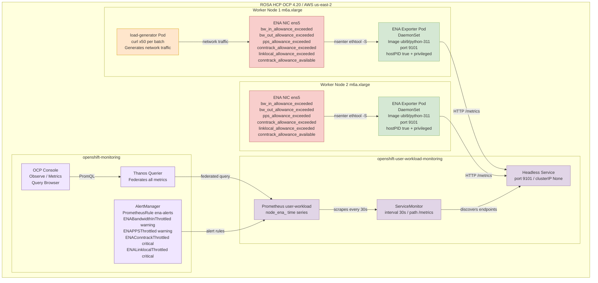
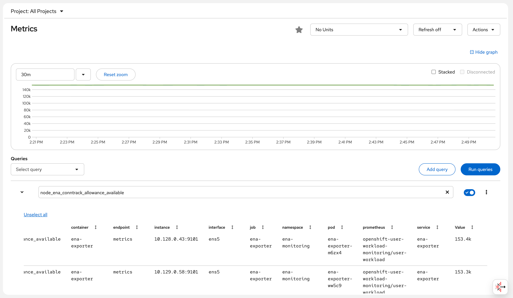

# ROSA ENA 网络指标监控部署指南

## 架构概览



---

## 背景与目标

ROSA (Red Hat OpenShift Service on AWS) 运行在 AWS EC2 实例上，这些实例使用 ENA (Elastic Network Adapter) 网络驱动。AWS ENA 驱动提供了一系列关键的网络性能限制指标，这些指标对于排查网络瓶颈至关重要：

| 指标 | 含义 |
|------|------|
| `bw_in_allowance_exceeded` | 入站带宽超出 EC2 实例限制（m6a.xlarge 基线 1.562 Gbps）的次数 |
| `bw_out_allowance_exceeded` | 出站带宽超出实例限制的次数 |
| `pps_allowance_exceeded` | 每秒数据包超出限制的次数（高频 API 调用、service mesh 易触发） |
| `conntrack_allowance_exceeded` | 连接跟踪表超出限制的次数（相当于 AWS 层的"连接数耗尽"） |
| `linklocal_allowance_exceeded` | 访问 169.254.x.x 超限的次数（影响 DNS 和 EC2 metadata 服务） |
| `conntrack_allowance_available` | 当前剩余可用连接跟踪数 |

### 指标差距汇总表

经过对 ROSA 集群 Prometheus 的实际调研（共 2100 个指标），以下是客户需求 vs ROSA 现有能力的完整对比：

| 客户需求 | Prometheus中已有? | 替代获取方式 | 优先级 |
|----------|-------------------|-------------|--------|
| bw_in_allowance_exceeded | ❌ | ethtool -S / 自定义 DaemonSet | 高 |
| bw_out_allowance_exceeded | ❌ | ethtool -S / 自定义 DaemonSet | 高 |
| pps_allowance_exceeded | ❌ | ethtool -S / 自定义 DaemonSet | 高 |
| conntrack_allowance_exceeded | ❌ | ethtool -S / 自定义 DaemonSet | 高 |
| linklocal_allowance_exceeded | ❌ | ethtool -S / 自定义 DaemonSet | 高 |
| conntrack_allowance_available | ❌ | ethtool -S / 自定义 DaemonSet | 高 |
| NAT Gateway ErrorPortAllocation | ❌ | CloudWatch Exporter | 中 |
| NAT Gateway ActiveConnectionCount | ❌ | CloudWatch Exporter | 中 |
| EBSIOBalance% | ❌ | CloudWatch Exporter | 中 |
| EBSByteBalance% | ❌ | CloudWatch Exporter | 中 |
| Cross-AZ Latency | ❌ | 需自行测量 | 低 |
| ECR Pull Rate | ❌ | CloudWatch Exporter | 低 |
| node_filefd_allocated | ✅ | 已有 | - |
| conntrack entries/limit | ✅ | 已有 | - |
| ListenOverflows/ListenDrops | ✅ | 已有 | - |
| TCP TIME_WAIT | ✅ | 已有 | - |
| CoreDNS metrics | ✅ | 已有 | - |
| somaxconn 值 | ⚠️ | sysctl 获取，非 Prometheus | 低 |
| ip_local_port_range | ⚠️ | sysctl 获取，非 Prometheus | 低 |

**本文档解决的问题**：上表中优先级为"高"的 6 个 ENA 网络限制指标。OpenShift 的内置 node_exporter 包含 ethtool collector，但默认禁用，且 OpenShift 没有提供开启此 collector 的配置选项（[RFE-7342](https://redhat.atlassian.net/browse/RFE-7342) 会在 OCP-4.22 支持）。这意味着上述 ENA 指标**不在** ROSA 的 Prometheus 中。

**解决方案**：部署自定义 ENA Metrics Exporter DaemonSet，利用 `nsenter` 进入宿主机网络命名空间，调用宿主机的 `ethtool` 命令读取 ENA 统计信息，并以 Prometheus 格式暴露。

---

## 环境信息

| 项目 | 值 |
|------|-----|
| 集群类型 | ROSA HCP (Hosted Control Plane) |
| OCP 版本 | 4.20.19 |
| Worker 节点 | 2 × m6a.xlarge (4 vCPU, 16GB RAM) |
| 网络 | 基线 1.562 Gbps，峰值 12.5 Gbps |
| ENA 驱动 | 内核内置 (5.14.0-570.107.1.el9_6.x86_64) |
| ENA 接口名 | ens5 |
| 区域 | us-east-2 |

---

## 部署步骤

### 步骤 1：启用 User Workload Monitoring

OpenShift 的 User Workload Monitoring 需要显式启用，才能让自定义 exporter 的指标进入 Prometheus。

```bash
cat <<'EOF' | oc apply -f -
apiVersion: v1
kind: ConfigMap
metadata:
  name: cluster-monitoring-config
  namespace: openshift-monitoring
data:
  config.yaml: |
    enableUserWorkload: true
EOF
```

**验证**:
```bash
oc get pods -n openshift-user-workload-monitoring

# 预期输出：
# NAME                                   READY   STATUS    RESTARTS   AGE
# prometheus-operator-6cd8958974-nwqrf   2/2     Running   0          8s
# prometheus-user-workload-0             5/6     Running   0          6s
# prometheus-user-workload-1             5/6     Running   0          6s
# thanos-ruler-user-workload-0           4/4     Running   0          5s
# thanos-ruler-user-workload-1           4/4     Running   0          5s
```

---

### 步骤 2：创建 Namespace 和 ServiceAccount

```bash
# 创建专用 namespace
oc new-project ena-monitoring

# 创建 ServiceAccount
oc create serviceaccount ena-exporter -n ena-monitoring

# 授予 privileged SCC（需要 hostPID 和 nsenter 权限）
oc adm policy add-scc-to-user privileged -z ena-exporter -n ena-monitoring
```

**验证**:
```bash
oc get serviceaccount ena-exporter -n ena-monitoring

# 预期输出：
# NAME           SECRETS   AGE
# ena-exporter   0         5s
```

---

### 步骤 3：创建 ENA Exporter Python 脚本 ConfigMap

ENA Exporter 的核心逻辑：通过 `nsenter -t 1 --mount --net` 进入宿主机的 mount 和 network namespace，执行宿主机上的 `ethtool -S ens5`，解析输出并以 Prometheus 格式暴露。

```bash
cat <<'YAML' | oc apply -f -
apiVersion: v1
kind: ConfigMap
metadata:
  name: ena-exporter-script
  namespace: ena-monitoring
data:
  ena_exporter.py: |
    #!/usr/bin/env python3
    """
    ENA Metrics Exporter for ROSA/OpenShift
    Uses nsenter to read ethtool stats from the host network namespace.
    No extra packages needed - uses only Python stdlib.
    """
    import subprocess
    import http.server
    import socketserver
    import os

    PORT = 9101
    INTERFACE = os.getenv('ENA_INTERFACE', 'ens5')

    # ENA throttling metrics (counters - monotonically increasing)
    ENA_THROTTLE_METRICS = [
        'bw_in_allowance_exceeded',
        'bw_out_allowance_exceeded',
        'pps_allowance_exceeded',
        'conntrack_allowance_exceeded',
        'linklocal_allowance_exceeded',
    ]

    # ENA capacity metrics (gauges - current value)
    ENA_GAUGE_METRICS = [
        'conntrack_allowance_available',
    ]

    # ENA SRD metrics
    ENA_SRD_METRICS = [
        'ena_srd_mode',
        'ena_srd_tx_pkts',
        'ena_srd_rx_pkts',
        'ena_srd_resource_utilization',
    ]

    ALL_ENA_METRICS = ENA_THROTTLE_METRICS + ENA_GAUGE_METRICS + ENA_SRD_METRICS

    def get_ena_stats():
        """Run ethtool via nsenter into the host's mount+net namespace."""
        try:
            result = subprocess.run(
                ['nsenter', '-t', '1', '--mount', '--net', '--',
                 'ethtool', '-S', INTERFACE],
                capture_output=True, text=True, timeout=10
            )
            if result.returncode != 0:
                print(f"[WARN] ethtool failed: {result.stderr.strip()}", flush=True)
                return {}
            metrics = {}
            for line in result.stdout.split('\n'):
                line = line.strip()
                if ':' not in line:
                    continue
                key, _, val = line.partition(':')
                key = key.strip()
                val = val.strip()
                if key in ALL_ENA_METRICS:
                    try:
                        metrics[key] = float(val)
                    except ValueError:
                        pass
            return metrics
        except Exception as e:
            print(f"[ERROR] {e}", flush=True)
            return {}

    class MetricsHandler(http.server.BaseHTTPRequestHandler):
        def do_GET(self):
            if self.path != '/metrics':
                self.send_response(404)
                self.end_headers()
                self.wfile.write(b'Not Found\n')
                return

            stats = get_ena_stats()
            lines = []
            for key in ALL_ENA_METRICS:
                metric_name = f'node_ena_{key}'
                val = stats.get(key, 0)
                lines.append(f'# HELP {metric_name} AWS ENA driver statistic: {key}')
                if key in ENA_GAUGE_METRICS:
                    lines.append(f'# TYPE {metric_name} gauge')
                else:
                    lines.append(f'# TYPE {metric_name} counter')
                lines.append(f'{metric_name}{{interface="{INTERFACE}"}} {val}')

            body = '\n'.join(lines) + '\n'
            self.send_response(200)
            self.send_header('Content-Type', 'text/plain; version=0.0.4; charset=utf-8')
            self.end_headers()
            self.wfile.write(body.encode())

        def log_message(self, fmt, *args):
            pass  # suppress per-request logs

    if __name__ == '__main__':
        print(f"[INFO] ENA Exporter starting on port {PORT}, interface={INTERFACE}", flush=True)
        with socketserver.TCPServer(('', PORT), MetricsHandler) as httpd:
            httpd.serve_forever()
YAML
```

---

### 步骤 4：部署 DaemonSet、Service 和 ServiceMonitor

```bash
cat <<'YAML' | oc apply -f -
apiVersion: apps/v1
kind: DaemonSet
metadata:
  name: ena-exporter
  namespace: ena-monitoring
  labels:
    app: ena-exporter
spec:
  selector:
    matchLabels:
      app: ena-exporter
  template:
    metadata:
      labels:
        app: ena-exporter
    spec:
      serviceAccountName: ena-exporter
      hostPID: true        # 需要访问宿主机 PID 1 以使用 nsenter
      nodeSelector:
        kubernetes.io/os: linux
      tolerations:
        - operator: Exists
      containers:
        - name: ena-exporter
          image: registry.access.redhat.com/ubi9/python-311:latest
          command: ["python3", "/scripts/ena_exporter.py"]
          ports:
            - containerPort: 9101
              name: metrics
              protocol: TCP
          env:
            - name: ENA_INTERFACE
              value: "ens5"
          securityContext:
            privileged: true   # 需要 nsenter 进入宿主机命名空间
            runAsUser: 0
          volumeMounts:
            - name: script
              mountPath: /scripts
          resources:
            requests:
              cpu: 10m
              memory: 32Mi
            limits:
              cpu: 100m
              memory: 64Mi
      volumes:
        - name: script
          configMap:
            name: ena-exporter-script
            defaultMode: 0755
---
apiVersion: v1
kind: Service
metadata:
  name: ena-exporter
  namespace: ena-monitoring
  labels:
    app: ena-exporter
spec:
  ports:
    - name: metrics
      port: 9101
      targetPort: 9101
      protocol: TCP
  selector:
    app: ena-exporter
  clusterIP: None   # Headless service，让 Prometheus 发现所有端点
---
apiVersion: monitoring.coreos.com/v1
kind: ServiceMonitor
metadata:
  name: ena-exporter
  namespace: ena-monitoring
  labels:
    app: ena-exporter
spec:
  selector:
    matchLabels:
      app: ena-exporter
  endpoints:
    - port: metrics
      interval: 30s
      path: /metrics
YAML
```

**验证 pods 状态**:
```bash
oc get pods -n ena-monitoring -o wide

# 实际输出：
# NAME                 READY   STATUS    RESTARTS   AGE   IP            NODE
# ena-exporter-m6zx4   1/1     Running   0          57s   10.128.0.43   ip-10-0-0-69.us-east-2.compute.internal
# ena-exporter-ww5c9   1/1     Running   0          57s   10.129.0.58   ip-10-0-0-181.us-east-2.compute.internal
```

---

### 步骤 5：验证指标端点

```bash
# 查看 pod 启动日志
oc logs -n ena-monitoring ena-exporter-m6zx4

# 实际输出：
# [INFO] ENA Exporter starting on port 9101, interface=ens5

# 直接 curl 指标端点
oc exec -n ena-monitoring ena-exporter-m6zx4 -- curl -s http://localhost:9101/metrics

# 实际输出：
# # HELP node_ena_bw_in_allowance_exceeded AWS ENA driver statistic: bw_in_allowance_exceeded
# # TYPE node_ena_bw_in_allowance_exceeded counter
# node_ena_bw_in_allowance_exceeded{interface="ens5"} 0.0
# # HELP node_ena_bw_out_allowance_exceeded AWS ENA driver statistic: bw_out_allowance_exceeded
# # TYPE node_ena_bw_out_allowance_exceeded counter
# node_ena_bw_out_allowance_exceeded{interface="ens5"} 0.0
# # HELP node_ena_pps_allowance_exceeded AWS ENA driver statistic: pps_allowance_exceeded
# # TYPE node_ena_pps_allowance_exceeded counter
# node_ena_pps_allowance_exceeded{interface="ens5"} 0.0
# # HELP node_ena_conntrack_allowance_exceeded AWS ENA driver statistic: conntrack_allowance_exceeded
# # TYPE node_ena_conntrack_allowance_exceeded counter
# node_ena_conntrack_allowance_exceeded{interface="ens5"} 0.0
# # HELP node_ena_linklocal_allowance_exceeded AWS ENA driver statistic: linklocal_allowance_exceeded
# # TYPE node_ena_linklocal_allowance_exceeded counter
# node_ena_linklocal_allowance_exceeded{interface="ens5"} 0.0
# # HELP node_ena_conntrack_allowance_available AWS ENA driver statistic: conntrack_allowance_available
# # TYPE node_ena_conntrack_allowance_available gauge
# node_ena_conntrack_allowance_available{interface="ens5"} 153423.0
```

---

### 步骤 6：通过 Prometheus API 验证指标已被抓取

```bash
THANOS_URL=$(oc get route thanos-querier -n openshift-monitoring -o jsonpath='{.spec.host}')
TOKEN=$(oc whoami -t)

# 查询 conntrack_allowance_available 指标
curl -sk -H "Authorization: Bearer $TOKEN" \
  "https://$THANOS_URL/api/v1/query?query=node_ena_conntrack_allowance_available&namespace=ena-monitoring" \
  | python3 -c "
import json,sys
d=json.load(sys.stdin)
print('Status:', d.get('status'))
for r in d['data']['result']:
    print(f'  pod={r[\"metric\"][\"pod\"]}  node={r[\"metric\"][\"instance\"]}  value={r[\"value\"][1]}')
"

# 实际输出：
# Status: success
#   pod=ena-exporter-m6zx4  node=10.128.0.43:9101  value=153421
#   pod=ena-exporter-ww5c9  node=10.129.0.58:9101  value=153437
```

---

### 步骤 7：部署 Demo 应用（负载生成器）

部署一个持续生成网络流量的负载生成器，模拟真实业务场景下的网络负载：

```bash
cat <<'YAML' | oc apply -f -
apiVersion: v1
kind: Namespace
metadata:
  name: ena-demo
---
apiVersion: apps/v1
kind: Deployment
metadata:
  name: load-generator
  namespace: ena-demo
spec:
  replicas: 1
  selector:
    matchLabels:
      app: load-generator
  template:
    metadata:
      labels:
        app: load-generator
    spec:
      containers:
        - name: load-gen
          image: registry.access.redhat.com/ubi9/ubi-minimal:latest
          command:
            - /bin/sh
            - -c
            - |
              echo "Starting load generator..."
              while true; do
                for i in $(seq 1 50); do
                  curl -s --connect-timeout 1 -o /dev/null \
                    https://api.rosa-bvjtr.d71w.p3.openshiftapps.com/healthz &
                done
                wait
                echo "$(date): Sent 50 requests"
              done
          resources:
            requests:
              cpu: 100m
              memory: 64Mi
            limits:
              cpu: 500m
              memory: 128Mi
YAML

# 等待 pod 就绪
oc get pods -n ena-demo -w
```

**查看负载生成器日志**:
```bash
oc logs -n ena-demo deployment/load-generator --tail=10

# 实际输出：
# Wed May  6 06:24:08 UTC 2026: Sent 50 requests
# Wed May  6 06:24:09 UTC 2026: Sent 50 requests
# Wed May  6 06:24:10 UTC 2026: Sent 50 requests
# Wed May  6 06:24:11 UTC 2026: Sent 50 requests
# Wed May  6 06:24:12 UTC 2026: Sent 50 requests
```

---

## 监控展示

### OpenShift 控制台查看 ENA 指标

通过以下 URL 访问 OpenShift Metrics 页面：

```
https://console-openshift-console.apps.rosa.rosa-bvjtr.d71w.p3.openshiftapps.com/monitoring/query-browser?query0=node_ena_conntrack_allowance_available
```

登录后可以看到来自两个 worker 节点的 ENA conntrack_allowance_available 指标图表（约 153,000 个可用连接追踪），随时间持续稳定，表明当前网络未达到限制。

> **截图说明**: 控制台 Observe → Metrics 页面显示 `node_ena_conntrack_allowance_available` 指标，绿色折线保持在约 140k 水平。



### 通过 Thanos Querier API 查询所有 ENA 指标

```bash
THANOS_URL=$(oc get route thanos-querier -n openshift-monitoring -o jsonpath='{.spec.host}')
TOKEN=$(oc whoami -t)

# 查询所有 ENA 限流指标
for metric in \
  node_ena_bw_in_allowance_exceeded \
  node_ena_bw_out_allowance_exceeded \
  node_ena_pps_allowance_exceeded \
  node_ena_conntrack_allowance_exceeded \
  node_ena_linklocal_allowance_exceeded \
  node_ena_conntrack_allowance_available; do
  echo "--- $metric ---"
  curl -sk -H "Authorization: Bearer $TOKEN" \
    "https://$THANOS_URL/api/v1/query?query=$metric&namespace=ena-monitoring" | \
    python3 -c "import json,sys; d=json.load(sys.stdin); [print(f'  pod={r[\"metric\"][\"pod\"]} => {r[\"value\"][1]}') for r in d['data']['result']]"
done

# 实际输出（2026-05-06 14:24 UTC+8）：
# --- node_ena_bw_in_allowance_exceeded ---
#   pod=ena-exporter-m6zx4 => 0
#   pod=ena-exporter-ww5c9 => 0
# --- node_ena_bw_out_allowance_exceeded ---
#   pod=ena-exporter-m6zx4 => 0
#   pod=ena-exporter-ww5c9 => 0
# --- node_ena_pps_allowance_exceeded ---
#   pod=ena-exporter-m6zx4 => 0
#   pod=ena-exporter-ww5c9 => 0
# --- node_ena_conntrack_allowance_exceeded ---
#   pod=ena-exporter-m6zx4 => 0
#   pod=ena-exporter-ww5c9 => 0
# --- node_ena_linklocal_allowance_exceeded ---
#   pod=ena-exporter-m6zx4 => 0
#   pod=ena-exporter-ww5c9 => 0
# --- node_ena_conntrack_allowance_available ---
#   pod=ena-exporter-m6zx4 => 153362
#   pod=ena-exporter-ww5c9 => 153289
```

**结果解读**：
- 所有 "exceeded" 指标均为 0：当前网络负载未超过 AWS ENA 限制
- conntrack_allowance_available ≈ 153,000：m6a.xlarge 实例 AWS 级连接跟踪剩余充足
- 指标来自两个 worker 节点，每个节点对应一个 DaemonSet pod

---

## 可选：配置告警规则

### ENA 网络限制告警

```bash
cat <<'YAML' | oc apply -f -
apiVersion: monitoring.coreos.com/v1
kind: PrometheusRule
metadata:
  name: ena-alerts
  namespace: ena-monitoring
spec:
  groups:
    - name: ena.rules
      rules:
        # 带宽入站限制超出（可能丢包）
        - alert: ENABandwidthInThrottled
          expr: rate(node_ena_bw_in_allowance_exceeded[5m]) > 0
          for: 2m
          labels:
            severity: warning
          annotations:
            summary: "节点 {{ $labels.pod }} 入站带宽被 AWS ENA 限流"
            description: |
              节点 {{ $labels.pod }} 的入站带宽超出 EC2 实例限制。
              m6a.xlarge 基线 1.562 Gbps，峰值 12.5 Gbps。
              持续发生会导致数据包被丢弃。
              建议：检查是否有大流量应用，考虑升级实例类型。

        # PPS 限制超出（高频小包，如 mTLS/API 网关）
        - alert: ENAPPSThrottled
          expr: rate(node_ena_pps_allowance_exceeded[5m]) > 0
          for: 2m
          labels:
            severity: warning
          annotations:
            summary: "节点 {{ $labels.pod }} 数据包速率被 AWS ENA 限流"
            description: |
              节点 {{ $labels.pod }} 的数据包速率超出限制。
              Service Mesh (mTLS) 和 API 网关（如 Kong）极易触发此限制。
              建议：检查是否有大量小包流量，考虑使用更大的帧大小。

        # AWS 连接跟踪超出（区别于 Linux conntrack）
        - alert: ENAConntrackThrottled
          expr: rate(node_ena_conntrack_allowance_exceeded[5m]) > 0
          for: 2m
          labels:
            severity: critical
          annotations:
            summary: "节点 {{ $labels.pod }} AWS ENA 连接跟踪被限流"
            description: |
              这是 AWS 安全组级别的连接跟踪限制（不是 Linux netfilter conntrack）。
              超限后，新建连接会被 AWS 网络层拒绝，导致间歇性连接失败。

        # Link-local 超限（DNS/metadata 服务受影响）
        - alert: ENALinklocalThrottled
          expr: rate(node_ena_linklocal_allowance_exceeded[5m]) > 0
          for: 1m
          labels:
            severity: critical
          annotations:
            summary: "节点 {{ $labels.pod }} link-local 流量被限流（影响 DNS！）"
            description: |
              AWS 限制 169.254.x.x 流量为 1024 pps。
              此限制影响 VPC DNS 解析器（.2 地址）和 EC2 metadata (IMDSv2)。
              超限会导致 DNS 查询超时和 IAM 角色获取失败！
              建议：立即部署 NodeLocal DNSCache 减少 link-local DNS 请求。

        # 连接跟踪快耗尽（预警）
        - alert: ENAConntrackLow
          expr: node_ena_conntrack_allowance_available < 10000
          for: 5m
          labels:
            severity: warning
          annotations:
            summary: "节点 {{ $labels.pod }} AWS ENA 连接跟踪剩余不足 10000"
YAML
```

---

## 已知限制和注意事项

1. **ROSA Classic 对比 HCP**：本方案在 ROSA HCP 和 Classic 上均适用。ROSA Classic 可能有 SRE 部署的 `sre-ebs-iops-reporter`，但没有 ENA 相关监控。

2. **接口名称**：本示例使用 `ens5`（RHCOS on AWS 的默认 ENA 接口名）。如有多网卡，可通过 DaemonSet 的 `ENA_INTERFACE` 环境变量指定其他接口（如 `eth0`）。

3. **ethtool 版本要求**：ENA 驱动需要版本 2.2.10+ 才支持统计信息。本环境 ENA 驱动版本为内核 5.14 内置版本，完全支持。

4. **RFE-7342 跟踪**：Red Hat 正在开发将 ethtool collector 加入 `NodeExporterCollectorConfig` 的功能。一旦合入，可直接通过 ConfigMap 配置，无需部署本 DaemonSet。建议提交 Support Case 推动此 RFE。

5. **权限说明**：`privileged: true` 和 `hostPID: true` 是 `nsenter` 进入宿主机 namespace 的必要条件。在生产环境中，建议配合 NetworkPolicy 隔离 `ena-monitoring` namespace 的出入流量。

---

## 清理（可选）

如需清理所有资源：

```bash
oc delete namespace ena-monitoring
oc delete namespace ena-demo
oc delete configmap cluster-monitoring-config -n openshift-monitoring
```

---

## 参考

- [AWS ENA 网络性能监控](https://docs.aws.amazon.com/AWSEC2/latest/UserGuide/monitoring-network-performance-ena.html)
- [Red Hat KCS 7113926 - Enable ethtool collector for OCP4](https://access.redhat.com/solutions/7113926)
- [RFE-7342 追踪](https://issues.redhat.com/browse/RFE-7342)
- [Grafana Dashboard: AWS ENA Network Performance](https://grafana.com/grafana/dashboards/17244-aws-ena-network-performance/)
