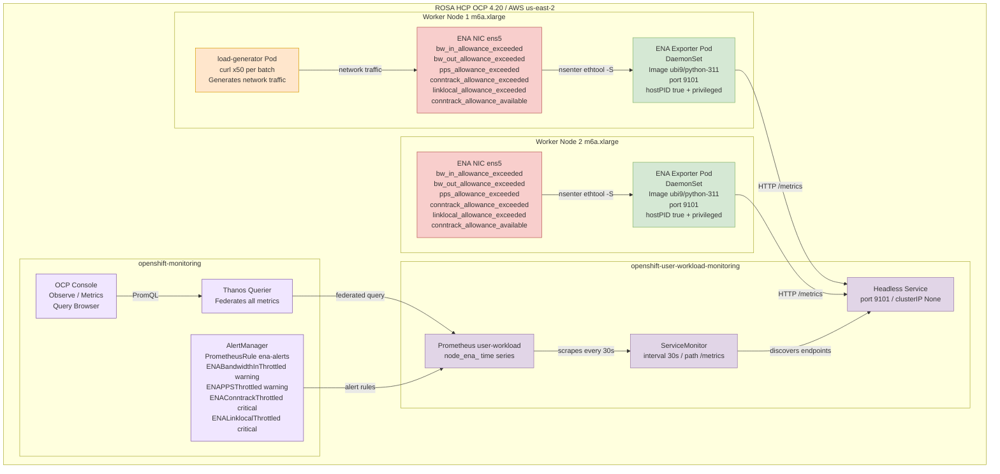

# ROSA ENA Network Metrics Monitoring Deployment Guide

## Architecture Overview



---

## Background and Objectives

ROSA (Red Hat OpenShift Service on AWS) runs on AWS EC2 instances that use the ENA (Elastic Network Adapter) network driver. The AWS ENA driver exposes a set of critical network performance throttling metrics that are essential for diagnosing network bottlenecks:

| Metric | Description |
|--------|-------------|
| `bw_in_allowance_exceeded` | Number of times inbound bandwidth exceeded the EC2 instance limit (m6a.xlarge baseline: 1.562 Gbps) |
| `bw_out_allowance_exceeded` | Number of times outbound bandwidth exceeded the instance limit |
| `pps_allowance_exceeded` | Number of times packets-per-second exceeded the limit (easily triggered by high-frequency API calls or service mesh) |
| `conntrack_allowance_exceeded` | Number of times the connection tracking table exceeded the limit (equivalent to "connection exhaustion" at the AWS layer) |
| `linklocal_allowance_exceeded` | Number of times access to 169.254.x.x exceeded the limit (affects DNS and EC2 metadata service) |
| `conntrack_allowance_available` | Current remaining available connection tracking entries |

### Metrics Gap Summary Table

After a thorough investigation of the ROSA cluster Prometheus (2,100 metrics total), below is a complete comparison of customer requirements vs. existing ROSA capabilities:

| Customer Requirement | Available in Prometheus? | Alternative Collection Method | Priority |
|----------------------|--------------------------|-------------------------------|----------|
| bw_in_allowance_exceeded | ❌ | ethtool -S / custom DaemonSet | High |
| bw_out_allowance_exceeded | ❌ | ethtool -S / custom DaemonSet | High |
| pps_allowance_exceeded | ❌ | ethtool -S / custom DaemonSet | High |
| conntrack_allowance_exceeded | ❌ | ethtool -S / custom DaemonSet | High |
| linklocal_allowance_exceeded | ❌ | ethtool -S / custom DaemonSet | High |
| conntrack_allowance_available | ❌ | ethtool -S / custom DaemonSet | High |
| NAT Gateway ErrorPortAllocation | ❌ | CloudWatch Exporter | Medium |
| NAT Gateway ActiveConnectionCount | ❌ | CloudWatch Exporter | Medium |
| EBSIOBalance% | ❌ | CloudWatch Exporter | Medium |
| EBSByteBalance% | ❌ | CloudWatch Exporter | Medium |
| Cross-AZ Latency | ❌ | Requires custom measurement | Low |
| ECR Pull Rate | ❌ | CloudWatch Exporter | Low |
| node_filefd_allocated | ✅ | Already available | - |
| conntrack entries/limit | ✅ | Already available | - |
| ListenOverflows/ListenDrops | ✅ | Already available | - |
| TCP TIME_WAIT | ✅ | Already available | - |
| CoreDNS metrics | ✅ | Already available | - |
| somaxconn value | ⚠️ | Obtained via sysctl, not Prometheus | Low |
| ip_local_port_range | ⚠️ | Obtained via sysctl, not Prometheus | Low |

**Problem this document solves**: The 6 high-priority ENA network throttling metrics in the table above. OpenShift's built-in node_exporter includes an ethtool collector, but it is disabled by default, and OpenShift does not provide a configuration option to enable it ([RFE-7342](https://redhat.atlassian.net/browse/RFE-7342) will be supported in OCP 4.22). This means the ENA metrics listed above are **not** available in ROSA's Prometheus.

**Solution**: Deploy a custom ENA Metrics Exporter DaemonSet that uses `nsenter` to enter the host network namespace, calls the host's `ethtool` command to read ENA statistics, and exposes them in Prometheus format.

---

## Environment Information

| Item | Value |
|------|-------|
| Cluster Type | ROSA HCP (Hosted Control Plane) |
| OCP Version | 4.20.19 |
| Worker Nodes | 2 × m6a.xlarge (4 vCPU, 16GB RAM) |
| Network | Baseline 1.562 Gbps, burst up to 12.5 Gbps |
| ENA Driver | Kernel built-in (5.14.0-570.107.1.el9_6.x86_64) |
| ENA Interface Name | ens5 |
| Region | us-east-2 |

---

## Deployment Steps

### Step 1: Enable User Workload Monitoring

OpenShift's User Workload Monitoring must be explicitly enabled for custom exporter metrics to be ingested by Prometheus.

```bash
cat <<'EOF' | oc apply -f -
apiVersion: v1
kind: ConfigMap
metadata:
  name: cluster-monitoring-config
  namespace: openshift-monitoring
data:
  config.yaml: |
    enableUserWorkload: true
EOF
```

**Verification**:
```bash
oc get pods -n openshift-user-workload-monitoring

# Expected output:
# NAME                                   READY   STATUS    RESTARTS   AGE
# prometheus-operator-6cd8958974-nwqrf   2/2     Running   0          8s
# prometheus-user-workload-0             5/6     Running   0          6s
# prometheus-user-workload-1             5/6     Running   0          6s
# thanos-ruler-user-workload-0           4/4     Running   0          5s
# thanos-ruler-user-workload-1           4/4     Running   0          5s
```

---

### Step 2: Create Namespace and ServiceAccount

```bash
# Create dedicated namespace
oc new-project ena-monitoring

# Create ServiceAccount
oc create serviceaccount ena-exporter -n ena-monitoring

# Grant privileged SCC (requires hostPID and nsenter permissions)
oc adm policy add-scc-to-user privileged -z ena-exporter -n ena-monitoring
```

**Verification**:
```bash
oc get serviceaccount ena-exporter -n ena-monitoring

# Expected output:
# NAME           SECRETS   AGE
# ena-exporter   0         5s
```

---

### Step 3: Create ENA Exporter Python Script ConfigMap

The core logic of the ENA Exporter: use `nsenter -t 1 --mount --net` to enter the host's mount and network namespace, execute the host's `ethtool -S ens5` command, parse the output, and expose it in Prometheus format.

```bash
cat <<'YAML' | oc apply -f -
apiVersion: v1
kind: ConfigMap
metadata:
  name: ena-exporter-script
  namespace: ena-monitoring
data:
  ena_exporter.py: |
    #!/usr/bin/env python3
    """
    ENA Metrics Exporter for ROSA/OpenShift
    Uses nsenter to read ethtool stats from the host network namespace.
    No extra packages needed - uses only Python stdlib.
    """
    import subprocess
    import http.server
    import socketserver
    import os

    PORT = 9101
    INTERFACE = os.getenv('ENA_INTERFACE', 'ens5')

    # ENA throttling metrics (counters - monotonically increasing)
    ENA_THROTTLE_METRICS = [
        'bw_in_allowance_exceeded',
        'bw_out_allowance_exceeded',
        'pps_allowance_exceeded',
        'conntrack_allowance_exceeded',
        'linklocal_allowance_exceeded',
    ]

    # ENA capacity metrics (gauges - current value)
    ENA_GAUGE_METRICS = [
        'conntrack_allowance_available',
    ]

    # ENA SRD metrics
    ENA_SRD_METRICS = [
        'ena_srd_mode',
        'ena_srd_tx_pkts',
        'ena_srd_rx_pkts',
        'ena_srd_resource_utilization',
    ]

    ALL_ENA_METRICS = ENA_THROTTLE_METRICS + ENA_GAUGE_METRICS + ENA_SRD_METRICS

    def get_ena_stats():
        """Run ethtool via nsenter into the host's mount+net namespace."""
        try:
            result = subprocess.run(
                ['nsenter', '-t', '1', '--mount', '--net', '--',
                 'ethtool', '-S', INTERFACE],
                capture_output=True, text=True, timeout=10
            )
            if result.returncode != 0:
                print(f"[WARN] ethtool failed: {result.stderr.strip()}", flush=True)
                return {}
            metrics = {}
            for line in result.stdout.split('\n'):
                line = line.strip()
                if ':' not in line:
                    continue
                key, _, val = line.partition(':')
                key = key.strip()
                val = val.strip()
                if key in ALL_ENA_METRICS:
                    try:
                        metrics[key] = float(val)
                    except ValueError:
                        pass
            return metrics
        except Exception as e:
            print(f"[ERROR] {e}", flush=True)
            return {}

    class MetricsHandler(http.server.BaseHTTPRequestHandler):
        def do_GET(self):
            if self.path != '/metrics':
                self.send_response(404)
                self.end_headers()
                self.wfile.write(b'Not Found\n')
                return

            stats = get_ena_stats()
            lines = []
            for key in ALL_ENA_METRICS:
                metric_name = f'node_ena_{key}'
                val = stats.get(key, 0)
                lines.append(f'# HELP {metric_name} AWS ENA driver statistic: {key}')
                if key in ENA_GAUGE_METRICS:
                    lines.append(f'# TYPE {metric_name} gauge')
                else:
                    lines.append(f'# TYPE {metric_name} counter')
                lines.append(f'{metric_name}{{interface="{INTERFACE}"}} {val}')

            body = '\n'.join(lines) + '\n'
            self.send_response(200)
            self.send_header('Content-Type', 'text/plain; version=0.0.4; charset=utf-8')
            self.end_headers()
            self.wfile.write(body.encode())

        def log_message(self, fmt, *args):
            pass  # suppress per-request logs

    if __name__ == '__main__':
        print(f"[INFO] ENA Exporter starting on port {PORT}, interface={INTERFACE}", flush=True)
        with socketserver.TCPServer(('', PORT), MetricsHandler) as httpd:
            httpd.serve_forever()
YAML
```

---

### Step 4: Deploy DaemonSet, Service, and ServiceMonitor

```bash
cat <<'YAML' | oc apply -f -
apiVersion: apps/v1
kind: DaemonSet
metadata:
  name: ena-exporter
  namespace: ena-monitoring
  labels:
    app: ena-exporter
spec:
  selector:
    matchLabels:
      app: ena-exporter
  template:
    metadata:
      labels:
        app: ena-exporter
    spec:
      serviceAccountName: ena-exporter
      hostPID: true        # Required to access host PID 1 for nsenter
      nodeSelector:
        kubernetes.io/os: linux
      tolerations:
        - operator: Exists
      containers:
        - name: ena-exporter
          image: registry.access.redhat.com/ubi9/python-311:latest
          command: ["python3", "/scripts/ena_exporter.py"]
          ports:
            - containerPort: 9101
              name: metrics
              protocol: TCP
          env:
            - name: ENA_INTERFACE
              value: "ens5"
          securityContext:
            privileged: true   # Required for nsenter to enter host namespace
            runAsUser: 0
          volumeMounts:
            - name: script
              mountPath: /scripts
          resources:
            requests:
              cpu: 10m
              memory: 32Mi
            limits:
              cpu: 100m
              memory: 64Mi
      volumes:
        - name: script
          configMap:
            name: ena-exporter-script
            defaultMode: 0755
---
apiVersion: v1
kind: Service
metadata:
  name: ena-exporter
  namespace: ena-monitoring
  labels:
    app: ena-exporter
spec:
  ports:
    - name: metrics
      port: 9101
      targetPort: 9101
      protocol: TCP
  selector:
    app: ena-exporter
  clusterIP: None   # Headless service, allows Prometheus to discover all endpoints
---
apiVersion: monitoring.coreos.com/v1
kind: ServiceMonitor
metadata:
  name: ena-exporter
  namespace: ena-monitoring
  labels:
    app: ena-exporter
spec:
  selector:
    matchLabels:
      app: ena-exporter
  endpoints:
    - port: metrics
      interval: 30s
      path: /metrics
YAML
```

**Verify pod status**:
```bash
oc get pods -n ena-monitoring -o wide

# Actual output:
# NAME                 READY   STATUS    RESTARTS   AGE   IP            NODE
# ena-exporter-m6zx4   1/1     Running   0          57s   10.128.0.43   ip-10-0-0-69.us-east-2.compute.internal
# ena-exporter-ww5c9   1/1     Running   0          57s   10.129.0.58   ip-10-0-0-181.us-east-2.compute.internal
```

---

### Step 5: Verify the Metrics Endpoint

```bash
# View pod startup logs
oc logs -n ena-monitoring ena-exporter-m6zx4

# Actual output:
# [INFO] ENA Exporter starting on port 9101, interface=ens5

# Directly curl the metrics endpoint
oc exec -n ena-monitoring ena-exporter-m6zx4 -- curl -s http://localhost:9101/metrics

# Actual output:
# # HELP node_ena_bw_in_allowance_exceeded AWS ENA driver statistic: bw_in_allowance_exceeded
# # TYPE node_ena_bw_in_allowance_exceeded counter
# node_ena_bw_in_allowance_exceeded{interface="ens5"} 0.0
# # HELP node_ena_bw_out_allowance_exceeded AWS ENA driver statistic: bw_out_allowance_exceeded
# # TYPE node_ena_bw_out_allowance_exceeded counter
# node_ena_bw_out_allowance_exceeded{interface="ens5"} 0.0
# # HELP node_ena_pps_allowance_exceeded AWS ENA driver statistic: pps_allowance_exceeded
# # TYPE node_ena_pps_allowance_exceeded counter
# node_ena_pps_allowance_exceeded{interface="ens5"} 0.0
# # HELP node_ena_conntrack_allowance_exceeded AWS ENA driver statistic: conntrack_allowance_exceeded
# # TYPE node_ena_conntrack_allowance_exceeded counter
# node_ena_conntrack_allowance_exceeded{interface="ens5"} 0.0
# # HELP node_ena_linklocal_allowance_exceeded AWS ENA driver statistic: linklocal_allowance_exceeded
# # TYPE node_ena_linklocal_allowance_exceeded counter
# node_ena_linklocal_allowance_exceeded{interface="ens5"} 0.0
# # HELP node_ena_conntrack_allowance_available AWS ENA driver statistic: conntrack_allowance_available
# # TYPE node_ena_conntrack_allowance_available gauge
# node_ena_conntrack_allowance_available{interface="ens5"} 153423.0
```

---

### Step 6: Verify Metrics are Being Scraped via Prometheus API

```bash
THANOS_URL=$(oc get route thanos-querier -n openshift-monitoring -o jsonpath='{.spec.host}')
TOKEN=$(oc whoami -t)

# Query the conntrack_allowance_available metric
curl -sk -H "Authorization: Bearer $TOKEN" \
  "https://$THANOS_URL/api/v1/query?query=node_ena_conntrack_allowance_available&namespace=ena-monitoring" \
  | python3 -c "
import json,sys
d=json.load(sys.stdin)
print('Status:', d.get('status'))
for r in d['data']['result']:
    print(f'  pod={r[\"metric\"][\"pod\"]}  node={r[\"metric\"][\"instance\"]}  value={r[\"value\"][1]}')
"

# Actual output:
# Status: success
#   pod=ena-exporter-m6zx4  node=10.128.0.43:9101  value=153421
#   pod=ena-exporter-ww5c9  node=10.129.0.58:9101  value=153437
```

---

### Step 7: Deploy Demo Application (Load Generator)

Deploy a load generator that continuously generates network traffic to simulate real-world network load scenarios:

```bash
cat <<'YAML' | oc apply -f -
apiVersion: v1
kind: Namespace
metadata:
  name: ena-demo
---
apiVersion: apps/v1
kind: Deployment
metadata:
  name: load-generator
  namespace: ena-demo
spec:
  replicas: 1
  selector:
    matchLabels:
      app: load-generator
  template:
    metadata:
      labels:
        app: load-generator
    spec:
      containers:
        - name: load-gen
          image: registry.access.redhat.com/ubi9/ubi-minimal:latest
          command:
            - /bin/sh
            - -c
            - |
              echo "Starting load generator..."
              while true; do
                for i in $(seq 1 50); do
                  curl -s --connect-timeout 1 -o /dev/null \
                    https://api.rosa-bvjtr.d71w.p3.openshiftapps.com/healthz &
                done
                wait
                echo "$(date): Sent 50 requests"
              done
          resources:
            requests:
              cpu: 100m
              memory: 64Mi
            limits:
              cpu: 500m
              memory: 128Mi
YAML

# Wait for pod to be ready
oc get pods -n ena-demo -w
```

**View load generator logs**:
```bash
oc logs -n ena-demo deployment/load-generator --tail=10

# Actual output:
# Wed May  6 06:24:08 UTC 2026: Sent 50 requests
# Wed May  6 06:24:09 UTC 2026: Sent 50 requests
# Wed May  6 06:24:10 UTC 2026: Sent 50 requests
# Wed May  6 06:24:11 UTC 2026: Sent 50 requests
# Wed May  6 06:24:12 UTC 2026: Sent 50 requests
```

---

## Monitoring Display

### View ENA Metrics in OpenShift Console

Access the OpenShift Metrics page via the following URL:

```
https://console-openshift-console.apps.rosa.rosa-bvjtr.d71w.p3.openshiftapps.com/monitoring/query-browser?query0=node_ena_conntrack_allowance_available
```

After logging in, you can see the ENA `conntrack_allowance_available` metric chart from both worker nodes (approximately 153,000 available connection tracking entries), which remains stable over time, indicating that the current network load has not reached the limit.

> **Screenshot note**: The Console Observe → Metrics page shows the `node_ena_conntrack_allowance_available` metric, with the green line holding steady at approximately 140k.


### Query All ENA Metrics via Thanos Querier API

```bash
THANOS_URL=$(oc get route thanos-querier -n openshift-monitoring -o jsonpath='{.spec.host}')
TOKEN=$(oc whoami -t)

# Query all ENA throttling metrics
for metric in \
  node_ena_bw_in_allowance_exceeded \
  node_ena_bw_out_allowance_exceeded \
  node_ena_pps_allowance_exceeded \
  node_ena_conntrack_allowance_exceeded \
  node_ena_linklocal_allowance_exceeded \
  node_ena_conntrack_allowance_available; do
  echo "--- $metric ---"
  curl -sk -H "Authorization: Bearer $TOKEN" \
    "https://$THANOS_URL/api/v1/query?query=$metric&namespace=ena-monitoring" | \
    python3 -c "import json,sys; d=json.load(sys.stdin); [print(f'  pod={r[\"metric\"][\"pod\"]} => {r[\"value\"][1]}') for r in d['data']['result']]"
done

# Actual output (2026-05-06 14:24 UTC+8):
# --- node_ena_bw_in_allowance_exceeded ---
#   pod=ena-exporter-m6zx4 => 0
#   pod=ena-exporter-ww5c9 => 0
# --- node_ena_bw_out_allowance_exceeded ---
#   pod=ena-exporter-m6zx4 => 0
#   pod=ena-exporter-ww5c9 => 0
# --- node_ena_pps_allowance_exceeded ---
#   pod=ena-exporter-m6zx4 => 0
#   pod=ena-exporter-ww5c9 => 0
# --- node_ena_conntrack_allowance_exceeded ---
#   pod=ena-exporter-m6zx4 => 0
#   pod=ena-exporter-ww5c9 => 0
# --- node_ena_linklocal_allowance_exceeded ---
#   pod=ena-exporter-m6zx4 => 0
#   pod=ena-exporter-ww5c9 => 0
# --- node_ena_conntrack_allowance_available ---
#   pod=ena-exporter-m6zx4 => 153362
#   pod=ena-exporter-ww5c9 => 153289
```

**Result Interpretation**:
- All "exceeded" metrics are 0: current network load has not surpassed AWS ENA limits
- conntrack_allowance_available ≈ 153,000: the m6a.xlarge instance has ample remaining AWS-level connection tracking entries
- Metrics come from two worker nodes, each corresponding to one DaemonSet pod

---

## Optional: Configure Alert Rules

### ENA Network Throttling Alerts

```bash
cat <<'YAML' | oc apply -f -
apiVersion: monitoring.coreos.com/v1
kind: PrometheusRule
metadata:
  name: ena-alerts
  namespace: ena-monitoring
spec:
  groups:
    - name: ena.rules
      rules:
        # Inbound bandwidth throttled (potential packet loss)
        - alert: ENABandwidthInThrottled
          expr: rate(node_ena_bw_in_allowance_exceeded[5m]) > 0
          for: 2m
          labels:
            severity: warning
          annotations:
            summary: "Node {{ $labels.pod }} inbound bandwidth throttled by AWS ENA"
            description: |
              Node {{ $labels.pod }} inbound bandwidth has exceeded the EC2 instance limit.
              m6a.xlarge baseline: 1.562 Gbps, burst: 12.5 Gbps.
              Sustained throttling will cause packets to be dropped.
              Recommendation: Check for high-traffic applications; consider upgrading the instance type.

        # PPS limit exceeded (high-frequency small packets, e.g., mTLS/API gateway)
        - alert: ENAPPSThrottled
          expr: rate(node_ena_pps_allowance_exceeded[5m]) > 0
          for: 2m
          labels:
            severity: warning
          annotations:
            summary: "Node {{ $labels.pod }} packet rate throttled by AWS ENA"
            description: |
              Node {{ $labels.pod }} packet rate has exceeded the limit.
              Service Mesh (mTLS) and API gateways (e.g., Kong) are prone to triggering this limit.
              Recommendation: Check for high volumes of small-packet traffic; consider using larger frame sizes.

        # AWS connection tracking exceeded (distinct from Linux conntrack)
        - alert: ENAConntrackThrottled
          expr: rate(node_ena_conntrack_allowance_exceeded[5m]) > 0
          for: 2m
          labels:
            severity: critical
          annotations:
            summary: "Node {{ $labels.pod }} AWS ENA connection tracking throttled"
            description: |
              This is a connection tracking limit enforced at the AWS security group level (not Linux netfilter conntrack).
              When exceeded, new connections are rejected by the AWS network layer, causing intermittent connection failures.

        # Link-local exceeded (DNS/metadata service affected)
        - alert: ENALinklocalThrottled
          expr: rate(node_ena_linklocal_allowance_exceeded[5m]) > 0
          for: 1m
          labels:
            severity: critical
          annotations:
            summary: "Node {{ $labels.pod }} link-local traffic throttled (DNS affected!)"
            description: |
              AWS limits 169.254.x.x traffic to 1024 pps.
              This limit affects the VPC DNS resolver (.2 address) and EC2 metadata (IMDSv2).
              Throttling will cause DNS query timeouts and IAM role retrieval failures!
              Recommendation: Deploy NodeLocal DNSCache immediately to reduce link-local DNS requests.

        # Connection tracking nearly exhausted (early warning)
        - alert: ENAConntrackLow
          expr: node_ena_conntrack_allowance_available < 10000
          for: 5m
          labels:
            severity: warning
          annotations:
            summary: "Node {{ $labels.pod }} AWS ENA connection tracking entries below 10000"
YAML
```

---

## Known Limitations and Considerations

1. **ROSA Classic vs. HCP**: This solution works on both ROSA HCP and Classic. ROSA Classic may have an SRE-deployed `sre-ebs-iops-reporter`, but there is no ENA-related monitoring.

2. **Interface Name**: This example uses `ens5` (the default ENA interface name for RHCOS on AWS). If multiple NICs are present, you can specify a different interface (e.g., `eth0`) via the `ENA_INTERFACE` environment variable in the DaemonSet.

3. **ethtool Version Requirement**: The ENA driver requires version 2.2.10+ to support statistics. In this environment, the ENA driver is the kernel 5.14 built-in version, which is fully supported.

4. **RFE-7342 Tracking**: Red Hat is developing the feature to add the ethtool collector to `NodeExporterCollectorConfig`. Once merged, it can be configured directly via ConfigMap without deploying this DaemonSet. It is recommended to open a Support Case to help prioritize this RFE.

5. **Permissions Note**: `privileged: true` and `hostPID: true` are required for `nsenter` to enter the host namespace. In production environments, it is recommended to use NetworkPolicy to isolate inbound and outbound traffic for the `ena-monitoring` namespace.

---

## Cleanup (Optional)

To remove all resources:

```bash
oc delete namespace ena-monitoring
oc delete namespace ena-demo
oc delete configmap cluster-monitoring-config -n openshift-monitoring
```

---

## References

- [AWS ENA Network Performance Monitoring](https://docs.aws.amazon.com/AWSEC2/latest/UserGuide/monitoring-network-performance-ena.html)
- [Red Hat KCS 7113926 - Enable ethtool collector for OCP4](https://access.redhat.com/solutions/7113926)
- [RFE-7342 Tracking](https://issues.redhat.com/browse/RFE-7342)
- [Grafana Dashboard: AWS ENA Network Performance](https://grafana.com/grafana/dashboards/17244-aws-ena-network-performance/)
