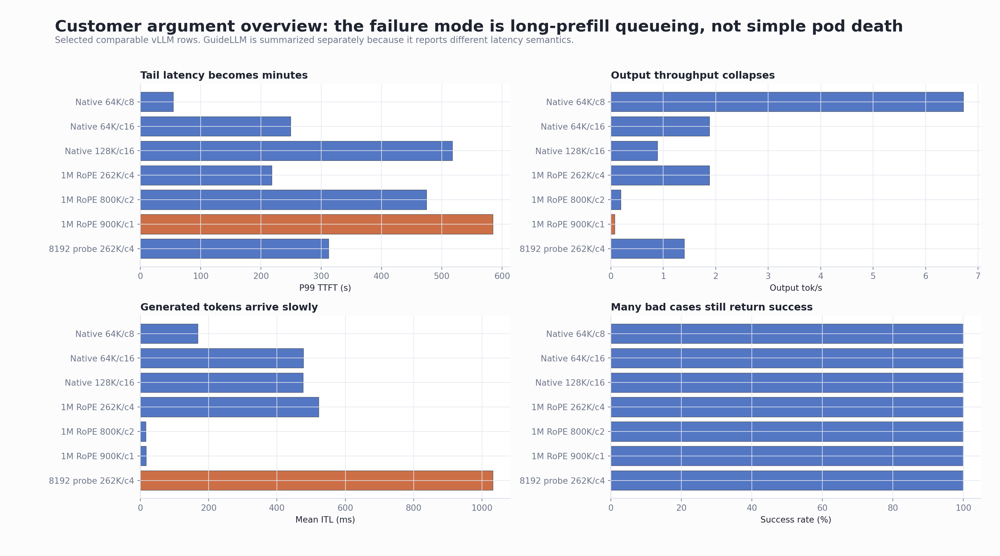
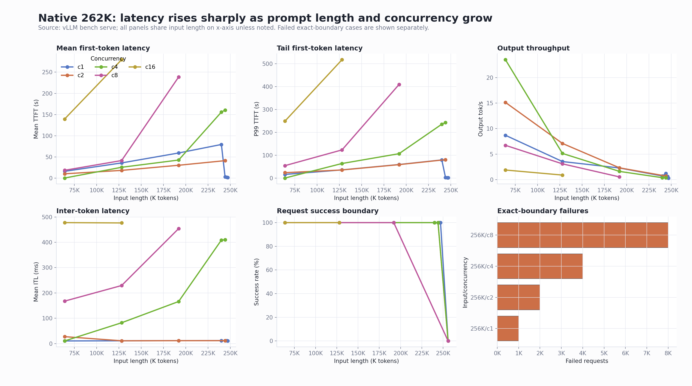
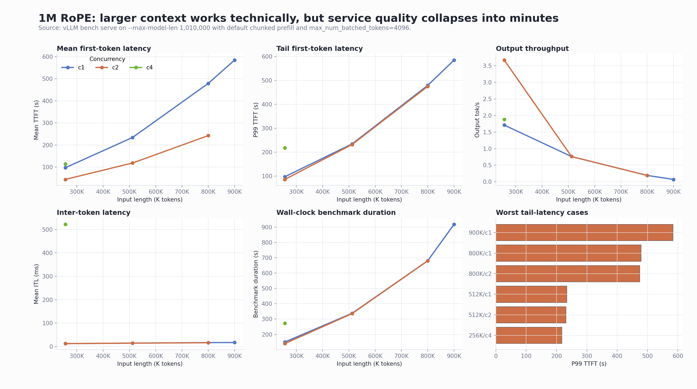
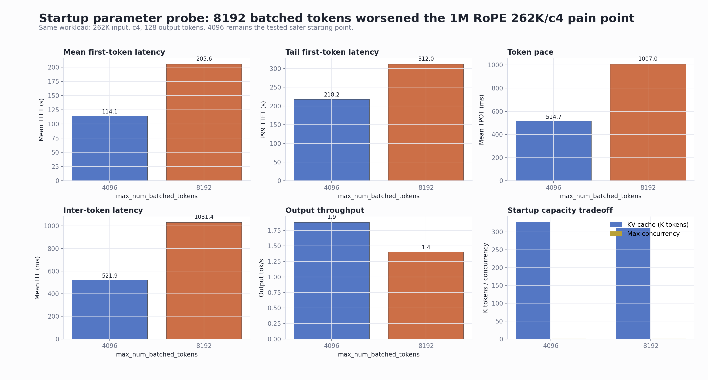
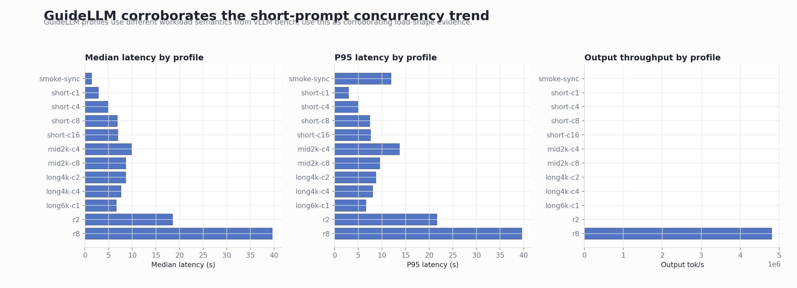

# RHAIIS 3.4 and Qwen3.5 122B Long-Context Validation Report

| Field | Value |
|---|---|
| Date | 2026-06-04 |
| Audience | Customer discussion and internal Red Hat technical review |
| Platform | OpenShift `cluster-ml6gl` |
| Runtime | Red Hat AI Inference Server / vLLM 3.4 |
| Runtime image | `registry.redhat.io/rhaii/vllm-cuda-rhel9:3.4.0-1777444689` |
| Model | `RedHatAI/Qwen3.5-122B-A10B-FP8-dynamic` |
| Main hardware | AWS `g6e.12xlarge`, 4 x NVIDIA L40S |
| Current driver validated | NVIDIA `580.126.20` |
| Report package | This directory contains this Markdown file and all referenced PNG trend charts under `images/` |

## Executive Summary

The model and runtime can start and serve successfully on the tested 4 x L40S OpenShift node. This is not a simple "the pod cannot run" issue. The important failure mode is long-prefill queueing and service-quality collapse under large-context summarization-style workloads.

The native 262K baseline is usable below the exact sequence boundary, but the exact `262144` random input is not a safe user prompt size. After chat/template/tokenizer overhead, that request became `271524 > 262144` and was rejected. Near-limit probes showed that 245,760 to 253,000 benchmark input tokens can pass, so the practical guidance is to reserve prompt budget for chat template, system prompt, requested output, and tokenizer expansion.

The customer-style 1M RoPE configuration can process 800K and 900K benchmark inputs, but the service quality is not acceptable for ordinary production summarization SLOs on this hardware. The 900K/c1 case had `584.29s` TTFT and `918.35s` end-to-end duration, with only `0.07 output tok/s`.

The "service looks alive but inference barely moves" symptom was reproduced. In native 262K supplement tests, 64K/c16 and 128K/c16 produced minute-level P99 TTFT while the server logs showed queued requests and very low generation throughput. In the 1M RoPE tests, 262K/c4, 800K, and 900K cases showed the same operational pattern.

The current tested startup recommendation for this hardware and workload is conservative: keep `--max-num-batched-tokens=4096`. Increasing it to `8192` made the 1M RoPE 262K/c4 pain point worse.

## Primary Trend Dashboard

This overview is the most useful chart for customer discussion. It shows that several bad cases still had 100% request success, while P99 first-token latency and output throughput were already unacceptable.



## Test Environment

| Item | Result |
|---|---|
| OpenShift server | 4.18.21 / Kubernetes v1.31.10 |
| OpenShift client | 4.21.16 |
| GPU node | `ip-10-0-71-58.us-east-2.compute.internal` |
| Instance type | AWS `g6e.12xlarge` |
| GPU | 4 x NVIDIA L40S |
| GPU memory label | 46068 MiB per GPU |
| GPU capacity / allocatable | 4 / 4 |
| NVIDIA driver | `580.126.20` |
| CUDA runtime label | `13.0` |
| Namespace | `qwen35-rhaiis` |
| Service account | `rhaiis-vllm` |
| Model cache | HostPath `/var/lib/rhaiis-model-cache/qwen35-122b-fp8` |
| Security posture | Privileged SCC approved for this validation because of hostPath and GPU runtime requirements |

## Runtime Parameters Tested

### Common vLLM settings

| Parameter | Value |
|---|---|
| `--model` | `RedHatAI/Qwen3.5-122B-A10B-FP8-dynamic` |
| `--served-model-name` | `RedHatAI/Qwen3.5-122B-A10B-FP8-dynamic` |
| `--tensor-parallel-size` | `4` |
| `--gpu-memory-utilization` | `0.90` for long-context tests |
| `--kv-cache-dtype` | `fp8` |
| `--enable-prefix-caching` | enabled |
| `--max-num-batched-tokens` | `4096` default tested setting |
| `--reasoning-parser` | `qwen3` |
| Host / port | `0.0.0.0:8000` |

### Native 262K baseline

| Parameter | Value |
|---|---|
| RoPE override | none |
| `--max-model-len` | `262144` |
| Reported GPU KV cache | `343,744 tokens` |
| Reported max concurrency for full model length | `4.98x` |

### 1M RoPE customer-style configuration

| Parameter | Value |
|---|---|
| `--max-model-len` | `1010000` |
| Long-length guard | `VLLM_ALLOW_LONG_MAX_MODEL_LEN=1` |
| RoPE type | YaRN |
| RoPE factor | `4.0` |
| Original max position embeddings | `262144` |
| `rope_theta` | `10000000` |
| `partial_rotary_factor` | `0.25` |
| `mrope_interleaved` | `true` |
| `mrope_section` | `[11, 11, 10]` |
| Reported chunked prefill | automatically enabled with `max_num_batched_tokens=4096` |
| Reported GPU KV cache | `326,976 tokens` |
| Reported max concurrency for 1,010,000 tokens | `1.28x` |

### Startup parameter probe

| Setting | GPU KV cache | Max concurrency for 1,010,000 tokens | Result |
|---|---:|---:|---|
| `max_num_batched_tokens=4096` | 326,976 tokens | 1.28x | Current tested recommendation |
| `max_num_batched_tokens=8192` | 310,208 tokens | 1.22x | Worse latency and token pace in the 262K/c4 pain point |

## Benchmark Tools

| Tool | Purpose |
|---|---|
| `vllm bench serve` | Main serving benchmark for TTFT, TPOT, ITL, throughput, request success/failure, and long-context stress |
| GuideLLM 0.6.0 | Load-shape corroboration with concurrent and constant profiles |

The GuideLLM results are used as corroborating evidence, not as a direct apples-to-apples replacement for `vllm bench serve`, because its workload and latency semantics differ.

## Key Findings

### 1. Native 262K is not a safe full-prompt budget

The native 262K deployment started successfully. However, setting the random benchmark input to exactly `262144` failed before generation, because the effective tokenized request exceeded the configured limit:

| Native 262K exact-boundary case | Result |
|---|---|
| Input payload requested | `262144` random input tokens |
| Effective tokenized sequence | `271524` tokens |
| Configured max model length | `262144` |
| API result | Bad Request |

Customer-facing interpretation: `--max-model-len=262144` is the total sequence budget, not a safe prompt payload size. Production workloads must reserve margin for chat template, system prompt, requested output, and tokenizer expansion.

### 2. Native 262K high concurrency reproduces the stuck-feeling symptom

The supplement matrix intentionally expanded the native 262K baseline to c16 and near-limit c4 cases.

| Scenario | Input tokens | Concurrency | Success / failure | Mean TTFT | P99 TTFT | Mean ITL | Output tok/s |
|---|---:|---:|---:|---:|---:|---:|---:|
| native262k-supplement-ctx64k-c16 | 65,536 | 16 | 16 / 0 | 139.53s | 249.27s | 477.66ms | 1.88 |
| native262k-supplement-ctx128k-c16 | 131,072 | 16 | 16 / 0 | 279.37s | 517.27s | 476.41ms | 0.89 |
| native262k-supplement-ctx196k-c8 | 196,608 | 8 | 8 / 0 | 238.58s | 409.01s | 454.01ms | 0.53 |
| native262k-supplement-ctx240k-c4 | 245,760 | 4 | 4 / 0 | 155.87s | 235.55s | 408.69ms | 0.38 |
| native262k-supplement-ctx250k-c4 | 250,000 | 4 | 4 / 0 | 160.74s | 243.22s | 409.97ms | 0.37 |

Server logs during this run showed the operational signature we were looking for: requests were still running, but the waiting queue grew and generation throughput dropped close to zero in multiple samples.

Examples captured during the run:

| Observed server-side signal | Interpretation |
|---|---|
| `Running: 2 reqs, Waiting: 14 reqs, Avg generation throughput: 0.5 tokens/s` | The API server is alive, but requests are queueing and generation progress is very slow |
| `Running: 1 reqs, Waiting: 14 reqs, Avg generation throughput: 0.0 tokens/s` | Client-visible behavior can look stuck even without a pod crash |
| `Running: 2 reqs, Waiting: 10 reqs, Avg generation throughput: 0.4 tokens/s` | Long-prefill concurrency is the pressure point |

### 3. 1M RoPE can process 800K and 900K inputs, but service quality is poor

| Scenario | Input tokens | Concurrency | Success / failure | Mean TTFT | P99 TTFT | Output tok/s | Benchmark duration |
|---|---:|---:|---:|---:|---:|---:|---:|
| one-mctx-rope-1010k-ctx262k-c1 | 262,144 | 1 | 1 / 0 | 96.89s | 96.89s | 1.71 | 149.96s |
| one-mctx-rope-1010k-ctx262k-c2 | 262,144 | 2 | 2 / 0 | 43.96s | 85.78s | 3.67 | 139.68s |
| one-mctx-rope-1010k-ctx262k-c4 | 262,144 | 4 | 4 / 0 | 114.14s | 218.18s | 1.88 | 271.88s |
| one-mctx-rope-1010k-ctx512k-c1 | 524,288 | 1 | 1 / 0 | 234.01s | 234.01s | 0.76 | 337.48s |
| one-mctx-rope-1010k-ctx512k-c2 | 524,288 | 2 | 2 / 0 | 118.29s | 231.58s | 0.76 | 335.44s |
| one-mctx-rope-1010k-ctx800k-c1 | 819,200 | 1 | 1 / 0 | 478.97s | 478.97s | 0.19 | 680.74s |
| one-mctx-rope-1010k-ctx800k-c2 | 819,200 | 2 | 2 / 0 | 242.53s | 474.73s | 0.19 | 680.15s |
| one-mctx-rope-1010k-ctx900k-c1 | 921,600 | 1 | 1 / 0 | 584.29s | 584.29s | 0.07 | 918.35s |

Customer-facing interpretation: "It can run a 900K input" is true, but it does not imply acceptable service behavior for large-document summarization. On this node, 800K and 900K inputs are stress or boundary cases, not healthy production settings.

### 4. Chunked prefill is required for the tested 1M RoPE setup

The 1M RoPE deployment did not explicitly pass `--enable-chunked-prefill`, but vLLM enabled it automatically. A controlled test with `--no-enable-chunked-prefill` entered CrashLoopBackOff.

The relevant validation error was:

```text
max_num_batched_tokens (4096) is smaller than max_model_len (1010000)
```

Customer-facing interpretation: chunked prefill is not just an optional tuning knob in this configuration. It is required for the 1M context configuration when `max_model_len=1010000` and `max_num_batched_tokens=4096`.

### 5. Increasing `max_num_batched_tokens` to 8192 made the pain point worse

The tested representative pain point was 1M RoPE with 262K input, c4 concurrency, and 128 output tokens.

| Parameter setting | Success / failure | Mean TTFT | P99 TTFT | Mean TPOT | P99 TPOT | Mean ITL | P99 ITL | Output tok/s |
|---|---:|---:|---:|---:|---:|---:|---:|---:|
| `max_num_batched_tokens=4096` | 4 / 0 | 114.14s | 218.18s | 514.73ms | 687.86ms | 521.92ms | 917.66ms | 1.88 |
| `max_num_batched_tokens=8192` | 4 / 0 | 205.59s | 311.97s | 1007.01ms | 1982.24ms | 1031.38ms | 2767.14ms | 1.40 |

Recommendation: keep `--max-num-batched-tokens=4096` as the current tested starting point for this hardware, model, and customer-like workload. This is not claimed to be a global optimum; it is the safer result among the tested 4096 vs 8192 pair.

## Recommended Guardrails

| Area | Recommendation |
|---|---|
| Native 262K prompt size | Do not allow client prompt payloads to consume the full `262144` budget. Reserve safety margin for template, system prompt, output, and tokenizer expansion. |
| Long-document summarization | Cap concurrency by prompt length. Short-prompt concurrency results do not predict 64K, 128K, 250K, or 900K behavior. |
| 1M RoPE | Treat 262K/c4, 512K/c2, 800K, and 900K as stress or boundary conditions unless the SLO accepts minute-level TTFT. |
| Chunked prefill | Do not disable it for the tested 1M RoPE configuration. |
| `max_num_batched_tokens` | Start with `4096` on this node. The tested `8192` setting was worse for the representative pain point. |
| Customer success criteria | Do not evaluate only request success rate. Tail TTFT, output throughput, and ITL are required to detect the bad user experience. |

## Primary Multi-Metric Trend Dashboards

### Native 262K Combined Dashboard



### 1M RoPE Combined Dashboard



### Startup Parameter Comparison



### GuideLLM Combined Dashboard



## Internal Review Notes

| Topic | Note |
|---|---|
| Runtime compatibility | Earlier startup attempts failed with an NVIDIA driver too old for the RHAIIS 3.4 CUDA/PyTorch stack. The successful validation used driver `580.126.20`. |
| HostPath security | The persistent model cache required a privileged route in this validation because the node path was under `/var/lib` and needed GPU/runtime access. |
| Scope | This report validates `RedHatAI/Qwen3.5-122B-A10B-FP8-dynamic` on 4 x L40S. Do not automatically generalize the numeric thresholds to larger models or different GPU topology. |
| 397B customer mentions | If the customer discusses a different 397B/1M setup, use this report as evidence about long-context behavior and tuning principles, not as a direct capacity result for that larger model. |
| Current live cluster state after testing | The deployment was left on native 262K with `--max-model-len=262144` and `--max-num-batched-tokens=4096`. |

## Image Manifest

The following images are included in this standalone package:

| Image | Purpose |
|---|---|
| `images/01-customer-argument-overview-dashboard.png` | Cross-scenario customer-facing overview |
| `images/02-native262k-combined-dashboard.png` | Native 262K multi-metric dashboard |
| `images/03-one-mctx-rope-combined-dashboard.png` | 1M RoPE multi-metric dashboard |
| `images/04-startup-4096-vs-8192-dashboard.png` | Startup parameter comparison |
| `images/05-guidellm-combined-dashboard.png` | GuideLLM load-shape dashboard |
