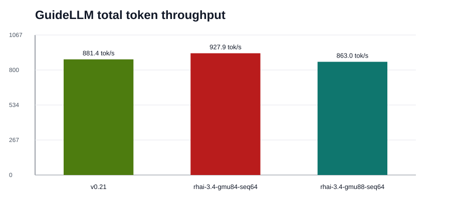
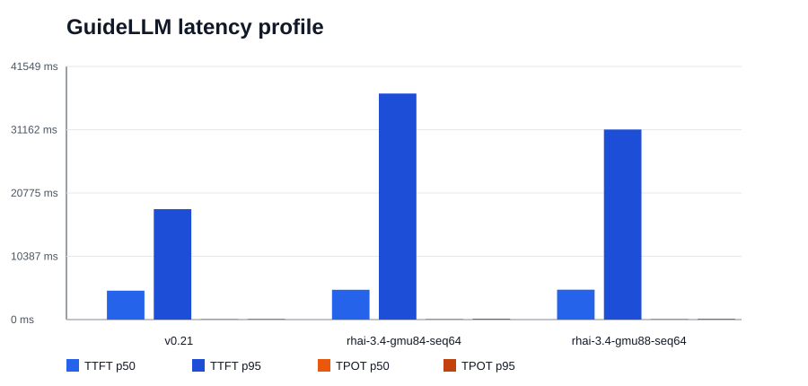
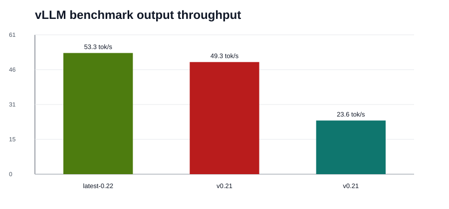
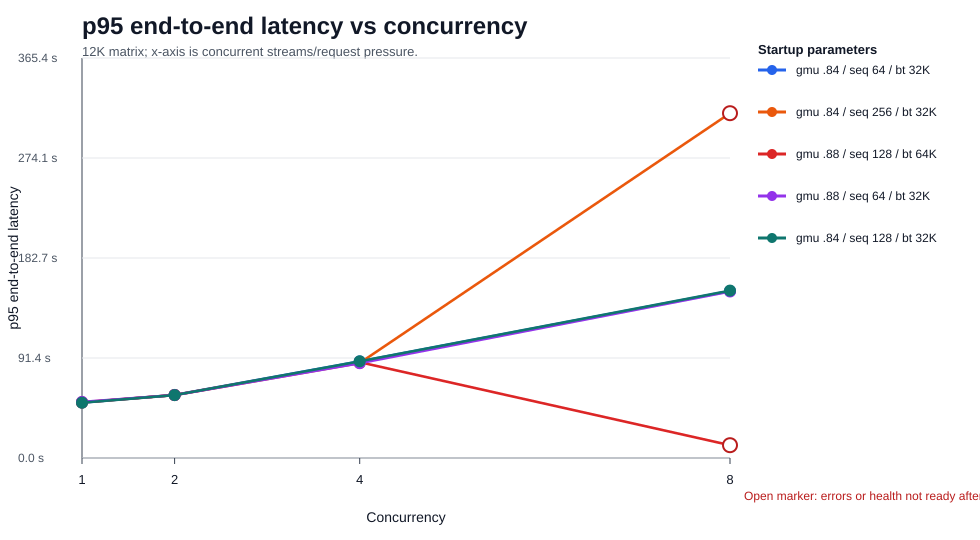
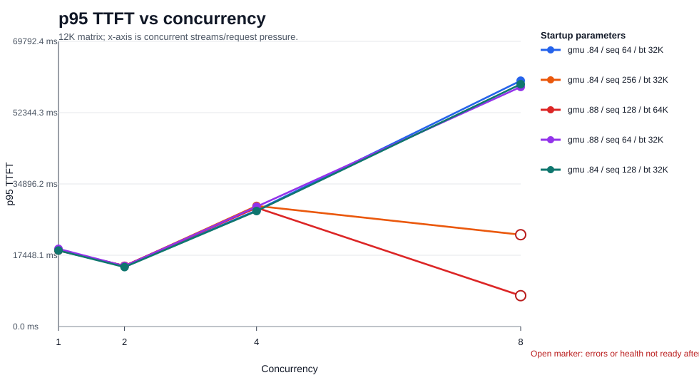
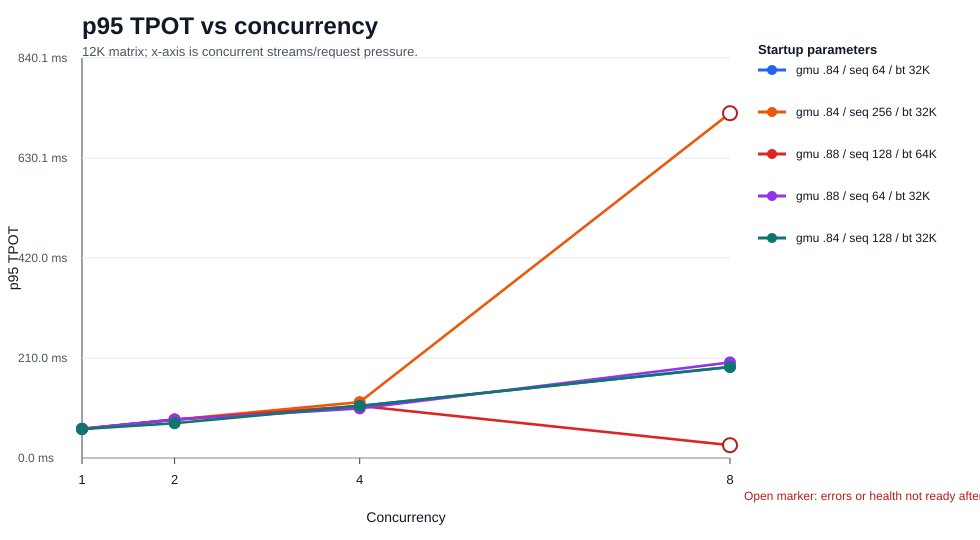
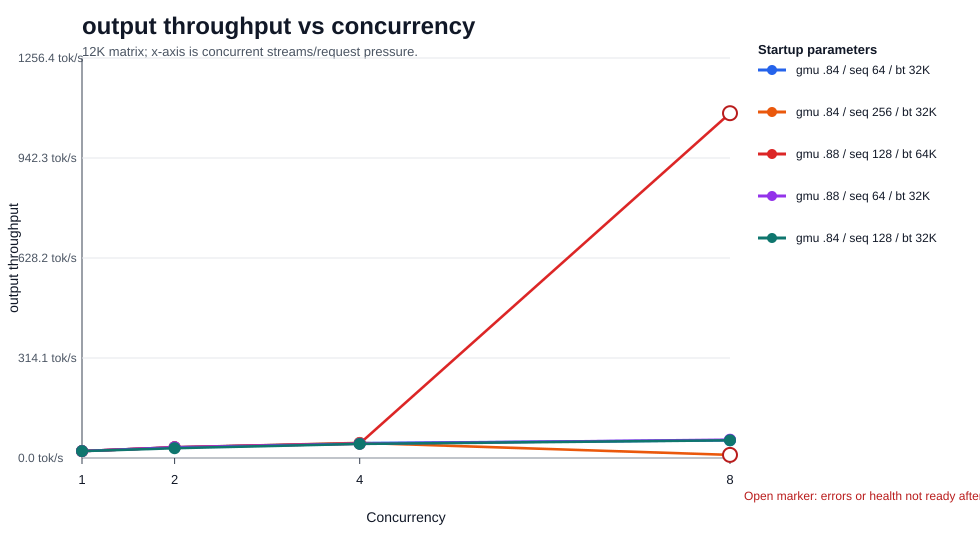
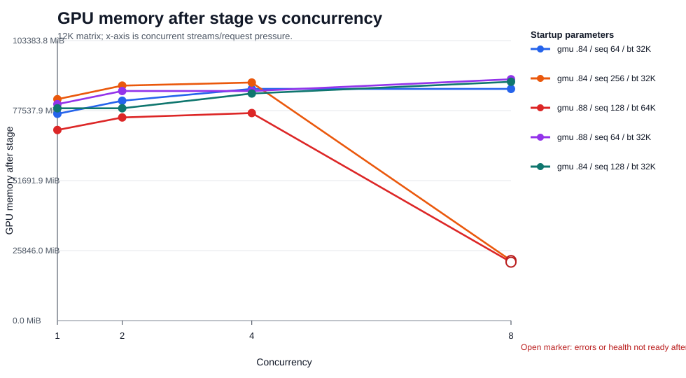
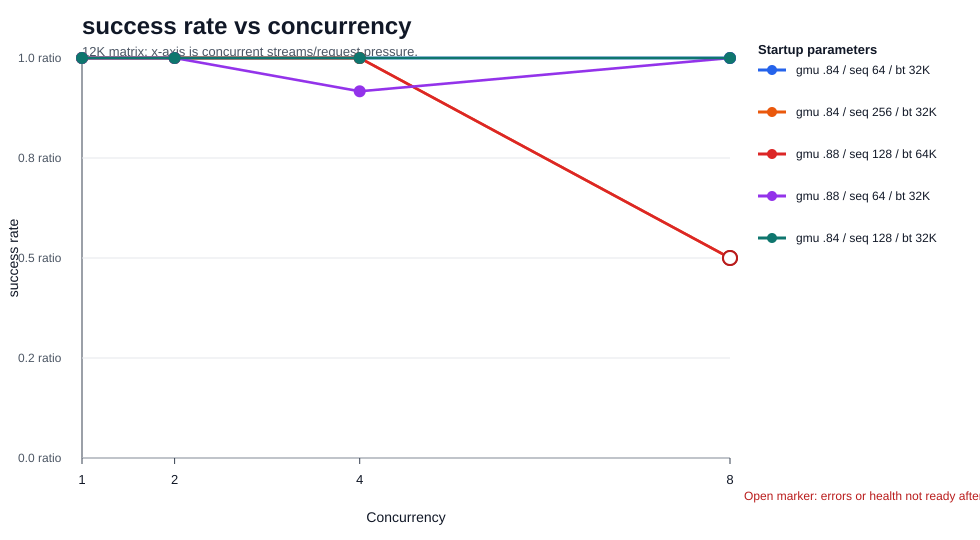
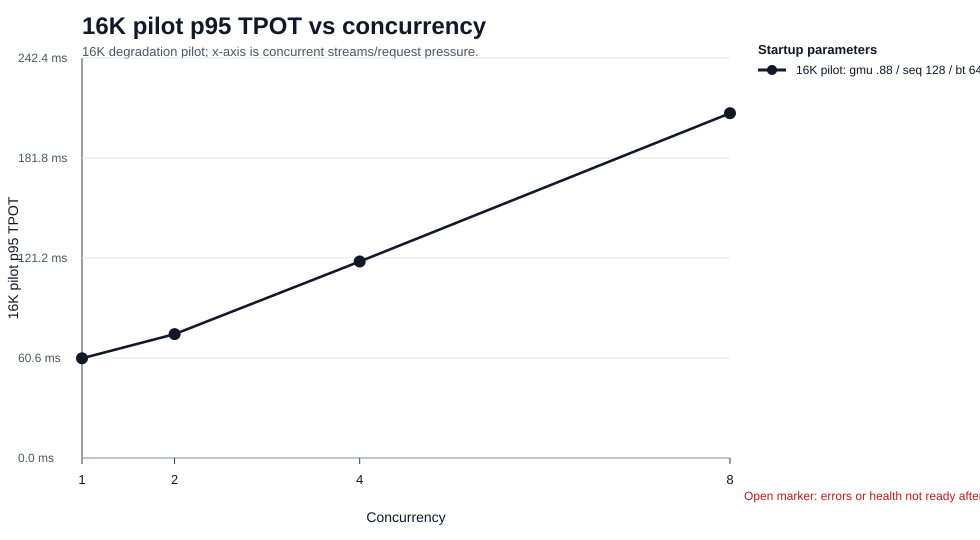

# Final Integrated Benchmark Report: Qwen3.6-27B-FP8 on Upstream vLLM and Red Hat RHAI vLLM

| Field | Value |
|---|---|
| Test date | 2026-06-04 |
| Model | `Qwen/Qwen3.6-27B-FP8` |
| Target host | RHEL AI / rpm-ostree-like RHEL host reached over SSH through proxy `127.0.0.1:5085` |
| GPU | 4 x NVIDIA L4, 23034 MiB per GPU, driver 550.163.01, CUDA 12.4 |
| Storage used | 4 x approximately 800G NVMe XFS devices; benchmark cache/results under `/mnt/bench-nvme*` |
| Runtime rule | Podman only; Docker was not used |
| Serving API | OpenAI-compatible API on port 8000 during each serving run |

## Executive Summary

All three serving stacks ran `Qwen/Qwen3.6-27B-FP8` successfully under the 8K-input, 512-output, concurrency-4 GuideLLM long-reasoning workload. Upstream vLLM 0.21, Red Hat RHAI vLLM 3.4, and upstream latest, which resolved to vLLM 0.22.0 during this test, each completed 12/12 GuideLLM requests without errors.

The recommended Red Hat RHAI vLLM 3.4 customer starting point on this 4 x L4 host remains:

```text
tensor_parallel_size=4
gpu_memory_utilization=0.84
max_model_len=32768
max_num_seqs=64
max_num_batched_tokens=32768
```

This configuration produced the best observed RHAI throughput in the main GuideLLM run: 55.3 output tokens/s and 927.9 total tokens/s. The `gpu_memory_utilization=0.88`, `max_num_seqs=64`, `max_num_batched_tokens=32768` variant also passed the main long run and reduced RHAI p95 latency from 76.7s to 70.8s, but with lower output throughput.

The destructive runtime risk is now also measured. RHAI vLLM 3.4 can start successfully and pass health checks, then degrade or fail later under long-context, agent-like concurrency when the scheduling envelope is pushed too far:

- `gpu_memory_utilization=0.88`, `max_num_seqs=128`, `max_num_batched_tokens=65536` stayed healthy through c4, then at 12K c8 completed 8/16 target requests, produced 8 request errors, health became `not_ready`, and server logs captured `EngineDeadError` plus HTTP 500 responses.
- `gpu_memory_utilization=0.84`, `max_num_seqs=256`, `max_num_batched_tokens=32768` stayed healthy through c4, then at 12K c8 completed 8/16 target requests, health became `not_ready`, p95 end-to-end latency reached 315.0s, and p95 TPOT reached 724.2ms.
- The 16K-input pilot for `0.88 / 128 / 65536` did not crash, but it became extremely slow at c8: p95 latency 200.6s, p95 TTFT 82018ms, and p95 TPOT 209.0ms while health still returned ready.

## Target Host and Runtime

The test target was an AWS EC2-style GPU host. It was a RHEL AI / rpm-ostree-like system, so the test avoided mutable-root assumptions: no changes were made under `/usr`, and persistent high-write data stayed under `/var`-backed paths and the NVMe mounts.

| Component | Observed value |
|---|---|
| GPU | 4 x NVIDIA L4 |
| GPU memory | 23034 MiB per GPU |
| NVIDIA driver | 550.163.01 |
| CUDA reported by driver | 12.4 |
| CPU | 48 vCPU AMD EPYC 7R13 |
| System memory | Approximately 181 GiB |
| Container runtime | Podman 4.9.4-rhel |
| Benchmark storage | 4 x approximately 800G NVMe XFS |

| Mount | Purpose |
|---|---|
| `/mnt/bench-nvme1` | Hugging Face cache and workspace root |
| `/mnt/bench-nvme2` | Temporary directories, XDG cache, vLLM compile/cache directories |
| `/mnt/bench-nvme3` | Benchmark logs, JSON/CSV/HTML outputs, result archives |
| `/mnt/bench-nvme4` | Scratch/profile-ready space |

## Serving Stacks

| Stack | Image | Observed version |
|---|---|---|
| Upstream vLLM 0.21 | `docker.io/vllm/vllm-openai:v0.21.0` | vLLM 0.21.0 |
| Red Hat RHAI vLLM 3.4 | `registry.redhat.io/rhaii/vllm-cuda-rhel9:3.4.0` | vLLM 0.18.0+rhaiv.7 |
| Upstream latest | `docker.io/vllm/vllm-openai:latest` | vLLM 0.22.0 during this test |

All serving runs exposed the model through the OpenAI-compatible API and used tensor parallelism across four NVIDIA L4 GPUs.

## Main Long-Reasoning Benchmark

Workload: approximately 8K input tokens, 512 output tokens, concurrency 4, 12 GuideLLM requests, 359-second measurement window.

| Stack | Scenario | OK/Err | Output tok/s | Total tok/s | Latency p50/p95 | TTFT p50/p95 | TPOT p50/p95 |
|---|---|---:|---:|---:|---:|---:|---:|
| upstream-v0.21 | long-8k-512-c4 | 12/0 | 52.5 | 881.4 | 40.9s / 56.0s | 4746ms / 18127ms | 76.3ms / 92.1ms |
| redhat-rhai-3.4-gmu84-seq64 | long-8k-512-c4 | 12/0 | 55.3 | 927.9 | 45.4s / 76.7s | 4890ms / 37097ms | 88.8ms / 126.1ms |
| redhat-rhai-3.4-gmu88-seq64 | long-8k-512-c4 | 12/0 | 51.4 | 863.0 | 41.9s / 70.8s | 4907ms / 31196ms | 88.9ms / 116.4ms |
| upstream-latest-0.22 | long-8k-512-c4 | 12/0 | 53.3 | 894.8 | 40.2s / 56.9s | 5086ms / 18973ms | 77.3ms / 99.3ms |

[](images/guidellm-output-throughput.svg)

[](images/guidellm-total-throughput.svg)

[](images/guidellm-latency-profile.svg)

## vLLM Built-In Benchmark Reference

The vLLM built-in benchmark was run for upstream vLLM 0.21 as an additional reference point, separate from GuideLLM.

| Stack | Scenario | OK/Err | Output tok/s | Total tok/s | Latency p50/p95 | TTFT p50/p95 | TPOT p50/p95 |
|---|---|---:|---:|---:|---:|---:|---:|
| upstream-v0.21 | agent-concurrency-8k-512-c4 | 24/0 | 49.3 | 870.1 | 38.9s / 47.9s | 4895ms / 12230ms | 72.1ms / 76.4ms |
| upstream-v0.21 | long-single-4k-512 | 8/0 | 23.6 | 194.9 | 22.5s / 23.9s | 2118ms / 2464ms | 37.5ms / 37.9ms |

[](images/vllm-benchmark-throughput.svg)

## Red Hat RHAI vLLM 3.4 Parameter Search and Recommended Range

The first RHAI 3.4 default-style attempt with `max_num_seqs=256` failed during sampler warmup with CUDA OOM. Lowering `max_num_seqs` was required on this 4 x L4 host before full long-run validation.

Startup and short chat probes passed for these RHAI 3.4 candidates:

| Case | GPU memory utilization | max_num_seqs | max_num_batched_tokens | Ready | Exit code | OOMKilled | Chat HTTP |
|---|---:|---:|---:|---:|---:|---|---:|
| gmu84-seq64-bt32768 | 0.84 | 64 | 32768 | 1 | 0 | false | 200 |
| gmu86-seq64-bt32768 | 0.86 | 64 | 32768 | 1 | 0 | false | 200 |
| gmu88-seq64-bt32768 | 0.88 | 64 | 32768 | 1 | 0 | false | 200 |
| gmu84-seq128-bt32768 | 0.84 | 128 | 32768 | 1 | 0 | false | 200 |

Two RHAI parameter sets received full GuideLLM long-run validation:

| Configuration | Full long run status | Interpretation |
|---|---|---|
| `gpu_memory_utilization=0.84`, `max_num_seqs=64`, `max_num_batched_tokens=32768` | Passed, 12/12 successful, 0 errors | Best observed RHAI throughput in the main long benchmark. Recommended throughput-first setting. |
| `gpu_memory_utilization=0.88`, `max_num_seqs=64`, `max_num_batched_tokens=32768` | Passed, 12/12 successful, 0 errors | Lower p95 latency than the 0.84 run, but lower output throughput. Useful as a latency-balanced alternative. |

The `0.84 / 128 / 32768` case passed startup and short chat probing, but it should not replace the recommended setting without full long-run validation at the customer's target concurrency.

## Runtime Degradation Matrix

This matrix tested Red Hat RHAI vLLM 3.4 startup parameters against a fixed long-agent workload shape: approximately 12K input tokens, 640 output tokens, concurrency 1/2/4/8. It is the key evidence for the destructive pattern that appears after successful startup.

| Startup parameters | c | OK/Err/Target | Success | Health | GPU MiB | Out tok/s | Latency p95 | TTFT p95 | TPOT p95 |
|---|---:|---:|---:|---|---:|---:|---:|---:|---:|
| gmu .84 / seq 64 / bt 32K | 1 | 4/0/4 | 100% | ready | 76340 | 21.7 | 50.6s | 18687ms | 60.8ms |
| gmu .84 / seq 64 / bt 32K | 2 | 8/0/8 | 100% | ready | 81188 | 33.5 | 57.6s | 14833ms | 80.6ms |
| gmu .84 / seq 64 / bt 32K | 4 | 12/0/12 | 100% | ready | 85540 | 46.8 | 88.3s | 28406ms | 109.3ms |
| gmu .84 / seq 64 / bt 32K | 8 | 16/0/16 | 100% | ready | 85540 | 55.8 | 152.6s | 60166ms | 191.0ms |
| gmu .84 / seq 128 / bt 32K | 1 | 4/0/4 | 100% | ready | 78380 | 21.7 | 50.5s | 18607ms | 60.7ms |
| gmu .84 / seq 128 / bt 32K | 2 | 8/0/8 | 100% | ready | 78380 | 30.9 | 57.4s | 14558ms | 73.1ms |
| gmu .84 / seq 128 / bt 32K | 4 | 12/0/12 | 100% | ready | 83836 | 44.3 | 88.3s | 28268ms | 109.5ms |
| gmu .84 / seq 128 / bt 32K | 8 | 16/0/16 | 100% | ready | 88188 | 55.6 | 152.9s | 59303ms | 191.3ms |
| gmu .88 / seq 64 / bt 32K | 1 | 4/0/4 | 100% | ready | 79924 | 21.6 | 51.2s | 19010ms | 61.6ms |
| gmu .88 / seq 64 / bt 32K | 2 | 8/0/8 | 100% | ready | 84772 | 33.6 | 57.5s | 14792ms | 80.6ms |
| gmu .88 / seq 64 / bt 32K | 4 | 11/0/12 | 92% | ready | 84772 | 45.4 | 86.6s | 29329ms | 104.1ms |
| gmu .88 / seq 64 / bt 32K | 8 | 16/0/16 | 100% | ready | 89124 | 57.6 | 152.1s | 58641ms | 200.9ms |
| gmu .88 / seq 128 / bt 64K | 1 | 4/0/4 | 100% | ready | 70388 | 21.7 | 50.7s | 18616ms | 60.9ms |
| gmu .88 / seq 128 / bt 64K | 2 | 8/0/8 | 100% | ready | 75004 | 33.5 | 57.6s | 14867ms | 80.7ms |
| gmu .88 / seq 128 / bt 64K | 4 | 12/0/12 | 100% | ready | 76628 | 45.2 | 87.6s | 29084ms | 109.5ms |
| gmu .88 / seq 128 / bt 64K | 8 | 8/8/16 | 50% | not_ready | 21590 | 1083.1 | 11.7s | 7563ms | 26.9ms |
| gmu .84 / seq 256 / bt 32K | 1 | 4/0/4 | 100% | ready | 81760 | 21.6 | 51.0s | 18695ms | 61.3ms |
| gmu .84 / seq 256 / bt 32K | 2 | 8/0/8 | 100% | ready | 86766 | 33.5 | 57.4s | 14792ms | 80.6ms |
| gmu .84 / seq 256 / bt 32K | 4 | 12/0/12 | 100% | ready | 87914 | 47.3 | 86.8s | 29516ms | 117.4ms |
| gmu .84 / seq 256 / bt 32K | 8 | 8/0/16 | 50% | not_ready | 22170 | 9.8 | 315.0s | 22468ms | 724.2ms |

The throughput number for failed c8 rows should be read together with success rate and health. For example, `0.88 / 128 / 65536` reports high completed-request throughput at c8 because half the workload failed quickly; the governing signals are 50% success rate, `not_ready` health, and `EngineDeadError`.

[](images/matrix-latency-p95.svg)

[](images/matrix-ttft-p95.svg)

[](images/matrix-tpot-p95.svg)

[](images/matrix-output-throughput.svg)

[](images/matrix-gpu-memory.svg)

[](images/matrix-success-rate.svg)

## Longer 16K Degradation Pilot

The 16K-input pilot used `gpu_memory_utilization=0.88`, `max_num_seqs=128`, `max_num_batched_tokens=65536` with approximately 16K input tokens and 768 output tokens. It demonstrates the slow-response version of the same risk: at c8 the service still answered health checks, but p95 latency and TTFT became customer-visible failures.

| Startup parameters | c | OK/Err/Target | Health | GPU MiB | Out tok/s | Latency p95 | TTFT p95 | TPOT p95 |
|---|---:|---:|---|---:|---:|---:|---:|---:|
| 16K pilot: gmu .88 / seq 128 / bt 64K | 1 | 4/0/4 | ready | 74620 | 21.4 | 58.0s | 21407ms | 60.4ms |
| 16K pilot: gmu .88 / seq 128 / bt 64K | 2 | 8/0/8 | ready | 74620 | 29.9 | 69.6s | 19469ms | 75.1ms |
| 16K pilot: gmu .88 / seq 128 / bt 64K | 4 | 12/0/12 | ready | 89492 | 44.3 | 114.3s | 40865ms | 119.1ms |
| 16K pilot: gmu .88 / seq 128 / bt 64K | 8 | 16/0/16 | ready | 89634 | 51.4 | 200.6s | 82018ms | 209.0ms |

[](images/pilot-latency-p95.svg)

[](images/pilot-tpot-p95.svg)

## Destructive Boundary Summary

| Stack | Destructive parameters | Failure mode |
|---|---|---|
| Upstream vLLM 0.21 | `gpu_memory_utilization=0.999`, `max_model_len=65536`, `max_num_seqs=256`, `max_num_batched_tokens=131072` | Startup admission failure. Container exited with code 1, `OOMKilled=false`; free GPU memory was below the target requested by utilization 0.999. |
| Upstream latest / vLLM 0.22.0 | `gpu_memory_utilization=0.999`, `max_model_len=65536`, `max_num_seqs=256`, `max_num_batched_tokens=131072` | Same startup admission failure as upstream v0.21. |
| Red Hat RHAI vLLM 3.4 | `gpu_memory_utilization=0.88`, `max_num_seqs=128`, `max_num_batched_tokens=65536` | Successful startup, then runtime degradation/failure at 12K c8: 8/16 target requests completed, 8 errors, health `not_ready`, `EngineDeadError`, HTTP 500 responses. |
| Red Hat RHAI vLLM 3.4 | `gpu_memory_utilization=0.84`, `max_num_seqs=256`, `max_num_batched_tokens=32768` | Successful startup, then runtime degradation at 12K c8: 8/16 target requests completed, health `not_ready`, p95 latency 315.0s, p95 TPOT 724.2ms. |

## Recommendation

Use this RHAI vLLM 3.4 configuration as the customer-facing starting point on this 4 x NVIDIA L4 host:

```text
tensor_parallel_size=4
gpu_memory_utilization=0.84
max_model_len=32768
max_num_seqs=64
max_num_batched_tokens=32768
```

For latency-sensitive tests, evaluate this variant under the customer's actual workload:

```text
tensor_parallel_size=4
gpu_memory_utilization=0.88
max_model_len=32768
max_num_seqs=64
max_num_batched_tokens=32768
```

Avoid treating `max_num_seqs`, `max_num_batched_tokens`, and `gpu_memory_utilization` as independent "more is better" knobs on 4 x L4. This test shows three distinct risk zones:

- Too much startup memory pressure can fail admission before serving starts.
- Larger scheduling envelopes can pass startup but degrade at high long-context concurrency.
- A service can remain health-ready while p95 latency and TTFT are already unacceptable for interactive agent use.

## Evidence Package

| Artifact | Path |
|---|---|
| Integrated final report | `solution/solution-2026.06.04.15.54.md` |
| Main benchmark archive | `solution/files/solution-2026-06-04-12-44/round2-benchmark-results-20260604T1244Z.tar.gz` |
| Main benchmark manifest | `solution/files/solution-2026-06-04-12-44/round2-benchmark-results-20260604T1244Z.manifest.txt` |
| Main benchmark CSV | `solution/files/solution-2026-06-04-12-44/round2-summary.csv` |
| Runtime degradation archive | `solution/files/solution-2026-06-04-13-40/round4-degradation-results-20260604T072632Z.tar.gz` |
| Runtime degradation manifest | `solution/files/solution-2026-06-04-13-40/round4-degradation-results-20260604T072632Z.manifest.txt` |
| Runtime degradation CSV | `solution/files/solution-2026-06-04-13-40/round4-degradation-summary.csv` |
| Command audit logs | `steps/steps-2026.06.04.11.04.md`, `steps/steps-2026.06.04.12.44.md`, `steps/steps-2026.06.04.13.36.md`, `steps/steps-2026.06.04.13.40.md`, `steps/steps-2026.06.04.15.54.md` |

Final cleanup was verified after the benchmark and degradation work: no vLLM containers remained, no GPU processes were running, and port 8000 had no listener.
