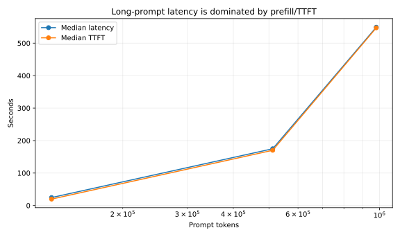
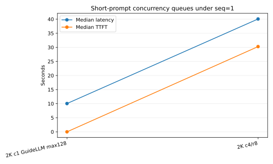
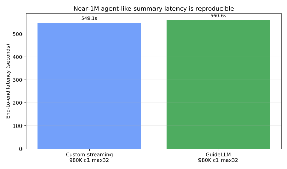
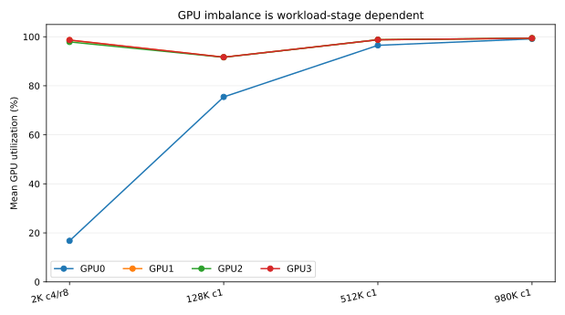
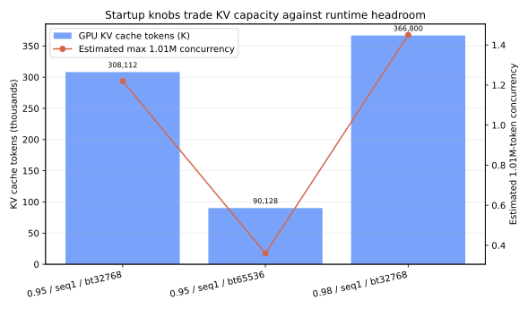
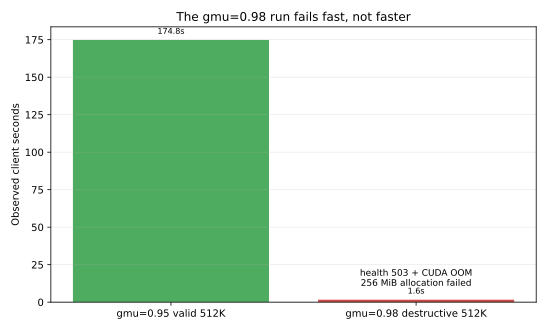

# Red Hat RHAI vLLM 3.4.1 - Qwen 3.5 122B 1M Context Stress Report

| Field | Value |
|---|---|
| Test date | 2026-06-10 |
| Target host | `computeinstance-e00d5cpyn31hqd5x9m` over SSH proxy `127.0.0.1:5085` |
| OS/runtime | Ubuntu 24.04.4 LTS, Docker 29.5.3, NVIDIA Container Toolkit 1.19.1 |
| GPU | 4 x NVIDIA L40S, 46,068 MiB each, driver 580.159.04, CUDA 13.0 |
| Model | `RedHatAI/Qwen3.5-122B-A10B-FP8-dynamic` |
| Serving image | `registry.redhat.io/rhaii/vllm-cuda-rhel9:3.4.1`, vLLM `0.18.0+rhaiv.11` |
| Report package | `solution/files/solution-2026-06-10-19-35/final-qwen35-122b-rhai341-report/` |

## Executive conclusion

The observed single-GPU utilization drop is not the standalone root cause. It is a symptom that appears in some phases, especially short-prompt concurrency and startup/loading samples. During true long-prompt prefill, the 512K and 980K tests drove all four L40S GPUs close to full utilization.

The root-cause chain is:

1. The 1M serving profile is far beyond the model config/tokenizer native 262,144-token position limit and requires `VLLM_ALLOW_LONG_MAX_MODEL_LEN=1`.
2. On 4 x L40S, Qwen 3.5 122B FP8 leaves very limited memory after model weights and KV cache reservation.
3. The safe 1M profile requires `max_num_seqs=1`, which serializes requests and makes short-prompt concurrency look like no-response/slow-response.
4. Very long prompts are dominated by prefill: the custom 980K input reached about 547 seconds TTFT before the first token, while the API process was still alive and GPUs were busy.
5. Raising `gpu_memory_utilization` to `0.98` increases KV capacity but removes runtime headroom; a 512K request then failed with CUDA OOM and `/health` returned 503.

## Recommended profile

Use this as the validated 1M-context operating profile for this host:

```bash
vllm serve RedHatAI/Qwen3.5-122B-A10B-FP8-dynamic \
  --served-model-name qwen35-122b-fp8 \
  --tensor-parallel-size 4 \
  --max-model-len 1010000 \
  --gpu-memory-utilization 0.95 \
  --max-num-seqs 1 \
  --max-num-batched-tokens 32768 \
  --kv-cache-dtype fp8 \
  --enable-chunked-prefill \
  --enforce-eager \
  --disable-custom-all-reduce \
  --language-model-only \
  --reasoning-parser qwen3
```

This profile started successfully, returned `/v1/models` with `max_model_len=1010000`, and completed 128K, 512K, and 980K summary requests. It is slow for near-1M inputs, but it does not crash in the validated tests.

Avoid treating `gpu_memory_utilization=0.98` as the best profile. It starts and reports more KV cache, but it crashed on a 512K request due to a runtime 256 MiB allocation failure inside the Triton/FLA Qwen3.5 path.

## Performance summary

| Case | Prompt tokens | Concurrency | Requests | Max output tokens | Median latency s | Median TTFT s | Median TPOT ms | Completed | Status |
| --- | --- | --- | --- | --- | --- | --- | --- | --- | --- |
| 2K c4/r8 | 2,000 | 4 | 8 | 128 | 40.07 | 30.27 | 75.9 | 8/8 | OK |
| 128K c1 | 128,000 | 1 | 1 | 64 | 24.60 | 19.80 | 73.9 | 1/1 | OK |
| 512K c1 | 512,000 | 1 | 1 | 64 | 174.82 | 170.12 | 73.5 | 1/1 | OK |
| 980K c1 | 980,000 | 1 | 1 | 32 | 549.13 | 547.06 | 69.1 | 1/1 | OK |
| 512K c1 gmu=0.98 | 512,000 | 1 | 1 | 64 | 1.64 | 1.64 | 0.4 | 1/1 | OOM/503 |

[](images/latency-ttft-vs-prompt-tokens.svg)

[](images/short-prompt-concurrency-latency.svg)

The GuideLLM long-reasoning/agent-like validation used the same OpenAI-compatible `/v1/chat/completions` endpoint and a 980K-token operational-summary prompt. It completed one request in 560.6 seconds, which matches the custom client result closely enough to show that the multi-minute response time is reproducible outside the custom harness.

| Case | Prompt tokens | Concurrency | Requests | Max output tokens | Latency s | Output tokens | TPOT ms | Total tokens/s | Completed | Status |
| --- | --- | --- | --- | --- | --- | --- | --- | --- | --- | --- |
| GuideLLM 980K c1 max32 | 980,010 | 1 | 1 | 32 | 560.61 | 32 | 17518.9 | 1748.2 | 1/1 | OK |

[](images/guidellm-980k-latency-comparison.svg)

## GPU utilization interpretation

The GPU drop is workload-stage dependent:

- In the 2K concurrent custom test, GPU0 averaged only 16.8% while GPU1-3 averaged about 98%. The same test had 30.3s median TTFT and 40.1s median latency because requests queued behind `max_num_seqs=1`.
- In the 512K and 980K single-request prefill tests, all four GPUs averaged around 96-99%, and TTFT dominated the end-to-end latency.
- In the GuideLLM 980K run, GPU0-GPU3 averaged 97.6%, 97.8%, 97.8%, and 97.7% respectively during the monitored request.
- Therefore, the GPU0 drop is useful evidence of rank/scheduler imbalance in short/concurrent work, but it is not the primary root cause of the multi-minute no-response behavior.

| Case | GPU0 mean % | GPU1 mean % | GPU2 mean % | GPU3 mean % |
| --- | --- | --- | --- | --- |
| 2K c4/r8 | 16.8 | 98.6 | 97.9 | 98.7 |
| 128K c1 | 75.5 | 91.7 | 91.6 | 91.7 |
| 512K c1 | 96.5 | 98.8 | 98.8 | 98.8 |
| 980K c1 | 99.1 | 99.4 | 99.4 | 99.4 |

| GuideLLM case | GPU0 mean % | GPU1 mean % | GPU2 mean % | GPU3 mean % |
| --- | --- | --- | --- | --- |
| GuideLLM 980K c1 max32 | 97.6 | 97.8 | 97.8 | 97.7 |

[](images/gpu-utilization-by-case.svg)

## Startup-parameter findings

| Profile | Startup/API result | KV cache evidence | Operational interpretation |
| --- | --- | --- | --- |
| `gmu=0.90`, `seq=4`, `bt=65536` | Failed startup | Available KV cache memory `-1.49 GiB`; `No available memory for the cache blocks` | Destructive startup boundary |
| `gmu=0.95`, `seq=1`, `bt=32768` | Ready and validated | GPU KV cache `308,112` tokens; estimated 1.01M concurrency `1.22x` | Recommended profile |
| `gmu=0.95`, `seq=1`, `bt=65536` | Ready but poor KV | GPU KV cache `90,128` tokens; estimated 1.01M concurrency `0.36x` | Not useful for 1M requests |
| `gmu=0.98`, `seq=1`, `bt=32768` | Ready, then crashed on 512K | GPU KV cache `366,800` tokens; estimated 1.01M concurrency `1.45x`; runtime OOM | Destructive runtime boundary |

[](images/kv-capacity-by-startup-params.svg)

[](images/destructive-gmu98-512k.svg)

## Destructive evidence

The `gpu_memory_utilization=0.98` run is the clearest destructive runtime parameter:

```text
(Worker_TP1 pid=510) (Worker_TP3 pid=512) ERROR 06-10 13:01:40 [multiproc_executor.py:932] torch.OutOfMemoryError: CUDA out of memory. Tried to allocate 256.00 MiB. GPU 0 has a total capacity of 44.39 GiB of which 151.31 MiB is free. Including non-PyTorch memory, this process has 44.24 GiB memory in use. Of the allocated memory 43.37 GiB is allocated by PyTorch, and 37.70 MiB is reserved by PyTorch but unallocated. If reserved but unallocated memory is large try setting PYTORCH_ALLOC_CONF=expandable_segments:True to avoid fragmentation.  See documentation for Memory Management  (https://pytorch.org/docs/stable/notes/cuda.html#environment-variables)
```

After this error the vLLM worker processes shut down and `/health` returned HTTP 503. The client-side timing from that run is intentionally not counted as successful performance because `output_chars_total=0` and the server was unhealthy.

Earlier destructive startup evidence also exists: the higher sequence/batch baseline with `gpu_memory_utilization=0.90`, `max_num_seqs=4`, and `max_num_batched_tokens=65536` failed KV-cache initialization with `Available KV cache memory: -1.49 GiB`.

## Host evidence

The host had no NVMe devices in this redeployed VM, so model cache, temporary files, logs, and results were placed under root-backed `/mnt/bench-root`.

```text
## gpu
Wed Jun 10 11:38:05 2026       
+-----------------------------------------------------------------------------------------+
| NVIDIA-SMI 580.159.04             Driver Version: 580.159.04     CUDA Version: 13.0     |
+-----------------------------------------+------------------------+----------------------+
| GPU  Name                 Persistence-M | Bus-Id          Disp.A | Volatile Uncorr. ECC |
| Fan  Temp   Perf          Pwr:Usage/Cap |           Memory-Usage | GPU-Util  Compute M. |
|                                         |                        |               MIG M. |
|=========================================+========================+======================|
|   0  NVIDIA L40S                    On  |   00000000:8D:00.0 Off |                    0 |
| N/A   30C    P8             34W /  350W |       0MiB /  46068MiB |      0%      Default |
|                                         |                        |                  N/A |
+-----------------------------------------+------------------------+----------------------+
|   1  NVIDIA L40S                    On  |   00000000:91:00.0 Off |                    0 |
| N/A   31C    P8             36W /  350W |       0MiB /  46068MiB |      0%      Default |
|                                         |                        |                  N/A |
+-----------------------------------------+------------------------+----------------------+
|   2  NVIDIA L40S                    On  |   00000000:AB:00.0 Off |                    0 |
| N/A   31C    P8             35W /  350W |       0MiB /  46068MiB |      0%      Default |
|                                         |                        |                  N/A |
+-----------------------------------------+------------------------+----------------------+
|   3  NVIDIA L40S                    On  |   00000000:AF:00.0 Off |                    0 |
| N/A   31C    P8             35W /  350W |       0MiB /  46068MiB |      0%      Default |
|                                         |                        |                  N/A |
+-----------------------------------------+------------------------+----------------------+

+-----------------------------------------------------------------------------------------+
| Processes:                                                                              |
|  GPU   GI   CI              PID   Type   Process name                        GPU Memory |
|        ID   ID                                                               Usage      |
|=========================================================================================|
|  No running processes found                                                             |
+-----------------------------------------------------------------------------------------+
## nvidia-smi topo -m
	GPU0	GPU1	GPU2	GPU3	CPU Affinity	NUMA Affinity	GPU NUMA ID
GPU0	 X 	PHB	SYS	SYS	0-63	0		N/A
GPU1	PHB	 X 	SYS	SYS	0-63	0		N/A
GPU2	SYS	SYS	 X 	PHB	64-127	1		N/A
GPU3	SYS	SYS	PHB	 X 	64-127	1		N/A

Legend:

  X    = Self
  SYS  = Connection traversing PCIe as well as the SMP interconnect between NUMA nodes (e.g., QPI/UPI)
  NODE = Connection traversing PCIe as well as the interconnect between PCIe Host Bridges within a NUMA node
  PHB  = Connection traversing PCIe as well as a PCIe Host Bridge (typically the CPU)
  PXB  = Connection traversing multiple PCIe bridges (without traversing the PCIe Host Bridge)
  PIX  = Connection traversing at most a single PCIe bridge
  NV#  = Connection traversing a bonded set of # NVLinks
```

```text
## storage
NAME    TYPE  SIZE FSTYPE  MOUNTPOINTS MODEL SERIAL
vda     disk  1.3T                           boot-disk
├─vda1  part  1.2T ext4    /                 
├─vda14 part    4M                           
├─vda15 part  106M vfat    /boot/efi         
└─vda16 part  913M ext4    /boot             
vdb     disk    1M iso9660                   
Filesystem     Type      Size  Used Avail Use% Mounted on
tmpfs          tmpfs      76G  2.0M   76G   1% /run
/dev/vda1      ext4      1.3T   17G  1.2T   2% /
tmpfs          tmpfs     378G     0  378G   0% /dev/shm
tmpfs          tmpfs     5.0M     0  5.0M   0% /run/lock
/dev/vda16     ext4      881M  258M  562M  32% /boot
/dev/vda15     vfat      105M  6.2M   99M   6% /boot/efi
cloud-metadata virtiofs  756G   16K  756G   1% /mnt/cloud-metadata
tmpfs          tmpfs      76G   16K   76G   1% /run/user/1001
cloud-metadata on /mnt/cloud-metadata type virtiofs (ro,relatime)
```

## Risks and next steps

- The model's native config/tokenizer position limit is 262,144 tokens. The 1M service profile was operationally tested, but it is an override profile, not proof that model quality is guaranteed at 1M.
- For customer-facing summary workflows, prefer chunked/application-level summarization unless near-1M direct prompts are truly required.
- If direct 1M prompts must be supported, keep `gpu_memory_utilization` below the destructive headroom boundary, cap concurrency explicitly, and expose progress/streaming indicators because TTFT can be several minutes.
- Further tuning could test `gpu_memory_utilization=0.96` or CPU offload, but `0.98` should be treated as a failure boundary on this 4 x L40S host.

## Source artifacts

- Full audit log: `steps/steps-2026.06.10.19.35.md`
- Raw command output: `steps/files/steps-2026-06-10-19-35/`
- Packaged benchmark data: `solution/files/solution-2026-06-10-19-35/round13-results/qwen35-round13-results.tgz`
- Local extracted benchmark data: `solution/files/solution-2026-06-10-19-35/round13-results/qwen35-round13/`
- Model references: `https://huggingface.co/RedHatAI/Qwen3.5-122B-A10B-FP8-dynamic`
