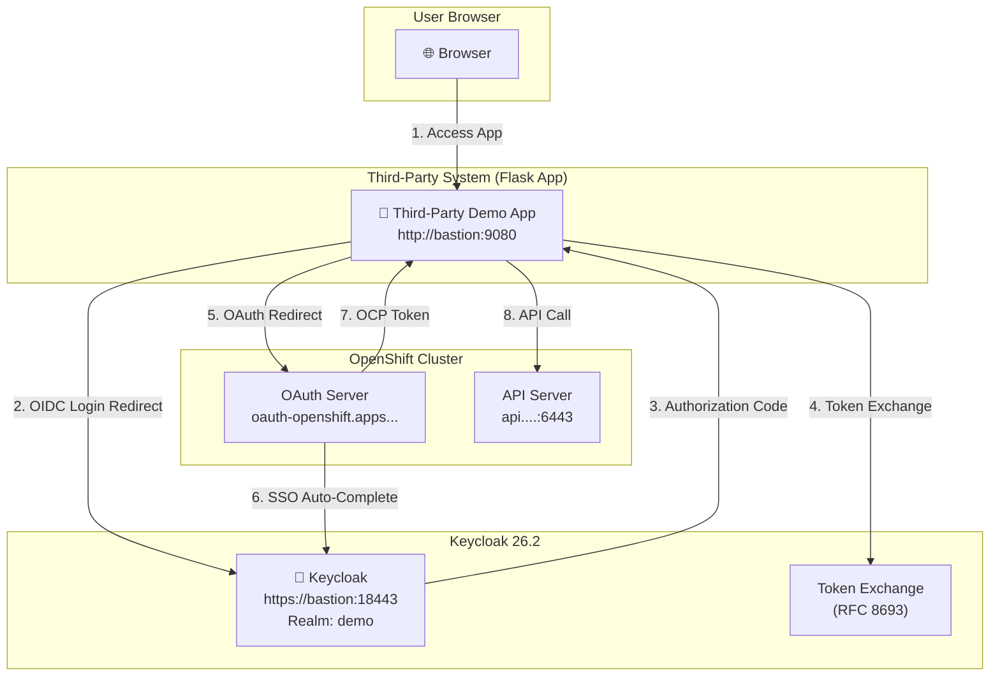
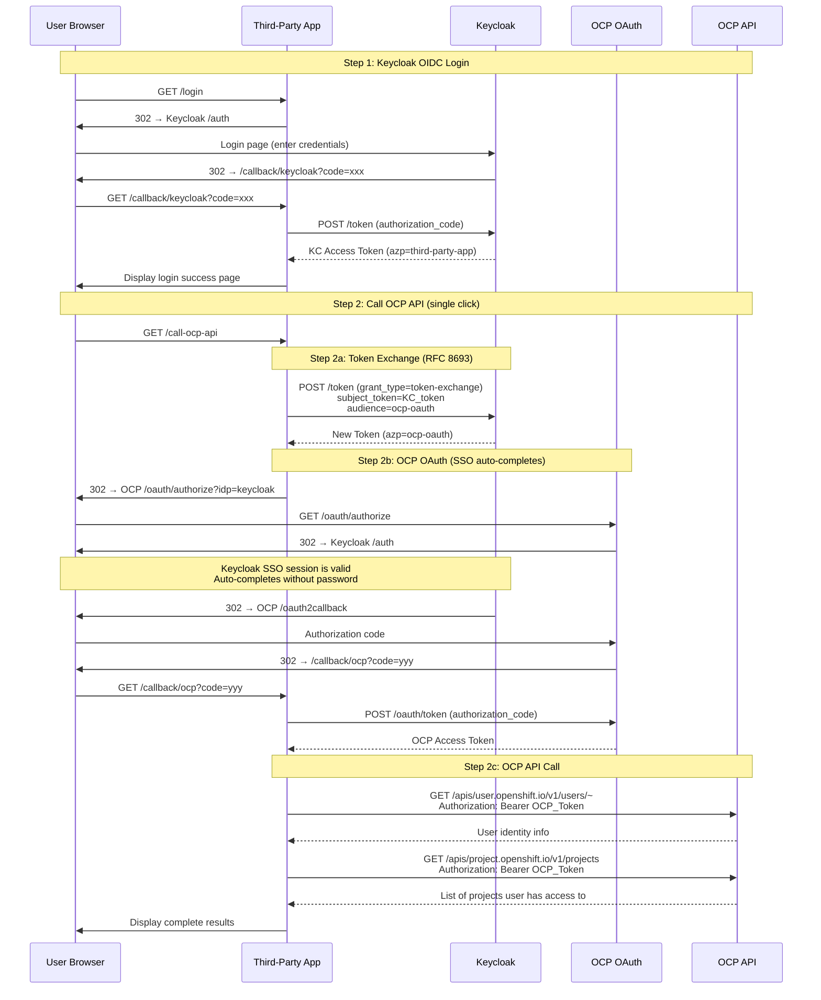

# Third-Party System Accessing OpenShift API via Keycloak SSO — Solution Document

| Field | Value |
|---|---|
| Document Date | 2026-07-02 |
| Environment | ROSA / SNO (OCP 4.x) + Keycloak 26.2 |
| Author | Red Hat Adoption Team |
| Status | PoC Verified |

---

## 1. Background

Customer scenario:

- An OpenShift (OCP) cluster is integrated with an external **Keycloak (Red Hat SSO)** as its OIDC Identity Provider (IdP)
- A **third-party system** also uses the same Keycloak for SSO login
- After user login, the third-party system needs to **call OCP APIs on behalf of the user, respecting the user's RBAC permissions** (e.g., listing Projects the user has access to)
- Using a high-privilege ServiceAccount to proxy operations is not acceptable; the user's own RBAC permissions must be enforced

Core challenge: **The OCP OAuth Server only accepts tokens it issues itself — it does not accept tokens issued directly by Keycloak.** Therefore, the Keycloak token held by the third-party system cannot be used directly for OCP API calls.

---

## 2. Candidate Approaches

We evaluated three technical approaches:

### Approach A: Use Keycloak Token Directly for OCP API

```
User → Third-Party App → Keycloak Login → Get KC Token → Call OCP API directly
```

**Conclusion: Not Feasible ❌**

- OCP API Server only accepts Bearer Tokens issued by the OCP OAuth Server
- Keycloak-issued JWT Tokens are not in OCP's trust chain
- Even though OCP uses Keycloak as an IdP, OCP still issues its own independent tokens through its OAuth Server
- There is no native mechanism to make OCP API Server validate external Keycloak tokens

### Approach B: Keycloak Token Exchange + OCP OAuth Bridge (RFC 8693)

```
User → Third-Party App → Keycloak Login
                       │
                  Token Exchange (RFC 8693)
                  third-party-app → ocp-oauth
                       │
                  OCP OAuth (auto-completed via Keycloak SSO Session)
                       │
                  Get OCP Token → Call OCP API
```

**Conclusion: Feasible ✅ — Implemented as PoC**

- Leverages Keycloak 26.x built-in Token Exchange (RFC 8693) to swap the third-party client's token for a token with the OCP OAuth client audience
- The exchanged token triggers the OCP OAuth authorization flow; since the Keycloak SSO session is still active, the user **does not need to re-enter credentials**
- The resulting OCP Token is issued by the OCP OAuth Server, fully compliant with OCP API validation requirements
- The user's RBAC permissions are fully preserved

### Approach C: ServiceAccount Impersonation

```
User → Third-Party App → Get username
                       │
                  Use high-privilege SA Token
                  + Impersonate-User: <username> Header
                       │
                  Call OCP API
```

**Conclusion: Feasible but Not Recommended ⚠️**

- Requires a high-privilege ServiceAccount with `impersonate` permissions
- Violates the principle of least privilege — the SA can impersonate any user
- If the SA token is leaked, an attacker can impersonate any user in the cluster
- Customer explicitly rejected this approach

### Approach Comparison

| Dimension | Approach A | Approach B (Implemented) | Approach C |
|---|---|---|---|
| Technical Feasibility | ❌ Not feasible | ✅ Feasible | ✅ Feasible |
| Security | N/A | ✅ User's own permissions | ⚠️ Requires high-privilege SA |
| User Experience | N/A | ✅ Passwordless SSO | ✅ Transparent |
| OCP Version Compatibility | N/A | ✅ All 4.x versions | ✅ All 4.x versions |
| Keycloak Requirements | N/A | 26.x + token-exchange feature | No special requirements |
| Compliance | N/A | ✅ Least privilege | ❌ Violates least privilege |
| Complexity | Low | Medium | Low |

---

## 3. Implemented Approach (Approach B) — Detailed Design

### 3.1 Architecture Overview



### 3.2 Detailed Flow



### 3.3 Security Design Highlights

| Item | Design |
|---|---|
| Token Lifecycle | KC Token is cleared from session immediately after Token Exchange |
| Session Size | Only display-ready summaries are stored (< 4KB), avoiding cookie overflow |
| OCP Token Storage | Only first 40 characters stored for display; full token is discarded after use |
| CSRF Protection | OAuth state parameter used for all authorization flows |
| TLS | Keycloak uses self-signed HTTPS; production should use proper CA certificates |
| Permission Scope | Strictly follows user RBAC — no privileged accounts used |

---

## 4. Keycloak Configuration

### 4.1 Environment Information

| Item | Value |
|---|---|
| Keycloak Version | 26.2 |
| Startup Parameters | `start-dev --https-port=8443 --features=token-exchange` |
| Realm | `demo` |
| URL | `https://<bastion-ip>:18443` |
| Admin Account | admin / admin-pass-2026 |

> **Important:** The `--features=token-exchange` flag must be enabled at startup, otherwise the Token Exchange endpoint is unavailable.

### 4.2 Realm Configuration

```json
{
  "realm": "demo",
  "enabled": true,
  "registrationAllowed": false,
  "loginWithEmailAllowed": true,
  "sslRequired": "none",
  "accessTokenLifespan": 1800
}
```

### 4.3 Client: ocp-oauth (Used by OCP OAuth)

This client is used by the OCP OAuth Server to communicate with Keycloak via OIDC.

```json
{
  "clientId": "ocp-oauth",
  "name": "OpenShift OAuth",
  "enabled": true,
  "protocol": "openid-connect",
  "publicClient": false,
  "clientAuthenticatorType": "client-secret",
  "secret": "<ocp-oauth-secret>",
  "standardFlowEnabled": true,
  "directAccessGrantsEnabled": false,
  "serviceAccountsEnabled": true,
  "redirectUris": [
    "https://oauth-openshift.apps.<cluster-domain>/oauth2callback/keycloak"
  ],
  "webOrigins": ["+"],
  "attributes": {
    "token.exchange.standard.enabled": "true"
  }
}
```

**Key configuration points:**

- `serviceAccountsEnabled: true` — Token Exchange requires the target client to have Service Account enabled
- `token.exchange.standard.enabled: true` — Enables standard Token Exchange (RFC 8693)
- `redirectUris` — Must include the OCP OAuth callback URL, formatted as `https://oauth-openshift.apps.<domain>/oauth2callback/<idp-name>`

### 4.4 Client: third-party-app (Used by Third-Party Application)

This client is used by the third-party Demo App for OIDC login and initiating Token Exchange.

```json
{
  "clientId": "third-party-app",
  "name": "Third-Party Demo App",
  "enabled": true,
  "protocol": "openid-connect",
  "publicClient": false,
  "clientAuthenticatorType": "client-secret",
  "secret": "<third-party-app-secret>",
  "standardFlowEnabled": true,
  "directAccessGrantsEnabled": true,
  "redirectUris": [
    "http://<bastion-ip>:9080/callback/keycloak",
    "http://localhost:8080/callback/keycloak"
  ],
  "webOrigins": ["+"],
  "attributes": {
    "token.exchange.standard.enabled": "true",
    "post.logout.redirect.uris": "http://<bastion-ip>:9080/*##http://localhost:8080/*"
  }
}
```

**Key configuration points:**

- `token.exchange.standard.enabled: true` — Allows this client to initiate Token Exchange
- `post.logout.redirect.uris` — Keycloak 26.x uses this attribute to control post-logout redirect URIs; multiple URIs are separated with `##`
- `directAccessGrantsEnabled: true` — Optional, useful for debugging and testing

### 4.5 Token Exchange Configuration Essentials

Key points for configuring Token Exchange in Keycloak 26.x:

1. **Startup parameter**: `--features=token-exchange`
2. **Source client** (`third-party-app`) must have `token.exchange.standard.enabled: true`
3. **Target client** (`ocp-oauth`) must have:
   - `token.exchange.standard.enabled: true`
   - `serviceAccountsEnabled: true`
4. **Token Exchange request format**:

```http
POST /realms/demo/protocol/openid-connect/token
Content-Type: application/x-www-form-urlencoded

grant_type=urn:ietf:params:oauth:grant-type:token-exchange
&subject_token=<kc-access-token>
&subject_token_type=urn:ietf:params:oauth:token-type:access_token
&requested_token_type=urn:ietf:params:oauth:token-type:access_token
&client_id=ocp-oauth
&client_secret=<ocp-oauth-secret>
```

5. **Response**:

```json
{
  "access_token": "<new-token-with-azp=ocp-oauth>",
  "issued_token_type": "urn:ietf:params:oauth:token-type:access_token",
  "token_type": "Bearer",
  "expires_in": 1800
}
```

> Note: In Keycloak 26.x, the Token Exchange authorization model has been simplified from the legacy Fine-Grained Permissions to client attribute flags. For earlier versions of Keycloak (< 25), you need to manually configure Token Exchange Policies under Realm → Permissions.

### 4.6 User Accounts

| User | Password | Description |
|---|---|---|
| user-a | demo | Alice — can view project-a, project-c |
| user-b | demo | Bob — can edit project-b |
| user-c | demo | Charlie — admin on project-c, view on project-a, project-b |

---

## 5. OCP Configuration

### 5.1 OAuth IdP Configuration

OCP must be configured with Keycloak as an OpenID Connect Identity Provider:

```yaml
apiVersion: config.openshift.io/v1
kind: OAuth
metadata:
  name: cluster
spec:
  identityProviders:
    - name: keycloak
      mappingMethod: claim
      type: OpenID
      openID:
        clientID: ocp-oauth
        clientSecret:
          name: keycloak-client-secret   # Secret in openshift-config namespace
        ca:
          name: keycloak-ca              # ConfigMap with Keycloak CA cert
        issuer: https://<bastion-ip>:18443/realms/demo
        claims:
          preferredUsername:
            - preferred_username
          name:
            - name
          email:
            - email
```

**Prerequisites:**

```bash
# Create client secret
oc create secret generic keycloak-client-secret \
  --from-literal=clientSecret=<ocp-oauth-secret> \
  -n openshift-config

# Create CA ConfigMap (self-signed certificate scenario)
oc create configmap keycloak-ca \
  --from-file=ca.crt=certs/tls.crt \
  -n openshift-config
```

### 5.2 OAuthClient (Third-Party Application Registration)

The third-party application must be registered as an OAuthClient in OCP to obtain tokens via OCP OAuth:

```yaml
apiVersion: oauth.openshift.io/v1
kind: OAuthClient
metadata:
  name: third-party-demo
grantMethod: auto
secret: <ocp-oauthclient-secret>
redirectURIs:
  - http://<bastion-ip>:9080/callback/ocp
  - http://localhost:8080/callback/ocp
```

- `grantMethod: auto` — Automatically approve authorization without showing a consent screen
- `redirectURIs` — Must include the third-party application's OCP callback URL

### 5.3 RBAC Configuration

Different users are assigned different Project permissions to verify that API call results correctly reflect user permissions:

```bash
# Create Projects
oc new-project project-a
oc new-project project-b
oc new-project project-c

# user-a (Alice): view → project-a, project-c
oc adm policy add-role-to-user view user-a -n project-a
oc adm policy add-role-to-user view user-a -n project-c

# user-b (Bob): edit → project-b
oc adm policy add-role-to-user edit user-b -n project-b

# user-c (Charlie): admin → project-c, view → project-a, project-b
oc adm policy add-role-to-user admin user-c -n project-c
oc adm policy add-role-to-user view  user-c -n project-a
oc adm policy add-role-to-user view  user-c -n project-b
```

**Expected API call results:**

| User | Visible Projects |
|---|---|
| user-a (Alice) | project-a, project-c |
| user-b (Bob) | project-b |
| user-c (Charlie) | project-a, project-b, project-c |

---

## 6. Third-Party System Implementation Details

### 6.1 Technology Stack

| Item | Technology |
|---|---|
| Language / Framework | Python 3.12 / Flask |
| WSGI Server | Gunicorn (2 workers) |
| Container Base Image | `registry.access.redhat.com/ubi9/python-312` |
| Session Management | Flask client-side session (Cookie-based) |
| HTTP Client | requests |

### 6.2 Core Routes

```
GET  /                    → Home page (shows different content based on login state)
GET  /login               → Redirect to Keycloak OIDC authorization endpoint
GET  /callback/keycloak   → Keycloak OIDC callback, exchange code for KC Token
GET  /call-ocp-api        → Single-click trigger: Token Exchange → OCP OAuth → API call
GET  /callback/ocp        → OCP OAuth callback, exchange code for OCP Token + call API
GET  /logout              → Clear session + Keycloak logout
GET  /health              → Health check endpoint
```

### 6.3 Key Implementation Details

#### 6.3.1 Token Exchange Implementation

```python
# Step 2a: Token Exchange (RFC 8693)
resp = requests.post(KC_TOKEN_URL, data={
    "grant_type": "urn:ietf:params:oauth:grant-type:token-exchange",
    "subject_token": kc_access_token,       # User's KC Token
    "subject_token_type": "urn:ietf:params:oauth:token-type:access_token",
    "requested_token_type": "urn:ietf:params:oauth:token-type:access_token",
    "client_id": "ocp-oauth",               # Target Client ID
    "client_secret": "<ocp-oauth-secret>",   # Target Client Secret
}, verify=TLS_VERIFY)
```

#### 6.3.2 OCP OAuth Redirect (Skip IdP Selection Page)

```python
# Step 2b: Redirect to OCP OAuth, specifying keycloak IdP
params = {
    "client_id": "third-party-demo",
    "idp": "keycloak",           # Key: skip IdP selection page
    "response_type": "code",
    "redirect_uri": APP_URL + "/callback/ocp",
    "state": state,
}
redirect(f"{OCP_OAUTH_URL}/oauth/authorize?{urlencode(params)}")
```

> **Important:** If OCP has multiple IdPs configured (e.g., kube:admin + keycloak), not specifying the `idp` parameter will display the IdP selection page, requiring the user to manually choose — breaking the SSO experience.

#### 6.3.3 Session Cookie Size Control

Flask's client-side session stores data in cookies with a ~4KB size limit. JWT Tokens typically exceed 1KB, and storing multiple tokens easily exceeds this limit.

**Solution:**

1. Clear the original KC Token immediately after Token Exchange:
   ```python
   session.pop("kc_access_token", None)
   ```

2. Store only the first 40 characters of the OCP Token for display:
   ```python
   session["ocp_token"] = ocp_token[:40]
   ```

3. After decoding tokens, store only essential field summaries (sub, aud, azp, etc.), not the full JWT

#### 6.3.4 Logout Flow

```python
@app.route("/logout")
def logout():
    session.clear()
    params = {
        "client_id": "third-party-app",
        "post_logout_redirect_uri": APP_URL + "/",
    }
    return redirect(f"{KC_LOGOUT_URL}?{urlencode(params)}")
```

> **Note:** Keycloak 26.x's `post_logout_redirect_uri` no longer uses the client's `redirectUris`. Instead, it uses the separate `post.logout.redirect.uris` client attribute. If this attribute is not set, logout will display an "Invalid redirect uri" error.

### 6.4 Environment Variables

| Variable | Description | Example Value |
|---|---|---|
| `KC_BASE_URL` | Keycloak base URL | `https://bastion:18443` |
| `KC_REALM` | Keycloak Realm name | `demo` |
| `KC_CLIENT_ID` | Third-party App Client ID | `third-party-app` |
| `KC_CLIENT_SECRET` | Third-party App Client Secret | `***` |
| `KC_OCP_CLIENT_ID` | OCP OAuth Client ID (Token Exchange target) | `ocp-oauth` |
| `KC_OCP_CLIENT_SECRET` | OCP OAuth Client Secret | `***` |
| `OCP_API_URL` | OCP API Server URL | `https://api.<domain>:6443` |
| `OCP_OAUTH_URL` | OCP OAuth Server URL | `https://oauth-openshift.apps.<domain>` |
| `OCP_OAUTH_CLIENT_ID` | OCP OAuthClient name | `third-party-demo` |
| `OCP_OAUTH_CLIENT_SECRET` | OCP OAuthClient Secret | `***` |
| `OCP_IDP_NAME` | Name of Keycloak IdP on OCP | `keycloak` |
| `APP_EXTERNAL_URL` | Application's externally accessible URL | `http://bastion:9080` |
| `TLS_VERIFY` | Whether to verify TLS certificates | `false` (PoC only) |
| `FLASK_SECRET_KEY` | Flask session encryption key | Randomly generated |

### 6.5 Dockerfile

```dockerfile
FROM registry.access.redhat.com/ubi9/python-312:latest
WORKDIR /opt/app-root/src
COPY requirements.txt .
RUN pip install --no-cache-dir -r requirements.txt
COPY . .
EXPOSE 8080
CMD ["gunicorn", "--bind", "0.0.0.0:8080", "--workers", "2", "--timeout", "120", "app:app"]
```

---

## 7. Deployment Procedure

Use the `deploy-all.sh` script to deploy everything on the bastion host:

```bash
bash baremetal/deploy-all.sh all
```

Or execute step by step:

| Step | Command | Description |
|---|---|---|
| Step 1 | `bash deploy-all.sh step1` | Generate TLS self-signed certificates, start Keycloak container |
| Step 2 | `bash deploy-all.sh step2` | Configure Keycloak Realm, Clients, user accounts |
| Step 3 | `bash deploy-all.sh step3` | Configure OCP OAuth IdP + OAuthClient |
| Step 4 | `bash deploy-all.sh step4` | Build and start third-party Demo App container |
| Step 5 | `bash deploy-all.sh step5` | Configure OCP RBAC (Projects + RoleBindings) |

Check status after deployment:

```bash
bash deploy-all.sh status
```

---

## 8. Verification Results

### 8.1 Verification Matrix

| User | Login | Token Exchange | OCP Token | API Result | Expected Projects |
|---|---|---|---|---|---|
| user-a (Alice) | ✅ | ✅ | ✅ | ✅ | project-a, project-c |
| user-b (Bob) | ✅ | ✅ | ✅ | ✅ | project-b |
| user-c (Charlie) | ✅ | ✅ | ✅ | ✅ | project-a, project-b, project-c |

### 8.2 Verification Steps

1. Open browser and navigate to `http://<bastion-ip>:9080`
2. Click "Login via Keycloak SSO", sign in with user-a / demo
3. After successful login, the page displays Keycloak Token information (azp=third-party-app)
4. Click the "Call OCP API" button
5. The system automatically completes 3 sub-steps, displaying:
   - Step 2a: Token Exchange result (new token azp=ocp-oauth)
   - Step 2b: OCP Token and user identity information
   - Step 2c: List of Projects the user has access to
6. Verify the Project list matches expected RBAC configuration
7. Logout and repeat verification with other users

---

## 9. Production Considerations

| Item | PoC Status | Production Recommendation |
|---|---|---|
| TLS Certificates | Self-signed | Use certificates from a proper CA |
| Keycloak Deployment | `start-dev` mode + H2 embedded DB | `start` production mode + PostgreSQL |
| Session Management | Flask client-side (Cookie) | Use server-side sessions (e.g., Redis) |
| Client Secrets | Hardcoded in scripts | Use Vault or OCP Secret management |
| High Availability | Single container | Keycloak cluster + multi-replica App on OCP |
| Token Lifetime | 1800 seconds | Adjust per business needs; implement Refresh Token flow |
| Error Handling | Basic error messages | Comprehensive error handling, retry mechanisms, user-friendly messages |
| Logging & Monitoring | Flask standard logging | Integrate with ELK / Loki + Prometheus metrics |
| `sslRequired` | `none` | Set to `external` or `all` |

---

## 10. Source Code Listing

### 10.1 app.py (Complete)

```python
"""
Third-Party Demo App — Keycloak SSO + OpenShift API Integration
Demonstrates Plan B: Keycloak Token Exchange (RFC 8693) + OCP OAuth bridge

Flow:
  1. User logs in via Keycloak OIDC
  2. User clicks "Call OCP API" — server-side chain:
     a. Token Exchange (RFC 8693): swap KC token for ocp-oauth audience
     b. OCP OAuth: redirect to OCP → Keycloak SSO auto-completes → get OCP token
     c. OCP API call: GET /apis/project.openshift.io/v1/projects
  3. Result page shows all 3 sub-steps completed + project list
"""

import os
import json
import secrets
import logging
from urllib.parse import urlencode

import requests
from flask import Flask, redirect, request, session, render_template, url_for, jsonify

app = Flask(__name__)
app.secret_key = os.environ.get("FLASK_SECRET_KEY", secrets.token_hex(32))

logging.basicConfig(level=logging.DEBUG)
log = logging.getLogger(__name__)

# ---------------------------------------------------------------------------
# Configuration (from environment variables)
# ---------------------------------------------------------------------------

# Keycloak
KC_BASE        = os.environ["KC_BASE_URL"]
KC_REALM       = os.environ.get("KC_REALM", "demo")
KC_CLIENT_ID   = os.environ.get("KC_CLIENT_ID", "third-party-app")
KC_CLIENT_SECRET = os.environ["KC_CLIENT_SECRET"]

# OpenShift
OCP_API_URL    = os.environ["OCP_API_URL"]
OCP_OAUTH_URL  = os.environ.get("OCP_OAUTH_URL", "")
OCP_OAUTH_CLIENT_ID = os.environ.get("OCP_OAUTH_CLIENT_ID", "third-party-demo")
OCP_OAUTH_CLIENT_SECRET = os.environ.get("OCP_OAUTH_CLIENT_SECRET", "")
OCP_IDP_NAME   = os.environ.get("OCP_IDP_NAME", "keycloak")

# Token Exchange target audience (the Keycloak client used by OCP OAuth)
KC_OCP_CLIENT_ID = os.environ.get("KC_OCP_CLIENT_ID", "ocp-oauth")
KC_OCP_CLIENT_SECRET = os.environ.get("KC_OCP_CLIENT_SECRET", "")

# Derived URLs
KC_OPENID_BASE = f"{KC_BASE}/realms/{KC_REALM}/protocol/openid-connect"
KC_AUTH_URL     = f"{KC_OPENID_BASE}/auth"
KC_TOKEN_URL    = f"{KC_OPENID_BASE}/token"
KC_USERINFO_URL = f"{KC_OPENID_BASE}/userinfo"
KC_LOGOUT_URL   = f"{KC_OPENID_BASE}/logout"

# TLS verification (set to "false" for self-signed certs in PoC)
TLS_VERIFY = os.environ.get("TLS_VERIFY", "true").lower() != "false"

# ---------------------------------------------------------------------------
# Helpers
# ---------------------------------------------------------------------------

def _app_url(path: str) -> str:
    """Build absolute callback URL for this app."""
    base = os.environ.get("APP_EXTERNAL_URL", request.host_url.rstrip("/"))
    return f"{base}{path}"


def _decode_jwt_payload(token: str) -> dict:
    """Decode JWT payload without signature verification (display only)."""
    import base64
    parts = token.split(".")
    if len(parts) < 2:
        return {}
    payload = parts[1]
    payload += "=" * (4 - len(payload) % 4)
    try:
        return json.loads(base64.urlsafe_b64decode(payload))
    except Exception:
        return {}

# ---------------------------------------------------------------------------
# Routes — Keycloak OIDC Login
# ---------------------------------------------------------------------------

@app.route("/")
def index():
    """Landing page."""
    return render_template("index.html",
                           user=session.get("user"),
                           kc_token_info=session.get("kc_token_info"),
                           exchanged_token_info=session.get("exchanged_token_info"),
                           ocp_token=session.get("ocp_token"),
                           ocp_projects=session.get("ocp_projects"),
                           ocp_user=session.get("ocp_user"),
                           ocp_api_called=session.get("ocp_api_called"),
                           error=session.pop("error", None))


@app.route("/login")
def login():
    """Step 1: Redirect to Keycloak for OIDC login."""
    state = secrets.token_urlsafe(32)
    session["oauth_state"] = state
    params = {
        "client_id": KC_CLIENT_ID,
        "response_type": "code",
        "scope": "openid profile email",
        "redirect_uri": _app_url("/callback/keycloak"),
        "state": state,
    }
    return redirect(f"{KC_AUTH_URL}?{urlencode(params)}")


@app.route("/callback/keycloak")
def callback_keycloak():
    """Keycloak OIDC callback — exchange code for tokens."""
    if request.args.get("state") != session.pop("oauth_state", None):
        session["error"] = "Invalid OAuth state"
        return redirect(url_for("index"))

    code = request.args.get("code")
    if not code:
        session["error"] = f"No authorization code. Error: {request.args.get('error_description', 'unknown')}"
        return redirect(url_for("index"))

    resp = requests.post(KC_TOKEN_URL, data={
        "grant_type": "authorization_code",
        "client_id": KC_CLIENT_ID,
        "client_secret": KC_CLIENT_SECRET,
        "code": code,
        "redirect_uri": _app_url("/callback/keycloak"),
    }, verify=TLS_VERIFY)

    if resp.status_code != 200:
        session["error"] = f"Token exchange failed: {resp.text}"
        return redirect(url_for("index"))

    tokens = resp.json()
    access_token = tokens["access_token"]
    token_payload = _decode_jwt_payload(access_token)

    session["kc_access_token"] = access_token
    session["user"] = token_payload.get("preferred_username", token_payload.get("sub", "unknown"))
    session["kc_token_info"] = {
        "sub": token_payload.get("sub"),
        "preferred_username": token_payload.get("preferred_username"),
        "email": token_payload.get("email"),
        "aud": token_payload.get("aud"),
        "azp": token_payload.get("azp"),
        "scope": token_payload.get("scope"),
        "exp": token_payload.get("exp"),
        "iss": token_payload.get("iss"),
    }

    # Clear previous OCP data
    for key in ("exchanged_token_info", "ocp_token", "ocp_projects", "ocp_user", "ocp_api_called"):
        session.pop(key, None)

    log.info("User %s logged in via Keycloak", session["user"])
    return redirect(url_for("index"))

# ---------------------------------------------------------------------------
# Routes — Combined "Call OCP API" (Token Exchange + OCP OAuth + API call)
# ---------------------------------------------------------------------------

@app.route("/call-ocp-api")
def call_ocp_api():
    """Single button: Token Exchange → OCP OAuth → API call."""
    kc_token = session.get("kc_access_token")
    if not kc_token:
        session["error"] = "Not logged in. Please log in via Keycloak SSO first."
        return redirect(url_for("index"))

    # --- Sub-step a: Token Exchange (RFC 8693) ---
    resp = requests.post(KC_TOKEN_URL, data={
        "grant_type": "urn:ietf:params:oauth:grant-type:token-exchange",
        "subject_token": kc_token,
        "subject_token_type": "urn:ietf:params:oauth:token-type:access_token",
        "requested_token_type": "urn:ietf:params:oauth:token-type:access_token",
        "client_id": KC_OCP_CLIENT_ID,
        "client_secret": KC_OCP_CLIENT_SECRET,
    }, verify=TLS_VERIFY)

    if resp.status_code != 200:
        log.error("Token exchange failed: %s %s", resp.status_code, resp.text)
        session["error"] = f"Token Exchange failed ({resp.status_code}): {resp.text}"
        return redirect(url_for("index"))

    exchanged = resp.json()
    exchanged_token = exchanged["access_token"]
    payload = _decode_jwt_payload(exchanged_token)

    session["exchanged_token_info"] = {
        "sub": payload.get("sub"),
        "preferred_username": payload.get("preferred_username"),
        "aud": payload.get("aud"),
        "azp": payload.get("azp"),
        "scope": payload.get("scope"),
        "iss": payload.get("iss"),
        "token_type": exchanged.get("token_type"),
        "issued_token_type": exchanged.get("issued_token_type"),
    }

    # Clear kc_access_token — no longer needed, saves cookie space
    session.pop("kc_access_token", None)

    log.info("Token exchanged for audience=%s", KC_OCP_CLIENT_ID)

    # --- Sub-step b: Redirect to OCP OAuth ---
    if not OCP_OAUTH_URL:
        session["error"] = "OCP_OAUTH_URL not configured"
        return redirect(url_for("index"))

    state = secrets.token_urlsafe(32)
    session["ocp_oauth_state"] = state
    params = {
        "client_id": OCP_OAUTH_CLIENT_ID,
        "idp": OCP_IDP_NAME,
        "response_type": "code",
        "redirect_uri": _app_url("/callback/ocp"),
        "state": state,
    }
    authorize_url = f"{OCP_OAUTH_URL}/oauth/authorize?{urlencode(params)}"
    return redirect(authorize_url)


@app.route("/callback/ocp")
def callback_ocp():
    """OCP OAuth callback — exchange code for OCP token, then call OCP API."""
    if request.args.get("state") != session.pop("ocp_oauth_state", None):
        session["error"] = "Invalid OCP OAuth state"
        return redirect(url_for("index"))

    code = request.args.get("code")
    if not code:
        session["error"] = f"No OCP authorization code. Error: {request.args.get('error_description', 'unknown')}"
        return redirect(url_for("index"))

    # Exchange code for OCP token
    resp = requests.post(f"{OCP_OAUTH_URL}/oauth/token", data={
        "grant_type": "authorization_code",
        "client_id": OCP_OAUTH_CLIENT_ID,
        "client_secret": OCP_OAUTH_CLIENT_SECRET,
        "code": code,
        "redirect_uri": _app_url("/callback/ocp"),
    }, verify=TLS_VERIFY)

    if resp.status_code != 200:
        log.error("OCP token exchange failed: %s %s", resp.status_code, resp.text)
        session["error"] = f"OCP token exchange failed ({resp.status_code}): {resp.text}"
        return redirect(url_for("index"))

    ocp_tokens = resp.json()
    ocp_token = ocp_tokens.get("access_token", "")
    session["ocp_token"] = ocp_token[:40]  # Store truncated for display only
    log.info("Got OCP token: %s...", ocp_token[:20] if ocp_token else "empty")

    # --- Sub-step c: Call OCP API ---
    _fetch_ocp_user(ocp_token)
    _fetch_ocp_projects(ocp_token)

    # Record which API was called
    session["ocp_api_called"] = {
        "method": "GET",
        "url": f"{OCP_API_URL}/apis/project.openshift.io/v1/projects",
        "description": "List OpenShift Projects the current user has access to",
        "user_api_url": f"{OCP_API_URL}/apis/user.openshift.io/v1/users/~",
        "user_api_description": "Get current OCP user identity",
    }

    # Clear large tokens to keep session cookie under 4KB
    session.pop("kc_access_token", None)
    session.pop("exchanged_access_token", None)

    return redirect(url_for("index"))


def _fetch_ocp_user(token: str):
    """Get current OCP user identity."""
    try:
        resp = requests.get(
            f"{OCP_API_URL}/apis/user.openshift.io/v1/users/~",
            headers={"Authorization": f"Bearer {token}"},
            verify=TLS_VERIFY,
        )
        if resp.status_code == 200:
            user_data = resp.json()
            session["ocp_user"] = {
                "name": user_data.get("metadata", {}).get("name", ""),
                "uid": user_data.get("metadata", {}).get("uid", ""),
                "fullName": user_data.get("fullName", ""),
                "identities": user_data.get("identities", []),
                "groups": user_data.get("groups", []),
            }
        else:
            log.warning("Failed to fetch OCP user: %s %s", resp.status_code, resp.text)
    except Exception as e:
        log.error("Error fetching OCP user: %s", e)


def _fetch_ocp_projects(token: str):
    """Get OCP projects the user has access to."""
    try:
        resp = requests.get(
            f"{OCP_API_URL}/apis/project.openshift.io/v1/projects",
            headers={"Authorization": f"Bearer {token}"},
            verify=TLS_VERIFY,
        )
        if resp.status_code == 200:
            data = resp.json()
            projects = []
            for item in data.get("items", []):
                projects.append({
                    "name": item["metadata"]["name"],
                    "status": item.get("status", {}).get("phase", ""),
                    "display_name": item["metadata"].get("annotations", {}).get(
                        "openshift.io/display-name", ""),
                })
            session["ocp_projects"] = projects
        else:
            log.warning("Failed to fetch projects: %s %s", resp.status_code, resp.text)
            session["ocp_projects"] = []
    except Exception as e:
        log.error("Error fetching projects: %s", e)
        session["ocp_projects"] = []

# ---------------------------------------------------------------------------
# Routes — Logout & API
# ---------------------------------------------------------------------------

@app.route("/logout")
def logout():
    """Logout from the app and Keycloak (clear all sessions)."""
    session.clear()
    params = {
        "client_id": KC_CLIENT_ID,
        "post_logout_redirect_uri": _app_url("/"),
    }
    return redirect(f"{KC_LOGOUT_URL}?{urlencode(params)}")


@app.route("/health")
def health():
    return jsonify({"status": "ok"})


# ---------------------------------------------------------------------------
# Main
# ---------------------------------------------------------------------------

if __name__ == "__main__":
    port = int(os.environ.get("PORT", "8080"))
    app.run(host="0.0.0.0", port=port, debug=True)
```

### 10.2 deploy-all.sh (Complete)

The complete deployment script is available at `baremetal/deploy-all.sh` in the project directory. It includes 5-step automated deployment (TLS certificates, Keycloak configuration, OCP OAuth, Demo App build, RBAC configuration), plus `status` and `clean` management commands.

### 10.3 index.html (Complete)

The frontend is a single HTML template (Jinja2) with a Traditional Chinese (Taiwan) interface. It includes:
- Not logged in: Welcome page + architecture diagram
- Logged in, API not called: Keycloak Token information + Call OCP API button
- Complete results: 3 sub-step results + Project list

The complete content is available at `demo-app/templates/index.html` in the project directory.

---

## 11. Troubleshooting FAQ

### Q1: Token Exchange returns 403 or 400

**Causes:**
- Keycloak was not started with `--features=token-exchange`
- Target client (ocp-oauth) does not have `token.exchange.standard.enabled: true`
- Target client does not have `serviceAccountsEnabled` enabled

**Troubleshooting:**
```bash
# Verify Keycloak startup parameters include --features=token-exchange
podman inspect keycloak | jq '.[0].Config.Cmd'

# Verify client attributes
curl -sk -H "Authorization: Bearer $TOKEN" \
  "$KC_URL/admin/realms/demo/clients?clientId=ocp-oauth" | jq '.[0].attributes'
```

### Q2: OCP OAuth shows IdP selection page

**Cause:** OCP has multiple IdPs configured (e.g., kube:admin + keycloak) and the `idp` parameter was not specified.

**Solution:** Add `idp=keycloak` to the OCP OAuth authorization request.

### Q3: Logout shows "Invalid redirect uri"

**Cause:** Keycloak 26.x requires `post_logout_redirect_uri` to be explicitly set in the client's `post.logout.redirect.uris` attribute.

**Solution:** Set the client attribute via Keycloak Admin API or Console:
```json
{
  "attributes": {
    "post.logout.redirect.uris": "http://bastion:9080/*##http://localhost:8080/*"
  }
}
```
> Multiple URIs are separated with `##`.

### Q4: Session cookie exceeds 4KB causing data loss

**Cause:** Flask client-side session serializes all data into cookies. JWT Tokens are too large.

**Solution:** Clear tokens from session immediately after use; store only display summaries. For production, switch to server-side sessions (e.g., Redis).

---

## 12. References

| Resource | Link |
|---|---|
| RFC 8693 - OAuth Token Exchange | https://datatracker.ietf.org/doc/html/rfc8693 |
| Keycloak Token Exchange Documentation | https://www.keycloak.org/docs/latest/securing_apps/#_token-exchange |
| OCP OAuth Server Documentation | https://docs.openshift.com/container-platform/latest/authentication/configuring-internal-oauth.html |
| OCP OIDC IdP Configuration | https://docs.openshift.com/container-platform/latest/authentication/identity_providers/configuring-oidc-identity-provider.html |
| OCP OAuthClient Documentation | https://docs.openshift.com/container-platform/latest/authentication/configuring-oauth-clients.html |

---

*End of Document*
