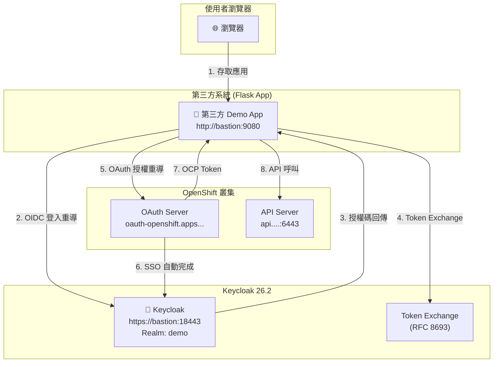
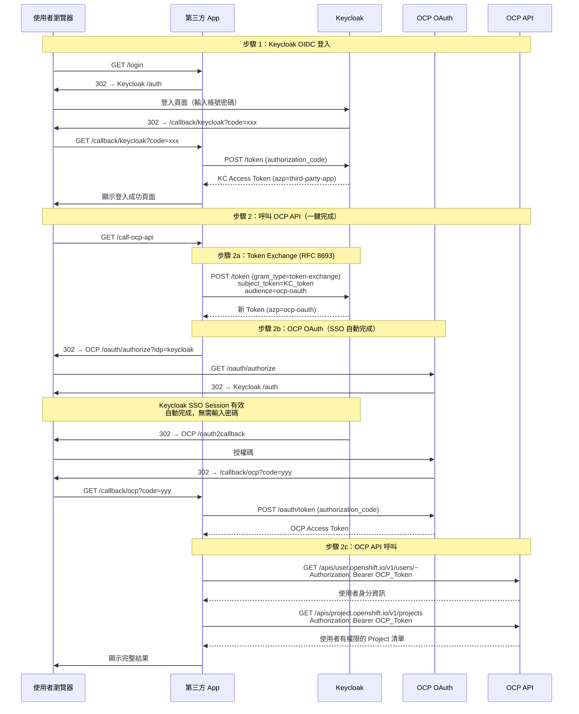

# 第三方系統透過 Keycloak SSO 存取 OpenShift API — 解決方案

| 欄位 | 值 |
|---|---|
| 文件日期 | 2026-07-02 |
| 環境 | ROSA / SNO (OCP 4.x) + Keycloak 26.2 |
| 作者 | Red Hat Adoption Team |
| 狀態 | PoC 已驗證通過 |

---

## 1. 需求背景

客戶場景：

- OpenShift (OCP) 叢集已整合外部 **Keycloak (Red Hat SSO)** 作為 OIDC 身分提供者 (IdP)
- 存在一個**第三方系統**，同樣使用該 Keycloak 進行 SSO 登入
- 第三方系統需要在使用者登入後，**以該使用者的身分與權限**呼叫 OCP API（例如：列出使用者有權限的 Projects）
- 不允許使用高權限 ServiceAccount 代理操作，必須遵守使用者本身的 RBAC 權限

核心挑戰：**OCP OAuth Server 只接受自己簽發的 Token，不接受 Keycloak 直接簽發的 Token。** 因此第三方系統持有的 Keycloak Token 無法直接用於 OCP API 呼叫。

---

## 2. 候選方案分析

我們評估了三種技術路線：

### 方案 A：直接使用 Keycloak Token 呼叫 OCP API

```
使用者 → 第三方 App → Keycloak 登入 → 取得 KC Token → 直接呼叫 OCP API
```

**結論：不可行 ❌**

- OCP API Server 僅接受 OCP OAuth Server 簽發的 Bearer Token
- Keycloak 簽發的 JWT Token 不在 OCP 的信任鏈中
- 即使 OCP 使用 Keycloak 作為 IdP，OCP 仍然透過自己的 OAuth Server 簽發獨立的 Token
- 沒有原生機制可以讓 OCP API Server 直接驗證外部 Keycloak Token

### 方案 B：Keycloak Token Exchange + OCP OAuth 橋接（RFC 8693）

```
使用者 → 第三方 App → Keycloak 登入
                       │
                  Token Exchange (RFC 8693)
                  third-party-app → ocp-oauth
                       │
                  OCP OAuth（透過 Keycloak SSO Session 自動完成）
                       │
                  取得 OCP Token → 呼叫 OCP API
```

**結論：可行 ✅ — 已實作為 PoC**

- 利用 Keycloak 26.x 內建的 Token Exchange 功能（RFC 8693），將第三方 Client 的 Token 換取為 OCP OAuth Client 受眾的 Token
- 換取後的 Token 觸發 OCP OAuth 授權流程，因 Keycloak SSO Session 仍然有效，使用者**無需再次輸入密碼**
- 最終取得的 OCP Token 是 OCP OAuth Server 簽發的，完全符合 OCP API 的驗證要求
- 使用者的 RBAC 權限完整保留

### 方案 C：ServiceAccount 模擬（Impersonation）

```
使用者 → 第三方 App → 取得使用者名稱
                       │
                  使用高權限 SA Token
                  + Impersonate-User: <username> Header
                       │
                  呼叫 OCP API
```

**結論：可行但不推薦 ⚠️**

- 需要一個具有 `impersonate` 權限的高權限 ServiceAccount
- 違反最小權限原則，該 SA 可以模擬任何使用者
- 如果 SA Token 洩露，攻擊者可以冒充叢集中的任何使用者
- 客戶明確拒絕此方案

### 方案比較表

| 維度 | 方案 A | 方案 B（已實作） | 方案 C |
|---|---|---|---|
| 技術可行性 | ❌ 不可行 | ✅ 可行 | ✅ 可行 |
| 安全性 | N/A | ✅ 使用者自身權限 | ⚠️ 需高權限 SA |
| 使用者體驗 | N/A | ✅ 無密碼 SSO | ✅ 透明 |
| OCP 版本相容 | N/A | ✅ 4.x 全系列 | ✅ 4.x 全系列 |
| Keycloak 要求 | N/A | 26.x + token-exchange feature | 無特殊要求 |
| 合規性 | N/A | ✅ 符合最小權限 | ❌ 違反最小權限 |
| 複雜度 | 低 | 中 | 低 |

---

## 3. 已實作方案詳述（方案 B）

### 3.1 整體架構



### 3.2 詳細流程



### 3.3 安全設計要點

| 項目 | 設計 |
|---|---|
| Token 生命週期 | KC Token 在 Token Exchange 後立即從 Session 清除 |
| Session 大小 | 僅保留顯示用的摘要資訊（< 4KB），避免 Cookie 超限 |
| OCP Token 儲存 | 僅保留前 40 字元用於顯示，完整 Token 用完即棄 |
| CSRF 防護 | OAuth state 參數用於所有授權流程 |
| TLS | Keycloak 使用自簽 HTTPS；生產環境應使用正式 CA 憑證 |
| 權限範圍 | 嚴格遵循使用者 RBAC，不使用任何特權帳號 |

---

## 4. Keycloak 配置

### 4.1 環境資訊

| 項目 | 值 |
|---|---|
| Keycloak 版本 | 26.2 |
| 啟動參數 | `start-dev --https-port=8443 --features=token-exchange` |
| Realm | `demo` |
| 位址 | `https://<bastion-ip>:18443` |
| 管理帳號 | admin / admin-pass-2026 |

> **重要：** 必須在啟動時啟用 `--features=token-exchange`，否則 Token Exchange 端點不可用。

### 4.2 Realm 設定

```json
{
  "realm": "demo",
  "enabled": true,
  "registrationAllowed": false,
  "loginWithEmailAllowed": true,
  "sslRequired": "none",
  "accessTokenLifespan": 1800
}
```

### 4.3 Client：ocp-oauth（OCP OAuth 使用）

此 Client 是 OCP OAuth Server 用來與 Keycloak 進行 OIDC 通訊的 Client。

```json
{
  "clientId": "ocp-oauth",
  "name": "OpenShift OAuth",
  "enabled": true,
  "protocol": "openid-connect",
  "publicClient": false,
  "clientAuthenticatorType": "client-secret",
  "secret": "<ocp-oauth-secret>",
  "standardFlowEnabled": true,
  "directAccessGrantsEnabled": false,
  "serviceAccountsEnabled": true,
  "redirectUris": [
    "https://oauth-openshift.apps.<cluster-domain>/oauth2callback/keycloak"
  ],
  "webOrigins": ["+"],
  "attributes": {
    "token.exchange.standard.enabled": "true"
  }
}
```

**關鍵配置：**

- `serviceAccountsEnabled: true` — Token Exchange 要求目標 Client 啟用 Service Account
- `token.exchange.standard.enabled: true` — 啟用標準 Token Exchange（RFC 8693）
- `redirectUris` — 必須包含 OCP OAuth 的回呼 URL，格式為 `https://oauth-openshift.apps.<domain>/oauth2callback/<idp-name>`

### 4.4 Client：third-party-app（第三方應用使用）

此 Client 是第三方 Demo App 用來進行 OIDC 登入和發起 Token Exchange 的 Client。

```json
{
  "clientId": "third-party-app",
  "name": "Third-Party Demo App",
  "enabled": true,
  "protocol": "openid-connect",
  "publicClient": false,
  "clientAuthenticatorType": "client-secret",
  "secret": "<third-party-app-secret>",
  "standardFlowEnabled": true,
  "directAccessGrantsEnabled": true,
  "redirectUris": [
    "http://<bastion-ip>:9080/callback/keycloak",
    "http://localhost:8080/callback/keycloak"
  ],
  "webOrigins": ["+"],
  "attributes": {
    "token.exchange.standard.enabled": "true",
    "post.logout.redirect.uris": "http://<bastion-ip>:9080/*##http://localhost:8080/*"
  }
}
```

**關鍵配置：**

- `token.exchange.standard.enabled: true` — 允許此 Client 發起 Token Exchange
- `post.logout.redirect.uris` — Keycloak 26.x 使用此屬性控制登出後的重導 URI；多個 URI 使用 `##` 分隔
- `directAccessGrantsEnabled: true` — 可選，方便除錯測試

### 4.5 Token Exchange 設定要點

Keycloak 26.x 的 Token Exchange 配置要點：

1. **啟動參數**：`--features=token-exchange`
2. **源 Client**（`third-party-app`）需設定 `token.exchange.standard.enabled: true`
3. **目標 Client**（`ocp-oauth`）需設定：
   - `token.exchange.standard.enabled: true`
   - `serviceAccountsEnabled: true`
4. **Token Exchange 請求格式**：

```http
POST /realms/demo/protocol/openid-connect/token
Content-Type: application/x-www-form-urlencoded

grant_type=urn:ietf:params:oauth:grant-type:token-exchange
&subject_token=<kc-access-token>
&subject_token_type=urn:ietf:params:oauth:token-type:access_token
&requested_token_type=urn:ietf:params:oauth:token-type:access_token
&client_id=ocp-oauth
&client_secret=<ocp-oauth-secret>
```

5. **回應**：

```json
{
  "access_token": "<new-token-with-azp=ocp-oauth>",
  "issued_token_type": "urn:ietf:params:oauth:token-type:access_token",
  "token_type": "Bearer",
  "expires_in": 1800
}
```

> 注意：Keycloak 26.x 中 Token Exchange 的授權模型已從舊版的 Fine-Grained Permissions 簡化為 Client 屬性旗標。如果使用較早版本的 Keycloak（< 25），需要在 Realm → Permissions 中手動設定 Token Exchange Policy。

### 4.6 使用者帳號

| 使用者 | 密碼 | 說明 |
|---|---|---|
| user-a | demo | Alice，可檢視 project-a、project-c |
| user-b | demo | Bob，可編輯 project-b |
| user-c | demo | Charlie，管理 project-c，檢視 project-a、project-b |

---

## 5. OCP 端配置

### 5.1 OAuth IdP 配置

OCP 需要設定 Keycloak 作為 OpenID Connect Identity Provider：

```yaml
apiVersion: config.openshift.io/v1
kind: OAuth
metadata:
  name: cluster
spec:
  identityProviders:
    - name: keycloak
      mappingMethod: claim
      type: OpenID
      openID:
        clientID: ocp-oauth
        clientSecret:
          name: keycloak-client-secret   # Secret in openshift-config namespace
        ca:
          name: keycloak-ca              # ConfigMap with Keycloak CA cert
        issuer: https://<bastion-ip>:18443/realms/demo
        claims:
          preferredUsername:
            - preferred_username
          name:
            - name
          email:
            - email
```

**前置條件：**

```bash
# 建立 Client Secret
oc create secret generic keycloak-client-secret \
  --from-literal=clientSecret=<ocp-oauth-secret> \
  -n openshift-config

# 建立 CA ConfigMap（自簽憑證場景）
oc create configmap keycloak-ca \
  --from-file=ca.crt=certs/tls.crt \
  -n openshift-config
```

### 5.2 OAuthClient（第三方應用註冊）

第三方應用需要在 OCP 中註冊為 OAuthClient，才能透過 OCP OAuth 取得 Token：

```yaml
apiVersion: oauth.openshift.io/v1
kind: OAuthClient
metadata:
  name: third-party-demo
grantMethod: auto
secret: <ocp-oauthclient-secret>
redirectURIs:
  - http://<bastion-ip>:9080/callback/ocp
  - http://localhost:8080/callback/ocp
```

- `grantMethod: auto` — 自動核准授權，不顯示同意畫面
- `redirectURIs` — 必須包含第三方應用的 OCP 回呼 URL

### 5.3 RBAC 設定

為不同使用者分配不同 Project 的權限，用於驗證 API 呼叫結果是否正確反映使用者權限：

```bash
# 建立 Projects
oc new-project project-a
oc new-project project-b
oc new-project project-c

# user-a (Alice): view → project-a, project-c
oc adm policy add-role-to-user view user-a -n project-a
oc adm policy add-role-to-user view user-a -n project-c

# user-b (Bob): edit → project-b
oc adm policy add-role-to-user edit user-b -n project-b

# user-c (Charlie): admin → project-c, view → project-a, project-b
oc adm policy add-role-to-user admin user-c -n project-c
oc adm policy add-role-to-user view  user-c -n project-a
oc adm policy add-role-to-user view  user-c -n project-b
```

**預期 API 呼叫結果：**

| 使用者 | 可見 Projects |
|---|---|
| user-a (Alice) | project-a, project-c |
| user-b (Bob) | project-b |
| user-c (Charlie) | project-a, project-b, project-c |

---

## 6. 第三方系統實作要點

### 6.1 技術棧

| 項目 | 技術 |
|---|---|
| 語言 / 框架 | Python 3.12 / Flask |
| WSGI 伺服器 | Gunicorn (2 workers) |
| 容器基底映像 | `registry.access.redhat.com/ubi9/python-312` |
| Session 管理 | Flask client-side session (Cookie-based) |
| HTTP Client | requests |

### 6.2 核心路由

```
GET  /                    → 首頁（根據登入狀態顯示不同內容）
GET  /login               → 重導至 Keycloak OIDC 授權端點
GET  /callback/keycloak   → Keycloak OIDC 回呼，交換 code 取得 KC Token
GET  /call-ocp-api        → 一鍵觸發：Token Exchange → OCP OAuth → API 呼叫
GET  /callback/ocp        → OCP OAuth 回呼，交換 code 取得 OCP Token + 呼叫 API
GET  /logout              → 清除 Session + Keycloak 登出
GET  /health              → 健康檢查端點
```

### 6.3 關鍵實作細節

#### 6.3.1 Token Exchange 實作

```python
# 步驟 2a：Token Exchange (RFC 8693)
resp = requests.post(KC_TOKEN_URL, data={
    "grant_type": "urn:ietf:params:oauth:grant-type:token-exchange",
    "subject_token": kc_access_token,       # 使用者的 KC Token
    "subject_token_type": "urn:ietf:params:oauth:token-type:access_token",
    "requested_token_type": "urn:ietf:params:oauth:token-type:access_token",
    "client_id": "ocp-oauth",               # 目標 Client ID
    "client_secret": "<ocp-oauth-secret>",   # 目標 Client Secret
}, verify=TLS_VERIFY)
```

#### 6.3.2 OCP OAuth 重導（跳過 IdP 選擇頁面）

```python
# 步驟 2b：重導至 OCP OAuth，指定使用 keycloak IdP
params = {
    "client_id": "third-party-demo",
    "idp": "keycloak",           # 關鍵：跳過 IdP 選擇頁面
    "response_type": "code",
    "redirect_uri": APP_URL + "/callback/ocp",
    "state": state,
}
redirect(f"{OCP_OAUTH_URL}/oauth/authorize?{urlencode(params)}")
```

> **重要：** 如果 OCP 配置了多個 IdP（例如 kube:admin + keycloak），不指定 `idp` 參數會顯示 IdP 選擇頁面，導致使用者需要手動選擇，破壞 SSO 體驗。

#### 6.3.3 Session Cookie 大小控制

Flask 的 client-side session 將資料儲存在 Cookie 中，大小限制約 4KB。JWT Token 通常超過 1KB，儲存多個 Token 容易超限。

**解決方式：**

1. Token Exchange 完成後立即清除原始 KC Token：
   ```python
   session.pop("kc_access_token", None)
   ```

2. OCP Token 僅保留前 40 字元用於顯示：
   ```python
   session["ocp_token"] = ocp_token[:40]
   ```

3. Token 解碼後僅保留必要欄位摘要（sub, aud, azp 等），不儲存完整 JWT

#### 6.3.4 登出流程

```python
@app.route("/logout")
def logout():
    session.clear()
    params = {
        "client_id": "third-party-app",
        "post_logout_redirect_uri": APP_URL + "/",
    }
    return redirect(f"{KC_LOGOUT_URL}?{urlencode(params)}")
```

> **注意：** Keycloak 26.x 的 `post_logout_redirect_uri` 不再使用 Client 的 `redirectUris`，而是使用獨立的 `post.logout.redirect.uris` Client 屬性。如果未設定此屬性，登出後會顯示「Invalid redirect uri」錯誤。

### 6.4 環境變數

| 環境變數 | 說明 | 範例值 |
|---|---|---|
| `KC_BASE_URL` | Keycloak 基底 URL | `https://bastion:18443` |
| `KC_REALM` | Keycloak Realm 名稱 | `demo` |
| `KC_CLIENT_ID` | 第三方 App Client ID | `third-party-app` |
| `KC_CLIENT_SECRET` | 第三方 App Client Secret | `***` |
| `KC_OCP_CLIENT_ID` | OCP OAuth Client ID（Token Exchange 目標） | `ocp-oauth` |
| `KC_OCP_CLIENT_SECRET` | OCP OAuth Client Secret | `***` |
| `OCP_API_URL` | OCP API Server URL | `https://api.<domain>:6443` |
| `OCP_OAUTH_URL` | OCP OAuth Server URL | `https://oauth-openshift.apps.<domain>` |
| `OCP_OAUTH_CLIENT_ID` | OCP OAuthClient 名稱 | `third-party-demo` |
| `OCP_OAUTH_CLIENT_SECRET` | OCP OAuthClient Secret | `***` |
| `OCP_IDP_NAME` | OCP 上 Keycloak IdP 的名稱 | `keycloak` |
| `APP_EXTERNAL_URL` | 應用程式外部可存取的 URL | `http://bastion:9080` |
| `TLS_VERIFY` | 是否驗證 TLS 憑證 | `false`（PoC 用） |
| `FLASK_SECRET_KEY` | Flask Session 加密金鑰 | 隨機生成 |

### 6.5 Dockerfile

```dockerfile
FROM registry.access.redhat.com/ubi9/python-312:latest
WORKDIR /opt/app-root/src
COPY requirements.txt .
RUN pip install --no-cache-dir -r requirements.txt
COPY . .
EXPOSE 8080
CMD ["gunicorn", "--bind", "0.0.0.0:8080", "--workers", "2", "--timeout", "120", "app:app"]
```

---

## 7. 部署流程

使用 `deploy-all.sh` 腳本在 Bastion 主機上一鍵部署：

```bash
bash baremetal/deploy-all.sh all
```

或逐步執行：

| 步驟 | 指令 | 說明 |
|---|---|---|
| Step 1 | `bash deploy-all.sh step1` | 產生 TLS 自簽憑證，啟動 Keycloak 容器 |
| Step 2 | `bash deploy-all.sh step2` | 設定 Keycloak Realm、Client、使用者帳號 |
| Step 3 | `bash deploy-all.sh step3` | 設定 OCP OAuth IdP + OAuthClient |
| Step 4 | `bash deploy-all.sh step4` | 建置並啟動第三方 Demo App 容器 |
| Step 5 | `bash deploy-all.sh step5` | 設定 OCP RBAC（Project + RoleBinding） |

部署完成後檢查狀態：

```bash
bash deploy-all.sh status
```

---

## 8. 驗證結果

### 8.1 驗證矩陣

| 使用者 | 登入 | Token Exchange | OCP Token | API 結果 | 預期 Projects |
|---|---|---|---|---|---|
| user-a (Alice) | ✅ | ✅ | ✅ | ✅ | project-a, project-c |
| user-b (Bob) | ✅ | ✅ | ✅ | ✅ | project-b |
| user-c (Charlie) | ✅ | ✅ | ✅ | ✅ | project-a, project-b, project-c |

### 8.2 驗證步驟

1. 開啟瀏覽器存取 `http://<bastion-ip>:9080`
2. 點擊「透過 Keycloak SSO 登入」，使用 user-a / demo 登入
3. 登入成功後，頁面顯示 Keycloak Token 資訊（azp=third-party-app）
4. 點擊「呼叫 OCP API」按鈕
5. 系統自動完成 3 個子步驟，頁面顯示：
   - 步驟 2a：Token Exchange 結果（新 Token azp=ocp-oauth）
   - 步驟 2b：OCP Token 與使用者身分資訊
   - 步驟 2c：使用者有權限的 Project 清單
6. 確認 Project 清單與預期 RBAC 設定一致
7. 登出，使用其他使用者重複驗證

---

## 9. 生產環境注意事項

| 項目 | PoC 現狀 | 生產建議 |
|---|---|---|
| TLS 憑證 | 自簽憑證 | 使用正式 CA 簽發的憑證 |
| Keycloak 部署 | `start-dev` 模式 + H2 內建資料庫 | `start` 生產模式 + PostgreSQL |
| Session 管理 | Flask client-side (Cookie) | 使用 Redis 等 server-side session |
| Client Secret | 寫死在腳本中 | 使用 Vault 或 OCP Secret 管理 |
| 高可用 | 單一容器 | Keycloak 叢集 + App 多副本部署在 OCP |
| Token 生命週期 | 1800 秒 | 根據業務需求調整，並實作 Refresh Token 流程 |
| 錯誤處理 | 基礎錯誤訊息 | 完善錯誤處理、重試機制、使用者友善提示 |
| 日誌與監控 | Flask 標準日誌 | 整合 ELK / Loki + Prometheus metrics |
| `sslRequired` | `none` | 設定為 `external` 或 `all` |

---

## 10. 原始碼清單

### 10.1 app.py（完整）

```python
"""
Third-Party Demo App — Keycloak SSO + OpenShift API Integration
Demonstrates Plan B: Keycloak Token Exchange (RFC 8693) + OCP OAuth bridge

Flow:
  1. User logs in via Keycloak OIDC
  2. User clicks "Call OCP API" — server-side chain:
     a. Token Exchange (RFC 8693): swap KC token for ocp-oauth audience
     b. OCP OAuth: redirect to OCP → Keycloak SSO auto-completes → get OCP token
     c. OCP API call: GET /apis/project.openshift.io/v1/projects
  3. Result page shows all 3 sub-steps completed + project list
"""

import os
import json
import secrets
import logging
from urllib.parse import urlencode

import requests
from flask import Flask, redirect, request, session, render_template, url_for, jsonify

app = Flask(__name__)
app.secret_key = os.environ.get("FLASK_SECRET_KEY", secrets.token_hex(32))

logging.basicConfig(level=logging.DEBUG)
log = logging.getLogger(__name__)

# ---------------------------------------------------------------------------
# Configuration (from environment variables)
# ---------------------------------------------------------------------------

# Keycloak
KC_BASE        = os.environ["KC_BASE_URL"]
KC_REALM       = os.environ.get("KC_REALM", "demo")
KC_CLIENT_ID   = os.environ.get("KC_CLIENT_ID", "third-party-app")
KC_CLIENT_SECRET = os.environ["KC_CLIENT_SECRET"]

# OpenShift
OCP_API_URL    = os.environ["OCP_API_URL"]
OCP_OAUTH_URL  = os.environ.get("OCP_OAUTH_URL", "")
OCP_OAUTH_CLIENT_ID = os.environ.get("OCP_OAUTH_CLIENT_ID", "third-party-demo")
OCP_OAUTH_CLIENT_SECRET = os.environ.get("OCP_OAUTH_CLIENT_SECRET", "")
OCP_IDP_NAME   = os.environ.get("OCP_IDP_NAME", "keycloak")

# Token Exchange target audience (the Keycloak client used by OCP OAuth)
KC_OCP_CLIENT_ID = os.environ.get("KC_OCP_CLIENT_ID", "ocp-oauth")
KC_OCP_CLIENT_SECRET = os.environ.get("KC_OCP_CLIENT_SECRET", "")

# Derived URLs
KC_OPENID_BASE = f"{KC_BASE}/realms/{KC_REALM}/protocol/openid-connect"
KC_AUTH_URL     = f"{KC_OPENID_BASE}/auth"
KC_TOKEN_URL    = f"{KC_OPENID_BASE}/token"
KC_USERINFO_URL = f"{KC_OPENID_BASE}/userinfo"
KC_LOGOUT_URL   = f"{KC_OPENID_BASE}/logout"

# TLS verification (set to "false" for self-signed certs in PoC)
TLS_VERIFY = os.environ.get("TLS_VERIFY", "true").lower() != "false"

# ---------------------------------------------------------------------------
# Helpers
# ---------------------------------------------------------------------------

def _app_url(path: str) -> str:
    """Build absolute callback URL for this app."""
    base = os.environ.get("APP_EXTERNAL_URL", request.host_url.rstrip("/"))
    return f"{base}{path}"


def _decode_jwt_payload(token: str) -> dict:
    """Decode JWT payload without signature verification (display only)."""
    import base64
    parts = token.split(".")
    if len(parts) < 2:
        return {}
    payload = parts[1]
    payload += "=" * (4 - len(payload) % 4)
    try:
        return json.loads(base64.urlsafe_b64decode(payload))
    except Exception:
        return {}

# ---------------------------------------------------------------------------
# Routes — Keycloak OIDC Login
# ---------------------------------------------------------------------------

@app.route("/")
def index():
    """Landing page."""
    return render_template("index.html",
                           user=session.get("user"),
                           kc_token_info=session.get("kc_token_info"),
                           exchanged_token_info=session.get("exchanged_token_info"),
                           ocp_token=session.get("ocp_token"),
                           ocp_projects=session.get("ocp_projects"),
                           ocp_user=session.get("ocp_user"),
                           ocp_api_called=session.get("ocp_api_called"),
                           error=session.pop("error", None))


@app.route("/login")
def login():
    """Step 1: Redirect to Keycloak for OIDC login."""
    state = secrets.token_urlsafe(32)
    session["oauth_state"] = state
    params = {
        "client_id": KC_CLIENT_ID,
        "response_type": "code",
        "scope": "openid profile email",
        "redirect_uri": _app_url("/callback/keycloak"),
        "state": state,
    }
    return redirect(f"{KC_AUTH_URL}?{urlencode(params)}")


@app.route("/callback/keycloak")
def callback_keycloak():
    """Keycloak OIDC callback — exchange code for tokens."""
    if request.args.get("state") != session.pop("oauth_state", None):
        session["error"] = "Invalid OAuth state"
        return redirect(url_for("index"))

    code = request.args.get("code")
    if not code:
        session["error"] = f"No authorization code. Error: {request.args.get('error_description', 'unknown')}"
        return redirect(url_for("index"))

    resp = requests.post(KC_TOKEN_URL, data={
        "grant_type": "authorization_code",
        "client_id": KC_CLIENT_ID,
        "client_secret": KC_CLIENT_SECRET,
        "code": code,
        "redirect_uri": _app_url("/callback/keycloak"),
    }, verify=TLS_VERIFY)

    if resp.status_code != 200:
        session["error"] = f"Token exchange failed: {resp.text}"
        return redirect(url_for("index"))

    tokens = resp.json()
    access_token = tokens["access_token"]
    token_payload = _decode_jwt_payload(access_token)

    session["kc_access_token"] = access_token
    session["user"] = token_payload.get("preferred_username", token_payload.get("sub", "unknown"))
    session["kc_token_info"] = {
        "sub": token_payload.get("sub"),
        "preferred_username": token_payload.get("preferred_username"),
        "email": token_payload.get("email"),
        "aud": token_payload.get("aud"),
        "azp": token_payload.get("azp"),
        "scope": token_payload.get("scope"),
        "exp": token_payload.get("exp"),
        "iss": token_payload.get("iss"),
    }

    # Clear previous OCP data
    for key in ("exchanged_token_info", "ocp_token", "ocp_projects", "ocp_user", "ocp_api_called"):
        session.pop(key, None)

    log.info("User %s logged in via Keycloak", session["user"])
    return redirect(url_for("index"))

# ---------------------------------------------------------------------------
# Routes — Combined "Call OCP API" (Token Exchange + OCP OAuth + API call)
# ---------------------------------------------------------------------------

@app.route("/call-ocp-api")
def call_ocp_api():
    """Single button: Token Exchange → OCP OAuth → API call."""
    kc_token = session.get("kc_access_token")
    if not kc_token:
        session["error"] = "未登入，請先透過 Keycloak SSO 登入。"
        return redirect(url_for("index"))

    # --- Sub-step a: Token Exchange (RFC 8693) ---
    resp = requests.post(KC_TOKEN_URL, data={
        "grant_type": "urn:ietf:params:oauth:grant-type:token-exchange",
        "subject_token": kc_token,
        "subject_token_type": "urn:ietf:params:oauth:token-type:access_token",
        "requested_token_type": "urn:ietf:params:oauth:token-type:access_token",
        "client_id": KC_OCP_CLIENT_ID,
        "client_secret": KC_OCP_CLIENT_SECRET,
    }, verify=TLS_VERIFY)

    if resp.status_code != 200:
        log.error("Token exchange failed: %s %s", resp.status_code, resp.text)
        session["error"] = f"Token Exchange 失敗 ({resp.status_code}): {resp.text}"
        return redirect(url_for("index"))

    exchanged = resp.json()
    exchanged_token = exchanged["access_token"]
    payload = _decode_jwt_payload(exchanged_token)

    session["exchanged_token_info"] = {
        "sub": payload.get("sub"),
        "preferred_username": payload.get("preferred_username"),
        "aud": payload.get("aud"),
        "azp": payload.get("azp"),
        "scope": payload.get("scope"),
        "iss": payload.get("iss"),
        "token_type": exchanged.get("token_type"),
        "issued_token_type": exchanged.get("issued_token_type"),
    }

    # Clear kc_access_token — no longer needed, saves cookie space
    session.pop("kc_access_token", None)

    log.info("Token exchanged for audience=%s", KC_OCP_CLIENT_ID)

    # --- Sub-step b: Redirect to OCP OAuth ---
    if not OCP_OAUTH_URL:
        session["error"] = "OCP_OAUTH_URL not configured"
        return redirect(url_for("index"))

    state = secrets.token_urlsafe(32)
    session["ocp_oauth_state"] = state
    params = {
        "client_id": OCP_OAUTH_CLIENT_ID,
        "idp": OCP_IDP_NAME,
        "response_type": "code",
        "redirect_uri": _app_url("/callback/ocp"),
        "state": state,
    }
    authorize_url = f"{OCP_OAUTH_URL}/oauth/authorize?{urlencode(params)}"
    return redirect(authorize_url)


@app.route("/callback/ocp")
def callback_ocp():
    """OCP OAuth callback — exchange code for OCP token, then call OCP API."""
    if request.args.get("state") != session.pop("ocp_oauth_state", None):
        session["error"] = "Invalid OCP OAuth state"
        return redirect(url_for("index"))

    code = request.args.get("code")
    if not code:
        session["error"] = f"No OCP authorization code. Error: {request.args.get('error_description', 'unknown')}"
        return redirect(url_for("index"))

    # Exchange code for OCP token
    resp = requests.post(f"{OCP_OAUTH_URL}/oauth/token", data={
        "grant_type": "authorization_code",
        "client_id": OCP_OAUTH_CLIENT_ID,
        "client_secret": OCP_OAUTH_CLIENT_SECRET,
        "code": code,
        "redirect_uri": _app_url("/callback/ocp"),
    }, verify=TLS_VERIFY)

    if resp.status_code != 200:
        log.error("OCP token exchange failed: %s %s", resp.status_code, resp.text)
        session["error"] = f"OCP token exchange failed ({resp.status_code}): {resp.text}"
        return redirect(url_for("index"))

    ocp_tokens = resp.json()
    ocp_token = ocp_tokens.get("access_token", "")
    session["ocp_token"] = ocp_token[:40]  # Store truncated for display only
    log.info("Got OCP token: %s...", ocp_token[:20] if ocp_token else "empty")

    # --- Sub-step c: Call OCP API ---
    _fetch_ocp_user(ocp_token)
    _fetch_ocp_projects(ocp_token)

    # Record which API was called
    session["ocp_api_called"] = {
        "method": "GET",
        "url": f"{OCP_API_URL}/apis/project.openshift.io/v1/projects",
        "description": "列出目前使用者有權限的 OpenShift Projects",
        "user_api_url": f"{OCP_API_URL}/apis/user.openshift.io/v1/users/~",
        "user_api_description": "取得目前 OCP 使用者身分資訊",
    }

    # Clear large tokens to keep session cookie under 4KB
    session.pop("kc_access_token", None)
    session.pop("exchanged_access_token", None)

    return redirect(url_for("index"))


def _fetch_ocp_user(token: str):
    """Get current OCP user identity."""
    try:
        resp = requests.get(
            f"{OCP_API_URL}/apis/user.openshift.io/v1/users/~",
            headers={"Authorization": f"Bearer {token}"},
            verify=TLS_VERIFY,
        )
        if resp.status_code == 200:
            user_data = resp.json()
            session["ocp_user"] = {
                "name": user_data.get("metadata", {}).get("name", ""),
                "uid": user_data.get("metadata", {}).get("uid", ""),
                "fullName": user_data.get("fullName", ""),
                "identities": user_data.get("identities", []),
                "groups": user_data.get("groups", []),
            }
        else:
            log.warning("Failed to fetch OCP user: %s %s", resp.status_code, resp.text)
    except Exception as e:
        log.error("Error fetching OCP user: %s", e)


def _fetch_ocp_projects(token: str):
    """Get OCP projects the user has access to."""
    try:
        resp = requests.get(
            f"{OCP_API_URL}/apis/project.openshift.io/v1/projects",
            headers={"Authorization": f"Bearer {token}"},
            verify=TLS_VERIFY,
        )
        if resp.status_code == 200:
            data = resp.json()
            projects = []
            for item in data.get("items", []):
                projects.append({
                    "name": item["metadata"]["name"],
                    "status": item.get("status", {}).get("phase", ""),
                    "display_name": item["metadata"].get("annotations", {}).get(
                        "openshift.io/display-name", ""),
                })
            session["ocp_projects"] = projects
        else:
            log.warning("Failed to fetch projects: %s %s", resp.status_code, resp.text)
            session["ocp_projects"] = []
    except Exception as e:
        log.error("Error fetching projects: %s", e)
        session["ocp_projects"] = []

# ---------------------------------------------------------------------------
# Routes — Logout & API
# ---------------------------------------------------------------------------

@app.route("/logout")
def logout():
    """Logout from the app and Keycloak (clear all sessions)."""
    session.clear()
    params = {
        "client_id": KC_CLIENT_ID,
        "post_logout_redirect_uri": _app_url("/"),
    }
    return redirect(f"{KC_LOGOUT_URL}?{urlencode(params)}")


@app.route("/health")
def health():
    return jsonify({"status": "ok"})


# ---------------------------------------------------------------------------
# Main
# ---------------------------------------------------------------------------

if __name__ == "__main__":
    port = int(os.environ.get("PORT", "8080"))
    app.run(host="0.0.0.0", port=port, debug=True)
```

### 10.2 deploy-all.sh（完整）

完整部署腳本請參閱專案目錄 `baremetal/deploy-all.sh`，包含 5 個步驟的自動化部署（TLS 憑證、Keycloak 設定、OCP OAuth、Demo App 建置、RBAC 配置），以及 `status` 和 `clean` 管理指令。

### 10.3 index.html（完整）

前端頁面為單一 HTML 模板（Jinja2），使用 Traditional Chinese (Taiwan) 介面。包含：
- 未登入狀態：歡迎頁面 + 架構說明圖
- 已登入未呼叫 API：Keycloak Token 資訊 + 呼叫 OCP API 按鈕
- 完整結果：3 個子步驟結果 + Project 清單

完整內容請參閱專案目錄 `demo-app/templates/index.html`。

---

## 11. 常見問題與除錯

### Q1：Token Exchange 回傳 403 或 400

**原因：**
- Keycloak 未啟用 `--features=token-exchange`
- 目標 Client（ocp-oauth）未設定 `token.exchange.standard.enabled: true`
- 目標 Client 未啟用 `serviceAccountsEnabled`

**排查：**
```bash
# 確認 Keycloak 啟動參數包含 --features=token-exchange
podman inspect keycloak | jq '.[0].Config.Cmd'

# 確認 Client 屬性
curl -sk -H "Authorization: Bearer $TOKEN" \
  "$KC_URL/admin/realms/demo/clients?clientId=ocp-oauth" | jq '.[0].attributes'
```

### Q2：OCP OAuth 顯示 IdP 選擇頁面

**原因：** OCP 配置了多個 IdP（如 kube:admin + keycloak），未指定 `idp` 參數。

**解決：** 在 OCP OAuth 授權請求中加入 `idp=keycloak` 參數。

### Q3：登出後顯示「Invalid redirect uri」

**原因：** Keycloak 26.x 的 `post_logout_redirect_uri` 需要在 Client 的 `post.logout.redirect.uris` 屬性中明確設定。

**解決：** 在 Keycloak Admin API 或 Console 中設定 Client 屬性：
```json
{
  "attributes": {
    "post.logout.redirect.uris": "http://bastion:9080/*##http://localhost:8080/*"
  }
}
```
> 多個 URI 使用 `##` 分隔。

### Q4：Session Cookie 超過 4KB 導致資料遺失

**原因：** Flask client-side session 將所有資料序列化後儲存在 Cookie 中，JWT Token 過大。

**解決：** Token 用完後立即從 session 清除，僅保留顯示用的摘要。生產環境建議改用 server-side session（如 Redis）。

---

## 12. 參考資料

| 資源 | 連結 |
|---|---|
| RFC 8693 - OAuth Token Exchange | https://datatracker.ietf.org/doc/html/rfc8693 |
| Keycloak Token Exchange 文件 | https://www.keycloak.org/docs/latest/securing_apps/#_token-exchange |
| OCP OAuth Server 文件 | https://docs.openshift.com/container-platform/latest/authentication/configuring-internal-oauth.html |
| OCP OIDC IdP 設定 | https://docs.openshift.com/container-platform/latest/authentication/identity_providers/configuring-oidc-identity-provider.html |
| OCP OAuthClient 文件 | https://docs.openshift.com/container-platform/latest/authentication/configuring-oauth-clients.html |

---

*文件結束*
