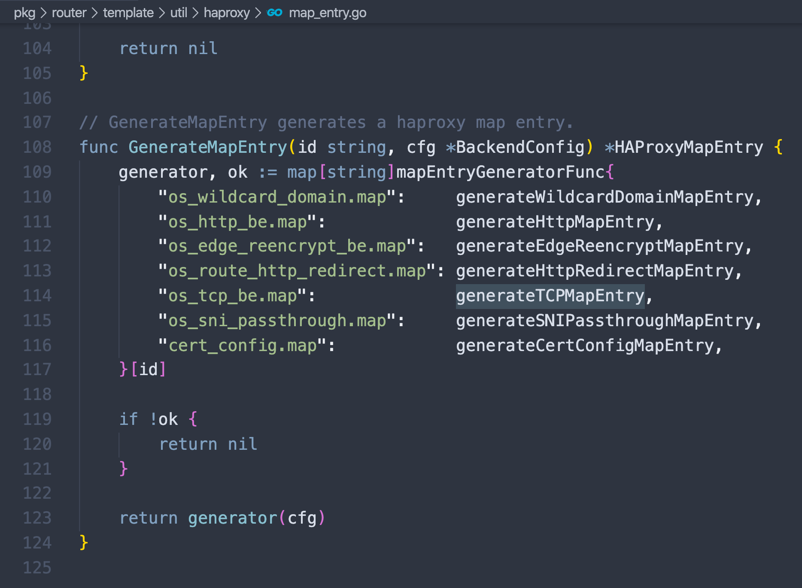

# openshift tcp-router
本文描述，如何通过定制化haproxy template, 通过给route添加annotation，就可以向外界开放tcp路由。本文相关脚本和文件，在scripts目录中。
## 初衷和原理
经常会在openshift的poc中遇到L4负载均衡的测试，我们知道默认ocp router是haproxy做的，而且默认只支持http, https, 虽然tls/sni 也算是支持tcp的一种方式，但是这个也还是7层的。官方文档只是简单的说，如果有其他的需求，就定制haproxy template来满足，不过定制说的很少，例子也不多。本文就是一个通过定制化haproxy template，来达到动态监听route配置，并动态开放tcp端口。

定制haproxy template需要了解openshift router的一些原理要点
- openshift router不仅仅是haproxy，它还有一个go程序，监听了openshift的配置，并且写入了一堆的map文件，这个文件是非常关键的配置haproxy template的配置文件。
- openshift router里面的tls passthrough方式，对应到haproxy的配置里面，就是tcp的模式，我们的定制点就是在这里。
- 定制过程集中在，屏蔽掉http/https 的edge和reencrypt部分，对于打annotation 的route，开放tls passthrough的frontend
- route annotation 配置形式是 haproxy.router.openshift.io/external-tcp-port: "13306"
- 当然，ocp4现在还不支持定制化route template，所以本文直接创建了一个route的deployment。
- 现场实施的时候，注意更改router的image，每个版本的image可以去release.txt文件中找到。

既然是面向poc的，就肯定有局限
- route annotation 定义的开放tcp端口，是手动定义，而且面向整个集群各个project开放，必然会导致tcp端口冲突。需要已有端口管理方案，这个就交给GPS吧。

以下是route的配置示例
```yaml
kind: Route
apiVersion: route.openshift.io/v1
metadata:
  name: ottcache-002
  annotations:
    haproxy.router.openshift.io/wzh-router-name: "wzh-router-1"
    haproxy.router.openshift.io/external-tcp-port: "6620"
spec:
  to:
    kind: Service
    name: ottcache-002-service
  port:
    targetPort: 6620
  tls:
    termination: passthrough
    insecureEdgeTerminationPolicy: None

```

以下是template里面，关键的定制点
```go
{{/*try to add tcp support*/}}

{{- if eq (env "WZH_ROUTER_NAME" "wzh-router-name") (index $cfg.Annotations "haproxy.router.openshift.io/wzh-router-name") }}
  {{- if (isInteger (index $cfg.Annotations "haproxy.router.openshift.io/external-tcp-port")) }} 
  frontend tcp-{{ (index $cfg.Annotations "haproxy.router.openshift.io/external-tcp-port") }}
    bind *:{{ (index $cfg.Annotations "haproxy.router.openshift.io/external-tcp-port") }}
    mode tcp
    default_backend {{genBackendNamePrefix $cfg.TLSTermination}}:{{$cfgIdx}}

  {{- end}}{{/* end haproxy.router.openshift.io */}}
{{- end}}{{/* end WZH_ROUTER_NAME */}}

{{/*end try to add tcp support*/}}

```

## 测试步骤
测试步骤不复杂，就是创建一个新的router，然后就可以去其他project创建应用，给route打annotation就可以了。

本文的例子，包含两个应用，一个是web应用，一个是mysql，都通过tcp端口对外开放。
```bash
# tcp-router will install in the same project with openshift router
oc project openshift-ingress

# install the tcp-router and demo
oc create configmap customrouter-wzh --from-file=haproxy-config.template
oc apply -f haproxy.router.yaml

oc apply -f haproxy.demo.yaml

# test your tcp-router, replace ip with router ip, both command will success.
curl 192.168.7.18:18080

podman run -it --rm registry.redhat.ren:5443/docker.io/mysql mysql -h 192.168.7.18 -P 13306 -u user -D db -p

# if you want to delete the tcp-router and demo
oc delete -f haproxy.router.yaml
oc delete configmap customrouter-wzh

oc delete -f haproxy.demo.yaml

# oc set volume deployment/router-wzh --add --overwrite \
#     --name=config-volume \
#     --mount-path=/var/lib/haproxy/conf/custom \
#     --source='{"configMap": { "name": "customrouter-wzh"}}'

# oc set env dc/router \
#     TEMPLATE_FILE=/var/lib/haproxy/conf/custom/haproxy-config.template

```

## 参考
https://docs.openshift.com/container-platform/3.11/install_config/router/customized_haproxy_router.html#go-template-actions

https://www.haproxy.com/blog/introduction-to-haproxy-maps/

https://access.redhat.com/solutions/3495011

https://blog.zhaw.ch/icclab/openshift-custom-router-with-tcpsni-support/
## 以下是弯路

分析源码，我们可以看到，openshift router还是对haproxy做了扩展的，那些map文件，都是router的扩展生成的，目的是对接endpoint，绕过service。所以我们想做tcp转发，可以借助sni-tcp来实现tcp转发。

