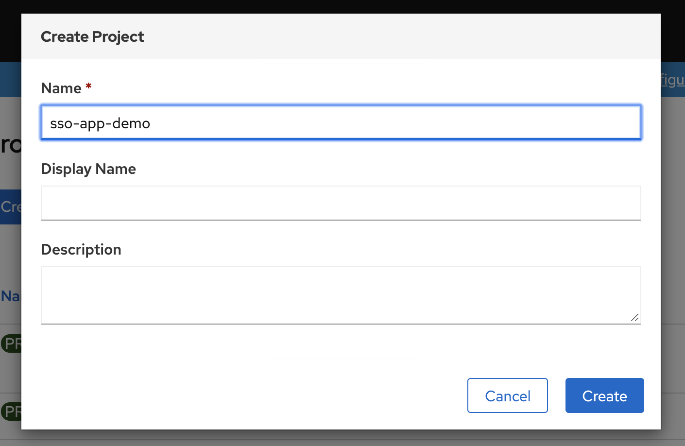
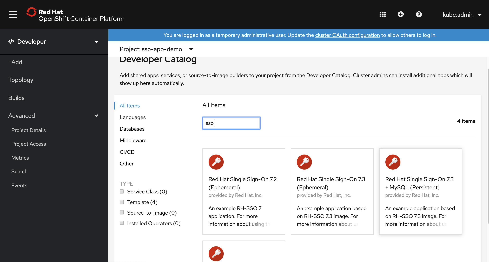

# openshift 使用 rh sso 做 oauth 认证

https://access.redhat.com/documentation/en-us/red_hat_single_sign-on/7.3/html/red_hat_single_sign-on_for_openshift/index

官方文档写的很好，但是是基于 ocp 3.11 的，所以里面有几个配置点需要调整:
- 通过catalog部署的时候，一定要设置admin的用户名和密码。
- issuer url: https://sso-sso-app-demo.apps.ocpef0a.sandbox1717.opentlc.com/auth/realms/OpenShift 
- Valid Redirect URIs: https://oauth-openshift.apps.ocpef0a.sandbox1717.opentlc.com/*
- ca.crt 这个文件可以在web界面上上传，但是传什么文件呢，是 openshift-ingress-operator 的 router-ca 里面的 tls.crt
- 界面老是刷不出来 openid 的登录方法： 这种情况，需要一路回退到系统界面，然后在跳转回来，再刷新才行。在登录界面一直刷新是没用的，应该是前端页面的小bug。
- 用户在rh sso里面单点认证以后，如果在openshift退出，想换一个用户登录，是不行的。 这种情况，需要登录到rh sso，把之前的用户session做登出操作，然后openshift上面才能换一个用户登录。
- 添加一个oauth Identity Providers 容易，但是没有删除界面。 这种情况，只能去直接改Identity Providers 的 yaml文件，删掉相关配置。

## 详细步骤

这里是配置过程的录屏：
- https://www.ixigua.com/i6800709743808610827/
- https://youtu.be/Ak9qdgIbOic

创建项目 sso-app-demo


从 catalog 里面选择 sso 创建， 注意设定sso管理员密码， 省的之后麻烦。
https://access.redhat.com/documentation/en-us/red_hat_single_sign-on/7.3/html-single/red_hat_single_sign-on_for_openshift/index#deploying_the_red_hat_single_sign_on_image_using_the_application_template


然后登录rh sso ，按照官方文档进行配置
https://access.redhat.com/documentation/en-us/red_hat_single_sign-on/7.3/html-single/red_hat_single_sign-on_for_openshift/index#OSE-SSO-AUTH-TUTE


## 备用命令

```bash

# oc -n openshift import-image redhat-sso73-openshift:1.0

# oc new-project sso-app-demo
# oc policy add-role-to-user view system:serviceaccount:$(oc project -q):default

# oc policy remove-role-from-user view system:serviceaccount:$(oc project -q):default

# get issuer url
curl -k https://sso-sso-app-demo.apps.ocpef0a.sandbox1717.opentlc.com/auth/realms/OpenShift/.well-known/openid-configuration | python -m json.tool | grep issuer

# curl -k https://sso-sso-app-demo.apps.ocpef0a.sandbox1717.opentlc.com/auth/realms/OpenShift/.well-known/openid-configuration | jq | less

# # on mac create a ca
# cd ~/Downloads/tmp/tmp/
# openssl req \
#    -newkey rsa:2048 -nodes -keyout redhat.ren.key \
#    -x509 -days 3650 -out redhat.ren.crt -subj \
#    "/C=CN/ST=GD/L=SZ/O=Global Security/OU=IT Department/CN=*.redhat.ren"
# # upload crt to ocp
# oc create configmap ca-config-map --from-file=ca.crt=./redhat.ren.crt -n openshift-config

# oc delete configmap ca-config-map -n openshift-config

oc get secrets router-ca -n openshift-ingress-operator -o jsonpath='{.data.tls\.crt}' | base64 -d > router.ca.crt

# oc get secrets router-ca -n openshift-ingress-operator -o jsonpath='{.data.tls\.key}' | base64 -d

# oc get OAuthClient

# if you want to debug, https://bugzilla.redhat.com/show_bug.cgi?id=1744599
oc patch authentication.operator cluster --type=merge -p "{\"spec\":{\"operatorLogLevel\": \"TraceAll\"}}"
oc patch authentication.operator cluster --type=merge -p "{\"spec\":{\"operatorLogLevel\": \"\"}}"

# update imate stream for offline
oc patch -n openshift is mysql -p "{\"spec\":{\"tags\":[{\"name\": \"5.7\",\"from\":{\"name\":\"registry.redhat.ren:5443/registry.redhat.io/rhscl/mysql-57-rhel7:latest\"}}]}}"
oc patch -n openshift is mysql -p "{\"spec\":{\"tags\":[{\"name\": \"8.0\",\"from\":{\"name\":\"registry.redhat.ren:5443/registry.redhat.io/rhscl/mysql-80-rhel7:latest\"}}]}}"
oc patch -n openshift is redhat-sso73-openshift -p "{\"spec\":{\"tags\":[{\"name\": \"1.0\",\"from\":{\"name\":\"registry.redhat.ren:5443/registry.redhat.io/redhat-sso-7/sso73-openshift:1.0\"}}]}}"
oc patch -n openshift is redhat-sso73-openshift -p "{\"spec\":{\"tags\":[{\"name\": \"latest\",\"from\":{\"name\":\"registry.redhat.ren:5443/registry.redhat.io/redhat-sso-7/sso73-openshift:1.0\"}}]}}"

oc create is ipa-server -n openshift
```