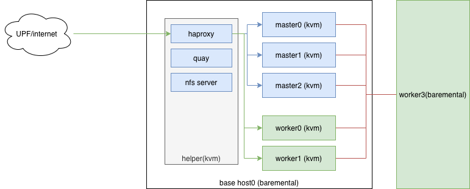

# openshift 4.5 安装环境需求

## 最小cnv测试环境需求
- 2台物理机，rhel7.8，CPU 32C, Mem 128G，硬盘分区 /boot 1G, / 1T, 其他硬盘空间空闲，后续会用lvm管理, 作为kvm的硬盘来用。
- 会在一个物理机上，装7个kvm， 做一个openshift集群， 另外一个物理机，作为worker 节点，纳入进来，在这个物理机上，启动cnv
- 2个物理机上面，要规划一些ip
- 物理机的BMC要可以访问，因为需要挂iso镜像来安装work节点
- 环境最好是联网的，可以远程ssh, vnc.

## 测试环境需求/调研
- 基本安装需求是7个节点，可以都是虚拟机，这7个节点分别是helper, bootstrap, 3 master, 2 worker。其中bootstrap安装完成后可以删除。3 master最小4C/16G/120G, 2 worker最小2C/8G/120G，实际情况必须根据应用扩大，一般要求8C/32G。bootstrap 4C/16G/120G。helper节点4C/16G/500G。helper节点会承担 quay, nfs server，load balancer等功能，所以根据存储容量的需求，扩大硬盘。
- helper可以作为跳板机和集群的流量入口使用。
- 网络要求二层互通，如果应用不要求公网ip直通，那么各个主机有一个ip地址就可以。但是如果应用要求公网ip直通或者对外提供tcp服务，那么需要考虑使用maclan/sriov方式，ip地址需要分配更多的。
- dns要分配域名，ns指向helper节点，没有的话，红帽可以提供redhat.ren下面的二级域名供客户测试使用。
- 如果网络上有F5, 平台会要求将端口6443, 22623指向3 master + bootstrap, 端口80, 443指向2 worker，作为k8s apiserver分流，和k8s ingress分流用。
- 如果集群主机可以直接连公网，那么安装过程将非常简单，否则需要准备离线镜像仓库。
- 一般推荐有一台32C/256G/5T的主机，作为helper, bootstrap, 3 master, 2 worker的承载host，用kvm启动各个节点，作为一个openshift初始化集群。然后其他的物理主机，32C/256G/5T，作为worker节点后续加入，用来测试GPU, CNV等高负载应用。
- 要求worker物理机BMC能通能操作，因为需要挂载iso，重启来安装openshift并加入集群.

