# openshift install cnv with ocs and external ceph

本次测试的目标业务场景是，一个CS服务的虚机，用CNV跑在openshift上，虚机的镜像承载在ceph上，并测试虚机热迁移和虚机克隆场景。

由于测试环境所限，我们配置一个单节点的ceph，挂3个5.5T的盘，这个ceph节点，就用kvm，配置了16C32G，实际跑下来，感觉8C32G也是够的。

## 部署架构图


## 视频讲解
单节点ceph安装，ocs安装，对接外部ceph存储

- bilibili
- xigua
- youtube 

cnv安装，导入虚机镜像，热迁移，克隆
- bilibili
- xigua
- youtube


## install ceph
我们先安装这个ceph节点。
```bash

#####################################
## start to install ceph
cd /backup/wzh

lvremove -f ocp4/cephlv
lvcreate -y -L 230G -n cephlv ocp4

lvremove -f ocp4/cephdata01lv
lvcreate -y -L 3T -n cephdata01lv ocp4

lvremove -f ocp4/cephdata02lv
lvcreate -y -L 3T -n cephdata02lv ocp4

lvremove -f ocp4/cephdata03lv
lvcreate -y -L 3T -n cephdata03lv ocp4

virt-install --name=ocp4-ceph --vcpus=16 --ram=32768 \
--disk path=/dev/ocp4/cephlv,device=disk,bus=virtio,format=raw \
--disk path=/dev/ocp4/cephdata01lv,device=disk,bus=virtio,format=raw \
--disk path=/dev/ocp4/cephdata02lv,device=disk,bus=virtio,format=raw \
--disk path=/dev/ocp4/cephdata03lv,device=disk,bus=virtio,format=raw \
--os-variant centos7.0 --network network:openshift4,model=virtio \
--boot menu=on --location /home/data/openshift/ocp.4.3.21/rhel-server-7.8-x86_64-dvd.iso \
--initrd-inject rhel-ks-ceph.cfg --extra-args "inst.ks=file:/rhel-ks-ceph.cfg" 

#######################################
#  kvm's host bond and vlan

# https://access.redhat.com/documentation/en-us/red_hat_enterprise_linux/7/html/networking_guide/sec-configure_802_1q_vlan_tagging_using_the_command_line_tool_nmcli

# https://access.redhat.com/documentation/en-us/red_hat_enterprise_linux/7/html/networking_guide/sec-vlan_on_bond_and_bridge_using_the_networkmanager_command_line_tool_nmcli
nmcli con add type bond \
    con-name bond-24 \
    ifname bond-24 \
    mode 802.3ad ipv4.method disabled ipv6.method ignore
    
nmcli con mod id bond-24 bond.options \
    mode=802.3ad,miimon=100,lacp_rate=fast,xmit_hash_policy=layer2+3
    
nmcli con add type bond-slave ifname enp176s0f0 con-name enp176s0f0 master bond-24
nmcli con add type bond-slave ifname enp59s0f0 con-name enp59s0f0 master bond-24

nmcli con up bond-24

nmcli connection add type bridge con-name br-ceph ifname br-ceph ip4 192.168.18.200/24

nmcli con up br-ceph

nmcli con add type vlan con-name vlan-ceph ifname vlan-ceph dev bond-24 id 501 master br-ceph slave-type bridge

nmcli con up vlan-ceph

# no need below
# cat << EOF >  /backup/wzh/virt-net.xml
# <network>
#   <name>vm-br-ceph</name>
#   <forward mode='bridge'>
#     <bridge name='br-ceph'/>
#   </forward>
# </network>
# EOF
# virsh net-define --file virt-net.xml
# virsh net-autostart br-ceph
# virsh net-start br-ceph
# virsh net-list

# # restore
# virsh net-undefine br-ceph
# virsh net-destroy br-ceph

cat << EOF > /root/.ssh/config
StrictHostKeyChecking no
UserKnownHostsFile=/dev/null

EOF

# restore
nmcli con del vlan-ceph
nmcli con del br-ceph
nmcli con del enp59s0f0
nmcli con del enp176s0f0
nmcli con del bond-24

########################################
# go to ceph vm

# https://www.cyberciti.biz/faq/linux-list-network-cards-command/
cat /proc/net/dev

nmcli con add type ethernet ifname eth1 con-name eth1
nmcli con modify eth1 ipv4.method manual ipv4.addresses 192.168.18.203/24
nmcli con modify eth1 connection.autoconnect yes
nmcli con reload
nmcli con up eth1

# restore
nmcli con del eth1

##########################################
# go to worker2 vm, to test the ceph vlan
nmcli con add type ethernet ifname ens9 con-name ens9
nmcli con modify ens9 ipv4.method manual ipv4.addresses 192.168.18.209/24
nmcli con modify ens9 connection.autoconnect yes
nmcli con reload
nmcli con up ens9

# restore
nmcli con del ens9
nmcli con del 'Wired connection 1'

##########################################
# go to worker1 vm, to test the ceph vlan
nmcli con add type ethernet ifname ens9 con-name ens9
nmcli con modify ens9 ipv4.method manual ipv4.addresses 192.168.18.208/24
nmcli con modify ens9 connection.autoconnect yes
nmcli con reload
nmcli con up ens9

# restore
nmcli con del ens9
nmcli con del 'Wired connection 1'

##########################################
# go to worker0 vm, to test the ceph vlan
nmcli con add type ethernet ifname ens9 con-name ens9
nmcli con modify ens9 ipv4.method manual ipv4.addresses 192.168.18.207/24
nmcli con modify ens9 connection.autoconnect yes
nmcli con reload
nmcli con up ens9

##########################################
# go to master2 vm, to test the ceph vlan
nmcli con add type ethernet ifname ens9 con-name ens9
nmcli con modify ens9 ipv4.method manual ipv4.addresses 192.168.18.206/24
nmcli con modify ens9 connection.autoconnect yes
nmcli con reload
nmcli con up ens9

# restore
nmcli con del ens9
nmcli con del 'Wired connection 1'

##########################################
# go to master1 vm, to test the ceph vlan
nmcli con add type ethernet ifname ens9 con-name ens9
nmcli con modify ens9 ipv4.method manual ipv4.addresses 192.168.18.205/24
nmcli con modify ens9 connection.autoconnect yes
nmcli con reload
nmcli con up ens9

# restore
nmcli con del ens9
nmcli con del 'Wired connection 1'

##########################################
# go to master0 vm, to test the ceph vlan
nmcli con add type ethernet ifname ens9 con-name ens9
nmcli con modify ens9 ipv4.method manual ipv4.addresses 192.168.18.204/24
nmcli con modify ens9 connection.autoconnect yes
nmcli con reload
nmcli con up ens9

# restore
nmcli con del ens9
nmcli con del 'Wired connection 1'

##########################################
# go to worker4 baremental, to test the ceph vlan
nmcli con del 'Wired connection 1'
nmcli con del 'Wired connection 2'
nmcli con del 'Wired connection 3'
nmcli con del 'Wired connection 4'
nmcli con del 'Wired connection 5'
nmcli con del ens35f0.991
nmcli con del ens35f1

# https://access.redhat.com/solutions/1526613
nmcli con add type bond \
    con-name bond-24 \
    ifname bond-24 \
    mode 802.3ad ipv4.method disabled ipv6.method ignore
    
nmcli con mod id bond-24 bond.options \
    mode=802.3ad,miimon=100,lacp_rate=fast,xmit_hash_policy=layer2+3
    
nmcli con add type bond-slave ifname ens49f0 con-name ens49f0 master bond-24
nmcli con add type bond-slave ifname ens35f0 con-name ens35f0 master bond-24

nmcli con up bond-24

nmcli con add type vlan con-name vlan-ceph ifname vlan-ceph dev bond-24 id 501 ip4 192.168.18.211/24

nmcli con up vlan-ceph

# restore
nmcli con del vlan-ceph
nmcli con del ens49f0 ens35f0
nmcli con del bond-24

#############################################
# go to worker3 baremental, to test the ceph vlan

nmcli con del 'Wired connection 1'
nmcli con del 'Wired connection 2'
nmcli con del 'Wired connection 3'
nmcli con del 'Wired connection 4'
nmcli con del 'Wired connection 5'

nmcli con add type bond \
    con-name bond-24 \
    ifname bond-24 \
    mode 802.3ad ipv4.method disabled ipv6.method ignore
    
nmcli con mod id bond-24 bond.options \
    mode=802.3ad,miimon=100,lacp_rate=fast,xmit_hash_policy=layer2+3
    
nmcli con add type bond-slave ifname ens49f0 con-name ens49f0 master bond-24
nmcli con add type bond-slave ifname ens35f0 con-name ens35f0 master bond-24

nmcli con up bond-24

nmcli con add type vlan con-name vlan-ceph ifname vlan-ceph dev bond-24 id 501  ip4 192.168.18.210/24

nmcli con up vlan-ceph

# restore
nmcli con del vlan-ceph
nmcli con del ens49f0 ens35f0
nmcli con del bond-24


#################################################
## for ceph vm
# install a 'fast' http proxy, then

subscription-manager --proxy=127.0.0.1:6666 register --username **** --password ********
# subscription-manager --proxy=127.0.0.1:6666 refresh

subscription-manager config --rhsm.baseurl=https://china.cdn.redhat.com
# subscription-manager config --rhsm.baseurl=https://cdn.redhat.com
subscription-manager --proxy=127.0.0.1:6666 refresh

# https://access.redhat.com/documentation/en-us/red_hat_ceph_storage/4/html-single/installation_guide/index
subscription-manager --proxy=127.0.0.1:6666 repos --disable=*
subscription-manager --proxy=127.0.0.1:6666 repos --enable=rhel-7-server-rpms \
--enable=rhel-7-server-extras-rpms \
--enable=rhel-7-server-supplementary-rpms \
--enable=rhel-7-server-optional-rpms \
--enable=rhel-7-server-rhceph-4-tools-rpms --enable=rhel-7-server-ansible-2.8-rpms \
--enable=rhel-7-server-rhceph-4-mon-rpms \
--enable=rhel-7-server-rhceph-4-osd-rpms \
--enable=rhel-7-server-rhceph-4-tools-rpms 


yum clean all
yum makecache

yum update -y

systemctl enable firewalld
systemctl start firewalld
systemctl status firewalld

firewall-cmd --zone=public --add-port=6789/tcp
firewall-cmd --zone=public --add-port=6789/tcp --permanent
firewall-cmd --zone=public --add-port=6800-7300/tcp
firewall-cmd --zone=public --add-port=6800-7300/tcp --permanent
firewall-cmd --zone=public --add-port=6800-7300/tcp
firewall-cmd --zone=public --add-port=6800-7300/tcp --permanent
firewall-cmd --zone=public --add-port=6800-7300/tcp
firewall-cmd --zone=public --add-port=6800-7300/tcp --permanent
firewall-cmd --zone=public --add-port=8080/tcp
firewall-cmd --zone=public --add-port=8080/tcp --permanent
firewall-cmd --zone=public --add-port=443/tcp
firewall-cmd --zone=public --add-port=443/tcp --permanent
# firewall-cmd --zone=public --add-port=9090/tcp
# firewall-cmd --zone=public --add-port=9090/tcp --permanent

ssh-keygen

sed -i 's/#UseDNS yes/UseDNS no/' /etc/ssh/sshd_config
systemctl restart sshd

ssh-copy-id root@ceph

yum install -y ceph-ansible docker

cd /usr/share/ceph-ansible

# yum install -y docker
systemctl enable --now docker

cd /usr/share/ceph-ansible
/bin/cp -f  group_vars/all.yml.sample group_vars/all.yml
/bin/cp -f  group_vars/osds.yml.sample group_vars/osds.yml
/bin/cp -f  site-docker.yml.sample site-docker.yml
/bin/cp -f  site.yml.sample site.yml
/bin/cp -f  group_vars/rgws.yml.sample group_vars/rgws.yml
/bin/cp -f  group_vars/mdss.yml.sample group_vars/mdss.yml

# remember to set the env
# https://access.redhat.com/RegistryAuthentication
# REGISTRY_USER_NAME=
# REGISTRY_TOKEN=

cat << EOF > ./group_vars/all.yml
fetch_directory: ~/ceph-ansible-keys
monitor_interface: eth1 
public_network: 192.168.18.0/24
# ceph_docker_image: rhceph/rhceph-4-rhel8
# ceph_docker_image_tag: "latest"
# containerized_deployment: true
ceph_docker_registry: registry.redhat.io
ceph_docker_registry_auth: true
ceph_docker_registry_username: ${REGISTRY_USER_NAME}
ceph_docker_registry_password: ${REGISTRY_TOKEN}
ceph_origin: repository
ceph_repository: rhcs
# ceph_repository_type: cdn
ceph_repository_type: iso
ceph_rhcs_iso_path: /root/rhceph-4.1-rhel-7-x86_64.iso
ceph_rhcs_version: 4
bootstrap_dirs_owner: "167"
bootstrap_dirs_group: "167"
dashboard_admin_user: admin
dashboard_admin_password: Redhat!23
node_exporter_container_image: registry.redhat.io/openshift4/ose-prometheus-node-exporter:v4.1
grafana_admin_user: admin
grafana_admin_password: Redhat!23
grafana_container_image: registry.redhat.io/rhceph/rhceph-4-dashboard-rhel8
prometheus_container_image: registry.redhat.io/openshift4/ose-prometheus:4.1
alertmanager_container_image: registry.redhat.io/openshift4/ose-prometheus-alertmanager:4.1
radosgw_interface: eth1
radosgw_address_block: 192.168.18.0/24
radosgw_civetweb_port: 8080
radosgw_civetweb_num_threads: 512
ceph_conf_overrides:
  global:
    osd_pool_default_size: 3
    osd_pool_default_min_size: 2
    osd_pool_default_pg_num: 32
    osd_pool_default_pgp_num: 32
  osd:
   osd_scrub_begin_hour: 22
   osd_scrub_end_hour: 7

EOF

cat << EOF > ./group_vars/osds.yml
devices:
  - /dev/vdb
  - /dev/vdc
  - /dev/vdd
EOF

cat << EOF > ./hosts
[grafana-server]
ceph
[mons]
ceph
[osds]
ceph
[mgrs]
ceph

EOF

sed -i "s/#copy_admin_key: false/copy_admin_key: true/" ./group_vars/rgws.yml

cd /usr/share/ceph-ansible

mkdir -p ~/ceph-ansible-keys
ansible all -m ping -i hosts

ansible-playbook -vv site.yml -i hosts

#  You can access your dashboard web UI at http://ceph:8443/ as an 'admin' user with 'Redhat!23' password

cd /root
ceph osd getcrushmap -o crushmap
crushtool -d crushmap -o crushmap.txt
sed -i 's/step chooseleaf firstn 0 type host/step chooseleaf firstn 0 type osd/' crushmap.txt
grep 'step chooseleaf' crushmap.txt
crushtool -c crushmap.txt -o crushmap-new
ceph osd setcrushmap -i crushmap-new
cd /usr/share/ceph-ansible

# test the result
ceph health detail
ceph osd pool create test 8
ceph osd pool set test pg_num 128
ceph osd pool set test pgp_num 128
ceph osd pool application enable test rbd
ceph -s
ceph osd tree
ceph osd pool ls
ceph pg dump
cat << EOF > hello-world.txt
wangzheng
EOF
rados --pool test put hello-world hello-world.txt
rados --pool test get hello-world fetch.txt
cat fetch.txt

# continue to install
cat << EOF >> ./hosts
[rgws]
ceph
[mdss]
ceph

EOF

ansible-playbook -vv site.yml --limit mdss -i hosts

ansible-playbook -vv site.yml --limit rgws -i hosts

# change mon param for S3
# 416 (InvalidRange)
# https://www.cnblogs.com/flytor/p/11380026.html
# https://www.cnblogs.com/fuhai0815/p/12144214.html
# https://access.redhat.com/solutions/3328431
# add config line
vi /etc/ceph/ceph.conf
# mon_max_pg_per_osd = 300

systemctl restart ceph-mon@ceph.service

ceph tell mon.* injectargs '--mon_max_pg_per_osd=1000'

ceph --admin-daemon /var/run/ceph/ceph-mon.`hostname -s`.asok config show | grep mon_max_pg_per_osd

ceph --admin-daemon /var/run/ceph/ceph-mgr.`hostname -s`.asok config set mon_max_pg_per_osd 1000

ceph osd lspools
ceph osd dump | grep 'replicated size'

```

## install ocs
接下来在openshift4里面安装ocs组件，来对接之前安装的ceph节点。
```bash
# check ceph versino
ceph tell osd.* version

python ceph-external-cluster-details-exporter.py --help

python ceph-external-cluster-details-exporter.py --rbd-data-pool-name test --rgw-endpoint 192.168.18.203:8080 --run-as-user client.ocs
# [{"kind": "ConfigMap", "data": {"maxMonId": "0", "data": "ceph=192.168.18.203:6789", "mapping": "{}"}, "name": "rook-ceph-mon-endpoints"}, {"kind": "Secret", "data": {"mon-secret": "mon-secret", "fsid": "bfaeb4fb-2f44-41e7-9539-1ca75bb394a8", "cluster-name": "openshift-storage", "admin-secret": "admin-secret"}, "name": "rook-ceph-mon"}, {"kind": "Secret", "data": {"userKey": "AQBZUWdfavnEDBAA0qwn1WLRbFV+0bUY+8ZnMQ==", "userID": "client.ocs"}, "name": "rook-ceph-operator-creds"}, {"kind": "Secret", "data": {"userKey": "AQBZUWdfC1EzDhAAjVV7+S3jKk8LcPUxxkIF9A==", "userID": "csi-rbd-node"}, "name": "rook-csi-rbd-node"}, {"kind": "StorageClass", "data": {"pool": "test"}, "name": "ceph-rbd"}, {"kind": "Secret", "data": {"userKey": "AQBZUWdfG8pvEBAAnldlqNj72gqBRvSxc8FB+g==", "userID": "csi-rbd-provisioner"}, "name": "rook-csi-rbd-provisioner"}, {"kind": "Secret", "data": {"adminID": "csi-cephfs-provisioner", "adminKey": "AQBZUWdfCxXWExAAiiaU1KIyjFsBxZB6h9WVtw=="}, "name": "rook-csi-cephfs-provisioner"}, {"kind": "Secret", "data": {"adminID": "csi-cephfs-node", "adminKey": "AQBZUWdf52L9ERAAXbK5upV2lO5phttDrwzJyg=="}, "name": "rook-csi-cephfs-node"}, {"kind": "StorageClass", "data": {"pool": "cephfs_data", "fsName": "cephfs"}, "name": "cephfs"}, {"kind": "StorageClass", "data": {"endpoint": "192.168.18.203:8080", "poolPrefix": "default"}, "name": "ceph-rgw"}]

oc get cephcluster -n openshift-storage

oc get storagecluster -n openshift-storage

# install chrome on kvm host
wget https://dl.google.com/linux/direct/google-chrome-stable_current_x86_64.rpm
yum install ./google-chrome-stable_current_*.rpm
google-chrome &

```

## install cnv

```bash
# upload win10.qcow2 to http server(helper)
scp win10.qcow2.gz root@192.168.8.202:/var/www/html/

# on helper
chmod 644 /var/www/html/win10.qcow2.gz

oc project demo
cat << EOF > win10.dv.yaml
apiVersion: cdi.kubevirt.io/v1alpha1
kind: DataVolume
metadata:
  name: "example-import-dv-win10"
spec:
  source:
      http:
         url: "http://192.168.8.202:8080/win10.qcow2.gz" 
  pvc:
    volumeMode: Block
    storageClassName: ocs-external-storagecluster-ceph-rbd
    accessModes:
      - ReadWriteMany
    resources:
      requests:
        storage: "40Gi"
EOF
oc apply -n demo -f win10.dv.yaml

oc get dv,pvc

# create a vm, and test the live migration

###############################################################
# network

#####################################
# worker4 baremental, nic bond + vlan + bridge for business
nmcli con add type bond \
    con-name bond-13 \
    ifname bond-13 \
    mode 802.3ad ipv4.method disabled ipv6.method ignore
    
nmcli con mod id bond-13 bond.options \
    mode=802.3ad,miimon=100,lacp_rate=fast,xmit_hash_policy=layer2+3
    
nmcli con add type bond-slave ifname ens49f1 con-name ens49f1 master bond-13
nmcli con add type bond-slave ifname ens35f1 con-name ens35f1 master bond-13

nmcli con up bond-13

nmcli connection add type bridge con-name br-business ifname br-business ip4 172.17.4.211/24

nmcli con up br-business

nmcli con add type vlan con-name vlan-business ifname vlan-business dev bond-13 id 991 master br-business slave-type bridge

nmcli con up vlan-business

#####################################
# worker4 baremental, nic bond + vlan + bridge for business
nmcli con add type bond \
    con-name bond-13 \
    ifname bond-13 \
    mode 802.3ad ipv4.method disabled ipv6.method ignore
    
nmcli con mod id bond-13 bond.options \
    mode=802.3ad,miimon=100,lacp_rate=fast,xmit_hash_policy=layer2+3
    
nmcli con add type bond-slave ifname ens49f1 con-name ens49f1 master bond-13
nmcli con add type bond-slave ifname ens35f1 con-name ens35f1 master bond-13

nmcli con up bond-13

nmcli connection add type bridge con-name br-business ifname br-business ip4 172.17.4.210/24

nmcli con up br-business

nmcli con add type vlan con-name vlan-business ifname vlan-business dev bond-13 id 991 master br-business slave-type bridge

nmcli con up vlan-business

###############################
# try to add 2nd nic
cat << EOF > nic.vm.yaml
apiVersion: "k8s.cni.cncf.io/v1"
kind: NetworkAttachmentDefinition
metadata:
  name: bridge-network-business
  annotations:
    k8s.v1.cni.cncf.io/resourceName: bridge.network.kubevirt.io/br-business 
spec:
  config: '{
    "cniVersion": "0.3.1",
    "name": "bridge-network-business", 
    "plugins": [
      {
        "type": "cnv-bridge", 
        "bridge": "br-business" 
      },
      {
        "type": "cnv-tuning" 
      }
    ]
  }'
EOF

```


# CS 游戏业务场景测试

```bash

###################################
# add management vlan to kvm host

nmcli con add type vlan con-name vlan-management ifname vlan-management dev bond-24 id 500  ip4 1.41.0.124/27

nmcli con up vlan-management

#restore
nmcli con del vlan-management

# upload cs server image
# for python3
python -m http.server 7800
# for python2
python -m SimpleHTTPServer 7800

oc project demo
cat << EOF > cnv.cs.dv.yaml
apiVersion: cdi.kubevirt.io/v1alpha1
kind: DataVolume
metadata:
  name: "import-dv-cs-yitu"
spec:
  source:
      http:
         url: "http://192.168.8.251:7800/yitu.raw" 
  pvc:
    volumeMode: Block
    storageClassName: ocs-external-storagecluster-ceph-rbd
    accessModes:
      - ReadWriteMany
    resources:
      requests:
        storage: "150Gi"
EOF
oc apply -n demo -f cnv.cs.dv.yaml

oc get dv,pvc


```
业务测试服务器是一个CS业务，还是个ubuntu14，我们启动这个虚机，并且配置他的网络。
interface /etc/network/interfaces.d/eth0.cfg for cs server (ubuntu 14)
```yaml
# The primary network interface
auto eth0
iface eth0 inet static
    address 172.17.4.215
    netmask 255.255.255.0
    gateway 172.17.4.254
    dns-nameservers 114.114.114.114
```
```bash
ifdown eth0
ifup eth0
```

# 其他备忘
```bash
oc get nns worker-4.ocp4.redhat.ren -o yaml
```
```yaml
apiVersion: nmstate.io/v1alpha1
kind: NodeNetworkState
metadata:
  creationTimestamp: "2020-09-16T03:15:51Z"
  generation: 1
  managedFields:
  - apiVersion: nmstate.io/v1alpha1
    fieldsType: FieldsV1
    fieldsV1:
      f:metadata:
        f:ownerReferences:
          .: {}
          k:{"uid":"135e4844-bf87-465a-8f6a-5fc1f85e5beb"}:
            .: {}
            f:apiVersion: {}
            f:kind: {}
            f:name: {}
            f:uid: {}
      f:status:
        .: {}
        f:currentState:
          .: {}
          f:dns-resolver:
            .: {}
            f:config:
              .: {}
              f:search: {}
              f:server: {}
            f:running:
              .: {}
              f:search: {}
              f:server: {}
          f:interfaces: {}
          f:route-rules:
            .: {}
            f:config: {}
          f:routes:
            .: {}
            f:config: {}
            f:running: {}
        f:lastSuccessfulUpdateTime: {}
    manager: kubernetes-nmstate
    operation: Update
    time: "2020-09-23T01:38:50Z"
  name: worker-4.ocp4.redhat.ren
  ownerReferences:
  - apiVersion: v1
    kind: Node
    name: worker-4.ocp4.redhat.ren
    uid: 135e4844-bf87-465a-8f6a-5fc1f85e5beb
  resourceVersion: "43763614"
  selfLink: /apis/nmstate.io/v1alpha1/nodenetworkstates/worker-4.ocp4.redhat.ren
  uid: 095a8223-d139-4add-9fcf-0e0435191f78
status:
  currentState:
    dns-resolver:
      config:
        search: []
        server:
        - 192.168.8.202
      running:
        search: []
        server:
        - 192.168.8.202
    interfaces:
    - ipv4:
        dhcp: false
        enabled: false
      ipv6:
        autoconf: false
        dhcp: false
        enabled: false
      link-aggregation:
        mode: 802.3ad
        options:
          ad_actor_system: "00:00:00:00:00:00"
          lacp_rate: fast
          miimon: "100"
          xmit_hash_policy: layer2+3
        slaves:
        - ens49f1
        - ens35f1
      mac-address: B8:59:9F:EF:71:5D
      mtu: 1500
      name: bond-13
      state: up
      type: bond
    - ipv4:
        dhcp: false
        enabled: false
      ipv6:
        autoconf: false
        dhcp: false
        enabled: false
      link-aggregation:
        mode: 802.3ad
        options:
          ad_actor_system: "00:00:00:00:00:00"
          lacp_rate: fast
          miimon: "100"
          xmit_hash_policy: layer2+3
        slaves:
        - ens49f0
        - ens35f0
      mac-address: B8:59:9F:EF:71:5C
      mtu: 1500
      name: bond-24
      state: up
      type: bond
    - bridge:
        options:
          group-forward-mask: 0
          mac-ageing-time: 300
          multicast-snooping: true
          stp:
            enabled: true
            forward-delay: 15
            hello-time: 2
            max-age: 20
            priority: 32768
        port:
        - name: vlan-business
          stp-hairpin-mode: false
          stp-path-cost: 100
          stp-priority: 32
      ipv4:
        address:
        - ip: 172.17.4.211
          prefix-length: 24
        dhcp: false
        enabled: true
      ipv6:
        address:
        - ip: fe80::1a6a:4414:8fec:940e
          prefix-length: 64
        auto-dns: true
        auto-gateway: true
        auto-routes: true
        autoconf: true
        dhcp: true
        enabled: true
      mac-address: B8:59:9F:EF:71:5D
      mtu: 1500
      name: br-business
      state: up
      type: linux-bridge
    - ipv4:
        enabled: false
      ipv6:
        enabled: false
      mac-address: 1e:d4:cc:be:5e:49
      mtu: 1450
      name: br0
      state: down
      type: ovs-interface
    - ethernet:
        auto-negotiation: true
        duplex: full
        speed: 10000
        sr-iov:
          total-vfs: 0
          vfs: []
      ipv4:
        dhcp: false
        enabled: false
      ipv6:
        autoconf: false
        dhcp: false
        enabled: false
      mac-address: B8:59:9F:EF:71:5C
      mtu: 1500
      name: ens35f0
      state: up
      type: ethernet
    - ethernet:
        auto-negotiation: true
        duplex: full
        speed: 10000
        sr-iov:
          total-vfs: 0
          vfs: []
      ipv4:
        dhcp: false
        enabled: false
      ipv6:
        autoconf: false
        dhcp: false
        enabled: false
      mac-address: B8:59:9F:EF:71:5D
      mtu: 1500
      name: ens35f1
      state: up
      type: ethernet
    - ipv4:
        enabled: false
      ipv6:
        enabled: false
      mac-address: B4:96:91:67:2D:A4
      mtu: 1500
      name: ens47f0
      state: down
      type: ethernet
    - ethernet:
        auto-negotiation: true
        duplex: full
        speed: 1000
        sr-iov:
          total-vfs: 0
          vfs: []
      ipv4:
        address:
        - ip: 192.168.8.211
          prefix-length: 24
        dhcp: false
        enabled: true
      ipv6:
        address:
        - ip: fe80::b696:91ff:fe67:2da5
          prefix-length: 64
        autoconf: false
        dhcp: false
        enabled: true
      mac-address: B4:96:91:67:2D:A5
      mtu: 1500
      name: ens47f1
      state: up
      type: ethernet
    - ethernet:
        auto-negotiation: true
        duplex: full
        speed: 10000
        sr-iov:
          total-vfs: 0
          vfs: []
      ipv4:
        dhcp: false
        enabled: false
      ipv6:
        autoconf: false
        dhcp: false
        enabled: false
      mac-address: B8:59:9F:EF:71:5C
      mtu: 1500
      name: ens49f0
      state: up
      type: ethernet
    - ethernet:
        auto-negotiation: true
        duplex: full
        speed: 10000
        sr-iov:
          total-vfs: 0
          vfs: []
      ipv4:
        dhcp: false
        enabled: false
      ipv6:
        autoconf: false
        dhcp: false
        enabled: false
      mac-address: B8:59:9F:EF:71:5D
      mtu: 1500
      name: ens49f1
      state: up
      type: ethernet
    - ipv4:
        enabled: false
      ipv6:
        enabled: false
      mtu: 65536
      name: lo
      state: down
      type: unknown
    - ipv4:
        enabled: false
      ipv6:
        enabled: false
      mac-address: de:b2:ca:03:6b:fa
      mtu: 1450
      name: tun0
      state: down
      type: ovs-interface
    - ipv4:
        dhcp: false
        enabled: false
      ipv6:
        autoconf: false
        dhcp: false
        enabled: false
      mac-address: B8:59:9F:EF:71:5D
      mtu: 1500
      name: vlan-business
      state: up
      type: vlan
      vlan:
        base-iface: bond-13
        id: 991
    - ipv4:
        address:
        - ip: 192.168.18.211
          prefix-length: 24
        dhcp: false
        enabled: true
      ipv6:
        address:
        - ip: fe80::e852:70de:e7be:8f04
          prefix-length: 64
        auto-dns: true
        auto-gateway: true
        auto-routes: true
        autoconf: true
        dhcp: true
        enabled: true
      mac-address: B8:59:9F:EF:71:5C
      mtu: 1500
      name: vlan-ceph
      state: up
      type: vlan
      vlan:
        base-iface: bond-24
        id: 501
    - ipv4:
        enabled: false
      ipv6:
        enabled: false
      mac-address: C2:AE:59:84:C6:E0
      mtu: 65000
      name: vxlan_sys_4789
      state: down
      type: vxlan
      vxlan:
        base-iface: ""
        destination-port: 4789
        id: 0
        remote: ""
    route-rules:
      config: []
    routes:
      config:
      - destination: 0.0.0.0/0
        metric: -1
        next-hop-address: 192.168.8.1
        next-hop-interface: ens47f1
        table-id: 0
      running:
      - destination: 172.17.4.0/24
        metric: 425
        next-hop-address: ""
        next-hop-interface: br-business
        table-id: 254
      - destination: 0.0.0.0/0
        metric: 104
        next-hop-address: 192.168.8.1
        next-hop-interface: ens47f1
        table-id: 254
      - destination: 192.168.8.0/24
        metric: 104
        next-hop-address: ""
        next-hop-interface: ens47f1
        table-id: 254
      - destination: 192.168.18.0/24
        metric: 400
        next-hop-address: ""
        next-hop-interface: vlan-ceph
        table-id: 254
      - destination: fe80::/64
        metric: 425
        next-hop-address: ""
        next-hop-interface: br-business
        table-id: 254
      - destination: fe80::/64
        metric: 256
        next-hop-address: ""
        next-hop-interface: ens47f1
        table-id: 254
      - destination: fe80::/64
        metric: 400
        next-hop-address: ""
        next-hop-interface: vlan-ceph
        table-id: 254
      - destination: ff00::/8
        metric: 256
        next-hop-address: ""
        next-hop-interface: br-business
        table-id: 255
      - destination: ff00::/8
        metric: 256
        next-hop-address: ""
        next-hop-interface: ens47f1
        table-id: 255
      - destination: ff00::/8
        metric: 256
        next-hop-address: ""
        next-hop-interface: vlan-ceph
        table-id: 255
  lastSuccessfulUpdateTime: "2020-09-23T01:38:50Z"
```
