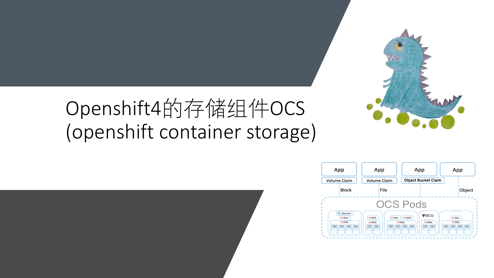
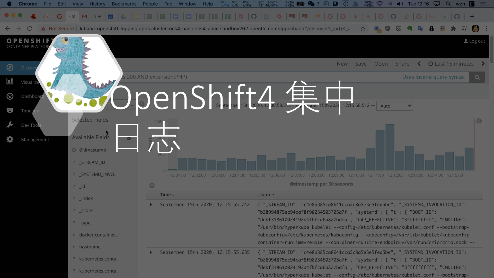
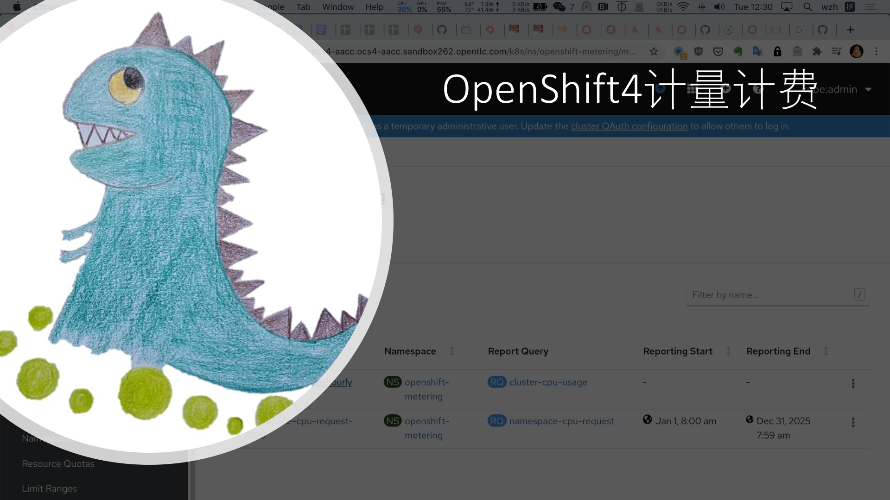

# OpenShift and Container Storage for Administrators

本文讲述openshift4的管理员上手培训，主要亮点是openshift的存储模块ocs，openshift的集中日志，和openshift的计量计费，这几个模块需要的底层资源比较多，平时难得有环境可以尝试。

workshop upstream github: 
https://github.com/openshift/openshift-cns-testdrive

## WORKSHOP MODULES

以下是培训的各个模块的教材。

- [Environment Overview](https://1drv.ms/b/s!AqLmU5b8zhHEo0sRBCH5BMaZddhi?e=KEudMv)
- [Installation and Verification](https://1drv.ms/b/s!AqLmU5b8zhHEo0wqS3v9yTSoklce?e=pQYdyU)
- [Application Management Basics](https://1drv.ms/b/s!AqLmU5b8zhHEo009M1dtOK0jjxdF?e=IjteVg)
- [Application Storage Basics](https://1drv.ms/b/s!AqLmU5b8zhHEo05w6aqcqsFj_kLi?e=vUcPbL)
- [MachineSets, Machines, and Nodes](https://1drv.ms/b/s!AqLmU5b8zhHEo09Atba1-eE6uVNL?e=ibXzyT)
- [Infrastructure Nodes and Operators](https://1drv.ms/b/s!AqLmU5b8zhHEo0wqS3v9yTSoklce?e=oUbqDA)
- [Deploying and Managing OpenShift Container Storage](https://1drv.ms/b/s!AqLmU5b8zhHEo1GVX4TQfnsXwdsG?e=YaOWod)
- [OpenShift Log Aggregation](https://1drv.ms/b/s!AqLmU5b8zhHEo1I_-Mb3Jt6ayMVe?e=AB8QQJ)
- [External (LDAP) Authentication Providers, Users, and Groups](https://1drv.ms/b/s!AqLmU5b8zhHEo1NIj7lEctuhyDKE?e=d5yt0w)
- [OpenShift Monitoring with Prometheus](https://1drv.ms/b/s!AqLmU5b8zhHEo1SAeYG1yZtBxoC0?e=iNCUQj)
- [Project Template, Quota, and Limits](https://1drv.ms/b/s!AqLmU5b8zhHEo1Xcm6-ZJBlFpThB?e=EXgqJM)
- [OpenShift Networking and NetworkPolicy](https://1drv.ms/b/s!AqLmU5b8zhHEo1bOfjTiirI_WSI4?e=o42hIP)
- [Disabling Project Self-Provisioning](https://1drv.ms/b/s!AqLmU5b8zhHEo1cXtp9n45kxGyJh?e=GGz6UB)
- [Cluster Resource Quotas](https://1drv.ms/b/s!AqLmU5b8zhHEo1hqTna_NJ5iVYCL?e=jo6zxm)
- [Cluster Metering](https://1drv.ms/b/s!AqLmU5b8zhHEo1mtc9lSRdzwp0uQ?e=1QD43U)
- [Taints and Tolerations](https://1drv.ms/b/s!AqLmU5b8zhHEo1pb5Czs_S8_pM5b?e=tN1uwZ)

## ocs (openshift container storage)

[<kbd></kbd>](https://www.bilibili.com/video/BV1Ta4y1j7Bk/)

- [bilibili](https://www.bilibili.com/video/BV1Ta4y1j7Bk/)
- [xigua](https://www.ixigua.com/6873344400114582030)
- [youtube](https://www.youtube.com/watch?v=BQ46mIkDZjo)

## 集中日志

[<kbd></kbd>](https://www.bilibili.com/video/BV11h411X7h5/)

- [bilibili](https://www.bilibili.com/video/BV11h411X7h5/)
- [xigua](https://www.ixigua.com/6875209638690849294)
- [youtube](https://www.youtube.com/watch?v=xZ1pDMx_gho)

## 计量计费

[<kbd></kbd>](https://www.bilibili.com/video/BV1AZ4y1K7GE/)

- [bilibili](https://www.bilibili.com/video/BV1AZ4y1K7GE/)
- [xigua](https://www.ixigua.com/6875534619349877261)
- [youtube](https://youtu.be/jMrz_Rvd89U)
