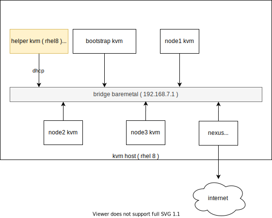
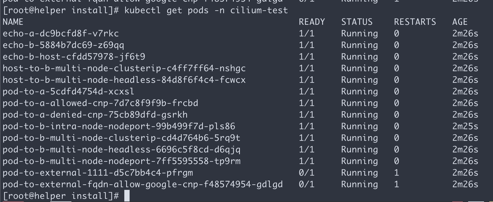

# openshift 4.6 静态IP离线 baremetal 安装，采用 cilium 网络插件

based on: 
https://docs.cilium.io/en/stable/gettingstarted/k8s-install-openshift-okd/

base on cilium v1.9.3

安装过程视频
- 

本文描述ocp4.6在baremetal(kvm模拟)上面，静态ip安装的方法，并使用cilium 网络插件

以下是本次实验的架构图:



## 离线安装包下载

ocp4.3的离线安装包下载和3.11不太一样，按照如下方式准备。另外，由于默认的baremetal是需要dhcp, pxe环境的，那么需要准备一个工具机，上面有dhcp, tftp, haproxy等工具，另外为了方便项目现场工作，还准备了ignition文件的修改工具，所以离线安装包需要一些其他第三方的工具。

https://github.com/wangzheng422/ocp4-upi-helpernode 这个工具，是创建工具机用的。

https://github.com/wangzheng422/filetranspiler 这个工具，是修改ignition文件用的。

打包好的安装包，在这里下载，百度盘下载链接，版本是4.6.12:

-

其中包括如下类型的文件：
- ocp4.tgz  这个文件包含了iso等安装介质，以及各种安装脚本，全部下载的镜像列表等。需要复制到宿主机，以及工具机上去。
- registry.tgz  这个文件也是docker image registry的仓库打包文件。需要先补充镜像的话，按照这里操作: [4.6.add.image.md](./4.6.add.image.md)
- install.image.tgz  这个文件是安装集群的时候，需要的补充镜像.
- rhel-data.7.9.tgz 这个文件是 rhel 7 主机的yum更新源，这么大是因为里面有gpu, epel等其他的东西。这个包主要用于安装宿主机，工具机，以及作为计算节点的rhel。

合并这些切分文件，使用类似如下的命令

```bash
cat registry.?? > registry.tgz
```

## 在外网云主机上面准备离线安装源

准备离线安装介质的文档，已经转移到了这里：[4.6.build.dist.md](4.6.build.dist.md)

## 宿主机准备

本次实验，是在一个32C， 256G 的主机上面，用很多个虚拟机安装测试。所以先准备这个宿主机。

如果是多台宿主机，记得一定要调整时间配置，让这些宿主机的时间基本一致，否则证书会出问题。

主要的准备工作有
- 配置yum源
- 配置dns
- 安装镜像仓库
- 配置vnc环境
- 配置kvm需要的网络
- 创建helper kvm
- 配置一个haproxy，从外部导入流量给kvm

以上准备工作，dns部分需要根据实际项目环境有所调整。

本次的宿主机是一台rhel8, 参考这里进行基本的配置配置[rhel8.build.kernel.repo.cache.md](../../rhel/rhel8.build.kernel.repo.cache.md)

```bash
cat << EOF > /root/.ssh/config
StrictHostKeyChecking no
UserKnownHostsFile=/dev/null
EOF

cat << EOF >>  /etc/hosts
127.0.0.1 registry.ocp4.redhat.ren
EOF

dnf clean all
dnf repolist

dnf -y install byobu htop 

systemctl disable --now firewalld

# 配置registry
mkdir -p /etc/crts/ && cd /etc/crts

# https://access.redhat.com/documentation/en-us/red_hat_codeready_workspaces/2.1/html/installation_guide/installing-codeready-workspaces-in-tls-mode-with-self-signed-certificates_crw
openssl genrsa -out /etc/crts/redhat.ren.ca.key 4096
openssl req -x509 \
  -new -nodes \
  -key /etc/crts/redhat.ren.ca.key \
  -sha256 \
  -days 36500 \
  -out /etc/crts/redhat.ren.ca.crt \
  -subj /CN="Local Red Hat Ren Signer" \
  -reqexts SAN \
  -extensions SAN \
  -config <(cat /etc/pki/tls/openssl.cnf \
      <(printf '[SAN]\nbasicConstraints=critical, CA:TRUE\nkeyUsage=keyCertSign, cRLSign, digitalSignature'))

openssl genrsa -out /etc/crts/redhat.ren.key 2048

openssl req -new -sha256 \
    -key /etc/crts/redhat.ren.key \
    -subj "/O=Local Red Hat Ren /CN=*.ocp4.redhat.ren" \
    -reqexts SAN \
    -config <(cat /etc/pki/tls/openssl.cnf \
        <(printf "\n[SAN]\nsubjectAltName=DNS:*.ocp4.redhat.ren,DNS:*.apps.ocp4.redhat.ren,DNS:*.redhat.ren\nbasicConstraints=critical, CA:FALSE\nkeyUsage=digitalSignature, keyEncipherment, keyAgreement, dataEncipherment\nextendedKeyUsage=serverAuth")) \
    -out /etc/crts/redhat.ren.csr

openssl x509 \
    -req \
    -sha256 \
    -extfile <(printf "subjectAltName=DNS:*.ocp4.redhat.ren,DNS:*.apps.ocp4.redhat.ren,DNS:*.redhat.ren\nbasicConstraints=critical, CA:FALSE\nkeyUsage=digitalSignature, keyEncipherment, keyAgreement, dataEncipherment\nextendedKeyUsage=serverAuth") \
    -days 36500 \
    -in /etc/crts/redhat.ren.csr \
    -CA /etc/crts/redhat.ren.ca.crt \
    -CAkey /etc/crts/redhat.ren.ca.key \
    -CAcreateserial -out /etc/crts/redhat.ren.crt

openssl x509 -in /etc/crts/redhat.ren.crt -text

/bin/cp -f /etc/crts/redhat.ren.crt /etc/pki/ca-trust/source/anchors/
update-ca-trust extract

cd /data
mkdir -p /data/registry
# tar zxf registry.tgz
dnf -y install podman pigz skopeo jq 
# pigz -dc registry.tgz | tar xf -
cd /data/ocp4
podman load -i /data/ocp4/registry.tgz

podman run --name local-registry -p 5443:5000 \
  -d --restart=always \
  -v /data/registry/:/var/lib/registry:z \
  -v /etc/crts:/certs:z \
  -e REGISTRY_HTTP_TLS_CERTIFICATE=/certs/redhat.ren.crt \
  -e REGISTRY_HTTP_TLS_KEY=/certs/redhat.ren.key \
  docker.io/library/registry:2

# firewall-cmd --permanent --add-port=5443/tcp
# firewall-cmd --reload

# 加载更多的镜像
# 解压缩 ocp4.tgz
bash add.image.load.sh /data/install.image 'registry.ocp4.redhat.ren:5443'

# https://github.com/christianh814/ocp4-upi-helpernode/blob/master/docs/quickstart.md

# 准备vnc环境
vncpasswd

cat << EOF > ~/.vnc/config
session=gnome
securitytypes=vncauth,tlsvnc
desktop=sandbox
geometry=1280x800
alwaysshared
EOF

cat << EOF >> /etc/tigervnc/vncserver.users
:1=root
EOF

systemctl start vncserver@:1
# 如果你想停掉vnc server，这么做
systemctl stop vncserver@:1

# firewall-cmd --permanent --add-port=6001/tcp
# firewall-cmd --permanent --add-port=5901/tcp
# firewall-cmd --reload

# connect vnc at port 5901
# export DISPLAY=:1

# 创建实验用虚拟网络

cat << 'EOF' > /data/kvm/bridge.sh
#!/usr/bin/env bash

PUB_CONN='eno1'
PUB_IP='172.21.6.105/24'
PUB_GW='172.21.6.254'
PUB_DNS='172.21.1.1'

nmcli con down "$PUB_CONN"
nmcli con delete "$PUB_CONN"
nmcli con down baremetal
nmcli con delete baremetal
# RHEL 8.1 appends the word "System" in front of the connection,delete in case it exists
nmcli con down "System $PUB_CONN"
nmcli con delete "System $PUB_CONN"
nmcli connection add ifname baremetal type bridge con-name baremetal ipv4.method 'manual' \
    ipv4.address "$PUB_IP" \
    ipv4.gateway "$PUB_GW" \
    ipv4.dns "$PUB_DNS"
    
nmcli con add type bridge-slave ifname "$PUB_CONN" master baremetal
nmcli con down "$PUB_CONN";pkill dhclient;dhclient baremetal
nmcli con up baremetal
EOF

nmcli con mod baremetal +ipv4.address '192.168.7.1/24'
nmcli networking off; nmcli networking on


# 创建工具机

mkdir -p /data/kvm
cd /data/kvm

lvremove -f rhel/helperlv
lvcreate -y -L 200G -n helperlv rhel

virt-install --name="ocp4-aHelper" --vcpus=2 --ram=4096 \
--disk path=/dev/rhel/helperlv,device=disk,bus=virtio,format=raw \
--os-variant rhel8.0 --network network=openshift4,model=virtio \
--boot menu=on --location /data/kvm/rhel-8.3-x86_64-dvd.iso \
--initrd-inject helper-ks-rhel8.cfg --extra-args "inst.ks=file:/helper-ks-rhel8.cfg" 

# restore kvm
virsh destroy ocp4-aHelper
virsh undefine ocp4-aHelper

# virt-viewer --domain-name ocp4-aHelper
# virsh start ocp4-aHelper
# virsh list --all

# start chrony/ntp server on host
/bin/cp -f /etc/chrony.conf /etc/chrony.conf.default
cat << EOF > /etc/chrony.conf
# pool 2.rhel.pool.ntp.org iburst
driftfile /var/lib/chrony/drift
makestep 1.0 3
rtcsync
allow 192.0.0.0/8
local stratum 10
logdir /var/log/chrony
EOF
systemctl enable --now chronyd
# systemctl restart chronyd
chronyc tracking
chronyc sources -v
chronyc sourcestats -v
chronyc makestep

# setup ftp data root
mount --bind /data/dnf /var/ftp/dnf
chcon -R -t public_content_t  /var/ftp/dnf


```
## 工具机准备

以下是在工具机里面，进行的安装操作。

主要的操作有
- 配置yum源
- 运行ansible脚本，自动配置工具机
- 上传定制的安装配置文件
- 生成ignition文件

```bash

sed -i 's/#UseDNS yes/UseDNS no/g' /etc/ssh/sshd_config
systemctl restart sshd

cat << EOF > /root/.ssh/config
StrictHostKeyChecking no
UserKnownHostsFile=/dev/null
EOF

# in helper node
mkdir /etc/yum.repos.d.bak
mv /etc/yum.repos.d/* /etc/yum.repos.d.bak

export YUMIP="192.168.7.1"
cat << EOF > /etc/yum.repos.d/remote.repo
[remote-epel]
name=epel
baseurl=ftp://${YUMIP}/dnf/epel
enabled=1
gpgcheck=0

[remote-epel-modular]
name=epel-modular
baseurl=ftp://${YUMIP}/dnf/epel-modular
enabled=1
gpgcheck=0

[remote-appstream]
name=appstream
baseurl=ftp://${YUMIP}/dnf/rhel-8-for-x86_64-appstream-rpms
enabled=1
gpgcheck=0

[remote-baseos]
name=baseos
baseurl=ftp://${YUMIP}/dnf/rhel-8-for-x86_64-baseos-rpms
enabled=1
gpgcheck=0

[remote-baseos-source]
name=baseos-source
baseurl=ftp://${YUMIP}/dnf/rhel-8-for-x86_64-baseos-source-rpms
enabled=1
gpgcheck=0

[remote-supplementary]
name=supplementary
baseurl=ftp://${YUMIP}/dnf/rhel-8-for-x86_64-supplementary-rpms
enabled=1
gpgcheck=0

[remote-codeready-builder]
name=supplementary
baseurl=ftp://${YUMIP}/dnf/codeready-builder-for-rhel-8-x86_64-rpms
enabled=1
gpgcheck=0

EOF

yum clean all
yum makecache
yum repolist

yum -y install ansible git unzip podman python3

yum -y update

reboot

# yum -y install ansible git unzip podman python36

mkdir -p /data/ocp4/
# scp ocp4.tgz to /data
# scp /data/down/ocp4.tgz root@192.168.7.11:/data/
# rsync -e ssh --info=progress2 -P --delete -arz  /data/ocp4/ root@192.168.7.11:/data/ocp4/
cd /data
tar zvxf ocp4.tgz
cd /data/ocp4

# 这里使用了一个ansible的项目，用来部署helper节点的服务。
# https://github.com/wangzheng422/ocp4-upi-helpernode
unzip ocp4-upi-helpernode.zip
# 这里使用了一个ignition文件合并的项目，用来帮助自定义ignition文件。
# https://github.com/wangzheng422/filetranspiler
podman load -i filetranspiler.tgz

# 接下来，我们使用ansible来配置helper节点，装上各种openshift集群需要的服务
# 根据现场环境，修改 ocp4-upi-helpernode-master/vars-static.yaml
# 主要是修改各个节点的网卡和硬盘参数，还有IP地址

cat << EOF > /data/ocp4/ocp4-upi-helpernode-master/vars-static.rhel8.yaml
---
ssh_gen_key: true
staticips: true
bm_ipi: false
firewalld: false
dns_forward: false
iso:
  iso_dl_url: "file:///data/ocp4/rhcos-live.x86_64.iso"
  my_iso: "rhcos-live.iso"
helper:
  name: "helper"
  ipaddr: "192.168.7.11"
  networkifacename: "enp1s0"
  gateway: "192.168.7.1"
  netmask: "255.255.255.0"
dns:
  domain: "redhat.ren"
  clusterid: "ocp4"
  forwarder1: "192.168.7.1"
  forwarder2: "192.168.7.1"
  api_vip: "192.168.7.11"
  ingress_vip: "192.168.7.11"
dhcp:
  router: "192.168.7.1"
  bcast: "192.168.7.255"
  netmask: "255.255.255.0"
  poolstart: "192.168.7.70"
  poolend: "192.168.7.90"
  ipid: "192.168.7.0"
  netmaskid: "255.255.255.0"
bootstrap:
  name: "bootstrap"
  ipaddr: "192.168.7.12"
  interface: "enp1s0"
  install_drive: "vda"
  macaddr: "52:54:00:7e:f8:f7"
masters:
  - name: "master-0"
    ipaddr: "192.168.7.13"
    interface: "enp1s0"
    install_drive: "vda"
    macaddr: ""
  - name: "master-1"
    ipaddr: "192.168.7.14"
    interface: "enp1s0"
    install_drive: "vda"    
    macaddr: ""
  - name: "master-2"
    ipaddr: "192.168.7.15"
    interface: "enp1s0"
    install_drive: "vda"   
    macaddr: ""
workers:
  - name: "worker-0"
    ipaddr: "192.168.7.16"
    interface: "enp1s0"
    install_drive: "vda"
    macaddr: ""
  - name: "worker-1"
    ipaddr: "192.168.7.17"
    interface: "enp1s0"
    install_drive: "vda"
    macaddr: ""
others:
  - name: "registry"
    ipaddr: "192.168.7.1"
    macaddr: "52:54:00:7e:f8:f7"
  - name: "yum"
    ipaddr: "192.168.7.1"
    macaddr: "52:54:00:7e:f8:f7"
  - name: "quay"
    ipaddr: "192.168.7.1"
    macaddr: "52:54:00:7e:f8:f7"
  - name: "nexus"
    ipaddr: "192.168.7.1"
    macaddr: "52:54:00:7e:f8:f7"
  - name: "git"
    ipaddr: "192.168.7.1"
    macaddr: "52:54:00:7e:f8:f7"
otherdomains:
  - domain: "rhv.redhat.ren"
    hosts:
    - name: "manager"
      ipaddr: "192.168.7.71"
    - name: "rhv01"
      ipaddr: "192.168.7.72"
  - domain: "cmri-edge.redhat.ren"
    hosts:
    - name: "*"
      ipaddr: "192.168.7.71"
    - name: "*.apps"
      ipaddr: "192.168.7.72"
force_ocp_download: false
remove_old_config_files: false
ocp_client: "file:///data/ocp4/4.6.16/openshift-client-linux-4.6.16.tar.gz"
ocp_installer: "file:///data/ocp4/4.6.16/openshift-install-linux-4.6.16.tar.gz"
ppc64le: false
arch: 'x86_64'
chronyconfig:
  enabled: true
  content:
    - server: "192.168.7.1"
      options: iburst
setup_registry:
  deploy: false
  registry_image: docker.io/library/registry:2
  local_repo: "ocp4/openshift4"
  product_repo: "openshift-release-dev"
  release_name: "ocp-release"
  release_tag: "4.6.1-x86_64"
registry_server: "registry.ocp4.redhat.ren:5443"
EOF

cd /data/ocp4/ocp4-upi-helpernode-master
ansible-playbook -e @vars-static.rhel8.yaml -e '{staticips: true}' tasks/main.yml

# try this:
/usr/local/bin/helpernodecheck

mkdir -p /data/install

# GOTO image registry host
# copy crt files to helper node
scp /etc/crts/redhat.ren.ca.crt root@192.168.7.11:/data/install/
scp /etc/crts/redhat.ren.crt root@192.168.7.11:/data/install/
scp /etc/crts/redhat.ren.key root@192.168.7.11:/data/install/

# GO back to help node
/bin/cp -f /data/install/redhat.ren.crt /etc/pki/ca-trust/source/anchors/
update-ca-trust extract

# 定制ignition
cd /data/install

# 根据现场环境，修改 install-config.yaml
# 至少要修改ssh key， 还有 additionalTrustBundle，这个是镜像仓库的csr 

# vi install-config.yaml 
cat << EOF > /data/install/install-config.yaml 
apiVersion: v1
baseDomain: redhat.ren
compute:
- hyperthreading: Enabled
  name: worker
  replicas: 0
controlPlane:
  hyperthreading: Enabled
  name: master
  replicas: 3
metadata:
  name: ocp4
networking:
  clusterNetworks:
  - cidr: 10.254.0.0/16
    hostPrefix: 24
  networkType: Cilium
  serviceNetwork:
  - 172.30.0.0/16
platform:
  none: {}
pullSecret: '$( cat /data/pull-secret.json )'
sshKey: |
$( cat /root/.ssh/helper_rsa.pub | sed 's/^/   /g' )
additionalTrustBundle: |
$( cat /data/install/redhat.ren.ca.crt | sed 's/^/   /g' )
imageContentSources:
- mirrors:
  - registry.ocp4.redhat.ren:5443/ocp4/openshift4
  source: quay.io/openshift-release-dev/ocp-release
- mirrors:
  - registry.ocp4.redhat.ren:5443/ocp4/openshift4
  source: quay.io/openshift-release-dev/ocp-v4.0-art-dev
EOF

cd /data/install/
/bin/rm -rf *.ign .openshift_install_state.json auth bootstrap manifests master*[0-9] worker*[0-9] 

openshift-install create manifests --dir "./"

cat << EOF > "/data/install/manifests/cluster-network-03-cilium-namespace.yaml"
apiVersion: v1
kind: Namespace
metadata:
  name: cilium
  annotations:
    # node selector is required to make cilium-operator run on control plane nodes
    openshift.io/node-selector: ""
  labels:
    name: cilium
    # run level sets priority for Cilium to be deployed prior to other components
    openshift.io/run-level: "0"
    # enable cluster logging for Cilium namespace
    openshift.io/cluster-logging: "true"
    # enable cluster monitoring for Cilium namespace
    openshift.io/cluster-monitoring: "true"
EOF

```

## 去一个公网主机

```bash
cp /data/ocp4/clients/helm-linux-amd64 /usr/local/bin/helm
chmod  +x /usr/local/bin/helm

mkdir -p /data/cilium
cd /data/cilium

helm repo add cilium https://helm.cilium.io/

helm template cilium/cilium --version 1.9.4  \
   --namespace cilium \
   --set ipam.mode=cluster-pool \
   --set cni.binPath=/var/lib/cni/bin \
   --set cni.confPath=/var/run/multus/cni/net.d \
   --set ipam.operator.clusterPoolIPv4PodCIDR=10.254.0.0/16 \
   --set ipam.operator.clusterPoolIPv4MaskSize=24 \
   --set nativeRoutingCIDR=10.254.0.0/16 \
   --set bpf.masquerade=false \
   --set endpointRoutes.enabled=true \
   --set hubble.enabled=true \
   --set hubble.listenAddress=":4244" \
   --set hubble.relay.enabled=true \
   --set hubble.ui.enabled=true \
   --output-dir "/data/cilium/"


```

## 回到 helper

```bash
# upload /data/cilium/cilium/templates/ to /data/install/cilium/templates
cd /data/install
for resource in cilium/templates/*
    do cp "${resource}" "./manifests/cluster-network-04-cilium-$(basename ${resource})"
done

# 我们换季里面有nexus，那么我们把proxy的补丁打进去
cd /data/ocp4
bash image.registries.conf.sh nexus.ocp4.redhat.ren:8083

mkdir -p /etc/containers/registries.conf.d
/bin/cp -f image.registries.conf /etc/containers/registries.conf.d/

cd /data/install
cp  /data/ocp4/99-worker-container-registries.yaml ./manifests/
cp  /data/ocp4/99-master-container-registries.yaml ./manifests/

openshift-install create ignition-configs --dir=/data/install

cd /data/ocp4/ocp4-upi-helpernode-master
# 我们来为每个主机，复制自己版本的ign，并复制到web server的目录下
ansible-playbook -e @vars-static.rhel8.yaml -e '{staticips: true}' tasks/ign.yml
# 如果对每个主机有自己ign的独特需求，在这一步，去修改ign。

# 以下操作本来是想设置网卡地址，但是实践发现是不需要的。
# 保留在这里，是因为他可以在安装的时候注入文件，非常有用。
# mkdir -p bootstrap/etc/sysconfig/network-scripts/
# cat <<EOF > bootstrap/etc/sysconfig/network-scripts/ifcfg-ens3
# DEVICE=ens3
# BOOTPROTO=none
# ONBOOT=yes
# IPADDR=192.168.7.12
# NETMASK=255.255.255.0
# GATEWAY=192.168.7.1
# DNS=192.168.7.11
# DNS1=192.168.7.11
# DNS2=192.168.7.1
# DOMAIN=redhat.ren
# PREFIX=24
# DEFROUTE=yes
# IPV6INIT=no
# EOF
# filetranspiler -i bootstrap.ign -f bootstrap -o bootstrap-static.ign
# /bin/cp -f bootstrap-static.ign /var/www/html/ignition/

# 我们为每个节点创建各自的iso文件
cd /data/ocp4/ocp4-upi-helpernode-master
ansible-playbook -e @vars-static.rhel8.yaml -e '{staticips: true}'  tasks/iso.yml

```
## 回到宿主机

本来，到了这一步，就可以开始安装了，但是我们知道coreos装的时候，要手动输入很长的命令行，实际操作的时候，那是不可能输入对的，输入错一个字符，安装就失败，要重启，重新输入。。。

为了避免这种繁琐的操作，参考网上的做法，我们就需要为每个主机定制iso了。好在，之前的步骤，我们已经用ansible创建了需要的iso，我们把这些iso复制到宿主机上，就可以继续了。

这里面有一个坑，我们是不知道主机的网卡名称的，只能先用coreos iso安装启动一次，进入单用户模式以后，ip a 来查看以下，才能知道，一般来说，是ens3。

另外，如果是安装物理机，disk是哪个，也需要上述的方法，来看看具体的盘符。另外，推荐在物理机上安装rhel 8 来测试一下物理机是不是支持coreos。物理机安装的时候，遇到不写盘的问题，可以尝试添加启动参数： ignition.firstboot=1

```bash
# on kvm host

export KVM_DIRECTORY=/data/kvm

cd ${KVM_DIRECTORY}
scp root@192.168.7.11:/data/install/*.iso ${KVM_DIRECTORY}/

remove_lv() {
    var_vg=$1
    var_lv=$2
    lvremove -f $var_vg/$var_lv
}

create_lv() {
    var_vg=$1
    var_lv=$2
    lvcreate -y -L 120G -n $var_lv $var_vg
    wipefs --all --force /dev/$var_vg/$var_lv
}

remove_lv rhel bootstraplv
remove_lv nvme master0lv
remove_lv nvme master1lv
remove_lv nvme master2lv
remove_lv rhel worker0lv
remove_lv rhel worker1lv

create_lv rhel bootstraplv
create_lv nvme master0lv
create_lv nvme master1lv
create_lv nvme master2lv
create_lv rhel worker0lv
create_lv rhel worker1lv

# finally, we can start install :)
# 你可以一口气把虚拟机都创建了，然后喝咖啡等着。
# 从这一步开始，到安装完毕，大概30分钟。
virt-install --name=ocp4-bootstrap --vcpus=4 --ram=8192 \
--cpu=host-model \
--disk path=/dev/rhel/bootstraplv,device=disk,bus=virtio,format=raw \
--os-variant rhel8.0 --network bridge=baremetal,model=virtio \
--boot menu=on --cdrom ${KVM_DIRECTORY}/rhcos_install-bootstrap.iso   

# 想登录进coreos一探究竟？那么这么做
# ssh core@bootstrap
# journalctl -b -f -u bootkube.service

virt-install --name=ocp4-master0 --vcpus=6 --ram=36864 \
--cpu=host-model \
--disk path=/dev/nvme/master0lv,device=disk,bus=virtio,format=raw \
--os-variant rhel8.0 --network bridge=baremetal,model=virtio \
--boot menu=on --cdrom ${KVM_DIRECTORY}/rhcos_install-master-0.iso 

# ssh core@192.168.7.13

virt-install --name=ocp4-master1 --vcpus=6 --ram=36864 \
--cpu=host-model \
--disk path=/dev/nvme/master1lv,device=disk,bus=virtio,format=raw \
--os-variant rhel8.0 --network bridge=baremetal,model=virtio \
--boot menu=on --cdrom ${KVM_DIRECTORY}/rhcos_install-master-1.iso 

virt-install --name=ocp4-master2 --vcpus=6 --ram=36864 \
--cpu=host-model \
--disk path=/dev/nvme/master2lv,device=disk,bus=virtio,format=raw \
--os-variant rhel8.0 --network bridge=baremetal,model=virtio \
--boot menu=on --cdrom ${KVM_DIRECTORY}/rhcos_install-master-2.iso 

# we add gpu passthrough into kvm
# look ./4.6.gpu.passthrough.md to find how to 
lspci -n | grep 10de:1eb8
# 05:00.0 0302: 10de:1eb8 (rev a1)
virsh nodedev-list | grep pci | grep 05_00_0
# pci_0000_05_00_0
# https://docs.nvidia.com/grid/11.0/grid-vgpu-user-guide/index.html#using-gpu-pass-through
virsh nodedev-dumpxml pci_0000_05_00_0| egrep 'domain|bus|slot|function'
    # <domain>0</domain>
    # <bus>5</bus>
    # <slot>0</slot>
    # <function>0</function>
    # <capability type='virt_functions' maxCount='16'/>
    #   <address domain='0x0000' bus='0x05' slot='0x00' function='0x0'/>

# if it is gpu passthrough
virt-install --name=ocp4-worker0 --vcpus=6 --ram=36864 \
--cpu=host-model \
--disk path=/dev/rhel/worker0lv,device=disk,bus=virtio,format=raw \
--os-variant rhel8.0 --network bridge=baremetal,model=virtio \
--host-device=pci_0000_05_00_0 \
--boot menu=on --cdrom ${KVM_DIRECTORY}/rhcos_install-worker-0.iso 

# if it is vgpu 
virt-install --name=ocp4-worker0 --vcpus=6 --ram=36864 \
--cpu=host-model \
--disk path=/dev/rhel/worker0lv,device=disk,bus=virtio,format=raw \
--os-variant rhel8.0 --network bridge=baremetal,model=virtio \
--boot menu=on --cdrom ${KVM_DIRECTORY}/rhcos_install-worker-0.iso

# on workstation
# open http://192.168.7.11:9000/
# to check

# if you want to stop or delete vm, try this
virsh list --all
virsh destroy ocp4-bootstrap
virsh undefine ocp4-bootstrap

virsh destroy ocp4-master0 
virsh destroy ocp4-master1 
virsh destroy ocp4-master2 
virsh destroy ocp4-worker0 
virsh destroy ocp4-worker1

virsh undefine ocp4-master0 
virsh undefine ocp4-master1 
virsh undefine ocp4-master2 
virsh undefine ocp4-worker0
virsh undefine ocp4-worker1

```

## 在工具机上面

这个时候，安装已经自动开始了，我们只需要回到工具机上静静的观察就可以了。

在bootstrap和装master阶段，用这个命令看进度。
```bash
cd /data/ocp4
export KUBECONFIG=/data/install/auth/kubeconfig
echo "export KUBECONFIG=/data/install/auth/kubeconfig" >> ~/.bashrc
oc completion bash | sudo tee /etc/bash_completion.d/openshift > /dev/null

cd /data/install
openshift-install wait-for bootstrap-complete --log-level debug

```
一切正常的话，会看到这个。


有时候证书会过期，验证方法是登录 bootstrap, 看看过期时间。如果确定过期，要清除所有的openshift-install生成配置文件的缓存，重新来过。
```bash
echo | openssl s_client -connect localhost:6443 | openssl x509 -noout -text | grep Not
```
一般来说，如果在openshift-install这一步之前，按照文档，删除了缓存文件，就不会出现过期的现象。
```bash
oc get nodes
```
这个时候，只能看到master，是因为worker的csr没有批准。如果虚拟机是一口气创建的，那么多半不会遇到下面的问题。
```bash
oc get csr
```
会发现有很多没有被批准的


批准之
```bash
yum -y install jq
oc get csr | grep -v Approved
oc get csr -ojson | jq -r '.items[] | select(.status == {} ) | .metadata.name' | xargs oc adm certificate approve
# oc get csr -o name | xargs oc adm certificate approve
```
然后worker 节点cpu飙高，之后就能看到worker了。


等一会，会看到这个，就对了。


上面的操作完成以后，就可以完成最后的安装了
```bash
openshift-install wait-for install-complete --log-level debug
# here is the output
# INFO Install complete!
# INFO To access the cluster as the system:admin user when using 'oc', run 'export KUBECONFIG=/data/install/auth/kubeconfig'
# INFO Access the OpenShift web-console here: https://console-openshift-console.apps.ocp4.redhat.ren
# INFO Login to the console with user: "kubeadmin", and password: "iH5Cv-kbtH7-2YwXM-tRR2H"

```

## 测试 cilium

```bash
# wget https://raw.githubusercontent.com/cilium/cilium/1.9.4/examples/kubernetes/connectivity-check/connectivity-check.yaml

kubectl apply -f - << EOF
apiVersion: security.openshift.io/v1
kind: SecurityContextConstraints
metadata:
  name: cilium-test
allowHostPorts: true
allowHostNetwork: true
users:
  - system:serviceaccount:cilium-test:default
priority: null
readOnlyRootFilesystem: false
runAsUser:
  type: MustRunAsRange
seLinuxContext:
  type: MustRunAs
volumes: null
allowHostDirVolumePlugin: false
allowHostIPC: false
allowHostPID: false
allowPrivilegeEscalation: false
allowPrivilegedContainer: false
allowedCapabilities: null
defaultAddCapabilities: null
requiredDropCapabilities: null
groups: null
EOF

cd /data/install

kubectl create ns cilium-test

kubectl apply -n cilium-test -f /data/install/cilium/connectivity-check.yaml

kubectl get pods -n cilium-test
# the result see below pic

# restore
kubectl delete ns cilium-test
kubectl delete scc cilium-test

```
因为我们是一个离线环境，所以连接外网的最后2个测试，肯定不能通过，其他都是正常的，所以是没问题的。


接下来，我们按照hubble，算是一个前端吧

```bash

oc apply -f /data/install/cilium/templates/

kubectl -n cilium get pods 

# restore
# oc delete -f /data/install/cilium/templates/

```
cilium看来还有点稳定性问题，有几个pod需要重启，hubble才能装上。


接下来，我们就测试一下酷酷的界面吧

```bash
# kubectl port-forward -n kube-system svc/hubble-ui --address 0.0.0.0 --address :: 12000:80

# 我们创建一个测试应用
# wget https://raw.githubusercontent.com/cilium/cilium/1.9.4/examples/minikube/http-sw-app.yaml
oc create -n default -f /data/install/cilium/http-sw-app.yaml

oc expose svc hubble-ui -n cilium

oc project default
kubectl exec xwing -- curl -s -XPOST deathstar.default.svc.cluster.local/v1/request-landing
kubectl exec tiefighter -- curl -s -XPOST deathstar.default.svc.cluster.local/v1/request-landing

# kubectl port-forward -n cilium svc/hubble-ui --address 0.0.0.0 --address :: 12000:80

kubectl -n cilium get pods -l k8s-app=cilium

kubectl -n cilium exec cilium-td72c -- cilium endpoint list

kubectl -n cilium exec cilium-td72c -- cilium status


```
open: http://hubble-ui-cilium.apps.ocp4.redhat.ren/


## 镜像仓库代理 / image registry proxy

准备离线镜像仓库非常麻烦，好在我们找到了一台在线的主机，那么我们可以使用nexus构造image registry proxy，在在线环境上面，做一遍PoC，然后就能通过image registry proxy得到离线镜像了

- https://mtijhof.wordpress.com/2018/07/23/using-nexus-oss-as-a-proxy-cache-for-docker-images/

```bash
#####################################################
# init build the nexus fs
/bin/cp -f nexus-image.tgz /data/ccn/
tar zxf nexus-image.tgz
chown -R 200 /data/ccn/nexus-image

# podman run -d -p 8082:8081 -p 8083:8083 -it --name nexus-image -v /data/ccn/nexus-image:/nexus-data:Z docker.io/sonatype/nexus3:3.29.0

podman run -d -p 8082:8081 -p 8083:8083 -p 8084:8084 -it --name nexus-image -v /data/ccn/nexus-image:/nexus-data:Z docker.io/wangzheng422/imgs:nexus3-3.29.0-wzh

podman stop nexus-image
podman rm nexus-image

# get the admin password
cat /data/ccn/nexus-image/admin.password && echo
# 84091bcd-c82f-44a3-8b7b-dfc90f5b7da1

# open http://nexus.ocp4.redhat.ren:8082

# how to cleanup
# https://github.com/wangzheng422/nexus-docker-cleanup

# 开启 https
# https://blog.csdn.net/s7799653/article/details/105378645
# https://help.sonatype.com/repomanager3/system-configuration/configuring-ssl#ConfiguringSSL-InboundSSL-ConfiguringtoServeContentviaHTTPS
mkdir -p /data/install/tmp
cd /data/install/tmp

# 将证书导出成pkcs格式
# 这里需要输入密码  用 password，
openssl pkcs12 -export -out keystore.pkcs12 -inkey /etc/crts/redhat.ren.key -in /etc/crts/redhat.ren.crt

cat << EOF >> Dockerfile
FROM docker.io/sonatype/nexus3:3.29.0
USER root
COPY keystore.pkcs12 /keystore.pkcs12
RUN keytool -v -importkeystore -srckeystore keystore.pkcs12 -srcstoretype PKCS12 -destkeystore keystore.jks -deststoretype JKS -storepass password -srcstorepass password  &&\
    cp keystore.jks /opt/sonatype/nexus/etc/ssl/
USER nexus
EOF
buildah bud --format=docker -t docker.io/wangzheng422/imgs:nexus3-3.29.0-wzh -f Dockerfile .
buildah push docker.io/wangzheng422/imgs:nexus3-3.29.0-wzh

######################################################
# go to helper, update proxy setting for ocp cluster
cd /data/ocp4
bash image.registries.conf.sh nexus.ocp4.redhat.ren:8083

mkdir -p /etc/containers/registries.conf.d
/bin/cp -f image.registries.conf /etc/containers/registries.conf.d/

cd /data/ocp4
oc apply -f ./99-worker-container-registries.yaml -n openshift-config
oc apply -f ./99-master-container-registries.yaml -n openshift-config

######################################################
# dump the nexus image fs out
podman stop nexus-image

var_date=$(date '+%Y-%m-%d-%H%M')
echo $var_date
cd /data/ccn

tar cf - ./nexus-image | pigz -c > nexus-image.tgz 
buildah from --name onbuild-container scratch
buildah copy onbuild-container nexus-image.tgz  /
buildah umount onbuild-container 
buildah commit --rm --format=docker onbuild-container docker.io/wangzheng422/nexus-fs:image-$var_date
# buildah rm onbuild-container
# rm -f nexus-image.tgz 
buildah push docker.io/wangzheng422/nexus-fs:image-$var_date
echo "docker.io/wangzheng422/nexus-fs:image-$var_date"

# 以下这个版本，可以作为初始化的image proxy，里面包含了nfs provision，以及sample operator的metadata。很高兴的发现，image stream并不会完全下载镜像，好想只是下载metadata，真正用的时候，才去下载。
# docker.io/wangzheng422/nexus-fs:image-2020-12-26-1118

```


## 配置镜像仓库的ca
安装过程里面，已经把镜像仓库的ca放进去了，但是好想image stream不认，让我们再试试

```bash
oc project openshift-config
oc create configmap ca.for.registry -n openshift-config \
    --from-file=registry.ocp4.redhat.ren..5443=/data/install/redhat.ren.ca.crt \
    --from-file=nexus.ocp4.redhat.ren..8083=/data/install/redhat.ren.ca.crt 
oc patch image.config.openshift.io/cluster -p '{"spec":{"additionalTrustedCA":{"name":"ca.for.registry"}}}'  --type=merge

# oc patch image.config.openshift.io/cluster -p '{"spec":{"registrySources":{"insecureRegistries":["nexus.ocp4.redhat.ren:8083"]}}}'  --type=merge

oc get image.config.openshift.io/cluster -o yaml

# openshift project下面的image stream重新加载一下把
oc get is -o json | jq -r '.items[].metadata.name' | xargs -L1 oc import-image --all 

```


我们的工具机是带nfs的，那么就配置高档一些的nfs存储吧，不要用emptydir
```bash
bash /data/ocp4/ocp4-upi-helpernode-master/files/nfs-provisioner-setup.sh

# oc edit configs.imageregistry.operator.openshift.io
# 修改 storage 部分
# storage:
#   pvc:
#     claim:
oc patch configs.imageregistry.operator.openshift.io cluster -p '{"spec":{"managementState": "Managed","storage":{"pvc":{"claim":""}}}}' --type=merge

oc patch configs.imageregistry.operator.openshift.io cluster -p '{"spec":{"managementState": "Removed"}}' --type=merge

oc get clusteroperator image-registry

oc get configs.imageregistry.operator.openshift.io cluster -o yaml

# 把imagepruner给停掉
# https://bugzilla.redhat.com/show_bug.cgi?id=1852501#c24
# oc patch imagepruner.imageregistry/cluster --patch '{"spec":{"suspend":true}}' --type=merge
# oc -n openshift-image-registry delete jobs --all

oc get configs.samples.operator.openshift.io/cluster -o yaml

oc patch configs.samples.operator.openshift.io/cluster -p '{"spec":{"managementState": "Managed"}}' --type=merge

oc patch configs.samples.operator.openshift.io/cluster -p '{"spec":{"managementState": "Unmanaged"}}' --type=merge

oc patch configs.samples.operator.openshift.io/cluster -p '{"spec":{"managementState": "Removed"}}' --type=merge

```
配置一下本地的dns ( 把 *.apps.ocp4.redhat.ren 配置成 192.168.7.11 ) ，指向工具机的haproxy，打开浏览器就能访问管理界面了


## chrony/NTP 设置
在 ocp 4.6 里面，需要设定ntp同步，我们之前ansible脚本，已经创建好了ntp的mco配置，把他打到系统里面就好了。

```bash
oc apply -f /data/ocp4/ocp4-upi-helpernode-master/machineconfig/

```

## Operator Hub 离线安装

https://docs.openshift.com/container-platform/4.2/operators/olm-restricted-networks.html

https://github.com/operator-framework/operator-registry

https://www.cnblogs.com/ericnie/p/11777384.html?from=timeline&isappinstalled=0

https://access.redhat.com/documentation/en-us/openshift_container_platform/4.2/html-single/images/index

operator hub 准备分2个层次，一个是本文章描述的，制作operator hub的离线资源，并镜像operator 镜像。做到这一步，能够在离线部署的ocp4.2上，看到operator hub，并且能够部署operator。但是如果要用operator来部署要用的组件，那么operator会再去下载镜像，这个层次的镜像，也需要离线部署，但是由于每个operator需要的镜像都不一样，也没有统一的地方进行描述，所以需要各个项目现场，根据需要另外部署，本项目会尽量多的下载需要的镜像，但是目前无法避免遗漏。


```bash
# on helper node， 在工具机上
cd /data/ocp4

# scp /etc/crts/redhat.ren.crt 192.168.7.11:/root/ocp4/
# https://docs.openshift.com/container-platform/4.4/builds/setting-up-trusted-ca.html
oc project openshift-config
oc create configmap ca.for.registry -n openshift-config \
    --from-file=registry.ocp4.redhat.ren..5443=/data/install/redhat.ren.crt
# 如果你想删除这个config map，这么做
# oc delete configmap ca.for.registry
oc patch image.config.openshift.io/cluster -p '{"spec":{"additionalTrustedCA":{"name":"ca.for.registry"}}}'  --type=merge
# oc patch image.config.openshift.io/cluster -p '{"spec":{"registrySources":{"insecureRegistries":["registry.redhat.ren"]}}}'  --type=merge
oc get image.config.openshift.io/cluster -o yaml

# 以下这个步骤是官网文档要做的，实践中发现，disconnected环境不需要
# oc patch OperatorHub cluster --type json -p '[{"op": "add", "path": "/spec/disableAllDefaultSources", "value": true}]'
# 如果你不小心还是照着官网做了，用如下步骤删掉
# oc patch OperatorHub cluster --type json  -p '[{"op": "remove", "path": "/spec/disableAllDefaultSources"}]'

oc patch OperatorHub cluster --type json \
    -p '[{"op": "add", "path": "/spec/disableAllDefaultSources", "value": true}]'

oc get OperatorHub cluster -o yaml

# yum -y install python36
# 根据项目现场情况，调整参数，运行以下命令，生成配置文件，指向内网镜像仓库
cd /data/ocp4/
bash image.registries.conf.sh registry.ocp4.redhat.ren:5443

# 由于某些ocp 4.2的更新机制，以下操作会触发集群更新，
# 集群节点会逐个重启，集群组件也会逐个重启，请等待集群重启完毕。
oc apply -f ./99-worker-container-registries.yaml -n openshift-config
oc apply -f ./99-master-container-registries.yaml -n openshift-config

# ！！！正常情况，以下操作不需要！！！
# 以下操作，删除mirror镜像信息，也会触发集群更新操作，请等待集群重启完毕
oc delete -f ./99-worker-container-registries.yaml -n openshift-config
oc delete -f ./99-master-container-registries.yaml -n openshift-config

watch oc get machineconfigpools

watch oc get node
```
从监控界面，能看到节点在升级，重启。


```bash

oc get pods -n openshift-marketplace
oc get catalogsource -n openshift-marketplace
oc get packagemanifest -n openshift-marketplace

```
能看到operator 列表


部署一个operator也能成功


## other tips

```bash
# disable cluster upgrade check, and insight check
oc scale --replicas 0 -n openshift-cluster-version deployments/cluster-version-operator
oc scale --replicas 0 -n openshift-insights deployments/insights-operator


# set master and worker combine
# https://github.com/openshift-telco/openshift4x-poc/blob/master/MASTER-WORKER-COMBINED.md
oc edit schedulers cluster
# apiVersion: config.openshift.io/v1
# kind: Scheduler
# metadata:
# name: cluster
# spec:
#     mastersSchedulable: true

```

## 以下是参考材料
https://www.openshift.com/blog/delivering-a-three-node-architecture-for-edge-deployments
