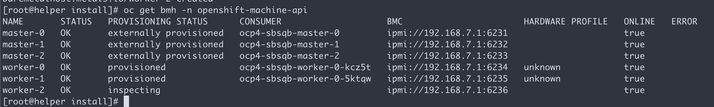
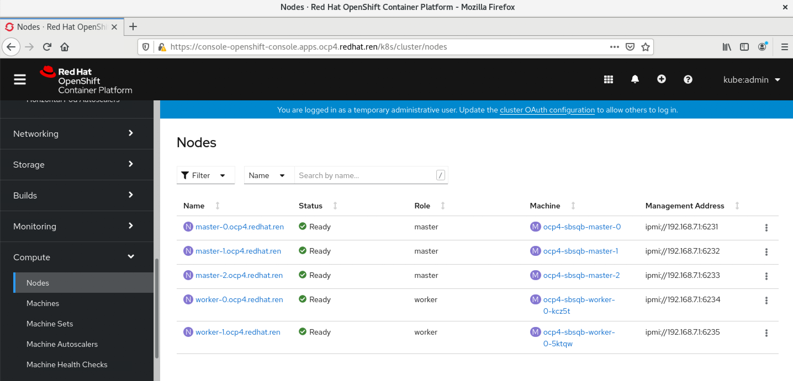

# openshift 4.6 离线 baremetal IPI (全自动)安装 使用 provisionning network

## 简介

视频讲解

[](https://www.bilibili.com/video/BV1hv41147or/)

- [bilibili](https://www.bilibili.com/video/BV1hv41147or/)
- [xigua](https://www.ixigua.com/6906507322315670030)
- [youtube](https://youtu.be/AFpvyb2pTiI)

本文描述ocp4.6在baremental(kvm模拟)上面，IPI (全自动)安装。

根据openshift文档，baremetal IPI安装有两种模式，一种是provisioning网络独立，另外一种是provisioning网络和baremetal(服务)网络合并的模式。考虑到POC现场的环境，本次实验，使用复杂的网络部署，也就是baremental, provisioning network分离的模式。

以下是本次实验的架构图:


## 离线安装包下载
打包好的安装包，在这里下载，百度盘下载链接，版本是4.6.5:

链接: https://pan.baidu.com/s/1-5QWpayV2leinq4DOtiFEg  密码: gjoe

其中包括如下类型的文件：
- ocp4.tgz  这个文件包含了iso等安装介质，以及各种安装脚本，全部下载的镜像列表等。需要复制到宿主机，以及工具机上去。
- registry.tgz  这个文件也是docker image registry的仓库打包文件。需要先补充镜像的话，按照这里操作: [4.6.add.image.md](./4.6.add.image.md)

合并这些切分文件，使用类似如下的命令
```bash
cat registry.?? > registry.tgz
```

注意，可能需要更新离线镜像包中的helper用的ansible脚本。

## 在外网云主机上面准备离线安装源

准备离线安装介质的文档，已经转移到了这里：[4.6.build.dist.md](4.6.build.dist.md)

## 宿主机准备

本次实验，是在一个32C， 256G 的主机上面，用很多个虚拟机安装测试。所以先准备这个宿主机。

如果是多台宿主机，记得一定要调整时间配置，让这些宿主机的时间基本一致，否则证书会出问题。

主要的准备工作有
- 配置yum源
- 配置dns
- 安装镜像仓库
- 配置vnc环境
- 配置kvm需要的网络
- 创建helper kvm

以上准备工作，dns部分需要根据实际项目环境有所调整。

本次的宿主机是一台rhel8, 参考这里进行基本的配置配置[rhel8.build.kernel.repo.cache.md](../../rhel/rhel8.build.kernel.repo.cache.md)

```bash
cat << EOF > /root/.ssh/config
StrictHostKeyChecking no
UserKnownHostsFile=/dev/null
EOF

cat << EOF >>  /etc/hosts
127.0.0.1 registry.ocp4.redhat.ren
EOF

dnf clean all
dnf repolist

dnf -y install byobu htop jq ipmitool

systemctl disable --now firewalld

# 配置registry
mkdir -p /etc/crts/ && cd /etc/crts

# https://access.redhat.com/documentation/en-us/red_hat_codeready_workspaces/2.1/html/installation_guide/installing-codeready-workspaces-in-tls-mode-with-self-signed-certificates_crw
openssl genrsa -out /etc/crts/redhat.ren.ca.key 4096
openssl req -x509 \
  -new -nodes \
  -key /etc/crts/redhat.ren.ca.key \
  -sha256 \
  -days 36500 \
  -out /etc/crts/redhat.ren.ca.crt \
  -subj /CN="Local Red Hat Ren Signer" \
  -reqexts SAN \
  -extensions SAN \
  -config <(cat /etc/pki/tls/openssl.cnf \
      <(printf '[SAN]\nbasicConstraints=critical, CA:TRUE\nkeyUsage=keyCertSign, cRLSign, digitalSignature'))

openssl genrsa -out /etc/crts/redhat.ren.key 2048

openssl req -new -sha256 \
    -key /etc/crts/redhat.ren.key \
    -subj "/O=Local Red Hat Ren /CN=*.ocp4.redhat.ren" \
    -reqexts SAN \
    -config <(cat /etc/pki/tls/openssl.cnf \
        <(printf "\n[SAN]\nsubjectAltName=DNS:*.ocp4.redhat.ren,DNS:*.apps.ocp4.redhat.ren,DNS:*.redhat.ren\nbasicConstraints=critical, CA:FALSE\nkeyUsage=digitalSignature, keyEncipherment, keyAgreement, dataEncipherment\nextendedKeyUsage=serverAuth")) \
    -out /etc/crts/redhat.ren.csr

openssl x509 \
    -req \
    -sha256 \
    -extfile <(printf "subjectAltName=DNS:*.ocp4.redhat.ren,DNS:*.apps.ocp4.redhat.ren,DNS:*.redhat.ren\nbasicConstraints=critical, CA:FALSE\nkeyUsage=digitalSignature, keyEncipherment, keyAgreement, dataEncipherment\nextendedKeyUsage=serverAuth") \
    -days 365 \
    -in /etc/crts/redhat.ren.csr \
    -CA /etc/crts/redhat.ren.ca.crt \
    -CAkey /etc/crts/redhat.ren.ca.key \
    -CAcreateserial -out /etc/crts/redhat.ren.crt

openssl x509 -in /etc/crts/redhat.ren.crt -text

/bin/cp -f /etc/crts/redhat.ren.ca.crt /etc/pki/ca-trust/source/anchors/
update-ca-trust extract

cd /data
mkdir -p /data/registry
# tar zxf registry.tgz
dnf -y install podman pigz skopeo jq 
# pigz -dc registry.tgz | tar xf -
cd /data/ocp4
podman load -i /data/ocp4/registry.tgz

podman run --name local-registry -p 5443:5000 \
  -d --restart=always \
  -v /data/registry/:/var/lib/registry:z \
  -v /etc/crts:/certs:z \
  -e REGISTRY_HTTP_TLS_CERTIFICATE=/certs/redhat.ren.crt \
  -e REGISTRY_HTTP_TLS_KEY=/certs/redhat.ren.key \
  docker.io/library/registry:2

podman start local-registry

# firewall-cmd --permanent --add-port=5443/tcp
# firewall-cmd --reload

# 加载更多的镜像
# 解压缩 ocp4.tgz
bash add.image.load.sh /data/install.image 'registry.ocp4.redhat.ren:5443'

# https://github.com/christianh814/ocp4-upi-helpernode/blob/master/docs/quickstart.md

# 准备vnc环境
vncpasswd

cat << EOF > ~/.vnc/config
session=gnome
securitytypes=vncauth,tlsvnc
desktop=sandbox
geometry=1280x800
alwaysshared
EOF

cat << EOF >> /etc/tigervnc/vncserver.users
:1=root
EOF

systemctl start vncserver@:1
# 如果你想停掉vnc server，这么做
systemctl stop vncserver@:1

# firewall-cmd --permanent --add-port=6001/tcp
# firewall-cmd --permanent --add-port=5901/tcp
# firewall-cmd --reload

# connect vnc at port 5901
# export DISPLAY=:1

# 创建实验用虚拟网络

cat << 'EOF' > /data/kvm/bridge.sh
#!/usr/bin/env bash

PUB_CONN='eno1'
PUB_IP='172.21.6.105/24'
PUB_GW='172.21.6.254'
PUB_DNS='172.21.1.1'

nmcli con down "$PUB_CONN"
nmcli con delete "$PUB_CONN"
nmcli con down baremental
nmcli con delete baremental
# RHEL 8.1 appends the word "System" in front of the connection,delete in case it exists
nmcli con down "System $PUB_CONN"
nmcli con delete "System $PUB_CONN"
nmcli connection add ifname baremetal type bridge con-name baremetal ipv4.method 'manual' \
    ipv4.address "$PUB_IP" \
    ipv4.gateway "$PUB_GW" \
    ipv4.dns "$PUB_DNS"
    
nmcli con add type bridge-slave ifname "$PUB_CONN" master baremetal
pkill dhclient;dhclient baremetal
nmcli con down baremetal
nmcli con up baremetal
EOF
bash /data/kvm/bridge.sh
nmcli con mod baremental +ipv4.address '192.168.7.1/24'

cat << 'EOF' > /data/kvm/bridge.provisioning.sh
#!/usr/bin/env bash

PUB_CONN='eno2'
PUB_IP='172.22.0.1/24'

nmcli con down "$PUB_CONN"
nmcli con delete "$PUB_CONN"
nmcli con down provisioning
nmcli con delete provisioning
# RHEL 8.1 appends the word "System" in front of the connection,delete in case it exists
nmcli con down "System $PUB_CONN"
nmcli con delete "System $PUB_CONN"
nmcli connection add ifname provisioning type bridge con-name provisioning ipv4.addresses $PUB_IP ipv4.method manual
    
nmcli con add type bridge-slave ifname "$PUB_CONN" master provisioning
nmcli con down provisioning
nmcli con up provisioning
EOF
bash /data/kvm/bridge.provisioning.sh

nmcli networking off; nmcli networking on

# 创建工具机

mkdir -p /data/kvm
cd /data/kvm

lvremove -f rhel/helperlv
lvcreate -y -L 100G -n helperlv rhel

virt-install --name="ocp4-aHelper" --vcpus=4 --ram=6144 \
--disk path=/dev/rhel/helperlv,device=disk,bus=virtio,format=raw \
--os-variant rhel8.0 --network bridge=baremetal,model=virtio \
--boot menu=on --location /data/kvm/rhel-8.3-x86_64-dvd.iso \
--initrd-inject helper-ks-rhel8-ipi.cfg --extra-args "inst.ks=file:/helper-ks-rhel8-ipi.cfg" 

virsh start ocp4-aHelper

# DO NOT USE, restore kvm
virsh destroy ocp4-aHelper
virsh undefine ocp4-aHelper

# virt-viewer --domain-name ocp4-aHelper
# virsh start ocp4-aHelper
# virsh list --all

# start chrony/ntp server on host
/bin/cp -f /etc/chrony.conf /etc/chrony.conf.default
cat << EOF > /etc/chrony.conf
# pool 2.rhel.pool.ntp.org iburst
driftfile /var/lib/chrony/drift
makestep 1.0 3
rtcsync
allow 192.0.0.0/8
local stratum 10
logdir /var/log/chrony
EOF
systemctl enable --now chronyd
# systemctl restart chronyd
chronyc tracking
chronyc sources -v
chronyc sourcestats -v
chronyc makestep

# setup ftp data root
mount --bind /data/dnf /var/ftp/dnf
chcon -R -t public_content_t  /var/ftp/dnf

# create the master and worker vm, but not start them
export KVM_DIRECTORY=/data/kvm

# cd ${KVM_DIRECTORY}
# scp root@192.168.7.11:/data/install/*.iso ${KVM_DIRECTORY}/

create_lv() {
    var_vg=$1
    var_lv=$2
    lvremove -f $var_vg/$var_lv
    lvcreate -y -L 120G -n $var_lv $var_vg
    wipefs --all --force /dev/$var_vg/$var_lv
}

# create_lv rhel bootstraplv
create_lv nvme master0lv
create_lv nvme master1lv
create_lv nvme master2lv
create_lv rhel worker0lv
create_lv rhel worker1lv
create_lv rhel worker2lv

virt-install --name=ocp4-master0 --vcpus=4 --ram=16384 \
--disk path=/dev/nvme/master0lv,device=disk,bus=virtio,format=raw \
--os-variant rhel8.0 --network bridge=provisioning,model=virtio \
--network bridge=baremetal,model=virtio \
--boot uefi,nvram_template=/usr/share/OVMF/OVMF_VARS.fd,menu=on  \
--print-xml > ${KVM_DIRECTORY}/ocp4-master0.xml
virsh define --file ${KVM_DIRECTORY}/ocp4-master0.xml

virt-install --name=ocp4-master1 --vcpus=4 --ram=16384 \
--disk path=/dev/nvme/master1lv,device=disk,bus=virtio,format=raw \
--os-variant rhel8.0 --network bridge=provisioning,model=virtio \
--network bridge=baremetal,model=virtio \
--boot uefi,nvram_template=/usr/share/OVMF/OVMF_VARS.fd,menu=on  \
--print-xml > ${KVM_DIRECTORY}/ocp4-master1.xml
virsh define --file ${KVM_DIRECTORY}/ocp4-master1.xml

virt-install --name=ocp4-master2 --vcpus=4 --ram=16384 \
--disk path=/dev/nvme/master2lv,device=disk,bus=virtio,format=raw \
--os-variant rhel8.0 --network bridge=provisioning,model=virtio \
--network bridge=baremetal,model=virtio \
--boot uefi,nvram_template=/usr/share/OVMF/OVMF_VARS.fd,menu=on  \
--print-xml > ${KVM_DIRECTORY}/ocp4-master2.xml
virsh define --file ${KVM_DIRECTORY}/ocp4-master2.xml

virt-install --name=ocp4-worker0 --vcpus=4 --ram=32768 \
--disk path=/dev/rhel/worker0lv,device=disk,bus=virtio,format=raw \
--os-variant rhel8.0 --network bridge=provisioning,model=virtio \
--network bridge=baremetal,model=virtio \
--boot uefi,nvram_template=/usr/share/OVMF/OVMF_VARS.fd,menu=on  \
--print-xml > ${KVM_DIRECTORY}/ocp4-worker0.xml
virsh define --file ${KVM_DIRECTORY}/ocp4-worker0.xml

virt-install --name=ocp4-worker1 --vcpus=4 --ram=16384 \
--disk path=/dev/rhel/worker1lv,device=disk,bus=virtio,format=raw \
--os-variant rhel8.0 --network bridge=provisioning,model=virtio \
--network bridge=baremetal,model=virtio \
--boot uefi,nvram_template=/usr/share/OVMF/OVMF_VARS.fd,menu=on  \
--print-xml > ${KVM_DIRECTORY}/ocp4-worker1.xml
virsh define --file ${KVM_DIRECTORY}/ocp4-worker1.xml

virt-install --name=ocp4-worker2 --vcpus=4 --ram=16384 \
--disk path=/dev/rhel/worker2lv,device=disk,bus=virtio,format=raw \
--os-variant rhel8.0 --network bridge=provisioning,model=virtio \
--network bridge=baremetal,model=virtio \
--boot uefi,nvram_template=/usr/share/OVMF/OVMF_VARS.fd,menu=on  \
--print-xml > ${KVM_DIRECTORY}/ocp4-worker2.xml
virsh define --file ${KVM_DIRECTORY}/ocp4-worker2.xml

cd /data/kvm/
for i in master{0..2} worker{0..2}
do
  echo -ne "${i}\t" ; 
  virsh dumpxml ocp4-${i} | grep "mac address" | cut -d\' -f2 | tr '\n' '\t'
  echo 
done > mac.list
cat /data/kvm/mac.list
# master0 52:54:00:a8:77:90       52:54:00:1f:1c:1f
# master1 52:54:00:8a:97:b3       52:54:00:a1:d6:df
# master2 52:54:00:54:8f:4a       52:54:00:0b:7c:61
# worker0 52:54:00:4c:8a:80       52:54:00:f0:f4:2b
# worker1 52:54:00:89:eb:62       52:54:00:ee:e4:2b
# worker2 52:54:00:e1:ec:6e       52:54:00:1b:d6:b5

# GOTO image registry & kvm host
# copy crt files to helper node
ssh-copy-id root@192.168.7.11

ssh root@192.168.7.11 mkdir -p /data/install
ssh root@192.168.7.11 mkdir -p /data/ocp4
scp /data/down/ocp4.tgz root@192.168.7.11:/data/

scp /etc/crts/redhat.ren.ca.crt root@192.168.7.11:/data/install/
scp /data/kvm/mac.list root@192.168.7.11:/data/install/

# install redfish for kvm
# https://access.redhat.com/solutions/4315581
# https://access.redhat.com/solutions/3057171
# https://docs.openstack.org/virtualbmc/latest/user/index.html
# https://docs.openstack.org/sushy-tools/latest/user/dynamic-emulator.html
dnf -y install python3-pip
# pip3 install --user sushy-tools

mkdir -p /data/install
cd /data/install
podman create --name swap docker.io/wangzheng422/imgs:ocp.bm.ipi.python.dep.rhel8-4.6.7 ls
podman cp swap:/wheelhouse.tar.gz - > wheelhouse.tar.gz
tar zvxf wheelhouse.tar.gz
podman rm -fv swap

pip3 install --user -r wheelhouse/requirements.txt --no-index --find-links wheelhouse

ps -ef | grep vbmcd | awk '{print $2}' | xargs kill
/bin/rm -f /root/.vbmc/master.pid
/root/.local/bin/vbmcd

/root/.local/bin/sushy-emulator -i 0.0.0.0 --ssl-certificate /etc/crts/redhat.ren.crt --ssl-key /etc/crts/redhat.ren.key

# curl https://registry.ocp4.redhat.ren:8000/redfish/v1/Systems/


virsh list --all
# /root/.local/bin/vbmc add ocp4-bootstrap --port 6230 --username admin --password password
# /root/.local/bin/vbmc start ocp4-bootstrap

var_i=1
for i in master{0..2} worker{0..2}
do
  /root/.local/bin/vbmc add ocp4-$i --port $(( 6230 + $var_i )) --username admin --password password
  /root/.local/bin/vbmc start ocp4-$i
  (( var_i += 1))
done

/root/.local/bin/vbmc list
# +--------------+---------+---------+------+
# | Domain name  | Status  | Address | Port |
# +--------------+---------+---------+------+
# | ocp4-master0 | running | ::      | 6231 |
# | ocp4-master1 | running | ::      | 6232 |
# | ocp4-master2 | running | ::      | 6233 |
# | ocp4-worker0 | running | ::      | 6234 |
# | ocp4-worker1 | running | ::      | 6235 |
# | ocp4-worker2 | running | ::      | 6236 |
# +--------------+---------+---------+------+

/root/.local/bin/vbmc show ocp4-master0

# DO NOT USE, restore

var_i=1
for i in master{0..2} worker{0..2}
do
  /root/.local/bin/vbmc stop ocp4-$i
  /root/.local/bin/vbmc delete ocp4-$i
  (( var_i += 1))
done

# if you want to stop or delete vm, try this
virsh list --all
# virsh destroy ocp4-bootstrap
virsh destroy ocp4-master0 
virsh destroy ocp4-master1 
virsh destroy ocp4-master2 
virsh destroy ocp4-worker0 
virsh destroy ocp4-worker1 
virsh destroy ocp4-worker2
# virsh undefine ocp4-bootstrap
virsh undefine ocp4-master0 --nvram
virsh undefine ocp4-master1 --nvram
virsh undefine ocp4-master2 --nvram
virsh undefine ocp4-worker0 --nvram
virsh undefine ocp4-worker1 --nvram
virsh undefine ocp4-worker2 --nvram

```
## 工具机准备

以下是在工具机里面，进行的安装操作。

主要的操作有
- 配置yum源
- 运行ansible脚本，自动配置工具机
- 上传定制的安装配置文件
- 生成ignition文件

```bash

sed -i 's/#UseDNS yes/UseDNS no/g' /etc/ssh/sshd_config
systemctl restart sshd

cat << EOF > /root/.ssh/config
StrictHostKeyChecking no
UserKnownHostsFile=/dev/null
EOF

systemctl disable --now firewalld

# in helper node
mkdir /etc/yum.repos.d.bak
mv /etc/yum.repos.d/* /etc/yum.repos.d.bak

export YUMIP="192.168.7.1"
cat << EOF > /etc/yum.repos.d/remote.repo
[remote-epel]
name=epel
baseurl=ftp://${YUMIP}/dnf/epel
enabled=1
gpgcheck=0

[remote-epel-modular]
name=epel-modular
baseurl=ftp://${YUMIP}/dnf/epel-modular
enabled=1
gpgcheck=0

[remote-appstream]
name=appstream
baseurl=ftp://${YUMIP}/dnf/rhel-8-for-x86_64-appstream-rpms
enabled=1
gpgcheck=0

[remote-baseos]
name=baseos
baseurl=ftp://${YUMIP}/dnf/rhel-8-for-x86_64-baseos-rpms
enabled=1
gpgcheck=0

[remote-baseos-source]
name=baseos-source
baseurl=ftp://${YUMIP}/dnf/rhel-8-for-x86_64-baseos-source-rpms
enabled=1
gpgcheck=0

[remote-supplementary]
name=supplementary
baseurl=ftp://${YUMIP}/dnf/rhel-8-for-x86_64-supplementary-rpms
enabled=1
gpgcheck=0

[remote-codeready-builder]
name=supplementary
baseurl=ftp://${YUMIP}/dnf/codeready-builder-for-rhel-8-x86_64-rpms
enabled=1
gpgcheck=0

EOF

yum clean all
yum makecache
yum repolist

yum -y install ansible git unzip podman python3

yum -y update

reboot

# yum -y install ansible git unzip podman python36

mkdir -p /data/ocp4/
# scp ocp4.tgz to /data
# scp /data/down/ocp4.tgz root@192.168.7.11:/data/
cd /data
tar zvxf ocp4.tgz
cd /data/ocp4

# 这里使用了一个ansible的项目，用来部署helper节点的服务。
# https://github.com/wangzheng422/ocp4-upi-helpernode
unzip ocp4-upi-helpernode.zip
# 这里使用了一个ignition文件合并的项目，用来帮助自定义ignition文件。
# https://github.com/wangzheng422/filetranspiler
podman load -i filetranspiler.tgz

mkdir -p /data/install

mkdir -p /data/ocp4/

cat << EOF > /data/ocp4/ocp4-upi-helpernode-master/vars-dhcp.rhel8.yaml
---
ssh_gen_key: true
staticips: false
bm_ipi: true
firewalld: false
dns_forward: false
iso:
  iso_dl_url: "file:///data/ocp4/rhcos-live.x86_64.iso"
  my_iso: "rhcos-live.iso"
helper:
  name: "helper"
  ipaddr: "192.168.7.11"
  networkifacename: "enp1s0"
  gateway: "192.168.7.1"
  netmask: "255.255.255.0"
dns:
  domain: "redhat.ren"
  clusterid: "ocp4"
  forwarder1: "192.168.7.1"
  forwarder2: "192.168.7.1"
  api_vip: "192.168.7.100"
  ingress_vip: "192.168.7.101"
dhcp:
  router: "192.168.7.1"
  bcast: "192.168.7.255"
  netmask: "255.255.255.0"
  poolstart: "192.168.7.70"
  poolend: "192.168.7.90"
  ipid: "192.168.7.0"
  netmaskid: "255.255.255.0"
bootstrap:
  name: "bootstrap"
  ipaddr: "192.168.7.12"
  interface: "enp1s0"
  install_drive: "vda"
  macaddr: "52:54:00:7e:f8:f7"
masters:
  - name: "master-0"
    ipaddr: "192.168.7.13"
    interface: "enp1s0"
    install_drive: "vda"
    macaddr: "$(cat /data/install/mac.list | grep master0 | awk '{print $3}')"
  - name: "master-1"
    ipaddr: "192.168.7.14"
    interface: "enp1s0"
    install_drive: "vda"    
    macaddr: "$(cat /data/install/mac.list | grep master1 | awk '{print $3}')"
  - name: "master-2"
    ipaddr: "192.168.7.15"
    interface: "enp1s0"
    install_drive: "vda"   
    macaddr: "$(cat /data/install/mac.list | grep master2 | awk '{print $3}')"
workers:
  - name: "worker-0"
    ipaddr: "192.168.7.16"
    interface: "enp1s0"
    install_drive: "vda"
    macaddr: "$(cat /data/install/mac.list | grep worker0 | awk '{print $3}')"
  - name: "worker-1"
    ipaddr: "192.168.7.17"
    interface: "enp1s0"
    install_drive: "vda"
    macaddr: "$(cat /data/install/mac.list | grep worker1 | awk '{print $3}')"
  - name: "worker-2"
    ipaddr: "192.168.7.18"
    interface: "enp1s0"
    install_drive: "vda"
    macaddr: "$(cat /data/install/mac.list | grep worker2 | awk '{print $3}')"
others:
  - name: "registry"
    ipaddr: "192.168.7.1"
    macaddr: "52:54:00:7e:f8:f7"
  - name: "yum"
    ipaddr: "192.168.7.1"
    macaddr: "52:54:00:7e:f8:f7"
  - name: "quay"
    ipaddr: "192.168.7.1"
    macaddr: "52:54:00:7e:f8:f7"
otherdomains:
  - domain: "rhv.redhat.ren"
    hosts:
    - name: "manager"
      ipaddr: "192.168.7.71"
    - name: "rhv01"
      ipaddr: "192.168.7.72"
  - domain: "cmri-edge.redhat.ren"
    hosts:
    - name: "*"
      ipaddr: "192.168.7.71"
    - name: "*.apps"
      ipaddr: "192.168.7.72"
force_ocp_download: false
remove_old_config_files: false
ocp_client: "file:///data/ocp4/4.6.5/openshift-client-linux-4.6.5.tar.gz"
ocp_installer: "file:///data/ocp4/4.6.5/openshift-install-linux-4.6.5.tar.gz"
ppc64le: false
arch: 'x86_64'
chronyconfig:
  enabled: true
  content:
    - server: "192.168.7.1"
      options: iburst
setup_registry:
  deploy: false
  registry_image: docker.io/library/registry:2
  local_repo: "ocp4/openshift4"
  product_repo: "openshift-release-dev"
  release_name: "ocp-release"
  release_tag: "4.6.1-x86_64"
registry_server: "registry.ocp4.redhat.ren:5443"
EOF

# 接下来，我们使用ansible来配置helper节点，装上各种openshift集群需要的服务
# 根据现场环境，修改 ocp4-upi-helpernode-master/vars-static.yaml
cd /data/ocp4/ocp4-upi-helpernode-master
ansible-playbook -e @vars-dhcp.rhel8.yaml -e '{ staticips: false, bm_ipi: true }'  tasks/main.yml

# try this:
/usr/local/bin/helpernodecheck

# GO back to help node
/bin/cp -f /data/install/redhat.ren.ca.crt /etc/pki/ca-trust/source/anchors/
update-ca-trust extract

# 定制ignition
cd /data/install

# 根据现场环境，修改 install-config.yaml
# 至少要修改ssh key， 还有 additionalTrustBundle，这个是镜像仓库的csr 

# vi install-config.yaml 
cat << EOF > /data/install/install-config.yaml 
apiVersion: v1
baseDomain: redhat.ren
platform:
  baremetal:
    apiVIP: 192.168.7.100
    ingressVIP: 192.168.7.101
    # provisioningBridge: provisioning
    provisioningNetworkCIDR: 172.22.0.0/24
    # provisioningDHCPRange: 172.22.0.10,172.22.0.100
    # clusterProvisioningIP: 172.22.0.3
    # bootstrapProvisioningIP: 172.22.0.2
    # provisioningNetwork: Managed
    provisioningNetworkInterface: enp1s0
    # externalBridge: baremetal
    bootstrapOSImage: http://192.168.7.11:8080/install/rhcos-qemu.x86_64.qcow2.gz?sha256=$(zcat /var/www/html/install/rhcos-qemu.x86_64.qcow2.gz | sha256sum | awk '{print $1}')
    clusterOSImage: http://192.168.7.11:8080/install/rhcos-openstack.x86_64.qcow2.gz?sha256=$(sha256sum /var/www/html/install/rhcos-openstack.x86_64.qcow2.gz | awk '{print $1}')
    hosts:
      - name: master-0
        role: master
        bmc:
          address: ipmi://192.168.7.1:6231
          username: admin
          password: password
          disableCertificateVerification: True
        bootMACAddress: $(cat mac.list | grep master0 | awk '{print $2}')
        hardwareProfile: default 
        rootDeviceHints:
          deviceName: "/dev/vda"
      - name: master-1
        role: master
        bmc:
          address: ipmi://192.168.7.1:6232
          username: admin
          password: password
          disableCertificateVerification: True
        bootMACAddress: $(cat mac.list | grep master1 | awk '{print $2}')
        hardwareProfile: default 
        rootDeviceHints:
          deviceName: "/dev/vda"
      - name: master-2
        role: master
        bmc:
          address: ipmi://192.168.7.1:6233
          username: admin
          password: password
          disableCertificateVerification: True
        bootMACAddress: $(cat mac.list | grep master2 | awk '{print $2}')
        hardwareProfile: default 
        rootDeviceHints:
          deviceName: "/dev/vda"
      - name: worker-0
        role: worker
        bmc:
          address: ipmi://192.168.7.1:6234
          username: admin
          password: password
          disableCertificateVerification: True
        bootMACAddress: $(cat mac.list | grep worker0 | awk '{print $2}')
        hardwareProfile: unknown         
        rootDeviceHints:
          deviceName: "/dev/vda"
      - name: worker-1
        role: worker
        bmc:
          address: ipmi://192.168.7.1:6235
          username: admin
          password: password
          disableCertificateVerification: True
        bootMACAddress: $(cat mac.list | grep worker1 | awk '{print $2}')
        hardwareProfile: unknown         
        rootDeviceHints:
          deviceName: "/dev/vda"
metadata:
  name: ocp4
networking:
  clusterNetworks:
  - cidr: 10.254.0.0/16
    hostPrefix: 24
  networkType: OpenShiftSDN
  serviceNetwork:
  - 172.30.0.0/16
  machineCIDR: 192.168.7.0/24
compute:
- name: worker
  replicas: 2
controlPlane:
  name: master
  replicas: 3
  platform:
    baremetal: {}
pullSecret: '{"auths":{"registry.ocp4.redhat.ren:5443": {"auth": "ZHVtbXk6ZHVtbXk=","email": "noemail@localhost"},"registry.ppa.redhat.ren:5443": {"auth": "ZHVtbXk6ZHVtbXk=","email": "noemail@localhost"}}}'
sshKey: |
$( cat /root/.ssh/helper_rsa.pub | sed 's/^/   /g' )
additionalTrustBundle: |
$( cat /data/install/redhat.ren.ca.crt | sed 's/^/   /g' )
imageContentSources:
- mirrors:
  - registry.ocp4.redhat.ren:5443/ocp4/openshift4
  source: quay.io/openshift-release-dev/ocp-release
- mirrors:
  - registry.ocp4.redhat.ren:5443/ocp4/openshift4
  source: quay.io/openshift-release-dev/ocp-v4.0-art-dev
EOF

# GO back to host
mkdir -p /data/install
cd /data/install
scp root@192.168.7.11:/data/install/install-config.yaml /data/install/

cd /data/install
for i in $(sudo virsh list --all | tail -n +3 | grep bootstrap | awk {'print $2'});
do
  sudo virsh destroy $i;
  sudo virsh undefine $i;
  sudo virsh vol-delete $i --pool default;
  sudo virsh vol-delete $i.ign --pool default;
  virsh pool-destroy $i
  virsh pool-delete $i
  virsh pool-undefine $i
done
/bin/rm -rf .openshift_install.log .openshift_install_state.json terraform* auth tls 
./openshift-baremetal-install --dir /data/install/ --log-level debug create cluster
# INFO Install complete!
# INFO To access the cluster as the system:admin user when using 'oc', run 'export KUBECONFIG=/data/install/auth/kubeconfig'
# INFO Access the OpenShift web-console here: https://console-openshift-console.apps.ocp4.redhat.ren
# INFO Login to the console with user: "kubeadmin", and password: "dTSbu-aIIZr-gxRxT-njrEr"
```

安装的过程是全自动的，所以也不用干什么，在provisioning network的模式下，可以看到master激活了2个网卡。


接着，我们就可以去helper节点上，用我们熟悉的oc命令操作集群了。
```bash
# on kvm host, copy back auth folder
rsync -arz /data/install/auth root@192.168.7.11:/data/install/

# Go back to helper
ansible localhost -m lineinfile -a 'path=$HOME/.bashrc regexp="^export KUBECONFIG" line="export KUBECONFIG=/data/install/auth/kubeconfig"'
source $HOME/.bashrc

oc get node
oc get pod -n openshift-machine-api
oc get BareMetalHost -n openshift-machine-api
oc get bmh -n openshift-machine-api
# NAME       STATUS   PROVISIONING STATUS      CONSUMER                    BMC                       HARDWARE PROFILE   ONLINE   ERROR
# master-0   OK       externally provisioned   ocp4-sbsqb-master-0         ipmi://192.168.7.1:6231                      true
# master-1   OK       externally provisioned   ocp4-sbsqb-master-1         ipmi://192.168.7.1:6232                      true
# master-2   OK       externally provisioned   ocp4-sbsqb-master-2         ipmi://192.168.7.1:6233                      true
# worker-0   OK       provisioned              ocp4-sbsqb-worker-0-kcz5t   ipmi://192.168.7.1:6234   unknown            true
# worker-1   OK       provisioned              ocp4-sbsqb-worker-0-5ktqw   ipmi://192.168.7.1:6235   unknown            true
# worker-2   OK       ready                                                ipmi://192.168.7.1:6236   unknown            false

oc get pod -n openshift-kni-infra
```

我们就能看到bm的输出了


可以看到web console上node的配置指向了bm


我们也可以看到久违的machine配置


## 添加一个新节点
IPI 模式下，添加一个新节点非常方便，只要定义一个BareMetalHost就好了。
```bash
cd /data/install/
cat << EOF > /data/install/bmh.yaml
---
apiVersion: v1
kind: Secret
metadata:
  name: worker-2-bmc-secret
type: Opaque
data:
  username: $(echo -ne "admin" | base64)
  password: $(echo -ne "password" | base64)
---
apiVersion: metal3.io/v1alpha1
kind: BareMetalHost
metadata:
  name: worker-2
spec:
  online: true
  bootMACAddress: $(cat mac.list | grep worker2 | awk '{print $2}')
  bmc:
    address: ipmi://192.168.7.1:6236
    credentialsName: worker-2-bmc-secret
    disableCertificateVerification: true
  hardwareProfile: unknown         
  rootDeviceHints:
    deviceName: /dev/vda
EOF
oc -n openshift-machine-api create -f bmh.yaml

# DO NOT USE, restore, delete the vm
oc -n openshift-machine-api delete -f bmh.yaml

oc get bmh -n openshift-machine-api
# NAME       STATUS   PROVISIONING STATUS      CONSUMER                    BMC                       HARDWARE PROFILE   ONLINE   ERROR
# master-0   OK       externally provisioned   ocp4-sbsqb-master-0         ipmi://192.168.7.1:6231                      true
# master-1   OK       externally provisioned   ocp4-sbsqb-master-1         ipmi://192.168.7.1:6232                      true
# master-2   OK       externally provisioned   ocp4-sbsqb-master-2         ipmi://192.168.7.1:6233                      true
# worker-0   OK       provisioned              ocp4-sbsqb-worker-0-kcz5t   ipmi://192.168.7.1:6234   unknown            true
# worker-1   OK       provisioned              ocp4-sbsqb-worker-0-5ktqw   ipmi://192.168.7.1:6235   unknown            true
# worker-2   OK       ready                                                ipmi://192.168.7.1:6236   unknown            false

oc get machinesets -n openshift-machine-api
# NAME                  DESIRED   CURRENT   READY   AVAILABLE   AGE
# ocp4-sbsqb-worker-0   2         2         2       2           99m

oc get machinesets -n openshift-machine-api -o json | jq -r .items[0].metadata.name

# 扩容worker到3副本，会触发worker-2的部署
oc scale --replicas=3 machineset $(oc get machinesets -n openshift-machine-api -o json | jq -r .items[0].metadata.name) -n openshift-machine-api

```

## 排错技巧

```bash

# login to bootstrap to debug
# find the ip from kvm console
ssh -i ~/.ssh/helper_rsa core@192.168.7.75
journalctl -b -f -u release-image.service -u bootkube.service
journalctl -b -u release-image.service -u bootkube.service | grep -i baremetal
sudo -i
export KUBECONFIG=/etc/kubernetes/kubeconfig
oc get pod -n openshift-machine-api
oc get BareMetalHost -n openshift-machine-api

# debug why bootstrap can't be ping...
cat .openshift_install_state.json | jq  '."*bootstrap.Bootstrap"'.Config.storage.files[].path

cat .openshift_install_state.json | jq -r '."*bootstrap.Bootstrap"'.File.Data | base64 -d | jq -r . > ign.json

cat .openshift_install_state.json | jq  -r '."*bootstrap.Bootstrap".Config.storage.files[].contents.source ' | sed 's/.*base64,//g' | base64 -d > decode

cat .openshift_install_state.json | jq  -r '."*bootstrap.Bootstrap".Config.storage.files[] | .path, .contents.source ' | while read -r line ; do if [[ $line =~ .*base64,.* ]]; then echo $(echo $line | sed 's/.*base64,//g' | base64 -d) ; else echo $line; fi; done > files


```
