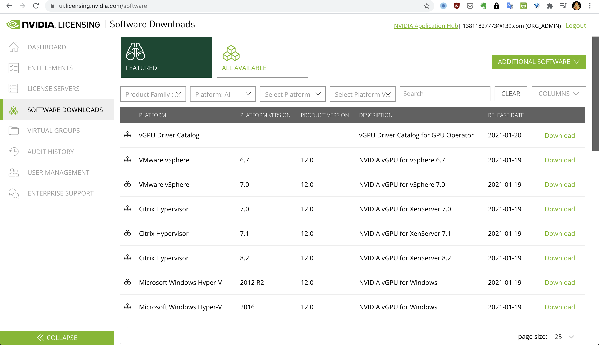
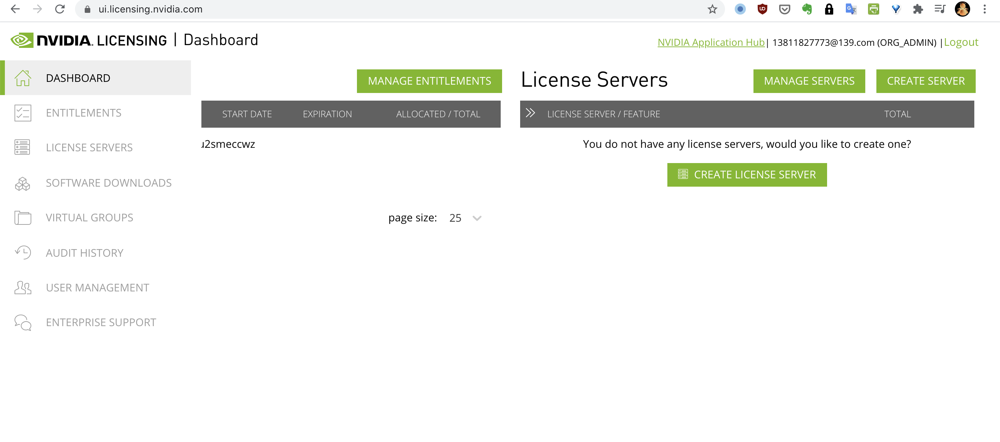
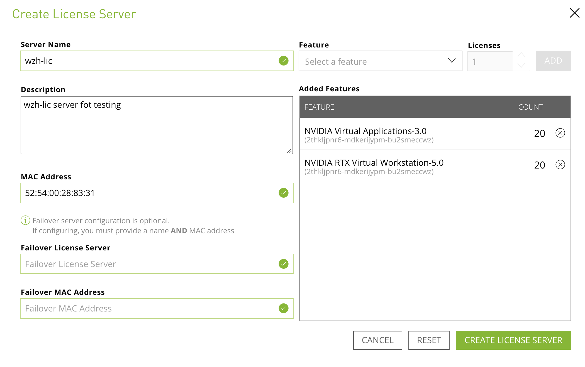
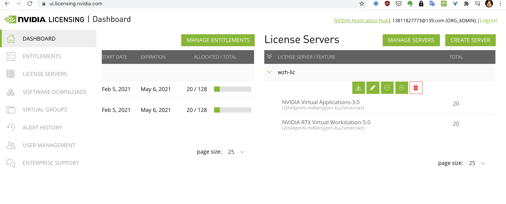
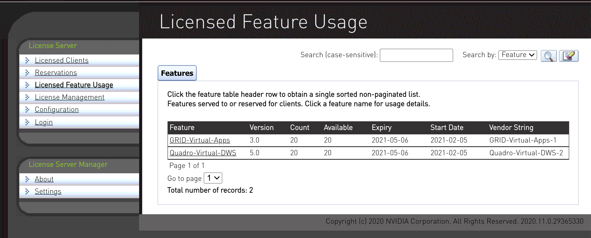

# openshift 4.6 with nvidia vGPU 安装

## nvidia license server安装

访问 https://nvid.nvidia.com/dashboard

下载软件


解压缩 NVIDIA-ls-Linux-2020.11.0.29365330.zip ， 参考里面的 license server的说明书，我们在helper kvm里面，安装license server

```bash
# on helper
yum install -y java
java -version
# openjdk version "1.8.0_275"
# OpenJDK Runtime Environment (build 1.8.0_275-b01)
# OpenJDK 64-Bit Server VM (build 25.275-b01, mixed mode)

# /usr/lib/jvm/java-1.8.0-openjdk-1.8.0.275.b01-1.el8_3.x86_64/jre/

sudo groupadd tomcat
useradd -d /usr/share/tomcat -g tomcat -M -s /bin/false tomcat
sudo mkdir -p /usr/share/tomcat

# wget https://apache.osuosl.org/tomcat/tomcat-10/v10.0.2/bin/apache-tomcat-10.0.2.tar.gz
# wget https://mirrors.ocf.berkeley.edu/apache/tomcat/tomcat-9/v9.0.43/bin/apache-tomcat-9.0.43.tar.gz
sudo tar xvf apache-tomcat-*.tar.gz -C /usr/share/tomcat --strip-components=1

cd /usr/share/tomcat
chown -R tomcat: /usr/share/tomcat
sudo chgrp -R tomcat /usr/share/tomcat
sudo chmod -R g+r conf
sudo chmod g+x conf
sudo chown -R tomcat webapps work temp logs

cat << EOF > /etc/systemd/system/tomcat.service 
[Unit]
Description=Apache Tomcat Server
After=network.target

[Service]
Type=forking

Environment=JAVA_HOME=/usr/lib/jvm/jre
Environment=CATALINA_PID=/usr/share/tomcat/temp/tomcat.pid
Environment=CATALINA_HOME=/usr/share/tomcat
Environment=CATALINA_BASE=/usr/share/tomcat
Environment='CATALINA_OPTS=-Xms512M -Xmx1024M -server -XX:+UseParallelGC'
# Environment='JAVA_OPTS=-Djava.awt.headless=true -Djava.security.egd=file:/ dev/./urandom'

ExecStart=/usr/share/tomcat/bin/startup.sh
ExecStop=/usr/share/tomcat/bin/shutdown.sh

User=tomcat
Group=tomcat
# UMask=0007
RestartSec=15
Restart=always

[Install]
WantedBy=multi-user.target

EOF

sudo systemctl daemon-reload
sudo systemctl enable --now tomcat.service

# helper 上面 httpd 占用了8080，我们改成8118
sed -i 's/Listen 8080/Listen 8118/' /etc/httpd/conf/httpd.conf
systemctl restart httpd

systemctl restart tomcat

# start vnc server
systemctl start vncserver@:1

# on vnc ui
unzip NVIDIA-ls-Linux-2020.11.0.29365330.zip
chmod +x setup.bin
./setup.bin
# ./setup.bin -i console

# check 8080 , for easy access, but leave it unchecked in production system
# http://192.168.7.11:8080/licserver

# 52:54:00:28:83:31

```
https://cloud.tencent.com/developer/news/312774

找到本机的mac地址，这个是作为申请license file用的

回到nvidia网站，准备注册这个license server


点击注册license server，填写mac信息，并且选择包含的license，以及准备注册的个数。



点击生成，然后就能看见已经创建了一个，下载就好了。


回到刚才安装的license server上，上传这个license文件


上传成功以后，就能看到导入了license，并且激活啦。


## 宿主机 vGPU 安装和配置

```bash
cat << EOF > /etc/modprobe.d/wzh-blacklist.conf
blacklist nouveau
blacklist rivafb
blacklist nvidiafb
blacklist rivatv
EOF

vi /etc/default/grub
GRUB_CMDLINE_LINUX="nofb splash=quiet console=tty0 ... intel_iommu=on rdblacklist=nouveau"

grub2-mkconfig -o /boot/grub2/grub.cfg

reboot


yum install ./NVIDIA-vGPU-rhel-8.3-460.32.04.x86_64.rpm
# Installing:
#  NVIDIA-vGPU-rhel                     x86_64                     1:8.3-460.32.04                      @commandline                      30 M
reboot

lsmod | grep vfio
# nvidia_vgpu_vfio       53248  0
# nvidia              33992704  10 nvidia_vgpu_vfio
# vfio_mdev              16384  0
# mdev                   20480  2 vfio_mdev,nvidia_vgpu_vfio
# vfio_iommu_type1       32768  0
# vfio                   32768  3 vfio_mdev,nvidia_vgpu_vfio,vfio_iommu_type1

systemctl status libvirtd 

nvidia-smi
# Mon Feb  8 17:37:01 2021
# +-----------------------------------------------------------------------------+
# | NVIDIA-SMI 460.32.04    Driver Version: 460.32.04    CUDA Version: N/A      |
# |-------------------------------+----------------------+----------------------+
# | GPU  Name        Persistence-M| Bus-Id        Disp.A | Volatile Uncorr. ECC |
# | Fan  Temp  Perf  Pwr:Usage/Cap|         Memory-Usage | GPU-Util  Compute M. |
# |                               |                      |               MIG M. |
# |===============================+======================+======================|
# |   0  Tesla T4            On   | 00000000:05:00.0 Off |                  Off |
# | N/A   36C    P8    16W /  70W |     79MiB / 16383MiB |      0%      Default |
# |                               |                      |                  N/A |
# +-------------------------------+----------------------+----------------------+

# +-----------------------------------------------------------------------------+
# | Processes:                                                                  |
# |  GPU   GI   CI        PID   Type   Process name                  GPU Memory |
# |        ID   ID                                                   Usage      |
# |=============================================================================|
# |  No running processes found                                                 |
# +-----------------------------------------------------------------------------+

lspci | grep NVIDIA
# 05:00.0 3D controller: NVIDIA Corporation TU104GL [Tesla T4] (rev a1)
virsh nodedev-list --cap pci| grep 05_00_0
# pci_0000_05_00_0
virsh nodedev-dumpxml pci_0000_05_00_0| egrep 'domain|bus|slot|function'
    # <domain>0</domain>
    # <bus>5</bus>
    # <slot>0</slot>
    # <function>0</function>
    # <capability type='virt_functions' maxCount='16'/>
    #   <address domain='0x0000' bus='0x05' slot='0x00' function='0x0'/>
cd /sys/bus/pci/devices/0000\:05\:00.0/mdev_supported_types/

for d in */ ; do
    echo -e "$d\t$(<$d/name)\t$(<$d/available_instances)\t$(<$d/description)"
done
# nvidia-222/     GRID T4-1B      16      num_heads=4, frl_config=45, framebuffer=1024M, max_resolution=5120x2880, max_instance=16
# nvidia-223/     GRID T4-2B      8       num_heads=4, frl_config=45, framebuffer=2048M, max_resolution=5120x2880, max_instance=8
# nvidia-224/     GRID T4-2B4     8       num_heads=4, frl_config=45, framebuffer=2048M, max_resolution=5120x2880, max_instance=8
# nvidia-225/     GRID T4-1A      16      num_heads=1, frl_config=60, framebuffer=1024M, max_resolution=1280x1024, max_instance=16
# nvidia-226/     GRID T4-2A      8       num_heads=1, frl_config=60, framebuffer=2048M, max_resolution=1280x1024, max_instance=8
# nvidia-227/     GRID T4-4A      4       num_heads=1, frl_config=60, framebuffer=4096M, max_resolution=1280x1024, max_instance=4
# nvidia-228/     GRID T4-8A      2       num_heads=1, frl_config=60, framebuffer=8192M, max_resolution=1280x1024, max_instance=2
# nvidia-229/     GRID T4-16A     1       num_heads=1, frl_config=60, framebuffer=16384M, max_resolution=1280x1024, max_instance=1
# nvidia-230/     GRID T4-1Q      16      num_heads=4, frl_config=60, framebuffer=1024M, max_resolution=5120x2880, max_instance=16
# nvidia-231/     GRID T4-2Q      8       num_heads=4, frl_config=60, framebuffer=2048M, max_resolution=7680x4320, max_instance=8
# nvidia-232/     GRID T4-4Q      4       num_heads=4, frl_config=60, framebuffer=4096M, max_resolution=7680x4320, max_instance=4
# nvidia-233/     GRID T4-8Q      2       num_heads=4, frl_config=60, framebuffer=8192M, max_resolution=7680x4320, max_instance=2
# nvidia-234/     GRID T4-16Q     1       num_heads=4, frl_config=60, framebuffer=16384M, max_resolution=7680x4320, max_instance=1
# nvidia-252/     GRID T4-1B4     16      num_heads=4, frl_config=45, framebuffer=1024M, max_resolution=5120x2880, max_instance=16
# nvidia-319/     GRID T4-4C      4       num_heads=1, frl_config=60, framebuffer=4096M, max_resolution=4096x2160, max_instance=4
# nvidia-320/     GRID T4-8C      2       num_heads=1, frl_config=60, framebuffer=8192M, max_resolution=4096x2160, max_instance=2
# nvidia-321/     GRID T4-16C     1       num_heads=1, frl_config=60, framebuffer=16384M, max_resolution=4096x2160, max_instance=1

VAR_DIR=`for d in */ ; do
    echo -e "$d\t$(<$d/name)\t$(<$d/available_instances)\t$(<$d/description)"
done | grep "T4-4A" | awk '{print $1}' `
echo $VAR_DIR

for i in {1..4}; do echo $(uuidgen) > $VAR_DIR/create; done

# to remove the vgpu
# find . -follow -maxdepth 4 -name remove -exec bash -c 'echo 1 > {}' \;

VAR_UUID=`find . -nowarn -follow -maxdepth 4 -name remove  2>/dev/null | xargs -I DEMO sh -c 'var=DEMO; var1="${var%/*}"; echo "${var1##*/}" ' `
echo $VAR_UUID

while read -r line; do
cat << EOF
<hostdev mode='subsystem' type='mdev' model='vfio-pci'> 
<source> <address uuid='$line'/> </source>
</hostdev>
EOF
done <<< "$VAR_UUID"

virsh edit ocp4-worker0
# ....
# <video>
# <model type='none'/> 
# </video>

ls -l /sys/bus/mdev/devices/

virsh start ocp4-worker0

# to debug
dmesg | grep -E "NVRM|nvidia"
grep vmiop_log: /var/log/messages


```

## vGPU driver 编译

https://docs.nvidia.com/datacenter/cloud-native/gpu-operator/install-gpu-operator-vgpu.html#considerations-to-install-gpu-operator-with-nvidia-vgpu-driver

我们需要编译一个driver

```bash
cd /data/gpu
/bin/rm -rf nvidia-vgpu-driver
# git clone https://gitlab.com/nvidia/container-images/driver.git
git clone https://github.com/wangzheng422/nvidia-vgpu-driver.git
cd nvidia-vgpu-driver
git checkout wzh-dev

cd rhcos4.6

export YUMIP="192.168.7.1"
cat << EOF > ./remote.repo
[gaps]
name=gaps
baseurl=ftp://${YUMIP}/dnf/gaps
enabled=1
gpgcheck=0

EOF

cat << EOF >> ./Dockerfile

RUN /bin/rm -rf /etc/yum.repos.d/* 
COPY remote.repo /etc/yum.repos.d/remote.repo

EOF

# upload NVIDIA-Linux-x86_64-460.32.03-grid.run to ./drivers folder
# upload vgpuDriverCatalog.yaml to ./drivers folder
# /bin/cp -f /data/gpu/driver/rhel8/drivers/* ./drivers/

cat << EOF > ./drivers/gridd.conf
# Description: Set License Server Address
# Data type: string
# Format:  "<address>"
ServerAddress=192.168.7.11

# Description: Set License Server port number
# Data type: integer
# Format:  <port>, default is 7070
ServerPort=7070
EOF

OS_TAG=rhcos4.6
VGPU_DRIVER_VERSION=460.32.03-grid

var_date=$(date '+%Y-%m-%d-%H%M')
echo $var_date

buildah bud --format=docker \
  --build-arg DRIVER_TYPE=vgpu \
  --build-arg DRIVER_VERSION=$VGPU_DRIVER_VERSION \
  -t docker.io/wangzheng422/imgs:nvidia-vgpu-driver-$VGPU_DRIVER_VERSION-$var_date-$OS_TAG -f Dockerfile .

buildah push docker.io/wangzheng422/imgs:nvidia-vgpu-driver-$VGPU_DRIVER_VERSION-$var_date-$OS_TAG
echo "docker.io/wangzheng422/imgs:nvidia-vgpu-driver-$VGPU_DRIVER_VERSION-$var_date-$OS_TAG"

# docker.io/wangzheng422/imgs:nvidia-vgpu-driver-460.32.03-grid-2021-02-06-0841-rhcos4.6

podman run --rm -it --entrypoint='/bin/bash' docker.io/wangzheng422/imgs:nvidia-vgpu-driver-460.32.03-grid-2021-02-06-0841-rhcos4.6

```

```bash
nvidia-smi -i 0 -mig 1

```