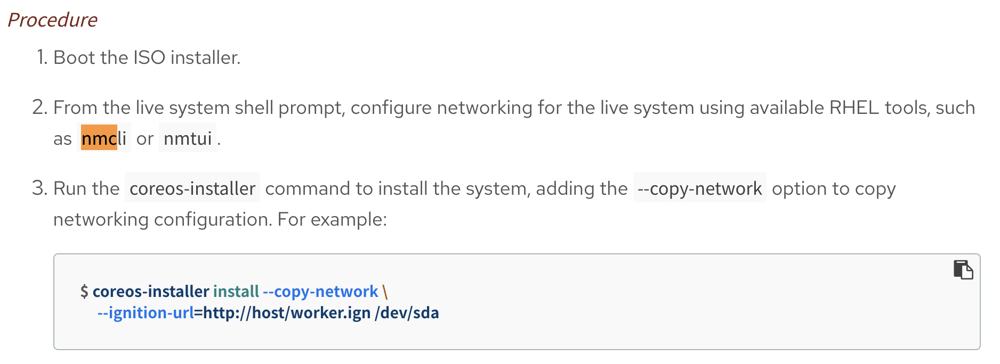

# install node using live iso

- https://docs.openshift.com/container-platform/4.7/installing/installing_bare_metal/installing-bare-metal-network-customizations.html#installation-user-infra-machines-advanced_network_installing-bare-metal-network-customizations




```bash
# manually set ip address, don't forget to set hostname, otherwise, you will get 'localhost'
nmtui

coreos-installer install --copy-network \
     --ignition-url=http://192.168.7.11:8080/ignition/worker-1.ign /dev/sda --insecure-ignition

# on helper
oc get csr | grep -v Approved
oc get csr -ojson | jq -r '.items[] | select(.status == {} ) | .metadata.name' | xargs oc adm certificate approve

# after install, you need to set the node name
# https://access.redhat.com/solutions/5152031
oc delete node/localhost

# go to worker-1
sudo rm /var/lib/kubelet/pki/*

reboot


```