# Openshift4 安装和使用 OCS
官方文档
https://access.redhat.com/documentation/en-us/red_hat_openshift_container_storage/4.7/html/deploying_openshift_container_storage_using_bare_metal_infrastructure/index

参考官方文档，完成以下两步。
```bash
# Installing Local Storage Operator

# Installing Red Hat OpenShift Container Storage Operator

```
因为之后都是界面操作，我们就截屏来看看

首先就是对ocs进行配置，让他找到主机节点还有找到硬盘。我们创建一个stoage cluster


然后让他进行自动的查找，去搜索机器中的空闲硬盘


这个过程，需要在节点上启动daemon set，所以要一点时间，完成以后，就找到了机器中的空闲设备，我们是3个节点的机器，每个节点上有一个空闲的硬盘。
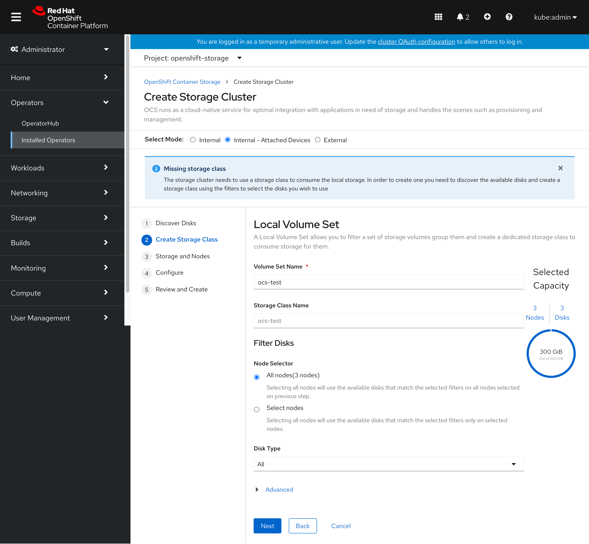

接下来，配置启动一些特殊的配置，比如要跨地域部署，比如要选择节点什么的，我们都不需要，就跳过好了。


然后进行高级的配置，比如要不要加密，我们看看如果点了要加密，会是什么样子的。
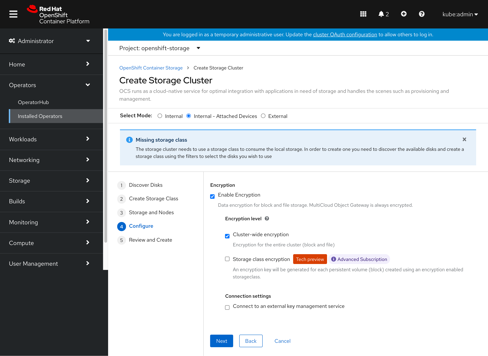

当然，我们的测试集群，不需要加密，我们就恢复默认就好了。
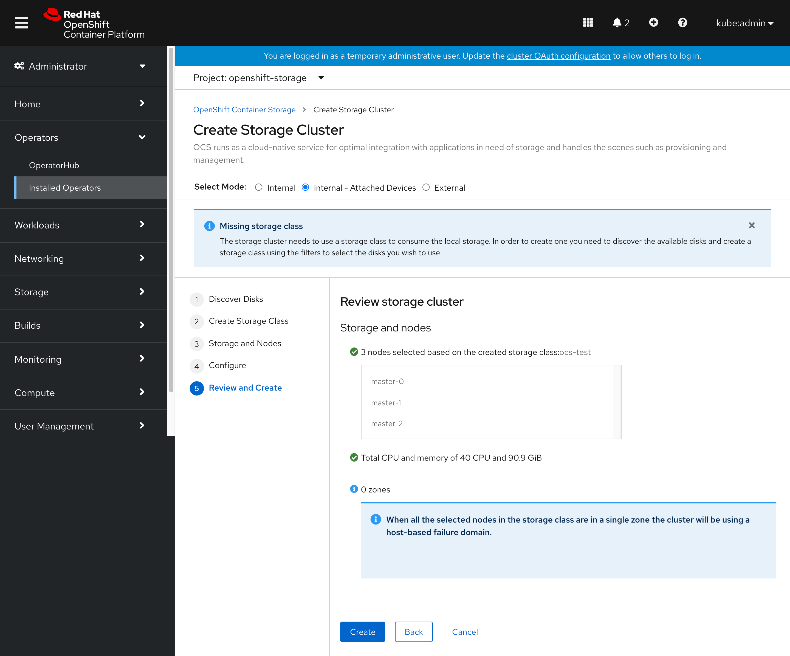

最后一步就是回顾所有的配置，然后点击确认
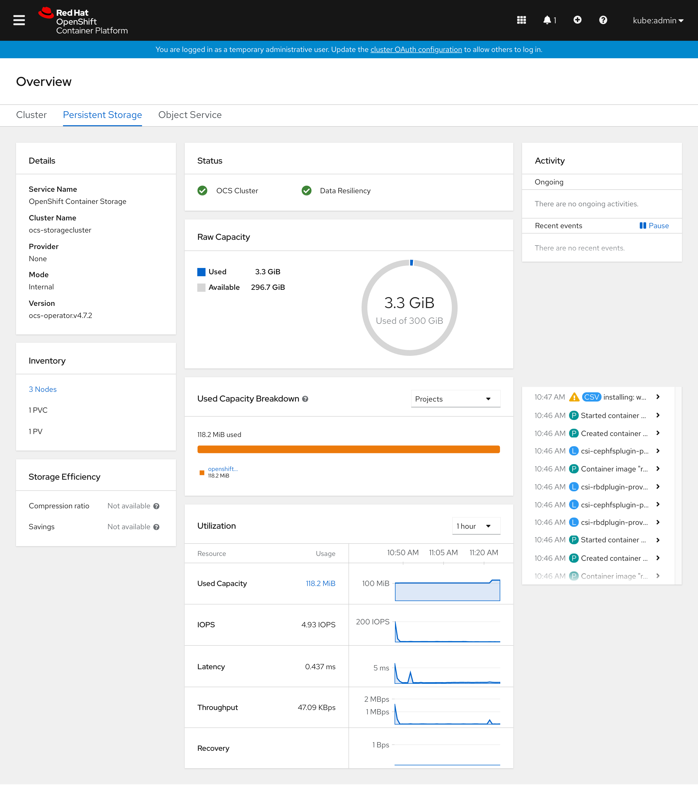

等待一段时间以后，我们就能看到安装完成的成功概览界面了。


创建一个PVC试试

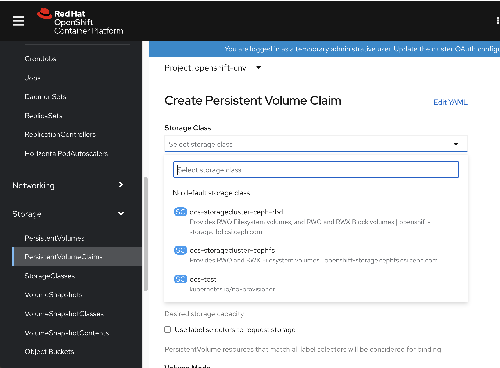


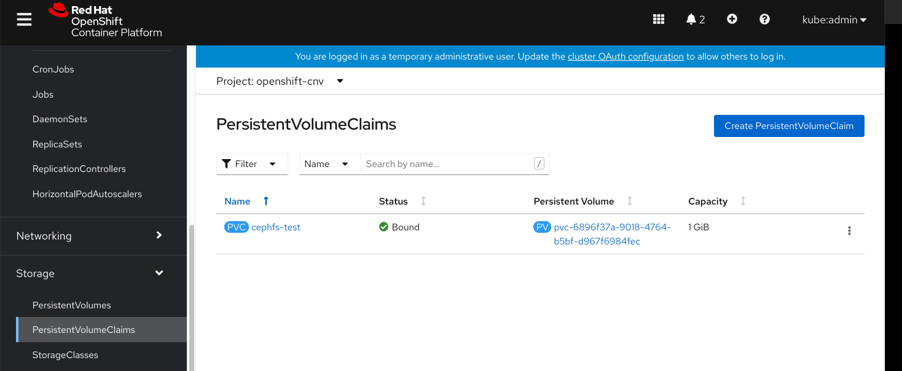

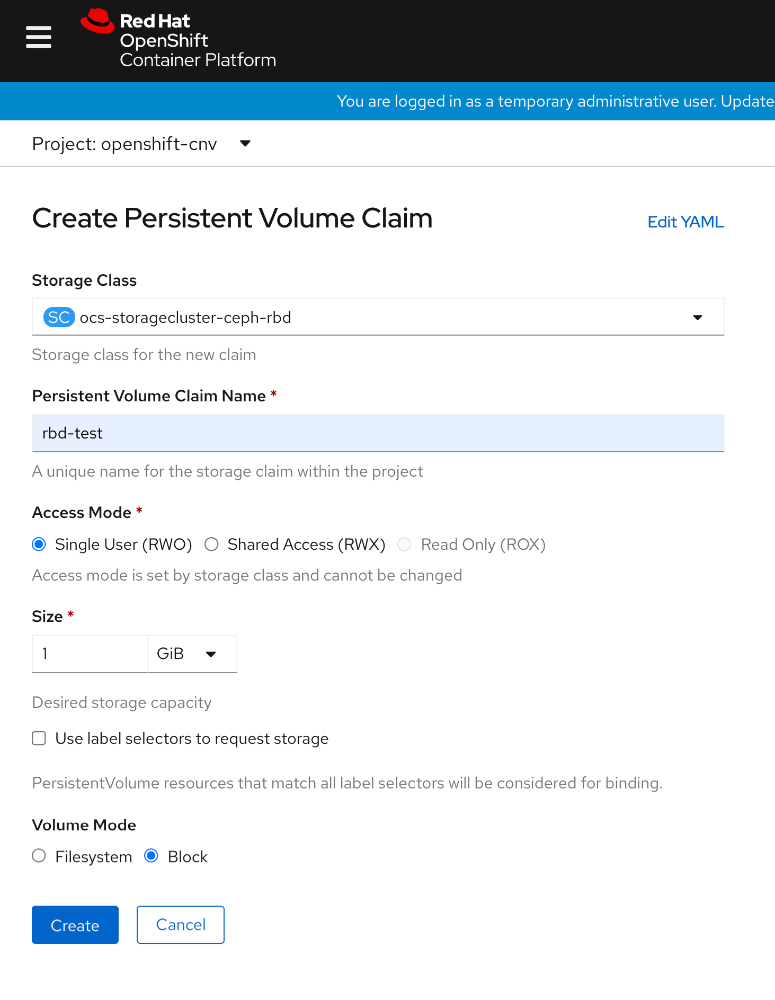


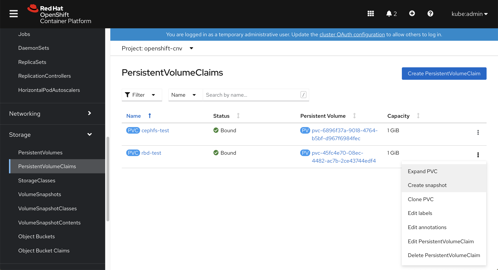


ceshi 
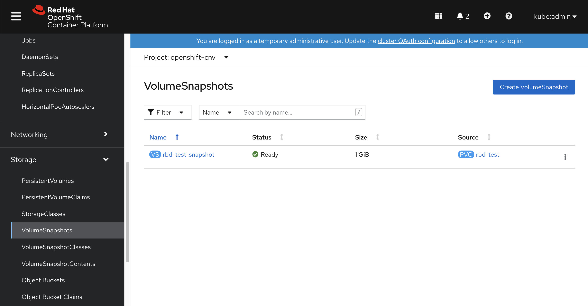

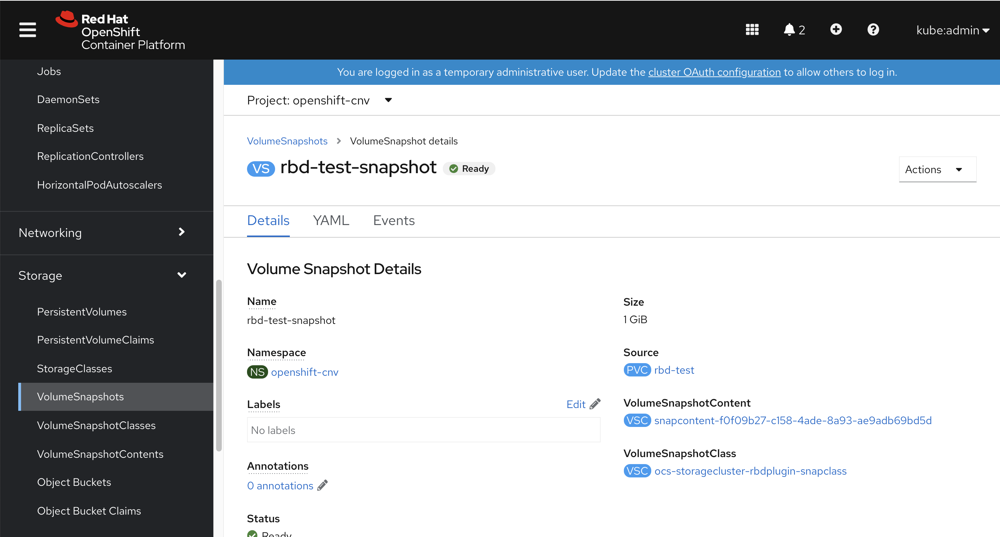

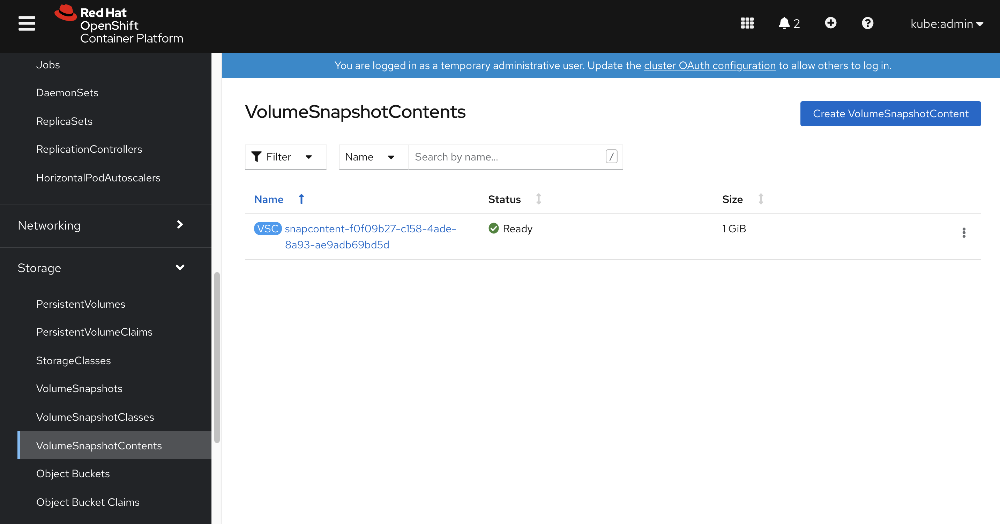

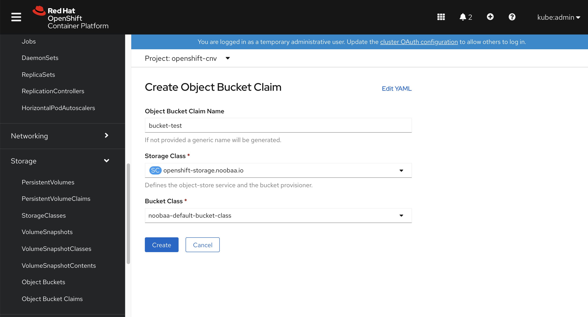

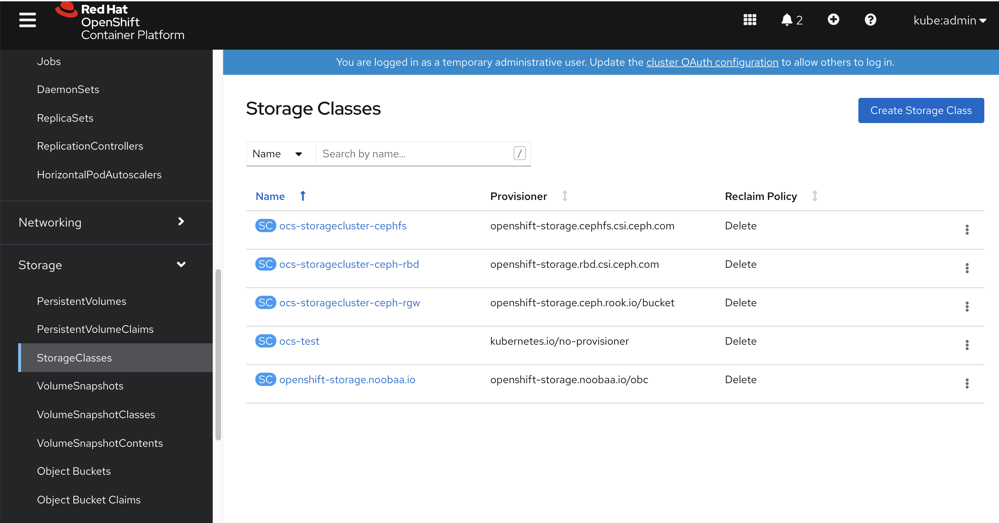


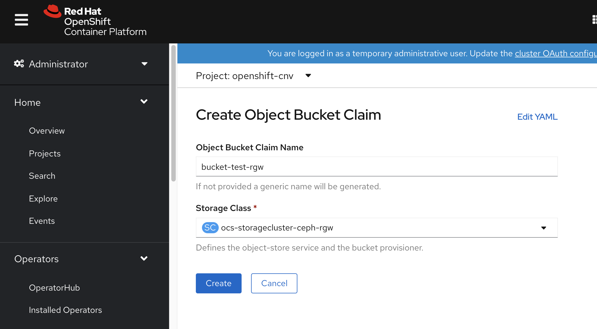


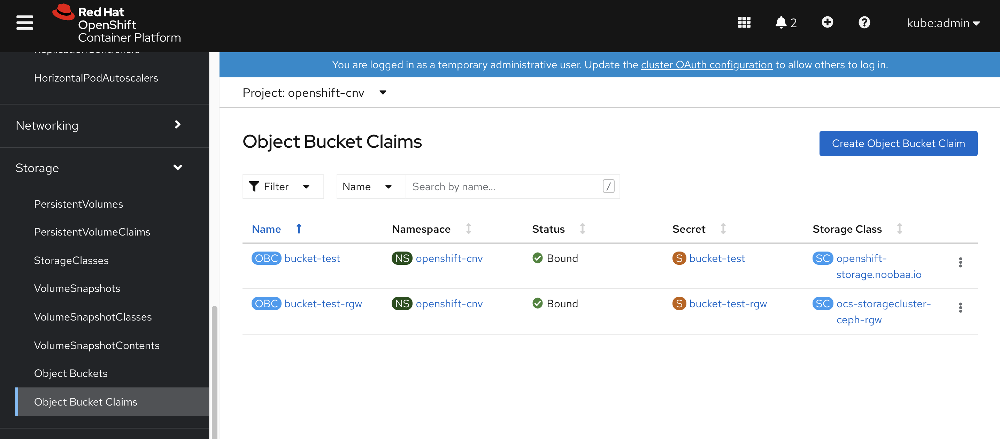

