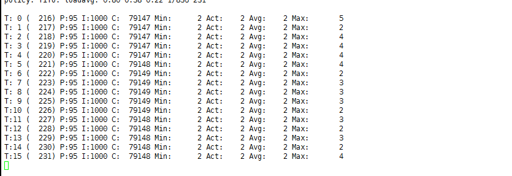

# Real-Time Kernel for Openshift4

5G RAN vDU 对操作系统的实时性要求很高， 基本都要求基于实时操作系统搞， openshift4 是一个和操作系统紧密捆绑的paas平台， 内置了实时操作系统， 这个操作系统是使用了 rhel8 的内核， 并使用 ostree 打包的操作系统。

openshift4 可以在node 上启动实时操作系统，有2个办法，一个是通过performance-addon operator
- https://docs.openshift.com/container-platform/4.7/scalability_and_performance/cnf-performance-addon-operator-for-low-latency-nodes.html

另外一个，是直接用machine config的办法搞
- https://docs.openshift.com/container-platform/4.7/post_installation_configuration/machine-configuration-tasks.html#nodes-nodes-rtkernel-arguments_post-install-machine-configuration-tasks

本次试验部署架构图


视频讲解:

[<kbd></kbd>](https://www.bilibili.com/video/BV1av411V7dQ/)

- [bilibili](https://www.bilibili.com/video/BV1av411V7dQ/)
- [youtube](https://youtu.be/Updyv2X1INY)

# 操作系统上怎么做

用实时操作系统，就是为了性能，那么如果我们是一台物理机，不考虑容器平台，我们应该怎么配置，让这个实时操作系统性能最大化呢？

一般来说，有2个通用的配置
- 对实时操作系统，并进行系统调优配置。
- 物理机bios进行配置，关闭超线程，关闭irq balance，关闭cpu c-state 等节电功能。

对于第一个，实时操作系统的配置，参考这里
- install kernel-rt
- install rt-test
```bash
cat /etc/tuned/realtime-variables.conf
# isolated_cores=1-30
# isolate_managed_irq=Y
tuned-adm profile realtime
reboot

swapoff -a
systemctl stop irqbalance
```

对于第二个，物理机上bios配置，要找服务器的厂商文档，查看官方的low latency配置文档。 [比如这里](https://www.dell.com/downloads/global/products/pedge/en/configuring_low_Latency_environments_on_dell_poweredge_servers.pdf)

| System Setup Screen | Setting           | Default                 | Recommended Alternative for Low- Latency Environments |
| ------------------- | ----------------- | ----------------------- | ----------------------------------------------------- |
| Processor Settings  | Logical Processor | Enabled                 | Disabled                                              |
| Processor Settings  | Turbo Mode        | Enabled                 | Disabled2                                             |
| Processor Settings  | C-States          | Enabled                 | Disabled                                              |
| Processor Settings  | C1E               | Enabled                 | Disabled                                              |
| Power Management    | Power Management  | Active Power Controller | Maximum Performance                                   |


# 先使用performance addon operator，这个是官方推荐的方法。

 performance addon operator 是openshift4里面的一个operator，他的作用是，让用户进行简单的yaml配置，然后operator帮助客户进行复杂的kernel parameter, kubelet, tuned配置。

```bash
# on 104, create a new worker node
export KVM_DIRECTORY=/data/kvm

mkdir -p  ${KVM_DIRECTORY}
cd ${KVM_DIRECTORY}
scp root@172.21.6.11:/data/install/{*worker-0}.iso ${KVM_DIRECTORY}/

virt-install --name=ocp4-worker0 --vcpus=4 --ram=8192 \
--disk path=/data/kvm/ocp4-worker0.qcow2,bus=virtio,size=120 \
--os-variant rhel8.0 --network bridge=br0,model=virtio \
--graphics vnc,listen=127.0.0.1,port=59005 \
--boot menu=on --cdrom ${KVM_DIRECTORY}/rhcos_install-worker-0.iso 

# go back to helper
oc get csr
oc get csr -ojson | jq -r '.items[] | select(.status == {} ) | .metadata.name' | xargs oc adm certificate approve

# install performance addon operator following offical document
# https://docs.openshift.com/container-platform/4.7/scalability_and_performance/cnf-performance-addon-operator-for-low-latency-nodes.html

cat << EOF > /data/install/worker-rt.yaml
apiVersion: machineconfiguration.openshift.io/v1
kind: MachineConfigPool
metadata:
  name: worker-rt
  labels:
    machineconfiguration.openshift.io/role: worker-rt
spec:
  machineConfigSelector:
    matchExpressions:
      - {key: machineconfiguration.openshift.io/role, operator: In, values: [worker,worker-rt]}
  nodeSelector:
    matchLabels:
      node-role.kubernetes.io/worker-rt: ""

EOF
oc create -f /data/install/worker-rt.yaml

oc label MachineConfigPool/worker-rt machineconfiguration.openshift.io/role=worker-rt

# to restore
oc delete -f /data/install/worker-rt.yaml

oc label node worker-0 node-role.kubernetes.io/worker-rt=""

# 以下的配置，是保留了0-1核给系统，剩下的2-3核给应用，实际物理机上，一般是2-19给应用。
cat << EOF > /data/install/performance.yaml
apiVersion: performance.openshift.io/v2
kind: PerformanceProfile
metadata:
   name: example-performanceprofile
spec:
  additionalKernelArgs:
    - selinux=0
    - intel_iommu=on
  globallyDisableIrqLoadBalancing: true
  cpu:
      isolated: "2-3"
      reserved: "0-1"
  hugepages:
      defaultHugepagesSize: "1G"
      pages:
         - size: "1G"
           count: 2
           node: 0
  realTimeKernel:
      enabled: true
  numa:  
      topologyPolicy: "single-numa-node"
  nodeSelector:
      node-role.kubernetes.io/worker-rt: ""

EOF
oc create -f /data/install/performance.yaml

# restore
oc delete -f /data/install/performance.yaml

# check the result
ssh core@worker-0
uname -a
# Linux worker-0 4.18.0-240.22.1.rt7.77.el8_3.x86_64 #1 SMP PREEMPT_RT Fri Mar 26 18:44:48 EDT 2021 x86_64 x86_64 x86_64 GNU/Linux

```

## remove worker-0
```bash
oc delete node worker-0

virsh destroy ocp4-worker0 

virsh undefine ocp4-worker0 

```

# try with machine config with tunned, this is DIY if you like :)

machine config的办法，特点是定制化程度很高，如果客户之前用rt-kernel的操作系统，调优过应用，那么用machine config的方法，能够直接把客户之前的调优参数于应用过来，就不用纠结各种调优的参数，在openshift4上面，应该怎么配置进去了。

you can use machine config dirctly, this can give you full customization capabilities. If you customer already fine-tune kernel parameter on rt-kernel, you can use their kernel parameter directly on openshift4 without try the parameters by yourself.

```bash
# 打开节点的real time kernel
# cat << EOF > /data/install/99-worker-realtime.yaml
# apiVersion: machineconfiguration.openshift.io/v1
# kind: MachineConfig
# metadata:
#   labels:
#     machineconfiguration.openshift.io/role: "worker-rt"
#   name: 99-worker-realtime
# spec:
#   kernelType: realtime
# EOF
# oc create -f  /data/install/99-worker-realtime.yaml

# 配置kernel启动参数，每个参数一行
# http://abcdxyzk.github.io/blog/2015/02/11/kernel-base-param/
# no_timer_check clocksource=tsc tsc=perfect intel_pstate=disable selinux=0 enforcing=0 nmi_watchdog=0 softlockup_panic=0 isolcpus=2-19 nohz_full=2-19 idle=poll default_hugepagesz=1G hugepagesz=1G hugepages=32  skew_tick=1 rcu_nocbs=2-19 kthread_cpus=0-1 irqaffinity=0-1 rcu_nocb_poll iommu=pt intel_iommu=on
cat << EOF > /data/install/05-worker-kernelarg-realtime.yaml
apiVersion: machineconfiguration.openshift.io/v1
kind: MachineConfig
metadata:
  labels:
    machineconfiguration.openshift.io/role: worker-rt
  name: 05-worker-kernelarg-realtime
spec:
  config:
    ignition:
      version: 3.1.0
  kernelArguments:
    - no_timer_check  # 禁止运行内核中时钟IRQ源缺陷检测代码。主要用于解决某些AMD平台的CPU占用过高以及时钟过快的故障。
    - clocksource=tsc # clocksource={jiffies|acpi_pm|hpet|tsc} tsc TSC(Time Stamp Counter)的主体是位于CPU里面的一个64位TSC寄存器，与传统的以中断形式存在的周期性时钟不同，TSC是以计数器形式存在的单步递增性时钟，两者的区别在于，周期性时钟是通过周期性触发中断达到计时目的，如心跳一般。而单步递增时钟则不发送中断，取而代之的是由软件自己在需要的时候去主动读取TSC寄存器的值来获得时间。TSC的精度更高并且速度更快，但仅能在较新的CPU(Sandy Bridge之后)上使用。
    - tsc=perfect
    - intel_pstate=disable  # intel_pstate驱动支持现代Intel处理器的温控。 intel_pstate=disable选项可以强制使用传统遗留的CPU驱动acpi_cpufreq
    - selinux=0
    - enforcing=0
    - nmi_watchdog=0  # 配置nmi_watchdog(不可屏蔽中断看门狗) 0 表示关闭看门狗；
    - softlockup_panic=0  # 是否在检测到软死锁(soft-lockup)的时候让内核panic
    - isolcpus=2-19 # 将列表中的CPU从内核SMP平衡和调度算法中剔除。 提出后并不是绝对不能再使用该CPU的，操作系统仍然可以强制指定特定的进程使用哪个CPU(可以通过taskset来做到)。该参数的目的主要是用于实现特定cpu只运行特定进程的目的。
    - nohz_full=2-19  #在 16 核的系统中，设定 nohz_full=1-15 可以在 1 到 15 内核中启用动态无时钟内核性能，并将所有的计时移动至唯一未设定的内核中（0 内核）, [注意](1)"boot CPU"(通常都是"0"号CPU)会无条件的从列表中剔除。(2)这里列出的CPU编号必须也要同时列进"rcu_nocbs=..."参数中。
    - idle=poll # 对CPU进入休眠状态的额外设置。poll 从根本上禁用休眠功能(也就是禁止进入C-states状态)，可以略微提升一些CPU性能，但是却需要多消耗许多电力，得不偿失。不推荐使用。
    - default_hugepagesz=1G
    - hugepagesz=1G
    - hugepages=32
    - skew_tick=1 # Offset the periodic timer tick per cpu to mitigate xtime_lock contention on larger systems, and/or RCU lock contention on all systems with CONFIG_MAXSMP set. Note: increases power consumption, thus should only be enabled if running jitter sensitive (HPC/RT) workloads.
    - rcu_nocbs=2-19  # 指定哪些CPU是No-CB CPU
    - kthread_cpus=0-1
    - irqaffinity=0-1 # 通过内核参数irqaffinity==[cpu列表],设置linux中断的亲和性，设置后，默认由这些cpu核来处理非CPU绑定中断。避免linux中断影响cpu2、cpu3上的实时应用，将linux中断指定到cpu0、cpu1处理。
    - rcu_nocb_poll # 减少了需要从卸载cpu执行唤醒操作。避免了rcuo kthreads线程显式的唤醒。另一方面这会增加耗电量
    - iommu=pt
    - intel_iommu=on
  kernelType: realtime
EOF
oc create -f /data/install/05-worker-kernelarg-realtime.yaml

# 一般都需要 cpu/numa 绑核，这个在 kubelet 的配置里面做
cat << EOF > /data/install/cpumanager-kubeletconfig.yaml
apiVersion: machineconfiguration.openshift.io/v1
kind: KubeletConfig
metadata:
  name: cpumanager-enabled
spec:
  machineConfigPoolSelector:
    matchLabels:
      custom-kubelet: cpumanager-enabled
  kubeletConfig:
     cpuManagerPolicy: static 
     cpuManagerReconcilePeriod: 5s 
     topologyManagerPolicy: single-numa-node 
     reservedSystemCPUs: "0,1" 
EOF
oc create -f  /data/install/cpumanager-kubeletconfig.yaml

# 以下如果在 bios 里面关掉了，就不用做了。
# if irqbalance disabled in bios, you can skip below step.
# cat << EOF > /data/install/99-custom-disable-irqbalance-worker.yaml
# apiVersion: machineconfiguration.openshift.io/v1
# kind: MachineConfig
# metadata:
#     labels:
#         machineconfiguration.openshift.io/role: worker-rt
#     name: 99-custom-disable-irqbalance-worker
# spec:
#     config:
#         ignition:
#             version: 2.2.0
#         systemd:
#             units:
#             - enabled: false
#               mask: true
#               name: irqbalance.service
# EOF
# oc create -f /data/install/99-custom-disable-irqbalance-worker.yaml


# 我们基于performace addon ， 改一下他的例子， 这次我们基于 realtime
cat << EOF > /data/install/tuned.yaml
apiVersion: tuned.openshift.io/v1
kind: Tuned
metadata:
  name: wzh-realtime
  namespace: openshift-cluster-node-tuning-operator
spec:
  profile:
  - data: |
      [main]
      summary=wzh version for realtime, 5G RAN
      include=openshift-node,realtime

      # Different values will override the original values in parent profiles.

      [variables]
      # isolated_cores take a list of ranges; e.g. isolated_cores=2,4-7

      isolated_cores=2-19
      isolate_managed_irq=Y

      [service]
      service.stalld=start,enable

    name: wzh-realtime
  recommend:
  - machineConfigLabels:
      machineconfiguration.openshift.io/role: worker-rt
    priority: 20
    profile: wzh-realtime
EOF
oc create -f /data/install/tuned.yaml

# to restore
oc delete -f  /data/install/tuned.yaml

# https://zhuanlan.zhihu.com/p/336381111
# yum install rt-test
# 在测试现场，经过整个晚上的测试，可以看到系统的实时性非常好
# 目标结果，最大不应超过 6μs
cyclictest -m -p95 -d0 -a 2-17 -t 16
```


# try to deploy a vDU pod, using yaml

```yaml
---

apiVersion: "k8s.cni.cncf.io/v1"
kind: NetworkAttachmentDefinition
metadata:
  name: host-device-du
spec:
  config: '{
    "cniVersion": "0.3.0",
    "type": "host-device",
    "device": "ens81f1np1",
    "ipam": {
      "type": "host-local",
      "subnet": "192.168.12.0/24",
      "rangeStart": "192.168.12.105",
      "rangeEnd": "192.168.12.105",
      "routes": [{
        "dst": "0.0.0.0/0"
      }],
      "gateway": "192.168.12.1"
    }
  }'

---

apiVersion: apps/v1
kind: Deployment
metadata:
  name: du-deployment1
  labels:
    app: du-deployment1
spec:
  replicas: 1
  selector:
    matchLabels:
      app: du-pod1
  template:
    metadata:
      labels: 
        app: du-pod1
      annotations:
        k8s.v1.cni.cncf.io/networks: '[
          { "name": "host-device-du",
            "interface": "net1" }
          ]'
    spec:
      containers:
      - name: du-container1
        image: "registry.ocp4.redhat.ren:5443/ocp4/centos:7.6.1810"
        imagePullPolicy: IfNotPresent
        tty: true
        stdin: true
        env:
          - name: duNetProviderDriver
            value: "host-netdevice"
        command:
          - sleep
          - infinity
        securityContext:
            privileged: true
            capabilities:
                add:
                - CAP_SYS_ADMIN
        volumeMounts:
          - mountPath: /hugepages
            name: hugepage
          - name: lib-modules
            mountPath: /lib/modules
          - name: src
            mountPath: /usr/src
          - name: dev
            mountPath: /dev
          - name: cache-volume
            mountPath: /dev/shm
        resources:
          requests:
            cpu: 16
            memory: 48Gi
            hugepages-1Gi: 8Gi
          limits:
            cpu: 16
            memory: 48Gi
            hugepages-1Gi: 8Gi
      volumes:
        - name: hugepage
          emptyDir:
            medium: HugePages
        - name: lib-modules
          hostPath:
            path: /lib/modules
        - name: src
          hostPath:
            path: /usr/src
        - name: dev
          hostPath:
            path: "/dev"
        - name: cache-volume
          emptyDir:
            medium: Memory
            sizeLimit: 16Gi
      nodeSelector:
        node-role.kubernetes.io/worker-rt: ""
```

## research

```bash

oc get Tuned -n openshift-cluster-node-tuning-operator
# NAME                                                    AGE
# default                                                 18d
# openshift-node-performance-example-performanceprofile   12d
# rendered                                                18d

oc get Tuned/default -o yaml -n openshift-cluster-node-tuning-operator
```
```yaml
apiVersion: tuned.openshift.io/v1
kind: Tuned
metadata:
  creationTimestamp: "2021-05-05T16:09:36Z"
  generation: 1
  name: default
  namespace: openshift-cluster-node-tuning-operator
  resourceVersion: "6067"
  selfLink: /apis/tuned.openshift.io/v1/namespaces/openshift-cluster-node-tuning-operator/tuneds/default
  uid: 205c01c5-2609-4f2f-b676-ad746ea3c9f3
spec:
  profile:
  - data: |
      [main]
      summary=Optimize systems running OpenShift (parent profile)
      include=${f:virt_check:virtual-guest:throughput-performance}

      [selinux]
      avc_cache_threshold=8192

      [net]
      nf_conntrack_hashsize=131072

      [sysctl]
      net.ipv4.ip_forward=1
      kernel.pid_max=>4194304
      net.netfilter.nf_conntrack_max=1048576
      net.ipv4.conf.all.arp_announce=2
      net.ipv4.neigh.default.gc_thresh1=8192
      net.ipv4.neigh.default.gc_thresh2=32768
      net.ipv4.neigh.default.gc_thresh3=65536
      net.ipv6.neigh.default.gc_thresh1=8192
      net.ipv6.neigh.default.gc_thresh2=32768
      net.ipv6.neigh.default.gc_thresh3=65536
      vm.max_map_count=262144

      [sysfs]
      /sys/module/nvme_core/parameters/io_timeout=4294967295
      /sys/module/nvme_core/parameters/max_retries=10
    name: openshift
  - data: |
      [main]
      summary=Optimize systems running OpenShift control plane
      include=openshift

      [sysctl]
      # ktune sysctl settings, maximizing i/o throughput
      #
      # Minimal preemption granularity for CPU-bound tasks:
      # (default: 1 msec#  (1 + ilog(ncpus)), units: nanoseconds)
      kernel.sched_min_granularity_ns=10000000
      # The total time the scheduler will consider a migrated process
      # "cache hot" and thus less likely to be re-migrated
      # (system default is 500000, i.e. 0.5 ms)
      kernel.sched_migration_cost_ns=5000000
      # SCHED_OTHER wake-up granularity.
      #
      # Preemption granularity when tasks wake up.  Lower the value to
      # improve wake-up latency and throughput for latency critical tasks.
      kernel.sched_wakeup_granularity_ns=4000000
    name: openshift-control-plane
  - data: |
      [main]
      summary=Optimize systems running OpenShift nodes
      include=openshift

      [sysctl]
      net.ipv4.tcp_fastopen=3
      fs.inotify.max_user_watches=65536
      fs.inotify.max_user_instances=8192
    name: openshift-node
  recommend:
  - match:
    - label: node-role.kubernetes.io/master
    - label: node-role.kubernetes.io/infra
    operand:
      debug: false
    priority: 30
    profile: openshift-control-plane
  - operand:
      debug: false
    priority: 40
    profile: openshift-node
status: {}
```
```bas
oc get Tuned/openshift-node-performance-example-performanceprofile -o yaml -n openshift-cluster-node-tuning-operator
```
```yaml
apiVersion: tuned.openshift.io/v1
kind: Tuned
metadata:
  name: openshift-node-performance-example-performanceprofile
  namespace: openshift-cluster-node-tuning-operator
spec:
  profile:
  - data: "[main]\nsummary=Openshift node optimized for deterministic performance at the cost of increased power consumption, focused on low latency network performance. Based on Tuned 2.11 and Cluster node tuning (oc 4.5)\ninclude=openshift-node,cpu-partitioning\n\n# Inheritance of base profiles legend:\n# cpu-partitioning -> network-latency -> latency-performance\n# https://github.com/redhat-performance/tuned/blob/master/profiles/latency-performance/tuned.conf\n# https://github.com/redhat-performance/tuned/blob/master/profiles/network-latency/tuned.conf\n# https://github.com/redhat-performance/tuned/blob/master/profiles/cpu-partitioning/tuned.conf\n\n# All values are mapped with a comment where a parent profile contains them.\n# Different values will override the original values in parent profiles.\n\n[variables]\n# isolated_cores take a list of ranges; e.g. isolated_cores=2,4-7\n\nisolated_cores=2-3 \n\n\nnot_isolated_cores_expanded=${f:cpulist_invert:${isolated_cores_expanded}}\n\n[cpu]\nforce_latency=cstate.id:1|3                   #  latency-performance  (override)\ngovernor=performance                          #  latency-performance \nenergy_perf_bias=performance                  #  latency-performance \nmin_perf_pct=100                              #  latency-performance \n\n[service]\nservice.stalld=start,enable\n\n[vm]\ntransparent_hugepages=never                   #  network-latency\n\n\n[irqbalance]\n# Override the value set by cpu-partitioning with an empty one\nbanned_cpus=\"\"\n\n\n[scheduler]\ngroup.ksoftirqd=0:f:11:*:ksoftirqd.*\ngroup.rcuc=0:f:11:*:rcuc.*\n\ndefault_irq_smp_affinity = ignore\n\n\n[sysctl]\nkernel.hung_task_timeout_secs = 600           # cpu-partitioning #realtime\nkernel.nmi_watchdog = 0                       # cpu-partitioning #realtime\nkernel.sched_rt_runtime_us = -1               # realtime \nkernel.timer_migration = 0                    # cpu-partitioning (= 1) #realtime (= 0)\nkernel.numa_balancing=0                       # network-latency\nnet.core.busy_read=50                         # network-latency\nnet.core.busy_poll=50                         # network-latency\nnet.ipv4.tcp_fastopen=3                       # network-latency\nvm.stat_interval = 10                         # cpu-partitioning  #realtime\n\n# ktune sysctl settings for rhel6 servers, maximizing i/o throughput\n#\n# Minimal preemption granularity for CPU-bound tasks:\n# (default: 1 msec#  (1 + ilog(ncpus)), units: nanoseconds)\nkernel.sched_min_granularity_ns=10000000      # latency-performance\n\n# If a workload mostly uses anonymous memory and it hits this limit, the entire\n# working set is buffered for I/O, and any more write buffering would require\n# swapping, so it's time to throttle writes until I/O can catch up.  Workloads\n# that mostly use file mappings may be able to use even higher values.\n#\n# The generator of dirty data starts writeback at this percentage (system default\n# is 20%)\nvm.dirty_ratio=10                             # latency-performance\n\n# Start background writeback (via writeback threads) at this percentage (system\n# default is 10%)\nvm.dirty_background_ratio=3                   # latency-performance\n\n# The swappiness parameter controls the tendency of the kernel to move\n# processes out of physical memory and onto the swap disk.\n# 0 tells the kernel to avoid swapping processes out of physical memory\n# for as long as possible\n# 100 tells the kernel to aggressively swap processes out of physical memory\n# and move them to swap cache\nvm.swappiness=10                              # latency-performance\n\n# The total time the scheduler will consider a migrated process\n# \"cache hot\" and thus less likely to be re-migrated\n# (system default is 500000, i.e. 0.5 ms)\nkernel.sched_migration_cost_ns=5000000        # latency-performance\n\n[selinux]\navc_cache_threshold=8192                      # Custom (atomic host)\n\n[net]\nnf_conntrack_hashsize=131072                  # Custom (atomic host)\n\n[bootloader]\n# set empty values to disable RHEL initrd setting in cpu-partitioning \ninitrd_remove_dir=     \ninitrd_dst_img=\ninitrd_add_dir=\n# overrides cpu-partitioning cmdline\ncmdline_cpu_part=+nohz=on rcu_nocbs=${isolated_cores} tuned.non_isolcpus=${not_isolated_cpumask} intel_pstate=disable nosoftlockup\n\ncmdline_realtime=+tsc=nowatchdog intel_iommu=on iommu=pt isolcpus=managed_irq,${isolated_cores} systemd.cpu_affinity=${not_isolated_cores_expanded}\n\ncmdline_hugepages=+ default_hugepagesz=1G  \ncmdline_additionalArg=+\n"
    name: openshift-node-performance-example-performanceprofile
  recommend:
  - machineConfigLabels:
      machineconfiguration.openshift.io/role: worker-rt
    priority: 20
    profile: openshift-node-performance-example-performanceprofile
status: {}
```
```yaml
apiVersion: tuned.openshift.io/v1
kind: Tuned
metadata:
  name: openshift-node-performance-example-performanceprofile
  namespace: openshift-cluster-node-tuning-operator
spec:
  profile:
  - data: |
      [main]
      summary=Openshift node optimized for deterministic performance at the cost of increased power consumption, focused on low latency network performance. Based on Tuned 2.11 and Cluster node tuning (oc 4.5)
      include=openshift-node,cpu-partitioning

      # Inheritance of base profiles legend:
      # cpu-partitioning -> network-latency -> latency-performance
      # https://github.com/redhat-performance/tuned/blob/master/profiles/latency-performance/tuned.conf
      # https://github.com/redhat-performance/tuned/blob/master/profiles/network-latency/tuned.conf
      # https://github.com/redhat-performance/tuned/blob/master/profiles/cpu-partitioning/tuned.conf

      # All values are mapped with a comment where a parent profile contains them.
      # Different values will override the original values in parent profiles.

      [variables]
      # isolated_cores take a list of ranges; e.g. isolated_cores=2,4-7

      isolated_cores=2-3


      not_isolated_cores_expanded=

      [cpu]
      force_latency=cstate.id:1|3                   #  latency-performance  (override)
      governor=performance                          #  latency-performance
      energy_perf_bias=performance                  #  latency-performance
      min_perf_pct=100                              #  latency-performance

      [service]
      service.stalld=start,enable

      [vm]
      transparent_hugepages=never                   #  network-latency


      [irqbalance]
      # Override the value set by cpu-partitioning with an empty one
      banned_cpus=""


      [scheduler]
      group.ksoftirqd=0:f:11:*:ksoftirqd.*
      group.rcuc=0:f:11:*:rcuc.*

      default_irq_smp_affinity = ignore


      [sysctl]
      kernel.hung_task_timeout_secs = 600           # cpu-partitioning #realtime
      kernel.nmi_watchdog = 0                       # cpu-partitioning #realtime
      kernel.sched_rt_runtime_us = -1               # realtime
      kernel.timer_migration = 0                    # cpu-partitioning (= 1) #realtime (= 0)
      kernel.numa_balancing=0                       # network-latency
      net.core.busy_read=50                         # network-latency
      net.core.busy_poll=50                         # network-latency
      net.ipv4.tcp_fastopen=3                       # network-latency
      vm.stat_interval = 10                         # cpu-partitioning  #realtime

      # ktune sysctl settings for rhel6 servers, maximizing i/o throughput
      #
      # Minimal preemption granularity for CPU-bound tasks:
      # (default: 1 msec#  (1 + ilog(ncpus)), units: nanoseconds)
      kernel.sched_min_granularity_ns=10000000      # latency-performance

      # If a workload mostly uses anonymous memory and it hits this limit, the entire
      # working set is buffered for I/O, and any more write buffering would require
      # swapping, so it's time to throttle writes until I/O can catch up.  Workloads
      # that mostly use file mappings may be able to use even higher values.
      #
      # The generator of dirty data starts writeback at this percentage (system default
      # is 20%)
      vm.dirty_ratio=10                             # latency-performance

      # Start background writeback (via writeback threads) at this percentage (system
      # default is 10%)
      vm.dirty_background_ratio=3                   # latency-performance

      # The swappiness parameter controls the tendency of the kernel to move
      # processes out of physical memory and onto the swap disk.
      # 0 tells the kernel to avoid swapping processes out of physical memory
      # for as long as possible
      # 100 tells the kernel to aggressively swap processes out of physical memory
      # and move them to swap cache
      vm.swappiness=10                              # latency-performance

      # The total time the scheduler will consider a migrated process
      # "cache hot" and thus less likely to be re-migrated
      # (system default is 500000, i.e. 0.5 ms)
      kernel.sched_migration_cost_ns=5000000        # latency-performance

      [selinux]
      avc_cache_threshold=8192                      # Custom (atomic host)

      [net]
      nf_conntrack_hashsize=131072                  # Custom (atomic host)

      [bootloader]
      # set empty values to disable RHEL initrd setting in cpu-partitioning
      initrd_remove_dir=
      initrd_dst_img=
      initrd_add_dir=
      # overrides cpu-partitioning cmdline
      cmdline_cpu_part=+nohz=on rcu_nocbs= tuned.non_isolcpus= intel_pstate=disable nosoftlockup

      cmdline_realtime=+tsc=nowatchdog intel_iommu=on iommu=pt isolcpus=managed_irq, systemd.cpu_affinity=

      cmdline_hugepages=+ default_hugepagesz=1G
      cmdline_additionalArg=+
    name: openshift-node-performance-example-performanceprofile
  recommend:
  - machineConfigLabels:
      machineconfiguration.openshift.io/role: worker-rt
    priority: 20
    profile: openshift-node-performance-example-performanceprofile
```
```bash
# tuned 的配置，如果有些在bios里面做了，那么也可以忽略。我们基于performace addon ， 改一下他的例子.
cat << EOF > /data/install/tuned.yaml
apiVersion: tuned.openshift.io/v1
kind: Tuned
metadata:
  name: openshift-node-wzh-performance-profile
  namespace: openshift-cluster-node-tuning-operator
spec:
  profile:
  - data: |
      [main]
      summary=Openshift node optimized for deterministic performance at the cost of increased power consumption, focused on low latency network performance. Based on Tuned 2.11 and Cluster node tuning (oc 4.5)
      include=openshift-node,cpu-partitioning

      # Inheritance of base profiles legend:
      # cpu-partitioning -> network-latency -> latency-performance
      # https://github.com/redhat-performance/tuned/blob/master/profiles/latency-performance/tuned.conf
      # https://github.com/redhat-performance/tuned/blob/master/profiles/network-latency/tuned.conf
      # https://github.com/redhat-performance/tuned/blob/master/profiles/cpu-partitioning/tuned.conf

      # All values are mapped with a comment where a parent profile contains them.
      # Different values will override the original values in parent profiles.

      [variables]
      # isolated_cores take a list of ranges; e.g. isolated_cores=2,4-7

      isolated_cores=2-19
      isolate_managed_irq=Y

      not_isolated_cores_expanded=

      [cpu]
      # force_latency=cstate.id:1|3                   #  latency-performance  (override)
      governor=performance                          #  latency-performance
      energy_perf_bias=performance                  #  latency-performance
      min_perf_pct=100                              #  latency-performance

      [service]
      service.stalld=start,enable

      [vm]
      transparent_hugepages=never                   #  network-latency


      [irqbalance]
      # Override the value set by cpu-partitioning with an empty one
      banned_cpus=""


      [scheduler]
      group.ksoftirqd=0:f:11:*:ksoftirqd.*
      group.rcuc=0:f:11:*:rcuc.*

      default_irq_smp_affinity = ignore


      [sysctl]
      kernel.hung_task_timeout_secs = 600           # cpu-partitioning #realtime
      kernel.nmi_watchdog = 0                       # cpu-partitioning #realtime
      kernel.sched_rt_runtime_us = -1               # realtime
      kernel.timer_migration = 0                    # cpu-partitioning (= 1) #realtime (= 0)
      kernel.numa_balancing=0                       # network-latency
      net.core.busy_read=50                         # network-latency
      net.core.busy_poll=50                         # network-latency
      net.ipv4.tcp_fastopen=3                       # network-latency
      vm.stat_interval = 10                         # cpu-partitioning  #realtime

      # ktune sysctl settings for rhel6 servers, maximizing i/o throughput
      #
      # Minimal preemption granularity for CPU-bound tasks:
      # (default: 1 msec#  (1 + ilog(ncpus)), units: nanoseconds)
      kernel.sched_min_granularity_ns=10000000      # latency-performance

      # If a workload mostly uses anonymous memory and it hits this limit, the entire
      # working set is buffered for I/O, and any more write buffering would require
      # swapping, so it's time to throttle writes until I/O can catch up.  Workloads
      # that mostly use file mappings may be able to use even higher values.
      #
      # The generator of dirty data starts writeback at this percentage (system default
      # is 20%)
      vm.dirty_ratio=10                             # latency-performance

      # Start background writeback (via writeback threads) at this percentage (system
      # default is 10%)
      vm.dirty_background_ratio=3                   # latency-performance

      # The swappiness parameter controls the tendency of the kernel to move
      # processes out of physical memory and onto the swap disk.
      # 0 tells the kernel to avoid swapping processes out of physical memory
      # for as long as possible
      # 100 tells the kernel to aggressively swap processes out of physical memory
      # and move them to swap cache
      vm.swappiness=10                              # latency-performance

      # The total time the scheduler will consider a migrated process
      # "cache hot" and thus less likely to be re-migrated
      # (system default is 500000, i.e. 0.5 ms)
      kernel.sched_migration_cost_ns=5000000        # latency-performance

      [selinux]
      avc_cache_threshold=8192                      # Custom (atomic host)

      [net]
      nf_conntrack_hashsize=131072                  # Custom (atomic host)

      [bootloader]
      # set empty values to disable RHEL initrd setting in cpu-partitioning
      initrd_remove_dir=
      initrd_dst_img=
      initrd_add_dir=
      # overrides cpu-partitioning cmdline
      cmdline_cpu_part=+nohz=on rcu_nocbs= tuned.non_isolcpus= intel_pstate=disable nosoftlockup

      cmdline_realtime=+tsc=nowatchdog intel_iommu=on iommu=pt isolcpus=managed_irq, systemd.cpu_affinity=

      cmdline_hugepages=+ default_hugepagesz=1G
      cmdline_additionalArg=+
    name: openshift-node-wzh-performance-profile
  recommend:
  - machineConfigLabels:
      machineconfiguration.openshift.io/role: worker-rt
    priority: 20
    profile: openshift-node-wzh-performance-profile
EOF
oc create -f /data/install/tuned.yaml

# 用了performance example的profile 效果很好
cyclictest -m -p95 -d0 -a 2-17 -t 16
```


# example config

```bash
oc get mc
```
```
NAME                                                  GENERATEDBYCONTROLLER                      IGNITIONVERSION   AGE
00-master                                             791d1cc2626d1e4e5da59f15c1a6166fd398aef8   3.1.0             62d
00-worker                                             791d1cc2626d1e4e5da59f15c1a6166fd398aef8   3.1.0             62d
01-master-container-runtime                           791d1cc2626d1e4e5da59f15c1a6166fd398aef8   3.1.0             62d
01-master-kubelet                                     791d1cc2626d1e4e5da59f15c1a6166fd398aef8   3.1.0             62d
01-worker-container-runtime                           791d1cc2626d1e4e5da59f15c1a6166fd398aef8   3.1.0             62d
01-worker-kubelet                                     791d1cc2626d1e4e5da59f15c1a6166fd398aef8   3.1.0             62d
05-worker-kernelarg-rtran                                                                        3.1.0             62d
50-nto-worker-rt                                                                                 3.1.0             58d
99-master-generated-registries                        791d1cc2626d1e4e5da59f15c1a6166fd398aef8   3.1.0             62d
99-master-ssh                                                                                    3.1.0             62d
99-worker-generated-registries                        791d1cc2626d1e4e5da59f15c1a6166fd398aef8   3.1.0             62d
99-worker-realtime                                                                                                 62d
99-worker-rt-generated-kubelet                        791d1cc2626d1e4e5da59f15c1a6166fd398aef8   3.1.0             58d
99-worker-ssh                                                                                    3.1.0             62d
load-sctp-module                                                                                 3.1.0             6d9h
rendered-master-0629f16bcba29a60e894f3d9e14e47b9      791d1cc2626d1e4e5da59f15c1a6166fd398aef8   3.1.0             62d
rendered-worker-7497d1b2e86631a4f390a6eba0aef74f      791d1cc2626d1e4e5da59f15c1a6166fd398aef8   3.1.0             62d
rendered-worker-rt-1e40da418635be6c6b81ebc33a1f0640   791d1cc2626d1e4e5da59f15c1a6166fd398aef8   3.1.0             62d
rendered-worker-rt-35d27df9ed0ff75a6a192700313a88f8   791d1cc2626d1e4e5da59f15c1a6166fd398aef8   3.1.0             58d
rendered-worker-rt-3e87a41fe1e455977a4a972f8d4258aa   791d1cc2626d1e4e5da59f15c1a6166fd398aef8   3.1.0             58d
rendered-worker-rt-4ba64193fdbace8fc101541335067ad4   791d1cc2626d1e4e5da59f15c1a6166fd398aef8   3.1.0             62d
rendered-worker-rt-7497d1b2e86631a4f390a6eba0aef74f   791d1cc2626d1e4e5da59f15c1a6166fd398aef8   3.1.0             62d
rendered-worker-rt-9cf8ebbc1c0cf88bb3a9716b6d66e60e   791d1cc2626d1e4e5da59f15c1a6166fd398aef8   3.1.0             58d
rendered-worker-rt-bb3c16a689e7797fb4c828cec877c9ed   791d1cc2626d1e4e5da59f15c1a6166fd398aef8   3.1.0             58d
rendered-worker-rt-ea53e6c4fc58b5f9f505ebed3cb32345   791d1cc2626d1e4e5da59f15c1a6166fd398aef8   3.1.0             58d
rendered-worker-rt-fd13902df04099f149d7653da3552f5d   791d1cc2626d1e4e5da59f15c1a6166fd398aef8   3.1.0             6d9h
```


```bash
oc get mc/05-worker-kernelarg-rtran -o json | jq "del(.metadata.managedFields, .metadata.uid, .metadata.selfLink, .metadata.resourceVersion, .metadata.generation, .metadata.creationTimestamp)"
```
```json
{
  "apiVersion": "machineconfiguration.openshift.io/v1",
  "kind": "MachineConfig",
  "metadata": {
    "labels": {
      "machineconfiguration.openshift.io/role": "worker-rt"
    },
    "name": "05-worker-kernelarg-rtran"
  },
  "spec": {
    "config": {
      "ignition": {
        "version": "3.1.0"
      }
    },
    "kernelArguments": [
      "no_timer_check",
      "clocksource=tsc",
      "tsc=perfect",
      "selinux=0",
      "enforcing=0",
      "nmi_watchdog=0",
      "softlockup_panic=0",
      "isolcpus=2-19",
      "nohz_full=2-19",
      "idle=poll",
      "default_hugepagesz=1G",
      "hugepagesz=1G",
      "hugepages=16",
      "skew_tick=1",
      "rcu_nocbs=2-19",
      "kthread_cpus=0-1",
      "irqaffinity=0-1",
      "rcu_nocb_poll",
      "iommu=pt",
      "intel_iommu=on"
    ]
  }
}
```


```bash
oc get mc/50-nto-worker-rt -o json | jq "del(.metadata.managedFields, .metadata.uid, .metadata.selfLink, .metadata.resourceVersion, .metadata.generation, .metadata.creationTimestamp)"
```
```json
{
  "apiVersion": "machineconfiguration.openshift.io/v1",
  "kind": "MachineConfig",
  "metadata": {
    "annotations": {
      "tuned.openshift.io/generated-by-controller-version": "v4.6.0-202104221811.p0-0-gfdb7aec-dirty"
    },
    "labels": {
      "machineconfiguration.openshift.io/role": "worker-rt"
    },
    "name": "50-nto-worker-rt"
  },
  "spec": {
    "config": {
      "ignition": {
        "config": {
          "replace": {
            "verification": {}
          }
        },
        "proxy": {},
        "security": {
          "tls": {}
        },
        "timeouts": {},
        "version": "3.1.0"
      },
      "passwd": {},
      "storage": {},
      "systemd": {}
    },
    "extensions": null,
    "fips": false,
    "kernelArguments": [
      "skew_tick=1",
      "isolcpus=managed_irq,domain,2-19",
      "intel_pstate=disable",
      "nosoftlockup",
      "tsc=nowatchdog"
    ],
    "kernelType": "",
    "osImageURL": ""
  }
}
```


```bash
oc get mc/99-worker-realtime -o json | jq "del(.metadata.managedFields, .metadata.uid, .metadata.selfLink, .metadata.resourceVersion, .metadata.generation, .metadata.creationTimestamp)"
```
```json
{
  "apiVersion": "machineconfiguration.openshift.io/v1",
  "kind": "MachineConfig",
  "metadata": {
    "labels": {
      "machineconfiguration.openshift.io/role": "worker-rt"
    },
    "name": "99-worker-realtime"
  },
  "spec": {
    "kernelType": "realtime"
  }
}
```


```bash
oc get mc/load-sctp-module -o json | jq "del(.metadata.managedFields, .metadata.uid, .metadata.selfLink, .metadata.resourceVersion, .metadata.generation, .metadata.creationTimestamp)"
```
```json
{
  "apiVersion": "machineconfiguration.openshift.io/v1",
  "kind": "MachineConfig",
  "metadata": {
    "labels": {
      "machineconfiguration.openshift.io/role": "worker-rt"
    },
    "name": "load-sctp-module"
  },
  "spec": {
    "config": {
      "ignition": {
        "version": "3.1.0"
      },
      "storage": {
        "files": [
          {
            "contents": {
              "source": "data:,"
            },
            "mode": 420,
            "overwrite": true,
            "path": "/etc/modprobe.d/sctp-blacklist.conf"
          },
          {
            "contents": {
              "source": "data:,sctp"
            },
            "mode": 420,
            "overwrite": true,
            "path": "/etc/modules-load.d/sctp-load.conf"
          }
        ]
      }
    }
  }
}

```


```bash
oc get Tuned -n openshift-cluster-node-tuning-operator
NAME           AGE
default        62d
rendered       62d
wzh-realtime   58d

oc get Tuned/wzh-realtime -n openshift-cluster-node-tuning-operator -o json | jq "del(.metadata.managedFields, .metadata.uid, .metadata.selfLink, .metadata.resourceVersion, .metadata.generation, .metadata.creationTimestamp)" 
```
```json
{
  "apiVersion": "tuned.openshift.io/v1",
  "kind": "Tuned",
  "metadata": {
    "name": "wzh-realtime",
    "namespace": "openshift-cluster-node-tuning-operator"
  },
  "spec": {
    "profile": [
      {
        "data": "[main]\nsummary=wzh version for realtime, 5G RAN\ninclude=openshift-node,realtime\n\n# Inheritance of base profiles legend:\n# cpu-partitioning -> network-latency -> latency-performance\n# https://github.com/redhat-performance/tuned/blob/master/profiles/latency-performance/tuned.conf\n# https://github.com/redhat-performance/tuned/blob/master/profiles/network-latency/tuned.conf\n# https://github.com/redhat-performance/tuned/blob/master/profiles/cpu-partitioning/tuned.conf\n\n# All values are mapped with a comment where a parent profile contains them.\n# Different values will override the original values in parent profiles.\n\n[variables]\n# isolated_cores take a list of ranges; e.g. isolated_cores=2,4-7\n\nisolated_cores=2-19\nisolate_managed_irq=Y\n",
        "name": "wzh-realtime"
      }
    ],
    "recommend": [
      {
        "machineConfigLabels": {
          "machineconfiguration.openshift.io/role": "worker-rt"
        },
        "priority": 20,
        "profile": "wzh-realtime"
      }
    ]
  }
}
```


```bash
oc get Tuned/wzh-realtime -n openshift-cluster-node-tuning-operator -o json | jq ".spec.profile[0].data" | jq -r
```
```
[main]
summary=wzh version for realtime, 5G RAN
include=openshift-node,realtime

# Inheritance of base profiles legend:
# cpu-partitioning -> network-latency -> latency-performance
# https://github.com/redhat-performance/tuned/blob/master/profiles/latency-performance/tuned.conf
# https://github.com/redhat-performance/tuned/blob/master/profiles/network-latency/tuned.conf
# https://github.com/redhat-performance/tuned/blob/master/profiles/cpu-partitioning/tuned.conf

# All values are mapped with a comment where a parent profile contains them.
# Different values will override the original values in parent profiles.

[variables]
# isolated_cores take a list of ranges; e.g. isolated_cores=2,4-7

isolated_cores=2-19
isolate_managed_irq=Y
```


```bash
oc get deployment.apps/du-deployment1 -o json | jq "del(.metadata.managedFields, .metadata.uid, .metadata.selfLink, .metadata.resourceVersion, .metadata.generation, .metadata.creationTimestamp)"
```
```json
{
  "apiVersion": "apps/v1",
  "kind": "Deployment",
  "metadata": {
    "annotations": {
      "deployment.kubernetes.io/revision": "1",
      "kubectl.kubernetes.io/last-applied-configuration": "{\"apiVersion\":\"apps/v1\",\"kind\":\"Deployment\",\"metadata\":{\"annotations\":{},\"labels\":{\"app\":\"du-deployment1\"},\"name\":\"du-deployment1\",\"namespace\":\"default\"},\"spec\":{\"replicas\":1,\"selector\":{\"matchLabels\":{\"app\":\"du-pod1\"}},\"template\":{\"metadata\":{\"annotations\":{\"k8s.v1.cni.cncf.io/networks\":\"[ { \\\"name\\\": \\\"host-device-du\\\", \\\"interface\\\": \\\"veth11\\\" } ]\"},\"labels\":{\"app\":\"du-pod1\"}},\"spec\":{\"containers\":[{\"command\":[\"sleep\",\"infinity\"],\"env\":[{\"name\":\"duNetProviderDriver\",\"value\":\"host-netdevice\"}],\"image\":\"registry.ocp4.redhat.ren:5443/ocp4/du:v1-wzh\",\"imagePullPolicy\":\"IfNotPresent\",\"name\":\"du-container1\",\"resources\":{\"limits\":{\"cpu\":16,\"hugepages-1Gi\":\"8Gi\",\"memory\":\"48Gi\"},\"requests\":{\"cpu\":16,\"hugepages-1Gi\":\"8Gi\",\"memory\":\"48Gi\"}},\"securityContext\":{\"capabilities\":{\"add\":[\"CAP_SYS_ADMIN\"]},\"privileged\":true},\"stdin\":true,\"tty\":true,\"volumeMounts\":[{\"mountPath\":\"/hugepages\",\"name\":\"hugepage\"},{\"mountPath\":\"/lib/modules\",\"name\":\"lib-modules\"},{\"mountPath\":\"/usr/src\",\"name\":\"src\"},{\"mountPath\":\"/dev\",\"name\":\"dev\"},{\"mountPath\":\"/dev/shm\",\"name\":\"cache-volume\"}]}],\"nodeSelector\":{\"node-role.kubernetes.io/worker-rt\":\"\"},\"volumes\":[{\"emptyDir\":{\"medium\":\"HugePages\"},\"name\":\"hugepage\"},{\"hostPath\":{\"path\":\"/lib/modules\"},\"name\":\"lib-modules\"},{\"hostPath\":{\"path\":\"/usr/src\"},\"name\":\"src\"},{\"hostPath\":{\"path\":\"/dev\"},\"name\":\"dev\"},{\"emptyDir\":{\"medium\":\"Memory\",\"sizeLimit\":\"16Gi\"},\"name\":\"cache-volume\"}]}}}}\n"
    },
    "labels": {
      "app": "du-deployment1"
    },
    "name": "du-deployment1",
    "namespace": "default"
  },
  "spec": {
    "progressDeadlineSeconds": 600,
    "replicas": 1,
    "revisionHistoryLimit": 10,
    "selector": {
      "matchLabels": {
        "app": "du-pod1"
      }
    },
    "strategy": {
      "rollingUpdate": {
        "maxSurge": "25%",
        "maxUnavailable": "25%"
      },
      "type": "RollingUpdate"
    },
    "template": {
      "metadata": {
        "annotations": {
          "k8s.v1.cni.cncf.io/networks": "[ { \"name\": \"host-device-du\", \"interface\": \"veth11\" } ]"
        },
        "creationTimestamp": null,
        "labels": {
          "app": "du-pod1"
        }
      },
      "spec": {
        "containers": [
          {
            "command": [
              "sleep",
              "infinity"
            ],
            "env": [
              {
                "name": "duNetProviderDriver",
                "value": "host-netdevice"
              }
            ],
            "image": "registry.ocp4.redhat.ren:5443/ocp4/du:v1-wzh",
            "imagePullPolicy": "IfNotPresent",
            "name": "du-container1",
            "resources": {
              "limits": {
                "cpu": "16",
                "hugepages-1Gi": "8Gi",
                "memory": "48Gi"
              },
              "requests": {
                "cpu": "16",
                "hugepages-1Gi": "8Gi",
                "memory": "48Gi"
              }
            },
            "securityContext": {
              "capabilities": {
                "add": [
                  "CAP_SYS_ADMIN"
                ]
              },
              "privileged": true
            },
            "stdin": true,
            "terminationMessagePath": "/dev/termination-log",
            "terminationMessagePolicy": "File",
            "tty": true,
            "volumeMounts": [
              {
                "mountPath": "/hugepages",
                "name": "hugepage"
              },
              {
                "mountPath": "/lib/modules",
                "name": "lib-modules"
              },
              {
                "mountPath": "/usr/src",
                "name": "src"
              },
              {
                "mountPath": "/dev",
                "name": "dev"
              },
              {
                "mountPath": "/dev/shm",
                "name": "cache-volume"
              }
            ]
          }
        ],
        "dnsPolicy": "ClusterFirst",
        "nodeSelector": {
          "node-role.kubernetes.io/worker-rt": ""
        },
        "restartPolicy": "Always",
        "schedulerName": "default-scheduler",
        "securityContext": {},
        "terminationGracePeriodSeconds": 30,
        "volumes": [
          {
            "emptyDir": {
              "medium": "HugePages"
            },
            "name": "hugepage"
          },
          {
            "hostPath": {
              "path": "/lib/modules",
              "type": ""
            },
            "name": "lib-modules"
          },
          {
            "hostPath": {
              "path": "/usr/src",
              "type": ""
            },
            "name": "src"
          },
          {
            "hostPath": {
              "path": "/dev",
              "type": ""
            },
            "name": "dev"
          },
          {
            "emptyDir": {
              "medium": "Memory",
              "sizeLimit": "16Gi"
            },
            "name": "cache-volume"
          }
        ]
      }
    }
  },
  "status": {
    "availableReplicas": 1,
    "conditions": [
      {
        "lastTransitionTime": "2021-07-21T06:21:57Z",
        "lastUpdateTime": "2021-07-21T06:23:05Z",
        "message": "ReplicaSet \"du-deployment1-d5dc9854d\" has successfully progressed.",
        "reason": "NewReplicaSetAvailable",
        "status": "True",
        "type": "Progressing"
      },
      {
        "lastTransitionTime": "2021-07-21T11:07:55Z",
        "lastUpdateTime": "2021-07-21T11:07:55Z",
        "message": "Deployment has minimum availability.",
        "reason": "MinimumReplicasAvailable",
        "status": "True",
        "type": "Available"
      }
    ],
    "observedGeneration": 7,
    "readyReplicas": 1,
    "replicas": 1,
    "updatedReplicas": 1
  }
}

```


```bash
oc get net-attach-def
# NAME             AGE
# host-device-du   6h32m
# macvlan-conf     23d

oc get net-attach-def/host-device-du -o json | jq "del(.metadata.managedFields, .metadata.uid, .metadata.selfLink, .metadata.resourceVersion, .metadata.generation, .metadata.creationTimestamp)"
```
```json
{
  "apiVersion": "k8s.cni.cncf.io/v1",
  "kind": "NetworkAttachmentDefinition",
  "metadata": {
    "annotations": {
      "kubectl.kubernetes.io/last-applied-configuration": "{\"apiVersion\":\"k8s.cni.cncf.io/v1\",\"kind\":\"NetworkAttachmentDefinition\",\"metadata\":{\"annotations\":{},\"name\":\"host-device-du\",\"namespace\":\"default\"},\"spec\":{\"config\":\"{ \\\"cniVersion\\\": \\\"0.3.0\\\", \\\"type\\\": \\\"host-device\\\", \\\"device\\\": \\\"ens81f1np1\\\", \\\"ipam\\\": { \\\"type\\\": \\\"host-local\\\", \\\"subnet\\\": \\\"192.168.12.0/24\\\", \\\"rangeStart\\\": \\\"192.168.12.105\\\", \\\"rangeEnd\\\": \\\"192.168.12.105\\\", \\\"routes\\\": [{ \\\"dst\\\": \\\"0.0.0.0/0\\\" }], \\\"gateway\\\": \\\"192.168.12.1\\\" } }\"}}\n"
    },
    "name": "host-device-du",
    "namespace": "default"
  },
  "spec": {
    "config": "{ \"cniVersion\": \"0.3.0\", \"type\": \"host-device\", \"device\": \"ens18f1\", \"ipam\": { \"type\": \"host-local\", \"subnet\": \"192.168.12.0/24\", \"rangeStart\": \"192.168.12.105\", \"rangeEnd\": \"192.168.12.105\", \"routes\": [{ \"dst\": \"0.0.0.0/0\" }], \"gateway\": \"192.168.12.1\" } }"
  }
}
```


```bash
oc get net-attach-def/host-device-du -o json | jq "del(.metadata.managedFields, .metadata.uid, .metadata.selfLink, .metadata.resourceVersion, .metadata.generation, .metadata.creationTimestamp)" | jq .spec.config | jq "fromjson"
```
```json
{
  "cniVersion": "0.3.0",
  "type": "host-device",
  "device": "ens18f1",
  "ipam": {
    "type": "host-local",
    "subnet": "192.168.12.0/24",
    "rangeStart": "192.168.12.105",
    "rangeEnd": "192.168.12.105",
    "routes": [
      {
        "dst": "0.0.0.0/0"
      }
    ],
    "gateway": "192.168.12.1"
  }
}
```
