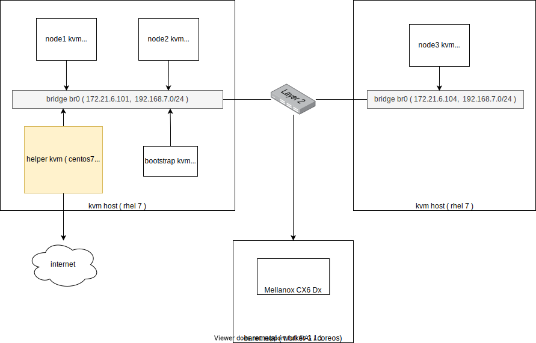
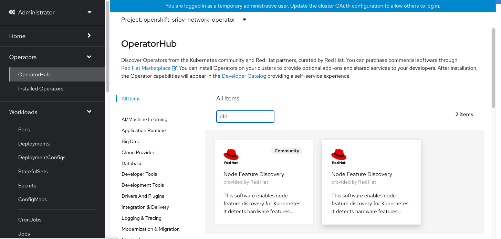

# sriov on openshift4 with unsupport NIC

openshift4自带sriov支持，但是由于内核只认证了某些网卡，所以openshift4内置了一个白名单，sriov的功能只对这些网卡开放。那么我们做实验的时候，没有这些网卡，但是网卡本身支持sriov，怎么做实验呢？本文就讲述如何操作。

实验拓扑图



there is nic whitelist build-in for openshift4's sriov, to disable it, using: 
- https://docs.openshift.com/container-platform/4.6/networking/hardware_networks/configuring-sriov-operator.html#disable-enable-sr-iov-operator-admission-control-webhook_configuring-sriov-operator

# openshift
```bash

# check vendoer id and device id
# https://access.redhat.com/solutions/56081

# on worker-1
lspci -vv | grep -i Mellanox
# 04:00.0 Ethernet controller: Mellanox Technologies MT2892 Family [ConnectX-6 Dx]
#         Subsystem: Mellanox Technologies Device 0011
# 04:00.1 Ethernet controller: Mellanox Technologies MT2892 Family [ConnectX-6 Dx]
#         Subsystem: Mellanox Technologies Device 0011

lspci -nvv | grep "04:00.0\|04:00.1"
# pcilib: sysfs_read_vpd: read failed: Input/output error
# 04:00.0 0200: 15b3:101d
# 04:00.1 0200: 15b3:101d

cat /sys/class/net/*/device/sriov_numvfs
# 0
# 0
cat /sys/class/net/*/device/sriov_totalvfs
# 8
# 8

```
install NFD ( node feature discovery) operator



install SRIOV operator


```bash
oc create namespace openshift-sriov-network-operator

oc create -f - <<EOF
apiVersion: operators.coreos.com/v1
kind: OperatorGroup
metadata:
  name: sriov-network-operators
  namespace: openshift-sriov-network-operator
spec:
  targetNamespaces:
  - openshift-sriov-network-operator
EOF

# https://catalog.redhat.com/software/containers/openshift4/dpdk-base-rhel8/5e32be6cdd19c77896004a41
# registry.redhat.io/openshift4/dpdk-base-rhel8:latest

# oc get sriovnetworknodestates -n openshift-sriov-network-operator -o jsonpath='{.items[*].status}'  | jq

# 可以看到，worker-1上的网卡，已经辨别出了VF
oc get sriovnetworknodestates -n openshift-sriov-network-operator -o json  | jq ".items[] | (.metadata.name, .status)"
```
```json
"master-0"
{
  "interfaces": [
    {
      "deviceID": "1000",
      "driver": "virtio-pci",
      "pciAddress": "0000:00:03.0",
      "vendor": "1af4"
    }
  ],
  "syncStatus": "Succeeded"
}
"master-1"
{
  "interfaces": [
    {
      "deviceID": "1000",
      "driver": "virtio-pci",
      "pciAddress": "0000:00:03.0",
      "vendor": "1af4"
    }
  ],
  "syncStatus": "Succeeded"
}
"master-2"
{
  "interfaces": [
    {
      "deviceID": "1000",
      "driver": "virtio-pci",
      "pciAddress": "0000:00:03.0",
      "vendor": "1af4"
    }
  ],
  "syncStatus": "Succeeded"
}
"worker-0"
{
  "interfaces": [
    {
      "deviceID": "1000",
      "driver": "virtio-pci",
      "pciAddress": "0000:00:03.0",
      "vendor": "1af4"
    }
  ],
  "syncStatus": "Succeeded"
}
"worker-1"
{
  "interfaces": [
    {
      "deviceID": "165f",
      "driver": "tg3",
      "linkSpeed": "1000 Mb/s",
      "linkType": "ETH",
      "mac": "90:b1:1c:44:d6:0f",
      "mtu": 1500,
      "name": "eno1",
      "pciAddress": "0000:01:00.0",
      "vendor": "14e4"
    },
    {
      "deviceID": "165f",
      "driver": "tg3",
      "linkSpeed": "-1 Mb/s",
      "linkType": "ETH",
      "mac": "90:b1:1c:44:d6:10",
      "mtu": 1500,
      "name": "eno2",
      "pciAddress": "0000:01:00.1",
      "vendor": "14e4"
    },
    {
      "deviceID": "165f",
      "driver": "tg3",
      "linkSpeed": "-1 Mb/s",
      "linkType": "ETH",
      "mac": "90:b1:1c:44:d6:11",
      "mtu": 1500,
      "name": "eno3",
      "pciAddress": "0000:02:00.0",
      "vendor": "14e4"
    },
    {
      "deviceID": "165f",
      "driver": "tg3",
      "linkSpeed": "-1 Mb/s",
      "linkType": "ETH",
      "mac": "90:b1:1c:44:d6:12",
      "mtu": 1500,
      "name": "eno4",
      "pciAddress": "0000:02:00.1",
      "vendor": "14e4"
    },
    {
      "deviceID": "101d",
      "driver": "mlx5_core",
      "linkSpeed": "-1 Mb/s",
      "linkType": "ETH",
      "mac": "0c:42:a1:fa:18:52",
      "mtu": 1500,
      "name": "enp4s0f0",
      "pciAddress": "0000:04:00.0",
      "totalvfs": 8,
      "vendor": "15b3"
    },
    {
      "deviceID": "101d",
      "driver": "mlx5_core",
      "linkSpeed": "-1 Mb/s",
      "linkType": "ETH",
      "mac": "0c:42:a1:fa:18:53",
      "mtu": 1500,
      "name": "enp4s0f1",
      "pciAddress": "0000:04:00.1",
      "totalvfs": 8,
      "vendor": "15b3"
    }
  ],
  "syncStatus": "Succeeded"
}
```

```bash
cat << EOF > /data/install/sriov-cx4.yaml
apiVersion: sriovnetwork.openshift.io/v1
kind: SriovNetworkNodePolicy
metadata:
  name: policy-cx4-net-1
  namespace: openshift-sriov-network-operator
spec:
  resourceName: cx4nic1
  nodeSelector:
    feature.node.kubernetes.io/network-sriov.capable: "true"
  numVfs: 4
  nicSelector:
    vendor: "15b3"
    deviceID: "101d"
    # rootDevices:
    #   - "0000:19:00.0"
  deviceType: netdevice 
  isRdma: true
EOF
oc create -f /data/install/sriov-cx4.yaml
# Error from server (vendor/device 15b3/101d is not supported): error when creating "/data/install/sriov-cx4.yaml": admission webhook "operator-webhook.sriovnetwork.openshift.io" denied the request: vendor/device 15b3/101d is not supported

# to restore
oc delete -f /data/install/sriov-cx4.yaml

oc get sriovoperatorconfig default -n openshift-sriov-network-operator -o yaml | yq e '.spec' -
# enableInjector: true
# enableOperatorWebhook: true
# logLevel: 2

oc patch sriovoperatorconfig default --type=merge \
  -n openshift-sriov-network-operator \
  --patch '{ "spec": { "enableOperatorWebhook": false } }'

oc get sriovoperatorconfig default -n openshift-sriov-network-operator -o yaml | yq e '.spec' -
# enableInjector: true
# enableOperatorWebhook: false
# logLevel: 2

oc create -f /data/install/sriov-cx4.yaml
# sriovnetworknodepolicy.sriovnetwork.openshift.io/policy-cx4-net-1 created

# you can see, VF num set to '4'
oc get sriovnetworknodestates worker-1 -n openshift-sriov-network-operator -o json  | jq "(.metadata.name, .status)"
```
```json
"worker-1"
{
  "interfaces": [
    {
      "deviceID": "165f",
      "driver": "tg3",
      "linkSpeed": "1000 Mb/s",
      "linkType": "ETH",
      "mac": "90:b1:1c:44:d6:0f",
      "mtu": 1500,
      "name": "eno1",
      "pciAddress": "0000:01:00.0",
      "vendor": "14e4"
    },
    {
      "deviceID": "165f",
      "driver": "tg3",
      "linkSpeed": "-1 Mb/s",
      "linkType": "ETH",
      "mac": "90:b1:1c:44:d6:10",
      "mtu": 1500,
      "name": "eno2",
      "pciAddress": "0000:01:00.1",
      "vendor": "14e4"
    },
    {
      "deviceID": "165f",
      "driver": "tg3",
      "linkSpeed": "-1 Mb/s",
      "linkType": "ETH",
      "mac": "90:b1:1c:44:d6:11",
      "mtu": 1500,
      "name": "eno3",
      "pciAddress": "0000:02:00.0",
      "vendor": "14e4"
    },
    {
      "deviceID": "165f",
      "driver": "tg3",
      "linkSpeed": "-1 Mb/s",
      "linkType": "ETH",
      "mac": "90:b1:1c:44:d6:12",
      "mtu": 1500,
      "name": "eno4",
      "pciAddress": "0000:02:00.1",
      "vendor": "14e4"
    },
    {
      "Vfs": [
        {
          "deviceID": "101e",
          "driver": "mlx5_core",
          "mac": "36:da:1c:a9:47:9a",
          "mtu": 1500,
          "name": "enp4s0f0v0",
          "pciAddress": "0000:04:00.2",
          "vendor": "15b3",
          "vfID": 0
        },
        {
          "deviceID": "101e",
          "driver": "mlx5_core",
          "mac": "62:ab:95:db:e6:cc",
          "mtu": 1500,
          "name": "enp4s0f0v1",
          "pciAddress": "0000:04:00.3",
          "vendor": "15b3",
          "vfID": 1
        },
        {
          "deviceID": "101e",
          "driver": "mlx5_core",
          "mac": "96:b1:34:81:bc:e2",
          "mtu": 1500,
          "name": "enp4s0f0v2",
          "pciAddress": "0000:04:00.4",
          "vendor": "15b3",
          "vfID": 2
        },
        {
          "deviceID": "101e",
          "driver": "mlx5_core",
          "mac": "5e:9f:cc:cc:e4:a1",
          "mtu": 1500,
          "name": "enp4s0f0v3",
          "pciAddress": "0000:04:00.5",
          "vendor": "15b3",
          "vfID": 3
        }
      ],
      "deviceID": "101d",
      "driver": "mlx5_core",
      "eSwitchMode": "legacy",
      "linkSpeed": "-1 Mb/s",
      "linkType": "ETH",
      "mac": "0c:42:a1:fa:18:52",
      "mtu": 1500,
      "name": "enp4s0f0",
      "numVfs": 4,
      "pciAddress": "0000:04:00.0",
      "totalvfs": 4,
      "vendor": "15b3"
    },
    {
      "Vfs": [
        {
          "deviceID": "101e",
          "driver": "mlx5_core",
          "mac": "e6:75:48:6f:56:33",
          "mtu": 1500,
          "name": "enp4s0f1v0",
          "pciAddress": "0000:04:00.6",
          "vendor": "15b3",
          "vfID": 0
        },
        {
          "deviceID": "101e",
          "driver": "mlx5_core",
          "mac": "5a:74:7a:e7:3d:2b",
          "mtu": 1500,
          "name": "enp4s0f1v1",
          "pciAddress": "0000:04:00.7",
          "vendor": "15b3",
          "vfID": 1
        },
        {
          "deviceID": "101e",
          "driver": "mlx5_core",
          "mac": "62:f8:19:98:d5:5f",
          "mtu": 1500,
          "name": "enp4s0f1v2",
          "pciAddress": "0000:04:01.0",
          "vendor": "15b3",
          "vfID": 2
        },
        {
          "deviceID": "101e",
          "driver": "mlx5_core",
          "mac": "f2:14:1e:93:e9:39",
          "mtu": 1500,
          "name": "enp4s0f1v3",
          "pciAddress": "0000:04:01.1",
          "vendor": "15b3",
          "vfID": 3
        }
      ],
      "deviceID": "101d",
      "driver": "mlx5_core",
      "eSwitchMode": "legacy",
      "linkSpeed": "-1 Mb/s",
      "linkType": "ETH",
      "mac": "0c:42:a1:fa:18:53",
      "mtu": 1500,
      "name": "enp4s0f1",
      "numVfs": 4,
      "pciAddress": "0000:04:00.1",
      "totalvfs": 4,
      "vendor": "15b3"
    }
  ],
  "syncStatus": "Succeeded"
}
```
```bash
cat << EOF > /data/install/sriov-network.yaml
apiVersion: sriovnetwork.openshift.io/v1
kind: SriovNetwork
metadata:
  name: mlx-dpdk-network
  namespace: openshift-sriov-network-operator
spec:
  networkNamespace: demo
  ipam: "{}"
  resourceName: cx4nic1
EOF
oc create -f /data/install/sriov-network.yaml

# to restore
oc delete -f /data/install/sriov-network.yaml

# config worker-1 with hugepage

cat << EOF > /data/install/worker-performance.yaml
apiVersion: machineconfiguration.openshift.io/v1
kind: MachineConfigPool
metadata:
  name: worker-performance
spec:
  machineConfigSelector:
    matchExpressions:
      - {key: machineconfiguration.openshift.io/role, operator: In, values: [worker,worker-performance]}
  nodeSelector:
    matchLabels:
      node-role.kubernetes.io/worker-performance: ""

EOF
oc create -f /data/install/worker-performance.yaml

# to restore
oc delete -f /data/install/worker-performance.yaml

oc label node worker-1 node-role.kubernetes.io/worker-performance=""

cat << EOF > /data/install/worker-1-hugepage.yaml
apiVersion: performance.openshift.io/v2
kind: PerformanceProfile
metadata:
  name: worker-1-hugepage
spec:
  cpu:
    isolated: "5-23"
    reserved: "0-4"
  hugepages:
    defaultHugepagesSize: 1G
    pages:
      - count: 4
        size: 1G
  nodeSelector:
    node-role.kubernetes.io/worker-performance: ''
EOF
oc create -f /data/install/worker-1-hugepage.yaml

# to restore
oc delete -f /data/install/worker-1-hugepage.yaml

# on worker-1
grep -i huge /proc/meminfo
# before
# AnonHugePages:    448512 kB
# ShmemHugePages:        0 kB
# HugePages_Total:       0
# HugePages_Free:        0
# HugePages_Rsvd:        0
# HugePages_Surp:        0
# Hugepagesize:       2048 kB
# Hugetlb:               0 kB

# after
# AnonHugePages:    376832 kB
# ShmemHugePages:        0 kB
# HugePages_Total:       4
# HugePages_Free:        4
# HugePages_Rsvd:        0
# HugePages_Surp:        0
# Hugepagesize:    1048576 kB
# Hugetlb:         4194304 kB

# https://github.com/openshift/sriov-network-operator/issues/133

lspci -vv | grep -i Mellanox
# 04:00.0 Ethernet controller: Mellanox Technologies MT2892 Family [ConnectX-6 Dx]
#         Subsystem: Mellanox Technologies Device 0011
# 04:00.1 Ethernet controller: Mellanox Technologies MT2892 Family [ConnectX-6 Dx]
#         Subsystem: Mellanox Technologies Device 0011
# 04:00.2 Ethernet controller: Mellanox Technologies ConnectX Family mlx5Gen Virtual Function
#         Subsystem: Mellanox Technologies Device 0011
# 04:00.3 Ethernet controller: Mellanox Technologies ConnectX Family mlx5Gen Virtual Function
#         Subsystem: Mellanox Technologies Device 0011
# 04:00.4 Ethernet controller: Mellanox Technologies ConnectX Family mlx5Gen Virtual Function
#         Subsystem: Mellanox Technologies Device 0011
# 04:00.5 Ethernet controller: Mellanox Technologies ConnectX Family mlx5Gen Virtual Function
#         Subsystem: Mellanox Technologies Device 0011
# 04:00.6 Ethernet controller: Mellanox Technologies ConnectX Family mlx5Gen Virtual Function
#         Subsystem: Mellanox Technologies Device 0011
# 04:00.7 Ethernet controller: Mellanox Technologies ConnectX Family mlx5Gen Virtual Function
#         Subsystem: Mellanox Technologies Device 0011
# 04:01.0 Ethernet controller: Mellanox Technologies ConnectX Family mlx5Gen Virtual Function
#         Subsystem: Mellanox Technologies Device 0011
# 04:01.1 Ethernet controller: Mellanox Technologies ConnectX Family mlx5Gen Virtual Function
#         Subsystem: Mellanox Technologies Device 0011

lspci -nvv | grep "04:00.0\|04:00.1"
# pcilib: sysfs_read_vpd: read failed: Input/output error
# 04:00.0 0200: 15b3:101d
# 04:00.1 0200: 15b3:101d

lspci | grep -i Mellanox | awk '{print $1}' | xargs -I DEMO sh -c "lspci -nvv | grep DEMO "
# pcilib: sysfs_read_vpd: read failed: Input/output error
# 04:00.0 0200: 15b3:101d
# pcilib: sysfs_read_vpd: read failed: Input/output error
# 04:00.1 0200: 15b3:101d
# pcilib: sysfs_read_vpd: read failed: Input/output error
# 04:00.2 0200: 15b3:101e
# pcilib: sysfs_read_vpd: read failed: Input/output error
# 04:00.3 0200: 15b3:101e
# pcilib: sysfs_read_vpd: read failed: Input/output error
# 04:00.4 0200: 15b3:101e
# pcilib: sysfs_read_vpd: read failed: Input/output error
# 04:00.5 0200: 15b3:101e
# pcilib: sysfs_read_vpd: read failed: Input/output error
# 04:00.6 0200: 15b3:101e
# pcilib: sysfs_read_vpd: read failed: Input/output error
# 04:00.7 0200: 15b3:101e
# pcilib: sysfs_read_vpd: read failed: Input/output error
# 04:01.0 0200: 15b3:101e
# pcilib: sysfs_read_vpd: read failed: Input/output error
# 04:01.1 0200: 15b3:101e

# <human readable name>: <vendor ID> <pf ID> <vf ID>
cat << EOF > /data/install/sriov-unsupport.yaml
apiVersion: v1
data:
  CX6DX: 15b3 101d 101e
kind: ConfigMap
metadata:
  name: unsupported-nic-ids
  namespace: openshift-sriov-network-operator
EOF
oc create -f /data/install/sriov-unsupport.yaml

# try to deply a demo pod
cat << EOF > /data/install/dpdk-test.yaml
apiVersion: v1
kind: Pod
metadata:
  name: dpdk-app
  annotations:
    k8s.v1.cni.cncf.io/networks: mlx-dpdk-network
spec:
  containers:
  - name: testpmd
    image: registry.redhat.io/openshift4/dpdk-base-rhel8:v4.6
    securityContext:
     capabilities:
        add: ["IPC_LOCK"] 
    volumeMounts:
    - mountPath: /dev/hugepages 
      name: hugepage
    resources:
      limits:
        openshift.io/cx4nic1: "1" 
        memory: "1Gi"
        cpu: "4" 
        hugepages-1Gi: "4Gi" 
      requests:
        openshift.io/cx4nic1: "1"
        memory: "1Gi"
        cpu: "4"
        hugepages-1Gi: "4Gi"
    command: ["sleep", "infinity"]
  volumes:
  - name: hugepage
    emptyDir:
      medium: HugePages
EOF
oc create -n demo -f /data/install/dpdk-test.yaml

# to restore
oc delete -n demo -f /data/install/dpdk-test.yaml

# in the pod
rpm -ql dpdk-tools
# /usr/sbin/dpdk-devbind
# /usr/share/dpdk/usertools
# /usr/share/dpdk/usertools/cpu_layout.py
# /usr/share/dpdk/usertools/dpdk-devbind.py
# /usr/share/dpdk/usertools/dpdk-pmdinfo.py
# /usr/share/dpdk/usertools/dpdk-telemetry-client.py

/usr/share/dpdk/usertools/dpdk-devbind.py --status-dev net
# lspci: Unable to load libkmod resources: error -12
# lspci: Unable to load libkmod resources: error -12
# lspci: Unable to load libkmod resources: error -12
# lspci: Unable to load libkmod resources: error -12
# lspci: Unable to load libkmod resources: error -12
# lspci: Unable to load libkmod resources: error -12
# lspci: Unable to load libkmod resources: error -12

# Network devices using kernel driver
# ===================================
# 0000:01:00.0 'NetXtreme BCM5720 2-port Gigabit Ethernet PCIe 165f' if= drv=tg3 unused= 
# 0000:01:00.1 'NetXtreme BCM5720 2-port Gigabit Ethernet PCIe 165f' if= drv=tg3 unused= 
# 0000:02:00.0 'NetXtreme BCM5720 2-port Gigabit Ethernet PCIe 165f' if= drv=tg3 unused= 
# 0000:02:00.1 'NetXtreme BCM5720 2-port Gigabit Ethernet PCIe 165f' if= drv=tg3 unused= 
# 0000:04:00.0 'MT2892 Family [ConnectX-6 Dx] 101d' if= drv=mlx5_core unused= 
# 0000:04:00.1 'MT2892 Family [ConnectX-6 Dx] 101d' if= drv=mlx5_core unused= 
# 0000:04:00.2 'ConnectX Family mlx5Gen Virtual Function 101e' if= drv=mlx5_core unused= 
# 0000:04:00.3 'ConnectX Family mlx5Gen Virtual Function 101e' if= drv=mlx5_core unused= 
# 0000:04:00.4 'ConnectX Family mlx5Gen Virtual Function 101e' if=net1 drv=mlx5_core unused= 
# 0000:04:00.5 'ConnectX Family mlx5Gen Virtual Function 101e' if= drv=mlx5_core unused= 
# 0000:04:00.6 'ConnectX Family mlx5Gen Virtual Function 101e' if= drv=mlx5_core unused= 
# 0000:04:00.7 'ConnectX Family mlx5Gen Virtual Function 101e' if= drv=mlx5_core unused= 
# 0000:04:01.0 'ConnectX Family mlx5Gen Virtual Function 101e' if= drv=mlx5_core unused= 
# 0000:04:01.1 'ConnectX Family mlx5Gen Virtual Function 101e' if= drv=mlx5_core unused= 

```


# kvm does't support sriov PF passthrough

it only support VF passthrough

- https://www.cnblogs.com/dion-90/articles/8522733.html
- https://access.redhat.com/documentation/en-us/red_hat_enterprise_linux/7/html/virtualization_deployment_and_administration_guide/sect-pci_devices-pci_passthrough

```bash
# on 101
ls /sys/class/net/

lspci -vv | grep -i Mellanox
# pcilib: sysfs_read_vpd: read failed: Input/output error
# 05:00.0 Ethernet controller: Mellanox Technologies MT27710 Family [ConnectX-4 Lx]
#         Subsystem: Mellanox Technologies Stand-up ConnectX-4 Lx EN, 25GbE dual-port SFP28, PCIe3.0 x8, MCX4121A-ACAT
# 05:00.1 Ethernet controller: Mellanox Technologies MT27710 Family [ConnectX-4 Lx]
#         Subsystem: Mellanox Technologies Stand-up ConnectX-4 Lx EN, 25GbE dual-port SFP28, PCIe3.0 x8, MCX4121A-ACAT
# 07:00.0 Ethernet controller: Mellanox Technologies MT27710 Family [ConnectX-4 Lx]
#         Subsystem: Mellanox Technologies Stand-up ConnectX-4 Lx EN, 25GbE dual-port SFP28, PCIe3.0 x8, MCX4121A-ACAT
# 07:00.1 Ethernet controller: Mellanox Technologies MT27710 Family [ConnectX-4 Lx]
#         Subsystem: Mellanox Technologies Stand-up ConnectX-4 Lx EN, 25GbE dual-port SFP28, PCIe3.0 x8, MCX4121A-ACAT

virsh nodedev-list | grep 000_05
# pci_0000_05_00_0
# pci_0000_05_00_1

virsh nodedev-dumpxml pci_0000_05_00_0
```
```xml
<device>
  <name>pci_0000_05_00_0</name>
  <path>/sys/devices/pci0000:00/0000:00:06.0/0000:05:00.0</path>
  <parent>pci_0000_00_06_0</parent>
  <driver>
    <name>mlx5_core</name>
  </driver>
  <capability type='pci'>
    <domain>0</domain>
    <bus>5</bus>
    <slot>0</slot>
    <function>0</function>
    <product id='0x1015'>MT27710 Family [ConnectX-4 Lx]</product>
    <vendor id='0x15b3'>Mellanox Technologies</vendor>
    <capability type='virt_functions' maxCount='64'/>
    <iommuGroup number='17'>
      <address domain='0x0000' bus='0x05' slot='0x00' function='0x0'/>
    </iommuGroup>
    <pci-express>
      <link validity='cap' port='0' speed='8' width='8'/>
      <link validity='sta' speed='5' width='4'/>
    </pci-express>
  </capability>
</device>
```
```bash
virsh nodedev-dumpxml pci_0000_05_00_1
```
```xml
<device>
  <name>pci_0000_05_00_1</name>
  <path>/sys/devices/pci0000:00/0000:00:06.0/0000:05:00.1</path>
  <parent>pci_0000_00_06_0</parent>
  <driver>
    <name>mlx5_core</name>
  </driver>
  <capability type='pci'>
    <domain>0</domain>
    <bus>5</bus>
    <slot>0</slot>
    <function>1</function>
    <product id='0x1015'>MT27710 Family [ConnectX-4 Lx]</product>
    <vendor id='0x15b3'>Mellanox Technologies</vendor>
    <capability type='virt_functions' maxCount='64'/>
    <iommuGroup number='18'>
      <address domain='0x0000' bus='0x05' slot='0x00' function='0x1'/>
    </iommuGroup>
    <pci-express>
      <link validity='cap' port='0' speed='8' width='8'/>
      <link validity='sta' speed='5' width='4'/>
    </pci-express>
  </capability>
</device>
```

## on 103
```bash
ls /sys/class/net/
# baremetal  eno1  eno2  eno3  eno4  enp4s0f0  enp4s0f1  lo  virbr0  virbr0-nic
echo 0 > /sys/class/net/enp4s0f0/device/sriov_numvfs
echo 0 > /sys/class/net/enp4s0f1/device/sriov_numvfs

lspci -vv | grep -i Mellanox
# 04:00.0 Ethernet controller: Mellanox Technologies MT2892 Family [ConnectX-6 Dx]
#         Subsystem: Mellanox Technologies Device 0011
# 04:00.1 Ethernet controller: Mellanox Technologies MT2892 Family [ConnectX-6 Dx]
#         Subsystem: Mellanox Technologies Device 0011

virsh nodedev-list | grep 000_04
# pci_0000_04_00_0
# pci_0000_04_00_1

virsh nodedev-dumpxml pci_0000_04_00_0
```
```xml
<device>
  <name>pci_0000_04_00_0</name>
  <path>/sys/devices/pci0000:00/0000:00:02.0/0000:04:00.0</path>
  <parent>pci_0000_00_02_0</parent>
  <driver>
    <name>mlx5_core</name>
  </driver>
  <capability type='pci'>
    <class>0x020000</class>
    <domain>0</domain>
    <bus>4</bus>
    <slot>0</slot>
    <function>0</function>
    <product id='0x101d'>MT2892 Family [ConnectX-6 Dx]</product>
    <vendor id='0x15b3'>Mellanox Technologies</vendor>
    <capability type='virt_functions' maxCount='8'/>
    <iommuGroup number='27'>
      <address domain='0x0000' bus='0x04' slot='0x00' function='0x0'/>
    </iommuGroup>
    <numa node='0'/>
    <pci-express>
      <link validity='cap' port='0' speed='16' width='16'/>
      <link validity='sta' speed='8' width='8'/>
    </pci-express>
  </capability>
</device>
```
```bash
virsh nodedev-dumpxml pci_0000_04_00_1
```
```xml
<device>
  <name>pci_0000_04_00_1</name>
  <path>/sys/devices/pci0000:00/0000:00:02.0/0000:04:00.1</path>
  <parent>pci_0000_00_02_0</parent>
  <driver>
    <name>mlx5_core</name>
  </driver>
  <capability type='pci'>
    <class>0x020000</class>
    <domain>0</domain>
    <bus>4</bus>
    <slot>0</slot>
    <function>1</function>
    <product id='0x101d'>MT2892 Family [ConnectX-6 Dx]</product>
    <vendor id='0x15b3'>Mellanox Technologies</vendor>
    <capability type='virt_functions' maxCount='8'/>
    <iommuGroup number='28'>
      <address domain='0x0000' bus='0x04' slot='0x00' function='0x1'/>
    </iommuGroup>
    <numa node='0'/>
    <pci-express>
      <link validity='cap' port='0' speed='16' width='16'/>
      <link validity='sta' speed='8' width='8'/>
    </pci-express>
  </capability>
</device>
```

for ocp4-aHelper, change below kvm config 
```xml
<hostdev mode='subsystem' type='pci' managed='yes'>
      <driver name='vfio'/>
      <source>
        <address domain='0x0000' bus='0x05' slot='0x00' function='0x0'/>
      </source>
      <alias name='hostdev0'/>
      <address type='pci' domain='0x0000' bus='0x00' slot='0x0a' function='0x0'/>
    </hostdev>
    <hostdev mode='subsystem' type='pci' managed='yes'>
      <driver name='vfio'/>
      <source>
        <address domain='0x0000' bus='0x05' slot='0x00' function='0x1'/>
      </source>
      <alias name='hostdev1'/>
      <address type='pci' domain='0x0000' bus='0x00' slot='0x0b' function='0x0'/>
    </hostdev>
```
to 
```xml
    <interface type='hostdev' managed='yes'>
      <driver name='vfio'/>
      <source>
        <address type='pci' domain='0x0000' bus='0x05' slot='0x00' function='0x0'/>
      </source>
    </interface>
    <interface type='hostdev' managed='yes'>
      <driver name='vfio'/>
      <source>
        <address type='pci' domain='0x0000' bus='0x05' slot='0x00' function='0x1'/>
      </source>
    </interface>
```
```bash
virsh edit ocp4-aHelper
```
