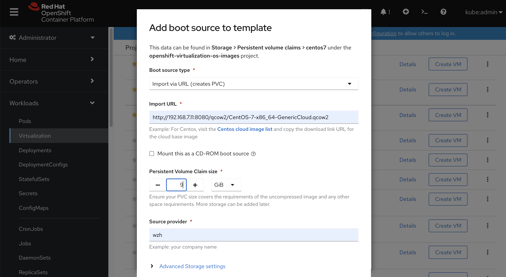
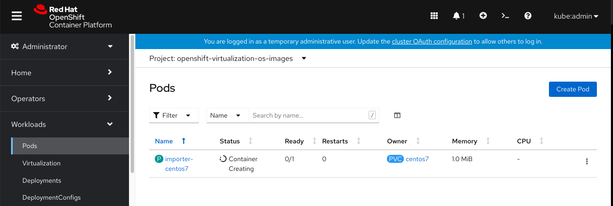

# cnv on openshift 4.8

```bash
# Create HyperConverged in the webUI
# there are some new features, explore it later.

# https://docs.openshift.com/container-platform/4.8/virt/virtual_machines/virtual_disks/virt-configuring-local-storage-for-vms.html#virt-about-hostpath-provisioner_virt-configuring-local-storage-for-vms
# https://github.com/rdoxenham/openshift-virt-labs/blob/master/docs/workshop/content/storage-setup.md
# ExecStartPre=- means ignore the error of the command
cat << EOF > /data/install/hostpath.yaml
apiVersion: machineconfiguration.openshift.io/v1
kind: MachineConfig
metadata:
  name: 50-set-selinux-for-hostpath-provisioner
  labels:
    machineconfiguration.openshift.io/role: worker
spec:
  config:
    ignition:
      version: 3.2.0
    systemd:
      units:
        - contents: |
            [Unit]
            Description=Set SELinux chcon for hostpath provisioner
            Before=kubelet.service

            [Service]
            ExecStartPre=-mkdir -p /var/hpvolumes
            ExecStart=/usr/bin/chcon -Rt container_file_t /var/hpvolumes 

            [Install]
            WantedBy=multi-user.target
          enabled: true
          name: hostpath-provisioner.service
EOF
oc create -f /data/install/hostpath.yaml

cat << EOF > /data/install/hostpath-provision.yaml
apiVersion: hostpathprovisioner.kubevirt.io/v1beta1
kind: HostPathProvisioner
metadata:
  name: hostpath-provisioner
spec:
  imagePullPolicy: IfNotPresent
  pathConfig:
    path: "/var/hpvolumes"
    useNamingPrefix: false
EOF
oc create -f /data/install/hostpath-provision.yaml

cat << EOF > /data/install/hostpath-storageclass.yaml
apiVersion: storage.k8s.io/v1
kind: StorageClass
metadata:
  name: hostpath-provisioner 
provisioner: kubevirt.io/hostpath-provisioner
reclaimPolicy: Delete 
volumeBindingMode: WaitForFirstConsumer 
EOF
oc create -f /data/install/hostpath-storageclass.yaml

# we also want local path storage, install cnv operator, and enable local path 
oc patch storageclass hostpath-provisioner  -p '{"metadata": {"annotations":{"storageclass.kubernetes.io/is-default-class":"true"}}}'

# on helper
mkdir -p /var/www/html/qcow2/
cd /var/www/html/qcow2/
wget https://cloud.centos.org/centos/7/images/CentOS-7-x86_64-GenericCloud.qcow2.xz
xz --decompress CentOS-7-x86_64-GenericCloud.qcow2.xz

dnf install -y qemu-img

qemu-img info CentOS-7-x86_64-GenericCloud.qcow2
# image: CentOS-7-x86_64-GenericCloud.qcow2
# file format: qcow2
# virtual size: 8 GiB (8589934592 bytes)
# disk size: 819 MiB
# cluster_size: 65536
# Format specific information:
#     compat: 1.1
#     lazy refcounts: false
#     refcount bits: 16
#     corrupt: false


```





```bash
oc get pv
# NAME                                       CAPACITY   ACCESS MODES   RECLAIM POLICY   STATUS   CLAIM                                        STORAGECLASS           REASON   AGE
# pvc-6a741b04-0fd1-4039-b360-777ee81b6838   278Gi      RWO            Delete           Bound    openshift-virtualization-os-images/centos7   hostpath-provisioner            2m49s

oc get pvc -n openshift-virtualization-os-images
# NAME      STATUS   VOLUME                                     CAPACITY   ACCESS MODES   STORAGECLASS           AGE
# centos7   Bound    pvc-6a741b04-0fd1-4039-b360-777ee81b6838   278Gi      RWO            hostpath-provisioner   5m12s

oc get DataVolume -n openshift-virtualization-os-images
# NAME      PHASE       PROGRESS   RESTARTS   AGE
# centos7   Succeeded   100.0%                5m53s

ls -hlZ
# total 863M
# -rw-rw----. 1 root root system_u:object_r:container_file_t:s0 19G Sep 21 02:16 disk.img
pwd
# /var/hpvolumes/pvc-6a741b04-0fd1-4039-b360-777ee81b6838
```


```bash
ls -RhlZ
# .:
# total 0
# drwxrwxrwx. 2 root root system_u:object_r:container_file_t:s0 22 Sep 21 02:52 pvc-10729cd4-4929-4ed0-8be5-93ba56601838
# drwxrwxrwx. 2 root root system_u:object_r:container_file_t:s0 22 Sep 21 02:52 pvc-5be304f0-8977-46ce-9b4b-473083927eb9

# ./pvc-10729cd4-4929-4ed0-8be5-93ba56601838:
# total 863M
# -rw-rw----. 1 root root system_u:object_r:container_file_t:s0 8.6G Sep 21 02:52 disk.img

# ./pvc-5be304f0-8977-46ce-9b4b-473083927eb9:
# total 1.2G
# -rw-rw----. 1 qemu qemu system_u:object_r:container_file_t:s0 8.6G Sep 21 06:30 disk.img

```