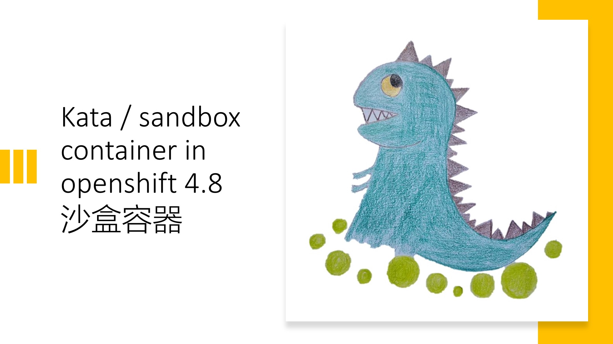
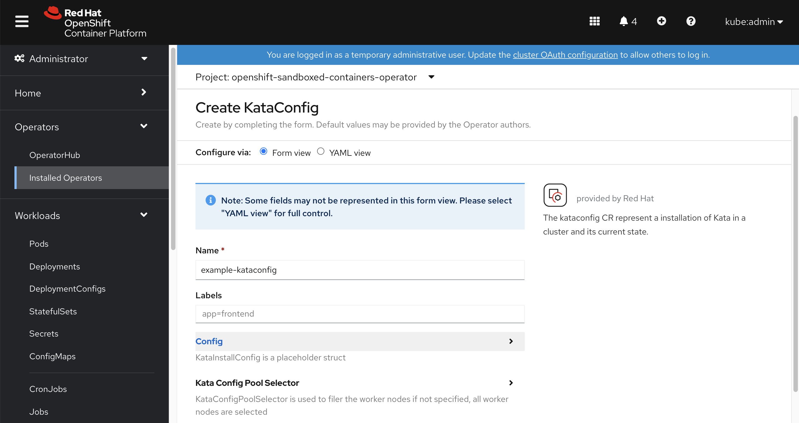
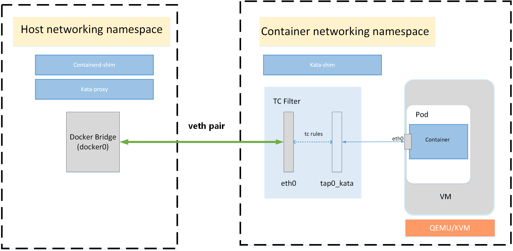

# Kata / sandbox container in openshift 4.8

红帽 openshift 4.8 容器平台，最新支持了kata，或者叫沙盒容器, 是在物理机上启动vm，然后在vm里面启动容器进程的技术，初衷是为了进一步提高安全性，消除用户对容器是否存在逃逸问题的顾虑，虽然还是TP阶段，但是已经可以一探究竟啦。

https://docs.openshift.com/container-platform/4.8/sandboxed_containers/understanding-sandboxed-containers.html

视频讲解:

[<kbd></kbd>](https://www.bilibili.com/video/BV1Mg411V7ZX/)

- [bilibili](https://www.bilibili.com/video/BV1Mg411V7ZX/)
- [youtube](https://youtu.be/ygvpGZXnIRs)

首先我们来安装它，在operator hub里面选择sandbox container，点击安装。


然后在operator里面创建一个kata config，默认就可以，现在是TP阶段，也没什么花活。


创建好了以后，kata operator就会在系统里面创建一些配置，我们来一个一个看一下。
```bash
# 首先是runtime class，这个是指出了pod可以使用kata作为runtime, 
# 注意礼貌的overhead，这个配置的意思，是kata有qemu作为虚拟机，所以会有一些额外的消耗，
# 这些消耗在scheduling的时候，需要计算，这里就把这个计算量静态的配置进去。。。
# 虽然我觉得这个不太灵活，但是目前就是这样的。
oc get runtimeclass/kata -o yaml
# apiVersion: node.k8s.io/v1
# handler: kata
# kind: RuntimeClass
# metadata:
#   name: kata
# overhead:
#   podFixed:
#     cpu: 250m
#     memory: 350Mi
# scheduling:
#   nodeSelector:
#     node-role.kubernetes.io/worker: ""

# ocp会把kata通过machine config的方式，配置到节点里面去
oc get mc
# NAME                                               GENERATEDBYCONTROLLER                      IGNITIONVERSION   AGE
# 00-master                                          723a8a4992f42530af95202e51e5a940d2a3d169   3.2.0             15h
# 00-worker                                          723a8a4992f42530af95202e51e5a940d2a3d169   3.2.0             15h
# 01-master-container-runtime                        723a8a4992f42530af95202e51e5a940d2a3d169   3.2.0             15h
# 01-master-kubelet                                  723a8a4992f42530af95202e51e5a940d2a3d169   3.2.0             15h
# 01-worker-container-runtime                        723a8a4992f42530af95202e51e5a940d2a3d169   3.2.0             15h
# 01-worker-kubelet                                  723a8a4992f42530af95202e51e5a940d2a3d169   3.2.0             15h
# 50-enable-sandboxed-containers-extension                                                      3.2.0             51m
# 99-master-chrony-configuration                                                                2.2.0             15h
# 99-master-container-registries                                                                3.1.0             15h
# 99-master-generated-registries                     723a8a4992f42530af95202e51e5a940d2a3d169   3.2.0             15h
# 99-master-ssh                                                                                 3.2.0             15h
# 99-worker-chrony-configuration                                                                2.2.0             15h
# 99-worker-container-registries                                                                3.1.0             15h
# 99-worker-generated-registries                     723a8a4992f42530af95202e51e5a940d2a3d169   3.2.0             15h
# 99-worker-ssh                                                                                 3.2.0             15h
# rendered-master-8c1e34a69aa4b919b6f2eec350570491   723a8a4992f42530af95202e51e5a940d2a3d169   3.2.0             15h
# rendered-worker-4afd90ddf39588aae385def4519e8da9   723a8a4992f42530af95202e51e5a940d2a3d169   3.2.0             51m
# rendered-worker-5abff4814eef2f9bc7535e5cbb10564c   723a8a4992f42530af95202e51e5a940d2a3d169   3.2.0             15h

# 那这个machine config里面是什么呢？我们看一看
# 原来是加了一个extension, 
# 经过查看源代码，这个sandboxed-containers extension就是对应了kata-containers rpm
oc get mc/50-enable-sandboxed-containers-extension -o yaml
# apiVersion: machineconfiguration.openshift.io/v1
# kind: MachineConfig
# metadata:
#   labels:
#     app: example-kataconfig
#     machineconfiguration.openshift.io/role: worker
#   name: 50-enable-sandboxed-containers-extension
# spec:
#   config:
#     ignition:
#       version: 3.2.0
#   extensions:
#   - sandboxed-containers

# 我们到worker-0上看看，发现确实是安装了一个新的kata-containers rpm
rpm-ostree status
# State: idle
# Deployments:
# ● pivot://quay.io/openshift-release-dev/ocp-v4.0-art-dev@sha256:6ddc94ab09a4807ea3d1f29a922fe15f0b4ee863529258c486a04e7fb7b95a4b
#               CustomOrigin: Managed by machine-config-operator
#                    Version: 48.84.202108161759-0 (2021-08-16T18:03:02Z)
#            LayeredPackages: kata-containers

#   pivot://quay.io/openshift-release-dev/ocp-v4.0-art-dev@sha256:6ddc94ab09a4807ea3d1f29a922fe15f0b4ee863529258c486a04e7fb7b95a4b
#               CustomOrigin: Managed by machine-config-operator
#                    Version: 48.84.202108161759-0 (2021-08-16T18:03:02Z)

# 我们看看这个kata-containers rpm里面都提供了什么文件
rpm -ql kata-containers
# /etc/crio/crio.conf.d/50-kata
# /usr/bin/containerd-shim-kata-v2
# /usr/bin/kata-collect-data.sh
# /usr/bin/kata-monitor
# /usr/bin/kata-runtime
# /usr/lib/.build-id
# /usr/lib/.build-id/0f
# /usr/lib/.build-id/0f/dc6751937c4b54a2e10ed431f7969bfd85d2d7
# /usr/lib/.build-id/5e
# /usr/lib/.build-id/5e/ad1e1eca5ab8111a23bf094caf6acbd3b9d7af
# /usr/lib/.build-id/67
# /usr/lib/.build-id/67/e5107c68c0e147f24f6e8f4e96104564b8f223
# /usr/lib/.build-id/be
# /usr/lib/.build-id/be/0add7df48b5f06a305e95497355666a1e04e39
# /usr/lib/systemd/system/kata-osbuilder-generate.service
# /usr/libexec/kata-containers
# /usr/libexec/kata-containers/VERSION
# /usr/libexec/kata-containers/agent
# /usr/libexec/kata-containers/agent/usr
# /usr/libexec/kata-containers/agent/usr/bin
# /usr/libexec/kata-containers/agent/usr/bin/kata-agent
# /usr/libexec/kata-containers/agent/usr/lib
# /usr/libexec/kata-containers/agent/usr/lib/systemd
# /usr/libexec/kata-containers/agent/usr/lib/systemd/system
# /usr/libexec/kata-containers/agent/usr/lib/systemd/system/kata-agent.service
# /usr/libexec/kata-containers/agent/usr/lib/systemd/system/kata-containers.target
# /usr/libexec/kata-containers/kata-netmon
# /usr/libexec/kata-containers/osbuilder
# /usr/libexec/kata-containers/osbuilder/dracut
# /usr/libexec/kata-containers/osbuilder/dracut/dracut.conf.d
# /usr/libexec/kata-containers/osbuilder/dracut/dracut.conf.d/05-base.conf
# /usr/libexec/kata-containers/osbuilder/dracut/dracut.conf.d/15-dracut-rhel.conf
# /usr/libexec/kata-containers/osbuilder/initrd-builder
# /usr/libexec/kata-containers/osbuilder/initrd-builder/README.md
# /usr/libexec/kata-containers/osbuilder/initrd-builder/initrd_builder.sh
# /usr/libexec/kata-containers/osbuilder/kata-osbuilder.sh
# /usr/libexec/kata-containers/osbuilder/nsdax
# /usr/libexec/kata-containers/osbuilder/rootfs-builder
# /usr/libexec/kata-containers/osbuilder/rootfs-builder/README.md
# /usr/libexec/kata-containers/osbuilder/rootfs-builder/rootfs.sh
# /usr/libexec/kata-containers/osbuilder/scripts
# /usr/libexec/kata-containers/osbuilder/scripts/lib.sh
# /usr/share/bash-completion/completions/kata-runtime
# /usr/share/doc/kata-containers
# /usr/share/doc/kata-containers/CONTRIBUTING.md
# /usr/share/doc/kata-containers/README.md
# /usr/share/kata-containers
# /usr/share/kata-containers/defaults
# /usr/share/kata-containers/defaults/configuration.toml
# /usr/share/licenses/kata-containers
# /usr/share/licenses/kata-containers/LICENSE
# /var/cache/kata-containers

# 我们看看kata-containers 使用的虚拟机镜像
ls -Rl /var/cache/kata-containers
# /var/cache/kata-containers:
# total 0
# lrwxrwxrwx. 1 root root 121 Aug 26 05:22 kata-containers-initrd.img -> '/var/cache/kata-containers/osbuilder-images/4.18.0-305.12.1.el8_4.x86_64/"rhcos"-kata-4.18.0-305.12.1.el8_4.x86_64.initrd'
# drwxr-xr-x. 3 root root  42 Aug 26 05:22 osbuilder-images
# lrwxrwxrwx. 1 root root  50 Aug 26 05:22 vmlinuz.container -> /lib/modules/4.18.0-305.12.1.el8_4.x86_64//vmlinuz

# /var/cache/kata-containers/osbuilder-images:
# total 0
# drwxr-xr-x. 2 root root 62 Aug 26 05:22 4.18.0-305.12.1.el8_4.x86_64

# /var/cache/kata-containers/osbuilder-images/4.18.0-305.12.1.el8_4.x86_64:
# total 19224
# -rw-r--r--. 1 root root 19682871 Aug 26 05:22 '"rhcos"-kata-4.18.0-305.12.1.el8_4.x86_64.initrd'

# 我们看看kata和crio的结合点，就是crios的配置文件里面
cat /etc/crio/crio.conf.d/50-kata
# [crio.runtime.runtimes.kata]
#   runtime_path = "/usr/bin/containerd-shim-kata-v2"
#   runtime_type = "vm"
#   runtime_root = "/run/vc"
#   privileged_without_host_devices = true

# 我们能看到，系统启动的时候，会根据当前操作系统，编译一个kata使用的虚拟机镜像。
# 后面如果项目上有需要，可以在这个步骤上，做定制，做一个客户需要的虚拟机镜像。
systemctl cat kata-osbuilder-generate.service
# # /usr/lib/systemd/system/kata-osbuilder-generate.service
# [Unit]
# Description=Generate Kata appliance image for host kernel

# [Service]
# Type=oneshot
# ExecStart=/usr/libexec/kata-containers/osbuilder/kata-osbuilder.sh -c
# ExecReload=/usr/libexec/kata-containers/osbuilder/kata-osbuilder.sh

# [Install]
# WantedBy=kubelet.service

# 我们来搞一个pod，测试一下。
cat << EOF > /data/install/kata.yaml
apiVersion: apps/v1
kind: Deployment
metadata:
  name: mypod
  labels:
    app: mypod
spec:
  replicas: 1
  selector:
    matchLabels:
      app: mypod
  template:
    metadata:
      labels:
        app: mypod
    spec:
      runtimeClassName: kata
      containers:
      - name: mypod
        image: quay.io/wangzheng422/qimgs:centos7-test
        command:
          - sleep
          - infinity
EOF
oc create -f /data/install/kata.yaml

# to restore
oc delete -f /data/install/kata.yaml

# 到worker-0上，可以看到qemu进程。
ps aufx ww | grep qemu
# root       99994  0.0  0.0  12816  1076 pts/0    S+   06:22   0:00                      \_ grep --color=auto qemu
# root       93561  1.3  0.9 2466300 326724 ?      Sl   06:19   0:03 /usr/libexec/qemu-kiwi -name sandbox-42f003b365352a71ab87e8a1f49b1c301b6c3c856ec5520b4986aa8b9e43151f -uuid 1cd86e5c-3f86-45e8-bce2-96b16dce635a -machine q35,accel=kvm,kernel_irqchip -cpu host,pmu=off -qmp unix:/run/vc/vm/42f003b365352a71ab87e8a1f49b1c301b6c3c856ec5520b4986aa8b9e43151f/qmp.sock,server=on,wait=off -m 2048M,slots=10,maxmem=33122M -device pci-bridge,bus=pcie.0,id=pci-bridge-0,chassis_nr=1,shpc=on,addr=2 -device virtio-serial-pci,disable-modern=false,id=serial0 -device virtconsole,chardev=charconsole0,id=console0 -chardev socket,id=charconsole0,path=/run/vc/vm/42f003b365352a71ab87e8a1f49b1c301b6c3c856ec5520b4986aa8b9e43151f/console.sock,server=on,wait=off -device virtio-scsi-pci,id=scsi0,disable-modern=false -object rng-random,id=rng0,filename=/dev/urandom -device virtio-rng-pci,rng=rng0 -device vhost-vsock-pci,disable-modern=false,vhostfd=3,id=vsock-976011602,guest-cid=976011602 -chardev socket,id=char-b4b86634faff36bb,path=/run/vc/vm/42f003b365352a71ab87e8a1f49b1c301b6c3c856ec5520b4986aa8b9e43151f/vhost-fs.sock -device vhost-user-fs-pci,chardev=char-b4b86634faff36bb,tag=kataShared -netdev tap,id=network-0,vhost=on,vhostfds=4,fds=5 -device driver=virtio-net-pci,netdev=network-0,mac=0a:58:0a:fe:01:1a,disable-modern=false,mq=on,vectors=4 -rtc base=utc,driftfix=slew,clock=host -global kvm-pit.lost_tick_policy=discard -vga none -no-user-config -nodefaults -nographic --no-reboot -daemonize -object memory-backend-file,id=dimm1,size=2048M,mem-path=/dev/shm,share=on -numa node,memdev=dimm1 -kernel /usr/lib/modules/4.18.0-305.12.1.el8_4.x86_64/vmlinuz -initrd /var/cache/kata-containers/osbuilder-images/4.18.0-305.12.1.el8_4.x86_64/"rhcos"-kata-4.18.0-305.12.1.el8_4.x86_64.initrd -append tsc=reliable no_timer_check rcupdate.rcu_expedited=1 i8042.direct=1 i8042.dumbkbd=1 i8042.nopnp=1 i8042.noaux=1 noreplace-smp reboot=k console=hvc0 console=hvc1 cryptomgr.notests net.ifnames=0 pci=lastbus=0 quiet panic=1 nr_cpus=24 scsi_mod.scan=none -pidfile /run/vc/vm/42f003b365352a71ab87e8a1f49b1c301b6c3c856ec5520b4986aa8b9e43151f/pid -smp 1,cores=1,threads=1,sockets=24,maxcpus=24

# 我们很好奇kata的详细配置，那么我们看看kata的配置文件在哪里
kata-runtime --show-default-config-paths
# /etc/kata-containers/configuration.toml
# /usr/share/kata-containers/defaults/configuration.toml

# 我们看看kata的配置文件内容
cat /usr/share/kata-containers/defaults/configuration.toml
```
[result check here](./files/configuration.toml)
```bash
# 我们看看kata runtime感知到的配置内容
kata-runtime env
# [Meta]
#   Version = "1.0.25"

# [Runtime]
#   Debug = false
#   Trace = false
#   DisableGuestSeccomp = true
#   DisableNewNetNs = false
#   SandboxCgroupOnly = true
#   Path = "/usr/bin/kata-runtime"
#   [Runtime.Version]
#     OCI = "1.0.1-dev"
#     [Runtime.Version.Version]
#       Semver = "2.1.0"
#       Major = 2
#       Minor = 1
#       Patch = 0
#       Commit = "fa7b9408555e863d0f36f7d0640134069b0c70c8"
#   [Runtime.Config]
#     Path = "/usr/share/kata-containers/defaults/configuration.toml"

# [Hypervisor]
#   MachineType = "q35"
#   Version = "QEMU emulator version 5.2.0 (qemu-kvm-5.2.0-16.module+el8.4.0+11536+725e25d9.2)\nCopyright (c) 2003-2020 Fabrice Bellard and the QEMU Project developers"
#   Path = "/usr/libexec/qemu-kiwi"
#   BlockDeviceDriver = "virtio-scsi"
#   EntropySource = "/dev/urandom"
#   SharedFS = "virtio-fs"
#   VirtioFSDaemon = "/usr/libexec/virtiofsd"
#   Msize9p = 8192
#   MemorySlots = 10
#   PCIeRootPort = 0
#   HotplugVFIOOnRootBus = false
#   Debug = false

# [Image]
#   Path = ""

# [Kernel]
#   Path = "/usr/lib/modules/4.18.0-305.12.1.el8_4.x86_64/vmlinuz"
#   Parameters = "scsi_mod.scan=none"

# [Initrd]
#   Path = "/var/cache/kata-containers/osbuilder-images/4.18.0-305.12.1.el8_4.x86_64/\"rhcos\"-kata-4.18.0-305.12.1.el8_4.x86_64.initrd"

# [Agent]
#   Debug = false
#   Trace = false
#   TraceMode = ""
#   TraceType = ""

# [Host]
#   Kernel = "4.18.0-305.12.1.el8_4.x86_64"
#   Architecture = "amd64"
#   VMContainerCapable = true
#   SupportVSocks = true
#   [Host.Distro]
#     Name = "Red Hat Enterprise Linux CoreOS"
#     Version = "4.8"
#   [Host.CPU]
#     Vendor = "GenuineIntel"
#     Model = "Intel(R) Xeon(R) CPU E5-2620 v2 @ 2.10GHz"
#     CPUs = 24
#   [Host.Memory]
#     Total = 32868716
#     Free = 27704960
#     Available = 29880404

# [Netmon]
#   Path = "/usr/libexec/kata-containers/kata-netmon"
#   Debug = false
#   Enable = false
#   [Netmon.Version]
#     Semver = "2.1.0"
#     Major = 2
#     Minor = 1
#     Patch = 0
#     Commit = "<<unknown>>"

# 我们看看这个构建kata虚拟机镜像的脚本
cat /usr/libexec/kata-containers/osbuilder/kata-osbuilder.sh
```
[result check here](./files/kata-osbuilder.sh)

# try to debug
```bash
# try to debug
# 为了能进入到kata虚拟机内部，我们需要修改一下kata的配置文件，激活debug console
mkdir -p /etc/kata-containers/
install -o root -g root -m 0640 /usr/share/kata-containers/defaults/configuration.toml /etc/kata-containers
sed -i -e 's/^# *\(debug_console_enabled\).*=.*$/\1 = true/g' /etc/kata-containers/configuration.toml

# 然后重启pod，我们就能直接连进去kata虚拟机了。
# ps -ef | grep qemu-kiwi | sed 's/.* sandbox-\([^ ]*\) .*/\1/p' | grep -v qemu-kiwi
KATA_PID=`ps -ef | grep qemu-kiwi | sed 's/.* sandbox-\([^ ]*\) .*/\1/g' | grep -v qemu-kiwi`
kata-runtime exec $KATA_PID
```
in the kata vm
```
# 虚拟机里面，是个超级简化的系统，命令奇缺
bash-4.4# cd /etc

# ls都没有，只能echo * 代替。
bash-4.4# echo *
chrony.conf cmdline.d conf.d group ld.so.cache ld.so.conf ld.so.conf.d machine-id modules-load.d passwd resolv.conf systemd udev virc

# 可以看到，操作系统和宿主机一样，因为启动的时候，用宿主机的内核构建出来的
bash-4.4# uname -a
Linux mypod-787d79b456-4f4xr 4.18.0-305.12.1.el8_4.x86_64 #1 SMP Mon Jul 26 08:06:24 EDT 2021 x86_64 x86_64 x86_64 GNU/Linux

# 看看激活了什么内核模块
bash-4.4# lsmod
Module                  Size  Used by
mcryptd                16384  0
virtio_blk             20480  0
virtio_console         36864  0
virtio_net             53248  0
net_failover           24576  1 virtio_net
sg                     40960  0
virtio_scsi            20480  0
virtiofs               28672  1
failover               16384  1 net_failover
vmw_vsock_virtio_transport    16384  2
vmw_vsock_virtio_transport_common    32768  1 vmw_vsock_virtio_transport
vsock                  45056  10 vmw_vsock_virtio_transport_common,vmw_vsock_virtio_transport
fuse                  151552  1 virtiofs

# 看看挂载了什么分区
bash-4.4# mount
rootfs on / type rootfs (rw,size=964048k,nr_inodes=241012)
sysfs on /sys type sysfs (rw,nosuid,nodev,noexec,relatime)
proc on /proc type proc (rw,nosuid,nodev,noexec,relatime)
devtmpfs on /dev type devtmpfs (rw,nosuid,size=964064k,nr_inodes=241016,mode=755)
securityfs on /sys/kernel/security type securityfs (rw,nosuid,nodev,noexec,relatime)
selinuxfs on /sys/fs/selinux type selinuxfs (rw,relatime)
tmpfs on /dev/shm type tmpfs (rw,nosuid,nodev)
devpts on /dev/pts type devpts (rw,nosuid,noexec,relatime,gid=5,mode=620,ptmxmode=000)
tmpfs on /run type tmpfs (rw,nosuid,nodev,mode=755)
tmpfs on /sys/fs/cgroup type tmpfs (ro,nosuid,nodev,noexec,mode=755)
cgroup on /sys/fs/cgroup/systemd type cgroup (rw,nosuid,nodev,noexec,relatime,xattr,release_agent=/usr/lib/systemd/systemd-cgroups-agent,name=systemd)
pstore on /sys/fs/pstore type pstore (rw,nosuid,nodev,noexec,relatime)
bpf on /sys/fs/bpf type bpf (rw,nosuid,nodev,noexec,relatime,mode=700)
cgroup on /sys/fs/cgroup/freezer type cgroup (rw,nosuid,nodev,noexec,relatime,freezer)
cgroup on /sys/fs/cgroup/cpu,cpuacct type cgroup (rw,nosuid,nodev,noexec,relatime,cpu,cpuacct)
cgroup on /sys/fs/cgroup/net_cls,net_prio type cgroup (rw,nosuid,nodev,noexec,relatime,net_cls,net_prio)
cgroup on /sys/fs/cgroup/blkio type cgroup (rw,nosuid,nodev,noexec,relatime,blkio)
cgroup on /sys/fs/cgroup/memory type cgroup (rw,nosuid,nodev,noexec,relatime,memory)
cgroup on /sys/fs/cgroup/devices type cgroup (rw,nosuid,nodev,noexec,relatime,devices)
cgroup on /sys/fs/cgroup/perf_event type cgroup (rw,nosuid,nodev,noexec,relatime,perf_event)
cgroup on /sys/fs/cgroup/cpuset type cgroup (rw,nosuid,nodev,noexec,relatime,cpuset)
cgroup on /sys/fs/cgroup/pids type cgroup (rw,nosuid,nodev,noexec,relatime,pids)
cgroup on /sys/fs/cgroup/hugetlb type cgroup (rw,nosuid,nodev,noexec,relatime,hugetlb)
cgroup on /sys/fs/cgroup/rdma type cgroup (rw,nosuid,nodev,noexec,relatime,rdma)
tmpfs on /tmp type tmpfs (rw,nosuid,nodev)
configfs on /sys/kernel/config type configfs (rw,relatime)
nsfs on /run/sandbox-ns/ipc type nsfs (rw)
nsfs on /run/sandbox-ns/uts type nsfs (rw)
kataShared on /run/kata-containers/shared/containers type virtiofs (rw,relatime)
shm on /run/kata-containers/sandbox/shm type tmpfs (rw,relatime)
tmpfs on /etc/resolv.conf type tmpfs (rw,nosuid,nodev,mode=755)
kataShared on /run/kata-containers/8330bf4c2a98360975ce16244af81c4a5dfa74d4ea3c8a520d9244f0c14e541b/rootfs type virtiofs (rw,relatime)
kataShared on /run/kata-containers/bc201bf92ec8dcad3435ff4191912a41efb64a1e0fb463ad4a651b4dea94a8a5/rootfs type virtiofs (rw,relatime)
b

# 看看都有什么进程
bash-4.4# ps efx ww
    PID TTY      STAT   TIME COMMAND
      2 ?        S      0:00 [kthreadd]
      3 ?        I<     0:00  \_ [rcu_gp]
      4 ?        I<     0:00  \_ [rcu_par_gp]
      6 ?        I<     0:00  \_ [kworker/0:0H-events_highpri]
      7 ?        I      0:00  \_ [kworker/0:1-virtio_vsock]
      8 ?        I      0:00  \_ [kworker/u48:0-events_unbound]
      9 ?        I<     0:00  \_ [mm_percpu_wq]
     10 ?        S      0:00  \_ [ksoftirqd/0]
     11 ?        I      0:00  \_ [rcu_sched]
     12 ?        S      0:00  \_ [migration/0]
     13 ?        S      0:00  \_ [watchdog/0]
     14 ?        S      0:00  \_ [cpuhp/0]
     16 ?        S      0:00  \_ [kdevtmpfs]
     17 ?        I<     0:00  \_ [netns]
     18 ?        S      0:00  \_ [kauditd]
     19 ?        S      0:00  \_ [khungtaskd]
     20 ?        S      0:00  \_ [oom_reaper]
     21 ?        I<     0:00  \_ [writeback]
     22 ?        S      0:00  \_ [kcompactd0]
     23 ?        SN     0:00  \_ [ksmd]
     24 ?        SN     0:00  \_ [khugepaged]
     25 ?        I<     0:00  \_ [crypto]
     26 ?        I<     0:00  \_ [kintegrityd]
     27 ?        I<     0:00  \_ [kblockd]
     28 ?        I<     0:00  \_ [blkcg_punt_bio]
     29 ?        I<     0:00  \_ [tpm_dev_wq]
     30 ?        I<     0:00  \_ [md]
     31 ?        I<     0:00  \_ [edac-poller]
     32 ?        S      0:00  \_ [watchdogd]
     33 ?        I<     0:00  \_ [kworker/0:1H]
     35 ?        I      0:00  \_ [kworker/u48:1]
     49 ?        S      0:00  \_ [kswapd0]
    132 ?        I<     0:00  \_ [kthrotld]
    133 ?        I<     0:00  \_ [acpi_thermal_pm]
    134 ?        S      0:00  \_ [hwrng]
    135 ?        I<     0:00  \_ [kmpath_rdacd]
    136 ?        I<     0:00  \_ [kaluad]
    137 ?        I<     0:00  \_ [ipv6_addrconf]
    138 ?        I<     0:00  \_ [kstrp]
    203 ?        I      0:00  \_ [kworker/0:3-mm_percpu_wq]
    206 ?        S      0:00  \_ [scsi_eh_0]
    207 ?        I<     0:00  \_ [scsi_tmf_0]
    218 ?        S      0:00  \_ [khvcd]
      1 ?        Ss     0:00 /init HOME=/ TERM=linux
    193 ?        Ss     0:00 /usr/lib/systemd/systemd-journald PATH=/usr/local/sbin:/usr/local/bin:/usr/sbin:/usr/bin NOTIFY_SOCKET=/run/systemd/notify LISTEN_PID=193 LISTEN_FDS=3 LISTEN_FDNAMES=systemd-journald-dev-log.socket:systemd-journald.socket:systemd-journald.socket WATCHDOG_PID=193 WATCHDOG_USEC=180000000 INVOCATION_ID=00385279d7314bf5a02002d5f1e33050
    201 ?        Ss     0:00 /usr/lib/systemd/systemd-udevd PATH=/usr/local/sbin:/usr/local/bin:/usr/sbin:/usr/bin NOTIFY_SOCKET=/run/systemd/notify LISTEN_PID=201 LISTEN_FDS=2 LISTEN_FDNAMES=systemd-udevd-kernel.socket:systemd-udevd-control.socket WATCHDOG_PID=201 WATCHDOG_USEC=180000000 INVOCATION_ID=b3e4a3cd29b34c91a192bc9527da10cf JOURNAL_STREAM=9:10719
    225 ?        Ssl    0:02 /usr/bin/kata-agent PATH=/usr/local/sbin:/usr/local/bin:/usr/sbin:/usr/bin INVOCATION_ID=5683abfd11c542fe98c5f7ece1afa599 TERM=vt220
    231 ?        S      0:00  \_ /usr/bin/pod PATH=/usr/local/sbin:/usr/local/bin:/usr/sbin:/usr/bin:/sbin:/bin TERM=xterm HOME=/root
    235 ?        S      0:00  \_ sleep infinity PATH=/usr/local/sbin:/usr/local/bin:/usr/sbin:/usr/bin:/sbin:/bin TERM=xterm HOSTNAME=mypod-787d79b456-4f4xr NSS_SDB_USE_CACHE=no KUBERNETES_SERVICE_HOST=172.30.0.1 KUBERNETES_SERVICE_PORT=443 KUBERNETES_SERVICE_PORT_HTTPS=443 KUBERNETES_PORT=tcp://172.30.0.1:443 KUBERNETES_PORT_443_TCP=tcp://172.30.0.1:443 KUBERNETES_PORT_443_TCP_PROTO=tcp KUBERNETES_PORT_443_TCP_PORT=443 KUBERNETES_PORT_443_TCP_ADDR=172.30.0.1 HOME=/root
    236 pts/0    Ss     0:00  \_ [bash] PATH=/usr/local/sbin:/usr/local/bin:/usr/sbin:/usr/bin INVOCATION_ID=5683abfd11c542fe98c5f7ece1afa599 TERM=vt220 RUST_BACKTRACE=full
    268 pts/0    R+     0:00  |   \_ ps efx ww RUST_BACKTRACE=full INVOCATION_ID=5683abfd11c542fe98c5f7ece1afa599 PWD=/proc/net TERM=vt220 SHLVL=1 PATH=/usr/local/sbin:/usr/local/bin:/usr/sbin:/usr/bin OLDPWD=/proc _=/usr/bin/ps
    247 pts/1    Ss+    0:00  \_ /bin/sh TERM=screen-256color HOSTNAME=mypod-787d79b456-4f4xr KUBERNETES_PORT_443_TCP_PORT=443 KUBERNETES_PORT=tcp://172.30.0.1:443 KUBERNETES_SERVICE_PORT=443 KUBERNETES_SERVICE_HOST=172.30.0.1 PATH=/usr/local/sbin:/usr/local/bin:/usr/sbin:/usr/bin:/sbin:/bin PWD=/ SHLVL=1 HOME=/root KUBERNETES_PORT_443_TCP_PROTO=tcp KUBERNETES_SERVICE_PORT_HTTPS=443 NSS_SDB_USE_CACHE=no KUBERNETES_PORT_443_TCP_ADDR=172.30.0.1 KUBERNETES_PORT_443_TCP=tcp://172.30.0.1:443 _=/bin/sh

# 看看有多少内存
bash-4.4# free -h
              total        used        free      shared  buff/cache   available
Mem:          1.9Gi        30Mi       1.8Gi        58Mi        72Mi       1.7Gi
Swap:            0B          0B          0B

# 看看内核启动参数
bash-4.4# cat cmdline
tsc=reliable no_timer_check rcupdate.rcu_expedited=1 i8042.direct=1 i8042.dumbkbd=1 i8042.nopnp=1 i8042.noaux=1 noreplace-smp reboot=k console=hvc0 console=hvc1 cryptomgr.notests net.ifnames=0 pci=lastbus=0 quiet panic=1 nr_cpus=24 scsi_mod.scan=none agent.debug_console agent.debug_console_vport=1026

# 没有ip命令，只能用内核接口，凑合看一下本机ip 地址
bash-4.4# cat /proc/net/fib_trie
Main:
  +-- 0.0.0.0/0 3 0 4
     +-- 0.0.0.0/4 2 0 2
        |-- 0.0.0.0
           /0 universe UNICAST
        +-- 10.254.0.0/23 2 0 1
           |-- 10.254.0.0
              /16 universe UNICAST
           +-- 10.254.1.0/28 2 0 2
              |-- 10.254.1.0
                 /32 link BROADCAST
                 /24 link UNICAST
              |-- 10.254.1.14
                 /32 host LOCAL
           |-- 10.254.1.255
              /32 link BROADCAST
     +-- 127.0.0.0/8 2 0 2
        +-- 127.0.0.0/31 1 0 0
           |-- 127.0.0.0
              /32 link BROADCAST
              /8 host LOCAL
           |-- 127.0.0.1
              /32 host LOCAL
        |-- 127.255.255.255
           /32 link BROADCAST
     |-- 172.30.0.0
        /16 universe UNICAST
     |-- 224.0.0.0
        /4 universe UNICAST
Local:
  +-- 0.0.0.0/0 3 0 4
     +-- 0.0.0.0/4 2 0 2
        |-- 0.0.0.0
           /0 universe UNICAST
        +-- 10.254.0.0/23 2 0 1
           |-- 10.254.0.0
              /16 universe UNICAST
           +-- 10.254.1.0/28 2 0 2
              |-- 10.254.1.0
                 /32 link BROADCAST
                 /24 link UNICAST
              |-- 10.254.1.14
                 /32 host LOCAL
           |-- 10.254.1.255
              /32 link BROADCAST
     +-- 127.0.0.0/8 2 0 2
        +-- 127.0.0.0/31 1 0 0
           |-- 127.0.0.0
              /32 link BROADCAST
              /8 host LOCAL
           |-- 127.0.0.1
              /32 host LOCAL
        |-- 127.255.255.255
           /32 link BROADCAST
     |-- 172.30.0.0
        /16 universe UNICAST
     |-- 224.0.0.0
        /4 universe UNICAST

# 看看systemctl的服务
bash-4.4# systemctl list-units
  UNIT                          LOAD   ACTIVE SUB     DESCRIPTION
  sys-devices-pci0000:00-0000:00:01.0-virtio0-virtio\x2dports-vport0p0.device loaded active plugged /sys/devices/pci0000:00/0000:00:01.0/virtio0/virtio-ports/vport0p0
  sys-devices-pci0000:00-0000:00:07.0-virtio5-net-eth0.device loaded active plugged /sys/devices/pci0000:00/0000:00:07.0/virtio5/net/eth0
  sys-devices-platform-serial8250-tty-ttyS0.device loaded active plugged /sys/devices/platform/serial8250/tty/ttyS0
  sys-devices-platform-serial8250-tty-ttyS1.device loaded active plugged /sys/devices/platform/serial8250/tty/ttyS1
  sys-devices-platform-serial8250-tty-ttyS2.device loaded active plugged /sys/devices/platform/serial8250/tty/ttyS2
  sys-devices-platform-serial8250-tty-ttyS3.device loaded active plugged /sys/devices/platform/serial8250/tty/ttyS3
  sys-devices-virtual-tty-hvc0.device loaded active plugged /sys/devices/virtual/tty/hvc0
  sys-devices-virtual-tty-hvc1.device loaded active plugged /sys/devices/virtual/tty/hvc1
  sys-devices-virtual-tty-hvc2.device loaded active plugged /sys/devices/virtual/tty/hvc2
  sys-devices-virtual-tty-hvc3.device loaded active plugged /sys/devices/virtual/tty/hvc3
  sys-devices-virtual-tty-hvc4.device loaded active plugged /sys/devices/virtual/tty/hvc4
  sys-devices-virtual-tty-hvc5.device loaded active plugged /sys/devices/virtual/tty/hvc5
  sys-devices-virtual-tty-hvc6.device loaded active plugged /sys/devices/virtual/tty/hvc6
  sys-devices-virtual-tty-hvc7.device loaded active plugged /sys/devices/virtual/tty/hvc7
  sys-module-configfs.device    loaded active plugged /sys/module/configfs
  sys-module-fuse.device        loaded active plugged /sys/module/fuse
  sys-subsystem-net-devices-eth0.device loaded active plugged /sys/subsystem/net/devices/eth0
  -.mount                       loaded active mounted Root Mount
  etc-resolv.conf.mount         loaded active mounted /etc/resolv.conf
  run-kata\x2dcontainers-3daea1739ff15b732a2a1e7cf76d64b49f128a5a55bb8807c5ddde96d378e5cd-rootfs.mount loaded active mounted /run/kata-containers/3daea1739ff15b732a2a1e7cf76d64b49f128a5a55bb8807c5ddde96d378e5cd/rootfs
  run-kata\x2dcontainers-e47a609923ce835a252c87d71fc3ba92adb974f00fdae194576b3d388b1bc770-rootfs.mount loaded active mounted /run/kata-containers/e47a609923ce835a252c87d71fc3ba92adb974f00fdae194576b3d388b1bc770/rootfs
  run-kata\x2dcontainers-sandbox-shm.mount loaded active mounted /run/kata-containers/sandbox/shm
-containers/shared/containersed-containers.mount loaded active mounted /run/kata--More--
  run-sandbox\x2dns-ipc.mount   loaded active mounted /run/sandbox-ns/ipc
  run-sandbox\x2dns-uts.mount   loaded active mounted /run/sandbox-ns/uts
  sys-kernel-config.mount       loaded active mounted Kernel Configuration File System
  tmp.mount                     loaded active mounted Temporary Directory (/tmp)
  systemd-ask-password-console.path loaded active waiting Dispatch Password Requests to Console Directory Watch
  init.scope                    loaded active running System and Service Manager
  kata-agent.service            loaded active running Kata Containers Agent
  kmod-static-nodes.service     loaded active exited  Create list of required static device nodes for the current kernel
  systemd-journald.service      loaded active running Journal Service
● systemd-modules-load.service  loaded failed failed  Load Kernel Modules
  systemd-sysctl.service        loaded active exited  Apply Kernel Variables
  systemd-tmpfiles-setup-dev.service loaded active exited  Create Static Device Nodes in /dev
  systemd-tmpfiles-setup.service loaded active exited  Create Volatile Files and Directories
  systemd-udev-trigger.service  loaded active exited  udev Coldplug all Devices
  systemd-udevd.service         loaded active running udev Kernel Device Manager
  -.slice                       loaded active active  Root Slice
  system.slice                  loaded active active  System Slice
  systemd-journald-dev-log.socket loaded active running Journal Socket (/dev/log)
  systemd-journald.socket       loaded active running Journal Socket
  systemd-udevd-control.socket  loaded active running udev Control Socket
  systemd-udevd-kernel.socket   loaded active running udev Kernel Socket
  basic.target                  loaded active active  Basic System
  kata-containers.target        loaded active active  Kata Containers Agent Target
  local-fs.target               loaded active active  Local File Systems
  multi-user.target             loaded active active  Multi-User System
  paths.target                  loaded active active  Paths
  slices.target                 loaded active active  Slices
  sockets.target                loaded active active  Sockets
  swap.target                   loaded active active  Swap
  sysinit.target                loaded active active  System Initialization
  timers.target                 loaded active active  Timers

# 有一个kata-containers的服务，我们很感兴趣，看看什么内容。
bash-4.4# systemctl cat kata-containers.target
# /usr/lib/systemd/system/kata-containers.target
#
# Copyright (c) 2018-2019 Intel Corporation
#
# SPDX-License-Identifier: Apache-2.0
#

[Unit]
Description=Kata Containers Agent Target
Requires=basic.target
Requires=tmp.mount
Wants=chronyd.service
Requires=kata-agent.service
Conflicts=rescue.service rescue.target
After=basic.target rescue.service rescue.target
AllowIsolate=yes

bash-4.4# systemctl cat kata-agent.service
# /usr/lib/systemd/system/kata-agent.service
#
# Copyright (c) 2018-2019 Intel Corporation
#
# SPDX-License-Identifier: Apache-2.0
#

[Unit]
Description=Kata Containers Agent
Documentation=https://github.com/kata-containers/kata-containers
Wants=kata-containers.target

[Service]
# Send agent output to tty to allow capture debug logs
# from a VM vsock port
StandardOutput=tty
Type=simple
ExecStart=/usr/bin/kata-agent
LimitNOFILE=1048576
# ExecStop is required for static agent tracing; in all other scenarios
# the runtime handles shutting down the VM.
ExecStop=/bin/sync ; /usr/bin/systemctl --force poweroff
FailureAction=poweroff
# Discourage OOM-killer from touching the agent
OOMScoreAdjust=-997

# 我们的容器都在哪里呢？找到了。
bash-4.4# pwd
/run/kata-containers/e47a609923ce835a252c87d71fc3ba92adb974f00fdae194576b3d388b1bc770/rootfs
bash-4.4# echo *
anaconda-post.log bin check.sh dev etc home lib lib64 media mnt opt proc root run sbin srv sys tmp usr var

```
从helper登录到容器里面，看看什么情况。
```
[root@helper ~]# oc rsh pod/mypod-787d79b456-4f4xr
sh-4.2# ls
anaconda-post.log  bin  dev  etc  home  lib  lib64  media  mnt  opt  proc  root  run  sbin  srv  sys  tmp  usr  var
sh-4.2# ip a
1: lo: <LOOPBACK,UP,LOWER_UP> mtu 65536 qdisc noqueue state UNKNOWN group default qlen 1000
    link/loopback 00:00:00:00:00:00 brd 00:00:00:00:00:00
    inet 127.0.0.1/8 scope host lo
       valid_lft forever preferred_lft forever
    inet6 ::1/128 scope host
       valid_lft forever preferred_lft forever
2: eth0: <BROADCAST,MULTICAST,UP,LOWER_UP> mtu 1450 qdisc fq_codel state UP group default qlen 1000
    link/ether 0a:58:0a:fe:01:0e brd ff:ff:ff:ff:ff:ff
    inet 10.254.1.14/24 brd 10.254.1.255 scope global eth0
       valid_lft forever preferred_lft forever
    inet6 fe80::858:aff:fefe:10e/64 scope link
       valid_lft forever preferred_lft forever
    inet6 fe80::5c25:c3ff:fe29:f429/64 scope link
       valid_lft forever preferred_lft forever

sh-4.2# ps efx ww
    PID TTY      STAT   TIME COMMAND
      2 ?        Ss     0:00 /bin/sh TERM=screen-256color HOSTNAME=mypod-787d79b456-4f4xr KUBERNETES_PORT_443_TCP_PORT=443 KUBERNETES_PORT=tcp://172.30.0.1:443 KUBERNETES_SERVICE_PORT=443 KUBERNETES_SERVICE_HOST=172.30.0.1 PATH=/usr/local/sbin:/usr/local/bin:/usr/sbin:/usr/bin:/sbin:/bin PWD=/ SHLVL=1 HOME=/root KUBERNETES_PORT_443_TCP_PROTO=tcp KUBERNETES_SERVICE_PORT_HTTPS=443 NSS_SDB_USE_CACHE=no KUBERNETES_PORT_443_TCP_ADDR=172.30.0.1 KUBERNETES_PORT_443_TCP=tcp://172.30.0.1:443 _=/bin/sh
      9 ?        R+     0:00  \_ ps efx ww HOSTNAME=mypod-787d79b456-4f4xr KUBERNETES_PORT=tcp://172.30.0.1:443 KUBERNETES_PORT_443_TCP_PORT=443 TERM=screen-256color KUBERNETES_SERVICE_PORT=443 KUBERNETES_SERVICE_HOST=172.30.0.1 PATH=/usr/local/sbin:/usr/local/bin:/usr/sbin:/usr/bin:/sbin:/bin PWD=/ HOME=/root SHLVL=2 KUBERNETES_PORT_443_TCP_PROTO=tcp KUBERNETES_SERVICE_PORT_HTTPS=443 NSS_SDB_USE_CACHE=no KUBERNETES_PORT_443_TCP_ADDR=172.30.0.1 KUBERNETES_PORT_443_TCP=tcp://172.30.0.1:443 _=/usr/bin/ps
      1 ?        S      0:00 sleep infinity PATH=/usr/local/sbin:/usr/local/bin:/usr/sbin:/usr/bin:/sbin:/bin TERM=xterm HOSTNAME=mypod-787d79b456-4f4xr NSS_SDB_USE_CACHE=no KUBERNETES_SERVICE_HOST=172.30.0.1 KUBERNETES_SERVICE_PORT=443 KUBERNETES_SERVICE_PORT_HTTPS=443 KUBERNETES_PORT=tcp://172.30.0.1:443 KUBERNETES_PORT_443_TCP=tcp://172.30.0.1:443 KUBERNETES_PORT_443_TCP_PROTO=tcp KUBERNETES_PORT_443_TCP_PORT=443 KUBERNETES_PORT_443_TCP_ADDR=172.30.0.1 HOME=/root       
```
# 研究一下网络

kata的网络模型，我们很关心，官方有文档。

https://github.com/kata-containers/kata-containers/blob/main/docs/design/architecture.md



```
# 我们在worker-0上，看看namespace情况
[root@worker-0 ~]# lsns --output NS,TYPE,NETNSID,PID,COMMAND | grep qemu
4026533791 net             5 20394 /usr/libexec/qemu-kiwi -name sandbox-0f60fb9af6dbf8c8e355b9e27a62debe8276aa76f4246857e46520fa677ce40e -uuid 0a101364-3814-42a4-91b9-c8a81fc377ef -machine q35,accel=kvm,kernel_irqchip -cpu host,pmu=off -qmp unix:/run/vc/vm/0f60fb9af6dbf8c8e355b9e27a62debe8276aa76f4246857e46520fa677ce40e/qmp.sock,server=on,wait=off -m 2048M,slots=10,maxmem=33122M -device pci-bridge,bus=pcie.0,id=pci-bridge-0,chassis_nr=1,shpc=on,addr=2 -device virtio-serial-pci,disable-modern=false,id=serial0 -device virtconsole,chardev=charconsole0,id=console0 -chardev socket,id=charconsole0,path=/run/vc/vm/0f60fb9af6dbf8c8e355b9e27a62debe8276aa76f4246857e46520fa677ce40e/console.sock,server=on,wait=off -device virtio-scsi-pci,id=scsi0,disable-modern=false -object rng-random,id=rng0,filename=/dev/urandom -device virtio-rng-pci,rng=rng0 -device vhost-vsock-pci,disable-modern=false,vhostfd=3,id=vsock-2809816003,guest-cid=2809816003 -chardev socket,id=char-3bb1f59f00a0b873,path=/run/vc/vm/0f60fb9af6dbf8c8e355b9e27a62debe8276aa76f4246857e46520fa677ce40e/vhost-fs.sock -device vhost-user-fs-pci,chardev=char-3bb1f59f00a0b873,tag=kataShared -netdev tap,id=network-0,vhost=on,vhostfds=4,fds=5 -device driver=virtio-net-pci,netdev=network-0,mac=0a:58:0a:81:00:12,disable-modern=false,mq=on,vectors=4 -rtc base=utc,driftfix=slew,clock=host -global kvm-pit.lost_tick_policy=discard -vga none -no-user-config -nodefaults -nographic --no-reboot -daemonize -object memory-backend-file,id=dimm1,size=2048M,mem-path=/dev/shm,share=on -numa node,memdev=dimm1 -kernel /usr/lib/modules/4.18.0-305.19.1.el8_4.x86_64/vmlinuz -initrd /var/cache/kata-containers/osbuilder-images/4.18.0-305.19.1.el8_4.x86_64/"rhcos"-kata-4.18.0-305.19.1.el8_4.x86_64.initrd -append tsc=reliable no_timer_check rcupdate.rcu_expedited=1 i8042.direct=1 i8042.dumbkbd=1 i8042.nopnp=1 i8042.noaux=1 noreplace-smp reboot=k console=hvc0 console=hvc1 cryptomgr.notests net.ifnames=0 pci=lastbus=0 quiet panic=1 nr_cpus=24 scsi_mod.scan=none agent.debug_console agent.debug_console_vport=1026 -pidfile /run/vc/vm/0f60fb9af6dbf8c8e355b9e27a62debe8276aa76f4246857e46520fa677ce40e/pid -smp 1,cores=1,threads=1,sockets=24,maxcpus=24

# 我们到kata的netns里面去看看忘了情况， eth0后面的@if22，说的是在对端，是22号接口和本接口做了peer。
[root@worker-0 ~]# nsenter -t 20394 -n ip a
1: lo: <LOOPBACK,UP,LOWER_UP> mtu 65536 qdisc noqueue state UNKNOWN group default qlen 1000
    link/loopback 00:00:00:00:00:00 brd 00:00:00:00:00:00
    inet 127.0.0.1/8 scope host lo
       valid_lft forever preferred_lft forever
    inet6 ::1/128 scope host
       valid_lft forever preferred_lft forever
3: eth0@if22: <BROADCAST,MULTICAST,UP,LOWER_UP> mtu 1400 qdisc noqueue state UP group default qlen 1000
    link/ether 0a:58:0a:81:00:12 brd ff:ff:ff:ff:ff:ff link-netns a4db0b05-2ff7-4a29-98da-1df2491622fb
    inet 10.129.0.18/23 brd 10.129.1.255 scope global eth0
       valid_lft forever preferred_lft forever
    inet6 fe80::858:aff:fe81:12/64 scope link
       valid_lft forever preferred_lft forever
4: tap0_kata: <BROADCAST,MULTICAST,UP,LOWER_UP> mtu 1400 qdisc mq state UNKNOWN group default qlen 1000
    link/ether 56:51:b2:40:7c:56 brd ff:ff:ff:ff:ff:ff
    inet6 fe80::5451:b2ff:fe40:7c56/64 scope link
       valid_lft forever preferred_lft forever

# 我们在worker-0上，能看到有28号接口，并且对应这kata里面的3好接口
[root@worker-0 ~]# ip link | grep 22 -A3
    link/ether 9e:88:4d:e5:55:80 brd ff:ff:ff:ff:ff:ff link-netns 7ccc8362-c042-4bf3-9ddc-fa4fef322134
18: 6f53bb03a970cf7@if3: <BROADCAST,MULTICAST,UP,LOWER_UP> mtu 1400 qdisc noqueue master ovs-system state UP mode DEFAULT group default
    link/ether 8e:a7:85:94:de:7b brd ff:ff:ff:ff:ff:ff link-netns 5f33c5e4-1788-4ab6-883b-78bf7ab5372e
22: 0f60fb9af6dbf8c@if3: <BROADCAST,MULTICAST,UP,LOWER_UP> mtu 1400 qdisc noqueue master ovs-system state UP mode DEFAULT group default
    link/ether 02:3c:63:91:ae:7f brd ff:ff:ff:ff:ff:ff link-netns 50226e1e-a0fd-48e3-b05c-7d5aa1d41acf

# 我们看看kata netns里面有没有nftables
[root@worker-0 ~]# nsenter -t 20394 -n nft list ruleset
table ip filter {
        chain INPUT {
                type filter hook input priority filter; policy accept;
        }

        chain FORWARD {
                type filter hook forward priority filter; policy accept;
                meta l4proto tcp tcp dport 22623 tcp flags & (fin|syn|rst|ack) == syn counter packets 0 bytes 0 reject
                meta l4proto tcp tcp dport 22624 tcp flags & (fin|syn|rst|ack) == syn counter packets 0 bytes 0 reject
                meta l4proto tcp ip daddr 169.254.169.254 tcp dport != 53 counter packets 0 bytes 0 reject
                meta l4proto udp ip daddr 169.254.169.254 udp dport 53 counter packets 0 bytes 0 reject
        }

        chain OUTPUT {
                type filter hook output priority filter; policy accept;
                meta l4proto tcp tcp dport 22623 tcp flags & (fin|syn|rst|ack) == syn counter packets 0 bytes 0 reject
                meta l4proto tcp tcp dport 22624 tcp flags & (fin|syn|rst|ack) == syn counter packets 0 bytes 0 reject
                meta l4proto tcp ip daddr 169.254.169.254 tcp dport != 53 counter packets 0 bytes 0 reject
                meta l4proto udp ip daddr 169.254.169.254 udp dport 53 counter packets 0 bytes 0 reject
        }
}
```

TC ( traffic control ) 的配置还是需要好好学习的，命令行比较复杂，可以参考以下的一些内容
- [很好的论文，解释了tc架构，以及stolen是怎么回事](https://people.netfilter.org/pablo/netdev0.1/papers/Linux-Traffic-Control-Classifier-Action-Subsystem-Architecture.pdf)
- [直接讲解了tc mirror的配置和效果](https://medium.com/swlh/traffic-mirroring-with-linux-tc-df4d36116119)
- [解释了 ingress 和 ffff: 之间的关系](https://gist.github.com/mcastelino/7d85f4164ffdaf48242f9281bb1d0f9b)

可以使用的 man 命令
- man tc-mirred
- man tc-ctinfo
- man tc-u32
- man tc-actions

注意 action 里面有一个stolen，这个是说，命中以后，后续tc动作就中断了，进入netfilter等内核后续流程。

```
# 我们看看文档里面的tc配置，意思就是在eth0和tap0_kata之间mirror流量

# 根据网上的文档，tc qdisc add dev eth0 handle ffff: ingress is equivalent to tc qdisc add dev eth0 ingress, and also equals to 'qdisc ingress ffff: dev enp0s31f6 parent ffff:fff1 ----------------'

[root@worker-0 ~]# nsenter -t 20394 -n tc -s -p qdisc show dev eth0
qdisc noqueue 0: root refcnt 2
 Sent 0 bytes 0 pkt (dropped 0, overlimits 0 requeues 0)
 backlog 0b 0p requeues 0
qdisc ingress ffff: parent ffff:fff1 ----------------
 Sent 192 bytes 2 pkt (dropped 0, overlimits 0 requeues 0)
 backlog 0b 0p requeues 0

# 根据网上的文档，以下配置是 tc filter add dev eth0 parent ffff: protocol all u32 match u32 0 0 action mirred egress mirror dev tap0_kata 的结果

[root@worker-0 ~]# nsenter -t 20394 -n tc -s -p filter show dev eth0 root
filter parent ffff: protocol all pref 49152 u32 chain 0
filter parent ffff: protocol all pref 49152 u32 chain 0 fh 800: ht divisor 1
filter parent ffff: protocol all pref 49152 u32 chain 0 fh 800::800 order 2048 key ht 800 bkt 0 terminal flowid ??? not_in_hw  (rule hit 2 success 2)
  match 00000000/00000000 at 0 (success 2 )
        action order 1: mirred (Egress Redirect to device tap0_kata) stolen
        index 1 ref 1 bind 1 installed 2310 sec used 2310 sec firstused 2310 sec
        Action statistics:
        Sent 192 bytes 2 pkt (dropped 0, overlimits 0 requeues 0)
        backlog 0b 0p requeues 0

[root@worker-0 ~]# nsenter -t 20394 -n tc -s -p filter show dev eth0 ingress
filter parent ffff: protocol all pref 49152 u32 chain 0
filter parent ffff: protocol all pref 49152 u32 chain 0 fh 800: ht divisor 1
filter parent ffff: protocol all pref 49152 u32 chain 0 fh 800::800 order 2048 key ht 800 bkt 0 terminal flowid ??? not_in_hw  (rule hit 2 success 2)
  match 00000000/00000000 at 0 (success 2 )
        action order 1: mirred (Egress Redirect to device tap0_kata) stolen
        index 1 ref 1 bind 1 installed 1797 sec used 1797 sec firstused 1797 sec
        Action statistics:
        Sent 192 bytes 2 pkt (dropped 0, overlimits 0 requeues 0)
        backlog 0b 0p requeues 0

[root@worker-0 ~]# nsenter -t 20394 -n tc -s -p filter show dev eth0 egress
filter parent ffff: protocol all pref 49152 u32 chain 0
filter parent ffff: protocol all pref 49152 u32 chain 0 fh 800: ht divisor 1
filter parent ffff: protocol all pref 49152 u32 chain 0 fh 800::800 order 2048 key ht 800 bkt 0 terminal flowid ??? not_in_hw  (rule hit 2 success 2)
  match 00000000/00000000 at 0 (success 2 )
        action order 1: mirred (Egress Redirect to device tap0_kata) stolen
        index 1 ref 1 bind 1 installed 2330 sec used 2330 sec firstused 2330 sec
        Action statistics:
        Sent 192 bytes 2 pkt (dropped 0, overlimits 0 requeues 0)
        backlog 0b 0p requeues 0

# 根据网上的文档，以下配置是 tc filter add dev tap0_kata parent ffff: protocol all u32 match u32 0 0 action mirred egress mirror dev eth0 的结果

[root@worker-0 ~]# nsenter -t 20394 -n tc -s -p qdisc show dev tap0_kata
qdisc mq 0: root
 Sent 1296 bytes 16 pkt (dropped 0, overlimits 0 requeues 0)
 backlog 0b 0p requeues 0
qdisc fq_codel 0: parent :1 limit 10240p flows 1024 quantum 1414 target 5ms interval 100ms memory_limit 32Mb ecn drop_batch 64
 Sent 1296 bytes 16 pkt (dropped 0, overlimits 0 requeues 0)
 backlog 0b 0p requeues 0
  maxpacket 0 drop_overlimit 0 new_flow_count 0 ecn_mark 0
  new_flows_len 0 old_flows_len 0
qdisc ingress ffff: parent ffff:fff1 ----------------
 Sent 880 bytes 14 pkt (dropped 0, overlimits 0 requeues 0)
 backlog 0b 0p requeues 0

[root@worker-0 ~]# nsenter -t 20394 -n tc -s -p filter show dev tap0_kata root
filter parent ffff: protocol all pref 49152 u32 chain 0
filter parent ffff: protocol all pref 49152 u32 chain 0 fh 800: ht divisor 1
filter parent ffff: protocol all pref 49152 u32 chain 0 fh 800::800 order 2048 key ht 800 bkt 0 terminal flowid ??? not_in_hw  (rule hit 15 success 15)
  match 00000000/00000000 at 0 (success 15 )
        action order 1: mirred (Egress Redirect to device eth0) stolen
        index 2 ref 1 bind 1 installed 2383 sec used 247 sec firstused 2380 sec
        Action statistics:
        Sent 936 bytes 15 pkt (dropped 0, overlimits 0 requeues 0)
        backlog 0b 0p requeues 0

[root@worker-0 ~]# nsenter -t 20394 -n tc -s -p filter show dev tap0_kata ingress
filter parent ffff: protocol all pref 49152 u32 chain 0
filter parent ffff: protocol all pref 49152 u32 chain 0 fh 800: ht divisor 1
filter parent ffff: protocol all pref 49152 u32 chain 0 fh 800::800 order 2048 key ht 800 bkt 0 terminal flowid ??? not_in_hw  (rule hit 14 success 14)
  match 00000000/00000000 at 0 (success 14 )
        action order 1: mirred (Egress Redirect to device eth0) stolen
        index 2 ref 1 bind 1 installed 1690 sec used 636 sec firstused 1687 sec
        Action statistics:
        Sent 880 bytes 14 pkt (dropped 0, overlimits 0 requeues 0)
        backlog 0b 0p requeues 0

[root@worker-0 ~]# nsenter -t 20394 -n tc -s -p filter show dev tap0_kata egress
filter parent ffff: protocol all pref 49152 u32 chain 0
filter parent ffff: protocol all pref 49152 u32 chain 0 fh 800: ht divisor 1
filter parent ffff: protocol all pref 49152 u32 chain 0 fh 800::800 order 2048 key ht 800 bkt 0 terminal flowid ??? not_in_hw  (rule hit 15 success 15)
  match 00000000/00000000 at 0 (success 15 )
        action order 1: mirred (Egress Redirect to device eth0) stolen
        index 2 ref 1 bind 1 installed 2400 sec used 264 sec firstused 2397 sec
        Action statistics:
        Sent 936 bytes 15 pkt (dropped 0, overlimits 0 requeues 0)
        backlog 0b 0p requeues 0

```