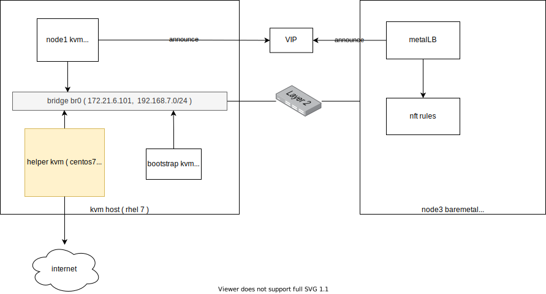

# MetalLB layer2 mode on openshift 4.8

openshift对外提供服务，默认是router的方式，里面是一个haproxy，但是默认只是支持http/https，定制一下，可以支持tcp。这种配置方法不是很直观，特别是tcp的支持也很鸡肋。

我们已经知道metalLB可以帮助service之间暴露external IP，并且通过BGP的方式广播出去，但是在PoC的时候，BGP路由器还是比较难搞，好在metalLB还提供了layer2的方式，更简单的对外暴露external IP.

本次实验部署架构图：


# 安装 MetalLB

安装MetalLB非常简单

https://metallb.universe.tf/installation/clouds/#metallb-on-openshift-ocp
```bash

mkdir -p /data/install/metallb
cd /data/install/metallb

wget https://raw.githubusercontent.com/metallb/metallb/v0.10.2/manifests/namespace.yaml
wget https://raw.githubusercontent.com/metallb/metallb/v0.10.2/manifests/metallb.yaml

sed -i '/runAsUser: 65534/d' ./metallb.yaml

oc create -f /data/install/metallb/namespace.yaml
oc adm policy add-scc-to-user privileged -n metallb-system -z speaker
oc create -f /data/install/metallb/metallb.yaml

# to restore
oc delete -f /data/install/metallb/metallb.yaml

```

# 配置 MetalLB 

```bash
# on helper
cat << EOF > /data/install/metal-bgp.yaml
apiVersion: v1
kind: ConfigMap
metadata:
  namespace: metallb-system
  name: config
data:
  config: |
    address-pools:
    - name: my-ip-space
      protocol: layer2
      addresses:
        - 192.168.7.150-192.168.7.200
EOF
oc create -f /data/install/metal-bgp.yaml

# to restore
oc delete -f /data/install/metal-bgp.yaml

```

# 创建测试应用

```bash
# back to helper vm

cat << EOF > /data/install/demo.yaml
---
apiVersion: v1
kind: Pod
metadata:
  name: test-0
  labels:
    env: test
spec:
  restartPolicy: OnFailure
  nodeSelector:
    kubernetes.io/hostname: 'master-0'
  containers:
  - name: php
    image: "quay.io/wangzheng422/php:demo.02"
---
apiVersion: v1
kind: Pod
metadata:
  name: test-1
  labels:
    env: test
spec:
  restartPolicy: OnFailure
  nodeSelector:
    kubernetes.io/hostname: 'worker-0'
  containers:
  - name: php
    image: "quay.io/wangzheng422/php:demo.02"
---
kind: Service
apiVersion: v1
metadata:
  name: demo
spec:
  type: LoadBalancer
  ports:
    - name: "http"
      protocol: TCP
      port: 80
      targetPort: 80
  selector:
    env: test
EOF
oc create -f /data/install/demo.yaml

# to restore
oc delete -f /data/install/demo.yaml

oc get all
# NAME                         READY   STATUS              RESTARTS   AGE
# pod/mypod-787d79b456-4f4xr   1/1     Running             4          4d17h
# pod/test-0                   0/1     ContainerCreating   0          4s
# pod/test-1                   1/1     Running             0          4s

# NAME                 TYPE           CLUSTER-IP      EXTERNAL-IP                            PORT(S)        AGE
# service/demo         LoadBalancer   172.30.178.14   192.168.7.150                          80:30781/TCP   4s
# service/kubernetes   ClusterIP      172.30.0.1      <none>                                 443/TCP        5d16h
# service/openshift    ExternalName   <none>          kubernetes.default.svc.cluster.local   <none>         5d16h

# NAME                    READY   UP-TO-DATE   AVAILABLE   AGE
# deployment.apps/mypod   1/1     1            1           4d17h

# NAME                               DESIRED   CURRENT   READY   AGE
# replicaset.apps/mypod-787d79b456   1         1         1       4d17h

oc get pod -o wide
# NAME                     READY   STATUS    RESTARTS   AGE     IP            NODE       NOMINATED NODE   READINESS GATES
# mypod-787d79b456-4f4xr   1/1     Running   4          4d17h   10.254.1.19   worker-0   <none>           <none>
# test-0                   1/1     Running   0          9m36s   10.254.0.74   master-0   <none>           <none>
# test-1                   1/1     Running   0          9m36s   10.254.1.65   worker-0   <none>           <none>

oc get svc/demo -o yaml
# apiVersion: v1
# kind: Service
# metadata:
#   creationTimestamp: "2021-08-31T06:39:39Z"
#   name: demo
#   namespace: default
#   resourceVersion: "2277414"
#   uid: 6f36e7a4-ee2e-4f86-802e-6053debecfb2
# spec:
#   clusterIP: 172.30.178.14
#   clusterIPs:
#   - 172.30.178.14
#   externalTrafficPolicy: Cluster
#   ipFamilies:
#   - IPv4
#   ipFamilyPolicy: SingleStack
#   ports:
#   - name: http
#     nodePort: 30781
#     port: 80
#     protocol: TCP
#     targetPort: 80
#   selector:
#     env: test
#   sessionAffinity: None
#   type: LoadBalancer
# status:
#   loadBalancer:
#     ingress:
#     - ip: 192.168.7.150

for i in {1..10}
do
   curl 192.168.7.150 && echo
done
# Hello!<br>Welcome to RedHat Developer<br>Enjoy all of the ad-free articles<br>10.254.1.65
# Hello!<br>Welcome to RedHat Developer<br>Enjoy all of the ad-free articles<br>10.254.1.65
# Hello!<br>Welcome to RedHat Developer<br>Enjoy all of the ad-free articles<br>10.254.1.65
# Hello!<br>Welcome to RedHat Developer<br>Enjoy all of the ad-free articles<br>10.254.1.65
# Hello!<br>Welcome to RedHat Developer<br>Enjoy all of the ad-free articles<br>10.254.0.74
# Hello!<br>Welcome to RedHat Developer<br>Enjoy all of the ad-free articles<br>10.254.1.65
# Hello!<br>Welcome to RedHat Developer<br>Enjoy all of the ad-free articles<br>10.254.0.74
# Hello!<br>Welcome to RedHat Developer<br>Enjoy all of the ad-free articles<br>10.254.1.65
# Hello!<br>Welcome to RedHat Developer<br>Enjoy all of the ad-free articles<br>10.254.0.74
# Hello!<br>Welcome to RedHat Developer<br>Enjoy all of the ad-free articles<br>10.254.1.65

arp -a
# ? (10.88.0.3) at 9a:b9:62:83:0f:75 [ether] on cni-podman0
# master-2.ocp4.redhat.ren (192.168.7.15) at <incomplete> on enp1s0
# ? (10.88.0.2) at 4e:de:d9:d5:f8:f1 [ether] on cni-podman0
# master-1.ocp4.redhat.ren (192.168.7.14) at <incomplete> on enp1s0
# ? (192.168.7.150) at 52:54:00:d2:ba:43 [ether] on enp1s0
# worker-1.ocp4.redhat.ren (192.168.7.17) at <incomplete> on enp1s0
# _gateway (172.21.6.254) at 00:17:94:73:12:c2 [ether] on enp1s0
# master-0.ocp4.redhat.ren (192.168.7.13) at 52:54:00:d2:ba:43 [ether] on enp1s0
# worker-0.ocp4.redhat.ren (192.168.7.16) at 90:b1:1c:44:d6:0f [ether] on enp1s0
# bootstrap.ocp4.redhat.ren (192.168.7.12) at <incomplete> on enp1s0

```
# 到worker-0上，看看 nft 规则

```bash
# go to worker-0 to analyze the nat rules
nft list ruleset | grep 192.168.7.150
                # meta l4proto tcp ip daddr 192.168.7.150  tcp dport 80 counter packets 0 bytes 0 jump KUBE-FW-CTBMGJDNUDRWEDVR

nft list ruleset | grep KUBE-FW-CTBMGJDNUDRWEDVR -A 5
#                 meta l4proto tcp ip daddr 192.168.7.150  tcp dport 80 counter packets 0 bytes 0 jump KUBE-FW-CTBMGJDNUDRWEDVR
#                 meta l4proto tcp @nh,96,16 != 2814 ip daddr 172.30.35.8  tcp dport 80 counter packets 0 bytes 0 jump KUBE-MARK-MASQ
#                 meta l4proto tcp ip daddr 172.30.35.8  tcp dport 80 counter packets 0 bytes 0 jump KUBE-SVC-T3U64PSX3UGU57NF
#                 meta l4proto tcp @nh,96,16 != 2814 ip daddr 172.30.152.93  tcp dport 80 counter packets 0 bytes 0 jump KUBE-MARK-MASQ
#                 meta l4proto tcp ip daddr 172.30.152.93  tcp dport 80 counter packets 0 bytes 0 jump KUBE-SVC-ZOXDBRX7A3I2MI4S
#                 meta l4proto tcp @nh,96,16 != 2814 ip daddr 172.30.99.142  tcp dport 8443 counter packets 0 bytes 0 jump KUBE-MARK-MASQ
# --
#         chain KUBE-FW-CTBMGJDNUDRWEDVR {
#                  counter packets 0 bytes 0 jump KUBE-MARK-MASQ
#                  counter packets 0 bytes 0 jump KUBE-SVC-CTBMGJDNUDRWEDVR
#                  counter packets 0 bytes 0 jump KUBE-MARK-DROP
#         }


nft list ruleset | grep KUBE-SVC-CTBMGJDNUDRWEDVR -A 3
#                 meta l4proto tcp ip daddr 172.30.178.14  tcp dport 80 counter packets 0 bytes 0 jump KUBE-SVC-CTBMGJDNUDRWEDVR
#                 meta l4proto tcp ip daddr 192.168.7.150  tcp dport 80 counter packets 0 bytes 0 jump KUBE-FW-CTBMGJDNUDRWEDVR
#                 meta l4proto tcp @nh,96,16 != 2814 ip daddr 172.30.35.8  tcp dport 80 counter packets 0 bytes 0 jump KUBE-MARK-MASQ
#                 meta l4proto tcp ip daddr 172.30.35.8  tcp dport 80 counter packets 0 bytes 0 jump KUBE-SVC-T3U64PSX3UGU57NF
# --
#                 meta l4proto tcp  tcp dport 30781 counter packets 0 bytes 0 jump KUBE-SVC-CTBMGJDNUDRWEDVR
#         }

#         chain KUBE-SVC-HH47JV2DWEPNMQEX {
# --
#         chain KUBE-SVC-CTBMGJDNUDRWEDVR {
#                   counter packets 0 bytes 0 jump KUBE-SEP-CGMBWTJH33MIKSJY
#                  counter packets 0 bytes 0 jump KUBE-SEP-V5VBCVCJRZSWQ4D6
#         }
# --
#                  counter packets 0 bytes 0 jump KUBE-SVC-CTBMGJDNUDRWEDVR
#                  counter packets 0 bytes 0 jump KUBE-MARK-DROP
#         }

nft list ruleset | grep KUBE-SEP-CGMBWTJH33MIKSJY -A 3
#                   counter packets 0 bytes 0 jump KUBE-SEP-CGMBWTJH33MIKSJY
#                  counter packets 0 bytes 0 jump KUBE-SEP-V5VBCVCJRZSWQ4D6
#         }

# --
#         chain KUBE-SEP-CGMBWTJH33MIKSJY {
#                 ip saddr 10.254.0.74  counter packets 0 bytes 0 jump KUBE-MARK-MASQ
#                 meta l4proto tcp   counter packets 0 bytes 0 dnat to 10.254.0.74:80
#         }

nft list ruleset | grep KUBE-SEP-V5VBCVCJRZSWQ4D6 -A 3
#                  counter packets 0 bytes 0 jump KUBE-SEP-V5VBCVCJRZSWQ4D6
#         }

#         chain KUBE-FW-CTBMGJDNUDRWEDVR {
# --
#         chain KUBE-SEP-V5VBCVCJRZSWQ4D6 {
#                 ip saddr 10.254.1.65  counter packets 0 bytes 0 jump KUBE-MARK-MASQ
#                 meta l4proto tcp   counter packets 0 bytes 0 dnat to 10.254.1.65:80
#         }


nft --handle --numeric list ruleset | grep random
                #  counter packets 0 bytes 0 masquerade  random-fully  # handle 13

```

## 看看iptables的规则

```bash
iptables -L -v -n -t nat | grep 192.168.7.150
    # 0     0 KUBE-FW-CTBMGJDNUDRWEDVR  tcp  --  *      *       0.0.0.0/0            192.168.7.150        /* default/demo:http loadbalancer IP */ tcp dpt:80

iptables -L -v -n -t nat | grep KUBE-FW-CTBMGJDNUDRWEDVR -A 5
#     0     0 KUBE-FW-CTBMGJDNUDRWEDVR  tcp  --  *      *       0.0.0.0/0            192.168.7.150        /* default/demo:http loadbalancer IP */ tcp dpt:80
#     0     0 KUBE-MARK-MASQ  tcp  --  *      *      !10.254.0.0/16        172.30.210.66        /* openshift-kube-scheduler-operator/metrics:https cluster IP */ tcp dpt:443
#     0     0 KUBE-SVC-HH47JV2DWEPNMQEX  tcp  --  *      *       0.0.0.0/0            172.30.210.66        /* openshift-kube-scheduler-operator/metrics:https cluster IP */ tcp dpt:443
#     0     0 KUBE-MARK-MASQ  tcp  --  *      *      !10.254.0.0/16        172.30.55.237        /* openshift-apiserver-operator/metrics:https cluster IP */ tcp dpt:443
#     0     0 KUBE-SVC-CIUYVLZDADCHPTYT  tcp  --  *      *       0.0.0.0/0            172.30.55.237        /* openshift-apiserver-operator/metrics:https cluster IP */ tcp dpt:443
#     0     0 KUBE-MARK-MASQ  tcp  --  *      *      !10.254.0.0/16        172.30.134.31        /* openshift-pipelines/tekton-pipelines-controller:probes cluster IP */ tcp dpt:8080
# --
# Chain KUBE-FW-CTBMGJDNUDRWEDVR (1 references)
#  pkts bytes target     prot opt in     out     source               destination
#     0     0 KUBE-MARK-MASQ  all  --  *      *       0.0.0.0/0            0.0.0.0/0            /* default/demo:http loadbalancer IP */
#     0     0 KUBE-SVC-CTBMGJDNUDRWEDVR  all  --  *      *       0.0.0.0/0            0.0.0.0/0            /* default/demo:http loadbalancer IP */
#     0     0 KUBE-MARK-DROP  all  --  *      *       0.0.0.0/0            0.0.0.0/0            /* default/demo:http loadbalancer IP */

iptables -L -v -n -t nat | grep KUBE-SVC-CTBMGJDNUDRWEDVR -A 4
#     0     0 KUBE-SVC-CTBMGJDNUDRWEDVR  tcp  --  *      *       0.0.0.0/0            172.30.178.14        /* default/demo:http cluster IP */ tcp dpt:80
#     0     0 KUBE-FW-CTBMGJDNUDRWEDVR  tcp  --  *      *       0.0.0.0/0            192.168.7.150        /* default/demo:http loadbalancer IP */ tcp dpt:80
#     0     0 KUBE-MARK-MASQ  tcp  --  *      *      !10.254.0.0/16        172.30.210.66        /* openshift-kube-scheduler-operator/metrics:https cluster IP */ tcp dpt:443
#     0     0 KUBE-SVC-HH47JV2DWEPNMQEX  tcp  --  *      *       0.0.0.0/0            172.30.210.66        /* openshift-kube-scheduler-operator/metrics:https cluster IP */ tcp dpt:443
#     0     0 KUBE-MARK-MASQ  tcp  --  *      *      !10.254.0.0/16        172.30.55.237        /* openshift-apiserver-operator/metrics:https cluster IP */ tcp dpt:443
# --
#     0     0 KUBE-SVC-CTBMGJDNUDRWEDVR  tcp  --  *      *       0.0.0.0/0            0.0.0.0/0            /* default/demo:http */ tcp dpt:30781

# Chain KUBE-SVC-HH47JV2DWEPNMQEX (1 references)
#  pkts bytes target     prot opt in     out     source               destination
#     0     0 KUBE-SEP-XIWZUKNCQE6LJCFA  all  --  *      *       0.0.0.0/0            0.0.0.0/0            /* openshift-kube-scheduler-operator/metrics:https */
# --
# Chain KUBE-SVC-CTBMGJDNUDRWEDVR (3 references)
#  pkts bytes target     prot opt in     out     source               destination
#     0     0 KUBE-SEP-CGMBWTJH33MIKSJY  all  --  *      *       0.0.0.0/0            0.0.0.0/0            /* default/demo:http */ statistic mode random probability 0.50000000000
#     0     0 KUBE-SEP-V5VBCVCJRZSWQ4D6  all  --  *      *       0.0.0.0/0            0.0.0.0/0            /* default/demo:http */

# --
#     0     0 KUBE-SVC-CTBMGJDNUDRWEDVR  all  --  *      *       0.0.0.0/0            0.0.0.0/0            /* default/demo:http loadbalancer IP */
#     0     0 KUBE-MARK-DROP  all  --  *      *       0.0.0.0/0            0.0.0.0/0            /* default/demo:http loadbalancer IP */

# Chain KUBE-SEP-V5VBCVCJRZSWQ4D6 (1 references)
#  pkts bytes target     prot opt in     out     source               destination

iptables -L -v -n -t nat | grep KUBE-SEP-CGMBWTJH33MIKSJY -A 3
#     0     0 KUBE-SEP-CGMBWTJH33MIKSJY  all  --  *      *       0.0.0.0/0            0.0.0.0/0            /* default/demo:http */ statistic mode random probability 0.50000000000
#     0     0 KUBE-SEP-V5VBCVCJRZSWQ4D6  all  --  *      *       0.0.0.0/0            0.0.0.0/0            /* default/demo:http */

# Chain KUBE-FW-CTBMGJDNUDRWEDVR (1 references)
# --
# Chain KUBE-SEP-CGMBWTJH33MIKSJY (1 references)
#  pkts bytes target     prot opt in     out     source               destination
#     0     0 KUBE-MARK-MASQ  all  --  *      *       10.254.0.74          0.0.0.0/0            /* default/demo:http */
#     0     0 DNAT       tcp  --  *      *       0.0.0.0/0            0.0.0.0/0            /* default/demo:http */ tcp to:10.254.0.74:80

iptables -L -v -n -t nat | grep KUBE-SEP-V5VBCVCJRZSWQ4D6 -A 3
#     0     0 KUBE-SEP-V5VBCVCJRZSWQ4D6  all  --  *      *       0.0.0.0/0            0.0.0.0/0            /* default/demo:http */

# Chain KUBE-FW-CTBMGJDNUDRWEDVR (1 references)
#  pkts bytes target     prot opt in     out     source               destination
# --
# Chain KUBE-SEP-V5VBCVCJRZSWQ4D6 (1 references)
#  pkts bytes target     prot opt in     out     source               destination
#     0     0 KUBE-MARK-MASQ  all  --  *      *       10.254.1.65          0.0.0.0/0            /* default/demo:http */
#     0     0 DNAT       tcp  --  *      *       0.0.0.0/0            0.0.0.0/0            /* default/demo:http */ tcp to:10.254.1.65:80


```