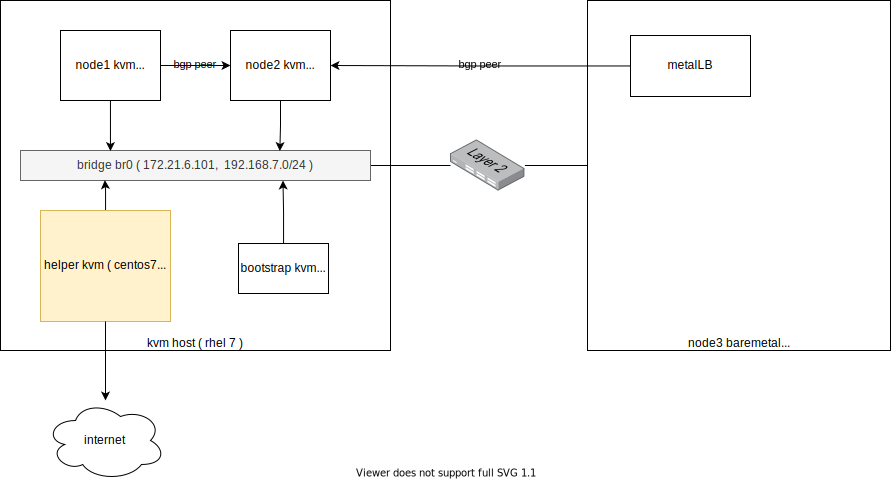
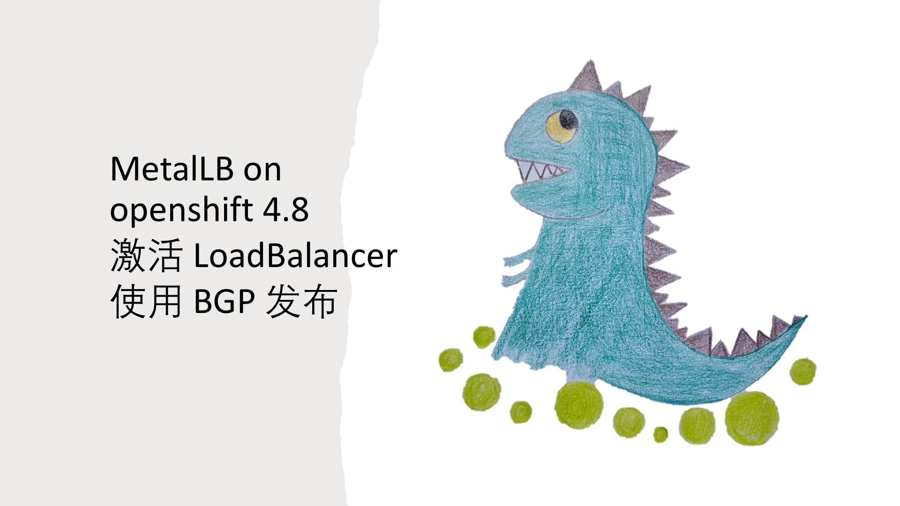

# MetalLB on openshift 4.8

openshift对外提供服务，默认是router的方式，里面是一个haproxy，但是默认只是支持http/https，定制一下，可以支持tcp。这种配置方法不是很直观，特别是tcp的支持也很鸡肋。我们希望的方式，是k8s service直接暴露一个对外服务ip，并且通过bgp广播出去。今天，我们就看看metalLB项目如何帮助我们达到这个目的。

本次实验部署架构图：


视频讲解:

[<kbd></kbd>](https://www.bilibili.com/video/BV1Sf4y1N7eE/)

- [bilibili](https://www.bilibili.com/video/BV1Sf4y1N7eE/)
- [youtube](https://youtu.be/AbYtdknGfv0)

# 安装 MetalLB

安装MetalLB非常简单

https://metallb.universe.tf/installation/clouds/#metallb-on-openshift-ocp
```bash

mkdir -p /data/install/metallb
cd /data/install/metallb

wget https://raw.githubusercontent.com/metallb/metallb/v0.10.2/manifests/namespace.yaml
wget https://raw.githubusercontent.com/metallb/metallb/v0.10.2/manifests/metallb.yaml

sed -i '/runAsUser: 65534/d' ./metallb.yaml

oc create -f namespace.yaml
oc adm policy add-scc-to-user privileged -n metallb-system -z speaker
oc create -f metallb.yaml
```

# 创建路由器

我们用一个 kvm 来模拟 bgp 路由器

- https://access.redhat.com/documentation/en-us/red_hat_enterprise_linux/8/html/configuring_and_managing_networking/setting-your-routing-protocols_configuring-and-managing-networking#intro-to-frr_setting-your-routing-protocols
- https://www.cisco.com/c/en/us/td/docs/ios-xml/ios/iproute_bgp/configuration/xe-16/irg-xe-16-book/bgp-dynamic-neighbors.html
- https://ipbgp.com/2018/02/07/quagga/

```bash
# to setup a router vm for testing
# go to kvm host
cd /data/kvm

wget https://raw.githubusercontent.com/wangzheng422/docker_env/dev/redhat/ocp4/4.8/scripts/helper-ks-rocky.cfg

sed -i '0,/^network.*/s/^network.*/network  --bootproto=static --device=enp1s0 --gateway=172.21.6.254 --ip=172.21.6.10  --netmask=255.255.255.0 --nameserver=172.21.1.1  --ipv6=auto --activate/' helper-ks-rocky.cfg

sed -i '0,/^network  --hostname.*/s/^network  --hostname.*/network  --hostname=bgp-router/' helper-ks-rocky.cfg

virt-install --name="bgp-router" --vcpus=2 --ram=2048 \
--cpu=host-model \
--disk path=/data/nvme/bgp-router.qcow2,bus=virtio,size=30 \
--os-variant rhel8.4 --network bridge=baremetal,model=virtio \
--graphics vnc,port=49000 \
--boot menu=on --location /data/kvm/Rocky-8.4-x86_64-minimal.iso \
--initrd-inject helper-ks-rocky.cfg --extra-args "inst.ks=file:/helper-ks-rocky.cfg" 

# in the bgp-router vm
nmcli con mod enp1s0 +ipv4.addresses "192.168.7.10/24"
nmcli con up enp1s0

systemctl disable --now firewalld

dnf install -y frr

sed -i 's/bgpd=no/bgpd=yes/g' /etc/frr/daemons
systemctl enable --now frr

# 进入路由器配置界面
vtysh
# 以下是 bgp 路由器配置
router bgp 64512
 neighbor metallb peer-group
 neighbor metallb remote-as 64512
 bgp listen limit 200
 bgp listen range 192.168.7.0/24 peer-group metallb
```
# 配置 MetalLB 和 bgp-router 进行配对

```bash
# on helper
cat << EOF > /data/install/metal-bgp.yaml
apiVersion: v1
kind: ConfigMap
metadata:
  namespace: metallb-system
  name: config
data:
  config: |
    peers:
    - my-asn: 64512
      peer-asn: 64512
      peer-address: 192.168.7.10
    address-pools:
    - name: my-ip-space
      protocol: bgp
      avoid-buggy-ips: true
      addresses:
      - 198.51.100.0/24
EOF
oc create -f /data/install/metal-bgp.yaml

# to restore
oc delete -f /data/install/metal-bgp.yaml
```
# 回到 bgp-router 看看路由情况
```
# back to bgp-router vm
vtysh

bgp-router# show ip bgp summary

IPv4 Unicast Summary:
BGP router identifier 192.168.7.10, local AS number 64512 vrf-id 0
BGP table version 0
RIB entries 0, using 0 bytes of memory
Peers 2, using 43 KiB of memory
Peer groups 1, using 64 bytes of memory

Neighbor        V         AS   MsgRcvd   MsgSent   TblVer  InQ OutQ  Up/Down State/PfxRcd   PfxSnt
*192.168.7.13   4      64512         2         2        0    0    0 00:00:25            0        0
*192.168.7.16   4      64512         2         2        0    0    0 00:00:25            0        0

Total number of neighbors 2
* - dynamic neighbor
2 dynamic neighbor(s), limit 200
```
我们看到，集群里面的2个node，分别和路由器建立的peer关系。

# 创建测试应用

```bash
# back to helper vm

cat << EOF > /data/install/demo.yaml
---
apiVersion: v1
kind: Pod
metadata:
  name: test-0
  labels:
    env: test
spec:
  restartPolicy: OnFailure
  nodeSelector:
    kubernetes.io/hostname: 'master-0'
  containers:
  - name: php
    image: "quay.io/wangzheng422/php:demo.02"
---
apiVersion: v1
kind: Pod
metadata:
  name: test-1
  labels:
    env: test
spec:
  restartPolicy: OnFailure
  nodeSelector:
    kubernetes.io/hostname: 'worker-0'
  containers:
  - name: php
    image: "quay.io/wangzheng422/php:demo.02"
---
kind: Service
apiVersion: v1
metadata:
  name: demo
spec:
  type: LoadBalancer
  ports:
    - name: "http"
      protocol: TCP
      port: 80
      targetPort: 80
  selector:
    env: test
EOF
oc create -f /data/install/demo.yaml

oc delete -f /data/install/demo.yaml

oc get all
# NAME                         READY   STATUS    RESTARTS   AGE
# pod/mypod-787d79b456-4f4xr   1/1     Running   3          3d23h
# pod/test-0                   1/1     Running   0          2m28s
# pod/test-1                   1/1     Running   0          2m28s

# NAME                 TYPE           CLUSTER-IP     EXTERNAL-IP                            PORT(S)        AGE
# service/demo         LoadBalancer   172.30.82.87   198.51.100.1                           80:32203/TCP   2m28s
# service/kubernetes   ClusterIP      172.30.0.1     <none>                                 443/TCP        4d22h
# service/openshift    ExternalName   <none>         kubernetes.default.svc.cluster.local   <none>         4d22h

# NAME                    READY   UP-TO-DATE   AVAILABLE   AGE
# deployment.apps/mypod   1/1     1            1           3d23h

# NAME                               DESIRED   CURRENT   READY   AGE
# replicaset.apps/mypod-787d79b456   1         1         1       3d23h

oc get pod -o wide
# NAME                     READY   STATUS    RESTARTS   AGE     IP             NODE       NOMINATED NODE   READINESS GATES
# mypod-787d79b456-4f4xr   1/1     Running   3          4d      10.254.1.2     worker-0   <none>           <none>
# test-0                   1/1     Running   0          8m38s   10.254.0.66    master-0   <none>           <none>
# test-1                   1/1     Running   0          8m38s   10.254.1.230   worker-0   <none>           <none>

oc get svc/demo -o yaml
# apiVersion: v1
# kind: Service
# metadata:
#   creationTimestamp: "2021-08-30T12:42:21Z"
#   name: demo
#   namespace: default
#   resourceVersion: "2046159"
#   uid: 1af07435-5234-4062-994d-4715453118c6
# spec:
#   clusterIP: 172.30.82.87
#   clusterIPs:
#   - 172.30.82.87
#   externalTrafficPolicy: Cluster
#   ipFamilies:
#   - IPv4
#   ipFamilyPolicy: SingleStack
#   ports:
#   - name: http
#     nodePort: 32203
#     port: 80
#     protocol: TCP
#     targetPort: 80
#   selector:
#     env: test
#   sessionAffinity: None
#   type: LoadBalancer
# status:
#   loadBalancer:
#     ingress:
#     - ip: 198.51.100.1
```
# 回到 bgp-router 看看路由更新情况

```
# back to bgp-router

bgp-router# show ip bgp summary

IPv4 Unicast Summary:
BGP router identifier 192.168.7.10, local AS number 64512 vrf-id 0
BGP table version 1
RIB entries 1, using 192 bytes of memory
Peers 2, using 43 KiB of memory
Peer groups 1, using 64 bytes of memory

Neighbor        V         AS   MsgRcvd   MsgSent   TblVer  InQ OutQ  Up/Down State/PfxRcd   PfxSnt
*192.168.7.13   4      64512        73        72        0    0    0 00:35:16            1        0
*192.168.7.16   4      64512        73        72        0    0    0 00:35:16            1        0

Total number of neighbors 2
* - dynamic neighbor
2 dynamic neighbor(s), limit 200

bgp-router# show ip bgp neighbors 192.168.7.13 routes
BGP table version is 1, local router ID is 192.168.7.10, vrf id 0
Default local pref 100, local AS 64512
Status codes:  s suppressed, d damped, h history, * valid, > best, = multipath,
               i internal, r RIB-failure, S Stale, R Removed
Nexthop codes: @NNN nexthop's vrf id, < announce-nh-self
Origin codes:  i - IGP, e - EGP, ? - incomplete

   Network          Next Hop            Metric LocPrf Weight Path
*>i198.51.100.1/32  192.168.7.13                    0      0 ?

Displayed  1 routes and 2 total paths
bgp-router#
bgp-router# show ip bgp neighbors 192.168.7.16 routes
BGP table version is 1, local router ID is 192.168.7.10, vrf id 0
Default local pref 100, local AS 64512
Status codes:  s suppressed, d damped, h history, * valid, > best, = multipath,
               i internal, r RIB-failure, S Stale, R Removed
Nexthop codes: @NNN nexthop's vrf id, < announce-nh-self
Origin codes:  i - IGP, e - EGP, ? - incomplete

   Network          Next Hop            Metric LocPrf Weight Path
*=i198.51.100.1/32  192.168.7.16                    0      0 ?

Displayed  1 routes and 2 total paths
```
在路由器的shell界面上看看
```bash
ip r
# default via 172.21.6.254 dev enp1s0 proto static metric 100
# 172.21.6.0/24 dev enp1s0 proto kernel scope link src 172.21.6.10 metric 100
# 192.168.7.0/24 dev enp1s0 proto kernel scope link src 192.168.7.10 metric 100
# 198.51.100.1 proto bgp metric 20
#         nexthop via 192.168.7.13 dev enp1s0 weight 1
#         nexthop via 192.168.7.16 dev enp1s0 weight 1

[root@bgp-router ~]# curl 198.51.100.1 && echo
Hello!<br>Welcome to RedHat Developer<br>Enjoy all of the ad-free articles<br>10.254.0.66
[root@bgp-router ~]# curl 198.51.100.1 && echo
Hello!<br>Welcome to RedHat Developer<br>Enjoy all of the ad-free articles<br>10.254.0.66
[root@bgp-router ~]# curl 198.51.100.1 && echo
Hello!<br>Welcome to RedHat Developer<br>Enjoy all of the ad-free articles<br>10.254.0.66
[root@bgp-router ~]# curl 198.51.100.1 && echo
Hello!<br>Welcome to RedHat Developer<br>Enjoy all of the ad-free articles<br>10.254.0.66
[root@bgp-router ~]# curl 198.51.100.1 && echo
Hello!<br>Welcome to RedHat Developer<br>Enjoy all of the ad-free articles<br>10.254.1.230
[root@bgp-router ~]# curl 198.51.100.1 && echo
Hello!<br>Welcome to RedHat Developer<br>Enjoy all of the ad-free articles<br>10.254.0.66
[root@bgp-router ~]# curl 198.51.100.1 && echo
Hello!<br>Welcome to RedHat Developer<br>Enjoy all of the ad-free articles<br>10.254.0.66
[root@bgp-router ~]# curl 198.51.100.1 && echo
Hello!<br>Welcome to RedHat Developer<br>Enjoy all of the ad-free articles<br>10.254.0.66
[root@bgp-router ~]# curl 198.51.100.1 && echo
Hello!<br>Welcome to RedHat Developer<br>Enjoy all of the ad-free articles<br>10.254.1.230
[root@bgp-router ~]# curl 198.51.100.1 && echo
Hello!<br>Welcome to RedHat Developer<br>Enjoy all of the ad-free articles<br>10.254.0.66
```
# 到worker-0上，看看 nft 规则

```bash
# go to worker-0 to analyze the nat rules
nft list ruleset | grep 198.51
                # meta l4proto tcp ip daddr 198.51.100.1  tcp dport 80 counter packets 0 bytes 0 jump KUBE-FW-CTBMGJDNUDRWEDVR

nft list ruleset | grep KUBE-FW-CTBMGJDNUDRWEDVR -A 5
#                 meta l4proto tcp ip daddr 198.51.100.1  tcp dport 80 counter packets 0 bytes 0 jump KUBE-FW-CTBMGJDNUDRWEDVR
#                 meta l4proto tcp @nh,96,16 != 2814 ip daddr 172.30.145.124  tcp dport 443 counter packets 0 bytes 0 jump KUBE-MARK-MASQ
#                 meta l4proto tcp ip daddr 172.30.145.124  tcp dport 443 counter packets 0 bytes 0 jump KUBE-SVC-L54HVQEJKTL2PXFK
#                 meta l4proto tcp @nh,96,16 != 2814 ip daddr 172.30.16.253  tcp dport 8443 counter packets 0 bytes 0 jump KUBE-MARK-MASQ
#                 meta l4proto tcp ip daddr 172.30.16.253  tcp dport 8443 counter packets 0 bytes 0 jump KUBE-SVC-YVQ2VVJT4ABSS56R
#                 meta l4proto tcp @nh,96,16 != 2814 ip daddr 172.30.185.119  tcp dport 9091 counter packets 0 bytes 0 jump KUBE-MARK-MASQ
# --
#         chain KUBE-FW-CTBMGJDNUDRWEDVR {
#                  counter packets 0 bytes 0 jump KUBE-MARK-MASQ
#                  counter packets 0 bytes 0 jump KUBE-SVC-CTBMGJDNUDRWEDVR
#                  counter packets 0 bytes 0 jump KUBE-MARK-DROP
#         }


nft list ruleset | grep KUBE-SVC-CTBMGJDNUDRWEDVR -A 3
#                 meta l4proto tcp ip daddr 172.30.82.87  tcp dport 80 counter packets 0 bytes 0 jump KUBE-SVC-CTBMGJDNUDRWEDVR
#                 meta l4proto tcp ip daddr 198.51.100.1  tcp dport 80 counter packets 11 bytes 660 jump KUBE-FW-CTBMGJDNUDRWEDVR
#                 meta l4proto tcp @nh,96,16 != 2814 ip daddr 172.30.145.124  tcp dport 443 counter packets 0 bytes 0 jump KUBE-MARK-MASQ
#                 meta l4proto tcp ip daddr 172.30.145.124  tcp dport 443 counter packets 0 bytes 0 jump KUBE-SVC-L54HVQEJKTL2PXFK
# --
#                 meta l4proto tcp  tcp dport 32203 counter packets 0 bytes 0 jump KUBE-SVC-CTBMGJDNUDRWEDVR
#         }

#         chain KUBE-SVC-DCLNKYLNAMROIJRV {
# --
#         chain KUBE-SVC-CTBMGJDNUDRWEDVR {
#                   counter packets 9 bytes 540 jump KUBE-SEP-BKD3LMWAJNKW5GNU
#                  counter packets 2 bytes 120 jump KUBE-SEP-M5WVBCWAFJ2J2M2U
#         }
# --
#                  counter packets 11 bytes 660 jump KUBE-SVC-CTBMGJDNUDRWEDVR
#                  counter packets 0 bytes 0 jump KUBE-MARK-DROP
#         }

nft list ruleset | grep KUBE-SEP-BKD3LMWAJNKW5GNU -A 3
#                   counter packets 9 bytes 540 jump KUBE-SEP-BKD3LMWAJNKW5GNU
#                  counter packets 2 bytes 120 jump KUBE-SEP-M5WVBCWAFJ2J2M2U
#         }

# --
#         chain KUBE-SEP-BKD3LMWAJNKW5GNU {
#                 ip saddr 10.254.0.66  counter packets 0 bytes 0 jump KUBE-MARK-MASQ
#                 meta l4proto tcp   counter packets 9 bytes 540 dnat to 10.254.0.66:80
#         }

nft list ruleset | grep KUBE-SEP-M5WVBCWAFJ2J2M2U -A 3
#                  counter packets 2 bytes 120 jump KUBE-SEP-M5WVBCWAFJ2J2M2U
#         }

#         chain KUBE-FW-CTBMGJDNUDRWEDVR {
# --
#         chain KUBE-SEP-M5WVBCWAFJ2J2M2U {
#                 ip saddr 10.254.1.230  counter packets 0 bytes 0 jump KUBE-MARK-MASQ
#                 meta l4proto tcp   counter packets 2 bytes 120 dnat to 10.254.1.230:80
#         }

```