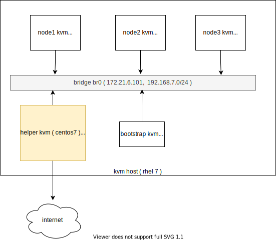
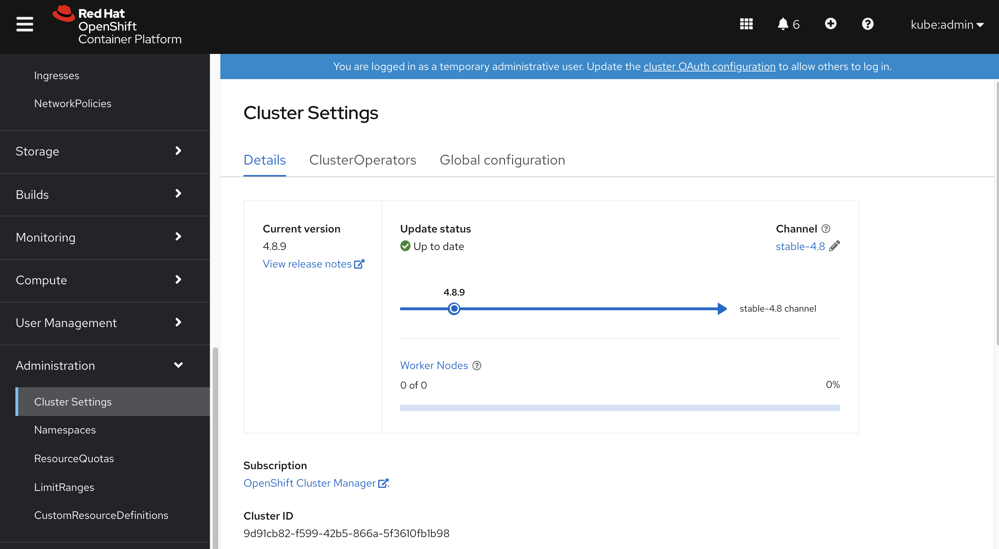

# openshift4 离线升级服务 / disconnected update service

openshift4默认的集群管理界面，会向公网的升级服务请求升级信息，如果在离线安装的情况，这个升级信息是拿不到的，于是集群的管理界面就会一堆报错，很难看。现在openshift4有一个update server operator，这个可以在集群内部创建一个离线的update server，提供升级信息，这样集群的管理界面就不会那么难看啦。

本次实验的部署架构：



based on: https://www.openshift.com/blog/openshift-update-service-update-manager-for-your-cluster

https://docs.openshift.com/container-platform/4.8/updating/installing-update-service.html

离线安装以后，不配置的话，系统管理页面是这个鬼样子：


```bash
# search OpenShift Update Service in operator hub, and install

# build a update container
mkdir -p /data/update
cd /data/update
cat << EOF > /data/update/Dockerfile
FROM registry.access.redhat.com/ubi8

RUN curl -L -o cincinnati-graph-data.tar.gz https://github.com/openshift/cincinnati-graph-data/archive/master.tar.gz

CMD exec /bin/bash -c "tar xvzf cincinnati-graph-data.tar.gz -C /var/lib/cincinnati/graph-data/ --strip-components=1"
EOF

var_date=$(date '+%Y-%m-%d-%H%M')
echo $var_date

buildah bud -f ./Dockerfile -t quay.io/wangzheng422/graph-data-image:$var_date
podman push quay.io/wangzheng422/graph-data-image:$var_date

echo quay.io/wangzheng422/graph-data-image:$var_date
# quay.io/wangzheng422/graph-data-image:2021-09-07-0709

cat << EOF > /data/install/update.yaml
apiVersion: updateservice.operator.openshift.io/v1
kind: UpdateService
metadata:
  namespace: openshift-update-service
  name: sample
spec:
  graphDataImage: 'nexus.ocp4.redhat.ren:8083/wangzheng422/graph-data-image:2021-09-07-0709'
  releases: 'registry.ocp4.redhat.ren:5443/ocp4/release'
  replicas: 1
EOF
oc create -f /data/install/update.yaml

# to restore
oc delete -f /data/install/update.yaml

# 部署完了update service 以后，发现报错
# 发现update service operator依赖有password的registry
# 我们之前默认安装的registry是没有密码的，就不行
# 所以重新部署一个需要密码认证的registry就可以了。

oc get secret/pull-secret -n openshift-config -o json | jq '.data.".dockerconfigjson"' | jq -r . | base64 -d | jq .
# {
#   "auths": {
#     "registry.ocp4.redhat.ren:5443": {
#       "username": "admin",
#       "password": "redhat",
#       "auth": "YWRtaW46cmVkaGF0",
#       "email": "admin@redhat.ren"
#     }
#   }
# }

oc delete cm ca.for.registry -n openshift-config
oc create configmap ca.for.registry -n openshift-config \
    --from-file=registry.ocp4.redhat.ren..5443=/etc/crts/redhat.ren.ca.crt \
    --from-file=updateservice-registry=/etc/crts/redhat.ren.ca.crt

oc patch image.config.openshift.io/cluster -p '{"spec":{"additionalTrustedCA":{"name":"ca.for.registry"}}}'  --type=merge

# oc patch image.config.openshift.io/cluster -p '{"spec":{"additionalTrustedCA":{"name":"ca.for.registry"}}}'  --type=merge

# our router's https certs is self-sign, 
# update service will report error on this certs
# so we create a http route, to avoid this error
cat << EOF > /data/install/update-wzh-route.yaml
kind: Route
apiVersion: route.openshift.io/v1
metadata:
  name: update-wzh
  namespace: openshift-update-service
  labels:
    app: sample-policy-engine
spec:
  to:
    kind: Service
    name: sample-policy-engine
    weight: 100
  port:
    targetPort: policy-engine
EOF
oc create -f /data/install/update-wzh-route.yaml

oc patch clusterversion version --type='json' -p='[{"op": "replace", "path": "/spec/upstream", "value": "http://update-wzh-openshift-update-service.apps.ocp4.redhat.ren/api/upgrades_info/v1/graph"}]'

oc get clusterversion version -o yaml | more

```
可以在operator的图形界面中，配置离线的update service参数


离线update service配置好了以后，看上去就非常舒适了。


