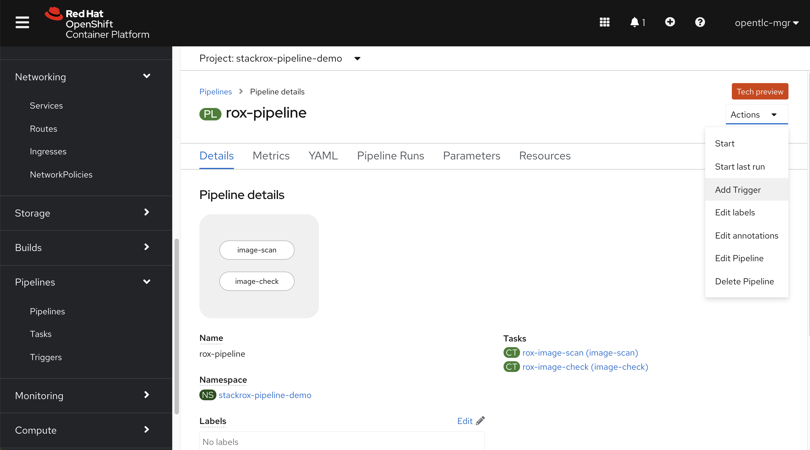
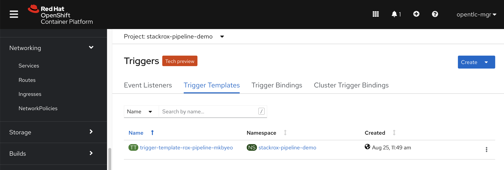
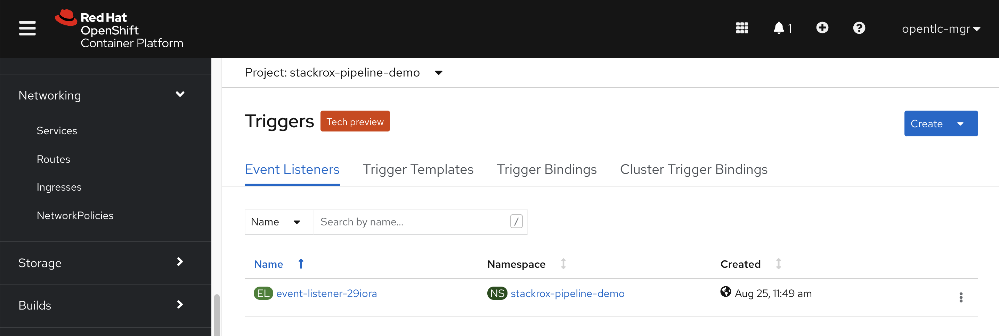
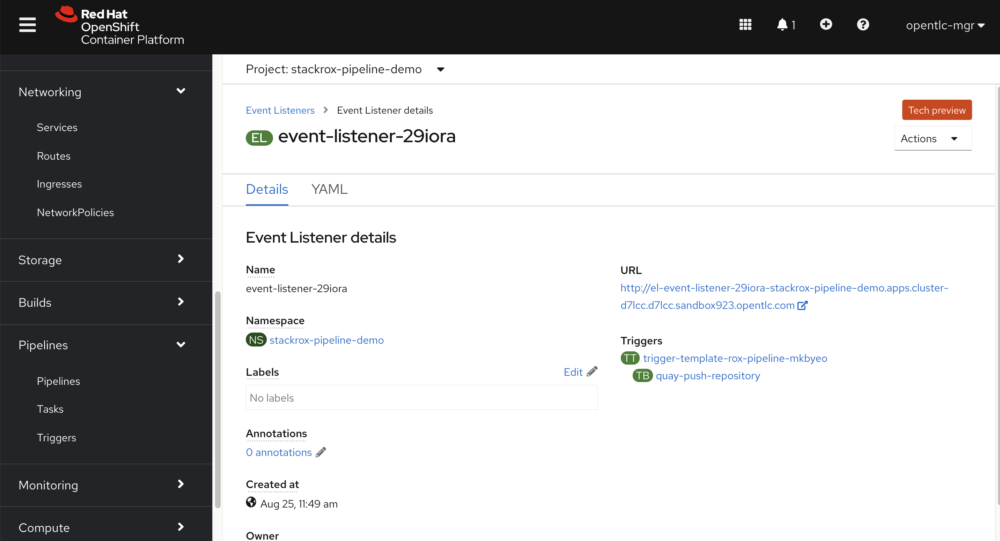
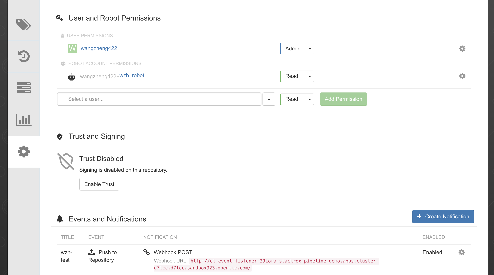

# RHACS

https://cloud.redhat.com/blog/keep-your-applications-secure-with-automatic-rebuilds

First, create a trigger binding, which will parse the quay push notification
```yaml
apiVersion: triggers.tekton.dev/v1alpha1
kind: TriggerBinding
metadata:
  name: quay-push-repository
  namespace: stackrox-pipeline-demo
spec:
  params:
    - name: repository_name
      value: $(body.name)
    - name: repository
      value: $(body.repository)
    - name: repository_namespace
      value: $(body.namespace)
    - name: repository_url
      value: $(body.docker_url)
    - name: repository_homepage
      value: $(body.homepage)
    - name: repository_updated_tag
      value: '$(body.updated_tags[0])'
```

Then, based on existed pipeline, create trigger


Then, fill in the provider, which is quay push notification we created, and fill in the pipeline parameters, in our case, it is image name and tags.


Then you can see the trigger template created automatically

```yaml
apiVersion: triggers.tekton.dev/v1alpha1
kind: TriggerTemplate
metadata:
  name: trigger-template-rox-pipeline-mkbyeo
  namespace: stackrox-pipeline-demo
spec:
  params:
    - name: repository_name
    - name: repository
    - name: repository_namespace
    - name: repository_url
    - name: repository_homepage
    - name: repository_updated_tag
  resourcetemplates:
    - apiVersion: tekton.dev/v1beta1
      kind: PipelineRun
      metadata:
        generateName: rox-pipeline-
        labels:
          tekton.dev/pipeline: rox-pipeline
        namespace: stackrox-pipeline-demo
      spec:
        params:
          - name: image
            value: '$(tt.params.repository_url):$(tt.params.repository_updated_tag)'
        pipelineRef:
          name: rox-pipeline
```

And the event Listerner created

```yaml
apiVersion: triggers.tekton.dev/v1alpha1
kind: EventListener
metadata:
  name: event-listener-29iora
  namespace: stackrox-pipeline-demo
spec:
  serviceAccountName: pipeline
  triggers:
    - bindings:
        - kind: TriggerBinding
          ref: quay-push-repository
      template:
        name: trigger-template-rox-pipeline-mkbyeo
```

And you can get the callback URL from event listern detail


service created
```yaml
kind: Service
apiVersion: v1
metadata:
  name: el-event-listener-29iora
  namespace: stackrox-pipeline-demo
  labels:
    app.kubernetes.io/managed-by: EventListener
    app.kubernetes.io/part-of: Triggers
    eventlistener: event-listener-29iora
spec:
  ports:
    - name: listener
      protocol: TCP
      port: 8080
      targetPort: 8080
  selector:
    app.kubernetes.io/managed-by: EventListener
    app.kubernetes.io/part-of: Triggers
    eventlistener: event-listener-29iora
  clusterIP: 172.30.25.250
  clusterIPs:
    - 172.30.25.250
  type: ClusterIP
  sessionAffinity: None
```

route created
```yaml
kind: Route
apiVersion: route.openshift.io/v1
metadata:
  name: el-event-listener-29iora
  namespace: stackrox-pipeline-demo
  labels:
    app.kubernetes.io/managed-by: EventListener
    app.kubernetes.io/part-of: Triggers
    eventlistener: event-listener-29iora
spec:
  host: >-
    el-event-listener-29iora-stackrox-pipeline-demo.apps.cluster-d7lcc.d7lcc.sandbox923.opentlc.com
  to:
    kind: Service
    name: el-event-listener-29iora
    weight: 100
  port:
    targetPort: 8080
  wildcardPolicy: None
```

on quay.io, create a notification in repo, with "Push to Repository" trigger


build and push a docker image to try out
```bash
mkdir -p /data
cd /data

cat << EOF > /data/rox.Dockerfile
FROM registry.access.redhat.com/ubi8/ubi-minimal
ADD https://raw.githubusercontent.com/wangzheng422/docker_env/master/README.md /wzh
EOF

buildah bud -t quay.io/wangzheng422/qimgs:rox -f rox.Dockerfile ./

buildah push quay.io/wangzheng422/qimgs:rox


```