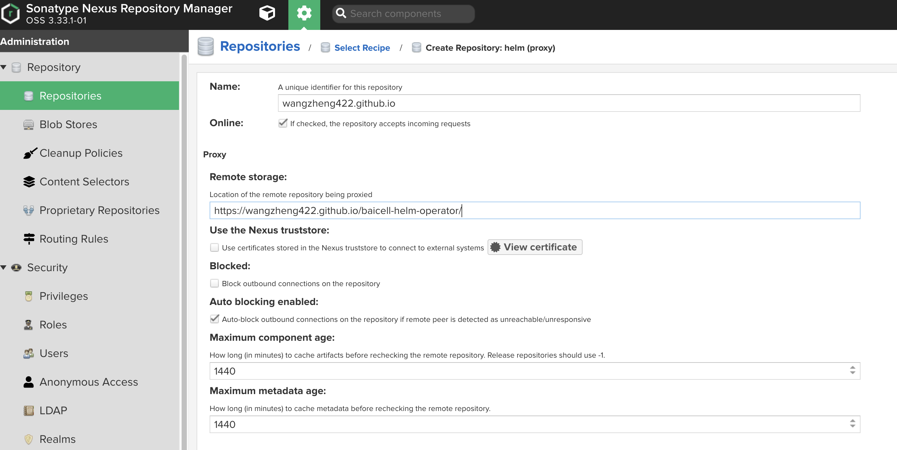

# 应用容器化步骤

# 需求

- [x] 支持实时操作系统，并支持自定义kernel参数
  - [x] 配置过程和成果，在[单独的文章中](https://github.com/wangzheng422/docker_env/blob/dev/redhat/ocp4/4.9/4.9.real-time.kernel.baicell.md)
- [x] 支持单节点openshift，并支持实时操作系统
  - [x] 单节点openshift离线部署，在[单独的文章中](https://github.com/wangzheng422/docker_env/blob/dev/redhat/ocp4/4.9/4.9.sno.for.baicell.md)
  - [x] 单节点激活实时操作系统，在[单独的文章中](https://github.com/wangzheng422/docker_env/blob/dev/redhat/ocp4/4.9/4.9.real-time.kernel.baicell.sno.md)
- [x] license使用容器化的方式注入
- [x] service 用 host port + ocp router的方式暴露
- [x] 容器启动后，自动加载基站进程
  - [x] 使用systemd的方式启动
- [x] fpga driver使用容器化方式加载
- [x] 基础镜像梳理
  - [ ] 是否支持 rhel8/centos8 ? 
- [x] helm chart/operator方式部署
  - [x] 本文中记录了开发过程，代码和成果在[单独的项目中](https://github.com/wangzheng422/baicell-helm-operator)。

## 分析

前2个需求，可以做成一个，容器启动自动加载，用systemd，改一版镜像。最后面的那个加载fgpa driver的，单独做一个

# license, serivce, route

## configmap way
```bash
# license file 加载到config map中
oc create configmap license.for.baicell  \
    --from-file=license=./3496531EC238AD91DED6DBA5BD6B.lic

# to updated config map
oc create configmap license.for.baicell --from-file=license=./3496531EC238AD91DED6DBA5BD6B.lic -o yaml --dry-run=client | oc apply -f -

cat << EOF > /data/install/vbbu.yaml
---

apiVersion: "k8s.cni.cncf.io/v1"
kind: NetworkAttachmentDefinition
metadata:
  name: host-device-du
spec:
  config: '{
    "cniVersion": "0.3.0",
    "type": "host-device",
    "device": "xeth",
    "ipam": {
      "type": "host-local",
      "subnet": "192.168.160.0/24",
      "gateway": "192.168.160.254",
      "rangeStart": "192.168.160.1",
      "rangeEnd": "192.168.160.1"
    }
  }'


---

apiVersion: "k8s.cni.cncf.io/v1"
kind: NetworkAttachmentDefinition
metadata:
  name: host-device-du-ens
spec:
  config: '{
    "cniVersion": "0.3.0",
    "type": "host-device",
    "device": "enp103s0f0",
    "ipam": {
      "type": "host-local",
      "subnet": "192.168.12.0/24",
      "rangeStart": "192.168.12.105",
      "rangeEnd": "192.168.12.106"
    }
  }'


---
apiVersion: apps/v1
kind: Deployment
metadata:
  name: du-deployment1
  labels:
    app: du-deployment1
spec:
  replicas: 1
  selector:
    matchLabels:
      app: du-pod1
  template:
    metadata:
      labels:
        app: du-pod1
      annotations:
        k8s.v1.cni.cncf.io/networks: '[
          { "name": "host-device-du-ens",
            "interface": "veth11" },
          { "name": "host-device-du",
            "interface": "xeth" }
          ]'
      cpu-load-balancing.crio.io: "true"
    spec:
      runtimeClassName: performance-wzh-performanceprofile
      containers:
      - name: du-container1
        image: "registry.ocp4.redhat.ren:5443/ocp4/du:v1-1623-wzh-01"
        imagePullPolicy: IfNotPresent
        tty: true
        stdin: true
        env:
          - name: duNetProviderDriver
            value: "host-netdevice"
        # command: ["/usr/sbin/init"]
        # - sleep
        # - infinity
        securityContext:
            privileged: true
            capabilities:
                add:
                - CAP_SYS_ADMIN
        volumeMounts:
          - mountPath: /hugepages
            name: hugepage
          - name: lib-modules
            mountPath: /lib/modules
          - name: src
            mountPath: /usr/src
          - name: dev
            mountPath: /dev
          - name: cache-volume
            mountPath: /dev/shm
          - name: license-volume
            mountPath: /baicell/lic
        resources:
          requests:
            cpu: 14
            memory: 64Gi
            hugepages-1Gi: 16Gi
          limits:
            cpu: 14
            memory: 64Gi
            hugepages-1Gi: 16Gi
      volumes:
        - name: hugepage
          emptyDir:
            medium: HugePages
        - name: lib-modules
          hostPath:
            path: /lib/modules
        - name: src
          hostPath:
            path: /usr/src
        - name: dev
          hostPath:
            path: "/dev"
        - name: cache-volume
          emptyDir:
            medium: Memory
            sizeLimit: 16Gi
        - name: license-volume
          configMap:
            name: license.for.baicell
            items:
            - key: license
              path: license.lic
      nodeSelector:
        node-role.kubernetes.io/master: ""

---

apiVersion: v1
kind: Service
metadata:
  name: du-http 
spec:
  ports:
  - name: http
    port: 80
    targetPort: 80 
    nodePort: 31071
  type: NodePort 
  selector:
    app: du-pod1

---

apiVersion: route.openshift.io/v1
kind: Route
metadata:
  name: du-http 
spec:
  port:
    targetPort: 80
  to:
    kind: Service
    name: du-http 

---

EOF

oc create -f /data/install/vbbu.yaml

# to restore
oc delete -f /data/install/vbbu.yaml

# open browser, to access vbbu console
# http://du-http-default.apps.ocp4s.redhat.ren/

# license file locates in /baicell/lic/license.lic

```

## host path

```bash

# 创建host path
cat << EOF > /data/install/host-path.yaml
---
apiVersion: machineconfiguration.openshift.io/v1
kind: MachineConfig
metadata:
  name: 50-set-selinux-for-hostpath-baicell-master
  labels:
    machineconfiguration.openshift.io/role: master
spec:
  config:
    ignition:
      version: 3.2.0
    systemd:
      units:
        - contents: |
            [Unit]
            Description=Set SELinux chcon for hostpath baicell
            Before=kubelet.service

            [Service]
            Type=oneshot
            RemainAfterExit=yes
            ExecStartPre=-mkdir -p /var/baicell
            ExecStart=chcon -h unconfined_u:object_r:container_file_t /var/baicell/

            [Install]
            WantedBy=multi-user.target
          enabled: true
          name: hostpath-baicell.service
EOF
oc create -f /data/install/host-path.yaml

# restore
oc delete -f /data/install/host-path.yaml

cat << EOF > /data/install/vbbu.yaml
---
apiVersion: "k8s.cni.cncf.io/v1"
kind: NetworkAttachmentDefinition
metadata:
  name: host-device-du
spec:
  config: '{
    "cniVersion": "0.3.0",
    "type": "host-device",
    "device": "xeth",
    "ipam": {
      "type": "host-local",
      "subnet": "192.168.160.0/24",
      "gateway": "192.168.160.254",
      "rangeStart": "192.168.160.1",
      "rangeEnd": "192.168.160.1"
    }
  }'

---
apiVersion: "k8s.cni.cncf.io/v1"
kind: NetworkAttachmentDefinition
metadata:
  name: host-device-du-ens
spec:
  config: '{
    "cniVersion": "0.3.0",
    "type": "host-device",
    "device": "enp103s0f0",
    "ipam": {
      "type": "host-local",
      "subnet": "192.168.12.0/24",
      "rangeStart": "192.168.12.105",
      "rangeEnd": "192.168.12.106"
    }
  }'

---
apiVersion: apps/v1
kind: Deployment
metadata:
  name: du-deployment1
  labels:
    app: du-deployment1
spec:
  replicas: 1
  selector:
    matchLabels:
      app: du-pod1
  template:
    metadata:
      labels:
        app: du-pod1
      annotations:
        k8s.v1.cni.cncf.io/networks: '[
          { "name": "host-device-du-ens",
            "interface": "veth11" },
          { "name": "host-device-du",
            "interface": "xeth" }
          ]'
      cpu-load-balancing.crio.io: "true"
    spec:
      runtimeClassName: performance-wzh-performanceprofile
      containers:
      - name: du-container1
        image: "registry.ocp4.redhat.ren:5443/ocp4/du:v1-1623-wzh-01"
        imagePullPolicy: IfNotPresent
        tty: true
        stdin: true
        env:
          - name: duNetProviderDriver
            value: "host-netdevice"
        # command: ["/usr/sbin/init"]
        # - sleep
        # - infinity
        securityContext:
            privileged: true
            capabilities:
                add:
                - CAP_SYS_ADMIN
        volumeMounts:
          - mountPath: /hugepages
            name: hugepage
          - name: lib-modules
            mountPath: /lib/modules
          - name: src
            mountPath: /usr/src
          - name: dev
            mountPath: /dev
          - name: cache-volume
            mountPath: /dev/shm
          # - name: license-volume
          #   mountPath: /baicell/lic
          - name: config
            mountPath: /baicell
        resources:
          requests:
            cpu: 14
            memory: 64Gi
            hugepages-1Gi: 16Gi
          limits:
            cpu: 14
            memory: 64Gi
            hugepages-1Gi: 16Gi
      volumes:
        - name: hugepage
          emptyDir:
            medium: HugePages
        - name: lib-modules
          hostPath:
            path: /lib/modules
        - name: src
          hostPath:
            path: /usr/src
        - name: config
          hostPath:
            path: /var/baicell
        - name: dev
          hostPath:
            path: "/dev"
        - name: cache-volume
          emptyDir:
            medium: Memory
            sizeLimit: 16Gi
        # - name: license-volume
        #   configMap:
        #     name: license.for.baicell
        #     items:
        #     - key: license
        #       path: license.lic
      nodeSelector:
        node-role.kubernetes.io/master: ""

---
apiVersion: v1
kind: Service
metadata:
  name: du-http 
spec:
  ports:
  - name: http
    port: 80
    targetPort: 80 
    nodePort: 31071
  type: NodePort 
  selector:
    app: du-pod1

---
apiVersion: route.openshift.io/v1
kind: Route
metadata:
  name: du-http 
spec:
  port:
    targetPort: 80
  to:
    kind: Service
    name: du-http 

EOF

oc create -f /data/install/vbbu.yaml

# to restore
oc delete -f /data/install/vbbu.yaml

```

# 自动加载程序

/home/BaiBBU_XSS/tools/BBU start

## poc demo

```bash
mkdir -p /data/systemd

cd /data/systemd
cat << EOF > service.sh
#!/bin/bash

tail -f /dev/null &

EOF
cat << EOF > vbbu.service
[Unit]
Description=vBBU Server
After=network.target

[Service]
Type=forking
User=root
# WorkingDirectory=/home/BaiBBU_XSS/tools/
# ExecStart=/home/BaiBBU_XSS/tools/BBU start
WorkingDirectory=/root/
ExecStart=/service.sh

[Install]
WantedBy=multi-user.target
EOF

cat << EOF > ./vbbu.dockerfile
FROM docker.io/rockylinux/rockylinux:8

USER root
COPY service.sh /service.sh
RUN chmod +x /service.sh
COPY vbbu.service /etc/systemd/system/vbbu.service

RUN systemctl enable vbbu.service

entrypoint ["/usr/sbin/init"]
EOF

buildah bud -t quay.io/wangzheng422/qimgs:systemd -f vbbu.dockerfile .

podman run --rm -it quay.io/wangzheng422/qimgs:systemd

```

## for baicell

```bash

mkdir -p /data/wzh/systemd

cd /data/wzh/systemd
cat << EOF > vbbu.service
[Unit]
Description=vBBU Server
After=network.target

[Service]
Type=forking
User=root
WorkingDirectory=/home/BaiBBU_XSS/tools/
ExecStart=/home/BaiBBU_XSS/tools/BBU start

[Install]
WantedBy=multi-user.target
EOF

cat << EOF > ./vbbu.dockerfile
FROM registry.ocp4.redhat.ren:5443/ocp4/du:v1-1623

USER root
COPY vbbu.service /etc/systemd/system/vbbu.service
RUN systemctl enable vbbu.service

entrypoint ["/usr/sbin/init"]
EOF

buildah bud -t registry.ocp4.redhat.ren:5443/ocp4/du:v1-1623-wzh-01 -f vbbu.dockerfile .
buildah push registry.ocp4.redhat.ren:5443/ocp4/du:v1-1623-wzh-01

```

# fpga driver

- https://stackoverflow.com/questions/55291850/kubernetes-how-to-copy-a-cfg-file-into-container-before-contaner-running
- https://access.redhat.com/solutions/4929021

```bash

mkdir -p /data/wzh/fpga
cd /data/wzh/fpga

cat << 'EOF' > ./ocp4.install.sh
#!/bin/bash

echo Creating Device Node
if ! [ -e /host/dev/nr_cdev0 ]
then
    mknod /host/dev/nr_cdev0 c 200 0
fi
if ! [ -e /host/dev/nr_cdev1 ]
then
    mknod /host/dev/nr_cdev1 c 201 0
fi
if ! [ -d /host/etc/nr ]
then
    mkdir /host/etc/nr
fi

if  chroot /host lsmod  | grep nr_drv > /dev/null 2>&1
then
    echo NR Driver Module had loaded!
else
    echo Inserting NR Driver Module
    chroot /host rmmod nr_drv > /dev/null 2>&1

    if [ $(uname -r) == "4.18.0-305.19.1.rt7.91.el8_4.x86_64" ];
    then
        echo insmod nr_drv_wr.ko ...
        /bin/cp -f nr_drv_wr.ko /host/tmp/nr_drv_wr.ko
        chroot /host insmod /tmp/nr_drv_wr.ko load_xeth=1
        /bin/rm -f /host/tmp/nr_drv_wr.ko

        CON_NAME=`chroot /host nmcli -g GENERAL.CONNECTION dev show xeth`

        chroot /host nmcli connection modify "$CON_NAME" con-name xeth
        chroot /host nmcli connection modify xeth ipv4.method disabled ipv6.method disabled
        chroot /host nmcli dev conn xeth
    else
        echo insmod nr_drv_ko Failed!
    fi

fi
EOF

cat << EOF > ./fpga.dockerfile
FROM docker.io/busybox:1.34

USER root
COPY BaiBBU_DXSS_1.0.18--4.18.0-305.19.1.PKG /BaiBBU_DXSS_1.0.18--4.18.0-305.19.1.PKG
COPY BaiBBU_DXSS_1.0.16--4.18.0-305.19.1.PKG /BaiBBU_DXSS_1.0.16--4.18.0-305.19.1.PKG

COPY ocp4.install.sh /ocp4.install.sh
RUN chmod +x /ocp4.install.sh

WORKDIR /
EOF

buildah bud -t registry.ocp4.redhat.ren:5443/baicell/fgpa-driver:v04 -f fpga.dockerfile .

buildah push registry.ocp4.redhat.ren:5443/baicell/fgpa-driver:v04

cat << EOF > /data/install/fpga.driver.yaml
apiVersion: apps/v1
kind: Deployment
metadata:
  name: fpga-driver
  # namespace: default
  labels:
    app: fpga-driver
spec:
  replicas: 1
  selector:
    matchLabels:
      app: fpga-driver
  template:
    metadata:
      labels:
        app: fpga-driver
    spec:
      affinity:
        podAntiAffinity:
          requiredDuringSchedulingIgnoredDuringExecution:
            - labelSelector:
                matchExpressions:
                  - key: "app"
                    operator: In
                    values:
                    - fpga-driver
              topologyKey: "kubernetes.io/hostname"
      nodeselector:
        node-role.kubernetes.io/master: ""
      # restartPolicy: Never
      initContainers:
      - name: copy
        image: registry.ocp4.redhat.ren:5443/baicell/fgpa-driver:v04
        command: ["/bin/sh", "-c", "tar zvxf /BaiBBU_DXSS_1.0.18--4.18.0-305.19.1.PKG --strip 1 -C /baicell/driver/ && /bin/cp -f /ocp4.install.sh /baicell/driver/ "]
        imagePullPolicy: Always
        volumeMounts:
        - name: driver-files
          mountPath: /baicell/driver/
      containers:
      - name: driver
        image: registry.redhat.io/rhel8/support-tools:8.4
        # imagePullPolicy: Always
        command: [ "/usr/bin/bash","-c","cd /baicell/driver/ && bash ./ocp4.install.sh && /bin/rm -f ./* && sleep infinity " ]
        # command: [ "/usr/bin/bash","-c","tail -f /dev/null || true " ]
        resources:
          requests:
            cpu: 10m
            memory: 20Mi
        securityContext:
          privileged: true
          runAsUser: 0
        volumeMounts:
        - name: driver-files
          mountPath: /baicell/driver/
        - name: host
          mountPath: /host
      volumes: 
      - name: driver-files
        emptyDir: {}
      - name: host
        hostPath:
          path: /
          type: Directory
EOF
oc create -f /data/install/fpga.driver.yaml

# to restore
oc delete -f /data/install/fpga.driver.yaml


```

# 基础镜像梳理

```bash
# on a vultr host, rockylinux
mkdir -p /data/rhel8/entitle
cd /data/rhel8/entitle

# goto https://access.redhat.com/management/subscriptions
# search employee sku, find a system, go into, and download from subscription
# or goto: https://access.redhat.com/management/systems/4d1e4cc0-2c99-4431-99ce-2f589a24ea11/subscriptions
dnf install -y unzip 
unzip *
unzip consumer_export.zip
find . -name *.pem -exec cp {} ./ \;

mkdir -p /data/dockerfile/
cd /data/dockerfile/

ls /data/rhel8/entitle/*.pem | sed -n '2p' | xargs -I DEMO /bin/cp -f DEMO ./ 

```

## redhat ubi8 
### dev
```bash
cat << EOF > /data/dockerfile/baicell.redhat.ubi8.dockerfile
FROM registry.access.redhat.com/ubi8

COPY *.pem /etc/pki/entitlement/entitlement.pem
COPY *.pem /etc/pki/entitlement/entitlement-key.pem

RUN dnf -y update || true && \
  sed -i 's|enabled=1|enabled=0|g' /etc/yum/pluginconf.d/subscription-manager.conf && \
  sed -i 's|%(ca_cert_dir)sredhat-uep.pem|/etc/rhsm/ca/redhat-uep.pem|g' /etc/yum.repos.d/redhat.repo && \
  dnf -y install https://dl.fedoraproject.org/pub/epel/epel-release-latest-8.noarch.rpm && \
  dnf -y update && \
  dnf -y install net-tools pciutils lksctp-tools iptraf-ng htop vim tcpdump wget bzip2 lrzsz dhcp-server dhcp-client  && \
  dnf -y clean all 

COPY nr5g_19.10.03.bz2 /home
COPY BaiBBU_XSS_1.6.23.IMG /home
COPY ImageUpgrade /home

RUN cd /home && tar xf nr5g_19.10.03.bz2 

EOF
buildah bud -t quay.io/baicell/base-image:ubi8 -f /data/dockerfile/baicell.redhat.ubi8.dockerfile .

cat << EOF > /data/dockerfile/baicell.driver.ubi8.dockerfile
FROM quay.io/baicell/base-image:ubi8

COPY ipp.wzh.cfg /home/bin/nr5g_img/files/lib/ipp/ipp.wzh.cfg
COPY mkl.wzh.cfg /home/bin/nr5g_img/files/lib/mkl/mkl.wzh.cfg
COPY install_lib.sh /home/bin/nr5g_img/scripts/install_lib.sh
RUN chmod +x /home/bin/nr5g_img/scripts/install_lib.sh

RUN yum install -y gcc-c++ libcgroup libedit tuned openssl chrony autogen-libopts findutils procps-ng && \
  cd /home/bin/nr5g_img/ && bash install.sh && \
  cd /home && chmod +x ImageUpgrade && /bin/cp -f ImageUpgrade /bin/ImageUpgrade && \
  bash ImageUpgrade BaiBBU_XSS_1.6.23.IMG --no-preserve && \
  yum -y clean all && \
  /bin/rm -f /home/nr5g_19.10.03.bz2 && \
  /bin/rm -f /home/ImageUpgrade && \
  /bin/rm -f /home/BaiBBU_XSS_1.6.23.IMG && \
  /bin/rm -f /etc/pki/entitlement/entitlement.pem && \
  /bin/rm -f /etc/pki/entitlement/entitlement-key.pem

EOF

buildah bud --squash --pull=false -t quay.io/baicell/vbbu-base:ubi8 -f /data/dockerfile/baicell.driver.ubi8.dockerfile .

podman save quay.io/baicell/vbbu-base:ubi8 | pigz -c > vbbu-base.ubi8.tgz

podman run --rm -it quay.io/baicell/vbbu-base:ubi8 bash

```
### final

```bash
cat << EOF > /data/dockerfile/baicell.driver.ubi8.dockerfile
FROM registry.access.redhat.com/ubi8

COPY *.pem /etc/pki/entitlement/entitlement.pem
COPY *.pem /etc/pki/entitlement/entitlement-key.pem

COPY nr5g_19.10.03.bz2 /home
COPY BaiBBU_XSS_1.6.23.IMG /home
COPY ImageUpgrade /home

RUN dnf -y update || true && \
  sed -i 's|enabled=1|enabled=0|g' /etc/yum/pluginconf.d/subscription-manager.conf && \
  sed -i 's|%(ca_cert_dir)sredhat-uep.pem|/etc/rhsm/ca/redhat-uep.pem|g' /etc/yum.repos.d/redhat.repo && \
  dnf -y install https://dl.fedoraproject.org/pub/epel/epel-release-latest-8.noarch.rpm && \
  dnf -y update && \
  dnf -y install net-tools pciutils lksctp-tools iptraf-ng htop vim tcpdump wget bzip2 lrzsz dhcp-server dhcp-client  && \
  dnf -y clean all 

RUN cd /home && tar xf nr5g_19.10.03.bz2 

COPY ipp.wzh.cfg /home/bin/nr5g_img/files/lib/ipp/ipp.wzh.cfg
COPY mkl.wzh.cfg /home/bin/nr5g_img/files/lib/mkl/mkl.wzh.cfg
COPY install_lib.sh /home/bin/nr5g_img/scripts/install_lib.sh
RUN chmod +x /home/bin/nr5g_img/scripts/install_lib.sh

RUN yum install -y gcc-c++ libcgroup libedit tuned openssl chrony autogen-libopts findutils procps-ng && \
  cd /home/bin/nr5g_img/ && bash install.sh && \
  cd /home && chmod +x ImageUpgrade && /bin/cp -f ImageUpgrade /bin/ImageUpgrade && \
  bash ImageUpgrade BaiBBU_XSS_1.6.23.IMG --no-preserve && \
  yum -y clean all && \
  /bin/rm -f /home/nr5g_19.10.03.bz2 && \
  /bin/rm -f /home/ImageUpgrade && \
  /bin/rm -f /home/BaiBBU_XSS_1.6.23.IMG && \
  /bin/rm -f /etc/pki/entitlement/entitlement.pem && \
  /bin/rm -f /etc/pki/entitlement/entitlement-key.pem

EOF

buildah bud --squash --pull=false -t quay.io/baicell/vbbu-base:ubi8 -f /data/dockerfile/baicell.driver.ubi8.dockerfile .

podman save quay.io/baicell/vbbu-base:ubi8 | pigz -c > vbbu-base.ubi8.tgz

```

## redhat ubi7
### dev
```bash
cat << EOF > /data/dockerfile/baicell.redhat.ubi.7.dockerfile
FROM registry.access.redhat.com/ubi7/ubi

COPY *.pem /etc/pki/entitlement/entitlement.pem
COPY *.pem /etc/pki/entitlement/entitlement-key.pem

RUN sed -i 's|%(ca_cert_dir)sredhat-uep.pem|/etc/rhsm/ca/redhat-uep.pem|g' /etc/rhsm/rhsm.conf && \
  yum -y update || true && \
  sed -i 's|enabled=1|enabled=0|g' /etc/yum/pluginconf.d/subscription-manager.conf && \
  sed -i 's|%(ca_cert_dir)sredhat-uep.pem|/etc/rhsm/ca/redhat-uep.pem|g' /etc/yum.repos.d/redhat.repo && \
  yum -y install https://dl.fedoraproject.org/pub/epel/epel-release-latest-7.noarch.rpm && \
  yum -y update && \
  yum -y install net-tools pciutils lksctp-tools iptraf-ng htop vim tcpdump wget bzip2 lrzsz dhcp && \
  yum clean all 

COPY nr5g_19.10.03.bz2 /home
COPY BaiBBU_XSS_1.6.23.IMG /home
COPY ImageUpgrade /home

RUN cd /home && tar xf nr5g_19.10.03.bz2 

EOF
buildah bud -t quay.io/baicell/base-image:ubi7 -f /data/dockerfile/baicell.redhat.ubi.7.dockerfile .
# buildah push quay.io/baicell/base-image:ubi7

cat << EOF > /data/dockerfile/baicell.driver.ubi7.dockerfile
FROM quay.io/baicell/base-image:ubi7

COPY ipp.wzh.cfg /home/bin/nr5g_img/files/lib/ipp/ipp.wzh.cfg
COPY mkl.wzh.cfg /home/bin/nr5g_img/files/lib/mkl/mkl.wzh.cfg
COPY install_lib.sh /home/bin/nr5g_img/scripts/install_lib.sh
RUN chmod +x /home/bin/nr5g_img/scripts/install_lib.sh

RUN yum install -y gcc-c++ libcgroup libedit tuned openssl && \
  cd /home/bin/nr5g_img/ && bash install.sh && \
  cd /home && chmod +x ImageUpgrade && /bin/cp -f ImageUpgrade /bin/ImageUpgrade && \
  bash ImageUpgrade BaiBBU_XSS_1.6.23.IMG --no-preserve && \
  yum -y clean all && \
  /bin/rm -f /home/nr5g_19.10.03.bz2 && \
  /bin/rm -f /home/ImageUpgrade && \
  /bin/rm -f /home/BaiBBU_XSS_1.6.23.IMG && \
  /bin/rm -f /etc/pki/entitlement/entitlement.pem && \
  /bin/rm -f /etc/pki/entitlement/entitlement-key.pem

EOF

buildah bud --squash --pull=false -t quay.io/baicell/vbbu-base:ubi7 -f /data/dockerfile/baicell.driver.ubi7.dockerfile .

podman save quay.io/baicell/vbbu-base:ubi7 | pigz -c > vbbu-base.ubi7.tgz

podman run --rm -it quay.io/baicell/vbbu-base:ubi7 bash

```

### final

```bash
cat << EOF > /data/dockerfile/baicell.driver.ubi7.dockerfile
FROM registry.access.redhat.com/ubi7/ubi

COPY *.pem /etc/pki/entitlement/entitlement.pem
COPY *.pem /etc/pki/entitlement/entitlement-key.pem

COPY nr5g_19.10.03.bz2 /home
COPY BaiBBU_XSS_1.6.23.IMG /home
COPY ImageUpgrade /home

RUN sed -i 's|%(ca_cert_dir)sredhat-uep.pem|/etc/rhsm/ca/redhat-uep.pem|g' /etc/rhsm/rhsm.conf && \
  yum -y update || true && \
  sed -i 's|enabled=1|enabled=0|g' /etc/yum/pluginconf.d/subscription-manager.conf && \
  sed -i 's|%(ca_cert_dir)sredhat-uep.pem|/etc/rhsm/ca/redhat-uep.pem|g' /etc/yum.repos.d/redhat.repo && \
  yum -y install https://dl.fedoraproject.org/pub/epel/epel-release-latest-7.noarch.rpm && \
  yum -y update && \
  yum -y install net-tools pciutils lksctp-tools iptraf-ng htop vim tcpdump wget bzip2 lrzsz dhcp && \
  yum clean all 

RUN cd /home && tar xf nr5g_19.10.03.bz2 

COPY ipp.wzh.cfg /home/bin/nr5g_img/files/lib/ipp/ipp.wzh.cfg
COPY mkl.wzh.cfg /home/bin/nr5g_img/files/lib/mkl/mkl.wzh.cfg
COPY install_lib.sh /home/bin/nr5g_img/scripts/install_lib.sh
RUN chmod +x /home/bin/nr5g_img/scripts/install_lib.sh

RUN yum install -y gcc-c++ libcgroup libedit tuned openssl && \
  cd /home/bin/nr5g_img/ && bash install.sh && \
  cd /home && chmod +x ImageUpgrade && /bin/cp -f ImageUpgrade /bin/ImageUpgrade && \
  bash ImageUpgrade BaiBBU_XSS_1.6.23.IMG --no-preserve && \
  yum -y clean all && \
  /bin/rm -f /home/nr5g_19.10.03.bz2 && \
  /bin/rm -f /home/ImageUpgrade && \
  /bin/rm -f /home/BaiBBU_XSS_1.6.23.IMG && \
  /bin/rm -f /etc/pki/entitlement/entitlement.pem && \
  /bin/rm -f /etc/pki/entitlement/entitlement-key.pem

EOF

buildah bud --squash --pull=false -t quay.io/baicell/vbbu-base:ubi7 -f /data/dockerfile/baicell.driver.ubi7.dockerfile .

podman save quay.io/baicell/vbbu-base:ubi7 | pigz -c > vbbu-base.ubi7.tgz


```

## rocky 8.4
### dev
```bash

cat << EOF > /data/dockerfile/baicell.rocky.8.dockerfile
FROM docker.io/rockylinux/rockylinux:8

RUN dnf -y install epel-release && dnf -y update && dnf -y install net-tools pciutils lksctp-tools iptraf-ng htop vim tcpdump wget bzip2 lrzsz dhcp-server dhcp-client && dnf clean all

COPY nr5g_19.10.03.bz2 /home
COPY BaiBBU_XSS_1.6.23.IMG /home
COPY ImageUpgrade /home

RUN cd /home && tar xf nr5g_19.10.03.bz2 

EOF

buildah bud -t quay.io/baicell/base-image:rocky.8 -f /data/dockerfile/baicell.rocky.8.dockerfile .
# buildah push quay.io/baicell/base-image:rocky.8

cat << EOF > /data/dockerfile/baicell.driver.rocky.8.dockerfile
FROM quay.io/baicell/base-image:rocky.8

COPY ipp.wzh.cfg /home/bin/nr5g_img/files/lib/ipp/ipp.wzh.cfg
COPY mkl.wzh.cfg /home/bin/nr5g_img/files/lib/mkl/mkl.wzh.cfg
COPY install_lib.sh /home/bin/nr5g_img/scripts/install_lib.sh
RUN chmod +x /home/bin/nr5g_img/scripts/install_lib.sh

RUN yum install -y gcc-c++ libcgroup libedit tuned openssl chrony autogen-libopts findutils procps-ng && \
  cd /home/bin/nr5g_img/ && bash install.sh && \
  cd /home && chmod +x ImageUpgrade && /bin/cp -f ImageUpgrade /bin/ImageUpgrade && \
  bash ImageUpgrade BaiBBU_XSS_1.6.23.IMG --no-preserve && \
  yum -y clean all && \
  /bin/rm -f /home/nr5g_19.10.03.bz2 && \
  /bin/rm -f /home/ImageUpgrade && \
  /bin/rm -f /home/BaiBBU_XSS_1.6.23.IMG

EOF

buildah bud --squash --pull=false -t quay.io/baicell/vbbu-base:rocky.8 -f /data/dockerfile/baicell.driver.rocky.8.dockerfile .

podman save quay.io/baicell/vbbu-base:rocky.8 | pigz -c > vbbu-base.rocky.8.tgz

podman run --rm -it quay.io/baicell/vbbu-base:rocky.8 bash

```
### final

```bash
cat << EOF > /data/dockerfile/baicell.driver.rocky8.dockerfile
FROM docker.io/rockylinux/rockylinux:8

COPY nr5g_19.10.03.bz2 /home
COPY BaiBBU_XSS_1.6.23.IMG /home
COPY ImageUpgrade /home

RUN dnf -y install epel-release && dnf -y update && dnf -y install net-tools pciutils lksctp-tools iptraf-ng htop vim tcpdump wget bzip2 lrzsz dhcp-server dhcp-client && dnf clean all

RUN cd /home && tar xf nr5g_19.10.03.bz2 

COPY ipp.wzh.cfg /home/bin/nr5g_img/files/lib/ipp/ipp.wzh.cfg
COPY mkl.wzh.cfg /home/bin/nr5g_img/files/lib/mkl/mkl.wzh.cfg
COPY install_lib.sh /home/bin/nr5g_img/scripts/install_lib.sh
RUN chmod +x /home/bin/nr5g_img/scripts/install_lib.sh

RUN yum install -y gcc-c++ libcgroup libedit tuned openssl chrony autogen-libopts findutils procps-ng && \
  cd /home/bin/nr5g_img/ && bash install.sh && \
  cd /home && chmod +x ImageUpgrade && /bin/cp -f ImageUpgrade /bin/ImageUpgrade && \
  bash ImageUpgrade BaiBBU_XSS_1.6.23.IMG --no-preserve && \
  yum -y clean all && \
  /bin/rm -f /home/nr5g_19.10.03.bz2 && \
  /bin/rm -f /home/ImageUpgrade && \
  /bin/rm -f /home/BaiBBU_XSS_1.6.23.IMG

EOF

buildah bud --squash --pull=false -t quay.io/baicell/vbbu-base:rocky8 -f /data/dockerfile/baicell.driver.rocky8.dockerfile .

podman save quay.io/baicell/vbbu-base:rocky8 | pigz -c > vbbu-base.rocky8.tgz

```

## centos 7

### dev

```bash

cat << EOF > /data/dockerfile/baicell.centos.7.dockerfile
FROM docker.io/centos:centos7

RUN yum -y install epel-release && yum -y update && yum -y install net-tools pciutils lksctp-tools iptraf-ng htop vim tcpdump wget bzip2 lrzsz dhcp && yum clean all

COPY nr5g_19.10.03.bz2 /home
COPY BaiBBU_XSS_1.6.23.IMG /home
COPY ImageUpgrade /home

RUN cd /home && tar xf nr5g_19.10.03.bz2 

EOF
buildah bud -t quay.io/baicell/base-image:centos.7 -f /data/dockerfile/baicell.centos.7.dockerfile .
# buildah push quay.io/baicell/base-image:centos.7

cat << EOF > /data/dockerfile/baicell.driver.centos.7.dockerfile
FROM quay.io/baicell/base-image:centos.7

COPY ipp.wzh.cfg /home/bin/nr5g_img/files/lib/ipp/ipp.wzh.cfg
COPY mkl.wzh.cfg /home/bin/nr5g_img/files/lib/mkl/mkl.wzh.cfg
COPY install_lib.sh /home/bin/nr5g_img/scripts/install_lib.sh
RUN chmod +x /home/bin/nr5g_img/scripts/install_lib.sh

RUN yum install -y gcc-c++ libcgroup libedit tuned openssl && \
  cd /home/bin/nr5g_img/ && bash install.sh && \
  cd /home && chmod +x ImageUpgrade && /bin/cp -f ImageUpgrade /bin/ImageUpgrade && \
  bash ImageUpgrade BaiBBU_XSS_1.6.23.IMG --no-preserve && \
  yum -y clean all && \
  /bin/rm -f /home/nr5g_19.10.03.bz2 && \
  /bin/rm -f /home/ImageUpgrade && \
  /bin/rm -f /home/BaiBBU_XSS_1.6.23.IMG

EOF

buildah bud --pull=false -t quay.io/baicell/vbbu-base:centos.7 -f /data/dockerfile/baicell.driver.centos.7.dockerfile .

podman save quay.io/baicell/vbbu-base:centos.7 | pigz -c > vbbu-base.centos7.tgz

podman run --rm -it quay.io/baicell/vbbu-base:centos.7 bash


```
### final

```bash
cat << EOF > /data/dockerfile/baicell.driver.centos7.dockerfile
FROM docker.io/centos:centos7

COPY nr5g_19.10.03.bz2 /home
COPY BaiBBU_XSS_1.6.23.IMG /home
COPY ImageUpgrade /home

RUN yum -y install epel-release && yum -y update && yum -y install net-tools pciutils lksctp-tools iptraf-ng htop vim tcpdump wget bzip2 lrzsz dhcp && yum clean all

RUN cd /home && tar xf nr5g_19.10.03.bz2 

COPY ipp.wzh.cfg /home/bin/nr5g_img/files/lib/ipp/ipp.wzh.cfg
COPY mkl.wzh.cfg /home/bin/nr5g_img/files/lib/mkl/mkl.wzh.cfg
COPY install_lib.sh /home/bin/nr5g_img/scripts/install_lib.sh

RUN chmod +x /home/bin/nr5g_img/scripts/install_lib.sh

RUN yum install -y gcc-c++ libcgroup libedit tuned openssl && \
  cd /home/bin/nr5g_img/ && bash install.sh && \
  cd /home && chmod +x ImageUpgrade && /bin/cp -f ImageUpgrade /bin/ImageUpgrade && \
  bash ImageUpgrade BaiBBU_XSS_1.6.23.IMG --no-preserve && \
  yum -y clean all && \
  /bin/rm -f /home/nr5g_19.10.03.bz2 && \
  /bin/rm -f /home/ImageUpgrade && \
  /bin/rm -f /home/BaiBBU_XSS_1.6.23.IMG

EOF

buildah bud --pull=false -t quay.io/baicell/vbbu-base:centos7 -f /data/dockerfile/baicell.driver.centos7.dockerfile .

podman save quay.io/baicell/vbbu-base:centos7 | pigz -c > vbbu-base.centos7.tgz

```

# helm operator

## build helm operator

```bash
mkdir -p /data/down
cd /data/down
wget https://mirror.openshift.com/pub/openshift-v4/clients/operator-sdk/latest/operator-sdk-linux-x86_64.tar.gz
tar zvxf operator-sdk-linux-x86_64.tar.gz
install operator-sdk /usr/local/bin/

operator-sdk init --plugins helm --help

mkdir -p /data/helm
cd /data/helm

operator-sdk init \
    --plugins=helm \
    --project-name baicell-helm-operator \
    --domain=baicell.com \
    --group=apps \
    --version=v1alpha1 \
    --kind=VBBU 

make bundle
# operator-sdk generate kustomize manifests -q

# Display name for the operator (required):
# > baicell vBBU

# Description for the operator (required):
# > baicell vRAN application including fpga driver, vCU, vDU

# Provider's name for the operator (required):
# > baicell

# Any relevant URL for the provider name (optional):
# > na.baicell.com

# Comma-separated list of keywords for your operator (required):
# > baicell,vbbu,vran,vcu,vdu

# Comma-separated list of maintainers and their emails (e.g. 'name1:email1, name2:email2') (required):
# >
# No list provided.
# Comma-separated list of maintainers and their emails (e.g. 'name1:email1, name2:email2') (required):
# > wangzheng:wangzheng422@foxmail.com
# cd config/manager && /data/helm/bin/kustomize edit set image controller=quay.io/baicell/baicell-helm-operator:latest
# /data/helm/bin/kustomize build config/manifests | operator-sdk generate bundle -q --overwrite --version 0.0.1
# INFO[0001] Creating bundle.Dockerfile
# INFO[0001] Creating bundle/metadata/annotations.yaml
# INFO[0001] Bundle metadata generated suceessfully
# operator-sdk bundle validate ./bundle
# INFO[0000] All validation tests have completed successfully

cd /data/helm/helm-charts/vbbu
helm lint

dnf install -y podman-docker

cd /data/helm/
make docker-build
# docker build -t quay.io/baicell/baicell-helm-operator:v01 .
# Emulate Docker CLI using podman. Create /etc/containers/nodocker to quiet msg.
# STEP 1/5: FROM registry.redhat.io/openshift4/ose-helm-operator:v4.9
# STEP 2/5: ENV HOME=/opt/helm
# --> 1eec2f9c094
# STEP 3/5: COPY watches.yaml ${HOME}/watches.yaml
# --> 1836589a08c
# STEP 4/5: COPY helm-charts  ${HOME}/helm-charts
# --> b6cd9f24e47
# STEP 5/5: WORKDIR ${HOME}
# COMMIT quay.io/baicell/baicell-helm-operator:v01
# --> 1f9bcc4cecc
# Successfully tagged quay.io/baicell/baicell-helm-operator:v01
# 1f9bcc4cecc55e68170e2a6f45dad7b318018df8bf3989bd990f567e3ccdfcd9

make docker-push
# docker push quay.io/baicell/baicell-helm-operator:v01
# Emulate Docker CLI using podman. Create /etc/containers/nodocker to quiet msg.
# Getting image source signatures
# Copying blob 8cd9b2cfbe06 skipped: already exists
# Copying blob 5bc03dec6239 skipped: already exists
# Copying blob 525ed45dbdb1 skipped: already exists
# Copying blob 758ace4ace74 skipped: already exists
# Copying blob deb6b0f93acd skipped: already exists
# Copying blob ac83cd3b61fd skipped: already exists
# Copying blob 12f964d7475b [--------------------------------------] 0.0b / 0.0b
# Copying config 1f9bcc4cec [--------------------------------------] 0.0b / 4.0KiB
# Writing manifest to image destination
# Copying config 1f9bcc4cec [--------------------------------------] 0.0b / 4.0KiB
# Writing manifest to image destination
# Storing signatures

make bundle-build BUNDLE_IMG=quay.io/baicell/baicell-helm-operator:bundle-v01
# docker build -f bundle.Dockerfile -t quay.io/baicell/baicell-helm-operator:bundle-v01 .
# Emulate Docker CLI using podman. Create /etc/containers/nodocker to quiet msg.
# STEP 1/14: FROM scratch
# STEP 2/14: LABEL operators.operatorframework.io.bundle.mediatype.v1=registry+v1
# --> Using cache b67edfbd23d6ba9c3f484a1e01f9da79fbffdc44e913423e2f616e477df372e1
# --> b67edfbd23d
# STEP 3/14: LABEL operators.operatorframework.io.bundle.manifests.v1=manifests/
# --> Using cache f2eef5180d3c9c63f40a98880ec95088b8395845e0f90960a194326d77a6f3b4
# --> f2eef5180d3
# STEP 4/14: LABEL operators.operatorframework.io.bundle.metadata.v1=metadata/
# --> Using cache 6fc10718a71e30d31cc652b47ac27ca87901ff4fda17a25e2d6bc53344e50673
# --> 6fc10718a71
# STEP 5/14: LABEL operators.operatorframework.io.bundle.package.v1=baicell-helm-operator
# --> Using cache 6664d1d6c64c0954c18a432194845551e5a0c6f9bba33175d77c8791e2b0f6e0
# --> 6664d1d6c64
# STEP 6/14: LABEL operators.operatorframework.io.bundle.channels.v1=alpha
# --> Using cache 32878b9e903851bb51b6c0635c77112b4244f4ce7e9d8a7b0a0d8cf7fe7bbe0e
# --> 32878b9e903
# STEP 7/14: LABEL operators.operatorframework.io.metrics.builder=operator-sdk-v1.10.1-ocp
# --> Using cache c5482c80a3287494a5f35ee8df782f4499ad6def2aaa55652e5fc57d4dfa8f0d
# --> c5482c80a32
# STEP 8/14: LABEL operators.operatorframework.io.metrics.mediatype.v1=metrics+v1
# --> Using cache 68822f2fae03c5efc8b980882f66e870d8942d80dbf697e3d784c46f95c50437
# --> 68822f2fae0
# STEP 9/14: LABEL operators.operatorframework.io.metrics.project_layout=helm.sdk.operatorframework.io/v1
# --> Using cache a85519d2774008b3071baf6098ec59561102ef1f337acd19b2c7ef739ebae89e
# --> a85519d2774
# STEP 10/14: LABEL operators.operatorframework.io.test.mediatype.v1=scorecard+v1
# --> Using cache 17a1b08e1dca2295f98e3288d592a08636d15d7461e25e11744a499160a1546c
# --> 17a1b08e1dc
# STEP 11/14: LABEL operators.operatorframework.io.test.config.v1=tests/scorecard/
# --> Using cache 9b6a20b0ff75b501a321fe4fbdfd1d284763e65596dc85675f119e5e3de69657
# --> 9b6a20b0ff7
# STEP 12/14: COPY bundle/manifests /manifests/
# --> Using cache ff3aa5b299dae11f464d8ad56f4ae5130974e1cebd0cf273bc03aba11fcb7377
# --> ff3aa5b299d
# STEP 13/14: COPY bundle/metadata /metadata/
# --> Using cache 19395ef3259bbb4e1f5da9616195139698a3ef18e7f904a2a1cd7515cd9829f3
# --> 19395ef3259
# STEP 14/14: COPY bundle/tests/scorecard /tests/scorecard/
# --> Using cache 2268eb0a731f424f70e5b46222a1accd5344560ac9ab609ca3ccb5a4d0cd6669
# COMMIT quay.io/baicell/baicell-helm-operator:bundle-v01
# --> 2268eb0a731
# Successfully tagged quay.io/baicell/baicell-helm-operator:bundle-v01
# Successfully tagged quay.io/baicell/baicell-helm-operator-bundle:v0.0.1
# 2268eb0a731f424f70e5b46222a1accd5344560ac9ab609ca3ccb5a4d0cd6669


make bundle-push BUNDLE_IMG=quay.io/baicell/baicell-helm-operator:bundle-v01
# make docker-push IMG=quay.io/baicell/baicell-helm-operator:bundle-v01
# make[1]: Entering directory '/data/helm'
# docker push quay.io/baicell/baicell-helm-operator:bundle-v01
# Emulate Docker CLI using podman. Create /etc/containers/nodocker to quiet msg.
# Getting image source signatures
# Copying blob 24b54377030e skipped: already exists
# Copying blob 1929cd83db02 skipped: already exists
# Copying blob 44ef63131a17 [--------------------------------------] 0.0b / 0.0b
# Copying config 2268eb0a73 done
# Writing manifest to image destination
# Copying config 2268eb0a73 [--------------------------------------] 0.0b / 3.3KiB
# Writing manifest to image destination
# Storing signatures
# make[1]: Leaving directory '/data/helm'

make catalog-build CATALOG_IMG=quay.io/baicell/baicell-helm-operator:catalog-v01  BUNDLE_IMG=quay.io/baicell/baicell-helm-operator:bundle-v01 
# ./bin/opm index add --mode semver --tag quay.io/baicell/baicell-helm-operator:catalog-v01 --bundles quay.io/baicell/baicell-helm-operator:bundle-v01
# INFO[0000] building the index                            bundles="[quay.io/baicell/baicell-helm-operator:bundle-v01]"
# INFO[0000] resolved name: quay.io/baicell/baicell-helm-operator:bundle-v01
# INFO[0000] fetched                                       digest="sha256:1365e5913f05b733124a2a88c3113899db0c42f62b5758477577ef2117aff09f"
# INFO[0000] fetched                                       digest="sha256:be008c9c2b4f2c031b301174608accb8622c8d843aba2d1af4d053d8b00373c2"
# INFO[0000] fetched                                       digest="sha256:2268eb0a731f424f70e5b46222a1accd5344560ac9ab609ca3ccb5a4d0cd6669"
# INFO[0000] fetched                                       digest="sha256:d8e28b323fec2e4de5aecfb46c4ce3e315e20f49b78f43eb7a1d657798695655"
# INFO[0000] fetched                                       digest="sha256:c19ac761be31fa163ea3da95cb63fc0c2aaca3b316bfb049f6ee36f77522d323"
# INFO[0001] unpacking layer: {application/vnd.docker.image.rootfs.diff.tar.gzip sha256:d8e28b323fec2e4de5aecfb46c4ce3e315e20f49b78f43eb7a1d657798695655 2985 [] map[] <nil>}
# INFO[0001] unpacking layer: {application/vnd.docker.image.rootfs.diff.tar.gzip sha256:c19ac761be31fa163ea3da95cb63fc0c2aaca3b316bfb049f6ee36f77522d323 398 [] map[] <nil>}
# INFO[0001] unpacking layer: {application/vnd.docker.image.rootfs.diff.tar.gzip sha256:be008c9c2b4f2c031b301174608accb8622c8d843aba2d1af4d053d8b00373c2 438 [] map[] <nil>}
# INFO[0001] Could not find optional dependencies file     dir=bundle_tmp582129875 file=bundle_tmp582129875/metadata load=annotations
# INFO[0001] found csv, loading bundle                     dir=bundle_tmp582129875 file=bundle_tmp582129875/manifests load=bundle
# INFO[0001] loading bundle file                           dir=bundle_tmp582129875/manifests file=apps.baicell.com_vbbus.yaml load=bundle
# INFO[0001] loading bundle file                           dir=bundle_tmp582129875/manifests file=baicell-helm-operator-controller-manager-metrics-service_v1_service.yaml load=bundle
# INFO[0001] loading bundle file                           dir=bundle_tmp582129875/manifests file=baicell-helm-operator-manager-config_v1_configmap.yaml load=bundle
# INFO[0001] loading bundle file                           dir=bundle_tmp582129875/manifests file=baicell-helm-operator-metrics-reader_rbac.authorization.k8s.io_v1_clusterrole.yaml load=bundle
# INFO[0001] loading bundle file                           dir=bundle_tmp582129875/manifests file=baicell-helm-operator.clusterserviceversion.yaml load=bundle
# INFO[0001] Generating dockerfile                         bundles="[quay.io/baicell/baicell-helm-operator:bundle-v01]"
# INFO[0001] writing dockerfile: index.Dockerfile322782265  bundles="[quay.io/baicell/baicell-helm-operator:bundle-v01]"
# INFO[0001] running podman build                          bundles="[quay.io/baicell/baicell-helm-operator:bundle-v01]"
# INFO[0001] [podman build --format docker -f index.Dockerfile322782265 -t quay.io/baicell/baicell-helm-operator:catalog-v01 .]  bundles="[quay.io/baicell/baicell-helm-operator:bundle-v01]"

make catalog-push CATALOG_IMG=quay.io/baicell/baicell-helm-operator:catalog-v01
# make docker-push IMG=quay.io/baicell/baicell-helm-operator:catalog-v01
# make[1]: Entering directory '/data/helm'
# docker push quay.io/baicell/baicell-helm-operator:catalog-v01
# Emulate Docker CLI using podman. Create /etc/containers/nodocker to quiet msg.
# Getting image source signatures
# Copying blob 8a20ae5d4166 done
# Copying blob a98a386b6ec2 skipped: already exists
# Copying blob 4e7f383eb531 skipped: already exists
# Copying blob bc276c40b172 skipped: already exists
# Copying blob b15904f6a114 skipped: already exists
# Copying blob 86aadf4df7dc skipped: already exists
# Copying config 5d5d1c219c done
# Writing manifest to image destination
# Storing signatures
# make[1]: Leaving directory '/data/helm'

export OPERATOR_VERION=v04

make docker-build IMG=quay.io/baicell/baicell-helm-operator:$OPERATOR_VERION

make docker-push IMG=quay.io/baicell/baicell-helm-operator:$OPERATOR_VERION

make bundle IMG=quay.io/baicell/baicell-helm-operator:$OPERATOR_VERION

make bundle-build bundle-push catalog-build catalog-push \
    BUNDLE_IMG=quay.io/baicell/baicell-helm-operator:bundle-$OPERATOR_VERION \
    CATALOG_IMG=quay.io/baicell/baicell-helm-operator:catalog-$OPERATOR_VERION

# on openshift helper node
cat << EOF > /data/install/baicell.catalog.yaml
apiVersion: operators.coreos.com/v1alpha1
kind: CatalogSource
metadata:
  name: baicell
  namespace: openshift-marketplace
spec:
  displayName: Baicell
  publisher: Baicell
  sourceType: grpc
  image: ghcr.io/wangzheng422/baicell-helm-operator:catalog-2021-12-03-0504
  updateStrategy:
    registryPoll:
      interval: 10m
EOF
oc create -f /data/install/baicell.catalog.yaml
# to restore
oc delete -f /data/install/baicell.catalog.yaml

```

## helm repository
https://medium.com/@mattiaperi/create-a-public-helm-chart-repository-with-github-pages-49b180dbb417

```bash
# try to build the repo, and add it into github action
# mkdir -p /data/helm/helm-repo
cd /data/helm/helm-repo

helm package ../helm-charts/*

helm repo index --url https://wangzheng422.github.io/baicell-helm-operator/ .

# try to use the repo
helm repo add myhelmrepo https://wangzheng422.github.io/baicell-helm-operator/

helm repo list
# NAME            URL
# myhelmrepo      https://wangzheng422.github.io/baicell-helm-operator/

helm search repo vbbu
# NAME            CHART VERSION   APP VERSION     DESCRIPTION
# myhelmrepo/vbbu 0.1.0           1.16.0          A Helm chart for Kubernetes

# for ocp
cat << EOF > /data/install/helm.baicell.yaml
apiVersion: helm.openshift.io/v1beta1
kind: HelmChartRepository
metadata:
  name: baicell-helm-charts-wzh
spec:
 # optional name that might be used by console
  name: baicell-helm-charts-wzh
  connectionConfig:
    url: http://nexus.ocp4.redhat.ren:8082/repository/wangzheng422.github.io/
EOF
oc create -f /data/install/helm.baicell.yaml

```


## helm chart

# end