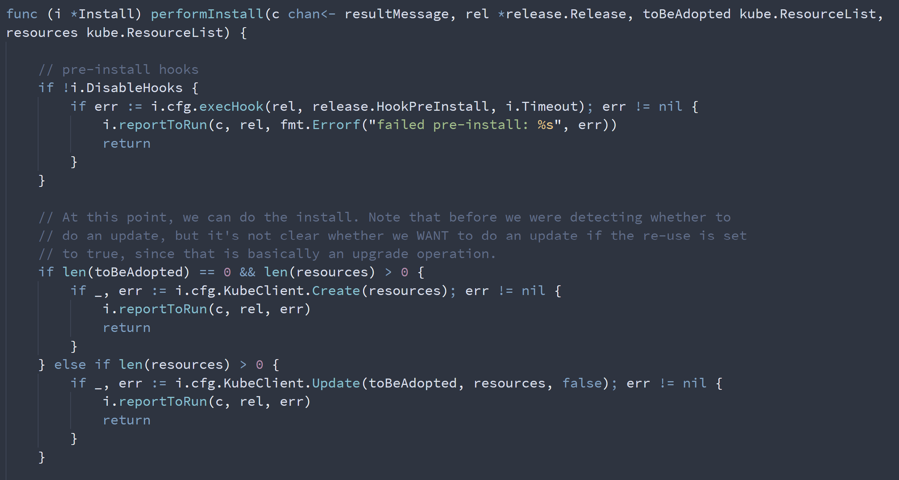
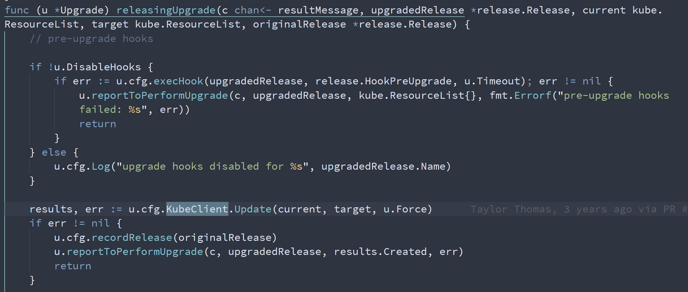

# helm 在 update, upgrade 操作时候的逻辑

helm是一个模板引擎，作用是在模板中填上参数，创建成yaml，然后apply到目标系统上。那么在helm update, upgrade操作的时候，他的运行逻辑是什么样子的呢？

作者猜测应该是这样的，helm都会根据新的模板，创建出yaml来，然后通过k8s的update操作，来完成配置的更新。

# 分析代码

我们先从代码分析入手，看一下helm的源代码，checkout https://github.com/helm/helm

在文件 pkg/action/install.go 中，有这样一段，还带注释

<!--  -->
```go
......
func (i *Install) performInstall(c chan<- resultMessage, rel *release.Release, toBeAdopted kube.ResourceList, resources kube.ResourceList) {

	// pre-install hooks
	if !i.DisableHooks {
		if err := i.cfg.execHook(rel, release.HookPreInstall, i.Timeout); err != nil {
			i.reportToRun(c, rel, fmt.Errorf("failed pre-install: %s", err))
			return
		}
	}

	// At this point, we can do the install. Note that before we were detecting whether to
	// do an update, but it's not clear whether we WANT to do an update if the re-use is set
	// to true, since that is basically an upgrade operation.
	if len(toBeAdopted) == 0 && len(resources) > 0 {
		if _, err := i.cfg.KubeClient.Create(resources); err != nil {
			i.reportToRun(c, rel, err)
			return
		}
	} else if len(resources) > 0 {
		if _, err := i.cfg.KubeClient.Update(toBeAdopted, resources, false); err != nil {
			i.reportToRun(c, rel, err)
			return
		}
	}
......
```

从代码逻辑，以及注释，就可以看出来，当helm遇到新的install的时候，它使用 kubectl create 来创建resource. 当他处理旧的install的时候，他会使用 kubectl patch 来更新resource.

为什么是kubectl patch呢？我们追寻代码，找到了下面一段。pkg/kube/client.go
```go
......
func updateResource(c *Client, target *resource.Info, currentObj runtime.Object, force bool) error {
	var (
		obj    runtime.Object
		helper = resource.NewHelper(target.Client, target.Mapping).WithFieldManager(getManagedFieldsManager())
		kind   = target.Mapping.GroupVersionKind.Kind
	)

	// if --force is applied, attempt to replace the existing resource with the new object.
	if force {
		var err error
		obj, err = helper.Replace(target.Namespace, target.Name, true, target.Object)
		if err != nil {
			return errors.Wrap(err, "failed to replace object")
		}
		c.Log("Replaced %q with kind %s for kind %s", target.Name, currentObj.GetObjectKind().GroupVersionKind().Kind, kind)
	} else {
		patch, patchType, err := createPatch(target, currentObj)
		if err != nil {
			return errors.Wrap(err, "failed to create patch")
		}

......
```

从上面的代码可以看出来，一般情况下，使用patch的方式，来更新k8s.

如果helm遇到upgrade操作是什么逻辑呢，我们在文件 /root/dev/helm/pkg/action/upgrade.go 中，找到这样一段代码，

<!--  -->
```go
......
func (u *Upgrade) releasingUpgrade(c chan<- resultMessage, upgradedRelease *release.Release, current kube.ResourceList, target kube.ResourceList, originalRelease *release.Release) {
	// pre-upgrade hooks

	if !u.DisableHooks {
		if err := u.cfg.execHook(upgradedRelease, release.HookPreUpgrade, u.Timeout); err != nil {
			u.reportToPerformUpgrade(c, upgradedRelease, kube.ResourceList{}, fmt.Errorf("pre-upgrade hooks failed: %s", err))
			return
		}
	} else {
		u.cfg.Log("upgrade hooks disabled for %s", upgradedRelease.Name)
	}

	results, err := u.cfg.KubeClient.Update(current, target, u.Force)
	if err != nil {
		u.cfg.recordRelease(originalRelease)
		u.reportToPerformUpgrade(c, upgradedRelease, results.Created, err)
		return
	}
......
```

从代码逻辑中，我们可以看出来，helm处理 upgrade 的时候，直接使用 kubectl patch 来更新resource

# 实践操作

代码分析是一回事，我们还需要到实际系统上验证一下我们的说法，那么我们就先从构建一个简单的helm project开始。

```bash
# create a helm demo project
mkdir -p /data/dev/
cd /data/dev

helm create mychart

# change mychart/values.yaml
# serviceAccount.create: false

oc project default

helm install --set serviceAccount.create=false full-coral ./mychart
# NAME: full-coral
# LAST DEPLOYED: Thu Mar  3 12:13:09 2022
# NAMESPACE: default
# STATUS: deployed
# REVISION: 1
# NOTES:
# 1. Get the application URL by running these commands:
#   export POD_NAME=$(kubectl get pods --namespace default -l "app.kubernetes.io/name=mychart,app.kubernetes.io/instance=full-coral" -o jsonpath="{.items[0].metadata.name}")
#   export CONTAINER_PORT=$(kubectl get pod --namespace default $POD_NAME -o jsonpath="{.spec.containers[0].ports[0].containerPort}")
#   echo "Visit http://127.0.0.1:8080 to use your application"
#   kubectl --namespace default port-forward $POD_NAME 8080:$CONTAINER_PORT

oc get all
# NAME                                     READY   STATUS    RESTARTS   AGE
# pod/full-coral-mychart-c89db6494-j9m5p   1/1     Running   0          41s

# NAME                         TYPE           CLUSTER-IP      EXTERNAL-IP                            PORT(S)   AGE
# service/full-coral-mychart   ClusterIP      172.30.239.80   <none>                                 80/TCP    41s
# service/kubernetes           ClusterIP      172.30.0.1      <none>                                 443/TCP   16d
# service/openshift            ExternalName   <none>          kubernetes.default.svc.cluster.local   <none>    16d

# NAME                                 READY   UP-TO-DATE   AVAILABLE   AGE
# deployment.apps/full-coral-mychart   1/1     1            1           41s

# NAME                                           DESIRED   CURRENT   READY   AGE
# replicaset.apps/full-coral-mychart-c89db6494   1         1         1       41s

helm upgrade --set replicaCount=2 full-coral ./mychart/
# Release "full-coral" has been upgraded. Happy Helming!
# NAME: full-coral
# LAST DEPLOYED: Thu Mar  3 13:13:57 2022
# NAMESPACE: default
# STATUS: deployed
# REVISION: 2
# NOTES:
# 1. Get the application URL by running these commands:
#   export POD_NAME=$(kubectl get pods --namespace default -l "app.kubernetes.io/name=mychart,app.kubernetes.io/instance=full-coral" -o jsonpath="{.items[0].metadata.name}")
#   export CONTAINER_PORT=$(kubectl get pod --namespace default $POD_NAME -o jsonpath="{.spec.containers[0].ports[0].containerPort}")
#   echo "Visit http://127.0.0.1:8080 to use your application"
#   kubectl --namespace default port-forward $POD_NAME 8080:$CONTAINER_PORT

oc get all
# NAME                                     READY   STATUS    RESTARTS   AGE
# pod/full-coral-mychart-c89db6494-d5znm   1/1     Running   0          78s
# pod/full-coral-mychart-c89db6494-j9m5p   1/1     Running   0          62m

# NAME                         TYPE           CLUSTER-IP      EXTERNAL-IP                            PORT(S)   AGE
# service/full-coral-mychart   ClusterIP      172.30.239.80   <none>                                 80/TCP    62m
# service/kubernetes           ClusterIP      172.30.0.1      <none>                                 443/TCP   16d
# service/openshift            ExternalName   <none>          kubernetes.default.svc.cluster.local   <none>    16d

# NAME                                 READY   UP-TO-DATE   AVAILABLE   AGE
# deployment.apps/full-coral-mychart   2/2     2            2           62m

# NAME                                           DESIRED   CURRENT   READY   AGE
# replicaset.apps/full-coral-mychart-c89db6494   2         2         2       62m


helm uninstall full-coral


```


