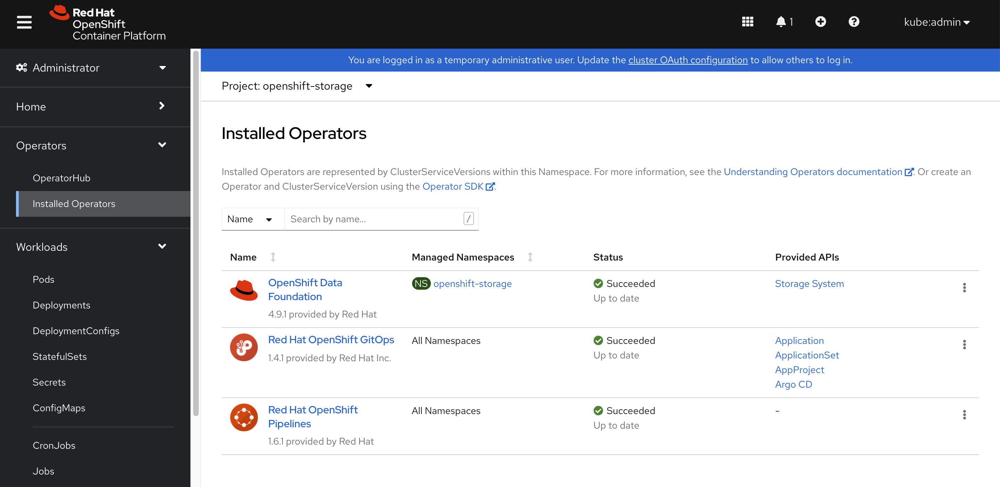

# ODF on single node openshift

https://github.com/ksingh7/odf-nano

# prepare disks

```bash

create_lv() {
    var_vg=$1
    var_lv=$2
    var_size=$3
    lvremove -f $var_vg/$var_lv
    lvcreate -y -L $var_size -n $var_lv $var_vg
    wipefs --all --force /dev/$var_vg/$var_lv
}

create_lv vgdata lvdata01 100G
create_lv vgdata lvdata02 100G

cat << EOF > /data/kvm/disk.xml
<disk type='block' device='disk'>
    <driver name='qemu' type='raw' cache='none' io='native'/>
    <source dev='/dev/vgdata/lvdata01'/>
    <target dev='vdb' bus='virtio'/>
</disk>
EOF

virsh attach-device ocp4-master-0 /data/kvm/disk.xml \
    --persistent \
    --config

cat << EOF > /data/kvm/disk.xml
<disk type='block' device='disk'>
    <driver name='qemu' type='raw' cache='none' io='native'/>
    <source dev='/dev/vgdata/lvdata02'/>
    <target dev='vdc' bus='virtio'/>
</disk>
EOF

virsh attach-device ocp4-master-0 /data/kvm/disk.xml \
    --persistent \
    --config

# if you want to remove the disks
virsh detach-device ocp4-master-0 /data/kvm/disk.xml \
    --persistent \
    --config

virsh dumpxml ocp4-master-0

```

# install odf on sno

install openshift data fundation from operator hub


```bash
oc label "$(oc get node -o name)" cluster.ocs.openshift.io/openshift-storage='' --overwrite 
oc project openshift-storage

oc get csv -n openshift-storage
# NAME                                     DISPLAY                       VERSION   REPLACES                            PHASE
# mcg-operator.v4.9.1                      NooBaa Operator               4.9.1     mcg-operator.v4.9.0                 Succeeded
# ocs-operator.v4.9.1                      OpenShift Container Storage   4.9.1     ocs-operator.v4.9.0                 Succeeded
# odf-operator.v4.9.1                      OpenShift Data Foundation     4.9.1     odf-operator.v4.9.0                 Succeeded
# openshift-gitops-operator.v1.4.1         Red Hat OpenShift GitOps      1.4.1     openshift-gitops-operator.v1.4.0    Succeeded
# openshift-pipelines-operator-rh.v1.6.1   Red Hat OpenShift Pipelines   1.6.1     redhat-openshift-pipelines.v1.5.2   Succeeded

while [ "$(oc get csv -n openshift-storage | grep -c Succeeded)" -lt 1 ]; do echo -n "."; sleep 5; done

cat << EOF  > /data/install/odf-sc.yaml
---
kind: StorageClass
apiVersion: storage.k8s.io/v1
metadata:
  name: localblock
provisioner: kubernetes.io/no-provisioner
---
apiVersion: v1
kind: PersistentVolume
metadata:
  name: local-pv-vdb
spec:
  capacity:
    storage: 100Gi
  volumeMode: Block
  accessModes:
  - ReadWriteOnce
  persistentVolumeReclaimPolicy: Delete
  storageClassName: localblock
  local:
    path: /dev/vdb
  nodeAffinity:
    required:
      nodeSelectorTerms:
      - matchExpressions:
        - key: node.openshift.io/os_id
          operator: In
          values:
          - rhcos
---
apiVersion: v1
kind: PersistentVolume
metadata:
  name: local-pv-vdc
spec:
  capacity:
    storage: 100Gi
  volumeMode: Block
  accessModes:
  - ReadWriteOnce
  persistentVolumeReclaimPolicy: Delete
  storageClassName: localblock
  local:
    path: /dev/vdc
  nodeAffinity:
    required:
      nodeSelectorTerms:
      - matchExpressions:
        - key: node.openshift.io/os_id
          operator: In
          values:
          - rhcos
EOF
oc create -n openshift-storage -f /data/install/odf-sc.yaml 

cat <<EOF > /data/install/odf-cm.yaml
apiVersion: v1
data:
  config: |2
    [global]
    mon_osd_full_ratio = .85
    mon_osd_backfillfull_ratio = .80
    mon_osd_nearfull_ratio = .75
    mon_max_pg_per_osd = 600
    osd_pool_default_min_size = 1
    osd_pool_default_size = 2
    [osd]
    osd_memory_target_cgroup_limit_ratio = 0.5
kind: ConfigMap
metadata:
  name: rook-config-override
  namespace: openshift-storage
EOF
oc create -n openshift-storage -f /data/install/odf-cm.yaml

cat << EOF > /data/install/odf-sc.yaml
apiVersion: ocs.openshift.io/v1
kind: StorageCluster
metadata:
  name: ocs-storagecluster
  namespace: openshift-storage
spec:
  resources:
    mon:
      limits:
        cpu: 500m
        memory: 512Mi
      requests:
        cpu: 125m
        memory: 128Mi
    mds:
      limits:
        cpu: 500m
        memory: 512Mi
      requests:
        cpu: 125m
        memory: 128Mi
    mgr:
      limits:
        cpu: 500m
        memory: 512Mi
      requests:
        cpu: 125m
        memory: 128Mi
    rgw:
      limits:
        cpu: 500m
        memory: 512Mi
      requests:
        cpu: 125m
        memory: 128Mi
  managedResources:
    cephConfig:
      reconcileStrategy: ignore
    cephBlockPools:
      reconcileStrategy: ignore
    cephFilesystems:
      reconcileStrategy: ignore
    cephObjectStoreUsers:
      reconcileStrategy: ignore
    cephObjectStores:
      reconcileStrategy: ignore
    snapshotClasses:
      reconcileStrategy: ignore
    storageClasses:
      reconcileStrategy: ignore
  multiCloudGateway:
    reconcileStrategy: ignore
  manageNodes: false
  monDataDirHostPath: /var/lib/rook
  storageDeviceSets:
  - count: 2
    dataPVCTemplate:
      spec:
        accessModes:
        - ReadWriteOnce
        resources:
          requests:
            storage: 1
        storageClassName: localblock
        volumeMode: Block
    name: ocs-deviceset
    placement: {}
    portable: false
    replica: 1
EOF
oc create -n openshift-storage -f /data/install/odf-sc.yaml

# restore
oc delete -n openshift-storage -f /data/install/odf-sc.yaml

oc patch OCSInitialization ocsinit -n openshift-storage --type json --patch '[{ "op": "replace", "path": "/spec/enableCephTools", "value": true }]'

oc patch OCSInitialization ocsinit -n openshift-storage --type json --patch '[{ "op": "replace", "path": "/spec/enableCephTools", "value": false }]'

rookoperator=$(oc get pods -n openshift-storage -o name --field-selector='status.phase=Running' | grep 'rook-ceph-operator')

oc rsh -n openshift-storage ${rookoperator} ceph -c /var/lib/rook/openshift-storage/openshift-storage.config  config 

oc wait --for=condition=Ready --timeout=10m pod -l app=rook-ceph-tools


```