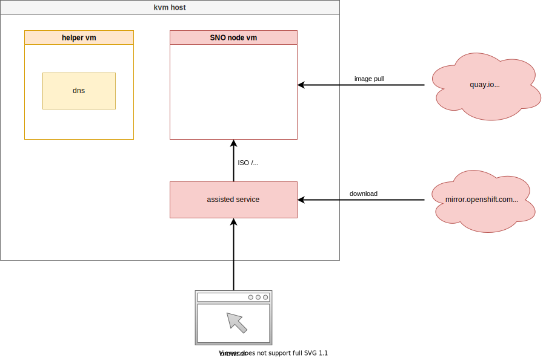
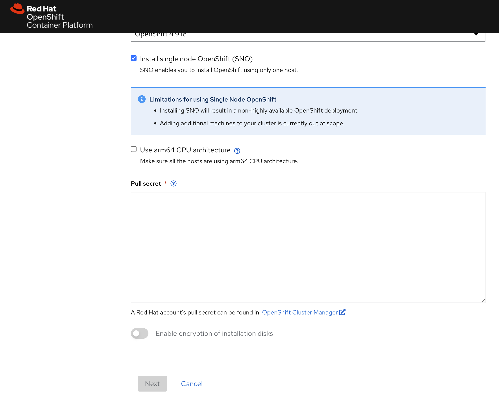
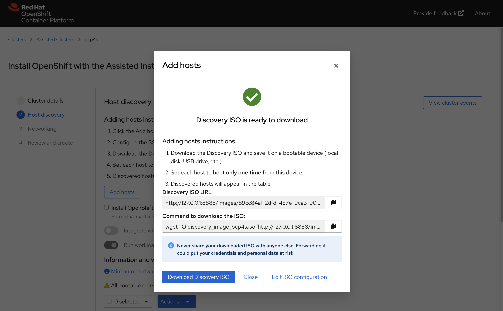
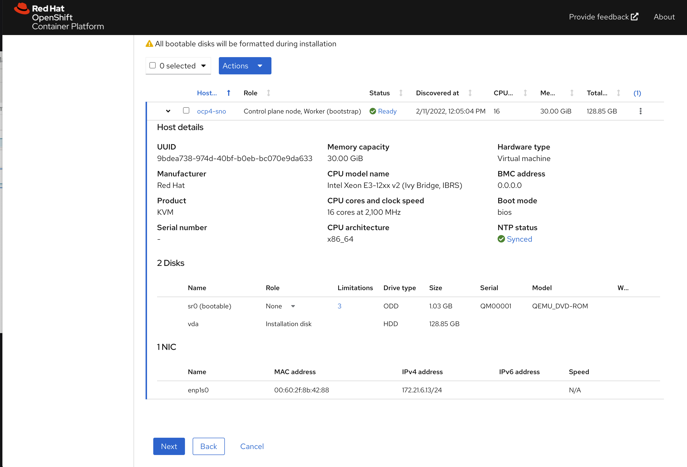
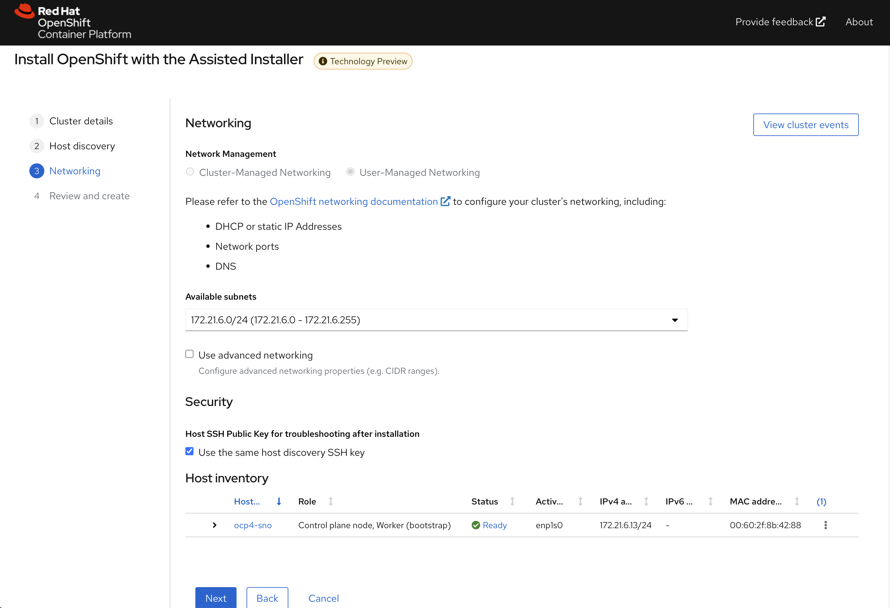
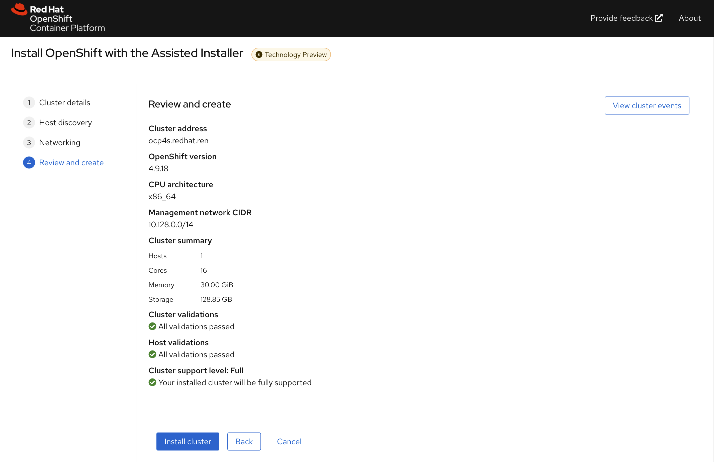
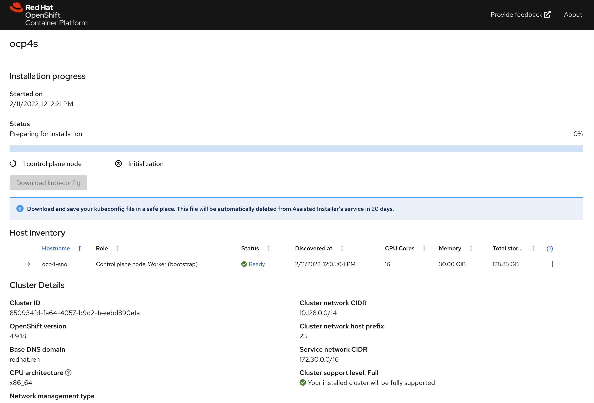
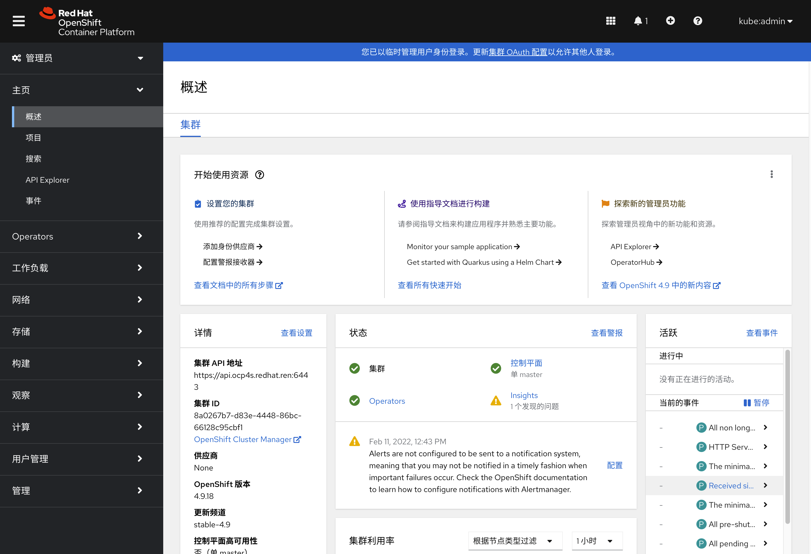

# openshift 4.9 single node, assisted install mode, without dhcp, connected

本文描述，如何使用assisted service(辅助安装服务)，来安装一个单节点openshift4集群，特别的地方是，默认情况，openshift4要求网络上提供dhcp服务，让节点启动的时候，能拿到IP地址，从而进一步下载容器镜像，并且和assisted service交互，拿到配置。可是大部分客户的网络，是不允许开启dhcp服务的，那么我们在这里就使用assisted service暂时隐藏的功能，进行static ip模式的部署。

本实验设想的客户环境/需求是这样的：
1. 实验网络没有dhcp
2. 实验网络可以访问外网
3. 实验环境中有2台主机
4. 将在实验环境中的1台主机上，安装单节点openshift4(baremetal模式)

由于作者实验环境所限，我们就用kvm来代替baremetal进行实验。

安装过程大概是这样的：
1. 启动helper vm，并在helper节点上配置dns服务
2. 启动本地assisted service服务
3. 在assisted service上进行配置
4. 从assisted service上下载iso
5. 对iso进行定制化
6. 通过iso启动kvm/baremetal
7. 在assisted service上进行配置，开始安装
8. 观察和等待安装结束
9. 获得openshift4的用户名密码等信息，登录集群。

本次实验的架构图：


# 部署 dns

assisted install 模式下，如果想静态ip安装，需要在实验网络上部署一个dns服务。因为我们部署的是single node openshift，只需要把如下4个域名，指向同一个ip地址就可以。当然，你需要提前想好域名。

- api.ocp4s.redhat.ren
- api-int.ocp4s.redhat.ren
- *.apps.ocp4.redhat.ren
- ocp4-sno.ocp4.redhat.ren

# 部署 assisted install service

assisted install service有2个版本，一个是cloud.redhat.com上面那个，同时还有一个本地版本，两个版本功能一样，因为我们需要有定制需求，所以我们选择本地版本。

```bash
# https://github.com/openshift/assisted-service/blob/master/docs/user-guide/assisted-service-on-local.md

# https://github.com/openshift/assisted-service/tree/master/deploy/podman

mkdir -p /data/assisted-service/
cd /data/assisted-service/

export http_proxy="http://192.168.195.54:5085"
export https_proxy=${http_proxy}

wget https://raw.githubusercontent.com/openshift/assisted-service/master/deploy/podman/configmap.yml
wget https://raw.githubusercontent.com/openshift/assisted-service/master/deploy/podman/pod.yml

unset http_proxy
unset https_proxy

sed -i 's/ SERVICE_BASE_URL:.*/ SERVICE_BASE_URL: "http:\/\/172.21.6.103:8090"/' configmap.yml

# 启动本地assisted service
podman play kube --configmap configmap.yml pod.yml

# 用以下命令，停止/删除本地assisted service
cd /data/assisted-service/
podman play kube --down pod.yml

```
⚠️注意：本地版本的assisted service，会从mirror.openshift.com上面下载多个版本的iso，总共有6GB。请等待下载完成
```bash
podman exec assisted-installer-image-service du -h /data
# 6.3G    /data
```

运行成功以后，访问以下url
http://172.21.6.103:8080

# 创建cluster

访问本地的assist install service, 创建一个cluster


配置集群的基本信息


填写自己的pull-secret信息，并点击下一步


进入下一个页面后，点击add host


直接点击generate discovery iso，我们会在后面定制ssh key，现在不需要配置。


记录下来download command，因为我们需要里面的env infra id


我们这里的command是
```bash
wget -O discovery_image_ocp4s.iso 'http://127.0.0.1:8888/images/89cc84a1-2dfd-4d7e-9ca3-903342c40d60?arch=x86_64&type=full-iso&version=4.9'
```

# 定制 assisted install service的配置

assisted install service创建的iso，要去实验网络必须有dhcp服务，我们要做的是static ip，那么我们就要定制一下 assisted install service, 激活他现在还是隐藏的功能（暂时没有官方支持）。

```bash
# on helper
cd /data/sno

SNO_IP=172.21.6.13
SNO_GW=172.21.6.254
SNO_NETMAST=255.255.255.0
SNO_NETMAST_S=24
SNO_HOSTNAME=ocp4-sno
SNO_IF=enp1s0
SNO_IF_MAC=`printf '00:60:2F:%02X:%02X:%02X' $[RANDOM%256] $[RANDOM%256] $[RANDOM%256]`
SNO_DNS=172.21.1.1
SNO_DISK=/dev/vda
SNO_CORE_PWD=redhat

echo ${SNO_IF_MAC} > /data/sno/sno.mac

ASSISTED_SERVICE_URL=http://172.21.6.103:8080
# infra id is part of download url on UI
INFRA_ENV_ID=89cc84a1-2dfd-4d7e-9ca3-903342c40d60
NODE_SSH_KEY="$(cat ~/.ssh/id_rsa.pub)"
request_body=$(mktemp)

cat << EOF > server-a.yaml
dns-resolver:
  config:
    server:
    - ${SNO_DNS}
interfaces:
- ipv4:
    address:
    - ip: ${SNO_IP}
      prefix-length: ${SNO_NETMAST_S}
    dhcp: false
    enabled: true
  name: ${SNO_IF}
  state: up
  type: ethernet
routes:
  config:
  - destination: 0.0.0.0/0
    next-hop-address: ${SNO_GW}
    next-hop-interface: ${SNO_IF}
    table-id: 254
EOF

# https://stackoverflow.com/questions/2854655/command-to-escape-a-string-in-bash
# VAR_PULL_SEC=`printf "%q" $(cat  /data/pull-secret.json)`
jq -n --arg SSH_KEY "$NODE_SSH_KEY" --arg NMSTATE_YAML1 "$(cat server-a.yaml)" --arg MAC_ADDR "$(cat /data/sno/sno.mac)" --arg PULL_SEC "$(cat  /data/pull-secret.json)" \
'{
    "proxy":{"http_proxy":"","https_proxy":"","no_proxy":""},
    "ssh_authorized_key":$SSH_KEY,
    "pull_secret":$PULL_SEC,
    "image_type":"full-iso",
  "static_network_config": [
    {
      "network_yaml": $NMSTATE_YAML1,
      "mac_interface_map": [{"mac_address": $MAC_ADDR, "logical_nic_name": "enp1s0"}]
    }
  ]
}' > $request_body

# 我们来看看创建的request body
cat $request_body

# 向 assisted install service发送请求，进行定制
curl -H "Content-Type: application/json" -X PATCH -d @$request_body ${ASSISTED_SERVICE_URL}/api/assisted-install/v2/infra-envs/$INFRA_ENV_ID
# {"cluster_id":"850934fd-fa64-4057-b9d2-1eeebd890e1a","cpu_architecture":"x86_64","created_at":"2022-02-11T03:54:46.632598Z","download_url":"http://127.0.0.1:8888/images/89cc84a1-2dfd-4d7e-9ca3-903342c40d60?arch=x86_64&type=full-iso&version=4.9","email_domain":"Unknown","expires_at":"0001-01-01T00:00:00.000Z","href":"/api/assisted-install/v2/infra-envs/89cc84a1-2dfd-4d7e-9ca3-903342c40d60","id":"89cc84a1-2dfd-4d7e-9ca3-903342c40d60","kind":"InfraEnv","name":"ocp4s_infra-env","openshift_version":"4.9","proxy":{"http_proxy":"","https_proxy":"","no_proxy":""},"pull_secret_set":true,"ssh_authorized_key":"ssh-rsa AAAAB3NzaC1yc2EAAAADAQABAAABgQCrkO4oLIFTwjkGON+aShlQRKwXHOf3XKrGDmpb+tQM3UcbsF2U7klsr9jBcGObQMZO7KBW8mlRu0wC2RxueBgjbqvylKoFacgVZg6PORfkclqE1gZRYFwoxDkLo2c5y5B7OhcAdlHO0eR5hZ3/0+8ZHZle0W+A0AD7qqowO2HlWLkMMt1QXFD7R0r6dzTs9u21jASGk3jjYgCOw5iHvqm2ueVDFAc4yVwNZ4MXKg5MRvqAJDYPqhaRozLE60EGIziy9SRj9HWynyNDncCdL1/IBK2z9T0JwDebD6TDNcPCtL+AeKIpaHed52PkjnFf+Q+8/0Z0iXt6GyFYlx8OkxdsiMgMxiXx43yIRaWZjx54kVtc9pB6CL50UKPQ2LjuFPIZSfaCab5KDgPRtzue82DE6Mxxg4PS+FTW32/bq1WiOxCg9ABrZ0n1CGaZWFepJkSw47wodMnvlBkcKY3Rn/SsLZVOUsJysd+b08LQgl1Fr3hjVrEQMLbyU0UxvoerYfk= root@ocp4-helper","static_network_config":"dns-resolver:\n  config:\n    server:\n    - 172.21.1.1\ninterfaces:\n- ipv4:\n    address:\n    - ip: 172.21.6.13\n      prefix-length: 24\n    dhcp: false\n    enabled: true\n  name: enp1s0\n  state: up\n  type: ethernet\nroutes:\n  config:\n  - destination: 0.0.0.0/0\n    next-hop-address: 172.21.6.254\n    next-hop-interface: enp1s0\n    table-id: 254HHHHH00:60:2F:8B:42:88=enp1s0","type":"full-iso","updated_at":"2022-02-11T04:01:14.008388Z","user_name":"admin"}

# on helper
cd /data/sno/
wget -O discovery_image_ocp4s.iso 'http://172.21.6.103:8888/images/89cc84a1-2dfd-4d7e-9ca3-903342c40d60?arch=x86_64&type=full-iso&version=4.9'

coreos-installer iso kargs modify -a \
  " ip=${SNO_IP}::${SNO_GW}:${SNO_NETMAST}:${SNO_HOSTNAME}:${SNO_IF}:none nameserver=${SNO_DNS}" \
  /data/sno/discovery_image_ocp4s.iso

/bin/mv -f /data/sno/discovery_image_ocp4s.iso /data/sno/sno.iso
```

# 启动kvm

我们回到kvm宿主机，启动kvm，开始安装single node openshift

```bash
# back to kvm host

create_lv() {
    var_vg=$1
    var_lv=$2
    var_size=$3
    lvremove -f $var_vg/$var_lv
    lvcreate -y -L $var_size -n $var_lv $var_vg
    wipefs --all --force /dev/$var_vg/$var_lv
}

create_lv vgdata lvsno 120G

export KVM_DIRECTORY=/data/kvm

mkdir -p  ${KVM_DIRECTORY}
cd ${KVM_DIRECTORY}
scp root@192.168.7.11:/data/sno/sno.* ${KVM_DIRECTORY}/

# on kvm host
# export KVM_DIRECTORY=/data/kvm
virt-install --name=ocp4-sno --vcpus=16 --ram=30720 \
--cpu=host-model \
--disk path=/dev/vgdata/lvsno,device=disk,bus=virtio,format=raw \
--os-variant rhel8.3 --network bridge=baremetal,model=virtio,mac=$(<sno.mac) \
--graphics vnc,port=59012 \
--boot menu=on --cdrom ${KVM_DIRECTORY}/sno.iso

```
<!-- 等待vm重启一次。在这一步，vm里面会根据ignition文件，下载coreos镜像，并且安装coreos。 -->

# 在 assisted install service里面配置sno参数

回到 assisted install service webUI，能看到node已经被发现


点击下一步，配置物理机的安装子网


点击下一步，回顾集群配置信息


开始安装，到这里，我们等待就可以


一段时间以后，通常20-30分钟，就安装完成了，当然这要网络情况比较好的条件下。


不要忘记下载集群证书，还有webUI的用户名，密码。

# 访问sno集群

```bash
# back to helper
# copy kubeconfig from web browser to /data/sno
export KUBECONFIG=/data/sno/auth/kubeconfig

oc get node
# NAME       STATUS   ROLES           AGE   VERSION
# ocp4-sno   Ready    master,worker   71m   v1.22.3+e790d7f

oc get co
# NAME                                       VERSION   AVAILABLE   PROGRESSING   DEGRADED   SINCE   MESSAGE
# authentication                             4.9.18    True        False         False      54m
# baremetal                                  4.9.18    True        False         False      58m
# cloud-controller-manager                   4.9.18    True        False         False      63m
# cloud-credential                           4.9.18    True        False         False      68m
# cluster-autoscaler                         4.9.18    True        False         False      59m
# config-operator                            4.9.18    True        False         False      69m
# console                                    4.9.18    True        False         False      54m
# csi-snapshot-controller                    4.9.18    True        False         False      68m
# dns                                        4.9.18    True        False         False      58m
# etcd                                       4.9.18    True        False         False      62m
# image-registry                             4.9.18    True        False         False      55m
# ingress                                    4.9.18    True        False         False      57m
# insights                                   4.9.18    True        False         False      63m
# kube-apiserver                             4.9.18    True        False         False      58m
# kube-controller-manager                    4.9.18    True        False         False      61m
# kube-scheduler                             4.9.18    True        False         False      60m
# kube-storage-version-migrator              4.9.18    True        False         False      68m
# machine-api                                4.9.18    True        False         False      59m
# machine-approver                           4.9.18    True        False         False      60m
# machine-config                             4.9.18    True        False         False      63m
# marketplace                                4.9.18    True        False         False      68m
# monitoring                                 4.9.18    True        False         False      54m
# network                                    4.9.18    True        False         False      68m
# node-tuning                                4.9.18    True        False         False      64m
# openshift-apiserver                        4.9.18    True        False         False      55m
# openshift-controller-manager               4.9.18    True        False         False      60m
# openshift-samples                          4.9.18    True        False         False      57m
# operator-lifecycle-manager                 4.9.18    True        False         False      60m
# operator-lifecycle-manager-catalog         4.9.18    True        False         False      60m
# operator-lifecycle-manager-packageserver   4.9.18    True        False         False      58m
# service-ca                                 4.9.18    True        False         False      68m
# storage                                    4.9.18    True        False         False      63m
```
访问集群的webUI
https://console-openshift-console.apps.ocp4s.redhat.ren/
用户名密码是：  kubeadmin  /   3QS3M-HA3Px-376HD-bvfif




# reference

https://github.com/openshift/assisted-service/tree/master/docs/user-guide

- https://access.redhat.com/solutions/6135171
- https://github.com/openshift/assisted-service/blob/master/docs/user-guide/assisted-service-on-local.md
- https://github.com/openshift/assisted-service/blob/master/docs/user-guide/restful-api-guide.md

search
- pre-network-manager-config.sh
- /Users/wzh/Desktop/dev/assisted-service/internal/constants/scripts.go
- NetworkManager

https://superuser.com/questions/218340/how-to-generate-a-valid-random-mac-address-with-bash-shell

# end
```bash

cat << EOF > test
02:00:00:2c:23:a5=enp1s0
EOF
cat test | cut -d= -f1 | tr '[:lower:]' '[:upper:]'

printf '00-60-2F-%02X-%02X-%02X\n' $[RANDOM%256] $[RANDOM%256] $[RANDOM%256]
virsh domifaddr freebsd11.1

```