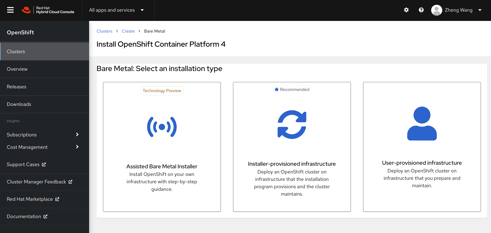

# openshift 4.9 single node install mode without dhcp

all ways are here
- https://cloud.redhat.com/blog/deploy-openshift-at-the-edge-with-single-node-openshift


# following official docs
https://cloud.redhat.com/openshift/assisted-installer/clusters

https://console.redhat.com/openshift/assisted-installer/clusters/fe22ab5b-bada-4519-9003-758c69a3daf4





官方文档的方案，是需要环境里面有dhcp了，我们的环境里面没有，那么我们就要做一些特殊配置，主要是dns，我们使用工具来配置一个helper节点，提供dns服务。然后在helper节点上离线制作iso文件，直接用这个iso文件启动vm，然后vm里面会自动安装成一个single node openshift。

让我们开始吧。
```bash
# first you should config your helper node

nmcli con mod enp1s0 +ipv4.address '172.21.6.11/24'
nmcli connection modify enp1s0 ipv4.gateway "172.21.6.254"
nmcli networking off; nmcli networking on

install /data/ocp4/clients/butane-amd64 /usr/local/bin/butane

# the sno cluster will use sno.redhat.ren dns name
cd /data/ocp4/ocp4-upi-helpernode-master/
cat << 'EOF' > /data/ocp4/ocp4-upi-helpernode-master/vars.yaml
---
ocp_version: 4.9.12
ssh_gen_key: false
staticips: true
firewalld: false
dns_forward: yes
iso:
  iso_dl_url: "file:///data/ocp4/rhcos-live.x86_64.iso"
  my_iso: "rhcos-live.iso" # this is internal file, just leave as it.
helper:
  name: "helper"
  ipaddr: "172.21.6.11"
  networkifacename: "enp1s0"
  gateway: "172.21.6.254"
  netmask: "255.255.255.0"
dns:
  domain: "redhat.ren"
  clusterid: "sno"
  forwarder1: "172.21.1.1"
  forwarder2: "172.21.1.1"
bootstrap:
  name: "bootstrap"
  ipaddr: "172.21.6.12"
  interface: "enp1s0"
  install_drive: "vda"
masters:
  - name: "master-0"
    ipaddr: "172.21.6.13"
    interface: "enp1s0"
    install_drive: "vda"
  # - name: "master-1"
  #   ipaddr: "192.168.7.14"
  #   interface: "enp1s0"
  #   install_drive: "vda"    
  # - name: "master-2"
  #   ipaddr: "192.168.7.15"
  #   interface: "enp1s0"
  #   install_drive: "vda"    
workers:
  - name: "worker-0"
    ipaddr: "172.21.6.16"
    interface: "eno1"
    install_drive: "sda"
  - name: "worker-1"
    ipaddr: "172.21.6.17"
    interface: "enp1s0"
    install_drive: "sda"
  # - name: "worker-2"
  #   ipaddr: "192.168.7.18"
  #   interface: "enp1s0"
  #   install_drive: "vda"
  # - name: "infra-0"
  #   ipaddr: "192.168.7.19"
  #   interface: "enp1s0"
  #   install_drive: "vda"
  # - name: "infra-1"
  #   ipaddr: "192.168.7.20"
  #   interface: "enp1s0"
  #   install_drive: "vda"
  # - name: "worker-3"
  #   ipaddr: "192.168.7.21"
  #   interface: "enp1s0"
  #   install_drive: "vda"
  # - name: "worker-4"
  #   ipaddr: "192.168.7.22"
  #   interface: "enp1s0"
  #   install_drive: "vda"
others:
  - name: "registry"
    ipaddr: "172.21.6.103"
  - name: "yum"
    ipaddr: "172.21.6.103"
  - name: "quay"
    ipaddr: "172.21.6.103"
  - name: "nexus"
    ipaddr: "172.21.6.103"
  - name: "git"
    ipaddr: "172.21.6.103"
otherdomains:
  - domain: "rhv.redhat.ren"
    hosts:
    - name: "manager"
      ipaddr: "192.168.7.71"
    - name: "rhv01"
      ipaddr: "192.168.7.72"
  - domain: "ocp4s.redhat.ren"
    hosts:
    - name: "*"
      ipaddr: "172.21.6.13"
    - name: "*.apps"
      ipaddr: "172.21.6.13"
force_ocp_download: false
remove_old_config_files: false
ocp_client: "file:///data/ocp4/{{ ocp_version }}/openshift-client-linux-{{ ocp_version }}.tar.gz"
ocp_installer: "file:///data/ocp4/{{ ocp_version }}/openshift-install-linux-{{ ocp_version }}.tar.gz"
ppc64le: false
arch: 'x86_64'
chronyconfig:
  enabled: true
  content:
    - server: "172.21.6.11"
      options: iburst
setup_registry: # don't worry about this, just leave it here
  deploy: false
  registry_image: docker.io/library/registry:2
  local_repo: "ocp4/openshift4"
  product_repo: "openshift-release-dev"
  release_name: "ocp-release"
  release_tag: "4.6.1-x86_64"
ocp_filetranspiler: "file:///data/ocp4/filetranspiler.tgz"
registry_server: "registry.ocp4.redhat.ren:5443"
EOF

ansible-playbook -e @vars.yaml tasks/main.yml

mkdir -p /data/sno

# 定制ignition
cd /data/sno

# 根据现场环境，修改 install-config.yaml
# 至少要修改ssh key， 还有 additionalTrustBundle，这个是镜像仓库的csr 

SNO_IP=172.21.6.13
SNO_GW=172.21.6.254
SNO_NETMAST=255.255.255.0
SNO_NETMAST_S=24
SNO_HOSTNAME=ocp4-sno
SNO_IF=enp1s0
SNO_IF_MAC=`printf '00:60:2F:%02X:%02X:%02X' $[RANDOM%256] $[RANDOM%256] $[RANDOM%256]`
SNO_DNS=172.21.1.1
SNO_DISK=/dev/vda
SNO_CORE_PWD=redhat

# vi install-config.yaml 
cat << EOF > /data/sno/install-config.yaml 
apiVersion: v1
baseDomain: redhat.ren
compute:
- hyperthreading: Enabled
  name: worker
  replicas: 0
controlPlane:
  hyperthreading: Enabled
  name: master
  replicas: 1
metadata:
  name: ocp4s
networking:
  clusterNetworks:
  - cidr: 10.128.0.0/14
    hostPrefix: 23
  machineNetwork:
  - cidr: 172.21.6.0/24
  networkType: OpenShiftSDN
  serviceNetwork:
  - 172.30.0.0/16
platform:
  none: {}
BootstrapInPlace:
  InstallationDisk: ${SNO_DISK}
pullSecret: |
  $( cat /data/pull-secret.json | sed 's/^/   /g' )
sshKey: |
$( cat /root/.ssh/id_rsa.pub | sed 's/^/   /g' )
additionalTrustBundle: |
$( cat /etc/crts/redhat.ren.ca.crt | sed 's/^/   /g' )
imageContentSources:
- mirrors:
  - quaylab.infra.redhat.ren/ocp4/openshift4
  source: quay.io/openshift-release-dev/ocp-release
- mirrors:
  - quaylab.infra.redhat.ren/ocp4/openshift4
  source: quay.io/openshift-release-dev/ocp-v4.0-art-dev
EOF


cd /data/sno/
/bin/rm -rf *.ign .openshift_install_state.json auth bootstrap manifests master*[0-9] worker*[0-9] 

openshift-install create manifests --dir=/data/sno

cat << EOF > /data/sno/static.ip.bu
variant: openshift
version: 4.9.0
metadata:
  labels:
    machineconfiguration.openshift.io/role: master
  name: 99-zzz-master-static-ip
# openshift:
#   kernel_arguments:
#     - "ip=${SNO_IP}::${SNO_GW}:${SNO_NETMAST}:${SNO_HOSTNAME}:${SNO_IF}:none"
#     - "nameserver=${SNO_DNS}"
storage:
  files:
    # - path: /etc/rc.d/wzh.local
    #   overwrite: true
    #   mode: 0755
    #   contents:
    #     inline: |
    #       #!/bin/bash

    #       nmcli connection modify ${SNO_IF} ipv4.method 'manual' ipv4.address ${SNO_IP}/${SNO_NETMAST_S} ipv4.gateway ${SNO_GW} ipv4.dns ${SNO_DNS}
    #       nmcli connection up ${SNO_IF}
    #       nmcli networking off; nmcli networking on

    - path: /etc/assisted/network/host1/${SNO_IF}.nmconnection
      overwrite: true
      contents:
        inline: |
          [connection]
          id=${SNO_IF}
          type=ethernet
          autoconnect-retries=1
          interface-name=${SNO_IF}
          multi-connect=1
          permissions=
          wait-device-timeout=60000

          [ethernet]
          mac-address-blacklist=

          [ipv4]
          address1=${SNO_IP}/${SNO_NETMAST_S=24},${SNO_GW}
          dhcp-hostname=${SNO_HOSTNAME}
          dhcp-timeout=90
          dns=${SNO_DNS};
          dns-search=
          may-fail=false
          method=manual

          [ipv6]
          addr-gen-mode=eui64
          dhcp-hostname=${SNO_HOSTNAME}
          dhcp-timeout=90
          dns-search=
          method=disabled

          [proxy]
    - path: /etc/assisted/network/host1/mac_interface.ini
      overwrite: true
      contents:
        inline: |
          ${SNO_IF_MAC}=${SNO_IF}
# systemd:
#   units:
#   - name: wzh.service
#     enabled: true
#     contents: |
#       [Unit]
#       Description=/etc/rc.d/wzh.local Compatibility
#       Documentation=zhengwan@redhat.com
#       ConditionFileIsExecutable=/etc/rc.d/wzh.local
#       After=network.target

#       [Service]
#       Type=oneshot
#       User=root
#       Group=root
#       ExecStart=/bin/bash -c /etc/rc.d/wzh.local

#       [Install]
#       WantedBy=multi-user.target  
EOF
butane /data/sno/static.ip.bu -o /data/sno/openshift/99-zzz-master-static-ip.yaml

# copy ntp related config
# /bin/cp -f  /data/ocp4/ocp4-upi-helpernode-master/machineconfig/* /data/sno/openshift/

# copy image registry proxy related config
cd /data/ocp4
bash image.registries.conf.sh nexus.ocp4.redhat.ren:8083

# /bin/cp -f /data/ocp4/image.registries.conf /etc/containers/registries.conf.d/

/bin/cp -f /data/ocp4/99-worker-container-registries.yaml /data/sno/openshift
/bin/cp -f /data/ocp4/99-master-container-registries.yaml /data/sno/openshift

cd /data/sno/
openshift-install create single-node-ignition-config --dir=/data/sno

# cat << EOF > pwd.tmp
# $SNO_CORE_PWD
# EOF

# PASS_HASH=$(openssl passwd -6 -in pwd.tmp)
# cat bootstrap-in-place-for-live-iso.ign | jq --arg passhash $PASS_HASH '.passwd.users[0] += {passwordHash : $passhash}' > new.bootstrap-in-place-for-live-iso.ign

/bin/rm -f /data/sno/sno.iso
coreos-installer iso ignition embed /data/ocp4/rhcos-live.x86_64.iso \
  --force \
  --ignition-file /data/sno/bootstrap-in-place-for-live-iso.ign \
  --output /data/sno/sno.iso

coreos-installer iso kargs modify -a \
  " ip=${SNO_IP}::${SNO_GW}:${SNO_NETMAST}:${SNO_HOSTNAME}:${SNO_IF}:none nameserver=${SNO_DNS}" \
  /data/sno/sno.iso

echo ${SNO_IF_MAC} > /data/sno/sno.mac

# go back to kvm host

create_lv() {
    var_vg=$1
    var_lv=$2
    var_size=$3
    lvremove -f $var_vg/$var_lv
    lvcreate -y -L $var_size -n $var_lv $var_vg
    wipefs --all --force /dev/$var_vg/$var_lv
}

create_lv vgdata lvsno 120G

export KVM_DIRECTORY=/data/kvm

mkdir -p  ${KVM_DIRECTORY}
cd ${KVM_DIRECTORY}
scp root@192.168.7.11:/data/sno/sno.* ${KVM_DIRECTORY}/

# on kvm host
# export KVM_DIRECTORY=/data/kvm
virt-install --name=ocp4-sno --vcpus=16 --ram=30720 \
--cpu=host-model \
--disk path=/dev/vgdata/lvsno,device=disk,bus=virtio,format=raw \
--os-variant rhel8.3 --network bridge=baremetal,model=virtio,mac=$(<sno.mac) \
--graphics vnc,port=59012 \
--boot menu=on --cdrom ${KVM_DIRECTORY}/sno.iso

# login into the sno node, to debug
# ssh core@172.21.6.13
journalctl -b -f -u release-image.service -u bootkube.service

cat /usr/local/bin/install-to-disk.sh

systemctl status install-to-disk

cd /opt/openshift/

cat master.ign | jq 'del(.ignition.config.merge[0].source)' | jq 'del(.storage.files[].contents.source)' |  more

cat master.ign | jq -r '.ignition.config.merge[0].source' | more

cat master.ign | jq -r '.ignition.config.merge[0].source' | sed 's/^data:;base64,// ' | base64 -d > test.gz

cat master.ign | jq '.storage.files[] | select( .path | contains("bootstrap-in-place-post-reboot.sh"))'

/usr/local/bin/bootstrap-in-place-post-reboot.sh

cat master.ign | jq '.storage.files[] | select( .path | contains("bootstrap-in-place-post-reboot.sh"))' | jq -r '.contents.source' | sed 's/^data:;base64,// ' | base64 -d > bootstrap-in-place-post-reboot.sh.gz

cat test | jq 'del(.ignition.config.merge[0].source)' | jq 'del(.storage.files[].contents.source)' |  more

# on helper
cd /data/sno
export KUBECONFIG=/data/sno/auth/kubeconfig

openshift-install --dir=/data/sno wait-for install-complete


```


# failed


```bash
export KVM_DIRECTORY=/home/data/kvm

mkdir -p  ${KVM_DIRECTORY}
cd ${KVM_DIRECTORY}
scp root@192.168.7.11:/data/sno/sno.iso ${KVM_DIRECTORY}/

# on kvm host
# export KVM_DIRECTORY=/data/kvm
virt-install --name=ocp4-sno --vcpus=16 --ram=30720 \
--cpu=host-model \
--disk path=${KVM_DIRECTORY}/ocp4-sno.qcow2,bus=virtio,size=120 \
--os-variant rhel8.3 --network bridge=baremetal,model=virtio \
--graphics vnc,port=59012 \
--boot menu=on --cdrom ${KVM_DIRECTORY}/discovery_image_ocp4s.iso

```

http://schmaustech.blogspot.com/2021/09/deploy-disconnected-single-node.html

```bash

# on helper
install /data/ocp4/4.8.13/openshift-baremetal-install /usr/local/bin/openshift-baremetal-install
install /data/ocp4/clients/coreos-installer_amd64 /usr/local/bin/coreos-installer

dnf install -y libvirt

# vi install-config.yaml 
cat << EOF > /data/install/install-config.yaml 
apiVersion: v1
baseDomain: redhat.ren
compute:
- hyperthreading: Enabled
  name: worker
  replicas: 0
controlPlane:
  hyperthreading: Enabled
  name: master
  replicas: 1
metadata:
  name: ocp4
networking:
  clusterNetworks:
  - cidr: 10.128.0.0/16
    hostPrefix: 23
  networkType: OVNKubernetes
  serviceNetwork:
  - 172.30.0.0/16
platform:
  none: {}
BootstrapInPlace:
  InstallationDisk: /dev/vda
pullSecret: '{"auths":{"registry.ocp4.redhat.ren:5443": {"auth": "ZHVtbXk6ZHVtbXk=","email": "noemail@localhost"},"registry.ppa.redhat.ren:5443": {"auth": "ZHVtbXk6ZHVtbXk=","email": "noemail@localhost"}}}'
sshKey: |
$( cat /root/.ssh/id_rsa.pub | sed 's/^/   /g' )
additionalTrustBundle: |
$( cat /etc/crts/redhat.ren.ca.crt | sed 's/^/   /g' )
imageContentSources:
- mirrors:
  - registry.ocp4.redhat.ren:5443/ocp4/openshift4
  - registry.ocp4.redhat.ren:5443/ocp4/release
  source: quay.io/openshift-release-dev/ocp-release
- mirrors:
  - registry.ocp4.redhat.ren:5443/ocp4/openshift4
  - registry.ocp4.redhat.ren:5443/ocp4/release
  source: quay.io/openshift-release-dev/ocp-v4.0-art-dev
EOF

cd /data/install/
/bin/rm -rf *.ign .openshift_install_state.json auth bootstrap manifests master*[0-9] worker*[0-9] 

openshift-baremetal-install create manifests --dir=/data/install

cat << EOF > /data/install/manifests/cluster-network-03-config.yml
apiVersion: operator.openshift.io/v1
kind: Network
metadata:
  name: cluster
spec:
  defaultNetwork:
    ovnKubernetesConfig:
      hybridOverlayConfig:
        hybridClusterNetwork: 
        - cidr: 10.132.0.0/16
          hostPrefix: 23
        hybridOverlayVXLANPort: 9898 
EOF

# copy ntp related config
/bin/cp -f  /data/ocp4/ocp4-upi-helpernode-master/machineconfig/* /data/install/openshift/

# copy image registry proxy related config
cd /data/ocp4
bash image.registries.conf.sh nexus.ocp4.redhat.ren:8083

/bin/cp -f /data/ocp4/image.registries.conf /etc/containers/registries.conf.d/

/bin/cp -f /data/ocp4/99-worker-container-registries.yaml /data/install/openshift
/bin/cp -f /data/ocp4/99-master-container-registries.yaml /data/install/openshift

cd /data/install/
# openshift-baremetal-install create ignition-configs --dir=/data/install
openshift-baremetal-install create single-node-ignition-config --dir=/data/install 

coreos-installer iso ignition embed -fi bootstrap-in-place-for-live-iso.ign /data/ocp4/rhcos-live.x86_64.iso -o /data/install/bootstrap-in-place.iso

# on kvm host
export KVM_DIRECTORY=/data/kvm
virt-install --name=ocp4-master-0 --vcpus=16 --ram=30720 \
--cpu=host-model \
--disk path=/data/nvme/ocp4-master-0.qcow2,bus=virtio,size=120 \
--os-variant rhel8.4 --network bridge=baremetal,model=virtio \
--graphics vnc,port=59002 \
--boot menu=on --cdrom ${KVM_DIRECTORY}/bootstrap-in-place.iso

# on helper
cd /data/sno
export KUBECONFIG=/data/sno/auth/kubeconfig

openshift-install --dir=/data/sno wait-for install-complete


```