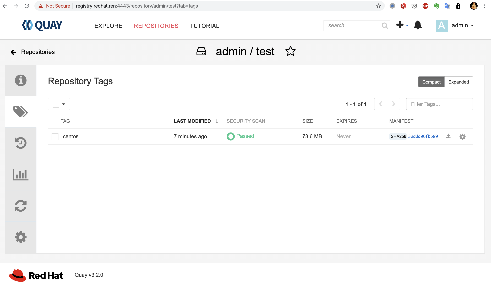

# Quay running in local dev mode with clair

https://github.com/zhangchl007/quay

https://github.com/quay/quay/blob/master/docs/development-container.md

https://access.redhat.com/documentation/en-us/red_hat_quay/3/html-single/deploy_red_hat_quay_-_basic/index

https://www.cnblogs.com/ericnie/p/12233269.html

https://access.redhat.com/documentation/en-us/red_hat_quay/3/html-single/manage_red_hat_quay/index#quay-security-scanner

```bash
cat << EOF >>  /etc/hosts
45.63.58.108 registry.redhat.ren
EOF

firewall-cmd --permanent --zone=public --add-port=4443/tcp
firewall-cmd --reload

yum install -y podman buildah skopeo

podman rm -fv $(podman ps -qa)
podman volume prune -f
podman pod rm -fa

podman pod create --name quay -p 4443:8443 

rm -rf /data/quay
mkdir -p /data/quay/storage
mkdir -p /data/quay/config
mkdir -p /data/quay/git
cd /data/quay/git

# yum install -y git
# git clone https://github.com/quay/quay
# cd /data/quay/git/quay
# git checkout 3.2.0-release

mkdir -p /data/quay/lib/mysql
chmod 777 /data/quay/lib/mysql
export MYSQL_CONTAINER_NAME=quay-mysql
export MYSQL_DATABASE=enterpriseregistrydb
export MYSQL_PASSWORD=zvbk3fzp5f5m2a8j
export MYSQL_USER=quayuser
export MYSQL_ROOT_PASSWORD=q98u335musckfqxe

podman run \
    --detach \
    --restart=always \
    --env MYSQL_ROOT_PASSWORD=${MYSQL_ROOT_PASSWORD} \
    --env MYSQL_USER=${MYSQL_USER} \
    --env MYSQL_PASSWORD=${MYSQL_PASSWORD} \
    --env MYSQL_DATABASE=${MYSQL_DATABASE} \
    --name ${MYSQL_CONTAINER_NAME} \
    --privileged=true \
    --pod quay \
    -v /data/quay/lib/mysql:/var/lib/mysql/data:Z \
    registry.access.redhat.com/rhscl/mysql-57-rhel7

mkdir -p /data/quay/lib/redis
chmod 777 /data/quay/lib/redis
podman run -d --restart=always \
    --pod quay \
    --privileged=true \
    --name quay-redis \
    -v  /data/quay/lib/redis:/var/lib/redis/data:Z \
    registry.access.redhat.com/rhscl/redis-32-rhel7

# test mysql
# yum install -y mariadb
# mysql -h registry.redhat.ren -u root --password=q98u335musckfqxe

# quay config
# podman login -u="redhat+quay" ****************
podman run --privileged=true \
    --name quay-config \
    --pod quay \
    --add-host mysql:127.0.0.1 \
    --add-host redis:127.0.0.1 \
    --add-host clair:127.0.0.1 \
    -d quay.io/redhat/quay:v3.2.0 config ka5tr4g3quzrwkq4
# login: quayconfig  /  ka5tr4g3quzrwkq4
# quay admin:  admin   /   5a4ru36a8zfr1gp8
# clair: security_scanner
# key id: 5b9c2160f3acefa7690edd93fbe013d9cf8e951815dfeb0828ae72c144159e1c

podman stop quay-config

# scp quay-config.tar.gz /data/quay/config/
# scp security_scanner.pem /data/quay/config/
cd /data/quay/config/
# wget https://github.com/wangzheng422/docker_env/raw/dev/redhat/ocp4/files/4.2/quay/quay-config.tar.gz
tar xvf quay-config.tar.gz

podman run --restart=always \
    --sysctl net.core.somaxconn=4096 \
    --privileged=true \
    --name quay-master \
    --pod quay \
    --add-host mysql:127.0.0.1 \
    --add-host redis:127.0.0.1 \
    --add-host clair:127.0.0.1 \
    -v /data/quay/config:/conf/stack:Z \
    -v /data/quay/storage:/datastorage:Z \
    -d quay.io/redhat/quay:v3.2.0

# clair
# https://access.redhat.com/documentation/en-us/red_hat_quay/3/html-single/manage_red_hat_quay/index#quay-security-scanner
mkdir -p /data/quay/clair-config
mkdir -p  /data/quay/lib/postgresql/data
chmod 777 /data/quay/lib/postgresql/data
podman run --name clair-postgres --pod quay \
    -v /data/quay/lib/postgresql/data:/var/lib/postgresql/data \
    -d docker.io/library/postgres
sleep 5
podman run --rm --pod quay docker.io/library/postgres \
   sh -c 'echo "create database clairtest" | psql -h \
   "127.0.0.1" -p  \
   "5432" -U postgres'

cat <<EOF >/data/quay/clair-config/config.yaml
clair:
  database:
    type: pgsql
    options:
      # A PostgreSQL Connection string pointing to the Clair Postgres database.
      # Documentation on the format can be found at: http://www.postgresql.org/docs/9.4/static/libpq-connect.html
      source: postgresql://postgres@127.0.0.1:5432/clairtest?sslmode=disable
      cachesize: 16384
  api:
    # The port at which Clair will report its health status. For example, if Clair is running at
    # https://clair.mycompany.com, the health will be reported at
    # http://clair.mycompany.com:6061/health.
    healthport: 6061

    port: 6062
    timeout: 900s

    # paginationkey can be any random set of characters. *Must be the same across all Clair instances*.
    paginationkey: "XxoPtCUzrUv4JV5dS+yQ+MdW7yLEJnRMwigVY/bpgtQ="

  updater:
    # interval defines how often Clair will check for updates from its upstream vulnerability databases.
    interval: 6h
    notifier:
      attempts: 3
      renotifyinterval: 1h
      http:
        # QUAY_ENDPOINT defines the endpoint at which Quay is running.
        # For example: https://myregistry.mycompany.com
        endpoint: https://registry.redhat.ren:4443/secscan/notify
        proxy: http://localhost:6063

jwtproxy:
  signer_proxy:
    enabled: true
    listen_addr: :6063
    ca_key_file: /certificates/mitm.key # Generated internally, do not change.
    ca_crt_file: /certificates/mitm.crt # Generated internally, do not change.
    signer:
      issuer: security_scanner
      expiration_time: 5m
      max_skew: 1m
      nonce_length: 32
      private_key:
        type: preshared
        options:
          # The ID of the service key generated for Clair. The ID is returned when setting up
          # the key in [Quay Setup](security-scanning.md)
          key_id: 5b9c2160f3acefa7690edd93fbe013d9cf8e951815dfeb0828ae72c144159e1c
          private_key_path: /clair/config/security_scanner.pem


  verifier_proxies:
  - enabled: true
    # The port at which Clair will listen.
    listen_addr: :6060

    # If Clair is to be served via TLS, uncomment these lines. See the "Running Clair under TLS"
    # section below for more information.
    # key_file: /clair/config/clair.key
    # crt_file: /clair/config/clair.crt

    verifier:
      # CLAIR_ENDPOINT is the endpoint at which this Clair will be accessible. Note that the port
      # specified here must match the listen_addr port a few lines above this.
      # Example: https://myclair.mycompany.com:6060
      audience: http://clair:6060

      upstream: http://localhost:6062
      key_server:
        type: keyregistry
        options:
          # QUAY_ENDPOINT defines the endpoint at which Quay is running.
          # Example: https://myregistry.mycompany.com
          registry: https://registry.redhat.ren:4443/keys/
EOF

/bin/cp -f /data/quay/config/ssl.cert /data/quay/clair-config/clair.crt
/bin/cp -f /data/quay/config/ssl.key /data/quay/clair-config/clair.key
/bin/cp -f /data/quay/config/extra_ca_certs/redhat.ren.crt /data/quay/clair-config/ca.crt
/bin/cp -f /data/quay/config/security_scanner.pem /data/quay/clair-config/

podman run --restart=always -d \
    --name clair \
    -v /data/quay/clair-config:/clair/config \
    -v /data/quay/clair-config/ca.crt:/etc/pki/ca-trust/source/anchors/ca.crt  \
    --pod quay \
    --add-host clair:127.0.0.1 \
    quay.io/redhat/clair-jwt:v3.2.0

podman stop clair
podman stop clair-postgres
podman stop quay-master
podman stop quay-redis
podman stop quay-mysql

cd /data
tar zcf quay.tgz quay/

buildah from --name onbuild-container docker.io/library/centos:centos7
buildah copy onbuild-container quay.tgz /
buildah umount onbuild-container 
buildah commit --rm --format=docker onbuild-container docker.io/wangzheng422/quay-fs:3.2.0-init
# buildah rm onbuild-container
buildah push docker.io/wangzheng422/quay-fs:3.2.0-init


```
可以看到，安全扫描已经生效。




## 以下是弯路
```bash
git clone https://github.com/zhangchl007/quay

ENCRYPTED_ROBOT_TOKEN_MIGRATION_PHASE=new-installation

bash self-cert-generate.sh redhat.ren quay.redhat.ren
sudo sh pre-quaydeploy.sh

docker-compose  -f docker-compose.config.yml  up -d

firewall-cmd --permanent --add-port=8443/tcp
firewall-cmd --reload
firewall-cmd --list-all

# username/password: quayconfig / redhat


```