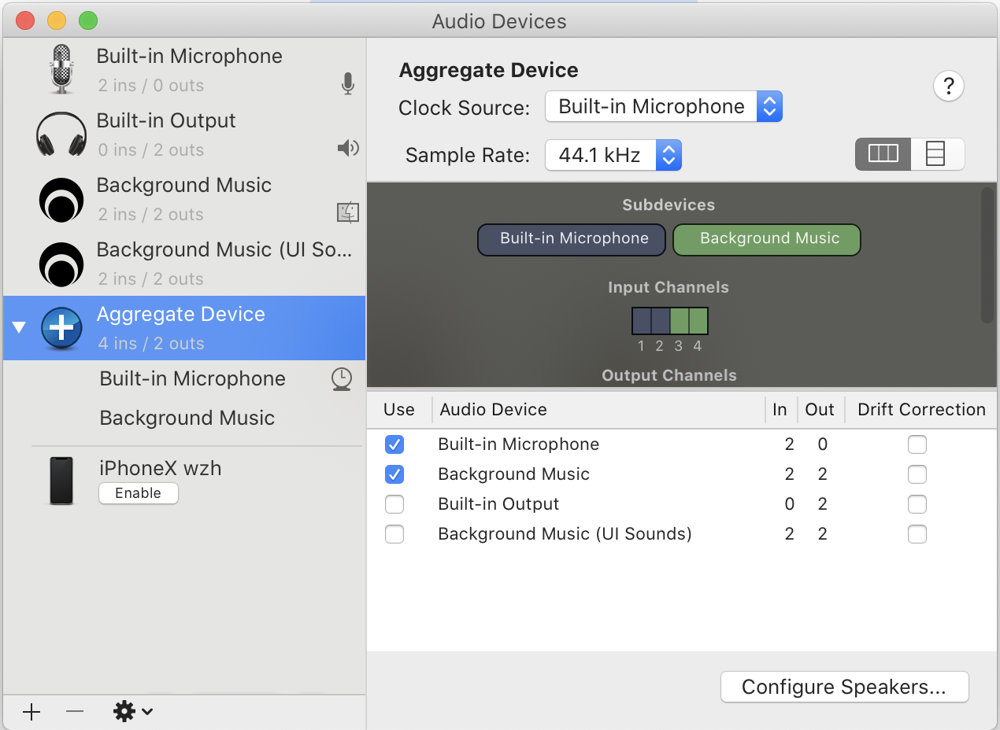
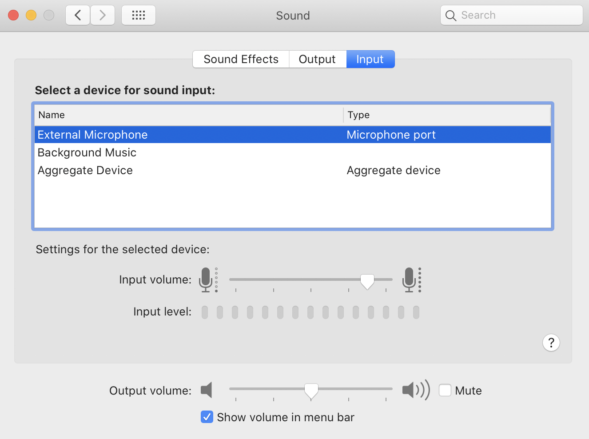

# OSX 系统如何录制系统声音

mac系统上，如何录制系统的声音一直是个问题。特别是现在开在线会议，有的时候想在mac上录下来，在mac系统上，默认是不可以的。windows系统上不存在这个问题，不知道为什么mac上面反而特别麻烦。

解决这个问题的方法，就是[BackgroundMusic](https://github.com/kyleneideck/BackgroundMusic)

首先，下载和安装 BackgroundMusic ， 这个按照官网的步骤完成就好。

然后，启动audio midi程序，配置一个aggregate device

确认一下系统的input, output设置

最后，我们开启录屏软件，输入设备选择aggregate device就可以了。
